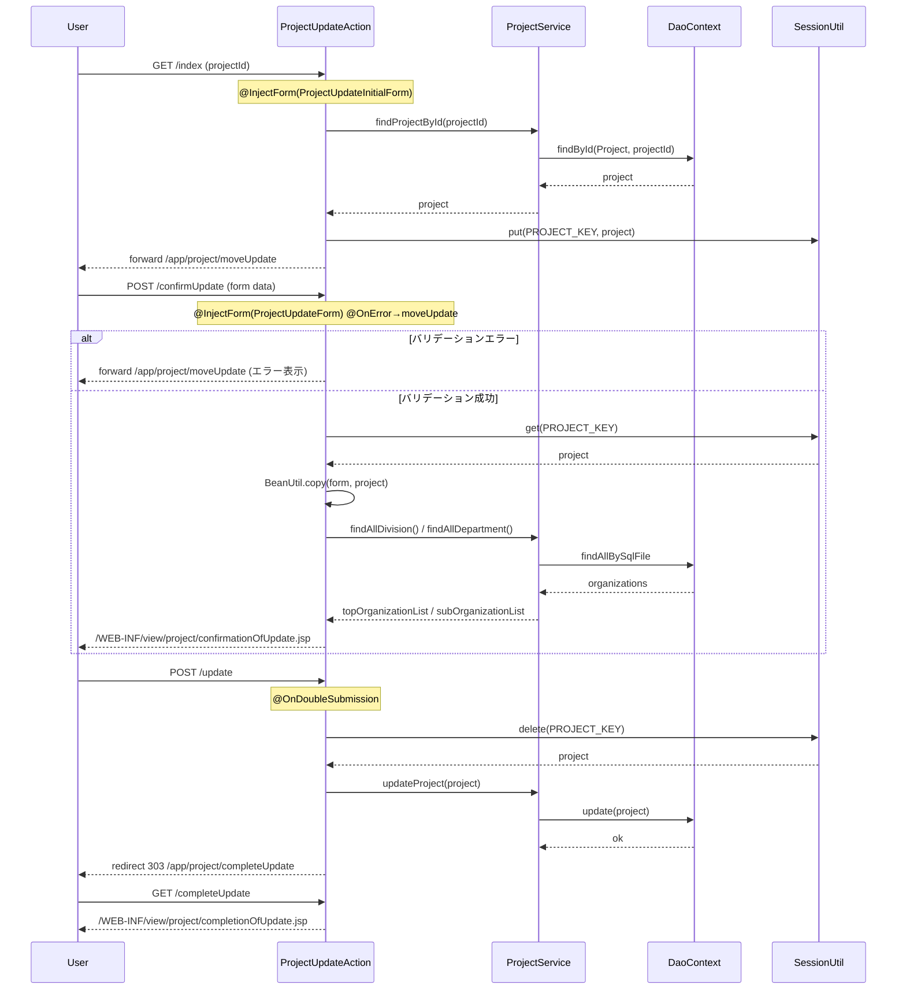

# Code Analysis: ProjectUpdateAction

**Generated**: 2026-03-13 18:02:19
**Target**: プロジェクト更新処理（更新画面表示・確認・更新実行・完了）
**Modules**: proman-web
**Analysis Duration**: approx. 3m 3s

---

## Overview

`ProjectUpdateAction` は proman-web モジュールのプロジェクト更新機能を担う Action クラスである。プロジェクト詳細画面からの遷移を受け付け、更新画面の表示・入力内容の確認・DB への更新実行・完了画面の表示という4ステップの画面遷移を制御する。

確認フロー中はセッションストアにプロジェクトエンティティを保持し、最終更新時に取り出して `ProjectService` 経由で DB に反映する。`@OnDoubleSubmission` により二重送信を防止し、更新完了後はリダイレクトでブラウザのリロード多重実行を防ぐ PRG パターンを採用している。

---

## Architecture

### Dependency Graph

```mermaid
classDiagram
    class ProjectUpdateAction
    class ProjectUpdateInitialForm {
        <<Form>>
    }
    class ProjectUpdateForm {
        <<Form>>
    }
    class ProjectService
    class Project {
        <<Entity>>
    }
    class Organization {
        <<Entity>>
    }
    class ExecutionContext {
        <<Nablarch>>
    }
    class SessionUtil {
        <<Nablarch>>
    }
    class BeanUtil {
        <<Nablarch>>
    }
    class DateUtil {
        <<Nablarch>>
    }
    class DaoContext {
        <<Nablarch>>
    }

    ProjectUpdateAction ..> ProjectUpdateInitialForm : validates (index)
    ProjectUpdateAction ..> ProjectUpdateForm : validates (confirmUpdate)
    ProjectUpdateAction ..> ProjectService : delegates to
    ProjectUpdateAction ..> SessionUtil : stores/retrieves entity
    ProjectUpdateAction ..> BeanUtil : copies form to entity
    ProjectUpdateAction ..> DateUtil : formats dates
    ProjectUpdateAction ..> ExecutionContext : reads/writes scope
    ProjectService ..> DaoContext : queries/updates
    ProjectService ..> Project : persists
    ProjectService ..> Organization : queries
    ProjectUpdateForm ..|> Serializable : implements
    ProjectUpdateInitialForm ..|> Serializable : implements
```



**Note**: This diagram uses Mermaid `classDiagram` syntax to show class names and their relationships. Use `--|>` for inheritance (extends/implements) and `..>` for dependencies (uses/creates).

### Component Summary

| Component | Role | Type | Dependencies |
|-----------|------|------|--------------|
| ProjectUpdateAction | プロジェクト更新の全画面遷移を制御 | Action | ProjectUpdateInitialForm, ProjectUpdateForm, ProjectService, SessionUtil, BeanUtil, DateUtil, ExecutionContext |
| ProjectUpdateInitialForm | 詳細画面からの遷移時プロジェクトID受付 | Form | なし |
| ProjectUpdateForm | 更新入力値受付・バリデーション | Form | DateRelationUtil |
| ProjectService | DB アクセスを集約するサービス層 | Service | DaoContext (UniversalDao) |
| Project | プロジェクトエンティティ | Entity | なし |
| Organization | 組織（事業部・部門）エンティティ | Entity | なし |

---

## Flow

### Processing Flow

プロジェクト更新は以下の4ステップで処理される。

1. **index（更新画面表示）**: 詳細画面からプロジェクトIDを受け取り（`ProjectUpdateInitialForm`）、DB からプロジェクトを取得。エンティティをセッションストアに保存し、フォームに変換して更新画面を表示する。
2. **confirmUpdate（確認画面表示）**: 入力値を `ProjectUpdateForm` でバリデーション。エラー時は更新画面へ戻る（`@OnError`）。正常時はフォームをセッション中のエンティティにコピーし確認画面を表示。事業部・部門リストを DB から再取得してリクエストスコープに設定する。
3. **update（更新実行）**: `@OnDoubleSubmission` で二重送信を防止。セッションからエンティティを取り出し（同時に削除）、`ProjectService.updateProject` で DB 更新。303 リダイレクトで完了画面へ遷移する。
4. **completeUpdate（完了画面表示）**: 完了 JSP を表示するのみ。

また、確認画面から入力画面に戻る操作（`backToEnterUpdate`）も提供しており、セッション中エンティティからフォームを再構築して更新画面へ内部フォワードする。

### Sequence Diagram



---

## Components

### ProjectUpdateAction

**ファイル**: [ProjectUpdateAction.java](../../.lw/nab-official/v5/nablarch-system-development-guide/Sample_Project/Source_Code/proman-project/proman-web/src/main/java/com/nablarch/example/proman/web/project/ProjectUpdateAction.java)

**役割**: プロジェクト更新の全画面遷移を管理する Action クラス。

**主要メソッド**:

- `index` (L35-43): `@InjectForm(ProjectUpdateInitialForm)` でプロジェクトIDを受け取り、DB からプロジェクトを取得してセッションに保存し更新画面を表示。
- `confirmUpdate` (L52-62): `@InjectForm(ProjectUpdateForm)` でバリデーション実行。成功時はフォームをエンティティにコピーして確認画面へ。
- `update` (L71-77): `@OnDoubleSubmission` 付き。セッションからエンティティを取り出し更新、303 リダイレクト。
- `completeUpdate` (L86-88): 完了 JSP を表示。
- `backToEnterUpdate` (L97-102): セッションのエンティティからフォームを再構築して更新画面へ戻る。
- `buildFormFromEntity` (L111-125): `BeanUtil.createAndCopy` でエンティティからフォームを生成し、日付フォーマットと組織情報を設定する private ヘルパー。
- `setOrganizationAndDivisionToRequestScope` (L148-158): 事業部・部門リストをリクエストスコープに設定する private ヘルパー。

**依存**: ProjectUpdateInitialForm, ProjectUpdateForm, ProjectService, SessionUtil, BeanUtil, DateUtil, ExecutionContext

---

### ProjectUpdateForm

**ファイル**: [ProjectUpdateForm.java](../../.lw/nab-official/v5/nablarch-system-development-guide/Sample_Project/Source_Code/proman-project/proman-web/src/main/java/com/nablarch/example/proman/web/project/ProjectUpdateForm.java)

**役割**: 更新画面の入力値を受け付けるフォームクラス。Bean Validation によるバリデーションルールを定義する。

**主要メソッド**:

- `isValidProjectPeriod` (L329-331): `@AssertTrue` でプロジェクト開始日・終了日の前後関係を `DateRelationUtil` で検証するカスタムバリデーション。

**依存**: DateRelationUtil (プロジェクト内ユーティリティ)

---

### ProjectUpdateInitialForm

**ファイル**: [ProjectUpdateInitialForm.java](../../.lw/nab-official/v5/nablarch-system-development-guide/Sample_Project/Source_Code/proman-project/proman-web/src/main/java/com/nablarch/example/proman/web/project/ProjectUpdateInitialForm.java)

**役割**: 詳細画面から更新画面への遷移時にプロジェクトIDのみを受け取るシンプルなフォーム。

**依存**: なし

---

### ProjectService

**ファイル**: [ProjectService.java](../../.lw/nab-official/v5/nablarch-system-development-guide/Sample_Project/Source_Code/proman-project/proman-web/src/main/java/com/nablarch/example/proman/web/project/ProjectService.java)

**役割**: プロジェクト・組織に関する DB アクセスを集約するサービスクラス。

**主要メソッド**:

- `findProjectById` (L124-126): `DaoContext.findById` でプロジェクトを主キー検索。
- `updateProject` (L89-91): `DaoContext.update` でプロジェクトを更新（楽観的ロック適用）。
- `findAllDivision` / `findAllDepartment` (L50-61): SQL ファイルを指定して事業部・部門一覧を取得。
- `findOrganizationById` (L70-73): 主キーで組織を1件取得。

**依存**: DaoContext (UniversalDao), Project (Entity), Organization (Entity)

---

## Nablarch Framework Usage

### @InjectForm / InjectForm

**クラス**: `nablarch.common.web.interceptor.InjectForm`

**説明**: ハンドラチェーン上でフォームクラスへのバインドと Bean Validation を自動実行するインターセプタアノテーション。

**使用方法**:
```java
@InjectForm(form = ProjectUpdateForm.class, prefix = "form")
@OnError(type = ApplicationException.class, path = "forward:///app/project/moveUpdate")
public HttpResponse confirmUpdate(HttpRequest request, ExecutionContext context) {
    ProjectUpdateForm form = context.getRequestScopedVar("form");
    // バリデーション済みフォームを使用
}
```

**重要ポイント**:
- ✅ **フォームは `Serializable` を実装**: `@InjectForm` でバインドされるフォームは Serializable インタフェースを実装する必要がある。
- ⚠️ **`prefix` 属性**: リクエストパラメータのプレフィックス（例: `form.projectName`）を指定する。省略時はプレフィックスなし。
- 💡 **バリデーション結果は `ApplicationException`**: バリデーションエラーは `ApplicationException` としてスローされるため、`@OnError` と組み合わせてエラー画面を指定する。

**このコードでの使い方**:
- `index` メソッドでは `ProjectUpdateInitialForm`（プレフィックスなし）でプロジェクトIDのみ受付。
- `confirmUpdate` メソッドでは `ProjectUpdateForm`（`prefix = "form"`）で更新入力値を受付・バリデーション。

**詳細**: [Web Application Client Create2](../../.claude/skills/nabledge-5/docs/processing-pattern/web-application/web-application-client_create2.md)

---

### SessionUtil

**クラス**: `nablarch.common.web.session.SessionUtil`

**説明**: セッションストアへのエンティティの保存・取得・削除を行うユーティリティクラス。

**使用方法**:
```java
// 保存
SessionUtil.put(context, PROJECT_KEY, project);
// 取得
Project project = SessionUtil.get(context, PROJECT_KEY);
// 取得後削除
Project project = SessionUtil.delete(context, PROJECT_KEY);
```

**重要ポイント**:
- ✅ **セッションにはフォームを格納しない**: フォームではなく `BeanUtil.copy` / `BeanUtil.createAndCopy` でエンティティに変換してから格納する。
- 💡 **楽観的ロックのための保持**: 編集開始時のエンティティをセッションに保持することで、確認画面経由でも楽観的ロック用バージョンが保持される。
- ⚠️ **更新実行時は `delete` を使用**: `SessionUtil.delete` で取り出すと同時にセッションから削除されるため、処理完了後のセッション残留を防ぐ。

**このコードでの使い方**:
- `index` メソッドで DB から取得したプロジェクトエンティティを `PROJECT_KEY` でセッションに保存。
- `confirmUpdate` メソッドで `get` して BeanUtil.copy でフォームの値を反映。
- `update` メソッドで `delete` してエンティティを取り出し DB 更新。

**詳細**: [Web Application Getting Started Project Update](../../.claude/skills/nabledge-5/docs/processing-pattern/web-application/web-application-getting-started-project-update.md)

---

### @OnDoubleSubmission

**クラス**: `nablarch.common.web.token.OnDoubleSubmission`

**説明**: 同一トークンの二重送信を検知してエラー画面へ遷移させるサーバサイド二重送信防止アノテーション。

**使用方法**:
```java
@OnDoubleSubmission
public HttpResponse update(HttpRequest request, ExecutionContext context) {
    // このメソッドが二重に呼ばれた場合はエラー画面へ遷移する
}
```

**重要ポイント**:
- ✅ **JSP 側と組み合わせる**: JSP の `<n:form useToken="true">` と `allowDoubleSubmission="false"` 属性と組み合わせてクライアント・サーバ両方で制御する。
- ⚠️ **デフォルトエラー画面**: デフォルトのエラー遷移先はコンポーネント設定で定義する。独自画面への遷移は `path` 属性で指定。
- 💡 **PRG パターンとの組み合わせ**: `@OnDoubleSubmission` + 303 リダイレクトで二重送信とブラウザリロードによる多重実行の両方を防ぐ。

**このコードでの使い方**:
- `update` メソッドに付与し、確認画面からの二重送信（ブラウザの「戻る」→再送信）を防止。

**詳細**: [Web Application Client Create4](../../.claude/skills/nabledge-5/docs/processing-pattern/web-application/web-application-client_create4.md)

---

### BeanUtil

**クラス**: `nablarch.core.beans.BeanUtil`

**説明**: JavaBean 間のプロパティコピーを行うユーティリティ。同名プロパティを型変換しながら一括コピーする。

**使用方法**:
```java
// 既存 Bean へコピー
BeanUtil.copy(form, project);
// 新規 Bean を生成してコピー
ProjectUpdateForm form = BeanUtil.createAndCopy(ProjectUpdateForm.class, project);
```

**重要ポイント**:
- ✅ **フォームからエンティティへの変換に使用**: セッションに格納する前にフォームをエンティティへ変換する際に利用する。
- ⚠️ **型変換に注意**: String → Date など型が異なるプロパティは自動変換されないことがある。`buildFormFromEntity` では日付を `DateUtil.formatDate` で手動変換している。
- 💡 **コードの簡潔化**: 多数のプロパティを持つフォーム/エンティティ間のコピーをボイラープレートなしに記述できる。

**このコードでの使い方**:
- `buildFormFromEntity`（L112）: `BeanUtil.createAndCopy` でエンティティから `ProjectUpdateForm` を生成。
- `confirmUpdate`（L57）: `BeanUtil.copy(form, project)` でフォームの値をセッション中エンティティに反映。

**詳細**: [Web Application Getting Started Project Update](../../.claude/skills/nabledge-5/docs/processing-pattern/web-application/web-application-getting-started-project-update.md)

---

## References

### Source Files

- [ProjectUpdateAction.java (.lw/nab-official/v5/nablarch-system-development-guide/en/Sample_Project/Source_Code/proman-project/proman-web/src/main/java/com/nablarch/example/proman/web/project)](../../.lw/nab-official/v5/nablarch-system-development-guide/en/Sample_Project/Source_Code/proman-project/proman-web/src/main/java/com/nablarch/example/proman/web/project/ProjectUpdateAction.java) - ProjectUpdateAction
- [ProjectUpdateAction.java (.lw/nab-official/v5/nablarch-system-development-guide/Sample_Project/Source_Code/proman-project/proman-web/src/main/java/com/nablarch/example/proman/web/project)](../../.lw/nab-official/v5/nablarch-system-development-guide/Sample_Project/Source_Code/proman-project/proman-web/src/main/java/com/nablarch/example/proman/web/project/ProjectUpdateAction.java) - ProjectUpdateAction
- [ProjectUpdateAction.java (.lw/nab-official/v6/nablarch-system-development-guide/en/Sample_Project/Source_Code/proman-project/proman-web/src/main/java/com/nablarch/example/proman/web/project)](../../.lw/nab-official/v6/nablarch-system-development-guide/en/Sample_Project/Source_Code/proman-project/proman-web/src/main/java/com/nablarch/example/proman/web/project/ProjectUpdateAction.java) - ProjectUpdateAction
- [ProjectUpdateAction.java (.lw/nab-official/v6/nablarch-system-development-guide/Sample_Project/Source_Code/proman-project/proman-web/src/main/java/com/nablarch/example/proman/web/project)](../../.lw/nab-official/v6/nablarch-system-development-guide/Sample_Project/Source_Code/proman-project/proman-web/src/main/java/com/nablarch/example/proman/web/project/ProjectUpdateAction.java) - ProjectUpdateAction
- [ProjectUpdateForm.java (.lw/nab-official/v5/nablarch-system-development-guide/en/Sample_Project/Source_Code/proman-project/proman-web/src/main/java/com/nablarch/example/proman/web/project)](../../.lw/nab-official/v5/nablarch-system-development-guide/en/Sample_Project/Source_Code/proman-project/proman-web/src/main/java/com/nablarch/example/proman/web/project/ProjectUpdateForm.java) - ProjectUpdateForm
- [ProjectUpdateForm.java (.lw/nab-official/v5/nablarch-system-development-guide/Sample_Project/Source_Code/proman-project/proman-web/src/main/java/com/nablarch/example/proman/web/project)](../../.lw/nab-official/v5/nablarch-system-development-guide/Sample_Project/Source_Code/proman-project/proman-web/src/main/java/com/nablarch/example/proman/web/project/ProjectUpdateForm.java) - ProjectUpdateForm
- [ProjectUpdateForm.java (.lw/nab-official/v6/nablarch-system-development-guide/en/Sample_Project/Source_Code/proman-project/proman-web/src/main/java/com/nablarch/example/proman/web/project)](../../.lw/nab-official/v6/nablarch-system-development-guide/en/Sample_Project/Source_Code/proman-project/proman-web/src/main/java/com/nablarch/example/proman/web/project/ProjectUpdateForm.java) - ProjectUpdateForm
- [ProjectUpdateForm.java (.lw/nab-official/v6/nablarch-system-development-guide/Sample_Project/Source_Code/proman-project/proman-web/src/main/java/com/nablarch/example/proman/web/project)](../../.lw/nab-official/v6/nablarch-system-development-guide/Sample_Project/Source_Code/proman-project/proman-web/src/main/java/com/nablarch/example/proman/web/project/ProjectUpdateForm.java) - ProjectUpdateForm
- [ProjectUpdateInitialForm.java (.lw/nab-official/v5/nablarch-system-development-guide/en/Sample_Project/Source_Code/proman-project/proman-web/src/main/java/com/nablarch/example/proman/web/project)](../../.lw/nab-official/v5/nablarch-system-development-guide/en/Sample_Project/Source_Code/proman-project/proman-web/src/main/java/com/nablarch/example/proman/web/project/ProjectUpdateInitialForm.java) - ProjectUpdateInitialForm
- [ProjectUpdateInitialForm.java (.lw/nab-official/v5/nablarch-system-development-guide/Sample_Project/Source_Code/proman-project/proman-web/src/main/java/com/nablarch/example/proman/web/project)](../../.lw/nab-official/v5/nablarch-system-development-guide/Sample_Project/Source_Code/proman-project/proman-web/src/main/java/com/nablarch/example/proman/web/project/ProjectUpdateInitialForm.java) - ProjectUpdateInitialForm
- [ProjectUpdateInitialForm.java (.lw/nab-official/v6/nablarch-system-development-guide/en/Sample_Project/Source_Code/proman-project/proman-web/src/main/java/com/nablarch/example/proman/web/project)](../../.lw/nab-official/v6/nablarch-system-development-guide/en/Sample_Project/Source_Code/proman-project/proman-web/src/main/java/com/nablarch/example/proman/web/project/ProjectUpdateInitialForm.java) - ProjectUpdateInitialForm
- [ProjectUpdateInitialForm.java (.lw/nab-official/v6/nablarch-system-development-guide/Sample_Project/Source_Code/proman-project/proman-web/src/main/java/com/nablarch/example/proman/web/project)](../../.lw/nab-official/v6/nablarch-system-development-guide/Sample_Project/Source_Code/proman-project/proman-web/src/main/java/com/nablarch/example/proman/web/project/ProjectUpdateInitialForm.java) - ProjectUpdateInitialForm
- [ProjectService.java (.lw/nab-official/v5/nablarch-system-development-guide/en/Sample_Project/Source_Code/proman-project/proman-web/src/main/java/com/nablarch/example/proman/web/project)](../../.lw/nab-official/v5/nablarch-system-development-guide/en/Sample_Project/Source_Code/proman-project/proman-web/src/main/java/com/nablarch/example/proman/web/project/ProjectService.java) - ProjectService
- [ProjectService.java (.lw/nab-official/v5/nablarch-system-development-guide/Sample_Project/Source_Code/proman-project/proman-web/src/main/java/com/nablarch/example/proman/web/project)](../../.lw/nab-official/v5/nablarch-system-development-guide/Sample_Project/Source_Code/proman-project/proman-web/src/main/java/com/nablarch/example/proman/web/project/ProjectService.java) - ProjectService
- [ProjectService.java (.lw/nab-official/v6/nablarch-system-development-guide/en/Sample_Project/Source_Code/proman-project/proman-web/src/main/java/com/nablarch/example/proman/web/project)](../../.lw/nab-official/v6/nablarch-system-development-guide/en/Sample_Project/Source_Code/proman-project/proman-web/src/main/java/com/nablarch/example/proman/web/project/ProjectService.java) - ProjectService
- [ProjectService.java (.lw/nab-official/v6/nablarch-system-development-guide/Sample_Project/Source_Code/proman-project/proman-web/src/main/java/com/nablarch/example/proman/web/project)](../../.lw/nab-official/v6/nablarch-system-development-guide/Sample_Project/Source_Code/proman-project/proman-web/src/main/java/com/nablarch/example/proman/web/project/ProjectService.java) - ProjectService

### Knowledge Base (Nabledge-5)

- [Web Application Getting Started Project Update](../../.claude/skills/nabledge-5/docs/processing-pattern/web-application/web-application-getting-started-project-update.md)
- [Web Application Client_create4](../../.claude/skills/nabledge-5/docs/processing-pattern/web-application/web-application-client_create4.md)
- [Web Application Client_create2](../../.claude/skills/nabledge-5/docs/processing-pattern/web-application/web-application-client_create2.md)

### Official Documentation


- [BeanUtil](https://nablarch.github.io/docs/LATEST/javadoc/nablarch/core/beans/BeanUtil.html)
- [Client Create2](https://nablarch.github.io/docs/LATEST/doc/application_framework/application_framework/web/getting_started/client_create/client_create2.html)
- [Client Create4](https://nablarch.github.io/docs/LATEST/doc/application_framework/application_framework/web/getting_started/client_create/client_create4.html)
- [Index](https://nablarch.github.io/docs/LATEST/doc/application_framework/application_framework/web/getting_started/project_update/index.html)
- [InjectForm](https://nablarch.github.io/docs/LATEST/javadoc/nablarch/common/web/interceptor/InjectForm.html)
- [NoDataException](https://nablarch.github.io/docs/LATEST/javadoc/nablarch/common/dao/NoDataException.html)
- [OnDoubleSubmission](https://nablarch.github.io/docs/LATEST/javadoc/nablarch/common/web/token/OnDoubleSubmission.html)
- [OnError](https://nablarch.github.io/docs/LATEST/javadoc/nablarch/fw/web/interceptor/OnError.html)
- [Required](https://nablarch.github.io/docs/LATEST/javadoc/nablarch/core/validation/ee/Required.html)
- [ResourceLocator](https://nablarch.github.io/docs/LATEST/javadoc/nablarch/fw/web/ResourceLocator.html)
- [SessionUtil](https://nablarch.github.io/docs/LATEST/javadoc/nablarch/common/web/session/SessionUtil.html)
- [UniversalDao](https://nablarch.github.io/docs/LATEST/javadoc/nablarch/common/dao/UniversalDao.html)

---

**Note**: This documentation was generated by the code-analysis workflow of the nabledge-5 skill.
