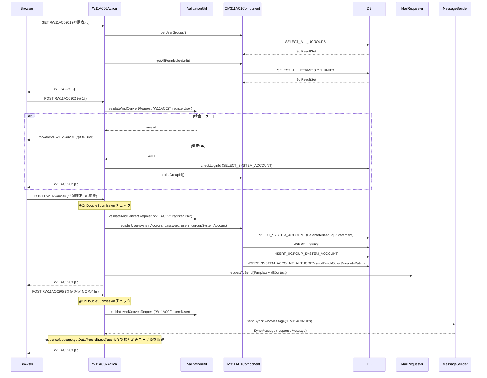

# Code Analysis: W11AC02Action

**Generated**: 2026-03-30 15:35:55
**Target**: ユーザー情報登録機能のアクションクラス
**Modules**: nablarch-sample-ss11AC
**Analysis Duration**: approx. 3m 53s

---

## Overview

`W11AC02Action` はNablarch 1.2サンプルアプリケーションにおけるユーザー情報登録機能のアクションクラスである。`DbAccessSupport` を継承し、以下の5つのHTTPハンドラメソッドを提供する。

- `doRW11AC0201`: ユーザー登録画面の初期表示
- `doRW11AC0202`: 確認画面への遷移（入力精査付き）
- `doRW11AC0203`: 登録画面への戻り（入力精査付き）
- `doRW11AC0204`: ユーザー登録実行（DB直接登録）+ メール送信
- `doRW11AC0205`: ユーザー登録実行（MOMメッセージング経由）

`doRW11AC0204` と `doRW11AC0205` は二重サブミット防止のため `@OnDoubleSubmission` アノテーションが付与されている。DB登録処理は `CM311AC1Component` に委譲する設計で、ビジネスロジックを分離している。

---

## Architecture

### Dependency Graph

```mermaid
classDiagram
    class W11AC02Action {
        <<Action>>
    }
    class DbAccessSupport {
        <<Nablarch>>
    }
    class W11AC02Form {
        <<Form>>
    }
    class CM311AC1Component {
        <<Component>>
    }
    class SystemAccountEntity {
        <<Entity>>
    }
    class UsersEntity {
        <<Entity>>
    }
    class UgroupSystemAccountEntity {
        <<Entity>>
    }
    class W11AC01SearchForm {
        <<Form>>
    }
    class ValidationUtil {
        <<Nablarch>>
    }
    class TemplateMailContext {
        <<Nablarch>>
    }
    class MailRequester {
        <<Nablarch>>
    }
    class MessageSender {
        <<Nablarch>>
    }
    class SyncMessage {
        <<Nablarch>>
    }

    W11AC02Action --|> DbAccessSupport : extends
    CM311AC1Component --|> DbAccessSupport : extends
    W11AC02Action ..> W11AC02Form : validates
    W11AC02Action ..> CM311AC1Component : delegates to
    W11AC02Action ..> ValidationUtil : uses
    W11AC02Action ..> TemplateMailContext : creates
    W11AC02Action ..> MailRequester : invokes
    W11AC02Action ..> MessageSender : invokes
    W11AC02Action ..> SyncMessage : creates
    W11AC02Form ..> SystemAccountEntity : contains
    W11AC02Form ..> UsersEntity : contains
    W11AC02Form ..> UgroupSystemAccountEntity : contains
    CM311AC1Component ..> SystemAccountEntity : persists
    CM311AC1Component ..> UsersEntity : persists
    CM311AC1Component ..> UgroupSystemAccountEntity : persists
```



**Note**: This diagram uses Mermaid `classDiagram` syntax to show class names and their relationships. Use `--|>` for inheritance (extends/implements) and `..>` for dependencies (uses/creates).

### Component Summary

| Component | Role | Type | Dependencies |
|-----------|------|------|--------------|
| W11AC02Action | ユーザー登録機能のHTTPリクエスト処理 | Action | W11AC02Form, CM311AC1Component, ValidationUtil, MailRequester, MessageSender |
| W11AC02Form | ユーザー登録フォームの入力精査 | Form | SystemAccountEntity, UsersEntity, UgroupSystemAccountEntity, ValidationUtil |
| CM311AC1Component | ユーザー管理機能の共通DBアクセスコンポーネント | Component | DbAccessSupport, SystemAccountEntity, UsersEntity, UgroupSystemAccountEntity |
| SystemAccountEntity | システムアカウントテーブルのエンティティ | Entity | なし |
| UsersEntity | ユーザーテーブルのエンティティ | Entity | なし |
| UgroupSystemAccountEntity | グループシステムアカウントテーブルのエンティティ | Entity | なし |
| W11AC01SearchForm | ユーザー検索フォーム（登録後の引継ぎに使用） | Form | SystemAccountEntity |

---

## Flow

### Processing Flow

ユーザー登録処理は入力 → 確認 → 完了の3画面遷移で構成される。

1. **初期表示** (`doRW11AC0201`): グループ情報・認可単位情報を取得しリクエストスコープに設定、登録画面 (W11AC0201.jsp) を返す
2. **確認画面遷移** (`doRW11AC0202`): 入力値を精査し、エラーがなければ確認画面 (W11AC0202.jsp) へ遷移。精査エラーは `@OnError` で登録画面に戻る
3. **登録画面戻り** (`doRW11AC0203`): 確認画面から登録画面へ戻る（再精査実施）
4. **登録確定（DB直接）** (`doRW11AC0204`): 精査後、`CM311AC1Component.registerUser()` でDB登録し、登録ユーザーにメール送信要求を行い完了画面へ遷移。`@OnDoubleSubmission` で二重サブミット防止
5. **登録確定（MOMメッセージング）** (`doRW11AC0205`): 精査後、`MessageSender.sendSync()` で同期メッセージ送信によりバッチ側でDB登録し、応答電文のユーザIDを取得して完了画面へ遷移

### Sequence Diagram



---

## Components

### W11AC02Action

**File**: [W11AC02Action.java](../../.lw/nab-official/v1.2/tutorial/main/java/nablarch/sample/ss11AC/W11AC02Action.java)

**Role**: ユーザー情報登録機能の全リクエストを処理するアクションクラス。`DbAccessSupport` を継承し、ログインIDの重複チェックに直接 `SqlPStatement` を使用する。

**Key Methods**:
- `doRW11AC0201(L52-58)`: 初期表示。`setUpViewData()` でグループ・認可単位情報をスコープに設定
- `doRW11AC0204(L107-130)`: ユーザー登録確定。精査 → エンティティ取得 → `CM311AC1Component.registerUser()` → メール送信 → 完了画面
- `doRW11AC0205(L246-290)`: MOMメッセージング経由のユーザー登録。`MessageSender.sendSync()` で同期送信し応答からユーザIDを取得
- `validate(L186-217)`: 入力精査（`registerUser` グループ）、ログインID重複チェック、グループID・認可単位IDの存在チェック
- `validateForSendUser(L300-317)`: MOM用入力精査（`sendUser` グループ、パスワード等を除外）
- `checkLoginId(L224-232)`: `getSqlPStatement("SELECT_SYSTEM_ACCOUNT")` でログインID重複チェック
- `sendMailToRegisteredUser(L138-159)`: `TemplateMailContext` を構築して `MailRequester.requestToSend()` で送信要求
- `setUpViewData(L166-176)`: `CM311AC1Component` 経由でグループ情報・認可単位情報を取得し `ExecutionContext` に設定

**Dependencies**: W11AC02Form, CM311AC1Component, ValidationUtil, MailUtil/MailRequester, MessageSender, SystemAccountEntity, UsersEntity, DbAccessSupport

---

### W11AC02Form

**File**: [W11AC02Form.java](../../.lw/nab-official/v1.2/tutorial/main/java/nablarch/sample/ss11AC/W11AC02Form.java)

**Role**: ユーザー登録画面の入力フォームクラス。EntityをプロパティとしてもちNablarch精査フレームワークと連携する。

**Key Methods**:
- `validateForRegister(L165-177)`: `@ValidateFor("registerUser")` — 全プロパティを精査対象とし、パスワード一致チェックを追加
- `validateForSend(L185-188)`: `@ValidateFor("sendUser")` — パスワード・グループ情報を精査対象外として絞り込み

**Dependencies**: SystemAccountEntity, UsersEntity, UgroupSystemAccountEntity, ValidationUtil

---

### CM311AC1Component

**File**: [CM311AC1Component.java](../../.lw/nab-official/v1.2/tutorial/main/java/nablarch/sample/ss11AC/CM311AC1Component.java)

**Role**: ユーザー管理機能の機能内共通DBアクセスコンポーネント。`DbAccessSupport` を継承し、SQLファイルのSQL_IDを使用してDBアクセスを実装する。

**Key Methods**:
- `registerUser(L97-139)`: ユーザーID採番 → システムアカウント登録 → ユーザー登録 → グループシステムアカウント登録 → 権限登録
- `registerSystemAccountAuthority(L184-196)`: `addBatchObject()` / `executeBatch()` によるバッチ挿入で権限を一括登録
- `getUserGroups(L42-45)`: グループ情報一覧取得（`SELECT_ALL_UGROUPS`）
- `existGroupId(L63-69)`: グループIDの存在チェック
- `existPermissionUnitId(L77-87)`: 認可単位IDの存在チェック（全権限IDを順にチェック）

**Dependencies**: DbAccessSupport, SystemAccountEntity, UsersEntity, UgroupSystemAccountEntity, BusinessDateUtil, IdGeneratorUtil, AuthenticationUtil

---

## Nablarch Framework Usage

### ValidationUtil / ValidationContext

**Class**: `nablarch.core.validation.ValidationUtil`, `nablarch.core.validation.ValidationContext`

**Description**: リクエストパラメータをFormクラスにバインドし、アノテーションに基づく入力精査を実行するNablarchコアライブラリ

**Usage**:
```java
ValidationContext<W11AC02Form> context = ValidationUtil.validateAndConvertRequest(
    "W11AC02", W11AC02Form.class, req, "registerUser");
if (!context.isValid()) {
    throw new ApplicationException(context.getMessages());
}
W11AC02Form form = context.createObject();
```

**Important points**:
- ✅ **第4引数のグループ名**: `@ValidateFor("registerUser")` のアノテーション値と一致させること。グループ名によって呼び出す精査メソッドが決まる
- ✅ **精査エラー時は必ず例外をthrow**: `context.getMessages()` を引数に `ApplicationException` をthrowし、`@OnError` で遷移先を制御する
- 💡 **Entityを含むFormの精査**: FormがEntityをプロパティとしてもつ場合、各EntityクラスにもForm同名の `@ValidateFor` メソッドを実装することでネストした精査が自動実行される
- ⚠️ **処理ごとに精査グループを分ける**: `registerUser` と `sendUser` のように処理ごとに精査グループを用意し、精査対象プロパティを切り替える（`validateWithout` で除外指定）

**Usage in this code**:
- `validate()` (L189-190) で `registerUser` グループの精査
- `validateForSendUser()` (L303-304) で `sendUser` グループの精査（パスワード等を `validateWithout` で除外）

**Details**: [Web Application 04_validation](../../.claude/skills/nabledge-1.2/docs/guide/web-application/web-application-04_validation.md)

---

### DbAccessSupport / SqlPStatement

**Class**: `nablarch.core.db.support.DbAccessSupport`, `nablarch.core.db.statement.SqlPStatement`

**Description**: SQLファイルに定義したSQL_IDを使ってPreparedStatementを生成し、DBアクセスを実行するNablarchのDBアクセス基底クラス

**Usage**:
```java
// SqlPStatement (パラメータ個別設定)
SqlPStatement statement = getSqlPStatement("SELECT_SYSTEM_ACCOUNT");
statement.setString(1, loginId);
SqlResultSet result = statement.retrieve();

// ParameterizedSqlPStatement (エンティティ一括設定)
ParameterizedSqlPStatement statement = getParameterizedSqlStatement("INSERT_SYSTEM_ACCOUNT");
statement.executeUpdateByObject(systemAccount);
```

**Important points**:
- ✅ **SQLファイルのSQL_ID**: SQLはJavaクラスと同名の `.sql` ファイルに `SQL_ID=` 形式で定義する
- 💡 **ParameterizedSqlPStatement**: エンティティのフィールド名 `:フィールド名` でSQL中に値をバインドするため、項目数が多い場合も `executeUpdateByObject(entity)` 一発で登録できる
- ⚠️ **バッチ挿入**: `addBatchObject()` を繰り返し呼んで `executeBatch()` で一括実行する。大量データの場合は途中で `executeBatch()` を挟むこと（メモリ不足防止）
- ⚠️ **重複キー例外**: `executeUpdateByObject()` は重複キー時に `DuplicateStatementException` をthrowする。必要に応じてキャッチして `ApplicationException` に変換する（CM311AC1Component.registerSystemAccount L148-155 参照）

**Usage in this code**:
- `W11AC02Action.checkLoginId()` (L225-226) で `getSqlPStatement("SELECT_SYSTEM_ACCOUNT")` によるログインID重複チェック
- `CM311AC1Component` 全体でDBアクセスを担当

**Details**: [Web Application 07_insert](../../.claude/skills/nabledge-1.2/docs/guide/web-application/web-application-07_insert.md)

---

### MailRequester / TemplateMailContext

**Class**: `nablarch.common.mail.MailRequester`, `nablarch.common.mail.TemplateMailContext`

**Description**: メール送信要求APIおよび定型メール送信要求データオブジェクト。`MailRequester.requestToSend()` でメール送信要求をテーブルに登録し、常駐バッチ（`MailSender`）が実際の送信を担う非同期方式

**Usage**:
```java
TemplateMailContext tmctx = new TemplateMailContext();
tmctx.setFrom(SystemRepository.getString("defaultFromMailAddress"));
tmctx.addTo(user.getMailAddress());
tmctx.setTemplateId(USER_REGISTERED_MAIL_TEMPLATE_ID);
tmctx.setLang(USER_LANG);
tmctx.setReplaceKeyValue("kanjiName", user.getKanjiName());
tmctx.setReplaceKeyValue("loginId", systemAccount.getLoginId());
MailRequester mailRequester = MailUtil.getMailRequester();
mailRequester.requestToSend(tmctx);
```

**Important points**:
- ✅ **送信元アドレスは `SystemRepository` から取得**: `SystemRepository.getString("defaultFromMailAddress")` で設定ファイルの値を使う
- ✅ **テンプレートIDと言語を設定**: `setTemplateId()` と `setLang()` は必須
- 💡 **非同期方式**: `requestToSend()` はメール送信要求テーブルに登録するだけで、実際の送信は別プロセス（常駐バッチ）が担う
- 💡 **プレースホルダ置換**: `setReplaceKeyValue(key, value)` でメールテンプレート本文内のプレースホルダを置換できる

**Usage in this code**:
- `sendMailToRegisteredUser()` (L138-159) でユーザー登録完了時に定型メール送信要求を実行

**Details**: [Libraries Mail](../../.claude/skills/nabledge-1.2/docs/component/libraries/libraries-mail.md)

---

### MessageSender / SyncMessage (@OnDoubleSubmission)

**Class**: `nablarch.fw.messaging.MessageSender`, `nablarch.fw.messaging.SyncMessage`
**Annotation**: `nablarch.common.web.token.OnDoubleSubmission`

**Description**: `MessageSender.sendSync()` はMOMメッセージングによる同期応答送信機能。`@OnDoubleSubmission` はトークンベースの二重サブミット防止アノテーション

**Usage**:
```java
@OnDoubleSubmission(path = "forward://RW11AC0201")
public HttpResponse doRW11AC0205(HttpRequest req, ExecutionContext ctx) {
    SyncMessage responseMessage = MessageSender.sendSync(
        new SyncMessage("RM11AC0201").addDataRecord(dataRecord));
    String userId = (String) responseMessage.getDataRecord().get("userId");
}
```

**Important points**:
- ✅ **`@OnDoubleSubmission` は確定処理メソッドに必須**: 登録・更新・削除などの確定処理に付与して二重サブミットを防ぐ
- ⚠️ **`MessagingException` のハンドリング**: 通信エラーは業務エラーとして扱い、ユーザーに再試行を促す（L274-278 参照）
- ⚠️ **フォーマット定義ファイルの命名規約**: 要求電文は `リクエストID_SEND.fmt`、応答電文は `リクエストID_RECEIVE.fmt`
- 💡 **応答電文からのデータ取得**: `responseMessage.getDataRecord().get("key")` でバッチ側で採番した値（ユーザIDなど）を受け取れる

**Usage in this code**:
- `doRW11AC0204(L106)` と `doRW11AC0205(L245)` に `@OnDoubleSubmission` を付与
- `doRW11AC0205(L272-273)` で `MessageSender.sendSync()` による同期メッセージ送信

**Details**: [Mom Messaging 03_userSendSyncMessageAction](../../.claude/skills/nabledge-1.2/docs/guide/mom-messaging/mom-messaging-03_userSendSyncMessageAction.md)

---

## References

### Source Files

- [W11AC02Action.java (.claude/skills/nabledge-1.2/knowledge/guide/web-application/assets/web-application-07_insert)](../../.claude/skills/nabledge-1.2/knowledge/guide/web-application/assets/web-application-07_insert/W11AC02Action.java) - W11AC02Action
- [W11AC02Action.java (.claude/skills/nabledge-1.2/knowledge/guide/web-application/assets/web-application-04_validation)](../../.claude/skills/nabledge-1.2/knowledge/guide/web-application/assets/web-application-04_validation/W11AC02Action.java) - W11AC02Action
- [W11AC02Action.java (.claude/skills/nabledge-1.4/knowledge/guide/web-application/assets/web-application-07_insert)](../../.claude/skills/nabledge-1.4/knowledge/guide/web-application/assets/web-application-07_insert/W11AC02Action.java) - W11AC02Action
- [W11AC02Action.java (.lw/nab-official/v1.3/document/guide/04_Explanation/_source/download)](../../.lw/nab-official/v1.3/document/guide/04_Explanation/_source/download/W11AC02Action.java) - W11AC02Action
- [W11AC02Action.java (.lw/nab-official/v1.3/tutorial/main/java/please/change/me/tutorial/ss11AC)](../../.lw/nab-official/v1.3/tutorial/main/java/please/change/me/tutorial/ss11AC/W11AC02Action.java) - W11AC02Action
- [W11AC02Action.java (.lw/nab-official/v1.2/document/guide/04_Explanation/_source/download)](../../.lw/nab-official/v1.2/document/guide/04_Explanation/_source/download/W11AC02Action.java) - W11AC02Action
- [W11AC02Action.java (.lw/nab-official/v1.2/tutorial/main/java/nablarch/sample/ss11AC)](../../.lw/nab-official/v1.2/tutorial/main/java/nablarch/sample/ss11AC/W11AC02Action.java) - W11AC02Action
- [W11AC02Action.java (.lw/nab-official/v1.4/document/guide/04_Explanation/_source/download)](../../.lw/nab-official/v1.4/document/guide/04_Explanation/_source/download/W11AC02Action.java) - W11AC02Action
- [W11AC02Action.java (.lw/nab-official/v1.4/workflow/sample_application/src/main/java/please/change/me/sample/ss11AC)](../../.lw/nab-official/v1.4/workflow/sample_application/src/main/java/please/change/me/sample/ss11AC/W11AC02Action.java) - W11AC02Action
- [W11AC02Action.java (.lw/nab-official/v1.4/tutorial/tutorial/main/java/please/change/me/tutorial/ss11AC)](../../.lw/nab-official/v1.4/tutorial/tutorial/main/java/please/change/me/tutorial/ss11AC/W11AC02Action.java) - W11AC02Action
- [W11AC02Action.java (tools/knowledge-creator/.cache/v1.2/knowledge/guide/web-application/assets/web-application-07_insert--s1)](../../tools/knowledge-creator/.cache/v1.2/knowledge/guide/web-application/assets/web-application-07_insert--s1/W11AC02Action.java) - W11AC02Action
- [W11AC02Action.java (tools/knowledge-creator/.cache/v1.2/knowledge/guide/web-application/assets/web-application-04_validation--s1)](../../tools/knowledge-creator/.cache/v1.2/knowledge/guide/web-application/assets/web-application-04_validation--s1/W11AC02Action.java) - W11AC02Action
- [W11AC02Action.java (tools/knowledge-creator/.cache/v1.4/knowledge/guide/web-application/assets/web-application-07_insert--s1)](../../tools/knowledge-creator/.cache/v1.4/knowledge/guide/web-application/assets/web-application-07_insert--s1/W11AC02Action.java) - W11AC02Action
- [W11AC02Form.java (.claude/skills/nabledge-1.2/knowledge/guide/web-application/assets/web-application-04_validation)](../../.claude/skills/nabledge-1.2/knowledge/guide/web-application/assets/web-application-04_validation/W11AC02Form.java) - W11AC02Form
- [W11AC02Form.java (.lw/nab-official/v1.3/document/guide/04_Explanation/_source/download)](../../.lw/nab-official/v1.3/document/guide/04_Explanation/_source/download/W11AC02Form.java) - W11AC02Form
- [W11AC02Form.java (.lw/nab-official/v1.3/tutorial/main/java/please/change/me/tutorial/ss11AC)](../../.lw/nab-official/v1.3/tutorial/main/java/please/change/me/tutorial/ss11AC/W11AC02Form.java) - W11AC02Form
- [W11AC02Form.java (.lw/nab-official/v1.2/document/guide/04_Explanation/_source/download)](../../.lw/nab-official/v1.2/document/guide/04_Explanation/_source/download/W11AC02Form.java) - W11AC02Form
- [W11AC02Form.java (.lw/nab-official/v1.2/tutorial/main/java/nablarch/sample/ss11AC)](../../.lw/nab-official/v1.2/tutorial/main/java/nablarch/sample/ss11AC/W11AC02Form.java) - W11AC02Form
- [W11AC02Form.java (.lw/nab-official/v1.4/document/guide/04_Explanation/_source/download)](../../.lw/nab-official/v1.4/document/guide/04_Explanation/_source/download/W11AC02Form.java) - W11AC02Form
- [W11AC02Form.java (.lw/nab-official/v1.4/workflow/sample_application/src/main/java/please/change/me/sample/ss11AC)](../../.lw/nab-official/v1.4/workflow/sample_application/src/main/java/please/change/me/sample/ss11AC/W11AC02Form.java) - W11AC02Form
- [W11AC02Form.java (.lw/nab-official/v1.4/tutorial/tutorial/main/java/please/change/me/tutorial/ss11AC)](../../.lw/nab-official/v1.4/tutorial/tutorial/main/java/please/change/me/tutorial/ss11AC/W11AC02Form.java) - W11AC02Form
- [W11AC02Form.java (tools/knowledge-creator/.cache/v1.2/knowledge/guide/web-application/assets/web-application-04_validation--s1)](../../tools/knowledge-creator/.cache/v1.2/knowledge/guide/web-application/assets/web-application-04_validation--s1/W11AC02Form.java) - W11AC02Form
- [CM311AC1Component.java (.claude/skills/nabledge-1.2/knowledge/guide/web-application/assets/web-application-07_insert)](../../.claude/skills/nabledge-1.2/knowledge/guide/web-application/assets/web-application-07_insert/CM311AC1Component.java) - CM311AC1Component
- [CM311AC1Component.java (.claude/skills/nabledge-1.2/knowledge/guide/web-application/assets/web-application-02_basic)](../../.claude/skills/nabledge-1.2/knowledge/guide/web-application/assets/web-application-02_basic/CM311AC1Component.java) - CM311AC1Component
- [CM311AC1Component.java (.claude/skills/nabledge-1.4/knowledge/guide/web-application/assets/web-application-07_insert)](../../.claude/skills/nabledge-1.4/knowledge/guide/web-application/assets/web-application-07_insert/CM311AC1Component.java) - CM311AC1Component
- [CM311AC1Component.java (.claude/skills/nabledge-1.4/knowledge/guide/web-application/assets/web-application-02_basic)](../../.claude/skills/nabledge-1.4/knowledge/guide/web-application/assets/web-application-02_basic/CM311AC1Component.java) - CM311AC1Component
- [CM311AC1Component.java (.lw/nab-official/v1.3/document/guide/04_Explanation/_source/download)](../../.lw/nab-official/v1.3/document/guide/04_Explanation/_source/download/CM311AC1Component.java) - CM311AC1Component
- [CM311AC1Component.java (.lw/nab-official/v1.3/tutorial/main/java/please/change/me/tutorial/ss11AC)](../../.lw/nab-official/v1.3/tutorial/main/java/please/change/me/tutorial/ss11AC/CM311AC1Component.java) - CM311AC1Component
- [CM311AC1Component.java (.lw/nab-official/v1.2/document/guide/04_Explanation/_source/download)](../../.lw/nab-official/v1.2/document/guide/04_Explanation/_source/download/CM311AC1Component.java) - CM311AC1Component
- [CM311AC1Component.java (.lw/nab-official/v1.2/tutorial/main/java/nablarch/sample/ss11AC)](../../.lw/nab-official/v1.2/tutorial/main/java/nablarch/sample/ss11AC/CM311AC1Component.java) - CM311AC1Component
- [CM311AC1Component.java (.lw/nab-official/v1.4/document/guide/04_Explanation/_source/download)](../../.lw/nab-official/v1.4/document/guide/04_Explanation/_source/download/CM311AC1Component.java) - CM311AC1Component
- [CM311AC1Component.java (.lw/nab-official/v1.4/tutorial/tutorial/main/java/please/change/me/tutorial/ss11AC)](../../.lw/nab-official/v1.4/tutorial/tutorial/main/java/please/change/me/tutorial/ss11AC/CM311AC1Component.java) - CM311AC1Component
- [CM311AC1Component.java (tools/knowledge-creator/.cache/v1.2/knowledge/guide/web-application/assets/web-application-07_insert--s1)](../../tools/knowledge-creator/.cache/v1.2/knowledge/guide/web-application/assets/web-application-07_insert--s1/CM311AC1Component.java) - CM311AC1Component
- [CM311AC1Component.java (tools/knowledge-creator/.cache/v1.2/knowledge/guide/web-application/assets/web-application-02_basic)](../../tools/knowledge-creator/.cache/v1.2/knowledge/guide/web-application/assets/web-application-02_basic/CM311AC1Component.java) - CM311AC1Component
- [CM311AC1Component.java (tools/knowledge-creator/.cache/v1.4/knowledge/guide/web-application/assets/web-application-07_insert--s1)](../../tools/knowledge-creator/.cache/v1.4/knowledge/guide/web-application/assets/web-application-07_insert--s1/CM311AC1Component.java) - CM311AC1Component
- [CM311AC1Component.java (tools/knowledge-creator/.cache/v1.4/knowledge/guide/web-application/assets/web-application-02_basic--s1)](../../tools/knowledge-creator/.cache/v1.4/knowledge/guide/web-application/assets/web-application-02_basic--s1/CM311AC1Component.java) - CM311AC1Component

### Knowledge Base (Nabledge-5)

- [Web Application 07_insert](../../.claude/skills/nabledge-1.2/docs/guide/web-application/web-application-07_insert.md)
- [Web Application 04_validation](../../.claude/skills/nabledge-1.2/docs/guide/web-application/web-application-04_validation.md)
- [Libraries Mail](../../.claude/skills/nabledge-1.2/docs/component/libraries/libraries-mail.md)
- [Mom Messaging 03_userSendSyncMessageAction](../../.claude/skills/nabledge-1.2/docs/guide/mom-messaging/mom-messaging-03_userSendSyncMessageAction.md)
- [Libraries 08_02_validation_usage](../../.claude/skills/nabledge-1.2/docs/component/libraries/libraries-08_02_validation_usage.md)

### Official Documentation


- [Index](http://www.oracle.com/technetwork/java/javamail/index.html)

---

**Note**: This documentation was generated by the code-analysis workflow of the nabledge-1.2 skill.
