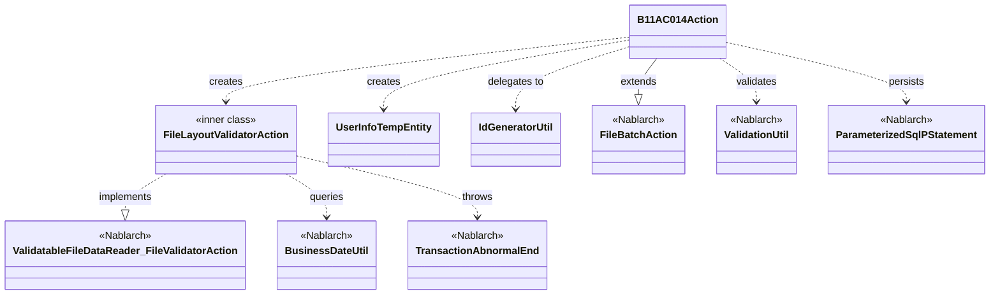
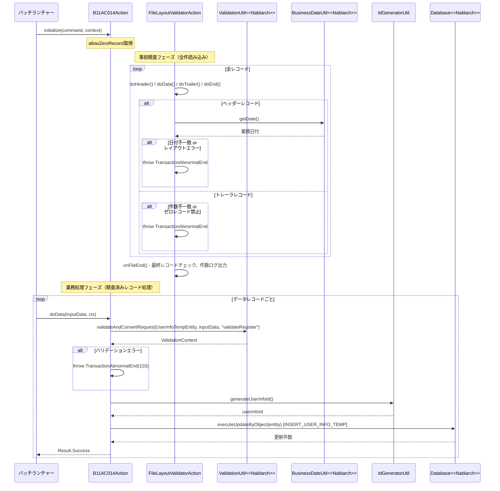

# Code Analysis: B11AC014Action

**Generated**: 2026-03-30 15:43:45
**Target**: File batch action for user info registration
**Modules**: ss11AC tutorial
**Analysis Duration**: approx. 4m 35s

---

## Overview

`B11AC014Action` は、ユーザ情報ファイルを読み込み、ユーザ情報テンポラリテーブルに登録するファイル入力バッチアクションです。`FileBatchAction` を継承しており、レコード種別（ヘッダー・データ・トレーラ・エンド）ごとに処理メソッドを実装します。

内部クラス `FileLayoutValidatorAction` でファイルレイアウトの事前精査を行い、精査後に `doData()` でバリデーションと DB 登録処理を実行します。ヘッダーレコードの業務日付チェック、トレーラレコードの件数チェック、ゼロレコード制御など、ファイルバッチの典型的なパターンを実装しています。

---

## Architecture

### Dependency Graph



**Note**: This diagram uses Mermaid `classDiagram` syntax to show class names and their relationships. Use `--|>` for inheritance (extends/implements) and `..>` for dependencies (uses/creates).

### Component Summary

| Component | Role | Type | Dependencies |
|-----------|------|------|--------------|
| B11AC014Action | ファイル入力バッチのメインアクション | Action | FileBatchAction, ValidationUtil, ParameterizedSqlPStatement, UserInfoTempEntity, IdGeneratorUtil |
| FileLayoutValidatorAction | ファイルレイアウト事前精査 | Inner Class (FileValidatorAction) | BusinessDateUtil, TransactionAbnormalEnd, DataRecord |
| UserInfoTempEntity | ユーザ情報テンポラリエンティティ | Entity | ValidationUtil, StringUtil |
| IdGeneratorUtil | ユーザ情報ID採番ユーティリティ | Utility | IdGenerator, SystemRepository |

---

## Flow

### Processing Flow

バッチ起動時に `initialize()` でコマンドライン引数 (`allowZeroRecord`) を取得します。ファイル読み込みは `ValidatableFileDataReader` が担当し、まず `FileLayoutValidatorAction` で全レコードのレイアウト精査が行われます。精査に成功した場合のみ、レコード種別ごとに `doHeader()` / `doData()` / `doTrailer()` / `doEnd()` が呼び出されます。

`doData()` では `ValidationUtil.validateAndConvertRequest()` でデータレコードを `UserInfoTempEntity` に変換・バリデーションし、エラーがなければ `IdGeneratorUtil` でユーザ情報IDを採番し、`ParameterizedSqlPStatement` で DB に INSERT します。

### Sequence Diagram



---

## Components

### B11AC014Action

**ファイル**: [B11AC014Action.java](../../.lw/nab-official/v1.2/tutorial/main/java/nablarch/sample/ss11AC/B11AC014Action.java)

**役割**: ユーザ情報ファイルを読み込み、ユーザ情報テンポラリテーブルに登録するファイル入力バッチアクション。`FileBatchAction` を継承し、レコード種別ごとの処理メソッドを実装する。

**主要メソッド**:

- `initialize(CommandLine, ExecutionContext)` (L42-44): コマンドライン引数 `allowZeroRecord` を取得し、フィールドに設定する
- `doData(DataRecord, ExecutionContext)` (L68-91): データレコードをバリデーションし、ユーザ情報テンポラリに登録する主処理
- `getValidatorAction()` (L135-137): 内部クラス `FileLayoutValidatorAction` のインスタンスを返し、事前精査を有効化する
- `getDataFileName()` / `getFormatFileName()` (L124-130): ファイルID (`N11AA002`) を返す

**依存関係**: FileBatchAction (継承), ValidationUtil, ParameterizedSqlPStatement, UserInfoTempEntity, IdGeneratorUtil, FileLayoutValidatorAction

---

### FileLayoutValidatorAction (内部クラス)

**ファイル**: [B11AC014Action.java](../../.lw/nab-official/v1.2/tutorial/main/java/nablarch/sample/ss11AC/B11AC014Action.java) (L157-315)

**役割**: `ValidatableFileDataReader.FileValidatorAction` を実装し、ファイル全体のレイアウト精査を事前に行う内部クラス。

**主要メソッド**:

- `doHeader(DataRecord, ExecutionContext)` (L198-215): 1レコード目チェック + 業務日付チェック (`BusinessDateUtil.getDate()`)
- `doData(DataRecord, ExecutionContext)` (L227-238): 前レコードがヘッダーまたはデータであることの確認、件数インクリメント
- `doTrailer(DataRecord, ExecutionContext)` (L253-276): 件数チェック + `allowZeroRecord` チェック
- `doEnd(DataRecord, ExecutionContext)` (L288-295): 前レコードがトレーラであることの確認
- `onFileEnd(ExecutionContext)` (L303-312): 最終レコードがエンドレコードであることの確認と件数ログ出力

**依存関係**: ValidatableFileDataReader.FileValidatorAction (実装), BusinessDateUtil, TransactionAbnormalEnd

---

### UserInfoTempEntity

**ファイル**: [UserInfoTempEntity.java](../../.lw/nab-official/v1.2/tutorial/main/java/nablarch/sample/ss11/entity/UserInfoTempEntity.java)

**役割**: ユーザ情報テンポラリテーブルに対応するエンティティクラス。セッタにバリデーションアノテーションを付与し、`@ValidateFor("validateRegister")` でバリデーションメソッドを定義する。

**主要メソッド**:

- `validateForRegister(ValidationContext)` (L431-450): `@ValidateFor("validateRegister")` メソッド。`ValidationUtil.validateWithout()` で共通項目を除いた全プロパティを精査し、携帯電話番号の項目間精査も実施する

**依存関係**: ValidationUtil, StringUtil

---

### IdGeneratorUtil

**ファイル**: [IdGeneratorUtil.java](../../.lw/nab-official/v1.2/tutorial/main/java/nablarch/sample/util/IdGeneratorUtil.java)

**役割**: Oracle シーケンスを使用してユーザ情報 ID などを採番するユーティリティクラス。

**主要メソッド**:

- `generateUserInfoId()` (L38-41): シーケンス `1102` を使用して 20 桁左 0 パディングのユーザ情報 ID を生成する

**依存関係**: IdGenerator, LpadFormatter, SystemRepository

---

## Nablarch Framework Usage

### FileBatchAction

**クラス**: `nablarch.fw.action.FileBatchAction`

**説明**: ファイルを入力とするバッチ業務アクションハンドラのテンプレートクラス。レコード種別ごとのメソッドディスパッチ、事前検証、再開機能をサポートする。

**使用方法**:
```java
public class B11AC014Action extends FileBatchAction {

    @Override
    public String getDataFileName() { return "N11AA002"; }

    @Override
    public String getFormatFileName() { return "N11AA002"; }

    @Override
    public ValidatableFileDataReader.FileValidatorAction getValidatorAction() {
        return new FileLayoutValidatorAction();
    }

    public Result doData(DataRecord inputData, ExecutionContext ctx) {
        // 業務処理
        return new Success();
    }
}
```

**重要ポイント**:
- ✅ **`getDataFileName()` と `getFormatFileName()` は必須**: 入力ファイルとフォーマット定義ファイルのファイル名を返すメソッドは必ずオーバーライドする
- 💡 **事前精査は `getValidatorAction()` をオーバーライド**: `ValidatableFileDataReader.FileValidatorAction` を返すことで、業務処理前にファイル全体の精査が自動的に行われる
- ⚠️ **レコード種別メソッド名は規約**: `do[レコード種別名]()` の形式でメソッドを実装すること（例: `doHeader()`, `doData()`）

**このコードでの使い方**:
- `B11AC014Action` が `FileBatchAction` を継承
- `getDataFileName()` / `getFormatFileName()` でファイル ID `N11AA002` を返す
- `getValidatorAction()` で `FileLayoutValidatorAction` を返し事前精査を実装

**詳細**: [Handlers FileBatchAction](../../.claude/skills/nabledge-1.2/docs/component/handlers/handlers-FileBatchAction.md)

---

### ValidatableFileDataReader / FileValidatorAction

**クラス**: `nablarch.fw.reader.ValidatableFileDataReader` / `ValidatableFileDataReader.FileValidatorAction`

**説明**: `FileDataReader` に事前ファイル全件読み込み・精査機能を追加したデータリーダ。精査ロジックを `FileValidatorAction` に分離し、業務処理と完全に切り離す。

**使用方法**:
```java
private class FileLayoutValidatorAction implements ValidatableFileDataReader.FileValidatorAction {

    public Result doHeader(DataRecord inputData, ExecutionContext ctx) { ... }
    public Result doData(DataRecord inputData, ExecutionContext ctx) { ... }
    public Result doTrailer(DataRecord inputData, ExecutionContext ctx) { ... }
    public Result doEnd(DataRecord inputData, ExecutionContext ctx) { ... }

    public void onFileEnd(ExecutionContext ctx) {
        // ファイル終端処理（必須）
    }
}
```

**重要ポイント**:
- ✅ **`onFileEnd()` は必須実装**: ファイル終端で呼ばれるメソッドは必ず実装する
- 💡 **精査メソッド名はレコード種別と対応**: `do[レコード種別名]()` の規約に従い、ファイル内のレコード種別ごとに精査メソッドを実装する
- ⚠️ **`useCache` はデフォルト false**: 通常はキャッシュ無効。ファイル入力がボトルネックの場合のみメモリ使用量を考慮して有効化する

**このコードでの使い方**:
- `FileLayoutValidatorAction` が `FileValidatorAction` を実装
- `doHeader()` で業務日付チェック、`doTrailer()` で件数チェックと `allowZeroRecord` 制御
- `onFileEnd()` で最終レコードの確認と件数ログ出力

**詳細**: [Readers ValidatableFileDataReader](../../.claude/skills/nabledge-1.2/docs/component/readers/readers-ValidatableFileDataReader.md)

---

### ValidationUtil / ValidationContext

**クラス**: `nablarch.core.validation.ValidationUtil` / `nablarch.core.validation.ValidationContext`

**説明**: Nablarch のバリデーション機能を提供するユーティリティ。`validateAndConvertRequest()` でデータをエンティティへ変換しながらバリデーションを実行する。

**使用方法**:
```java
ValidationContext<UserInfoTempEntity> validationContext =
    ValidationUtil.validateAndConvertRequest(
        UserInfoTempEntity.class,
        inputData, "validateRegister");

if (!validationContext.isValid()) {
    throw new TransactionAbnormalEnd(103,
        new ApplicationException(validationContext.getMessages()),
        "NB11AA0105", inputData.getRecordNumber());
}

UserInfoTempEntity entity = validationContext.createObject();
```

**重要ポイント**:
- ✅ **`isValid()` 確認後に `createObject()` を呼ぶ**: バリデーションエラー時に `createObject()` を呼ぶと例外が発生するため、必ず `isValid()` で確認してから呼ぶ
- 🎯 **第3引数はバリデーショングループ名**: `@ValidateFor("validateRegister")` アノテーションで定義したメソッドが実行される
- 💡 **バッチでも Web と同じ ValidationUtil が使える**: 精査対象データの種類（HTTP パラメータ vs DB 結果・ファイルレコード）が異なるだけで、ValidationUtil の使い方は同じ

**このコードでの使い方**:
- `doData()` で `validateAndConvertRequest()` を呼び出し (L70-73)
- バリデーションエラー時は `TransactionAbnormalEnd(103)` をスロー (L77-79)
- 精査後 `createObject()` でエンティティを取得し、ID 採番・DB 登録 (L83-88)

**詳細**: [Nablarch Batch fileInputBatch](../../.claude/skills/nabledge-1.2/docs/guide/nablarch-batch/nablarch-batch-04_fileInputBatch.md)

---

### TransactionAbnormalEnd

**クラス**: `nablarch.fw.TransactionAbnormalEnd`

**説明**: バッチ処理でトランザクション異常終了（エラー終了）を発生させるための例外クラス。終了コードとエラーメッセージIDを指定してスローする。

**使用方法**:
```java
// ファイルレイアウトエラー（終了コード100）
throw new TransactionAbnormalEnd(FILE_LAYOUT_ERROR_EXIT_CODE,
    INVALID_FILE_LAYOUT_FAILURE_CODE, inputData.getRecordNumber());

// バリデーションエラー（終了コード103）
throw new TransactionAbnormalEnd(103,
    new ApplicationException(validationContext.getMessages()),
    "NB11AA0105", inputData.getRecordNumber());
```

**重要ポイント**:
- ✅ **終了コードはケースごとに使い分ける**: ファイルレイアウトエラー(100)、トレーラ件数エラー(101)、ヘッダー日付エラー(102)、データバリデーションエラー(103)、ゼロレコードエラー(104) などをコードで区別する
- ⚠️ **`ApplicationException` と組み合わせる場合**: バリデーションエラーメッセージを保持するため `new ApplicationException(validationContext.getMessages())` を第2引数に渡す

**このコードでの使い方**:
- `FileLayoutValidatorAction` の各メソッドでレイアウトエラーをスロー
- `doData()` でバリデーションエラー時に `ApplicationException` を包んでスロー

---

### BusinessDateUtil

**クラス**: `nablarch.core.date.BusinessDateUtil`

**説明**: システムが管理する業務日付を取得するユーティリティ。

**使用方法**:
```java
String businessDate = BusinessDateUtil.getDate();
if (!businessDate.equals(date)) {
    throw new TransactionAbnormalEnd(102, HEADER_RECORD_ERROR_FAILURE_CODE, date, businessDate);
}
```

**重要ポイント**:
- 🎯 **ファイルヘッダーの日付チェックに使用**: バッチ処理でヘッダーレコードの日付フィールドと業務日付を照合するパターン

**このコードでの使い方**:
- `FileLayoutValidatorAction.doHeader()` でヘッダーの `date` フィールドと業務日付を比較 (L207-213)

---

## References

### Source Files

- [B11AC014Action.java (.lw/nab-official/v1.3/tutorial/main/java/please/change/me/tutorial/ss11AC)](../../.lw/nab-official/v1.3/tutorial/main/java/please/change/me/tutorial/ss11AC/B11AC014Action.java) - B11AC014Action
- [B11AC014Action.java (.lw/nab-official/v1.2/tutorial/main/java/nablarch/sample/ss11AC)](../../.lw/nab-official/v1.2/tutorial/main/java/nablarch/sample/ss11AC/B11AC014Action.java) - B11AC014Action
- [B11AC014Action.java (.lw/nab-official/v1.4/tutorial/tutorial/main/java/please/change/me/tutorial/ss11AC)](../../.lw/nab-official/v1.4/tutorial/tutorial/main/java/please/change/me/tutorial/ss11AC/B11AC014Action.java) - B11AC014Action
- [UserInfoTempEntity.java (.lw/nab-official/v1.3/tutorial/main/java/please/change/me/tutorial/ss11/entity)](../../.lw/nab-official/v1.3/tutorial/main/java/please/change/me/tutorial/ss11/entity/UserInfoTempEntity.java) - UserInfoTempEntity
- [UserInfoTempEntity.java (.lw/nab-official/v1.2/tutorial/main/java/nablarch/sample/ss11/entity)](../../.lw/nab-official/v1.2/tutorial/main/java/nablarch/sample/ss11/entity/UserInfoTempEntity.java) - UserInfoTempEntity
- [UserInfoTempEntity.java (.lw/nab-official/v1.4/tutorial/tutorial/main/java/please/change/me/tutorial/ss11/entity)](../../.lw/nab-official/v1.4/tutorial/tutorial/main/java/please/change/me/tutorial/ss11/entity/UserInfoTempEntity.java) - UserInfoTempEntity
- [IdGeneratorUtil.java (.lw/nab-official/v1.2/tutorial/main/java/nablarch/sample/util)](../../.lw/nab-official/v1.2/tutorial/main/java/nablarch/sample/util/IdGeneratorUtil.java) - IdGeneratorUtil

### Knowledge Base (Nabledge-5)

- [Readers ValidatableFileDataReader](../../.claude/skills/nabledge-1.2/docs/component/readers/readers-ValidatableFileDataReader.md)
- [Handlers FileBatchAction](../../.claude/skills/nabledge-1.2/docs/component/handlers/handlers-FileBatchAction.md)
- [Nablarch Batch 04_fileInputBatch](../../.claude/skills/nabledge-1.2/docs/guide/nablarch-batch/nablarch-batch-04_fileInputBatch.md)

### Official Documentation

(No official documentation links available)

---

**Note**: This documentation was generated by the code-analysis workflow of the nabledge-1.2 skill.
