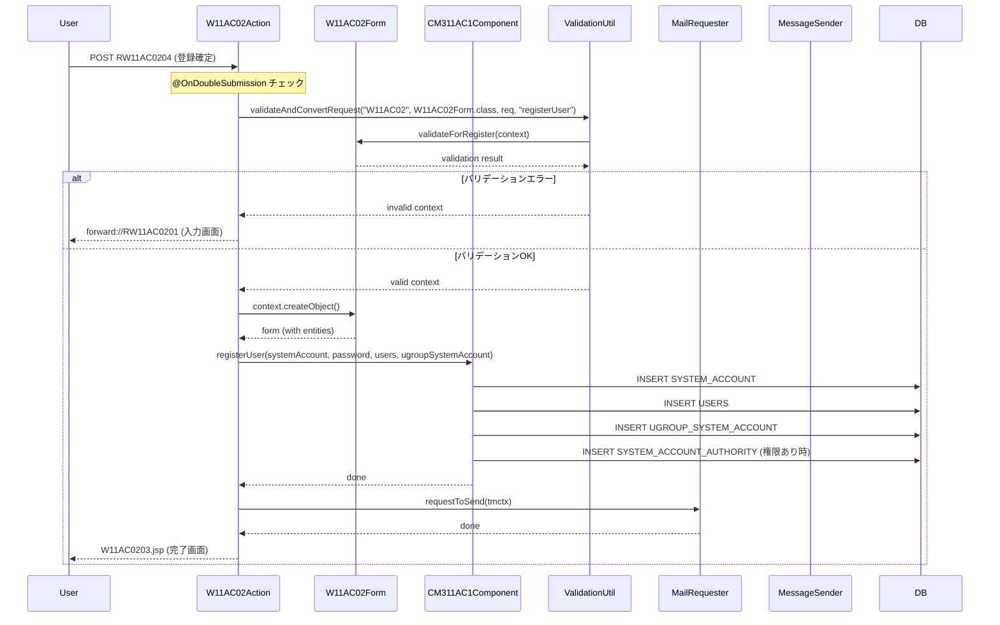

# Code Analysis: W11AC02Action

**Generated**: 2026-03-31 14:46:26
**Target**: ユーザー登録機能のアクションクラス
**Modules**: tutorial (ss11AC)
**Analysis Duration**: approx. 2m 15s

---

## Overview

`W11AC02Action` はNablarch 1.2チュートリアルのユーザー管理機能（ss11AC）で、ユーザー情報の登録処理を担うアクションクラスです。`DbAccessSupport` を継承しており、入力画面の表示、確認画面への遷移、DB登録の確定、およびメッセージング連携によるユーザー登録という4つの主要フローを処理します。

主要コンポーネントは以下の通りです：
- `W11AC02Action`: 各画面遷移イベントのハンドラー（doRW11AC0201〜doRW11AC0205）
- `W11AC02Form`: 入力バリデーションとエンティティ生成を担うフォームクラス
- `CM311AC1Component`: DB操作（ユーザー登録・検索・削除）を担う機能内共通コンポーネント

二重サブミット防止（`@OnDoubleSubmission`）、バリデーション（`ValidationUtil`）、メール送信（`MailRequester`）、同期メッセージング（`MessageSender`）を組み合わせた構成です。

---

## Architecture

### Dependency Graph

```mermaid
classDiagram
    class W11AC02Action {
        <<Action>>
    }
    class W11AC02Form {
        <<Form>>
    }
    class CM311AC1Component {
        <<Component>>
    }
    class DbAccessSupport {
        <<Nablarch>>
    }
    class ValidationUtil {
        <<Nablarch>>
    }
    class ValidationContext {
        <<Nablarch>>
    }
    class OnDoubleSubmission {
        <<Nablarch>>
    }
    class MailRequester {
        <<Nablarch>>
    }
    class MessageSender {
        <<Nablarch>>
    }
    class SystemAccountEntity {
        <<Entity>>
    }
    class UsersEntity {
        <<Entity>>
    }
    class UgroupSystemAccountEntity {
        <<Entity>>
    }

    W11AC02Action --|> DbAccessSupport : extends
    CM311AC1Component --|> DbAccessSupport : extends
    W11AC02Action ..> W11AC02Form : validates
    W11AC02Action ..> CM311AC1Component : delegates to
    W11AC02Action ..> ValidationUtil : uses
    W11AC02Action ..> MailRequester : sends mail via
    W11AC02Action ..> MessageSender : sends sync message via
    W11AC02Action ..> OnDoubleSubmission : guards with
    W11AC02Form ..> SystemAccountEntity : creates
    W11AC02Form ..> UsersEntity : creates
    W11AC02Form ..> UgroupSystemAccountEntity : creates
    W11AC02Form ..> ValidationContext : uses
```



**Note**: This diagram uses Mermaid `classDiagram` syntax to show class names and their relationships. Use `--|>` for inheritance (extends/implements) and `..>` for dependencies (uses/creates).

### Component Summary

| Component | Role | Type | Dependencies |
|-----------|------|------|--------------|
| W11AC02Action | ユーザー登録の各画面イベント処理 | Action | W11AC02Form, CM311AC1Component, ValidationUtil, MailRequester, MessageSender |
| W11AC02Form | 入力バリデーションとエンティティ生成 | Form | SystemAccountEntity, UsersEntity, UgroupSystemAccountEntity, ValidationContext |
| CM311AC1Component | DB操作（ユーザー登録・検索・削除） | Component | DbAccessSupport, ParameterizedSqlPStatement, SqlPStatement |
| SystemAccountEntity | システムアカウント情報 | Entity | なし |
| UsersEntity | ユーザー基本情報 | Entity | なし |
| UgroupSystemAccountEntity | グループ所属情報 | Entity | なし |

---

## Flow

### Processing Flow

`W11AC02Action` は5つのリクエストハンドラーメソッドを持ちます：

1. **doRW11AC0201** (L52-58): 入力画面初期表示。グループ・認可単位情報をリクエストスコープに設定し、W11AC0201.jspを返却します。

2. **doRW11AC0202** (L68-77): 入力確認イベント。バリデーションを実施し、エラー時は入力画面へ戻ります（`@OnError`）。成功時は確認画面（W11AC0202.jsp）を表示します。

3. **doRW11AC0203** (L87-96): 確認画面から入力画面への「修正」イベント。バリデーション後に入力画面へ遷移します。

4. **doRW11AC0204** (L107-130): 登録確定イベント。`@OnDoubleSubmission` で二重送信を防止。バリデーション→エンティティ取得→DB登録（`CM311AC1Component.registerUser`）→メール送信→完了画面（W11AC0203.jsp）の流れです。

5. **doRW11AC0205** (L246-290): メッセージング経由の登録イベント。`@OnDoubleSubmission` で二重送信を防止。同期メッセージ送信（`MessageSender.sendSync`）でユーザーIDを採番し、完了画面へ遷移します。

### Sequence Diagram



---

## Components

### W11AC02Action

**ファイル**: [W11AC02Action.java (.lw/nab-official/v1.2/tutorial/main/java/nablarch/sample/ss11AC)](../../.lw/nab-official/v1.2/tutorial/main/java/nablarch/sample/ss11AC/W11AC02Action.java)

**役割**: ユーザー情報登録機能のアクションクラス。各画面遷移イベントに対応するメソッドを実装する。

**主要メソッド**:

- `doRW11AC0201(req, ctx)` (L52-58): 入力画面初期表示。`setUpViewData` でグループ・認可単位情報をリクエストスコープに設定。
- `doRW11AC0204(req, ctx)` (L107-130): 登録確定処理。`@OnDoubleSubmission` と `@OnError` を付与。`validate(req)` でバリデーション→`CM311AC1Component.registerUser` でDB登録→`sendMailToRegisteredUser` でメール送信。
- `doRW11AC0205(req, ctx)` (L246-290): メッセージング経由登録。`MessageSender.sendSync` で同期メッセージを送信し、応答から採番されたユーザーIDを取得。
- `validate(req)` (L186-217): 入力バリデーション共通処理。`ValidationUtil.validateAndConvertRequest` 実行後、ログインID重複チェック・グループID存在チェック・認可単位ID存在チェックを実施。
- `checkLoginId(loginId)` (L224-232): `SqlPStatement` でSELECT_SYSTEM_ACCOUNTを実行し、ログインID重複時に `ApplicationException` をスロー。
- `sendMailToRegisteredUser(user, systemAccount)` (L138-159): `TemplateMailContext` を構築し、`MailUtil.getMailRequester().requestToSend()` でメール送信要求。

**依存コンポーネント**: W11AC02Form, CM311AC1Component, ValidationUtil, MailRequester, MessageSender, SqlPStatement, SystemRepository

---

### W11AC02Form

**ファイル**: [W11AC02Form.java (.lw/nab-official/v1.2/tutorial/main/java/nablarch/sample/ss11AC)](../../.lw/nab-official/v1.2/tutorial/main/java/nablarch/sample/ss11AC/W11AC02Form.java)

**役割**: ユーザー情報入力フォーム（登録機能）。バリデーションアノテーションとネストしたEntityによるバリデーションを実装する。

**主要メソッド**:

- `validateForRegister(context)` (L165-177): `@ValidateFor("registerUser")` が付与された静的バリデーションメソッド。全プロパティをバリデーション後、新パスワードと確認用パスワードの一致チェックを実施。
- `validateForSend(context)` (L184-188): `@ValidateFor("sendUser")` が付与された静的バリデーションメソッド。メッセージ送信用登録時はパスワードと権限情報を除外してバリデーション。

**プロパティ構成**:
- `UsersEntity users` - `@ValidationTarget` でEntity内バリデーションを有効化
- `SystemAccountEntity systemAccount` - `@ValidationTarget` でEntity内バリデーションを有効化
- `UgroupSystemAccountEntity ugroupSystemAccount` - `@ValidationTarget` でEntity内バリデーションを有効化
- `String newPassword` / `String confirmPassword` - `@Required`, `@SystemChar`, `@Length(max=20)` アノテーション付き

**依存コンポーネント**: SystemAccountEntity, UsersEntity, UgroupSystemAccountEntity, ValidationContext

---

### CM311AC1Component

**ファイル**: [CM311AC1Component.java (.lw/nab-official/v1.2/tutorial/main/java/nablarch/sample/ss11AC)](../../.lw/nab-official/v1.2/tutorial/main/java/nablarch/sample/ss11AC/CM311AC1Component.java)

**役割**: ユーザー管理機能の機能内共通コンポーネント。DB操作（ユーザー登録・グループ検索・認可単位検索・削除）をAction側から切り離して実装する。

**主要メソッド**:

- `registerUser(systemAccount, plainPassword, users, ugroupSystemAccount)` (L97-139): ユーザーID採番→業務日付取得→SystemAccount/Users/UgroupSystemAccount/SystemAccountAuthorityの連続INSERT処理。
- `getUserGroups()` (L42-45): SELECT_ALL_UGROUPSを実行し全グループ情報を返却。
- `existGroupId(ugroupSystemAccount)` (L63-69): CHECK_UGROUPで指定グループIDの存在確認。
- `registerSystemAccountAuthority(systemAccount)` (L184-196): `addBatchObject` + `executeBatch` でバッチINSERT。

**依存コンポーネント**: DbAccessSupport, ParameterizedSqlPStatement, SqlPStatement, DuplicateStatementException, BusinessDateUtil, IdGeneratorUtil, AuthenticationUtil

---

## Nablarch Framework Usage

### ValidationUtil

**クラス**: `nablarch.core.validation.ValidationUtil`

**説明**: リクエストパラメータからJavaBeanへのバリデーションと変換を行うユーティリティクラス。

**使用方法**:
```java
ValidationContext<W11AC02Form> context = ValidationUtil.validateAndConvertRequest(
    "W11AC02", W11AC02Form.class, req, "registerUser");
if (!context.isValid()) {
    throw new ApplicationException(context.getMessages());
}
W11AC02Form form = context.createObject();
```

**重要ポイント**:
- ✅ **`isValid()` で必ず確認**: バリデーション後は必ず `context.isValid()` でエラー有無を確認し、エラー時は `ApplicationException` をスローする
- ✅ **`validateFor` 引数の一致**: `validateAndConvertRequest` の第4引数と `@ValidateFor` アノテーションの値を一致させることで、対応するバリデーションメソッドが呼び出される
- 💡 **`@ValidationTarget` でネスト対応**: FormにEntityをプロパティとして持つ場合、setterに `@ValidationTarget` を付与することでEntityクラス内のバリデーションが自動実行される

**このコードでの使い方**:
- `validate(req)` (L189-191) と `validateForSendUser(req)` (L303-305) の2箇所で使用
- "registerUser" と "sendUser" の2種類のバリデーションシナリオを切り替え

**詳細**: [Libraries 08_02_validation_usage](../../.claude/skills/nabledge-1.2/docs/component/libraries/libraries-08_02_validation_usage.md)

---

### OnDoubleSubmission

**クラス**: `nablarch.common.web.token.OnDoubleSubmission`

**説明**: 二重サブミット防止のためのインターセプターアノテーション。同一リクエストが2回以上送信された場合に指定パスへリダイレクトする。

**使用方法**:
```java
@OnError(type = ApplicationException.class, path = "forward://RW11AC0201")
@OnDoubleSubmission(path = "forward://RW11AC0201")
public HttpResponse doRW11AC0204(HttpRequest req, ExecutionContext ctx) {
    // 登録処理
}
```

**重要ポイント**:
- ✅ **DB更新系メソッドには必須**: データ変更が発生するメソッド（登録・更新・削除）には必ず `@OnDoubleSubmission` を付与する
- ⚠️ **`@OnError` と組み合わせる**: バリデーションエラー時とダブルサブミット時の両方の遷移先を設定する

**このコードでの使い方**:
- `doRW11AC0204` (L106) と `doRW11AC0205` (L245) の2メソッドに付与
- どちらも二重送信時は入力画面（`forward://RW11AC0201`）へ戻す

**詳細**: [Web Application 08_complete](../../.claude/skills/nabledge-1.2/docs/guide/web-application/web-application-08_complete.md)

---

### MailRequester / TemplateMailContext

**クラス**: `nablarch.common.mail.MailRequester`, `nablarch.common.mail.TemplateMailContext`

**説明**: テンプレートを使用したメール送信要求機能。メール本文をテンプレートIDと言語で指定し、プレースホルダーを置換して送信要求を行う。

**使用方法**:
```java
TemplateMailContext tmctx = new TemplateMailContext();
tmctx.setFrom(SystemRepository.getString("defaultFromMailAddress"));
tmctx.addTo(user.getMailAddress());
tmctx.setTemplateId(USER_REGISTERED_MAIL_TEMPLATE_ID);
tmctx.setLang(USER_LANG);
tmctx.setReplaceKeyValue("kanjiName", user.getKanjiName());
MailRequester mailRequester = MailUtil.getMailRequester();
mailRequester.requestToSend(tmctx);
```

**重要ポイント**:
- 💡 **常駐バッチへの非同期送信**: `requestToSend` はメール送信キューへの登録であり、実際の送信は常駐バッチが行う
- ✅ **送信元アドレスはシステムリポジトリから**: `SystemRepository.getString("defaultFromMailAddress")` で設定ファイルから取得する
- 🎯 **テンプレートID + 言語で本文決定**: テンプレートIDと言語コード（例: "ja"）の組み合わせでメール本文テンプレートを特定する

**このコードでの使い方**:
- `sendMailToRegisteredUser` (L138-159) で使用
- テンプレートID "1"、言語 "ja"、プレースホルダー: `kanjiName`, `loginId`

---

### MessageSender / SyncMessage

**クラス**: `nablarch.fw.messaging.MessageSender`, `nablarch.fw.messaging.SyncMessage`

**説明**: 同期メッセージングによる外部システム連携機能。リクエストメッセージを送信し、応答メッセージを受け取る。

**使用方法**:
```java
SyncMessage responseMessage = MessageSender.sendSync(
    new SyncMessage("RM11AC0201").addDataRecord(dataRecord));
String userId = (String) responseMessage.getDataRecord().get("userId");
```

**重要ポイント**:
- ✅ **`MessagingException` を業務エラーとして処理**: 送信エラーは通信障害など外部要因のため、`ApplicationException` に変換してユーザーに再試行を促す
- ⚠️ **応答からのデータ取得**: 応答データは `getDataRecord().get(キー名)` で取得する

**このコードでの使い方**:
- `doRW11AC0205` (L272-279) で使用。RM11AC0201宛に送信し、応答から採番された `userId` を取得してSystemAccountEntityにセット

---

### DbAccessSupport

**クラス**: `nablarch.core.db.support.DbAccessSupport`

**説明**: DBアクセス機能の基底クラス。`getSqlPStatement` や `getParameterizedSqlStatement` でSQLステートメントを取得する機能を提供する。

**使用方法**:
```java
// 通常のSQLステートメント
SqlPStatement statement = getSqlPStatement("SELECT_SYSTEM_ACCOUNT");
statement.setString(1, loginId);
SqlResultSet result = statement.retrieve();

// パラメタライズドSQLステートメント（Entity対応）
ParameterizedSqlPStatement statement = getParameterizedSqlStatement("INSERT_SYSTEM_ACCOUNT");
statement.executeUpdateByObject(systemAccount);
```

**重要ポイント**:
- 💡 **`executeUpdateByObject`でEntity直接指定**: パラメータを個別にセットせず、Entityをそのまま渡すことで挿入・更新できる
- ✅ **バッチ処理は`addBatchObject` + `executeBatch`**: 複数件の一括処理は `addBatchObject` で積み上げ、`executeBatch` で一括実行する

**このコードでの使い方**:
- `W11AC02Action.checkLoginId` (L225) で `getSqlPStatement` を使用
- `CM311AC1Component` の各 `registerXxx` メソッドで `getParameterizedSqlStatement` を使用

**詳細**: [Web Application 07_insert](../../.claude/skills/nabledge-1.2/docs/guide/web-application/web-application-07_insert.md)

---

## References

### Source Files

- [W11AC02Action.java (.lw/nab-official/v1.2/tutorial/main/java/nablarch/sample/ss11AC)](../../.lw/nab-official/v1.2/tutorial/main/java/nablarch/sample/ss11AC/W11AC02Action.java) - W11AC02Action
- [W11AC02Form.java (.lw/nab-official/v1.2/tutorial/main/java/nablarch/sample/ss11AC)](../../.lw/nab-official/v1.2/tutorial/main/java/nablarch/sample/ss11AC/W11AC02Form.java) - W11AC02Form
- [CM311AC1Component.java (.lw/nab-official/v1.2/tutorial/main/java/nablarch/sample/ss11AC)](../../.lw/nab-official/v1.2/tutorial/main/java/nablarch/sample/ss11AC/CM311AC1Component.java) - CM311AC1Component

### Knowledge Base (Nabledge-5)

- [Web Application 04_validation](../../.claude/skills/nabledge-1.2/docs/guide/web-application/web-application-04_validation.md)
- [Web Application 05_create_form](../../.claude/skills/nabledge-1.2/docs/guide/web-application/web-application-05_create_form.md)
- [Web Application 07_insert](../../.claude/skills/nabledge-1.2/docs/guide/web-application/web-application-07_insert.md)
- [Web Application 07_confirm_view](../../.claude/skills/nabledge-1.2/docs/guide/web-application/web-application-07_confirm_view.md)
- [Web Application 08_complete](../../.claude/skills/nabledge-1.2/docs/guide/web-application/web-application-08_complete.md)
- [Libraries 08_02_validation_usage](../../.claude/skills/nabledge-1.2/docs/component/libraries/libraries-08_02_validation_usage.md)

### Official Documentation

(No official documentation links available)

---

**Note**: This documentation was generated by the code-analysis workflow of the nabledge-1.2 skill.
