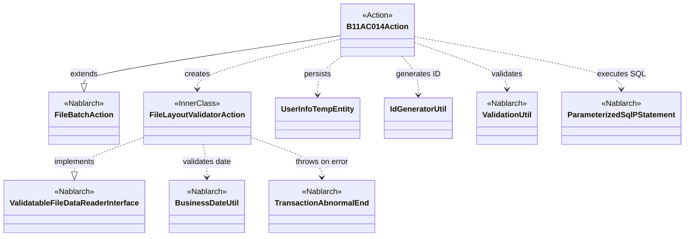
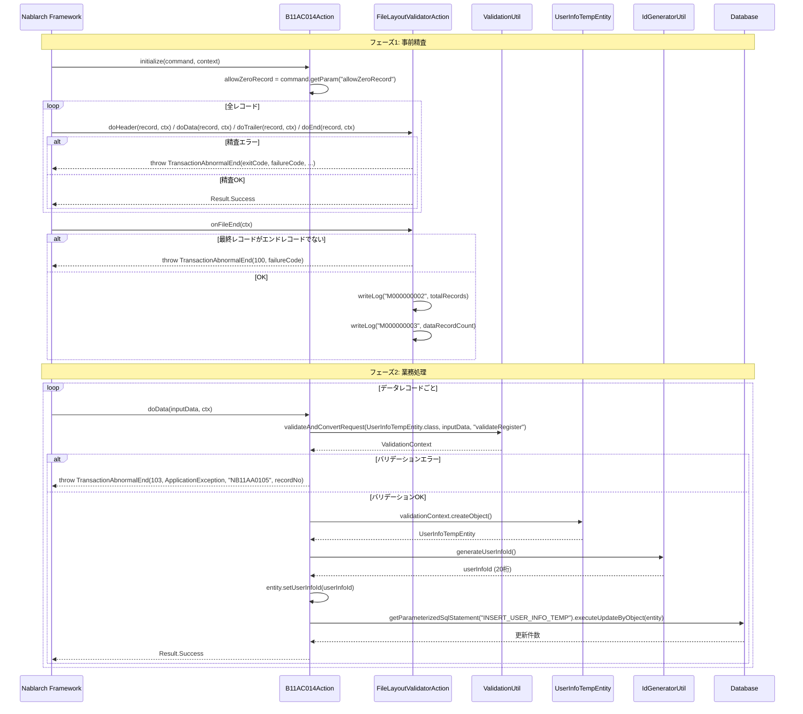

# Code Analysis: B11AC014Action

**Generated**: 2026-03-31 14:47:02
**Target**: ユーザ情報ファイルバッチ取込アクション
**Modules**: tutorial
**Analysis Duration**: approx. 2m 30s

---

## Overview

`B11AC014Action` は、ユーザ情報ファイル（ファイルID: `N11AA002`）を読み込み、ユーザ情報テンポラリテーブルへ登録するバッチアクションクラスです。

`FileBatchAction` を継承し、ヘッダー・データ・トレーラ・エンドの4種類のレコードをそれぞれのメソッドで処理します。内部クラス `FileLayoutValidatorAction` がファイル全件の事前精査を担当し、業務ロジックとレイアウト精査を完全に分離しています。

主な処理ステップ: (1) 初期化でコマンドライン引数を取得 → (2) 事前精査フェーズでレコード構造・日付・件数を検証 → (3) 業務処理フェーズでバリデーション後にDBへ登録。

---

## Architecture

### Dependency Graph



**Note**: This diagram uses Mermaid `classDiagram` syntax to show class names and their relationships. Use `--|>` for inheritance (extends/implements) and `..>` for dependencies (uses/creates).

### Component Summary

| Component | Role | Type | Dependencies |
|-----------|------|------|--------------|
| B11AC014Action | ユーザ情報ファイルの取込バッチ処理 | Action (FileBatchAction) | FileLayoutValidatorAction, ValidationUtil, UserInfoTempEntity, IdGeneratorUtil, ParameterizedSqlPStatement |
| FileLayoutValidatorAction | ファイルレイアウト事前精査（内部クラス） | FileValidatorAction | BusinessDateUtil, TransactionAbnormalEnd |
| UserInfoTempEntity | ユーザ情報テンポラリのエンティティ兼バリデーション定義 | Entity | ValidationUtil, ValidationContext |
| IdGeneratorUtil | ユーザ情報IDの採番ユーティリティ | Utility | IdGenerator (SystemRepository) |

---

## Flow

### Processing Flow

バッチ処理は2フェーズで実行されます。

**フェーズ1: 事前精査 (FileLayoutValidatorAction)**
ファイルを全件読み込み、レイアウト・日付・件数を精査します。いずれかの精査でエラーの場合は `TransactionAbnormalEnd` をスローして異常終了します。
- `doHeader()`: 1レコード目がヘッダー、かつ業務日付と一致することを確認 (L198-215)
- `doData()`: 前レコードがヘッダーまたはデータであることを確認 (L227-238)
- `doTrailer()`: 前レコードがデータ、総レコード数一致、0件許容チェック (L253-276)
- `doEnd()`: 前レコードがトレーラであることを確認 (L288-295)
- `onFileEnd()`: 最終レコードがエンドレコードであることを確認し、件数ログを出力 (L303-311)

**フェーズ2: 業務処理 (B11AC014Action)**
事前精査に成功したファイルのデータレコードのみが業務処理の対象となります。
- `initialize()`: コマンドライン引数 `allowZeroRecord` を取得 (L42-44)
- `doData()`: データレコードをバリデーション後、IDを採番してDBへ INSERT (L68-91)
- `doHeader() / doTrailer() / doEnd()`: 業務処理不要、`Success` を返す

### Sequence Diagram



---

## Components

### B11AC014Action

**ファイル**: [B11AC014Action.java](../../.lw/nab-official/v1.2/tutorial/main/java/nablarch/sample/ss11AC/B11AC014Action.java)

**役割**: ユーザ情報ファイルを読み込み、ユーザ情報テンポラリテーブルへ登録するバッチアクション。

**主要メソッド**:

- `initialize(CommandLine, ExecutionContext)` (L42-44): バッチ起動時に一度だけ実行。コマンドライン引数 `allowZeroRecord` を読み取り、0件レコードを許容するか判定するフラグを設定する。
- `doData(DataRecord, ExecutionContext)` (L68-91): データレコード1件ごとに実行。`ValidationUtil` でバリデーションしてエンティティ化 → IDを採番 → `ParameterizedSqlPStatement` でDBへ INSERT する。精査エラーの場合は終了コード103で `TransactionAbnormalEnd` をスロー。
- `getValidatorAction()` (L134-137): 事前精査クラス `FileLayoutValidatorAction` を返すオーバーライドメソッド。

**依存関係**: `FileBatchAction`（継承）、`FileLayoutValidatorAction`（内部クラス）、`ValidationUtil`、`UserInfoTempEntity`、`IdGeneratorUtil`、`ParameterizedSqlPStatement`

---

### FileLayoutValidatorAction (内部クラス)

**ファイル**: [B11AC014Action.java L157-315](../../.lw/nab-official/v1.2/tutorial/main/java/nablarch/sample/ss11AC/B11AC014Action.java)

**役割**: ファイル全件を事前に読み込み、レコード順序・業務日付・件数整合性を精査する `FileValidatorAction` の実装。

**主要メソッド**:

- `doHeader(DataRecord, ExecutionContext)` (L198-215): ヘッダーレコードが1番目であること、および `date` フィールドが `BusinessDateUtil.getDate()` の業務日付と一致することを確認。
- `doTrailer(DataRecord, ExecutionContext)` (L253-276): 前レコードがヘッダーまたはデータであること、`totalCount` フィールドとデータレコード数が一致すること、0件時の許容チェックを実施。
- `onFileEnd(ExecutionContext)` (L303-311): ファイル終端で最終レコードがエンドレコードであることを確認し、処理件数をログ出力。

**依存関係**: `ValidatableFileDataReader.FileValidatorAction`（実装）、`BusinessDateUtil`、`TransactionAbnormalEnd`、`DataRecord`

---

### UserInfoTempEntity

**ファイル**: [UserInfoTempEntity.java](../../.lw/nab-official/v1.2/tutorial/main/java/nablarch/sample/ss11/entity/UserInfoTempEntity.java)

**役割**: ユーザ情報テンポラリテーブルのエンティティ。バリデーションアノテーションを含み、`ValidationUtil` と組み合わせてバリデーション・DB登録を行う。

**主要メソッド**:

- `UserInfoTempEntity(Map<String, Object>)` (L91-102): `DataRecord`（`Map`実装）から各フィールドを設定するコンストラクタ。
- `validateForRegister(ValidationContext)` (L431-450): `@ValidateFor("validateRegister")` が付いた静的バリデーションメソッド。`ValidationUtil.validateWithout()` で監査項目を除外した単項目バリデーションを実行後、携帯番号の相関バリデーションを行う。

**依存関係**: `ValidationUtil`、`ValidationContext`、`ValidateFor`、`PropertyName`、`Required`、`Length`、`SystemChar`

---

### IdGeneratorUtil

**ファイル**: [IdGeneratorUtil.java](../../.lw/nab-official/v1.2/tutorial/main/java/nablarch/sample/util/IdGeneratorUtil.java)

**役割**: Oracle シーケンスを用いてユーザ情報ID（20桁左0パディング）などを採番するユーティリティクラス。

**主要メソッド**:

- `generateUserInfoId()` (L38-41): システムリポジトリから `oracleSequenceIdGenerator` を取得し、採番No `1102` で20桁の IDを生成する。

**依存関係**: `IdGenerator`、`LpadFormatter`、`SystemRepository`

---

## Nablarch Framework Usage

### FileBatchAction

**クラス**: `nablarch.fw.action.FileBatchAction`

**説明**: ファイル入力バッチのテンプレートクラス。レコード種別ごとのディスパッチメソッド（`do[レコード種別名]()`）に業務処理を実装する。事前精査（`getValidatorAction()`）および再開機能を標準装備。

**使用方法**:
```java
public class B11AC014Action extends FileBatchAction {

    @Override
    protected void initialize(CommandLine command, ExecutionContext context) {
        // コマンドライン引数の取得
    }

    @Override
    public String getDataFileName() { return "N11AA002"; }

    @Override
    public String getFormatFileName() { return "N11AA002"; }

    @Override
    public ValidatableFileDataReader.FileValidatorAction getValidatorAction() {
        return new FileLayoutValidatorAction();
    }

    public Result doData(DataRecord inputData, ExecutionContext ctx) {
        // 業務処理
        return new Success();
    }
}
```

**重要ポイント**:
- ✅ **`getDataFileName()` と `getFormatFileName()` は必須**: ファイルIDとフォーマット定義ファイル名を返すメソッドをオーバーライドすること。
- 💡 **事前精査と業務処理を分離**: `getValidatorAction()` で事前精査クラスを返すことで、ファイル全件精査後に業務処理が実行されるため、途中データでのDB登録を防げる。
- ⚠️ **`initialize()` は起動時1回のみ**: コマンドライン引数はここで読み取る。レコードごとの処理中には呼ばれない。

**このコードでの使い方**:
- `initialize()` で `allowZeroRecord` フラグ設定 (L42-44)
- `getValidatorAction()` で `FileLayoutValidatorAction` を返却 (L134-137)
- `doData()` に業務ロジック（バリデーション＋DB登録）を実装 (L68-91)

**詳細**: [Handlers FileBatchAction](../../.claude/skills/nabledge-1.2/docs/component/handlers/handlers-FileBatchAction.md)

---

### ValidatableFileDataReader / FileValidatorAction

**クラス**: `nablarch.fw.reader.ValidatableFileDataReader`, `nablarch.fw.reader.ValidatableFileDataReader.FileValidatorAction`

**説明**: 事前ファイル全件読み込み・精査機能を提供するデータリーダ。`FileValidatorAction` インタフェースに精査ロジックを実装することで業務処理と完全分離できる。

**使用方法**:
```java
private class FileLayoutValidatorAction
        implements ValidatableFileDataReader.FileValidatorAction {

    public Result doHeader(DataRecord inputData, ExecutionContext ctx) {
        // ヘッダー精査
        return new Success();
    }

    public void onFileEnd(ExecutionContext ctx) {
        // ファイル終端精査
    }
}
```

**重要ポイント**:
- ✅ **`onFileEnd()` は必須実装**: ファイル終端での最終チェック（最終レコード種別確認など）はここに実装する。
- 💡 **レコード種別ディスパッチ**: `do[レコード種別名]()` の命名規則で、フレームワークが自動的に対応メソッドを呼び出す。
- ⚠️ **`useCache` のデフォルトは false**: 通常はキャッシュ不要。大量データでメモリ消費に注意する場合のみ検討する。

**このコードでの使い方**:
- 内部クラス `FileLayoutValidatorAction` で `doHeader/doData/doTrailer/doEnd/onFileEnd` を実装 (L157-315)
- `preRecordKbn` でレコード順序を追跡し、順序不正時に `TransactionAbnormalEnd` をスロー

**詳細**: [Readers ValidatableFileDataReader](../../.claude/skills/nabledge-1.2/docs/component/readers/readers-ValidatableFileDataReader.md)

---

### ValidationUtil / ValidationContext

**クラス**: `nablarch.core.validation.ValidationUtil`, `nablarch.core.validation.ValidationContext`

**説明**: エンティティのバリデーションと入力値の型変換を担うユーティリティ。`DataRecord`（`Map`実装）を直接バリデーションソースとして使用できる。

**使用方法**:
```java
ValidationContext<UserInfoTempEntity> validationContext =
    ValidationUtil.validateAndConvertRequest(
        UserInfoTempEntity.class,
        inputData,          // DataRecord は Map<String, Object> 実装
        "validateRegister"  // @ValidateFor アノテーション名
    );

if (!validationContext.isValid()) {
    throw new TransactionAbnormalEnd(103,
        new ApplicationException(validationContext.getMessages()),
        "NB11AA0105", inputData.getRecordNumber());
}

UserInfoTempEntity entity = validationContext.createObject();
```

**重要ポイント**:
- ✅ **バリデーションエラー時は `TransactionAbnormalEnd`**: バッチ処理ではエラーを `ApplicationException` のみでスローせず、適切な終了コードと共に `TransactionAbnormalEnd` でラップすること。
- 💡 **`DataRecord` はそのままバリデーション入力に使用可能**: `DataRecord` は `Map<String, Object>` の実装クラスであるため、`validateAndConvertRequest` の第3引数に直接渡せる。
- 🎯 **第3引数の文字列 = `@ValidateFor` アノテーションの値**: `"validateRegister"` を指定すると `UserInfoTempEntity.validateForRegister()` が自動実行される。

**このコードでの使い方**:
- `doData()` でデータレコード1件ごとにバリデーション実行 (L70-73)
- バリデーションNGは終了コード103で異常終了 (L76-79)
- バリデーションOKは `createObject()` でエンティティ取得 (L83) → ID採番 → DB登録

**詳細**: [Libraries 08_02_validation_usage](../../.claude/skills/nabledge-1.2/docs/component/libraries/libraries-08_02_validation_usage.md)

---

### ParameterizedSqlPStatement (DbAccessSupport)

**クラス**: `nablarch.core.db.statement.ParameterizedSqlPStatement`

**説明**: SQL_IDで外部SQLファイルからSQL文を取得し、Javaオブジェクト（エンティティ）のプロパティをSQLのバインドパラメータとして使用してDB更新を実行する。

**使用方法**:
```java
ParameterizedSqlPStatement statement =
    getParameterizedSqlStatement("INSERT_USER_INFO_TEMP");
statement.executeUpdateByObject(entity);  // entityのプロパティがバインドパラメータになる
```

**重要ポイント**:
- 💡 **`executeUpdateByObject(Object)`**: エンティティのフィールド名とSQLのバインドパラメータ名を自動マッピングするため、ボイラープレートコードが不要。
- 🎯 **SQLは外部ファイル化**: SQL文はソースコードに埋め込まずに `.sql` ファイルに記述する（SQLインジェクション対策）。ファイル名は継承クラスの完全修飾名に一致させる。
- ✅ **`getParameterizedSqlStatement()` は `DbAccessSupport` から継承**: `FileBatchAction` → `BatchAction` → `DbAccessSupport` の継承チェーンにより、直接呼び出し可能。

**このコードでの使い方**:
- `doData()` でSQL_ID `"INSERT_USER_INFO_TEMP"` のINSERT文を実行 (L86-88)

**詳細**: [Libraries 04_Statement](../../.claude/skills/nabledge-1.2/docs/component/libraries/libraries-04_Statement.md)

---

## References

### Source Files

- [B11AC014Action.java (.lw/nab-official/v1.3/tutorial/main/java/please/change/me/tutorial/ss11AC)](../../.lw/nab-official/v1.3/tutorial/main/java/please/change/me/tutorial/ss11AC/B11AC014Action.java) - B11AC014Action
- [B11AC014Action.java (.lw/nab-official/v1.2/tutorial/main/java/nablarch/sample/ss11AC)](../../.lw/nab-official/v1.2/tutorial/main/java/nablarch/sample/ss11AC/B11AC014Action.java) - B11AC014Action
- [B11AC014Action.java (.lw/nab-official/v1.4/tutorial/tutorial/main/java/please/change/me/tutorial/ss11AC)](../../.lw/nab-official/v1.4/tutorial/tutorial/main/java/please/change/me/tutorial/ss11AC/B11AC014Action.java) - B11AC014Action
- [UserInfoTempEntity.java (.lw/nab-official/v1.3/tutorial/main/java/please/change/me/tutorial/ss11/entity)](../../.lw/nab-official/v1.3/tutorial/main/java/please/change/me/tutorial/ss11/entity/UserInfoTempEntity.java) - UserInfoTempEntity
- [UserInfoTempEntity.java (.lw/nab-official/v1.2/tutorial/main/java/nablarch/sample/ss11/entity)](../../.lw/nab-official/v1.2/tutorial/main/java/nablarch/sample/ss11/entity/UserInfoTempEntity.java) - UserInfoTempEntity
- [UserInfoTempEntity.java (.lw/nab-official/v1.4/tutorial/tutorial/main/java/please/change/me/tutorial/ss11/entity)](../../.lw/nab-official/v1.4/tutorial/tutorial/main/java/please/change/me/tutorial/ss11/entity/UserInfoTempEntity.java) - UserInfoTempEntity
- [IdGeneratorUtil.java (.lw/nab-official/v1.3/tutorial/main/java/please/change/me/tutorial/util)](../../.lw/nab-official/v1.3/tutorial/main/java/please/change/me/tutorial/util/IdGeneratorUtil.java) - IdGeneratorUtil
- [IdGeneratorUtil.java (.lw/nab-official/v5/nablarch-system-development-guide/en/Sample_Project/Source_Code/proman-project/proman-common/src/main/java/com/nablarch/example/proman/common/id)](../../.lw/nab-official/v5/nablarch-system-development-guide/en/Sample_Project/Source_Code/proman-project/proman-common/src/main/java/com/nablarch/example/proman/common/id/IdGeneratorUtil.java) - IdGeneratorUtil
- [IdGeneratorUtil.java (.lw/nab-official/v5/nablarch-system-development-guide/Sample_Project/Source_Code/proman-project/proman-common/src/main/java/com/nablarch/example/proman/common/id)](../../.lw/nab-official/v5/nablarch-system-development-guide/Sample_Project/Source_Code/proman-project/proman-common/src/main/java/com/nablarch/example/proman/common/id/IdGeneratorUtil.java) - IdGeneratorUtil
- [IdGeneratorUtil.java (.lw/nab-official/v1.2/tutorial/main/java/nablarch/sample/util)](../../.lw/nab-official/v1.2/tutorial/main/java/nablarch/sample/util/IdGeneratorUtil.java) - IdGeneratorUtil
- [IdGeneratorUtil.java (.lw/nab-official/v6/nablarch-system-development-guide/en/Sample_Project/Source_Code/proman-project/proman-common/src/main/java/com/nablarch/example/proman/common/id)](../../.lw/nab-official/v6/nablarch-system-development-guide/en/Sample_Project/Source_Code/proman-project/proman-common/src/main/java/com/nablarch/example/proman/common/id/IdGeneratorUtil.java) - IdGeneratorUtil
- [IdGeneratorUtil.java (.lw/nab-official/v6/nablarch-system-development-guide/Sample_Project/Source_Code/proman-project/proman-common/src/main/java/com/nablarch/example/proman/common/id)](../../.lw/nab-official/v6/nablarch-system-development-guide/Sample_Project/Source_Code/proman-project/proman-common/src/main/java/com/nablarch/example/proman/common/id/IdGeneratorUtil.java) - IdGeneratorUtil
- [IdGeneratorUtil.java (.lw/nab-official/v1.4/workflow/sample_application/src/main/java/please/change/me/sample/util)](../../.lw/nab-official/v1.4/workflow/sample_application/src/main/java/please/change/me/sample/util/IdGeneratorUtil.java) - IdGeneratorUtil
- [IdGeneratorUtil.java (.lw/nab-official/v1.4/tutorial/tutorial/main/java/please/change/me/tutorial/util)](../../.lw/nab-official/v1.4/tutorial/tutorial/main/java/please/change/me/tutorial/util/IdGeneratorUtil.java) - IdGeneratorUtil

### Knowledge Base (Nabledge-5)

- [Handlers FileBatchAction](../../.claude/skills/nabledge-1.2/docs/component/handlers/handlers-FileBatchAction.md)
- [Readers ValidatableFileDataReader](../../.claude/skills/nabledge-1.2/docs/component/readers/readers-ValidatableFileDataReader.md)
- [Libraries 08_02_validation_usage](../../.claude/skills/nabledge-1.2/docs/component/libraries/libraries-08_02_validation_usage.md)
- [Libraries 06_IdGenerator](../../.claude/skills/nabledge-1.2/docs/component/libraries/libraries-06_IdGenerator.md)
- [Libraries 04_Statement](../../.claude/skills/nabledge-1.2/docs/component/libraries/libraries-04_Statement.md)

### Official Documentation

(No official documentation links available)

---

**Note**: This documentation was generated by the code-analysis workflow of the nabledge-1.2 skill.
