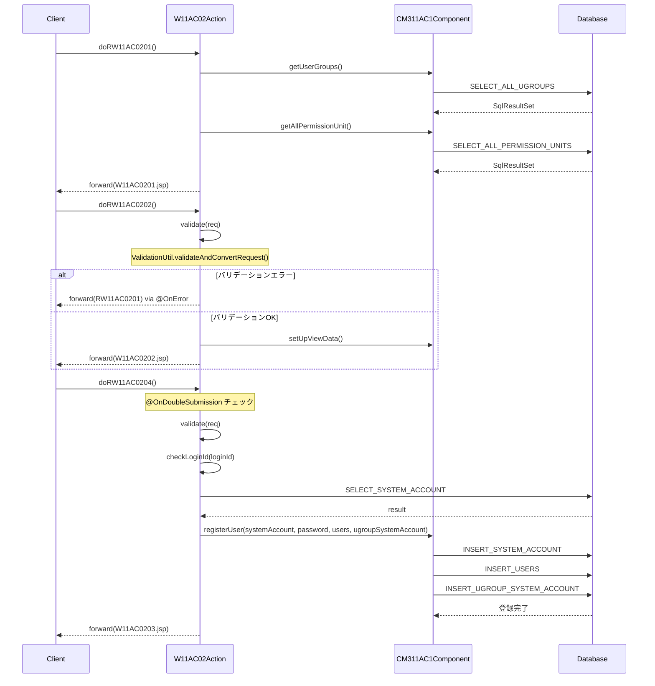

# Code Analysis: W11AC02Action

**Generated**: 2026-03-31 16:55:30
**Target**: ユーザ情報登録機能のアクションクラス
**Modules**: nablarch.sample.ss11AC
**Analysis Duration**: approx. 3m 50s

---

## Overview

`W11AC02Action`はNablarch 1.2のウェブアプリケーションにおけるユーザ情報登録機能のアクションクラスである。`DbAccessSupport`を継承し、ユーザ登録の4ステップ（初期表示 → 入力確認 → 入力画面へ戻る → 登録確定）をそれぞれのメソッドで処理する。バリデーション（`ValidationUtil`）、二重サブミット防止（`@OnDoubleSubmission`）、エラーハンドリング（`@OnError`）を組み合わせた典型的なNablarch 1.x Webアクションの実装パターンである。

主な構成要素：
- **W11AC02Action**: アクションクラス。リクエスト受付・バリデーション実行・DB登録の調整
- **W11AC02Form**: 画面入力値の精査を担うフォームクラス（3つのEntityを包含）
- **CM311AC1Component**: ユーザ管理機能の内部共通コンポーネント。DB操作を担当

---

## Architecture

### Dependency Graph

```mermaid
classDiagram
    class W11AC02Action {
        <<Action>>
    }
    class DbAccessSupport {
        <<Nablarch>>
    }
    class W11AC02Form {
        <<Form>>
    }
    class CM311AC1Component {
        <<Component>>
    }
    class ValidationUtil {
        <<Nablarch>>
    }
    class ValidationContext {
        <<Nablarch>>
    }
    class ExecutionContext {
        <<Nablarch>>
    }
    class SystemAccountEntity {
        <<Entity>>
    }
    class UsersEntity {
        <<Entity>>
    }
    class UgroupSystemAccountEntity {
        <<Entity>>
    }

    W11AC02Action --|> DbAccessSupport : extends
    CM311AC1Component --|> DbAccessSupport : extends
    W11AC02Action ..> W11AC02Form : validates
    W11AC02Action ..> CM311AC1Component : delegates to
    W11AC02Action ..> ExecutionContext : uses
    W11AC02Form ..> ValidationUtil : uses
    W11AC02Form ..> ValidationContext : uses
    W11AC02Form ..> SystemAccountEntity : contains
    W11AC02Form ..> UsersEntity : contains
    W11AC02Form ..> UgroupSystemAccountEntity : contains
```



**Note**: This diagram uses Mermaid `classDiagram` syntax to show class names and their relationships. Use `--|>` for inheritance (extends/implements) and `..>` for dependencies (uses/creates).

### Component Summary

| Component | Role | Type | Dependencies |
|-----------|------|------|--------------|
| W11AC02Action | ユーザ登録の4ステップ処理を行うアクションクラス | Action | W11AC02Form, CM311AC1Component, ExecutionContext |
| W11AC02Form | ユーザ登録入力値の精査を担うフォームクラス | Form | SystemAccountEntity, UsersEntity, UgroupSystemAccountEntity, ValidationUtil |
| CM311AC1Component | DB操作（グループ取得・存在確認・ユーザ登録）を担う共通コンポーネント | Component | DbAccessSupport, ParameterizedSqlPStatement |
| SystemAccountEntity | システムアカウントテーブルのエンティティ | Entity | なし |
| UsersEntity | ユーザテーブルのエンティティ | Entity | なし |
| UgroupSystemAccountEntity | グループシステムアカウントテーブルのエンティティ | Entity | なし |

---

## Flow

### Processing Flow

`W11AC02Action`は4つのリクエストメソッドを持ち、ユーザ登録の標準的な確認画面フローを実装している。

**主要メソッド**:
- `doRW11AC0201()` (L36-42): 初期表示。`setUpViewData()`でグループ・認可単位情報を取得しリクエストスコープに格納してから登録画面を表示
- `doRW11AC0202()` (L51-61): 確認イベント。バリデーション後、確認画面を表示。エラー時は`@OnError`で入力画面へフォワード
- `doRW11AC0203()` (L70-80): 確認画面から「登録画面へ」戻るイベント。バリデーション実行後に入力画面へ戻る
- `doRW11AC0204()` (L89-111): 登録確定イベント。`@OnDoubleSubmission`で二重サブミット防止。毎回バリデーションを実施後、`CM311AC1Component.registerUser()`で登録実行

**ヘルパーメソッド**:
- `setUpViewData()` (L118-128): グループ一覧・認可単位一覧を取得してリクエストスコープに格納
- `validate()` (L138-173): バリデーション実行、`checkLoginId()`によるログインID重複チェック、グループID・認可単位ID存在チェックを行い、精査済みW11AC02Formを返す
- `checkLoginId()` (L180-187): SQL文`SELECT_SYSTEM_ACCOUNT`でログインIDの重複確認。重複時は`ApplicationException`をスロー

**重要な設計上の注意点**: hiddenタグでクライアント側に保持している入力データは改竄される恐れがあるため、確認画面からの遷移（`doRW11AC0204`）でも必ず`validate(req)`を実行する。

### Sequence Diagram



---

## Components

### W11AC02Action

**ファイル**: [W11AC02Action.java (web-application-07_insert)](../../.claude/skills/nabledge-1.2/knowledge/guide/web-application/assets/web-application-07_insert/W11AC02Action.java)

**役割**: ユーザ情報登録機能のアクションクラス。`DbAccessSupport`を継承し、画面遷移制御・バリデーション実行・DB登録処理を統括する。

**主要メソッド**:
- `doRW11AC0201(HttpRequest, ExecutionContext)` (L36-42): 初期表示処理。`setUpViewData(ctx)`でグループ・認可単位情報をリクエストスコープに格納後、W11AC0201.jspを返す
- `doRW11AC0204(HttpRequest, ExecutionContext)` (L89-111): 登録確定処理。`@OnDoubleSubmission`で二重サブミット防止。バリデーション後にCM311AC1Componentへ委譲して登録実行
- `validate(HttpRequest)` (L138-173): プライベートメソッド。バリデーション実行＋ログインID重複・グループID・認可単位ID存在チェックを一括実施。精査済みW11AC02Formを返す

**依存関係**: W11AC02Form, CM311AC1Component, ExecutionContext, ValidationUtil, ApplicationException, MessageUtil

---

### W11AC02Form

**ファイル**: [W11AC02Form.java (web-application-04_validation)](../../.claude/skills/nabledge-1.2/knowledge/guide/web-application/assets/web-application-04_validation/W11AC02Form.java)

**役割**: ユーザ登録画面の入力フォームクラス。3つのEntityクラス（`SystemAccountEntity`, `UsersEntity`, `UgroupSystemAccountEntity`）をプロパティとして持ち、パスワード等の直接プロパティのバリデーションと、各Entityの`@ValidateFor`メソッド呼び出しを統括する。

**主要メソッド**:
- `validateForRegister(ValidationContext<W11AC02Form>)` (L170-182): `@ValidateFor("registerUser")`付きのバリデーションメソッド。`ValidationUtil.validateWithout(context, new String[0])`で全プロパティ精査後、新パスワードと確認パスワードの一致チェックを実施

**依存関係**: SystemAccountEntity, UsersEntity, UgroupSystemAccountEntity, ValidationUtil, ValidationContext

---

### CM311AC1Component

**ファイル**: [CM311AC1Component.java (web-application-07_insert)](../../.claude/skills/nabledge-1.2/knowledge/guide/web-application/assets/web-application-07_insert/CM311AC1Component.java)

**役割**: ユーザ管理機能内部の共通コンポーネント。グループ情報取得・存在確認・ユーザ登録などのDB操作を担う。`DbAccessSupport`を継承。

**主要メソッド**:
- `getUserGroups()` (L41-44): `SELECT_ALL_UGROUPS`SQL実行、全グループ情報返却
- `registerUser(SystemAccountEntity, String, UsersEntity, UgroupSystemAccountEntity)` (L96-138): ユーザ登録処理全体を担う。ユーザID採番・日付取得・パスワード暗号化・各テーブルINSERT実行
- `existGroupId(UgroupSystemAccountEntity)` (L62-68): グループIDの存在チェック。`CHECK_UGROUP`SQL使用

**依存関係**: ParameterizedSqlPStatement, SqlPStatement, BusinessDateUtil, IdGeneratorUtil, AuthenticationUtil

---

## Nablarch Framework Usage

### ValidationUtil / ValidationContext

**クラス**: `nablarch.core.validation.ValidationUtil` / `nablarch.core.validation.ValidationContext`

**説明**: Nablarch 1.xのバリデーションフレームワーク。`validateAndConvertRequest`でリクエストパラメータを精査・変換し、`ValidationContext`経由で結果と変換済みオブジェクトを取得する。

**使用方法**:
```java
ValidationContext<W11AC02Form> context =
    ValidationUtil.validateAndConvertRequest("W11AC02",
            W11AC02Form.class, req, "registerUser");
if (!context.isValid()) {
    throw new ApplicationException(context.getMessages());
}
W11AC02Form form = context.createObject();
```

**重要ポイント**:
- ✅ **必ず`isValid()`チェック**: バリデーション後に`isValid()`でエラー有無を確認し、エラーの場合は`ApplicationException`をスローする
- ⚠️ **第4引数の名称一致**: `validateAndConvertRequest`の第4引数（`"registerUser"`）は、Formクラスの`@ValidateFor`アノテーション値と一致させること
- 💡 **Entityのバリデーション連鎖**: FormクラスのEntityプロパティに`@ValidationTarget`を付与すると、対応するEntityの`@ValidateFor`メソッドも自動的に呼び出される

**このコードでの使い方**:
- `validate(HttpRequest)`メソッド (L141-146) でバリデーション実行
- `"registerUser"`がW11AC02Formの`@ValidateFor("registerUser")`と対応
- `context.createObject()`でW11AC02Formインスタンスを生成

**詳細**: [Web Application 04 Validation](../../.claude/skills/nabledge-1.2/docs/guide/web-application/web-application-04_validation.md)

---

### @OnDoubleSubmission

**クラス**: `nablarch.common.web.token.OnDoubleSubmission`

**説明**: トークンチェックにより二重サブミットを防止するアノテーション。メソッド実行前にトークン検証を行い、二重サブミットと判定した場合は指定パスへフォワードする。

**使用方法**:
```java
@OnDoubleSubmission(
    path = "forward://RW11AC0201"  // 二重サブミット時の遷移先
)
public HttpResponse doRW11AC0204(HttpRequest req, ExecutionContext ctx) {
    // ...
}
```

**重要ポイント**:
- ✅ **確定処理メソッドに必須**: DB登録・更新・削除など副作用のある確定処理に適用すること
- ⚠️ **hidden入力の改竄リスク**: `@OnDoubleSubmission`があっても、クライアント側hiddenタグの入力値は改竄される可能性があるため、確定メソッドでも毎回`validate(req)`を実行すること
- 💡 **`@OnError`との併用**: バリデーションエラー時の遷移先と二重サブミット時の遷移先を個別に制御できる

**このコードでの使い方**:
- `doRW11AC0204` (L90) に`@OnDoubleSubmission(path = "forward://RW11AC0201")`を付与
- 二重クリックによる重複登録を防止

**詳細**: [Web Application 07 Insert](../../.claude/skills/nabledge-1.2/docs/guide/web-application/web-application-07_insert.md)

---

### @OnError

**クラス**: `nablarch.fw.web.interceptor.OnError`

**説明**: 指定した例外が発生した場合の遷移先を制御するアノテーション。`ApplicationException`が発生した際に自動的に指定パスへフォワードする。

**使用方法**:
```java
@OnError(type = ApplicationException.class, path = "forward://RW11AC0201")
public HttpResponse doRW11AC0202(HttpRequest req, ExecutionContext ctx) {
    // バリデーションエラー時は自動的に forward://RW11AC0201 へ
    validate(req);
    // ...
}
```

**重要ポイント**:
- ✅ **バリデーションを伴うメソッドに適用**: `validate()`を呼び出すメソッドには必ず付与して、エラー時の遷移先を明示する
- 💡 **エラー画面への自動フォワード**: try-catchを書かずに例外時の画面遷移を宣言的に定義できる

**このコードでの使い方**:
- `doRW11AC0202`, `doRW11AC0203`, `doRW11AC0204` (L51, L70, L89) に付与
- `ApplicationException`発生時は`forward://RW11AC0201`（登録入力画面）へフォワード

**詳細**: [Web Application 04 Validation](../../.claude/skills/nabledge-1.2/docs/guide/web-application/web-application-04_validation.md)

---

### DbAccessSupport

**クラス**: `nablarch.core.db.support.DbAccessSupport`

**説明**: SQLファイルからSQL文を取得してDB操作を行うための基底クラス。`getSqlPStatement()`や`getParameterizedSqlStatement()`でSQL文を取得し実行する。

**使用方法**:
```java
// 通常のSQL文（パラメータバインド）
SqlPStatement statement = getSqlPStatement("SELECT_SYSTEM_ACCOUNT");
statement.setString(1, loginId);
SqlResultSet result = statement.retrieve();

// Beanバインドの更新
ParameterizedSqlPStatement statement = getParameterizedSqlStatement("INSERT_SYSTEM_ACCOUNT");
statement.executeUpdateByObject(systemAccount);
```

**重要ポイント**:
- ✅ **SQL IDはSQLファイルと一致させる**: `getSqlPStatement`の引数はSQLファイルに定義されたSQL IDと完全一致が必要
- 💡 **`executeUpdateByObject`でBeanバインド**: Entityオブジェクトのプロパティ名とSQL文の`:paramName`が自動対応する

**このコードでの使い方**:
- `W11AC02Action.checkLoginId()` (L181) で`getSqlPStatement("SELECT_SYSTEM_ACCOUNT")`を使用
- `CM311AC1Component`の各メソッドで`ParameterizedSqlPStatement`によるINSERT実行

---

## References

### Source Files

- [W11AC02Action.java (web-application-07_insert)](../../.claude/skills/nabledge-1.2/knowledge/guide/web-application/assets/web-application-07_insert/W11AC02Action.java) - W11AC02Action
- [W11AC02Form.java (web-application-04_validation)](../../.claude/skills/nabledge-1.2/knowledge/guide/web-application/assets/web-application-04_validation/W11AC02Form.java) - W11AC02Form
- [CM311AC1Component.java (web-application-07_insert)](../../.claude/skills/nabledge-1.2/knowledge/guide/web-application/assets/web-application-07_insert/CM311AC1Component.java) - CM311AC1Component

### Knowledge Base (Nabledge-1.2)

- [Web Application 07 Insert](../../.claude/skills/nabledge-1.2/docs/guide/web-application/web-application-07_insert.md)
- [Web Application 04 Validation](../../.claude/skills/nabledge-1.2/docs/guide/web-application/web-application-04_validation.md)
- [Libraries 08 02 Validation Usage](../../.claude/skills/nabledge-1.2/docs/component/libraries/libraries-08_02_validation_usage.md)

### Official Documentation

(No official documentation links available)

---

**Output**: `.nabledge/20260331/code-analysis-W11AC02Action.md`

**Note**: This documentation was generated by the code-analysis workflow of the nabledge-1.2 skill.
