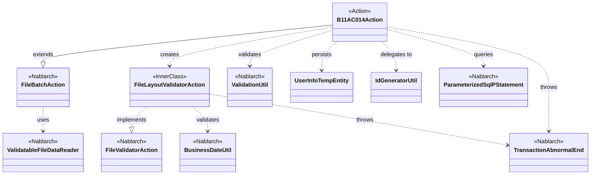
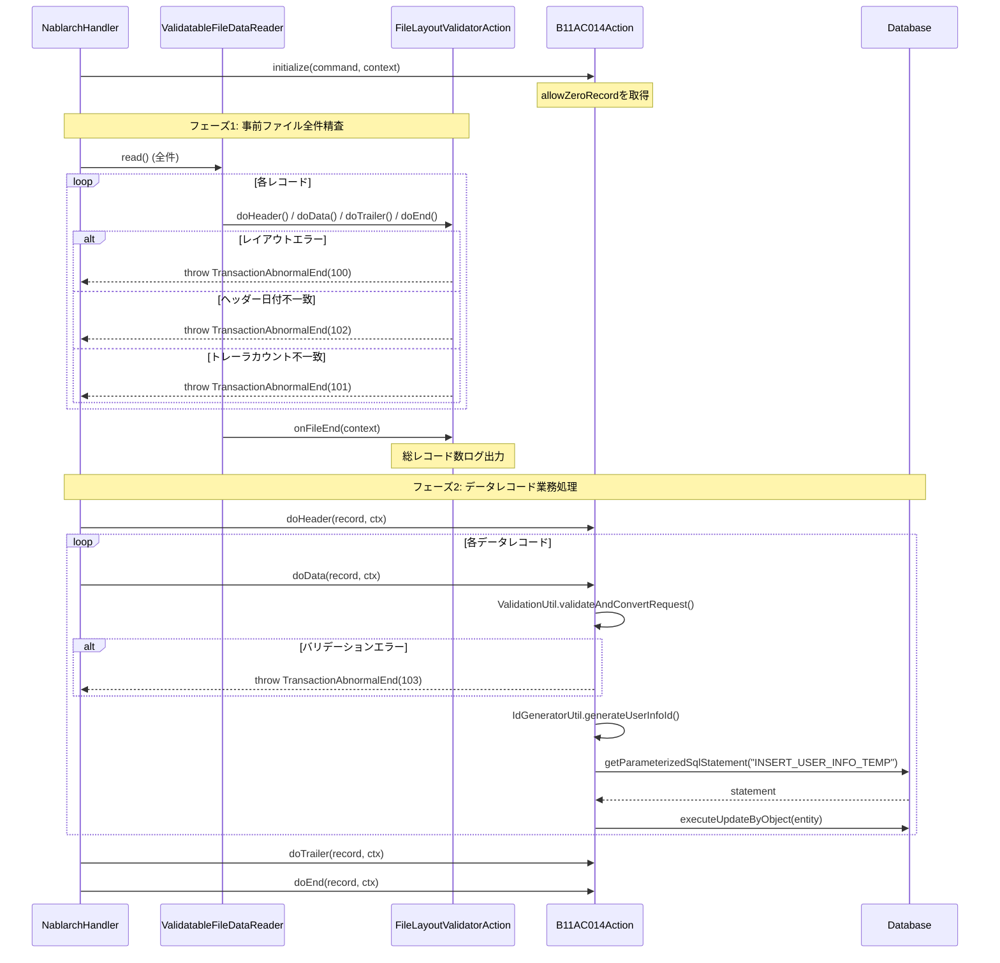

# Code Analysis: B11AC014Action

**Generated**: 2026-03-31 16:55:19
**Target**: ユーザ情報ファイルを読み込みユーザ情報テンポラリに保存するバッチアクション
**Modules**: nablarch.sample
**Analysis Duration**: approx. 2m 59s

---

## Overview

`B11AC014Action` は、ユーザ情報ファイル（N11AA002）を読み込み、バリデーション後にユーザ情報テンポラリテーブルへ登録するファイル入力バッチアクションである。`FileBatchAction` を継承し、`ValidatableFileDataReader` による事前ファイル全件精査（レイアウト検証）と、データレコード処理での個別バリデーション・DB登録を行う二段構えの処理構造を持つ。

内部クラス `FileLayoutValidatorAction` がファイルレイアウト全体の整合性（レコード順序・トレーラカウント一致・業務日付一致）を事前に検証し、本体の `doData()` では個別データレコードのバリデーションとDB登録のみを担当することで、処理責務が明確に分離されている。

---

## Architecture

### Dependency Graph



**Note**: This diagram uses Mermaid `classDiagram` syntax to show class names and their relationships. Use `--|>` for inheritance (extends/implements) and `..>` for dependencies (uses/creates).

### Component Summary

| Component | Role | Type | Dependencies |
|-----------|------|------|--------------|
| B11AC014Action | ファイル入力バッチメイン処理 | Action | FileBatchAction, ValidationUtil, UserInfoTempEntity, IdGeneratorUtil, ParameterizedSqlPStatement |
| FileLayoutValidatorAction | ファイルレイアウト事前精査 | InnerClass | BusinessDateUtil, TransactionAbnormalEnd |
| UserInfoTempEntity | ユーザ情報テンポラリエンティティ | Entity | ValidationUtil |
| IdGeneratorUtil | ユーザ情報ID採番ユーティリティ | Utility | IdGenerator (Nablarch) |

---

## Flow

### Processing Flow

バッチフレームワークのハンドラが `B11AC014Action` の各メソッドを順次呼び出す。処理は2フェーズに分かれる。

**フェーズ1: 事前ファイルレイアウト精査（FileLayoutValidatorAction）**

`getValidatorAction()` で返された `FileLayoutValidatorAction` が `ValidatableFileDataReader` によって事前に全レコードを精査する。

- `initialize()`: コマンドライン引数 `allowZeroRecord` を取得して保持
- `doHeader()` (Validator): 1レコード目であること、業務日付と一致することを検証
- `doData()` (Validator): 前レコードがヘッダーまたはデータであることを検証、カウントを増加
- `doTrailer()` (Validator): 前レコードがデータであること、総レコード数がカウントと一致することを検証
- `doEnd()` (Validator): 前レコードがトレーラであることを検証
- `onFileEnd()`: 最終レコードがエンドであることを検証、ログ出力

各精査でエラーがあれば `TransactionAbnormalEnd` をスローしてバッチを異常終了。

**フェーズ2: データレコードの業務処理（B11AC014Action本体）**

事前精査成功後、ハンドラが各レコードに対して業務処理メソッドを呼び出す。

- `doHeader()`: 何もしない（精査済み）
- `doData()`: `ValidationUtil.validateAndConvertRequest()` でレコードを `UserInfoTempEntity` へ変換・バリデーション → IDを採番 → `ParameterizedSqlPStatement` でINSERT
- `doTrailer()`: 何もしない（精査済み）
- `doEnd()`: 何もしない（精査済み）

### Sequence Diagram



---

## Components

### B11AC014Action

**ファイル**: [B11AC014Action.java](../../.lw/nab-official/v1.2/tutorial/main/java/nablarch/sample/ss11AC/B11AC014Action.java)

**役割**: ファイル入力バッチのメイン処理クラス。ファイルレコードを読み込み、バリデーション後にDB登録を行う。

**主要メソッド**:
- `initialize()` (L42-44): コマンドライン引数 `allowZeroRecord` を取得
- `doData()` (L68-91): データレコードのバリデーション・DB登録
- `getValidatorAction()` (L135-137): `FileLayoutValidatorAction` を返す（事前精査登録）
- `getDataFileName()` / `getFormatFileName()` (L124-132): ファイルID `N11AA002` を返す

**依存コンポーネント**: FileBatchAction (継承), ValidationUtil, UserInfoTempEntity, IdGeneratorUtil, ParameterizedSqlPStatement

---

### FileLayoutValidatorAction (内部クラス)

**ファイル**: [B11AC014Action.java L157-315](../../.lw/nab-official/v1.2/tutorial/main/java/nablarch/sample/ss11AC/B11AC014Action.java)

**役割**: `ValidatableFileDataReader.FileValidatorAction` の実装。ファイル全体のレイアウト整合性を事前検証する。

**主要メソッド**:
- `doHeader()` (L198-216): 初回レコード確認・業務日付一致検証
- `doData()` (L227-239): レコード順序検証・カウントインクリメント
- `doTrailer()` (L253-277): 順序検証・総レコード数一致・0件チェック
- `doEnd()` (L288-296): 最終レコード検証
- `onFileEnd()` (L303-312): 終端検証・ログ出力

**依存コンポーネント**: BusinessDateUtil, TransactionAbnormalEnd

---

### UserInfoTempEntity

**ファイル**: [UserInfoTempEntity.java](../../.lw/nab-official/v1.2/tutorial/main/java/nablarch/sample/ss11/entity/UserInfoTempEntity.java)

**役割**: ユーザ情報テンポラリテーブルのエンティティ。バリデーションアノテーションとDB自動プロパティアノテーションを持つ。

**主要メソッド**:
- `validateForRegister()` (L431): `validateRegister` グループのバリデーションメソッド
- 各 `setXxx()`: `@Required`, `@Length`, `@SystemChar` アノテーション付きセッター

**依存コンポーネント**: ValidationUtil (間接), @UserId, @CurrentDateTime, @RequestId, @ExecutionId

---

### IdGeneratorUtil

**ファイル**: [IdGeneratorUtil.java](../../.lw/nab-official/v1.2/tutorial/main/java/nablarch/sample/util/IdGeneratorUtil.java)

**役割**: Nablarchの `IdGenerator` を使ってIDを採番するユーティリティクラス。

**主要メソッド**:
- `generateUserInfoId()` (L38-41): ユーザ情報IDを20桁左0パディングで採番

**依存コンポーネント**: IdGenerator (Nablarch, SystemRepository経由)

---

## Nablarch Framework Usage

### FileBatchAction

**クラス**: `nablarch.fw.action.FileBatchAction`

**説明**: ファイル入力バッチの基底クラス。`ValidatableFileDataReader` との連携や、ハンドラチェーンへのアクション登録を提供する。

**使用方法**:
```java
public class B11AC014Action extends FileBatchAction {
    @Override
    public String getDataFileName() { return "N11AA002"; }

    @Override
    public String getFormatFileName() { return "N11AA002"; }

    @Override
    public ValidatableFileDataReader.FileValidatorAction getValidatorAction() {
        return new FileLayoutValidatorAction();
    }
}
```

**重要ポイント**:
- ✅ **`getValidatorAction()` をオーバーライド**: ファイルレイアウト精査が必要な場合は必ずオーバーライドして精査クラスを返す
- 💡 **事前精査と業務処理の分離**: `FileValidatorAction` が全件精査後、業務処理メソッドが呼ばれる
- ⚠️ **`getDataFileName()`/`getFormatFileName()` の一致**: データファイルとフォーマット定義ファイルのIDが一致していること

**このコードでの使い方**:
- ファイルID `N11AA002` を `getDataFileName()` と `getFormatFileName()` で返す
- `getValidatorAction()` で `FileLayoutValidatorAction` を返して事前精査を登録

**詳細**: [Nablarch Batch File Input](../../.claude/skills/nabledge-1.2/docs/guide/nablarch-batch/nablarch-batch-04_fileInputBatch.md)

---

### ValidatableFileDataReader / FileValidatorAction

**クラス**: `nablarch.fw.reader.ValidatableFileDataReader`, `nablarch.fw.reader.ValidatableFileDataReader.FileValidatorAction`

**説明**: ファイルデータリーダに事前全件精査機能を追加したクラス。`FileValidatorAction` インタフェースに精査ロジックを実装する。

**使用方法**:
```java
private class FileLayoutValidatorAction implements ValidatableFileDataReader.FileValidatorAction {
    public Result doHeader(DataRecord inputData, ExecutionContext ctx) { ... }
    public Result doData(DataRecord inputData, ExecutionContext ctx) { ... }
    public Result doTrailer(DataRecord inputData, ExecutionContext ctx) { ... }
    public Result doEnd(DataRecord inputData, ExecutionContext ctx) { ... }
    public void onFileEnd(ExecutionContext ctx) { ... }
}
```

**重要ポイント**:
- ✅ **`onFileEnd()` は必須**: ファイル終端処理で最終レコードのレコード区分確認などを実施
- ✅ **メソッド名規約**: `do[レコードタイプ名]()` の形式で実装（例: `doHeader`, `doData`）
- ⚠️ **`useCache` はデフォルト `false`**: メモリ節約のため通常はキャッシュしない。大量データではメモリ消費に注意

**このコードでの使い方**:
- `FileLayoutValidatorAction` に4種類のレコードタイプ（header/data/trailer/end）の精査メソッドを実装
- `preRecordKbn` で前レコードのタイプを追跡してレコード順序を検証

**詳細**: [Readers ValidatableFileDataReader](../../.claude/skills/nabledge-1.2/docs/component/readers/readers-ValidatableFileDataReader.md)

---

### ValidationUtil / ValidationContext

**クラス**: `nablarch.core.validation.ValidationUtil`, `nablarch.core.validation.ValidationContext`

**説明**: 入力データのバリデーションとエンティティへのマッピングを提供するクラス群。

**使用方法**:
```java
ValidationContext<UserInfoTempEntity> validationContext =
    ValidationUtil.validateAndConvertRequest(
        UserInfoTempEntity.class,
        inputData, "validateRegister");

if (!validationContext.isValid()) {
    throw new TransactionAbnormalEnd(103,
        new ApplicationException(validationContext.getMessages()),
        "NB11AA0105", inputData.getRecordNumber());
}

UserInfoTempEntity entity = validationContext.createObject();
```

**重要ポイント**:
- ✅ **`isValid()` チェック後に `createObject()`**: バリデーション成功を確認してからエンティティを生成
- ✅ **`@ValidateFor` で精査グループを指定**: `"validateRegister"` グループのみ実行される
- 💡 **`DataRecord` は `Map<String, Object>` 実装**: SqlRowと同様に変換なしでバリデーション入力に使用可能

**このコードでの使い方**:
- `doData()` で `DataRecord` を `UserInfoTempEntity` に変換・検証
- バリデーションエラー時は `TransactionAbnormalEnd(103)` をスロー

**詳細**: [Libraries Validation Usage](../../.claude/skills/nabledge-1.2/docs/component/libraries/libraries-08_02_validation_usage.md)

---

### TransactionAbnormalEnd

**クラス**: `nablarch.fw.TransactionAbnormalEnd`

**説明**: トランザクションデータ処理中の異常時に送出する例外クラス。フレームワークの例外ハンドラに捕捉されて障害ログに出力される。

**使用方法**:
```java
// バリデーションエラー
throw new TransactionAbnormalEnd(103,
    new ApplicationException(validationContext.getMessages()),
    "NB11AA0105", inputData.getRecordNumber());

// レイアウトエラー
throw new TransactionAbnormalEnd(FILE_LAYOUT_ERROR_EXIT_CODE,
    INVALID_FILE_LAYOUT_FAILURE_CODE, inputData.getRecordNumber());
```

**重要ポイント**:
- ✅ **終了コードはプロジェクト規約に従う**: このバッチでは 100=レイアウトエラー, 101=カウント不一致, 102=日付不一致, 103=バリデーションエラー, 104=0件エラー
- 💡 **例外ハンドラが障害ログを自動出力**: `FailureLogUtil` を直接呼ぶ必要はない
- ⚠️ **スロー後はトランザクションがロールバック**: コミット済みの前トランザクションには影響しない

**このコードでの使い方**:
- `FileLayoutValidatorAction` でファイルレイアウト違反時にスロー
- `doData()` でバリデーションエラー時にスロー

**詳細**: [Libraries FailureLog](../../.claude/skills/nabledge-1.2/docs/component/libraries/libraries-01_FailureLog.md)

---

## References

### Source Files

- [B11AC014Action.java](../../.lw/nab-official/v1.2/tutorial/main/java/nablarch/sample/ss11AC/B11AC014Action.java) - B11AC014Action
- [UserInfoTempEntity.java](../../.lw/nab-official/v1.2/tutorial/main/java/nablarch/sample/ss11/entity/UserInfoTempEntity.java) - UserInfoTempEntity
- [IdGeneratorUtil.java](../../.lw/nab-official/v1.2/tutorial/main/java/nablarch/sample/util/IdGeneratorUtil.java) - IdGeneratorUtil

### Knowledge Base (Nabledge-5)

- [Nablarch Batch 04 File Input Batch](../../.claude/skills/nabledge-1.2/docs/guide/nablarch-batch/nablarch-batch-04_fileInputBatch.md)
- [Readers ValidatableFileDataReader](../../.claude/skills/nabledge-1.2/docs/component/readers/readers-ValidatableFileDataReader.md)
- [Libraries 08 02 Validation Usage](../../.claude/skills/nabledge-1.2/docs/component/libraries/libraries-08_02_validation_usage.md)
- [Libraries 01 FailureLog](../../.claude/skills/nabledge-1.2/docs/component/libraries/libraries-01_FailureLog.md)

### Official Documentation

(No official documentation links available)

---

**Output**: `.nabledge/20260331/code-analysis-B11AC014Action.md`

**Note**: This documentation was generated by the code-analysis workflow of the nabledge-1.2 skill.
