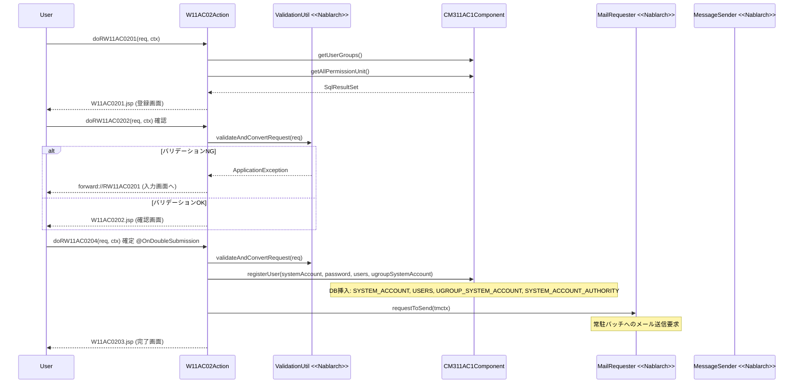

# Code Analysis: W11AC02Action

**Generated**: 2026-03-30 13:24:44
**Target**: ユーザー登録機能のアクションクラス
**Modules**: tutorial
**Analysis Duration**: approx. 3m 6s

---

## Overview

`W11AC02Action` は Nablarch 1.3 チュートリアルにおけるユーザー登録機能のアクションクラスである。`DbAccessSupport` を継承し、5つのハンドラメソッドを通じて「登録画面表示 → 確認 → 登録確定」の画面遷移フローと、メッセージ送信によるユーザー登録の2つの登録パターンを実装している。バリデーション（`ValidationUtil`）、DB挿入（`ParameterizedSqlPStatement`）、メール送信（`MailRequester`）、同期メッセージ送信（`MessageSender`）の各 Nablarch 機能を統合して利用する。二重サブミット防止（`@OnDoubleSubmission`）とエラーハンドリング（`@OnError`）により、堅牢な業務フローを実現している。

---

## Architecture

### Dependency Graph

```mermaid
classDiagram
    class W11AC02Action {
        <<Action>>
    }
    class DbAccessSupport {
        <<Nablarch>>
    }
    class W11AC02Form {
        <<Form>>
    }
    class CM311AC1Component {
        <<Component>>
    }
    class SystemAccountEntity {
        <<Entity>>
    }
    class UsersEntity {
        <<Entity>>
    }
    class UgroupSystemAccountEntity {
        <<Entity>>
    }
    class ValidationUtil {
        <<Nablarch>>
    }
    class MailRequester {
        <<Nablarch>>
    }
    class MessageSender {
        <<Nablarch>>
    }
    class W11AC01SearchForm {
        <<Form>>
    }

    W11AC02Action --|> DbAccessSupport : extends
    CM311AC1Component --|> DbAccessSupport : extends
    W11AC02Action ..> W11AC02Form : validates
    W11AC02Action ..> CM311AC1Component : delegates to
    W11AC02Action ..> ValidationUtil : invokes
    W11AC02Action ..> MailRequester : sends mail via
    W11AC02Action ..> MessageSender : sends sync msg via
    W11AC02Action ..> W11AC01SearchForm : creates
    W11AC02Form ..> SystemAccountEntity : contains
    W11AC02Form ..> UsersEntity : contains
    W11AC02Form ..> UgroupSystemAccountEntity : contains
    CM311AC1Component ..> SystemAccountEntity : persists
    CM311AC1Component ..> UsersEntity : persists
    CM311AC1Component ..> UgroupSystemAccountEntity : persists
```



**Note**: This diagram uses Mermaid `classDiagram` syntax to show class names and their relationships. Use `--|>` for inheritance (extends/implements) and `..>` for dependencies (uses/creates).

### Component Summary

| Component | Role | Type | Dependencies |
|-----------|------|------|--------------|
| W11AC02Action | ユーザー登録の画面フロー制御 | Action | W11AC02Form, CM311AC1Component, ValidationUtil, MailRequester, MessageSender |
| W11AC02Form | ユーザー登録入力フォームとバリデーション定義 | Form | SystemAccountEntity, UsersEntity, UgroupSystemAccountEntity |
| CM311AC1Component | ユーザー管理の共通DB操作コンポーネント | Component | DbAccessSupport, SystemAccountEntity, UsersEntity, UgroupSystemAccountEntity |
| SystemAccountEntity | システムアカウント情報のエンティティ | Entity | なし |
| UsersEntity | ユーザー基本情報のエンティティ | Entity | なし |
| UgroupSystemAccountEntity | グループシステムアカウント情報のエンティティ | Entity | なし |

---

## Flow

### Processing Flow

ユーザー登録機能は2つのフローで構成される。

**フロー1: 直接DB登録 (`doRW11AC0204`)**
1. `doRW11AC0201`: 登録画面表示。グループ・認可単位情報をリクエストスコープへ格納し、入力画面JSPを返す
2. `doRW11AC0202`: 「確認」イベント。バリデーション実施後、確認画面JSPを返す
3. `doRW11AC0203`: 「登録画面へ」イベント。再バリデーション後、入力画面へ戻る
4. `doRW11AC0204`: 「確定」イベント（`@OnDoubleSubmission`）。バリデーション・エンティティ生成 → `CM311AC1Component.registerUser()` でDB挿入 → `sendMailToRegisteredUser()` でメール送信要求 → 完了画面

**フロー2: メッセージ送信によるユーザー登録 (`doRW11AC0205`)**
1. `doRW11AC0205`: 「メッセージ送信」イベント（`@OnDoubleSubmission`）。バリデーション後、`MessageSender.sendSync()` で同期メッセージ送信 → 応答電文からユーザーIDを取得 → 完了画面

エラー発生時はいずれも `@OnError` により入力画面（`forward://RW11AC0201`）へフォワードする。

### Sequence Diagram



---

## Components

### W11AC02Action

**ファイル**: [W11AC02Action.java](../../.lw/nab-official/v1.3/tutorial/main/java/please/change/me/tutorial/ss11AC/W11AC02Action.java)

**役割**: ユーザー登録機能全体の画面フロー制御。バリデーション、DB登録委譲、メール・メッセージ送信を統括する。

**主要メソッド**:
- `doRW11AC0201` (L52-58): 登録画面の初期表示。`setUpViewData` でグループ・認可単位情報をリクエストスコープへ格納
- `doRW11AC0202` (L68-77): 「確認」イベント。バリデーション後、確認画面へ
- `doRW11AC0204` (L107-130): 「確定」イベント。`@OnDoubleSubmission` で二重サブミット防止。バリデーション・DB登録・メール送信・完了画面遷移
- `doRW11AC0205` (L244-288): 「メッセージ送信」イベント。同期メッセージ送信によるユーザー登録
- `validate` (L186-215): 共通バリデーションメソッド。LoginIDの重複チェック、グループID・認可単位IDの存在チェックを含む
- `sendMailToRegisteredUser` (L138-159): `TemplateMailContext` を使用した定型メール送信要求
- `setUpViewData` (L166-176): グループ・認可単位情報の取得とリクエストスコープ格納

**依存**: W11AC02Form, CM311AC1Component, ValidationUtil, MailUtil, MessageSender, SystemAccountEntity, UsersEntity

### W11AC02Form

**ファイル**: [W11AC02Form.java](../../.lw/nab-official/v1.3/tutorial/main/java/please/change/me/tutorial/ss11AC/W11AC02Form.java)

**役割**: ユーザー登録画面の入力フォーム。Nablarchバリデーションアノテーションとネストエンティティバリデーションを定義する。

**主要メソッド**:
- `setNewPassword` (L76-78): `@Required`, `@SystemChar`, `@Length(max=20)` でパスワードバリデーション定義
- `validateForRegister` (L164-177): `@ValidateFor("registerUser")` グループのバリデーション。新パスワードと確認パスワードの一致確認（項目間精査）
- `validateForSend` (L184-188): `@ValidateFor("sendUser")` グループのバリデーション。パスワード・権限情報を除外

**依存**: SystemAccountEntity, UsersEntity, UgroupSystemAccountEntity, ValidationUtil

### CM311AC1Component

**ファイル**: [CM311AC1Component.java](../../.lw/nab-official/v1.3/tutorial/main/java/please/change/me/tutorial/ss11AC/CM311AC1Component.java)

**役割**: ユーザー管理機能の共通DB操作コンポーネント。複数の取引から利用されることを想定してFormを引数とせず、Entityを直接受け取る設計。

**主要メソッド**:
- `registerUser` (L97-139): ユーザID採番・日付設定後、システムアカウント・ユーザ・グループシステムアカウント・システムアカウント権限を一括登録
- `registerSystemAccount` (L146-156): `ParameterizedSqlPStatement.executeUpdateByObject()` で単件挿入。`DuplicateStatementException` を `ApplicationException` に変換
- `registerSystemAccountAuthority` (L184-196): `addBatchObject()` + `executeBatch()` でバッチ挿入
- `getUserGroups` (L42-45): グループ一覧取得
- `existGroupId` (L63-69): グループID存在チェック

**依存**: DbAccessSupport, SystemAccountEntity, UsersEntity, UgroupSystemAccountEntity, SystemAccountAuthorityEntity, AuthenticationUtil, IdGeneratorUtil

---

## Nablarch Framework Usage

### ValidationUtil

**クラス**: `nablarch.core.validation.ValidationUtil`

**説明**: HTTPリクエストパラメータをFormオブジェクトへ変換し、アノテーションベースのバリデーションを実施するユーティリティクラス。

**使用方法**:
```java
ValidationContext<W11AC02Form> context = ValidationUtil.validateAndConvertRequest(
        "W11AC02", W11AC02Form.class, req, "registerUser");
context.abortIfInvalid();
W11AC02Form form = context.createObject();
```

**重要ポイント**:
- ✅ **`abortIfInvalid()` を必ず呼ぶ**: バリデーションエラーがある場合に `ApplicationException` をスローする。呼ばない場合、エラーが無視されてしまう
- ⚠️ **`validateFor` 引数で呼び分け**: 登録時は `"registerUser"`、メッセージ送信時は `"sendUser"` など処理ごとに異なるグループを使用する
- 💡 **ネストバリデーション**: `@ValidationTarget` アノテーションを付与したセッターにより、Entityのバリデーションも一括実行できる

**このコードでの使い方**:
- `validate()` メソッド（L189-190）でリクエストパラメータを `W11AC02Form` へ変換しバリデーション実施
- `validateForSendUser()` メソッド（L301-302）でメッセージ送信フロー用バリデーション実施（パスワード・権限除外）
- 各メソッドで再バリデーション実施（hiddenタグ経由のパラメータ改ざん対策）

**詳細**: [Web Application 04_validation](../../.claude/skills/nabledge-1.3/docs/guide/web-application/web-application-04_validation.md)

### OnDoubleSubmission

**クラス**: `nablarch.common.web.token.OnDoubleSubmission`（アノテーション）

**説明**: フォームの二重サブミットを防止するアノテーション。トークン機構によりリクエストを一度だけ処理することを保証する。

**使用方法**:
```java
@OnError(type = ApplicationException.class, path = "forward://RW11AC0201")
@OnDoubleSubmission(path = "forward://RW11AC0201")
public HttpResponse doRW11AC0204(HttpRequest req, ExecutionContext ctx) {
    // 登録処理
}
```

**重要ポイント**:
- ✅ **DB更新メソッドには必ず付与**: 二重サブミットによる重複データ登録を防ぐ
- ⚠️ **`@OnError` と併用**: `@OnDoubleSubmission` は二重サブミット判定時の遷移先を指定し、`@OnError` はバリデーションエラー時の遷移先を指定する。両方が必要
- ⚠️ **再バリデーション必須**: hiddenタグにパラメータが保持されるため、改ざんの可能性がある。`doRW11AC0204` などDBを更新するメソッドでは必ず再バリデーションを実施すること

**このコードでの使い方**:
- `doRW11AC0204`（L106）: 直接DB登録フローの確定処理に付与
- `doRW11AC0205`（L243）: メッセージ送信フローの送信処理に付与

**詳細**: [Web Application 07_insert](../../.claude/skills/nabledge-1.3/docs/guide/web-application/web-application-07_insert.md)

### DbAccessSupport / ParameterizedSqlPStatement

**クラス**: `nablarch.core.db.support.DbAccessSupport`, `nablarch.core.db.statement.ParameterizedSqlPStatement`

**説明**: `DbAccessSupport` はDB操作を行うクラスの基底クラス。`ParameterizedSqlPStatement` はEntityオブジェクトを直接バインドしてSQL実行できるステートメントクラス。

**使用方法**:
```java
// 単件挿入
ParameterizedSqlPStatement statement = getParameterizedSqlStatement("INSERT_SYSTEM_ACCOUNT");
statement.executeUpdateByObject(systemAccount);

// バッチ挿入
ParameterizedSqlPStatement statement = getParameterizedSqlStatement("INSERT_SYSTEM_ACCOUNT_AUTHORITY");
for (String permissionUnit : systemAccount.getPermissionUnit()) {
    systemAccountAuthority.setPermissionUnitId(permissionUnit);
    statement.addBatchObject(systemAccountAuthority);
}
statement.executeBatch();
```

**重要ポイント**:
- ✅ **`DbAccessSupport` を継承**: DB操作クラスは `DbAccessSupport` を継承し `getParameterizedSqlStatement()` を使用する
- ⚠️ **バッチ挿入時は `executeBatch()` の間隔に注意**: 大量データの場合、適宜 `executeBatch()` を呼ばないとメモリ不足・性能劣化の原因になる
- 💡 **Entityフィールド名とSQLの`:フィールド名`が対応**: `executeUpdateByObject()` はEntityのフィールド名をキーにSQL値バインドを行う

**このコードでの使い方**:
- `CM311AC1Component.registerSystemAccount()` (L146): `executeUpdateByObject(systemAccount)` で単件挿入。重複時は `DuplicateStatementException` をキャッチして `ApplicationException` へ変換
- `CM311AC1Component.registerSystemAccountAuthority()` (L184): `addBatchObject()` + `executeBatch()` で権限情報をバッチ挿入

**詳細**: [Web Application 07_insert](../../.claude/skills/nabledge-1.3/docs/guide/web-application/web-application-07_insert.md)

### MessageSender / SyncMessage

**クラス**: `nablarch.fw.messaging.MessageSender`, `nablarch.fw.messaging.SyncMessage`

**説明**: 同期応答メッセージの送受信を行う Nablarch メッセージング機能。外部システムとのリクエスト/レスポンス型通信に使用する。

**使用方法**:
```java
SyncMessage responseMessage = MessageSender.sendSync(
    new SyncMessage("RM11AC0201").addDataRecord(dataRecord));
String userId = (String) responseMessage.getDataRecord().get("userId");
```

**重要ポイント**:
- ✅ **送信先IDを正確に指定**: `new SyncMessage("RM11AC0201")` の引数は電文ID。設定ファイルとの整合性が必要
- ⚠️ **`MessagingException` をキャッチ**: 送信エラーは通常の業務エラーとして扱い `ApplicationException` に変換してユーザーに再試行を促す
- 💡 **応答データの取得**: `responseMessage.getDataRecord()` で応答電文のデータレコードを `Map` として取得できる

**このコードでの使い方**:
- `doRW11AC0205()` (L268-277): `MessageSender.sendSync()` で同期メッセージ送信し、応答からユーザーIDを取得（L279-280）。`MessagingException` を `ApplicationException` に変換（L273-276）

**詳細**: [Mom Messaging 03_userSendSyncMessageAction](../../.claude/skills/nabledge-1.3/docs/guide/mom-messaging/mom-messaging-03_userSendSyncMessageAction.md)

### MailRequester / TemplateMailContext

**クラス**: `nablarch.common.mail.MailRequester`, `nablarch.common.mail.TemplateMailContext`

**説明**: 定型メールの送信要求を行う Nablarch メール機能。メールテンプレートIDと言語を指定してメール送信要求をキューに登録し、常駐バッチが実際の送信を行う。

**使用方法**:
```java
TemplateMailContext tmctx = new TemplateMailContext();
tmctx.setFrom(SystemRepository.getString("defaultFromMailAddress"));
tmctx.addTo(user.getMailAddress());
tmctx.setTemplateId("1");
tmctx.setLang("ja");
tmctx.setReplaceKeyValue("kanjiName", user.getKanjiName());
MailRequester mailRequester = MailUtil.getMailRequester();
mailRequester.requestToSend(tmctx);
```

**重要ポイント**:
- 💡 **非同期送信**: `requestToSend()` はメール送信要求をキューに登録するだけで、実際の送信は常駐バッチが行う
- ✅ **送信元アドレスは `SystemRepository` から取得**: ハードコードせず設定ファイルから取得する
- 🎯 **テンプレートID + プレースホルダー**: テンプレートに定義されたプレースホルダーを `setReplaceKeyValue()` で置換する

**このコードでの使い方**:
- `sendMailToRegisteredUser()` (L138-159): 登録完了時にユーザーへ通知メールを送信要求。テンプレートID `"1"` を使用し、`kanjiName` と `loginId` をプレースホルダー置換

**詳細**: [Web Application 08_complete](../../.claude/skills/nabledge-1.3/docs/guide/web-application/web-application-08_complete.md)

---

## References

### Source Files

- [W11AC02Action.java (.claude/skills/nabledge-1.3/knowledge/guide/web-application/assets/web-application-07_insert)](../../.claude/skills/nabledge-1.3/knowledge/guide/web-application/assets/web-application-07_insert/W11AC02Action.java) - W11AC02Action
- [W11AC02Action.java (.claude/skills/nabledge-1.3/knowledge/guide/web-application/assets/web-application-04_validation)](../../.claude/skills/nabledge-1.3/knowledge/guide/web-application/assets/web-application-04_validation/W11AC02Action.java) - W11AC02Action
- [W11AC02Action.java (.claude/skills/nabledge-1.4/knowledge/guide/web-application/assets/web-application-07_insert)](../../.claude/skills/nabledge-1.4/knowledge/guide/web-application/assets/web-application-07_insert/W11AC02Action.java) - W11AC02Action
- [W11AC02Action.java (.lw/nab-official/v1.3/document/guide/04_Explanation/_source/download)](../../.lw/nab-official/v1.3/document/guide/04_Explanation/_source/download/W11AC02Action.java) - W11AC02Action
- [W11AC02Action.java (.lw/nab-official/v1.3/tutorial/main/java/please/change/me/tutorial/ss11AC)](../../.lw/nab-official/v1.3/tutorial/main/java/please/change/me/tutorial/ss11AC/W11AC02Action.java) - W11AC02Action
- [W11AC02Action.java (.lw/nab-official/v1.2/document/guide/04_Explanation/_source/download)](../../.lw/nab-official/v1.2/document/guide/04_Explanation/_source/download/W11AC02Action.java) - W11AC02Action
- [W11AC02Action.java (.lw/nab-official/v1.2/tutorial/main/java/nablarch/sample/ss11AC)](../../.lw/nab-official/v1.2/tutorial/main/java/nablarch/sample/ss11AC/W11AC02Action.java) - W11AC02Action
- [W11AC02Action.java (.lw/nab-official/v1.4/document/guide/04_Explanation/_source/download)](../../.lw/nab-official/v1.4/document/guide/04_Explanation/_source/download/W11AC02Action.java) - W11AC02Action
- [W11AC02Action.java (.lw/nab-official/v1.4/workflow/sample_application/src/main/java/please/change/me/sample/ss11AC)](../../.lw/nab-official/v1.4/workflow/sample_application/src/main/java/please/change/me/sample/ss11AC/W11AC02Action.java) - W11AC02Action
- [W11AC02Action.java (.lw/nab-official/v1.4/tutorial/tutorial/main/java/please/change/me/tutorial/ss11AC)](../../.lw/nab-official/v1.4/tutorial/tutorial/main/java/please/change/me/tutorial/ss11AC/W11AC02Action.java) - W11AC02Action
- [W11AC02Action.java (tools/knowledge-creator/.cache/v1.3/knowledge/guide/web-application/assets/web-application-07_insert--s1)](../../tools/knowledge-creator/.cache/v1.3/knowledge/guide/web-application/assets/web-application-07_insert--s1/W11AC02Action.java) - W11AC02Action
- [W11AC02Action.java (tools/knowledge-creator/.cache/v1.3/knowledge/guide/web-application/assets/web-application-04_validation--s1)](../../tools/knowledge-creator/.cache/v1.3/knowledge/guide/web-application/assets/web-application-04_validation--s1/W11AC02Action.java) - W11AC02Action
- [W11AC02Action.java (tools/knowledge-creator/.cache/v1.4/knowledge/guide/web-application/assets/web-application-07_insert--s1)](../../tools/knowledge-creator/.cache/v1.4/knowledge/guide/web-application/assets/web-application-07_insert--s1/W11AC02Action.java) - W11AC02Action
- [W11AC02Form.java (.claude/skills/nabledge-1.3/knowledge/guide/web-application/assets/web-application-04_validation)](../../.claude/skills/nabledge-1.3/knowledge/guide/web-application/assets/web-application-04_validation/W11AC02Form.java) - W11AC02Form
- [W11AC02Form.java (.lw/nab-official/v1.3/document/guide/04_Explanation/_source/download)](../../.lw/nab-official/v1.3/document/guide/04_Explanation/_source/download/W11AC02Form.java) - W11AC02Form
- [W11AC02Form.java (.lw/nab-official/v1.3/tutorial/main/java/please/change/me/tutorial/ss11AC)](../../.lw/nab-official/v1.3/tutorial/main/java/please/change/me/tutorial/ss11AC/W11AC02Form.java) - W11AC02Form
- [W11AC02Form.java (.lw/nab-official/v1.2/document/guide/04_Explanation/_source/download)](../../.lw/nab-official/v1.2/document/guide/04_Explanation/_source/download/W11AC02Form.java) - W11AC02Form
- [W11AC02Form.java (.lw/nab-official/v1.2/tutorial/main/java/nablarch/sample/ss11AC)](../../.lw/nab-official/v1.2/tutorial/main/java/nablarch/sample/ss11AC/W11AC02Form.java) - W11AC02Form
- [W11AC02Form.java (.lw/nab-official/v1.4/document/guide/04_Explanation/_source/download)](../../.lw/nab-official/v1.4/document/guide/04_Explanation/_source/download/W11AC02Form.java) - W11AC02Form
- [W11AC02Form.java (.lw/nab-official/v1.4/workflow/sample_application/src/main/java/please/change/me/sample/ss11AC)](../../.lw/nab-official/v1.4/workflow/sample_application/src/main/java/please/change/me/sample/ss11AC/W11AC02Form.java) - W11AC02Form
- [W11AC02Form.java (.lw/nab-official/v1.4/tutorial/tutorial/main/java/please/change/me/tutorial/ss11AC)](../../.lw/nab-official/v1.4/tutorial/tutorial/main/java/please/change/me/tutorial/ss11AC/W11AC02Form.java) - W11AC02Form
- [W11AC02Form.java (tools/knowledge-creator/.cache/v1.3/knowledge/guide/web-application/assets/web-application-04_validation--s1)](../../tools/knowledge-creator/.cache/v1.3/knowledge/guide/web-application/assets/web-application-04_validation--s1/W11AC02Form.java) - W11AC02Form
- [CM311AC1Component.java (.claude/skills/nabledge-1.3/knowledge/guide/web-application/assets/web-application-07_insert)](../../.claude/skills/nabledge-1.3/knowledge/guide/web-application/assets/web-application-07_insert/CM311AC1Component.java) - CM311AC1Component
- [CM311AC1Component.java (.claude/skills/nabledge-1.3/knowledge/guide/web-application/assets/web-application-02_basic)](../../.claude/skills/nabledge-1.3/knowledge/guide/web-application/assets/web-application-02_basic/CM311AC1Component.java) - CM311AC1Component
- [CM311AC1Component.java (.claude/skills/nabledge-1.4/knowledge/guide/web-application/assets/web-application-07_insert)](../../.claude/skills/nabledge-1.4/knowledge/guide/web-application/assets/web-application-07_insert/CM311AC1Component.java) - CM311AC1Component
- [CM311AC1Component.java (.claude/skills/nabledge-1.4/knowledge/guide/web-application/assets/web-application-02_basic)](../../.claude/skills/nabledge-1.4/knowledge/guide/web-application/assets/web-application-02_basic/CM311AC1Component.java) - CM311AC1Component
- [CM311AC1Component.java (.lw/nab-official/v1.3/document/guide/04_Explanation/_source/download)](../../.lw/nab-official/v1.3/document/guide/04_Explanation/_source/download/CM311AC1Component.java) - CM311AC1Component
- [CM311AC1Component.java (.lw/nab-official/v1.3/tutorial/main/java/please/change/me/tutorial/ss11AC)](../../.lw/nab-official/v1.3/tutorial/main/java/please/change/me/tutorial/ss11AC/CM311AC1Component.java) - CM311AC1Component
- [CM311AC1Component.java (.lw/nab-official/v1.2/document/guide/04_Explanation/_source/download)](../../.lw/nab-official/v1.2/document/guide/04_Explanation/_source/download/CM311AC1Component.java) - CM311AC1Component
- [CM311AC1Component.java (.lw/nab-official/v1.2/tutorial/main/java/nablarch/sample/ss11AC)](../../.lw/nab-official/v1.2/tutorial/main/java/nablarch/sample/ss11AC/CM311AC1Component.java) - CM311AC1Component
- [CM311AC1Component.java (.lw/nab-official/v1.4/document/guide/04_Explanation/_source/download)](../../.lw/nab-official/v1.4/document/guide/04_Explanation/_source/download/CM311AC1Component.java) - CM311AC1Component
- [CM311AC1Component.java (.lw/nab-official/v1.4/tutorial/tutorial/main/java/please/change/me/tutorial/ss11AC)](../../.lw/nab-official/v1.4/tutorial/tutorial/main/java/please/change/me/tutorial/ss11AC/CM311AC1Component.java) - CM311AC1Component
- [CM311AC1Component.java (tools/knowledge-creator/.cache/v1.3/knowledge/guide/web-application/assets/web-application-07_insert--s1)](../../tools/knowledge-creator/.cache/v1.3/knowledge/guide/web-application/assets/web-application-07_insert--s1/CM311AC1Component.java) - CM311AC1Component
- [CM311AC1Component.java (tools/knowledge-creator/.cache/v1.3/knowledge/guide/web-application/assets/web-application-02_basic)](../../tools/knowledge-creator/.cache/v1.3/knowledge/guide/web-application/assets/web-application-02_basic/CM311AC1Component.java) - CM311AC1Component
- [CM311AC1Component.java (tools/knowledge-creator/.cache/v1.4/knowledge/guide/web-application/assets/web-application-07_insert--s1)](../../tools/knowledge-creator/.cache/v1.4/knowledge/guide/web-application/assets/web-application-07_insert--s1/CM311AC1Component.java) - CM311AC1Component
- [CM311AC1Component.java (tools/knowledge-creator/.cache/v1.4/knowledge/guide/web-application/assets/web-application-02_basic--s1)](../../tools/knowledge-creator/.cache/v1.4/knowledge/guide/web-application/assets/web-application-02_basic--s1/CM311AC1Component.java) - CM311AC1Component

### Knowledge Base (Nabledge-1.3)

- [Mom Messaging 03_userSendSyncMessageAction](../../.claude/skills/nabledge-1.3/docs/guide/mom-messaging/mom-messaging-03_userSendSyncMessageAction.md)
- [Web Application 07_insert](../../.claude/skills/nabledge-1.3/docs/guide/web-application/web-application-07_insert.md)
- [Web Application 07_confirm_view](../../.claude/skills/nabledge-1.3/docs/guide/web-application/web-application-07_confirm_view.md)
- [Web Application 04_validation](../../.claude/skills/nabledge-1.3/docs/guide/web-application/web-application-04_validation.md)
- [Web Application 08_complete](../../.claude/skills/nabledge-1.3/docs/guide/web-application/web-application-08_complete.md)

### Official Documentation

(No official documentation links available)

---

**Note**: This documentation was generated by the code-analysis workflow of the nabledge-1.3 skill.
