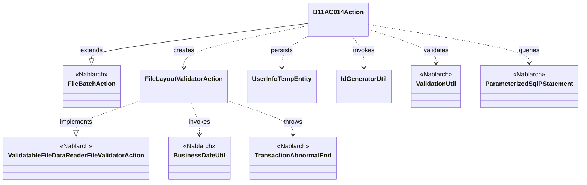
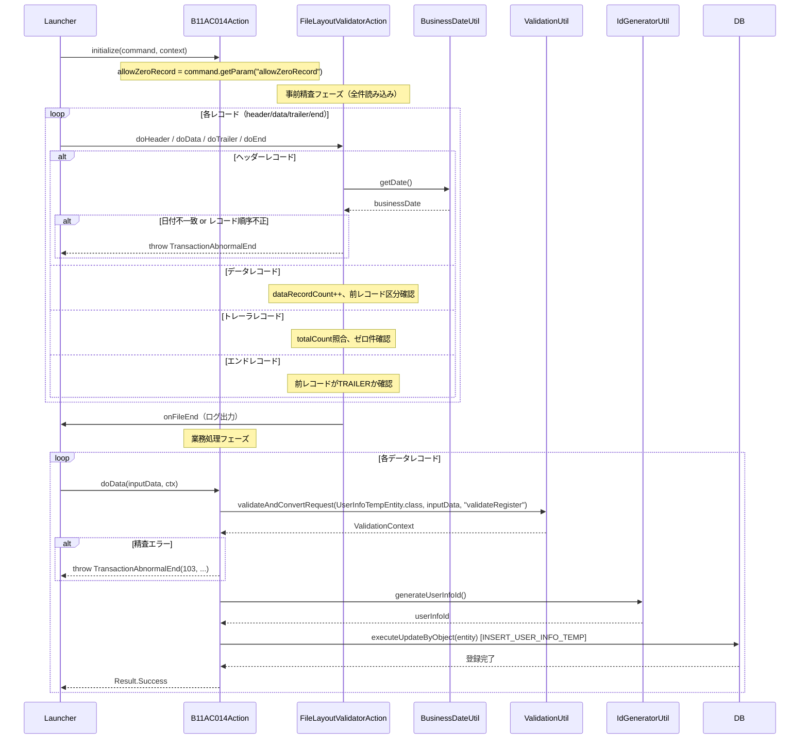

# Code Analysis: B11AC014Action

**Generated**: 2026-03-30 13:30:39
**Target**: ユーザ情報ファイルを読み込み、ユーザ情報テンポラリに保存するファイル入力バッチアクション
**Modules**: tutorial
**Analysis Duration**: approx. 2m 40s

---

## Overview

`B11AC014Action` は、固定長ファイルからユーザ情報を読み込み、バリデーション後にユーザ情報テンポラリテーブルへ登録するファイル入力バッチアクションである。

`FileBatchAction` を継承し、レコード種別（header/data/trailer/end）ごとに業務処理を実装する。ファイルのレイアウト精査は内部クラス `FileLayoutValidatorAction`（`ValidatableFileDataReader.FileValidatorAction` 実装）が担い、全件事前精査を行った後に業務処理が実行される構造となっている。

データレコードの精査は `ValidationUtil.validateAndConvertRequest` を用い、精査エラー時は `TransactionAbnormalEnd` をスローしてバッチを異常終了させる。正常時はエンティティに採番済みIDを設定し、`ParameterizedSqlPStatement` でDBへ登録する。

---

## Architecture

### Dependency Graph



**Note**: This diagram uses Mermaid `classDiagram` syntax to show class names and their relationships. Use `--|>` for inheritance (extends/implements) and `..>` for dependencies (uses/creates).

### Component Summary

| Component | Role | Type | Dependencies |
|-----------|------|------|--------------|
| B11AC014Action | ファイル入力バッチ本体、データ精査・DB登録 | Action | FileBatchAction, FileLayoutValidatorAction, ValidationUtil, UserInfoTempEntity, ParameterizedSqlPStatement, IdGeneratorUtil |
| FileLayoutValidatorAction | ファイルレイアウト事前精査（内部クラス） | FileValidatorAction | BusinessDateUtil, TransactionAbnormalEnd |
| UserInfoTempEntity | ユーザ情報テンポラリのエンティティ兼精査定義 | Entity | ValidationUtil |
| IdGeneratorUtil | ユーザ情報ID採番ユーティリティ | Utility | IdGenerator (Nablarch), SystemRepository |

---

## Flow

### Processing Flow

バッチ起動後、`initialize()` でコマンドライン引数（`allowZeroRecord`）を取得する。その後 `FileBatchAction` の基盤が `ValidatableFileDataReader` を生成し、`FileLayoutValidatorAction` による全件事前精査が実行される。

事前精査フェーズでは、各レコードが header → data(複数) → trailer → end の順で並んでいることを `preRecordKbn` の状態遷移で検証する。ヘッダーレコードでは業務日付との一致確認も行う。トレーラレコードでは `totalCount` フィールドとデータ件数の一致、ゼロ件チェックを実施する。いずれかのチェックに失敗した場合は `TransactionAbnormalEnd` をスローして処理を中断する。

事前精査が成功した後、業務処理フェーズに移行する。`doData()` では `ValidationUtil.validateAndConvertRequest` でデータレコードの各フィールドを精査・変換し、エラー時は `TransactionAbnormalEnd` をスローする。正常時は `IdGeneratorUtil.generateUserInfoId()` でユーザ情報IDを採番し、`ParameterizedSqlPStatement` の `executeUpdateByObject` でユーザ情報テンポラリテーブルに登録する。

### Sequence Diagram



---

## Components

### B11AC014Action

**ファイル**: [B11AC014Action.java](../../.lw/nab-official/v1.3/tutorial/main/java/please/change/me/tutorial/ss11AC/B11AC014Action.java)

**役割**: ユーザ情報固定長ファイルのバッチ読み込みアクション本体。レコードごとの業務処理、ファイルバリデータの生成、DB登録を担う。

**主要メソッド**:

- `initialize(CommandLine, ExecutionContext)` (L43-45): コマンドライン引数 `allowZeroRecord` を取得してインスタンス変数に設定する
- `doData(DataRecord, ExecutionContext)` (L69-92): データレコードの精査・変換後、ユーザ情報IDを採番してテンポラリテーブルに登録する
- `getValidatorAction()` (L136-138): 内部クラス `FileLayoutValidatorAction` を返し、事前精査を有効化する

**依存関係**: FileBatchAction, FileLayoutValidatorAction, ValidationUtil, UserInfoTempEntity, ParameterizedSqlPStatement, IdGeneratorUtil

**実装ポイント**:
- `doHeader`, `doTrailer`, `doEnd` は事前精査で検証済みのためいずれも `new Success()` を返すのみ
- `FILE_ID = "N11AA002"` がデータファイルとフォーマット定義ファイルの両方に使われる
- `allowZeroRecord` フィールドは `initialize()` で初期化され、以降は読み取り専用のためマルチスレッド実行可能

---

### FileLayoutValidatorAction（内部クラス）

**ファイル**: [B11AC014Action.java](../../.lw/nab-official/v1.3/tutorial/main/java/please/change/me/tutorial/ss11AC/B11AC014Action.java) L158-316

**役割**: `ValidatableFileDataReader.FileValidatorAction` 実装。ファイル全件を事前に読み込み、レコード順序とレコード間整合性を精査する。

**主要メソッド**:

- `doHeader(DataRecord, ExecutionContext)` (L199-217): ヘッダーが1レコード目であること、および業務日付との一致を検証する
- `doTrailer(DataRecord, ExecutionContext)` (L254-278): 前レコードチェック、`totalCount` とデータ件数の一致、ゼロ件チェックを実施する
- `onFileEnd(ExecutionContext)` (L304-313): 最終レコードがエンドレコードかを確認し、合計レコード数とデータ件数をログ出力する

**状態変数**:
- `preRecordKbn`: 前レコードの区分（null → "1" → "2" → "8" → "9" の遷移が正常）
- `dataRecordCount`: データレコードの累積件数

---

### UserInfoTempEntity

**ファイル**: [UserInfoTempEntity.java](../../.lw/nab-official/v1.3/tutorial/main/java/please/change/me/tutorial/ss11/entity/UserInfoTempEntity.java)

**役割**: ユーザ情報テンポラリテーブルのエンティティ。セッターにバリデーションアノテーションを付与し、精査定義を持つ。

**主要メソッド**:
- `validateForRegister(ValidationContext)` (L431-450): `@ValidateFor("validateRegister")` で呼び出され、単項目精査と携帯電話番号の項目間精査を実施する

**依存関係**: Nablarch バリデーションアノテーション（`@Required`, `@Length`, `@SystemChar`, `@PropertyName`, `@ValidateFor`）

---

### IdGeneratorUtil

**ファイル**: [IdGeneratorUtil.java](../../.lw/nab-official/v1.3/tutorial/main/java/please/change/me/tutorial/util/IdGeneratorUtil.java)

**役割**: Nablarch の `IdGenerator`（Oracleシーケンス）を使用してユーザ情報ID（20桁左0パディング）を採番するユーティリティ。

**主要メソッド**:
- `generateUserInfoId()` (L38-41): `oracleSequenceIdGenerator` をシステムリポジトリから取得し、シーケンス番号 `"1102"` を採番する

---

## Nablarch Framework Usage

### FileBatchAction

**クラス**: `nablarch.fw.action.FileBatchAction`

**説明**: ファイルを入力とするバッチの業務アクション実装用テンプレートクラス。レコード種別ごとに `do[レコード種別名](DataRecord, ExecutionContext)` を実装する。

**使用方法**:
```java
public class B11AC014Action extends FileBatchAction {

    @Override
    public String getDataFileName() { return "N11AA002"; }

    @Override
    public String getFormatFileName() { return "N11AA002"; }

    public Result doData(DataRecord inputData, ExecutionContext ctx) {
        // データレコード業務処理
        return new Success();
    }
}
```

**重要ポイント**:
- ✅ **`getDataFileName()` と `getFormatFileName()` は必須**: ファイル名とフォーマット定義ファイル名を返す
- ✅ **レコード種別ごとにメソッドを実装**: `doHeader`, `doData`, `doTrailer`, `doEnd` をフォーマット定義に合わせて実装する
- ⚠️ **インスタンス変数とマルチスレッド**: インスタンス変数を使用する場合、`initialize()` で明示的に初期化し、以降は読み取り専用であればマルチスレッド実行可能
- 💡 **`createReader` 実装不要**: スーパークラスが自動でデータリーダを生成する
- 🎯 **事前精査が必要な場合**: `getValidatorAction()` をオーバーライドして `FileValidatorAction` を返す

**このコードでの使い方**:
- `B11AC014Action` が `FileBatchAction` を継承し、`getDataFileName()` / `getFormatFileName()` で `"N11AA002"` を返す
- `initialize()` でコマンドライン引数を取得
- `doData()` に主要業務処理を実装
- `getValidatorAction()` で `FileLayoutValidatorAction` を返して事前精査を有効化

**詳細**: [Handlers FileBatchAction](../../.claude/skills/nabledge-1.3/docs/component/handlers/handlers-FileBatchAction.md)

---

### ValidatableFileDataReader / FileValidatorAction

**クラス**: `nablarch.fw.reader.ValidatableFileDataReader`、`ValidatableFileDataReader.FileValidatorAction`

**説明**: `FileDataReader` に全件事前読み込み・精査機能を追加したデータリーダ。`FileValidatorAction` インターフェースにレコード種別ごとの精査メソッドを実装する。

**使用方法**:
```java
private class FileLayoutValidatorAction
        implements ValidatableFileDataReader.FileValidatorAction {

    public Result doHeader(DataRecord inputData, ExecutionContext ctx) { ... }
    public Result doData(DataRecord inputData, ExecutionContext ctx) { ... }
    public Result doTrailer(DataRecord inputData, ExecutionContext ctx) { ... }
    public Result doEnd(DataRecord inputData, ExecutionContext ctx) { ... }

    public void onFileEnd(ExecutionContext ctx) {
        // ファイル末尾到達後の処理（最終レコード検証、ログ出力）
    }
}
```

**重要ポイント**:
- ✅ **精査メソッド名の規約**: `public Result do[レコード種別名](DataRecord, ExecutionContext)` の形式で実装する（フォーマット定義のレコード種別名と一致させる）
- ✅ **`onFileEnd()` は必須**: ファイル末尾の最終チェックと後処理に使用する
- ⚠️ **`useCache` のデフォルトは `false`**: キャッシュ有効化はメモリを大量消費するため、通常は不要
- ⚠️ **精査エラーは `TransactionAbnormalEnd` でスロー**: `ApplicationException` ではなく `TransactionAbnormalEnd` を使用してバッチを異常終了させる
- 💡 **FileBatchAction と組み合わせる**: `getValidatorAction()` をオーバーライドするだけで事前精査が有効になる

**このコードでの使い方**:
- `FileLayoutValidatorAction` が `FileValidatorAction` を実装
- `preRecordKbn` の状態遷移でレコード順序を検証（null→"1"→"2"→"8"→"9"）
- `onFileEnd()` で最終レコードがエンドレコードであることを確認し、件数をログ出力

**詳細**: [Readers ValidatableFileDataReader](../../.claude/skills/nabledge-1.3/docs/component/readers/readers-ValidatableFileDataReader.md)

---

### ValidationUtil

**クラス**: `nablarch.core.validation.ValidationUtil`

**説明**: Nablarch の精査フレームワーク。エンティティのセッターに付与したアノテーションに基づいてバリデーションを実行し、入力データをエンティティにマッピングする。

**使用方法**:
```java
ValidationContext<UserInfoTempEntity> validationContext =
        ValidationUtil.validateAndConvertRequest(
                UserInfoTempEntity.class,
                inputData,          // DataRecord（ファイルレコード）
                "validateRegister"  // @ValidateFor に指定したメソッド名
        );

if (!validationContext.isValid()) {
    throw new TransactionAbnormalEnd(103,
            new ApplicationException(validationContext.getMessages()),
            "NB11AA0105", inputData.getRecordNumber());
}

UserInfoTempEntity entity = validationContext.createObject();
```

**重要ポイント**:
- ✅ **`validateAndConvertRequest` で精査とマッピングを同時実施**: DataRecord のキーとエンティティのセッター名が一致している必要がある
- ⚠️ **精査エラー時は必ず `TransactionAbnormalEnd` をスロー**: バッチでは `ApplicationException` を直接スローせず、終了コードを指定した `TransactionAbnormalEnd` でラップする
- 💡 **精査グループ（`@ValidateFor`）**: エンティティの `validateRegister` メソッドが `@ValidateFor("validateRegister")` で紐付けられ、単項目精査と項目間精査の両方が実行される

**このコードでの使い方**:
- `doData()` (L71-74) で `UserInfoTempEntity.class` と `"validateRegister"` を指定して呼び出す
- 精査エラー時は終了コード 103 で `TransactionAbnormalEnd` をスロー (L78-81)
- 正常時は `validationContext.createObject()` でエンティティを生成 (L84)

---

### BusinessDateUtil

**クラス**: `nablarch.core.date.BusinessDateUtil`

**説明**: Nablarch の業務日付管理ユーティリティ。システムテーブルに格納された業務日付を取得する。

**使用方法**:
```java
String businessDate = BusinessDateUtil.getDate(); // "20260330" 形式
```

**重要ポイント**:
- 🎯 **バッチファイルのヘッダー検証に使用**: ファイルのヘッダーレコードに含まれる日付が業務日付と一致することを確認するために使用する
- ⚠️ **日付形式はシステム設定に依存**: `getDate()` の返却形式はシステムリポジトリ設定による

**このコードでの使い方**:
- `FileLayoutValidatorAction.doHeader()` (L208-213) でファイルヘッダーの `date` フィールドと業務日付を比較する
- 不一致の場合は終了コード 102 で `TransactionAbnormalEnd` をスロー

---

## References

### Source Files

- [B11AC014Action.java (.lw/nab-official/v1.3/tutorial/main/java/please/change/me/tutorial/ss11AC)](../../.lw/nab-official/v1.3/tutorial/main/java/please/change/me/tutorial/ss11AC/B11AC014Action.java) - B11AC014Action
- [B11AC014Action.java (.lw/nab-official/v1.2/tutorial/main/java/nablarch/sample/ss11AC)](../../.lw/nab-official/v1.2/tutorial/main/java/nablarch/sample/ss11AC/B11AC014Action.java) - B11AC014Action
- [B11AC014Action.java (.lw/nab-official/v1.4/tutorial/tutorial/main/java/please/change/me/tutorial/ss11AC)](../../.lw/nab-official/v1.4/tutorial/tutorial/main/java/please/change/me/tutorial/ss11AC/B11AC014Action.java) - B11AC014Action
- [UserInfoTempEntity.java (.lw/nab-official/v1.3/tutorial/main/java/please/change/me/tutorial/ss11/entity)](../../.lw/nab-official/v1.3/tutorial/main/java/please/change/me/tutorial/ss11/entity/UserInfoTempEntity.java) - UserInfoTempEntity
- [UserInfoTempEntity.java (.lw/nab-official/v1.2/tutorial/main/java/nablarch/sample/ss11/entity)](../../.lw/nab-official/v1.2/tutorial/main/java/nablarch/sample/ss11/entity/UserInfoTempEntity.java) - UserInfoTempEntity
- [UserInfoTempEntity.java (.lw/nab-official/v1.4/tutorial/tutorial/main/java/please/change/me/tutorial/ss11/entity)](../../.lw/nab-official/v1.4/tutorial/tutorial/main/java/please/change/me/tutorial/ss11/entity/UserInfoTempEntity.java) - UserInfoTempEntity
- [IdGeneratorUtil.java (.lw/nab-official/v1.3/tutorial/main/java/please/change/me/tutorial/util)](../../.lw/nab-official/v1.3/tutorial/main/java/please/change/me/tutorial/util/IdGeneratorUtil.java) - IdGeneratorUtil
- [IdGeneratorUtil.java (.lw/nab-official/v5/nablarch-system-development-guide/en/Sample_Project/Source_Code/proman-project/proman-common/src/main/java/com/nablarch/example/proman/common/id)](../../.lw/nab-official/v5/nablarch-system-development-guide/en/Sample_Project/Source_Code/proman-project/proman-common/src/main/java/com/nablarch/example/proman/common/id/IdGeneratorUtil.java) - IdGeneratorUtil
- [IdGeneratorUtil.java (.lw/nab-official/v5/nablarch-system-development-guide/Sample_Project/Source_Code/proman-project/proman-common/src/main/java/com/nablarch/example/proman/common/id)](../../.lw/nab-official/v5/nablarch-system-development-guide/Sample_Project/Source_Code/proman-project/proman-common/src/main/java/com/nablarch/example/proman/common/id/IdGeneratorUtil.java) - IdGeneratorUtil
- [IdGeneratorUtil.java (.lw/nab-official/v1.2/tutorial/main/java/nablarch/sample/util)](../../.lw/nab-official/v1.2/tutorial/main/java/nablarch/sample/util/IdGeneratorUtil.java) - IdGeneratorUtil
- [IdGeneratorUtil.java (.lw/nab-official/v1.4/workflow/sample_application/src/main/java/please/change/me/sample/util)](../../.lw/nab-official/v1.4/workflow/sample_application/src/main/java/please/change/me/sample/util/IdGeneratorUtil.java) - IdGeneratorUtil
- [IdGeneratorUtil.java (.lw/nab-official/v1.4/tutorial/tutorial/main/java/please/change/me/tutorial/util)](../../.lw/nab-official/v1.4/tutorial/tutorial/main/java/please/change/me/tutorial/util/IdGeneratorUtil.java) - IdGeneratorUtil

### Knowledge Base (Nabledge-1.3)

- [Nablarch Batch 04_fileInputBatch](../../.claude/skills/nabledge-1.3/docs/guide/nablarch-batch/nablarch-batch-04_fileInputBatch.md)
- [Readers ValidatableFileDataReader](../../.claude/skills/nabledge-1.3/docs/component/readers/readers-ValidatableFileDataReader.md)
- [Libraries 08_02_validation_usage](../../.claude/skills/nabledge-1.3/docs/component/libraries/libraries-08_02_validation_usage.md)
- [Libraries 01_FailureLog](../../.claude/skills/nabledge-1.3/docs/component/libraries/libraries-01_FailureLog.md)

### Official Documentation

(No official documentation links available)

---

**Note**: This documentation was generated by the code-analysis workflow of the nabledge-1.3 skill.
