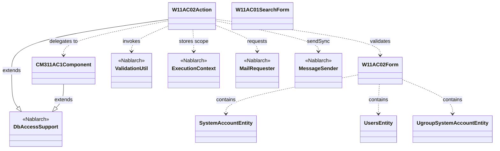
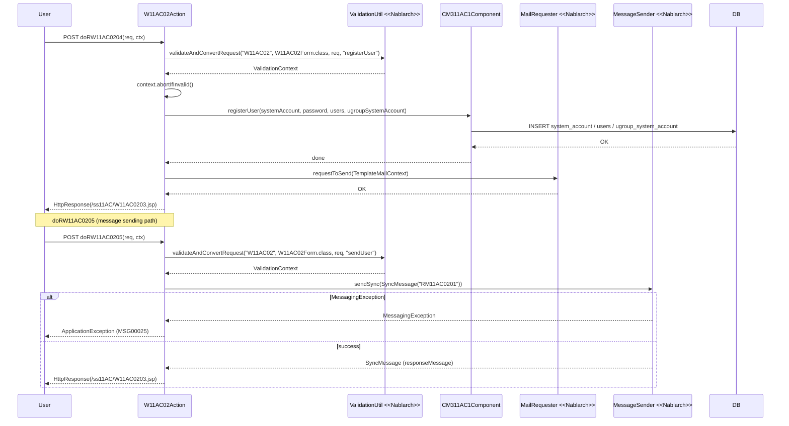

# Code Analysis: W11AC02Action

**Generated**: 2026-03-31 14:31:11
**Target**: ユーザ情報登録機能のアクションクラス
**Modules**: tutorial
**Analysis Duration**: approx. 2m 24s

---

## Overview

`W11AC02Action` はNablarch 1.3チュートリアルのユーザ情報登録機能を担うWebアクションクラス。`DbAccessSupport` を継承し、ユーザ登録の入力画面表示・確認・確定という一連のフローを処理する。確定処理では入力精査・DBへの登録・登録完了メール送信を行う。また、同期メッセージ送信によるユーザ登録（`doRW11AC0205`）パスも提供する。共通ロジックは `CM311AC1Component` に委譲し、`W11AC02Form` で入力値の精査と受け渡しを行う。

---

## Architecture

### Dependency Graph



**Note**: This diagram uses Mermaid `classDiagram` syntax to show class names and their relationships. Use `--|>` for inheritance (extends/implements) and `..>` for dependencies (uses/creates).

### Component Summary

| Component | Role | Type | Dependencies |
|-----------|------|------|--------------|
| W11AC02Action | ユーザ登録画面の入力・確認・確定処理 | Action | W11AC02Form, CM311AC1Component, ValidationUtil, MailRequester, MessageSender, ExecutionContext |
| W11AC02Form | ユーザ登録入力フォーム（単項目・項目間精査） | Form | SystemAccountEntity, UsersEntity, UgroupSystemAccountEntity, ValidationUtil |
| CM311AC1Component | ユーザ管理機能内共通コンポーネント（DB操作） | Component | DbAccessSupport, SystemAccountEntity, UsersEntity, UgroupSystemAccountEntity |
| SystemAccountEntity | システムアカウントテーブル対応エンティティ | Entity | なし |
| UsersEntity | ユーザテーブル対応エンティティ | Entity | なし |
| UgroupSystemAccountEntity | グループシステムアカウントテーブル対応エンティティ | Entity | なし |

---

## Flow

### Processing Flow

ユーザ登録は2パスある。**DBダイレクト登録パス**（`doRW11AC0204`）と**同期メッセージ送信パス**（`doRW11AC0205`）。

1. **初期表示** (`doRW11AC0201`): `setUpViewData()` でグループ・認可単位情報を取得してリクエストスコープに格納し、入力画面を返す
2. **確認** (`doRW11AC0202`): 入力値精査後、確認画面を返す。`@OnError` により精査エラー時は入力画面へフォワード
3. **入力画面へ戻る** (`doRW11AC0203`): 再精査後、入力画面へ戻る
4. **確定（DB直接登録）** (`doRW11AC0204`): `@OnDoubleSubmission` で二重送信防止。精査→`CM311AC1Component.registerUser()`でDB登録→`sendMailToRegisteredUser()`でメール送信要求→完了画面
5. **確定（メッセージ送信）** (`doRW11AC0205`): 精査後、`MessageSender.sendSync()` でRM11AC0201宛てに同期メッセージ送信。応答電文からユーザIDを取得して設定

### Sequence Diagram



---

## Components

### W11AC02Action

**ファイル**: [W11AC02Action.java](../../.lw/nab-official/v1.3/tutorial/main/java/please/change/me/tutorial/ss11AC/W11AC02Action.java)

**役割**: ユーザ情報登録機能のメインアクションクラス。5つのHTTPイベントハンドラメソッドを持つ。

**主要メソッド**:
- `doRW11AC0201` (L52-58): 入力画面初期表示。グループ・認可単位情報をスコープに格納
- `doRW11AC0202` (L68-77): 確認イベント。精査後に確認画面へ遷移
- `doRW11AC0204` (L107-130): 確定イベント（DB直接登録）。`@OnDoubleSubmission` 付き
- `doRW11AC0205` (L244-288): 確定イベント（同期メッセージ送信）。`@OnDoubleSubmission` 付き
- `validate` (L186-215): 入力精査ヘルパー。ログインID重複チェック、グループID/認可単位IDの存在確認を含む
- `sendMailToRegisteredUser` (L138-159): 定型メール送信要求
- `checkLoginId` (L222-230): ログインID重複チェック（SQLで確認）
- `setUpViewData` (L166-176): 表示データの準備（グループ一覧・認可単位一覧）

**依存コンポーネント**: W11AC02Form, CM311AC1Component, ValidationUtil, MailUtil, MailRequester, MessageSender, ExecutionContext, SystemAccountEntity, UsersEntity

### W11AC02Form

**ファイル**: [W11AC02Form.java](../../.lw/nab-official/v1.3/tutorial/main/java/please/change/me/tutorial/ss11AC/W11AC02Form.java)

**役割**: ユーザ登録入力フォーム。3つのエンティティ（Users, SystemAccount, UgroupSystemAccount）とパスワードフィールドを保持。

**主要メソッド**:
- `validateForRegister` (L165-177): `@ValidateFor("registerUser")` — 全項目精査 + 新旧パスワード一致チェック
- `validateForSend` (L184-188): `@ValidateFor("sendUser")` — パスワード・権限情報を除外した精査
- `setNewPassword` (L76-78): `@Required @SystemChar @Length(max=20)` アノテーション付き

**依存コンポーネント**: SystemAccountEntity, UsersEntity, UgroupSystemAccountEntity, ValidationUtil, ValidationContext

### CM311AC1Component

**ファイル**: [CM311AC1Component.java](../../.lw/nab-official/v1.3/tutorial/main/java/please/change/me/tutorial/ss11AC/CM311AC1Component.java)

**役割**: ユーザ管理機能内共通コンポーネント。DB操作（登録・検索・削除）をまとめる。

**主要メソッド**:
- `registerUser` (L97-139): ユーザ登録の統合メソッド。システムアカウント・ユーザ・グループ・権限を一括登録
- `getUserGroups` (L42-45): 全グループ情報を取得
- `existGroupId` (L63-69): グループIDの存在確認
- `existPermissionUnitId` (L77-87): 認可単位IDの存在確認

**依存コンポーネント**: DbAccessSupport, ParameterizedSqlPStatement, SqlPStatement, SystemAccountEntity, UsersEntity, UgroupSystemAccountEntity, BusinessDateUtil, AuthenticationUtil

---

## Nablarch Framework Usage

### ValidationUtil / ValidationContext

**クラス**: `nablarch.core.validation.ValidationUtil`, `nablarch.core.validation.ValidationContext`

**説明**: Webアプリケーションにおける入力精査フレームワーク。アノテーションによる単項目精査と、バリデーションメソッドによる項目間精査を提供する。

**使用方法**:
```java
ValidationContext<W11AC02Form> context = ValidationUtil.validateAndConvertRequest(
        "W11AC02", W11AC02Form.class, req, "registerUser");
context.abortIfInvalid();
W11AC02Form form = context.createObject();
```

**重要ポイント**:
- ✅ **`abortIfInvalid()` を必ず呼ぶ**: 精査エラーがある場合に `ApplicationException` をthrowする
- ✅ **`@ValidateFor` で処理を呼び分ける**: 登録・更新・送信など用途別にバリデーションメソッドを定義し、第4引数で指定する
- ⚠️ **バリデーションメソッド内で `ValidationUtil.validate*` を呼ぶ**: 呼ばないとアノテーション精査が実行されない
- 💡 **`@ValidationTarget`**: ネストしたエンティティをバリデーション対象にする場合はsetterに付与する

**このコードでの使い方**:
- `validate()` メソッド (L189-191) で `validateAndConvertRequest` 呼び出し、`"registerUser"` 指定
- `validateForSendUser()` (L301-303) で `"sendUser"` 指定（パスワード・権限を除外）
- エラー時は `@OnError` により `forward://RW11AC0201` へ自動遷移

**詳細**: [Web Application 04_validation](../../.claude/skills/nabledge-1.3/docs/guide/web-application/web-application-04_validation.md)

### MailRequester / TemplateMailContext

**クラス**: `nablarch.common.mail.MailRequester`, `nablarch.common.mail.TemplateMailContext`

**説明**: 定型メール送信要求API。メールテンプレートIDと言語を指定し、プレースホルダを置換してメール送信要求を行う。

**使用方法**:
```java
TemplateMailContext tmctx = new TemplateMailContext();
tmctx.setFrom(SystemRepository.getString("defaultFromMailAddress"));
tmctx.addTo(user.getMailAddress());
tmctx.setTemplateId(USER_REGISTERED_MAIL_TEMPLATE_ID);
tmctx.setLang(USER_LANG);
tmctx.setReplaceKeyValue("kanjiName", user.getKanjiName());
tmctx.setReplaceKeyValue("loginId", systemAccount.getLoginId());
MailRequester mailRequester = MailUtil.getMailRequester();
mailRequester.requestToSend(tmctx);
```

**重要ポイント**:
- ✅ **`MailUtil.getMailRequester()` でインスタンスを取得**: DIコンテナ管理のインスタンスを使用する
- 💡 **送信は非同期（常駐バッチ経由）**: `requestToSend()` は送信要求をDBに登録するのみ。実際の送信は常駐バッチが行う
- 🎯 **テンプレートID + 言語**: 多言語対応が必要な場合はテンプレートIDと言語の組み合わせで管理

**このコードでの使い方**:
- `sendMailToRegisteredUser()` (L138-159) で使用
- テンプレートID `"1"` と言語 `"ja"` を指定
- `kanjiName`, `loginId` をプレースホルダとして置換

**詳細**: [Libraries 03_sendUserRegisterdMail](../../.claude/skills/nabledge-1.3/docs/guide/libraries/libraries-03_sendUserRegisterdMail.md)

### MessageSender / SyncMessage

**クラス**: `nablarch.fw.messaging.MessageSender`, `nablarch.fw.messaging.SyncMessage`

**説明**: 同期応答メッセージング。外部システムへメッセージを送信し、応答を受け取る。

**使用方法**:
```java
SyncMessage responseMessage
    = MessageSender.sendSync(new SyncMessage("RM11AC0201").addDataRecord(dataRecord));
String userId = (String) responseMessage.getDataRecord().get("userId");
```

**重要ポイント**:
- ⚠️ **`MessagingException` をキャッチする**: 送信失敗時は業務エラーとしてユーザに再試行を促す
- ✅ **`@OnDoubleSubmission` を付与**: 二重送信防止アノテーションは必須
- 🎯 **応答電文からデータ取得**: `responseMessage.getDataRecord().get("fieldName")` で応答データを取得

**このコードでの使い方**:
- `doRW11AC0205` (L268-277) で使用。キュー名 `"RM11AC0201"` 宛てに送信
- `MessagingException` をキャッチして MSG00025 業務エラーに変換 (L272-276)
- 応答電文からユーザID (`userId`) を取得してエンティティに設定 (L279-280)

**詳細**: [Mom Messaging 03_userSendSyncMessageAction](../../.claude/skills/nabledge-1.3/docs/guide/mom-messaging/mom-messaging-03_userSendSyncMessageAction.md)

### OnDoubleSubmission / OnError

**クラス**: `nablarch.common.web.token.OnDoubleSubmission`, `nablarch.fw.web.interceptor.OnError`

**説明**: アクションメソッドに付与するインターセプターアノテーション。二重送信防止と例外ハンドリングを宣言的に設定する。

**使用方法**:
```java
@OnError(type = ApplicationException.class, path = "forward://RW11AC0201")
@OnDoubleSubmission(path = "forward://RW11AC0201")
public HttpResponse doRW11AC0204(HttpRequest req, ExecutionContext ctx) { ... }
```

**重要ポイント**:
- ✅ **確定処理には `@OnDoubleSubmission` を付与**: ユーザの二重クリックによる二重登録を防止
- 💡 **`@OnError` でエラーフォワード先を一元管理**: `ApplicationException` 発生時のフォワード先をメソッド外で宣言的に管理

**このコードでの使い方**:
- `doRW11AC0204` と `doRW11AC0205` に両アノテーションを付与 (L105-106, L242-243)
- エラー時のフォワード先はいずれも `forward://RW11AC0201`（入力画面）

**詳細**: [Web Application 04_validation](../../.claude/skills/nabledge-1.3/docs/guide/web-application/web-application-04_validation.md)

---

## References

### Source Files

- [W11AC02Action.java (.claude/skills/nabledge-1.3/knowledge/guide/web-application/assets/web-application-07_insert)](../../.claude/skills/nabledge-1.3/knowledge/guide/web-application/assets/web-application-07_insert/W11AC02Action.java) - W11AC02Action
- [W11AC02Action.java (.claude/skills/nabledge-1.3/knowledge/guide/web-application/assets/web-application-04_validation)](../../.claude/skills/nabledge-1.3/knowledge/guide/web-application/assets/web-application-04_validation/W11AC02Action.java) - W11AC02Action
- [W11AC02Action.java (.claude/skills/nabledge-1.2/knowledge/guide/web-application/assets/web-application-07_insert)](../../.claude/skills/nabledge-1.2/knowledge/guide/web-application/assets/web-application-07_insert/W11AC02Action.java) - W11AC02Action
- [W11AC02Action.java (.claude/skills/nabledge-1.2/knowledge/guide/web-application/assets/web-application-04_validation)](../../.claude/skills/nabledge-1.2/knowledge/guide/web-application/assets/web-application-04_validation/W11AC02Action.java) - W11AC02Action
- [W11AC02Action.java (.claude/skills/nabledge-1.4/knowledge/guide/web-application/assets/web-application-07_insert)](../../.claude/skills/nabledge-1.4/knowledge/guide/web-application/assets/web-application-07_insert/W11AC02Action.java) - W11AC02Action
- [W11AC02Action.java (.lw/nab-official/v1.3/document/guide/04_Explanation/_source/download)](../../.lw/nab-official/v1.3/document/guide/04_Explanation/_source/download/W11AC02Action.java) - W11AC02Action
- [W11AC02Action.java (.lw/nab-official/v1.3/tutorial/main/java/please/change/me/tutorial/ss11AC)](../../.lw/nab-official/v1.3/tutorial/main/java/please/change/me/tutorial/ss11AC/W11AC02Action.java) - W11AC02Action
- [W11AC02Action.java (.lw/nab-official/v1.2/document/guide/04_Explanation/_source/download)](../../.lw/nab-official/v1.2/document/guide/04_Explanation/_source/download/W11AC02Action.java) - W11AC02Action
- [W11AC02Action.java (.lw/nab-official/v1.2/tutorial/main/java/nablarch/sample/ss11AC)](../../.lw/nab-official/v1.2/tutorial/main/java/nablarch/sample/ss11AC/W11AC02Action.java) - W11AC02Action
- [W11AC02Action.java (.lw/nab-official/v1.4/document/guide/04_Explanation/_source/download)](../../.lw/nab-official/v1.4/document/guide/04_Explanation/_source/download/W11AC02Action.java) - W11AC02Action
- [W11AC02Action.java (.lw/nab-official/v1.4/workflow/sample_application/src/main/java/please/change/me/sample/ss11AC)](../../.lw/nab-official/v1.4/workflow/sample_application/src/main/java/please/change/me/sample/ss11AC/W11AC02Action.java) - W11AC02Action
- [W11AC02Action.java (.lw/nab-official/v1.4/tutorial/tutorial/main/java/please/change/me/tutorial/ss11AC)](../../.lw/nab-official/v1.4/tutorial/tutorial/main/java/please/change/me/tutorial/ss11AC/W11AC02Action.java) - W11AC02Action
- [W11AC02Action.java (tools/knowledge-creator/.cache/v1.3/knowledge/guide/web-application/assets/web-application-07_insert--s1)](../../tools/knowledge-creator/.cache/v1.3/knowledge/guide/web-application/assets/web-application-07_insert--s1/W11AC02Action.java) - W11AC02Action
- [W11AC02Action.java (tools/knowledge-creator/.cache/v1.3/knowledge/guide/web-application/assets/web-application-04_validation--s1)](../../tools/knowledge-creator/.cache/v1.3/knowledge/guide/web-application/assets/web-application-04_validation--s1/W11AC02Action.java) - W11AC02Action
- [W11AC02Action.java (tools/knowledge-creator/.cache/v1.2/knowledge/guide/web-application/assets/web-application-07_insert--s1)](../../tools/knowledge-creator/.cache/v1.2/knowledge/guide/web-application/assets/web-application-07_insert--s1/W11AC02Action.java) - W11AC02Action
- [W11AC02Action.java (tools/knowledge-creator/.cache/v1.2/knowledge/guide/web-application/assets/web-application-04_validation--s1)](../../tools/knowledge-creator/.cache/v1.2/knowledge/guide/web-application/assets/web-application-04_validation--s1/W11AC02Action.java) - W11AC02Action
- [W11AC02Action.java (tools/knowledge-creator/.cache/v1.4/knowledge/guide/web-application/assets/web-application-07_insert--s1)](../../tools/knowledge-creator/.cache/v1.4/knowledge/guide/web-application/assets/web-application-07_insert--s1/W11AC02Action.java) - W11AC02Action
- [W11AC02Form.java (.claude/skills/nabledge-1.3/knowledge/guide/web-application/assets/web-application-04_validation)](../../.claude/skills/nabledge-1.3/knowledge/guide/web-application/assets/web-application-04_validation/W11AC02Form.java) - W11AC02Form
- [W11AC02Form.java (.claude/skills/nabledge-1.2/knowledge/guide/web-application/assets/web-application-04_validation)](../../.claude/skills/nabledge-1.2/knowledge/guide/web-application/assets/web-application-04_validation/W11AC02Form.java) - W11AC02Form
- [W11AC02Form.java (.lw/nab-official/v1.3/document/guide/04_Explanation/_source/download)](../../.lw/nab-official/v1.3/document/guide/04_Explanation/_source/download/W11AC02Form.java) - W11AC02Form
- [W11AC02Form.java (.lw/nab-official/v1.3/tutorial/main/java/please/change/me/tutorial/ss11AC)](../../.lw/nab-official/v1.3/tutorial/main/java/please/change/me/tutorial/ss11AC/W11AC02Form.java) - W11AC02Form
- [W11AC02Form.java (.lw/nab-official/v1.2/document/guide/04_Explanation/_source/download)](../../.lw/nab-official/v1.2/document/guide/04_Explanation/_source/download/W11AC02Form.java) - W11AC02Form
- [W11AC02Form.java (.lw/nab-official/v1.2/tutorial/main/java/nablarch/sample/ss11AC)](../../.lw/nab-official/v1.2/tutorial/main/java/nablarch/sample/ss11AC/W11AC02Form.java) - W11AC02Form
- [W11AC02Form.java (.lw/nab-official/v1.4/document/guide/04_Explanation/_source/download)](../../.lw/nab-official/v1.4/document/guide/04_Explanation/_source/download/W11AC02Form.java) - W11AC02Form
- [W11AC02Form.java (.lw/nab-official/v1.4/workflow/sample_application/src/main/java/please/change/me/sample/ss11AC)](../../.lw/nab-official/v1.4/workflow/sample_application/src/main/java/please/change/me/sample/ss11AC/W11AC02Form.java) - W11AC02Form
- [W11AC02Form.java (.lw/nab-official/v1.4/tutorial/tutorial/main/java/please/change/me/tutorial/ss11AC)](../../.lw/nab-official/v1.4/tutorial/tutorial/main/java/please/change/me/tutorial/ss11AC/W11AC02Form.java) - W11AC02Form
- [W11AC02Form.java (tools/knowledge-creator/.cache/v1.3/knowledge/guide/web-application/assets/web-application-04_validation--s1)](../../tools/knowledge-creator/.cache/v1.3/knowledge/guide/web-application/assets/web-application-04_validation--s1/W11AC02Form.java) - W11AC02Form
- [W11AC02Form.java (tools/knowledge-creator/.cache/v1.2/knowledge/guide/web-application/assets/web-application-04_validation--s1)](../../tools/knowledge-creator/.cache/v1.2/knowledge/guide/web-application/assets/web-application-04_validation--s1/W11AC02Form.java) - W11AC02Form
- [CM311AC1Component.java (.claude/skills/nabledge-1.3/knowledge/guide/web-application/assets/web-application-07_insert)](../../.claude/skills/nabledge-1.3/knowledge/guide/web-application/assets/web-application-07_insert/CM311AC1Component.java) - CM311AC1Component
- [CM311AC1Component.java (.claude/skills/nabledge-1.3/knowledge/guide/web-application/assets/web-application-02_basic)](../../.claude/skills/nabledge-1.3/knowledge/guide/web-application/assets/web-application-02_basic/CM311AC1Component.java) - CM311AC1Component
- [CM311AC1Component.java (.claude/skills/nabledge-1.2/knowledge/guide/web-application/assets/web-application-07_insert)](../../.claude/skills/nabledge-1.2/knowledge/guide/web-application/assets/web-application-07_insert/CM311AC1Component.java) - CM311AC1Component
- [CM311AC1Component.java (.claude/skills/nabledge-1.2/knowledge/guide/web-application/assets/web-application-02_basic)](../../.claude/skills/nabledge-1.2/knowledge/guide/web-application/assets/web-application-02_basic/CM311AC1Component.java) - CM311AC1Component
- [CM311AC1Component.java (.claude/skills/nabledge-1.4/knowledge/guide/web-application/assets/web-application-07_insert)](../../.claude/skills/nabledge-1.4/knowledge/guide/web-application/assets/web-application-07_insert/CM311AC1Component.java) - CM311AC1Component
- [CM311AC1Component.java (.claude/skills/nabledge-1.4/knowledge/guide/web-application/assets/web-application-02_basic)](../../.claude/skills/nabledge-1.4/knowledge/guide/web-application/assets/web-application-02_basic/CM311AC1Component.java) - CM311AC1Component
- [CM311AC1Component.java (.lw/nab-official/v1.3/document/guide/04_Explanation/_source/download)](../../.lw/nab-official/v1.3/document/guide/04_Explanation/_source/download/CM311AC1Component.java) - CM311AC1Component
- [CM311AC1Component.java (.lw/nab-official/v1.3/tutorial/main/java/please/change/me/tutorial/ss11AC)](../../.lw/nab-official/v1.3/tutorial/main/java/please/change/me/tutorial/ss11AC/CM311AC1Component.java) - CM311AC1Component
- [CM311AC1Component.java (.lw/nab-official/v1.2/document/guide/04_Explanation/_source/download)](../../.lw/nab-official/v1.2/document/guide/04_Explanation/_source/download/CM311AC1Component.java) - CM311AC1Component
- [CM311AC1Component.java (.lw/nab-official/v1.2/tutorial/main/java/nablarch/sample/ss11AC)](../../.lw/nab-official/v1.2/tutorial/main/java/nablarch/sample/ss11AC/CM311AC1Component.java) - CM311AC1Component
- [CM311AC1Component.java (.lw/nab-official/v1.4/document/guide/04_Explanation/_source/download)](../../.lw/nab-official/v1.4/document/guide/04_Explanation/_source/download/CM311AC1Component.java) - CM311AC1Component
- [CM311AC1Component.java (.lw/nab-official/v1.4/tutorial/tutorial/main/java/please/change/me/tutorial/ss11AC)](../../.lw/nab-official/v1.4/tutorial/tutorial/main/java/please/change/me/tutorial/ss11AC/CM311AC1Component.java) - CM311AC1Component
- [CM311AC1Component.java (tools/knowledge-creator/.cache/v1.3/knowledge/guide/web-application/assets/web-application-07_insert--s1)](../../tools/knowledge-creator/.cache/v1.3/knowledge/guide/web-application/assets/web-application-07_insert--s1/CM311AC1Component.java) - CM311AC1Component
- [CM311AC1Component.java (tools/knowledge-creator/.cache/v1.3/knowledge/guide/web-application/assets/web-application-02_basic)](../../tools/knowledge-creator/.cache/v1.3/knowledge/guide/web-application/assets/web-application-02_basic/CM311AC1Component.java) - CM311AC1Component
- [CM311AC1Component.java (tools/knowledge-creator/.cache/v1.2/knowledge/guide/web-application/assets/web-application-07_insert--s1)](../../tools/knowledge-creator/.cache/v1.2/knowledge/guide/web-application/assets/web-application-07_insert--s1/CM311AC1Component.java) - CM311AC1Component
- [CM311AC1Component.java (tools/knowledge-creator/.cache/v1.2/knowledge/guide/web-application/assets/web-application-02_basic)](../../tools/knowledge-creator/.cache/v1.2/knowledge/guide/web-application/assets/web-application-02_basic/CM311AC1Component.java) - CM311AC1Component
- [CM311AC1Component.java (tools/knowledge-creator/.cache/v1.4/knowledge/guide/web-application/assets/web-application-07_insert--s1)](../../tools/knowledge-creator/.cache/v1.4/knowledge/guide/web-application/assets/web-application-07_insert--s1/CM311AC1Component.java) - CM311AC1Component
- [CM311AC1Component.java (tools/knowledge-creator/.cache/v1.4/knowledge/guide/web-application/assets/web-application-02_basic--s1)](../../tools/knowledge-creator/.cache/v1.4/knowledge/guide/web-application/assets/web-application-02_basic--s1/CM311AC1Component.java) - CM311AC1Component

### Knowledge Base (Nabledge-1.3)

- [Libraries 03_sendUserRegisterdMail](../../.claude/skills/nabledge-1.3/docs/guide/libraries/libraries-03_sendUserRegisterdMail.md)
- [Web Application 04_validation](../../.claude/skills/nabledge-1.3/docs/guide/web-application/web-application-04_validation.md)
- [Mom Messaging 03_userSendSyncMessageAction](../../.claude/skills/nabledge-1.3/docs/guide/mom-messaging/mom-messaging-03_userSendSyncMessageAction.md)

### Official Documentation

(No official documentation links available)

---

**Note**: This documentation was generated by the code-analysis workflow of the nabledge-1.3 skill.
