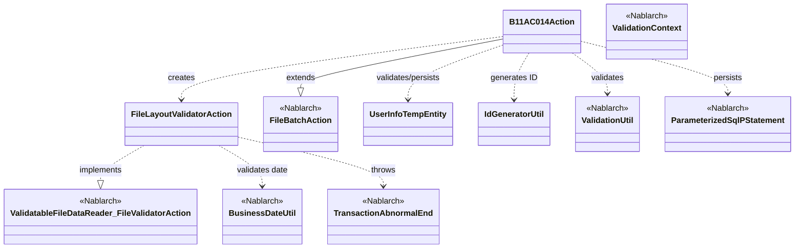
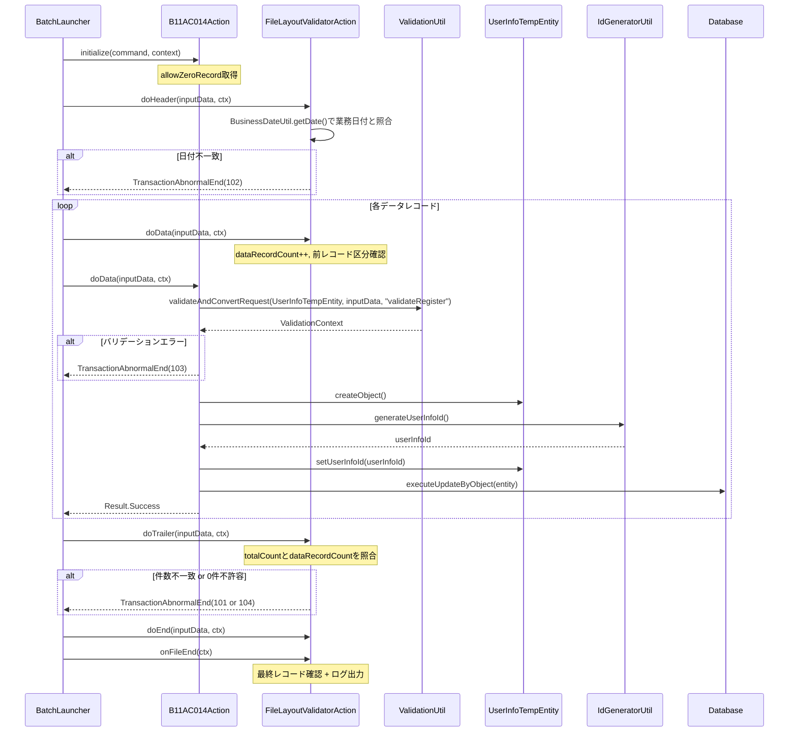

# Code Analysis: B11AC014Action

**Generated**: 2026-03-31 14:31:42
**Target**: ユーザ情報ファイルを読み込み、ユーザ情報テンポラリテーブルに登録するファイル入力バッチ
**Modules**: tutorial
**Analysis Duration**: approx. 2m 44s

---

## Overview

`B11AC014Action` はNablarchのファイル入力バッチ処理クラスで、`FileBatchAction` を継承して実装されている。ユーザ情報ファイル（ファイルID: N11AA002）を読み込み、各データレコードをバリデーションしてユーザ情報テンポラリテーブル（`USER_INFO_TEMP`）に登録する。

ファイルは「ヘッダー→データ→トレーラ→エンド」の4レコード種別で構成されており、内部クラス `FileLayoutValidatorAction` による事前レイアウト精査を行った後に業務処理を実行する。コマンドライン引数 `allowZeroRecord` でデータレコード0件を許容するかどうかを制御できる。

---

## Architecture

### Dependency Graph



**Note**: This diagram uses Mermaid `classDiagram` syntax to show class names and their relationships. Use `--|>` for inheritance (extends/implements) and `..>` for dependencies (uses/creates).

### Component Summary

| Component | Role | Type | Dependencies |
|-----------|------|------|--------------|
| B11AC014Action | ファイル入力バッチのメインアクション | Action (FileBatchAction) | FileLayoutValidatorAction, UserInfoTempEntity, ValidationUtil, ParameterizedSqlPStatement, IdGeneratorUtil |
| FileLayoutValidatorAction | ファイルレイアウト事前精査の内部クラス | FileValidatorAction | BusinessDateUtil, TransactionAbnormalEnd |
| UserInfoTempEntity | ユーザ情報テンポラリのEntityクラス | Entity | ValidationUtil, StringUtil |
| IdGeneratorUtil | ユーザ情報IDを採番するユーティリティ | Utility | IdGenerator, SystemRepository |

---

## Flow

### Processing Flow

バッチ起動時に `initialize()` でコマンドライン引数（`allowZeroRecord`）を取得する。その後、`ValidatableFileDataReader` が `FileLayoutValidatorAction` を使ってファイル全件を事前精査する。精査通過後、レコード種別に応じて `doHeader()`、`doData()`、`doTrailer()`、`doEnd()` が呼び出される。

`doData()` では `ValidationUtil.validateAndConvertRequest()` でデータレコードをバリデーションし、`UserInfoTempEntity` を生成する。バリデーションエラー時は `TransactionAbnormalEnd`（終了コード103）をスローして異常終了する。正常時は `IdGeneratorUtil.generateUserInfoId()` でIDを採番し、`ParameterizedSqlPStatement` で `USER_INFO_TEMP` テーブルに登録する。

### Sequence Diagram



---

## Components

### B11AC014Action

**ファイル**: [B11AC014Action.java (.lw/nab-official/v1.3/tutorial/main/java/please/change/me/tutorial/ss11AC)](../../.lw/nab-official/v1.3/tutorial/main/java/please/change/me/tutorial/ss11AC/B11AC014Action.java)

**役割**: ファイル入力バッチのメインアクションクラス。`FileBatchAction` を継承し、ユーザ情報ファイルの各レコードを処理する。

**主要メソッド**:
- `initialize(CommandLine, ExecutionContext)` (L43-45): コマンドライン引数から `allowZeroRecord` を取得
- `doHeader(DataRecord, ExecutionContext)` (L58-60): ヘッダーレコード処理（事前精査済みのため何もしない）
- `doData(DataRecord, ExecutionContext)` (L69-92): データレコード処理。バリデーション→Entity生成→DB登録
- `doTrailer(DataRecord, ExecutionContext)` (L106-108): トレーラレコード処理（何もしない）
- `doEnd(DataRecord, ExecutionContext)` (L121-123): エンドレコード処理（何もしない）
- `getDataFileName()` (L126-128): ファイルID "N11AA002" を返す
- `getFormatFileName()` (L131-133): ファイルID "N11AA002" を返す
- `getValidatorAction()` (L136-138): `FileLayoutValidatorAction` インスタンスを返す

**依存関係**: FileLayoutValidatorAction（内部クラス）、UserInfoTempEntity、ValidationUtil、ParameterizedSqlPStatement、IdGeneratorUtil

---

### FileLayoutValidatorAction（内部クラス）

**ファイル**: [B11AC014Action.java (.lw/nab-official/v1.3/tutorial/main/java/please/change/me/tutorial/ss11AC)](../../.lw/nab-official/v1.3/tutorial/main/java/please/change/me/tutorial/ss11AC/B11AC014Action.java) (L158-316)

**役割**: `ValidatableFileDataReader.FileValidatorAction` を実装するファイルレイアウト事前精査クラス。レコード種別の並び順と件数の整合性を検証する。

**主要メソッド**:
- `doHeader(DataRecord, ExecutionContext)` (L199-216): 1レコード目であること・業務日付との照合
- `doData(DataRecord, ExecutionContext)` (L228-239): 前レコードがヘッダー/データであること確認、カウント
- `doTrailer(DataRecord, ExecutionContext)` (L254-277): 件数照合・0件チェック
- `doEnd(DataRecord, ExecutionContext)` (L289-297): 前レコードがトレーラであること確認
- `onFileEnd(ExecutionContext)` (L304-313): 最終レコードがエンドであること確認・ログ出力

**依存関係**: BusinessDateUtil（業務日付取得）、TransactionAbnormalEnd（エラー時スロー）

---

### UserInfoTempEntity

**ファイル**: [UserInfoTempEntity.java (.lw/nab-official/v1.3/tutorial/main/java/please/change/me/tutorial/ss11/entity)](../../.lw/nab-official/v1.3/tutorial/main/java/please/change/me/tutorial/ss11/entity/UserInfoTempEntity.java)

**役割**: USER_INFO_TEMPテーブルに対応するEntityクラス。バリデーション定義と携帯電話番号の項目間精査ロジックを持つ。

**主要メソッド**:
- `validateForRegister(ValidationContext)` (L431-450): 登録用バリデーションメソッド（`@ValidateFor("validateRegister")`）
- `isValidateMobilePhoneNumbers()` (L459-461): 携帯電話番号の項目間精査

**依存関係**: ValidationUtil（バリデーション）、StringUtil（null/空文字チェック）

---

### IdGeneratorUtil

**ファイル**: [IdGeneratorUtil.java (.lw/nab-official/v1.3/tutorial/main/java/please/change/me/tutorial/util)](../../.lw/nab-official/v1.3/tutorial/main/java/please/change/me/tutorial/util/IdGeneratorUtil.java)

**役割**: Nablarch IDGeneratorを使ったID採番ユーティリティ。Oracleシーケンスを使用して各種IDを採番する。

**主要メソッド**:
- `generateUserInfoId()` (L38-41): ユーザ情報ID採番（20桁左0パディング、シーケンス番号1102）

**依存関係**: IdGenerator（Nablarch）、SystemRepository（DIコンテナ）

---

## Nablarch Framework Usage

### FileBatchAction

**クラス**: `nablarch.fw.action.FileBatchAction`

**説明**: ファイル入力バッチ処理のテンプレートクラス。レコード種別ごとにディスパッチされるメソッド（`doHeader()`、`doData()` 等）を実装することで、ファイル入力バッチを構築できる。

**使用方法**:
```java
public class B11AC014Action extends FileBatchAction {
    @Override
    public String getDataFileName() { return "N11AA002"; }
    @Override
    public String getFormatFileName() { return "N11AA002"; }
    @Override
    public ValidatableFileDataReader.FileValidatorAction getValidatorAction() {
        return new FileLayoutValidatorAction();
    }
    public Result doData(DataRecord inputData, ExecutionContext ctx) {
        // 業務処理を実装
        return new Result.Success();
    }
}
```

**重要ポイント**:
- ✅ **`getDataFileName()`と`getFormatFileName()`は必須実装**: ファイルIDを返すこと
- 💡 **レコード種別ディスパッチ**: `do[レコード種別名](DataRecord, ExecutionContext)` シグニチャで各種別の処理を実装する
- 🎯 **`getValidatorAction()`のオーバーライド**: ファイルレイアウト精査が必要な場合のみ実装。事前精査が通ったレコードのみ業務処理メソッドに渡される
- 💡 **レジューム機能**: `FileBatchAction` はデフォルトで `ResumeDataReader` を使用するため、バッチ再開機能が利用可能

**このコードでの使い方**:
- `B11AC014Action` が `FileBatchAction` を継承
- `getDataFileName()` / `getFormatFileName()` で "N11AA002" を返す
- `getValidatorAction()` で `FileLayoutValidatorAction` を返し事前精査を有効化
- ヘッダー/データ/トレーラ/エンドの4種別メソッドを実装

**詳細**: [Handlers FileBatchAction](../../.claude/skills/nabledge-1.3/docs/component/handlers/handlers-FileBatchAction.md)

---

### ValidatableFileDataReader / FileValidatorAction

**クラス**: `nablarch.fw.reader.ValidatableFileDataReader` / `ValidatableFileDataReader.FileValidatorAction`

**説明**: ファイル全件を事前精査してから業務処理を実行するデータリーダ。`FileValidatorAction` インタフェースを実装した精査クラスを設定することで、レコード種別ごとの精査ロジックを定義できる。

**使用方法**:
```java
private class FileLayoutValidatorAction
        implements ValidatableFileDataReader.FileValidatorAction {

    public Result doHeader(DataRecord inputData, ExecutionContext ctx) {
        // ヘッダー精査ロジック
        return new Result.Success();
    }
    public Result doData(DataRecord inputData, ExecutionContext ctx) {
        // データ精査ロジック
        return new Result.Success();
    }
    public void onFileEnd(ExecutionContext ctx) {
        // ファイル終端での最終確認
    }
}
```

**重要ポイント**:
- ✅ **精査メソッド名の規約**: `public Result do[レコード種別名](DataRecord, ExecutionContext)` の形式で命名すること
- ✅ **`onFileEnd()`の実装**: ファイル終端での最終レコード確認（エンドレコード存在チェック等）に使用する
- ⚠️ **`useCache`のデフォルト**: デフォルトは`false`（キャッシュなし）。大量データでメモリ使用量を抑えるためそのまま使用推奨
- 💡 **内部クラスとして実装**: 精査クラスはActionの内部クラスとして実装し、Actionのフィールド（`allowZeroRecord`等）にアクセスできる

**このコードでの使い方**:
- `FileLayoutValidatorAction` が `FileValidatorAction` を実装
- `doHeader()` で業務日付との照合（L199-216）
- `doTrailer()` で件数照合と0件チェック（L254-277）、`allowZeroRecord` フィールドを参照
- `onFileEnd()` で最終レコード確認とログ出力（L304-313）

**詳細**: [Readers ValidatableFileDataReader](../../.claude/skills/nabledge-1.3/docs/component/readers/readers-ValidatableFileDataReader.md)

---

### ValidationUtil / ValidationContext

**クラス**: `nablarch.core.validation.ValidationUtil` / `nablarch.core.validation.ValidationContext`

**説明**: Nablarchのバリデーションフレームワーク。Entityクラスのアノテーション（`@Required`, `@Length` 等）に基づいてバリデーションを実行し、結果をEntityオブジェクトに変換する。

**使用方法**:
```java
ValidationContext<UserInfoTempEntity> validationContext =
    ValidationUtil.validateAndConvertRequest(
        UserInfoTempEntity.class,
        inputData,        // DataRecord (Map<String, Object>として扱われる)
        "validateRegister");  // @ValidateFor のメソッド識別子

if (!validationContext.isValid()) {
    throw new TransactionAbnormalEnd(103,
        new ApplicationException(validationContext.getMessages()),
        "NB11AA0105", inputData.getRecordNumber());
}

UserInfoTempEntity entity = validationContext.createObject();
```

**重要ポイント**:
- ✅ **`validateAndConvertRequest()`でEntityに変換**: バリデーションとEntityへのマッピングを一度に実行できる
- ✅ **`isValid()`でエラー確認**: falseの場合は必ず早期リターンまたは例外スロー
- 💡 **`validateWithout()`でスキップ指定**: 自動設定項目（`userInfoId`, `insertUserId`等）はバリデーション対象外にする
- 🎯 **バッチでの使用**: DataRecordは `Map<String, Object>` として扱われ、画面オンラインと同じAPIでバリデーション可能

**このコードでの使い方**:
- `doData()` (L71-74) でDataRecordをバリデーションし、`UserInfoTempEntity` を生成
- `UserInfoTempEntity.validateForRegister()` (L431-450) が `@ValidateFor("validateRegister")` により呼び出される
- `validateWithout()` で `userInfoId`, `insertUserId` 等の自動設定項目を除外

**詳細**: [Libraries 08_02_validation_usage](../../.claude/skills/nabledge-1.3/docs/component/libraries/libraries-08_02_validation_usage.md)

---

### ParameterizedSqlPStatement

**クラス**: `nablarch.core.db.statement.ParameterizedSqlPStatement`

**説明**: EntityオブジェクトのプロパティをSQLのバインドパラメータとして使用してSQLを実行するステートメントクラス。`getParameterizedSqlStatement()` でSQLID（SQLファイル内の識別子）からインスタンスを取得する。

**使用方法**:
```java
ParameterizedSqlPStatement statement =
    getParameterizedSqlStatement("INSERT_USER_INFO_TEMP");
statement.executeUpdateByObject(entity);
```

**重要ポイント**:
- ✅ **`executeUpdateByObject(entity)`**: EntityオブジェクトのプロパティがSQLのバインドパラメータに対応する
- 💡 **SQLIDによる管理**: SQLはJavaコードから分離されてSQLファイルで管理される

**このコードでの使い方**:
- `doData()` (L87-89) でバリデーション済みEntityを `INSERT_USER_INFO_TEMP` SQLでDBに登録

**詳細**: [Libraries 08_02_validation_usage](../../.claude/skills/nabledge-1.3/docs/component/libraries/libraries-08_02_validation_usage.md)

---

## References

### Source Files

- [B11AC014Action.java (.lw/nab-official/v1.3/tutorial/main/java/please/change/me/tutorial/ss11AC)](../../.lw/nab-official/v1.3/tutorial/main/java/please/change/me/tutorial/ss11AC/B11AC014Action.java) - B11AC014Action
- [B11AC014Action.java (.lw/nab-official/v1.2/tutorial/main/java/nablarch/sample/ss11AC)](../../.lw/nab-official/v1.2/tutorial/main/java/nablarch/sample/ss11AC/B11AC014Action.java) - B11AC014Action
- [B11AC014Action.java (.lw/nab-official/v1.4/tutorial/tutorial/main/java/please/change/me/tutorial/ss11AC)](../../.lw/nab-official/v1.4/tutorial/tutorial/main/java/please/change/me/tutorial/ss11AC/B11AC014Action.java) - B11AC014Action
- [UserInfoTempEntity.java (.lw/nab-official/v1.3/tutorial/main/java/please/change/me/tutorial/ss11/entity)](../../.lw/nab-official/v1.3/tutorial/main/java/please/change/me/tutorial/ss11/entity/UserInfoTempEntity.java) - UserInfoTempEntity
- [UserInfoTempEntity.java (.lw/nab-official/v1.2/tutorial/main/java/nablarch/sample/ss11/entity)](../../.lw/nab-official/v1.2/tutorial/main/java/nablarch/sample/ss11/entity/UserInfoTempEntity.java) - UserInfoTempEntity
- [UserInfoTempEntity.java (.lw/nab-official/v1.4/tutorial/tutorial/main/java/please/change/me/tutorial/ss11/entity)](../../.lw/nab-official/v1.4/tutorial/tutorial/main/java/please/change/me/tutorial/ss11/entity/UserInfoTempEntity.java) - UserInfoTempEntity
- [IdGeneratorUtil.java (.lw/nab-official/v1.3/tutorial/main/java/please/change/me/tutorial/util)](../../.lw/nab-official/v1.3/tutorial/main/java/please/change/me/tutorial/util/IdGeneratorUtil.java) - IdGeneratorUtil
- [IdGeneratorUtil.java (.lw/nab-official/v5/nablarch-system-development-guide/en/Sample_Project/Source_Code/proman-project/proman-common/src/main/java/com/nablarch/example/proman/common/id)](../../.lw/nab-official/v5/nablarch-system-development-guide/en/Sample_Project/Source_Code/proman-project/proman-common/src/main/java/com/nablarch/example/proman/common/id/IdGeneratorUtil.java) - IdGeneratorUtil
- [IdGeneratorUtil.java (.lw/nab-official/v5/nablarch-system-development-guide/Sample_Project/Source_Code/proman-project/proman-common/src/main/java/com/nablarch/example/proman/common/id)](../../.lw/nab-official/v5/nablarch-system-development-guide/Sample_Project/Source_Code/proman-project/proman-common/src/main/java/com/nablarch/example/proman/common/id/IdGeneratorUtil.java) - IdGeneratorUtil
- [IdGeneratorUtil.java (.lw/nab-official/v1.2/tutorial/main/java/nablarch/sample/util)](../../.lw/nab-official/v1.2/tutorial/main/java/nablarch/sample/util/IdGeneratorUtil.java) - IdGeneratorUtil
- [IdGeneratorUtil.java (.lw/nab-official/v6/nablarch-system-development-guide/en/Sample_Project/Source_Code/proman-project/proman-common/src/main/java/com/nablarch/example/proman/common/id)](../../.lw/nab-official/v6/nablarch-system-development-guide/en/Sample_Project/Source_Code/proman-project/proman-common/src/main/java/com/nablarch/example/proman/common/id/IdGeneratorUtil.java) - IdGeneratorUtil
- [IdGeneratorUtil.java (.lw/nab-official/v6/nablarch-system-development-guide/Sample_Project/Source_Code/proman-project/proman-common/src/main/java/com/nablarch/example/proman/common/id)](../../.lw/nab-official/v6/nablarch-system-development-guide/Sample_Project/Source_Code/proman-project/proman-common/src/main/java/com/nablarch/example/proman/common/id/IdGeneratorUtil.java) - IdGeneratorUtil
- [IdGeneratorUtil.java (.lw/nab-official/v1.4/workflow/sample_application/src/main/java/please/change/me/sample/util)](../../.lw/nab-official/v1.4/workflow/sample_application/src/main/java/please/change/me/sample/util/IdGeneratorUtil.java) - IdGeneratorUtil
- [IdGeneratorUtil.java (.lw/nab-official/v1.4/tutorial/tutorial/main/java/please/change/me/tutorial/util)](../../.lw/nab-official/v1.4/tutorial/tutorial/main/java/please/change/me/tutorial/util/IdGeneratorUtil.java) - IdGeneratorUtil

### Knowledge Base (Nabledge-1.3)

- [Nablarch Batch 04_fileInputBatch](../../.claude/skills/nabledge-1.3/docs/guide/nablarch-batch/nablarch-batch-04_fileInputBatch.md)
- [Readers ValidatableFileDataReader](../../.claude/skills/nabledge-1.3/docs/component/readers/readers-ValidatableFileDataReader.md)
- [Handlers FileBatchAction](../../.claude/skills/nabledge-1.3/docs/component/handlers/handlers-FileBatchAction.md)
- [Libraries 08_02_validation_usage](../../.claude/skills/nabledge-1.3/docs/component/libraries/libraries-08_02_validation_usage.md)

### Official Documentation

(No official documentation links available)

---

**Note**: This documentation was generated by the code-analysis workflow of the nabledge-1.3 skill.
