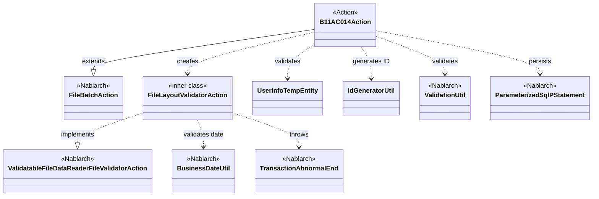
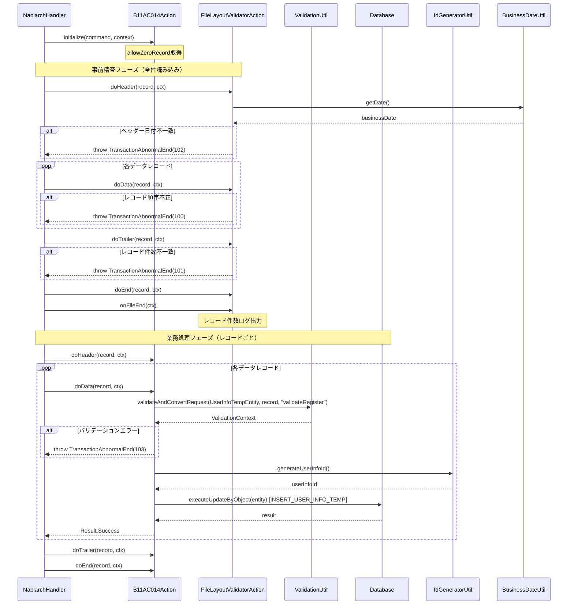

# Code Analysis: B11AC014Action

**Generated**: 2026-03-31 16:36:00
**Target**: User info file import batch action
**Modules**: tutorial
**Analysis Duration**: approx. 3m 44s

---

## Overview

`B11AC014Action` は、ユーザ情報ファイル（固定レイアウト）を読み込み、データをバリデーションしてユーザ情報テンポラリテーブルへ登録するファイル入力バッチアクション。`FileBatchAction` を継承し、ヘッダー・データ・トレーラ・エンドの4種類のレコードを処理する。内部クラス `FileLayoutValidatorAction` がファイルレイアウトの事前精査を担当し、業務処理メソッド（`doData()`）ではバリデーション済みデータのDBへの登録のみを行う。

---

## Architecture

### Dependency Graph



**Note**: This diagram uses Mermaid `classDiagram` syntax to show class names and their relationships. Use `--|>` for inheritance (extends/implements) and `..>` for dependencies (uses/creates).

### Component Summary

| Component | Role | Type | Dependencies |
|-----------|------|------|--------------|
| B11AC014Action | ユーザ情報ファイル取込バッチアクション | Action | FileBatchAction, FileLayoutValidatorAction, UserInfoTempEntity, ValidationUtil, IdGeneratorUtil, ParameterizedSqlPStatement |
| FileLayoutValidatorAction | ファイルレイアウト事前精査 | inner class (FileValidatorAction) | BusinessDateUtil, TransactionAbnormalEnd |
| UserInfoTempEntity | ユーザ情報テンポラリエンティティ | Entity | ValidationUtil |
| IdGeneratorUtil | ユーザ情報ID採番ユーティリティ | Utility | IdGenerator (Nablarch) |

---

## Flow

### Processing Flow

バッチフレームワークのハンドラチェーンが `B11AC014Action` を呼び出す。

1. **initialize()** (L43-45): コマンドライン引数 `allowZeroRecord` を取得し、0件許容フラグを設定する。
2. **事前精査フェーズ** - `ValidatableFileDataReader` が `FileLayoutValidatorAction` を使ってファイル全件を事前読み込みし、レイアウトを精査する。
   - **FileLayoutValidatorAction.doHeader()** (L199-216): 1レコード目がヘッダーレコードであること、および入力ファイルの日付が業務日付と一致することを検証する。
   - **FileLayoutValidatorAction.doData()** (L228-239): 前レコードがヘッダーまたはデータレコードであることを検証し、データレコード件数をカウントする。
   - **FileLayoutValidatorAction.doTrailer()** (L254-278): 前レコードがデータまたはヘッダーレコードであること、トレーラの総レコード数がデータレコード件数と一致すること、0件許容設定を検証する。
   - **FileLayoutValidatorAction.doEnd()** (L289-296): 前レコードがトレーラレコードであることを検証する。
   - **FileLayoutValidatorAction.onFileEnd()** (L304-313): 最終レコードがエンドレコードであることを検証し、レコード件数をログ出力する。
3. **業務処理フェーズ** - 事前精査が成功した場合のみ、レコードごとに業務処理メソッドが呼び出される。
   - **doHeader()** (L58-60): 処理なし（事前精査済み）。
   - **doData()** (L69-92): `ValidationUtil.validateAndConvertRequest()` でデータレコードを精査し `UserInfoTempEntity` にマッピング。精査エラー時は `TransactionAbnormalEnd` をスロー。正常時は `IdGeneratorUtil.generateUserInfoId()` でIDを採番し、`ParameterizedSqlPStatement` でDBへ登録する。
   - **doTrailer()** (L106-108): 処理なし（事前精査済み）。
   - **doEnd()** (L121-123): 処理なし（事前精査済み）。

### Sequence Diagram



---

## Components

### B11AC014Action

**ファイル**: [B11AC014Action.java](.lw/nab-official/v1.3/tutorial/main/java/please/change/me/tutorial/ss11AC/B11AC014Action.java)

**役割**: ユーザ情報ファイルを読み込み、データレコードを精査してユーザ情報テンポラリテーブルへ登録するバッチアクション。

**主要メソッド**:
- `initialize(CommandLine, ExecutionContext)` (L43-45): 起動パラメータ `allowZeroRecord` を取得する。コマンドライン引数 `--allowZeroRecord true/false` で指定。
- `doData(DataRecord, ExecutionContext)` (L69-92): データレコードの業務処理。バリデーション→ID採番→DB登録の流れを実装。
- `getValidatorAction()` (L136-138): `FileLayoutValidatorAction` のインスタンスを返す。`FileBatchAction` が事前精査に使用する。

**依存関係**: FileBatchAction, FileLayoutValidatorAction, UserInfoTempEntity, ValidationUtil, IdGeneratorUtil, ParameterizedSqlPStatement

---

### FileLayoutValidatorAction (inner class)

**ファイル**: [B11AC014Action.java](.lw/nab-official/v1.3/tutorial/main/java/please/change/me/tutorial/ss11AC/B11AC014Action.java) (L158-316)

**役割**: `ValidatableFileDataReader.FileValidatorAction` を実装し、ファイル全件の事前レイアウト精査を行う内部クラス。

**主要メソッド**:
- `doHeader(DataRecord, ExecutionContext)` (L199-216): ヘッダーの位置（1レコード目）と業務日付の一致を検証。
- `doData(DataRecord, ExecutionContext)` (L228-239): 前レコード種別確認とデータ件数カウント。
- `doTrailer(DataRecord, ExecutionContext)` (L254-278): 前レコード種別確認、件数一致確認、0件許容チェック。
- `doEnd(DataRecord, ExecutionContext)` (L289-296): 前レコードがトレーラーであることを確認。
- `onFileEnd(ExecutionContext)` (L304-313): 最終レコードがエンドレコードであることを確認し、レコード件数をログ出力。

**依存関係**: BusinessDateUtil, TransactionAbnormalEnd, DataRecord, ExecutionContext

---

### UserInfoTempEntity

**ファイル**: [UserInfoTempEntity.java](.lw/nab-official/v1.3/tutorial/main/java/please/change/me/tutorial/ss11/entity/UserInfoTempEntity.java)

**役割**: ユーザ情報テンポラリテーブルへのDB登録用エンティティ。バリデーションアノテーションを持ち、`ValidationUtil` によるバリデーション対象。

**主要メソッド**:
- `validateForRegister(ValidationContext)` (L431-450): `@ValidateFor("validateRegister")` アノテーションで指定されたバリデーションメソッド。単項目精査後に携帯電話番号の項目間精査を行う。
- `setUserInfoId(String)` (L118-120): ユーザ情報IDのセッター。ID採番後に設定される。

**依存関係**: ValidationUtil, StringUtil

---

### IdGeneratorUtil

**ファイル**: [IdGeneratorUtil.java](.lw/nab-official/v1.3/tutorial/main/java/please/change/me/tutorial/util/IdGeneratorUtil.java)

**役割**: Nablarchの `IdGenerator` を使ったID採番ユーティリティ。Oracleシーケンスを使用し、左0パディングしたIDを返す。

**主要メソッド**:
- `generateUserInfoId()` (L38-41): ユーザ情報ID（20桁、左0パディング）を採番する。

**依存関係**: IdGenerator (Nablarch), LpadFormatter, SystemRepository

---

## Nablarch Framework Usage

### FileBatchAction

**クラス**: `nablarch.fw.action.FileBatchAction`

**説明**: ファイルを入力とするバッチ処理の業務アクション実装用テンプレートクラス。レコード種別ごとにディスパッチされるメソッド（`doHeader()`, `doData()`, `doTrailer()`, `doEnd()`）を実装する。

**使用方法**:
```java
public class B11AC014Action extends FileBatchAction {
    @Override
    protected void initialize(CommandLine command, ExecutionContext context) {
        // 起動パラメータを取得
    }

    public Result doData(DataRecord inputData, ExecutionContext ctx) {
        // レコードの業務処理
        return new Success();
    }

    @Override
    public String getDataFileName() { return "N11AA002"; }

    @Override
    public String getFormatFileName() { return "N11AA002"; }

    @Override
    public ValidatableFileDataReader.FileValidatorAction getValidatorAction() {
        return new FileLayoutValidatorAction();
    }
}
```

**重要ポイント**:
- ✅ **`getDataFileName()` と `getFormatFileName()` は必須**: 入力ファイル名とフォーマット定義ファイル名を返すメソッドはオーバーライド必須
- ✅ **`getValidatorAction()` でファイル事前精査を有効化**: `ValidatableFileDataReader.FileValidatorAction` を返すことで事前精査が実行される。デフォルトは事前精査なし
- 💡 **`initialize()` は処理全体で1回のみ**: バッチ開始前に1回呼ばれる。コマンドライン引数の取得など、初期化処理に使用する

**このコードでの使い方**:
- `B11AC014Action` が `FileBatchAction` を継承
- `initialize()` で `allowZeroRecord` パラメータを取得 (L43-45)
- `getValidatorAction()` が `FileLayoutValidatorAction` を返す (L136-138)

**詳細**: [Handlers FileBatchAction](../../.claude/skills/nabledge-1.3/docs/component/handlers/handlers-FileBatchAction.md)

---

### ValidatableFileDataReader / FileValidatorAction

**クラス**: `nablarch.fw.reader.ValidatableFileDataReader`, `nablarch.fw.reader.ValidatableFileDataReader.FileValidatorAction`

**説明**: ファイル全件を事前読み込みして精査を行うデータリーダ。`FileValidatorAction` インタフェースを実装することで、レコード種別ごとの精査ロジックを定義できる。

**使用方法**:
```java
private class FileLayoutValidatorAction
        implements ValidatableFileDataReader.FileValidatorAction {

    public Result doHeader(DataRecord inputData, ExecutionContext ctx) {
        // ヘッダーレコードの精査
        return new Success();
    }

    public Result doData(DataRecord inputData, ExecutionContext ctx) {
        // データレコードの精査
        return new Success();
    }

    public void onFileEnd(ExecutionContext ctx) {
        // ファイル終端の検証
    }
}
```

**重要ポイント**:
- ✅ **`onFileEnd()` の実装は必須**: ファイル全件読み込み完了後に呼ばれる。最終レコードの種別確認などに使用する
- ✅ **精査メソッド名はレコード種別に対応**: `do[レコード種別名]` の命名規約に従う（例: `doHeader`, `doData`, `doTrailer`, `doEnd`）
- ⚠️ **事前精査エラーは `TransactionAbnormalEnd` でスロー**: バリデーションエラー時は例外をスローしてバッチを異常終了させる

**このコードでの使い方**:
- `FileLayoutValidatorAction` が `FileValidatorAction` を実装 (L158)
- `doHeader()` で業務日付チェック (L199-216)
- `doTrailer()` でデータ件数の整合性確認 (L254-278)
- `onFileEnd()` で最終レコード確認とレコード件数ログ出力 (L304-313)

**詳細**: [Readers ValidatableFileDataReader](../../.claude/skills/nabledge-1.3/docs/component/readers/readers-ValidatableFileDataReader.md)

---

### ValidationUtil

**クラス**: `nablarch.core.validation.ValidationUtil`

**説明**: エンティティクラスにマッピングしながらバリデーションを実行するユーティリティ。バッチのファイルレコードや画面のHTTPリクエストパラメータを対象にした精査に使用する。

**使用方法**:
```java
ValidationContext<UserInfoTempEntity> validationContext =
        ValidationUtil.validateAndConvertRequest(
                UserInfoTempEntity.class,
                inputData, "validateRegister");

if (!validationContext.isValid()) {
    throw new TransactionAbnormalEnd(103,
            new ApplicationException(validationContext.getMessages()),
            "NB11AA0105", inputData.getRecordNumber());
}

UserInfoTempEntity entity = validationContext.createObject();
```

**重要ポイント**:
- ✅ **`isValid()` の確認後に `createObject()` を呼ぶ**: バリデーション成功を確認してからエンティティを生成する
- ⚠️ **バリデーションエラー時は例外スロー**: バッチ処理では `TransactionAbnormalEnd` をスローしてレコードのエラーを通知する
- 💡 **`validateRegister` はエンティティの `@ValidateFor` と対応**: `UserInfoTempEntity.validateForRegister()` が呼ばれる

**このコードでの使い方**:
- `doData()` で `validateAndConvertRequest()` を呼び出し、データレコードを `UserInfoTempEntity` にマッピング (L71-74)
- バリデーションエラー時は exit code 103 で `TransactionAbnormalEnd` をスロー (L78-81)

**詳細**: [Nablarch Batch 04 FileInputBatch](../../.claude/skills/nabledge-1.3/docs/guide/nablarch-batch/nablarch-batch-04_fileInputBatch.md)

---

### BusinessDateUtil

**クラス**: `nablarch.core.date.BusinessDateUtil`

**説明**: システムに設定された業務日付を取得するユーティリティ。ファイルのヘッダーレコードの日付と業務日付を突合する際に使用する。

**使用方法**:
```java
String businessDate = BusinessDateUtil.getDate();
if (!businessDate.equals(date)) {
    throw new TransactionAbnormalEnd(102,
            HEADER_RECORD_ERROR_FAILURE_CODE, date, businessDate);
}
```

**重要ポイント**:
- ✅ **業務日付はシステム設定から取得**: 実行時のシステム日付ではなく、コンポーネント設定で定義した業務日付が返される
- 🎯 **ファイルの日付整合性チェックに使用**: ヘッダーレコードの日付フィールドが業務日付と一致するかを確認する際に利用する

**このコードでの使い方**:
- `FileLayoutValidatorAction.doHeader()` で入力ファイルの日付と業務日付を比較 (L208-213)

---

## References

### Source Files

- [B11AC014Action.java (.lw/nab-official/v1.3/tutorial/main/java/please/change/me/tutorial/ss11AC)](../../.lw/nab-official/v1.3/tutorial/main/java/please/change/me/tutorial/ss11AC/B11AC014Action.java) - B11AC014Action
- [UserInfoTempEntity.java (.lw/nab-official/v1.3/tutorial/main/java/please/change/me/tutorial/ss11/entity)](../../.lw/nab-official/v1.3/tutorial/main/java/please/change/me/tutorial/ss11/entity/UserInfoTempEntity.java) - UserInfoTempEntity
- [IdGeneratorUtil.java (.lw/nab-official/v1.3/tutorial/main/java/please/change/me/tutorial/util)](../../.lw/nab-official/v1.3/tutorial/main/java/please/change/me/tutorial/util/IdGeneratorUtil.java) - IdGeneratorUtil

### Knowledge Base (Nabledge-1.3)

- [Nablarch Batch 04 FileInputBatch](../../.claude/skills/nabledge-1.3/docs/guide/nablarch-batch/nablarch-batch-04_fileInputBatch.md)
- [Readers ValidatableFileDataReader](../../.claude/skills/nabledge-1.3/docs/component/readers/readers-ValidatableFileDataReader.md)
- [Handlers FileBatchAction](../../.claude/skills/nabledge-1.3/docs/component/handlers/handlers-FileBatchAction.md)

### Official Documentation

(No official documentation links available)

---

**Output**: `.nabledge/20260331/code-analysis-B11AC014Action.md`

**Note**: This documentation was generated by the code-analysis workflow of the nabledge-1.3 skill.
