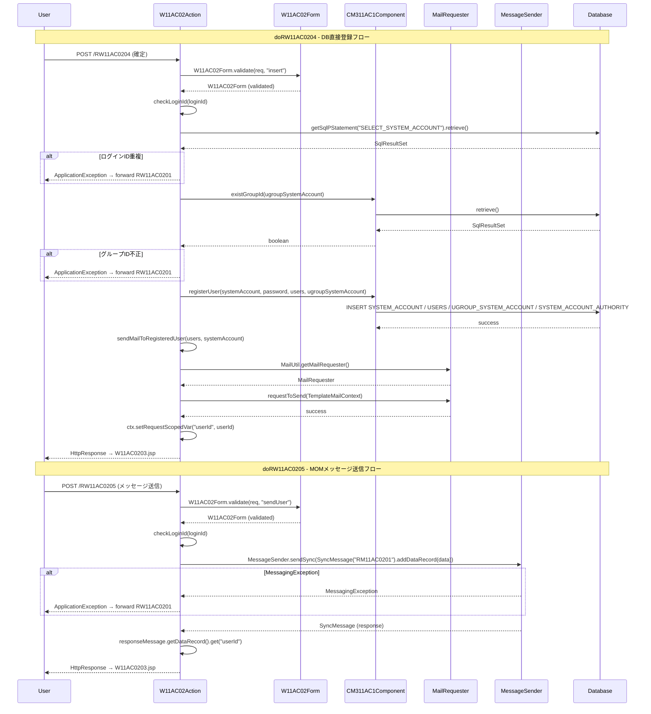

# Code Analysis: W11AC02Action

**Generated**: 2026-03-26 13:06:18
**Target**: ユーザー登録機能のアクションクラス（DB登録・メール送信・MOMメッセージング・HTTPメッセージング）
**Modules**: tutorial
**Analysis Duration**: approx. 5m 20s

---

## Overview

`W11AC02Action` はユーザー登録機能の Action クラス。`DbAccessSupport` を継承し、画面遷移制御・入力バリデーション・DB 登録・メール送信・MOM メッセージ送信・HTTP メッセージ送信の 6 つの責務を担う。
確認画面遷移時の再バリデーション、`@OnDoubleSubmission` による二重サブミット防止、および複数の登録手段（DB直接・MOM・HTTP）に対応する構造を持つ。業務共通コンポーネント `CM311AC1Component` に DB アクセスロジックを委譲することで、Action の薄さを保つ設計。

---

## Architecture

### Dependency Graph

```mermaid
classDiagram
    class W11AC02Action {
        <<Action>>
    }
    class W11AC02Form {
        <<Form>>
    }
    class W11AC02RequestForm {
        <<Form>>
    }
    class W11AC02ResponseForm {
        <<Form>>
    }
    class W11AC02FormBase {
        <<Form>>
    }
    class CM311AC1Component {
        <<Component>>
    }
    class DbAccessSupport {
        <<Nablarch>>
    }
    class SystemAccountEntity {
        <<Entity>>
    }
    class UsersEntity {
        <<Entity>>
    }
    class UgroupSystemAccountEntity {
        <<Entity>>
    }
    class MailRequester {
        <<Nablarch>>
    }
    class MailUtil {
        <<Nablarch>>
    }
    class TemplateMailContext {
        <<Nablarch>>
    }
    class MessageSender {
        <<Nablarch>>
    }
    class SyncMessage {
        <<Nablarch>>
    }
    class OnDoubleSubmission {
        <<Nablarch>>
    }

    W11AC02Action --|> DbAccessSupport : extends
    CM311AC1Component --|> DbAccessSupport : extends
    W11AC02Form --|> W11AC02FormBase : extends

    W11AC02Action ..> W11AC02Form : validates
    W11AC02Action ..> W11AC02RequestForm : validates
    W11AC02Action ..> W11AC02ResponseForm : creates
    W11AC02Action ..> CM311AC1Component : delegates to
    W11AC02Action ..> TemplateMailContext : creates
    W11AC02Action ..> MailUtil : uses
    W11AC02Action ..> MailRequester : uses
    W11AC02Action ..> MessageSender : uses
    W11AC02Action ..> SyncMessage : creates
    W11AC02Action ..> OnDoubleSubmission : uses

    W11AC02Form ..> SystemAccountEntity : creates
    W11AC02Form ..> UsersEntity : creates
    W11AC02Form ..> UgroupSystemAccountEntity : creates
    CM311AC1Component ..> SystemAccountEntity : persists
    CM311AC1Component ..> UsersEntity : persists
    CM311AC1Component ..> UgroupSystemAccountEntity : persists
```



**Note**: This diagram uses Mermaid `classDiagram` syntax to show class names and their relationships. Use `--|>` for inheritance (extends/implements) and `..>` for dependencies (uses/creates).

### Component Summary

| Component | Role | Type | Dependencies |
|-----------|------|------|--------------|
| W11AC02Action | ユーザー登録 Action（画面遷移・登録・送信制御） | Action | W11AC02Form, W11AC02RequestForm, W11AC02ResponseForm, CM311AC1Component, MailUtil, MessageSender |
| W11AC02Form | ユーザー登録フォーム（バリデーション・Entity 生成） | Form | W11AC02FormBase, SystemAccountEntity, UsersEntity, UgroupSystemAccountEntity |
| W11AC02FormBase | フォーム基底クラス（共通フィールド定義） | Form | なし |
| W11AC02RequestForm | HTTP メッセージ送信用リクエストフォーム | Form | なし |
| W11AC02ResponseForm | HTTP メッセージ応答フォーム | Form | なし |
| CM311AC1Component | ユーザー管理機能内共通 DB アクセスコンポーネント | Component | DbAccessSupport, SystemAccountEntity, UsersEntity, UgroupSystemAccountEntity |
| SystemAccountEntity | システムアカウントテーブル対応 Entity | Entity | なし |
| UsersEntity | ユーザーテーブル対応 Entity | Entity | なし |
| UgroupSystemAccountEntity | グループシステムアカウントテーブル対応 Entity | Entity | なし |

---

## Flow

### Processing Flow

ユーザー登録機能は 6 つのアクションメソッドで構成される。

1. **doRW11AC0201** (入力画面表示): グループ情報・認可単位情報を取得してリクエストスコープに格納し、入力画面を返す。
2. **doRW11AC0202** (確認イベント): 入力バリデーション後、表示データをセットアップし確認画面を返す。バリデーションエラー時は `@OnError` で入力画面に forward。
3. **doRW11AC0203** (確認画面→登録画面へ戻る): 再バリデーション後、入力画面を返す。
4. **doRW11AC0204** (DB 直接登録): `@OnDoubleSubmission` で二重サブミット防止。バリデーション・Entity 生成・`CM311AC1Component#registerUser()` での DB 登録・`MailRequester` でのメール送信を実行し、完了画面を返す。
5. **doRW11AC0205** (MOM メッセージ送信登録): `@OnDoubleSubmission` で二重サブミット防止。バリデーション後、`MessageSender.sendSync()` で MOM メッセージを送信し、応答から userId を取得して完了画面を返す。
6. **doRW11AC0206** (HTTP メッセージ送信登録): `@OnDoubleSubmission` で二重サブミット防止。バリデーション後、`MessageSender.sendSync()` で HTTP メッセージを送信し、応答を `W11AC02ResponseForm` に変換して完了画面を返す。

全ての登録イベント（0204/0205/0206）で `@OnError(path = "forward://RW11AC0201")` を付与し、`ApplicationException` 発生時は入力画面に戻す。

### Sequence Diagram



---

## Components

### W11AC02Action

**File**: [W11AC02Action.java](../../.lw/nab-official/v1.4/tutorial/tutorial/main/java/please/change/me/tutorial/ss11AC/W11AC02Action.java)

**Role**: ユーザー登録機能の Action クラス。画面遷移・入力バリデーション・DB 登録・メール送信・MOM/HTTP メッセージ送信を制御する。

**Key Methods**:
- `doRW11AC0201(HttpRequest, ExecutionContext)` [L49-55]: 入力画面表示。グループ・認可単位情報をリクエストスコープにセット。
- `doRW11AC0204(HttpRequest, ExecutionContext)` [L104-125]: DB 直接登録。`@OnDoubleSubmission` + `@OnError` 付き。バリデーション → Entity 取得 → `CM311AC1Component#registerUser()` → メール送信 → 完了画面。
- `doRW11AC0205(HttpRequest, ExecutionContext)` [L231-270]: MOM メッセージ送信によるユーザー登録。`MessageSender.sendSync()` で外部システムに送信し、応答 userId を取得。`MessagingException` を `ApplicationException` に変換。
- `sendMailToRegisteredUser(UsersEntity, SystemAccountEntity)` [L133-154]: `TemplateMailContext` を生成してメール送信要求を行う。
- `checkLoginId(String)` [L209-217]: `SqlPStatement` でログイン ID 重複チェック。重複時は `ApplicationException` をスロー。
- `validate(HttpRequest)` [L181-202]: バリデーション + ログイン ID・グループ ID・認可単位 ID の DB チェック。

**Dependencies**: W11AC02Form, W11AC02RequestForm, W11AC02ResponseForm, CM311AC1Component, SystemAccountEntity, UsersEntity, UgroupSystemAccountEntity, MailRequester, MailUtil, TemplateMailContext, MessageSender, SyncMessage, DbAccessSupport, ApplicationException, OnDoubleSubmission, OnError, ExecutionContext

---

### W11AC02Form

**File**: [W11AC02Form.java](../../.lw/nab-official/v1.4/tutorial/tutorial/main/java/please/change/me/tutorial/ss11AC/W11AC02Form.java)

**Role**: ユーザー登録フォーム。バリデーション定義と Entity 生成を担う。

**Key Methods**:
- `validate(HttpRequest, String)` [L70-75]: `ValidationUtil.validateAndConvertRequest()` でリクエストを精査・変換して `W11AC02Form` を生成する static メソッド。
- `validate(ValidationContext)` [@ValidateFor("insert"), L83-98]: 全項目バリデーション + 新パスワード一致確認 + 携帯電話番号項目間精査。
- `validateForSend(ValidationContext)` [@ValidateFor("sendUser"), L105-119]: パスワード・権限情報を除外したバリデーション（MOM 送信用）。
- `getSystemAccount()` [L50-52]: `SystemAccountEntity` を生成して返す。
- `getUsers()` [L41-43]: `UsersEntity` を生成して返す。
- `getUgroupSystemAccount()` [L59-61]: `UgroupSystemAccountEntity` を生成して返す。

**Dependencies**: W11AC02FormBase, SystemAccountEntity, UsersEntity, UgroupSystemAccountEntity, ValidationUtil, ValidationContext, ValidateFor

---

### CM311AC1Component

**File**: [CM311AC1Component.java](../../.lw/nab-official/v1.4/tutorial/tutorial/main/java/please/change/me/tutorial/ss11AC/CM311AC1Component.java)

**Role**: ユーザー管理機能の業務共通 DB アクセスコンポーネント。`DbAccessSupport` を継承し、ユーザー登録・検索・削除を担う。

**Key Methods**:
- `registerUser(SystemAccountEntity, String, UsersEntity, UgroupSystemAccountEntity)` [L106-147]: ユーザー ID 採番 → パスワード暗号化 → システムアカウント/ユーザー/グループシステムアカウント/システムアカウント権限を登録。
- `registerSystemAccount(SystemAccountEntity)` [L154-164]: `ParameterizedSqlPStatement#executeUpdateByObject()` で挿入。ログイン ID 重複時は `DuplicateStatementException` を `ApplicationException` に変換。
- `registerSystemAccountAuthority(SystemAccountEntity)` [L192-204]: `addBatchObject()` + `executeBatch()` でバッチ挿入。
- `existGroupId(UgroupSystemAccountEntity)` [L64-70]: グループ ID 存在確認。
- `existPermissionUnitId(SystemAccountEntity)` [L82-96]: 認可単位 ID 存在確認（複数）。

**Dependencies**: DbAccessSupport, SystemAccountEntity, UsersEntity, UgroupSystemAccountEntity, SystemAccountAuthorityEntity, ParameterizedSqlPStatement, SqlPStatement, SqlResultSet, DuplicateStatementException, ApplicationException, IdGeneratorUtil, AuthenticationUtil, BusinessDateUtil

---

## Nablarch Framework Usage

### @OnDoubleSubmission

**クラス**: `nablarch.common.web.token.OnDoubleSubmission`

**説明**: サーバ側でトークンを発行・照合し、二重サブミットを検知するアノテーション。トークン不一致時は指定 path に遷移する。

**使用方法**:
```java
@OnDoubleSubmission(path = "forward://RW11AC0201")
public HttpResponse doRW11AC0204(HttpRequest req, ExecutionContext ctx) {
    // ...
}
```

**重要ポイント**:
- ✅ **登録・更新系メソッドに必須**: DB 変更を伴う全メソッドに付与すること。
- 💡 **JSP との連携**: 入力確認画面の共通化機能を使用している場合は JSP 側の `useToken=true` 設定が不要（自動でトークンが設定される）。共通化未使用の場合は JSP の `n:form` タグに `useToken="true"` を設定する。
- ⚠️ **`@OnError` との組み合わせ**: エラー時の遷移先は `@OnError` で指定する。`@OnDoubleSubmission` の `path` はトークン不一致時専用。

**このコードでの使い方**:
- `doRW11AC0204`（DB 登録）[L103]: `@OnDoubleSubmission(path = "forward://RW11AC0201")`
- `doRW11AC0205`（MOM 送信）[L230]: `@OnDoubleSubmission(path = "forward://RW11AC0201")`
- `doRW11AC0206`（HTTP 送信）[L280]: `@OnDoubleSubmission(path = "forward://RW11AC0201")`

---

### DbAccessSupport

**クラス**: `nablarch.core.db.support.DbAccessSupport`

**説明**: SQL ファイルから `SqlPStatement` / `ParameterizedSqlPStatement` を取得する基底クラス。DB アクセスクラスはこのクラスを継承する。

**使用方法**:
```java
// SqlPStatement（プレースホルダに直接値をセット）
SqlPStatement statement = getSqlPStatement("SELECT_SYSTEM_ACCOUNT");
statement.setString(1, loginId);
SqlResultSet result = statement.retrieve();

// ParameterizedSqlPStatement（Entityを渡して実行）
ParameterizedSqlPStatement statement = getParameterizedSqlStatement("INSERT_SYSTEM_ACCOUNT");
statement.executeUpdateByObject(systemAccount);
```

**重要ポイント**:
- ✅ **DB アクセスクラスは必ず継承**: `W11AC02Action` と `CM311AC1Component` の両方が継承している。
- 💡 **複数取引で共有する場合は Action と分離**: `CM311AC1Component` のように業務共通コンポーネントに切り出すことで再利用性を高める。
- ⚠️ **`DuplicateStatementException` の変換**: `executeUpdateByObject()` で一意制約違反が発生した場合は `DuplicateStatementException` がスローされるため、`ApplicationException` に変換してユーザーへ通知する（[L157-163]）。

**このコードでの使い方**:
- `W11AC02Action#checkLoginId()` [L210]: `getSqlPStatement("SELECT_SYSTEM_ACCOUNT")` でログイン ID 重複チェック。
- `CM311AC1Component#registerSystemAccount()` [L155]: `getParameterizedSqlStatement("INSERT_SYSTEM_ACCOUNT")` + `executeUpdateByObject()`。
- `CM311AC1Component#registerSystemAccountAuthority()` [L197]: `addBatchObject()` + `executeBatch()` でバッチ挿入。

---

### MailRequester / MailUtil / TemplateMailContext

**クラス**: `nablarch.common.mail.MailRequester`, `nablarch.common.mail.MailUtil`, `nablarch.common.mail.TemplateMailContext`

**説明**: テンプレートを使った定型メール送信要求 API。`MailUtil.getMailRequester()` でインスタンスを取得し、`TemplateMailContext` に送信先・テンプレート ID・プレースホルダ値を設定して `requestToSend()` を呼び出す。

**使用方法**:
```java
TemplateMailContext tmctx = new TemplateMailContext();
tmctx.setFrom(SystemRepository.getString("defaultFromMailAddress"));
tmctx.addTo(user.getMailAddress());
tmctx.setTemplateId(USER_REGISTERED_MAIL_TEMPLATE_ID);
tmctx.setLang(USER_LANG);
tmctx.setReplaceKeyValue("kanjiName", user.getKanjiName());
tmctx.setReplaceKeyValue("loginId", systemAccount.getLoginId());
MailRequester mailRequester = MailUtil.getMailRequester();
mailRequester.requestToSend(tmctx);
```

**重要ポイント**:
- ✅ **`setFrom` と `addTo` は必須**: `TemplateMailContext` では送信元と送信先は必須。`setTemplateId` と `setLang` も必須。
- 💡 **非同期送信**: `requestToSend()` はメール送信要求をテーブルに登録するだけで、実際の送信は常駐バッチが行う。Action の応答時間に影響しない。
- ⚠️ **送信元アドレスは `SystemRepository` から取得**: ハードコーディングせず `SystemRepository.getString("defaultFromMailAddress")` で取得すること [L138]。
- 🎯 **プレースホルダ置換**: テンプレートテーブルの `{kanjiName}` 等のプレースホルダを `setReplaceKeyValue()` で設定した値に置換する。

**このコードでの使い方**:
- `sendMailToRegisteredUser()` [L133-154]: ユーザー登録完了メールをテンプレート ID "1" / 言語 "ja" で送信要求。`kanjiName`・`loginId` をプレースホルダに設定。

---

### MessageSender / SyncMessage

**クラス**: `nablarch.fw.messaging.MessageSender`, `nablarch.fw.messaging.SyncMessage`

**説明**: 対外システムへの同期応答メッセージ送信ユーティリティ。MOM メッセージングと HTTP メッセージングの両方に対応。`sendSync()` で送信し、応答を `SyncMessage` として受け取る。

**使用方法**:
```java
// MOMメッセージング
SyncMessage responseMessage = MessageSender.sendSync(
    new SyncMessage("RM11AC0201").addDataRecord(dataRecord));
String userId = (String) responseMessage.getDataRecord().get("userId");

// HTTPメッセージング（FormをそのままデータレコードとしてaddDataRecord可）
SyncMessage responseMessage = MessageSender.sendSync(
    new SyncMessage("RM11AC0202").addDataRecord(reqForm));
```

**重要ポイント**:
- ⚠️ **`MessagingException` のキャッチ**: 送信エラー（接続失敗等）は `MessagingException` がスローされる。業務エラーとして `ApplicationException` に変換し、ユーザーに再試行を促すこと [L259-263]。
- ⚠️ **タイムアウト**: タイムアウト時は `MessageSendSyncTimeoutException` がスローされる（本コードでは `MessagingException` でまとめてキャッチ）。
- 💡 **MOM と HTTP の統一 API**: `MessageSender.sendSync()` は MOM メッセージングと HTTP メッセージングの両方に対応。リクエスト ID の命名規則でルーティングが決まる。
- 🎯 **フォームを直接 DataRecord に**: `doRW11AC0206` [L289-290] では `W11AC02RequestForm` を直接 `addDataRecord()` に渡している。

**このコードでの使い方**:
- `doRW11AC0205` [L256-264]: `SyncMessage("RM11AC0201")` で MOM メッセージ送信。応答から `userId` を取得 [L266]。
- `doRW11AC0206` [L288-290]: `SyncMessage("RM11AC0202")` で HTTP メッセージ送信。応答を `W11AC02ResponseForm.validate()` で変換 [L295-296]。

---

### ValidationUtil / ValidationContext / @ValidateFor

**クラス**: `nablarch.core.validation.ValidationUtil`, `nablarch.core.validation.ValidationContext`, `nablarch.core.validation.ValidateFor`

**説明**: リクエストパラメータをバリデーションし、Form/Entity オブジェクトに変換するフレームワーク機能。`@ValidateFor` アノテーションでバリデーション名ごとのメソッドを定義し、`ValidationUtil.validateAndConvertRequest()` で実行する。

**使用方法**:
```java
// Formでの定義
@ValidateFor("insert")
public static void validate(ValidationContext<W11AC02Form> context) {
    ValidationUtil.validateAll(context);
    if (!context.isValid()) return;
    // 項目間精査...
}

// Actionでの呼び出し
ValidationContext<W11AC02Form> context = ValidationUtil.validateAndConvertRequest(
        "W11AC02", W11AC02Form.class, req, "insert");
context.abortIfInvalid();
W11AC02Form form = context.createObject();
```

**重要ポイント**:
- ✅ **確認画面遷移時も再バリデーション**: 確認画面から遷移してきた場合でも hidden タグの値は改ざん可能なため、`doRW11AC0204` でも必ず `validate(req)` を呼ぶ。
- ⚠️ **DB アクセスを伴う精査は Action に実装**: ログイン ID 重複チェックなどの DB 精査は Entity ではなく Action（または業務共通コンポーネント）に実装すること。
- 💡 **バリデーション名の切り替え**: "insert"（全項目）と "sendUser"（パスワード・権限除外）で同じ Form クラスを再利用している。

**このコードでの使い方**:
- `W11AC02Form.validate(req, "insert")` [L182]: DB 直接登録用の全項目バリデーション。
- `W11AC02Form.validate(req, "sendUser")` [L313]: MOM 送信用（パスワード・権限を除外）。
- `W11AC02Form#validate()` [L83-98]: `@ValidateFor("insert")` - 全項目精査 + パスワード一致確認 + 携帯電話番号項目間精査。

---

## References

### Source Files

- [W11AC02Action.java (.lw/nab-official/v1.4/tutorial/tutorial/main/java/please/change/me/tutorial/ss11AC)](../../.lw/nab-official/v1.4/tutorial/tutorial/main/java/please/change/me/tutorial/ss11AC/W11AC02Action.java) - W11AC02Action
- [W11AC02Form.java (.lw/nab-official/v1.4/tutorial/tutorial/main/java/please/change/me/tutorial/ss11AC)](../../.lw/nab-official/v1.4/tutorial/tutorial/main/java/please/change/me/tutorial/ss11AC/W11AC02Form.java) - W11AC02Form
- [W11AC02FormBase.java (.lw/nab-official/v1.4/tutorial/tutorial/main/java/please/change/me/tutorial/ss11AC)](../../.lw/nab-official/v1.4/tutorial/tutorial/main/java/please/change/me/tutorial/ss11AC/W11AC02FormBase.java) - W11AC02FormBase
- [W11AC02RequestForm.java](../../.lw/nab-official/v1.4/tutorial/tutorial/main/java/please/change/me/tutorial/ss11AC/W11AC02RequestForm.java) - W11AC02RequestForm
- [W11AC02ResponseForm.java](../../.lw/nab-official/v1.4/tutorial/tutorial/main/java/please/change/me/tutorial/ss11AC/W11AC02ResponseForm.java) - W11AC02ResponseForm
- [CM311AC1Component.java (.lw/nab-official/v1.4/tutorial/tutorial/main/java/please/change/me/tutorial/ss11AC)](../../.lw/nab-official/v1.4/tutorial/tutorial/main/java/please/change/me/tutorial/ss11AC/CM311AC1Component.java) - CM311AC1Component

### Knowledge Base (Nabledge-1.4)

- [Libraries Mail](../../.claude/skills/nabledge-5/docs/component/libraries/libraries-mail.md)

### Official Documentation

- [AttachedFile](https://nablarch.github.io/docs/LATEST/javadoc/nablarch/common/mail/AttachedFile.html)
- [FreeTextMailContext](https://nablarch.github.io/docs/LATEST/javadoc/nablarch/common/mail/FreeTextMailContext.html)
- [MailRequester](https://nablarch.github.io/docs/LATEST/javadoc/nablarch/common/mail/MailRequester.html)
- [MailUtil](https://nablarch.github.io/docs/LATEST/javadoc/nablarch/common/mail/MailUtil.html)
- [Mail](https://nablarch.github.io/docs/LATEST/doc/application_framework/application_framework/libraries/mail.html)
- [TemplateMailContext](https://nablarch.github.io/docs/LATEST/javadoc/nablarch/common/mail/TemplateMailContext.html)

---

**Note**: This documentation was generated by the code-analysis workflow of the nabledge-1.4 skill.
