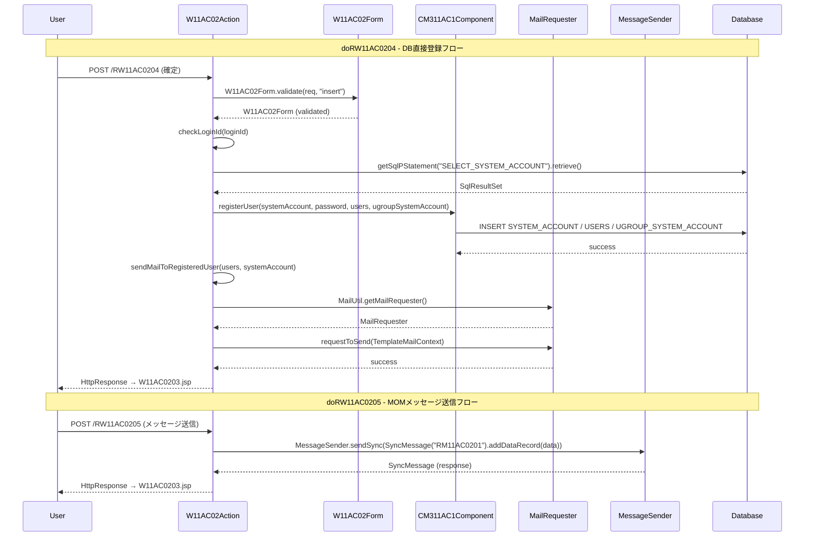

# Code Analysis: W11AC02Action

**Generated**: 2026-03-26 13:06:18
**Target**: ユーザー登録機能のアクションクラス（DB登録・メール送信・MOMメッセージング・HTTPメッセージング）
**Modules**: tutorial
**Analysis Duration**: approx. 5m 20s

---

## Overview

`W11AC02Action` はユーザー登録機能の Action クラス。`DbAccessSupport` を継承し、画面遷移制御・入力バリデーション・DB 登録・メール送信・MOM メッセージ送信・HTTP メッセージ送信の 6 つの責務を担う。
確認画面遷移時の再バリデーション、`@OnDoubleSubmission` による二重サブミット防止、および複数の登録手段（DB直接・MOM・HTTP）に対応する構造を持つ。業務共通コンポーネント `CM311AC1Component` に DB アクセスロジックを委譲することで、Action の薄さを保つ設計。

---

## Architecture

### Dependency Graph

```mermaid
classDiagram
    class W11AC02Action {
        <<Action>>
    }
    class W11AC02Form {
        <<Form>>
    }
    class W11AC02RequestForm {
        <<Form>>
    }
    class W11AC02ResponseForm {
        <<Form>>
    }
    class W11AC02FormBase {
        <<Form>>
    }
    class CM311AC1Component {
        <<Component>>
    }
    class DbAccessSupport {
        <<Nablarch>>
    }
    class SystemAccountEntity {
        <<Entity>>
    }
    class UsersEntity {
        <<Entity>>
    }
    class UgroupSystemAccountEntity {
        <<Entity>>
    }
    class MailRequester {
        <<Nablarch>>
    }
    class MailUtil {
        <<Nablarch>>
    }
    class TemplateMailContext {
        <<Nablarch>>
    }
    class MessageSender {
        <<Nablarch>>
    }
    class SyncMessage {
        <<Nablarch>>
    }
    class OnDoubleSubmission {
        <<Nablarch>>
    }

    W11AC02Action --|> DbAccessSupport : extends
    CM311AC1Component --|> DbAccessSupport : extends
    W11AC02Form --|> W11AC02FormBase : extends

    W11AC02Action ..> W11AC02Form : validates
    W11AC02Action ..> W11AC02RequestForm : validates
    W11AC02Action ..> W11AC02ResponseForm : creates
    W11AC02Action ..> CM311AC1Component : delegates to
    W11AC02Action ..> TemplateMailContext : creates
    W11AC02Action ..> MailUtil : uses
    W11AC02Action ..> MailRequester : uses
    W11AC02Action ..> MessageSender : uses
    W11AC02Action ..> SyncMessage : creates
    W11AC02Action ..> OnDoubleSubmission : uses

    W11AC02Form ..> SystemAccountEntity : creates
    W11AC02Form ..> UsersEntity : creates
    W11AC02Form ..> UgroupSystemAccountEntity : creates
    CM311AC1Component ..> SystemAccountEntity : persists
    CM311AC1Component ..> UsersEntity : persists
    CM311AC1Component ..> UgroupSystemAccountEntity : persists
```

### Component Summary

| Component | Role | Type | Dependencies |
|-----------|------|------|--------------|
| W11AC02Action | ユーザー登録 Action（画面遷移・登録・送信制御） | Action | W11AC02Form, W11AC02RequestForm, W11AC02ResponseForm, CM311AC1Component, MailUtil, MessageSender |
| W11AC02Form | ユーザー登録フォーム（バリデーション・Entity 生成） | Form | W11AC02FormBase, SystemAccountEntity, UsersEntity, UgroupSystemAccountEntity |
| W11AC02FormBase | フォーム基底クラス（共通フィールド定義） | Form | なし |
| W11AC02RequestForm | HTTP メッセージ送信用リクエストフォーム | Form | なし |
| W11AC02ResponseForm | HTTP メッセージ応答フォーム | Form | なし |
| CM311AC1Component | ユーザー管理機能内共通 DB アクセスコンポーネント | Component | DbAccessSupport, SystemAccountEntity, UsersEntity, UgroupSystemAccountEntity |
| SystemAccountEntity | システムアカウントテーブル対応 Entity | Entity | なし |
| UsersEntity | ユーザーテーブル対応 Entity | Entity | なし |
| UgroupSystemAccountEntity | グループシステムアカウントテーブル対応 Entity | Entity | なし |

---

## Flow

### Processing Flow

ユーザー登録機能は 6 つのアクションメソッドで構成される。

1. **doRW11AC0201** (入力画面表示): グループ情報・認可単位情報を取得してリクエストスコープに格納し、入力画面を返す。
2. **doRW11AC0202** (確認イベント): 入力バリデーション後、表示データをセットアップし確認画面を返す。バリデーションエラー時は `@OnError` で入力画面に forward。
3. **doRW11AC0203** (確認画面→登録画面へ戻る): 再バリデーション後、入力画面を返す。
4. **doRW11AC0204** (DB 直接登録): `@OnDoubleSubmission` で二重サブミット防止。バリデーション・Entity 生成・`CM311AC1Component#registerUser()` での DB 登録・`MailRequester` でのメール送信を実行し、完了画面を返す。
5. **doRW11AC0205** (MOM メッセージ送信登録): `@OnDoubleSubmission` で二重サブミット防止。バリデーション後、`MessageSender.sendSync()` で MOM メッセージを送信し、応答から userId を取得して完了画面を返す。
6. **doRW11AC0206** (HTTP メッセージ送信登録): `@OnDoubleSubmission` で二重サブミット防止。バリデーション後、`MessageSender.sendSync()` で HTTP メッセージを送信し、応答を `W11AC02ResponseForm` に変換して完了画面を返す。

### Sequence Diagram

---

## Nablarch Framework Usage

### @OnDoubleSubmission

**クラス**: `nablarch.common.web.token.OnDoubleSubmission`

**このコードでの使い方**:
- `doRW11AC0204`（DB 登録）: `@OnDoubleSubmission(path = "forward://RW11AC0201")`
- `doRW11AC0205`（MOM 送信）: `@OnDoubleSubmission(path = "forward://RW11AC0201")`
- `doRW11AC0206`（HTTP 送信）: `@OnDoubleSubmission(path = "forward://RW11AC0201")`

### DbAccessSupport

**クラス**: `nablarch.core.db.support.DbAccessSupport`

### MailRequester / MailUtil / TemplateMailContext

**クラス**: `nablarch.common.mail.MailRequester`, `nablarch.common.mail.MailUtil`, `nablarch.common.mail.TemplateMailContext`

### MessageSender / SyncMessage

**クラス**: `nablarch.fw.messaging.MessageSender`, `nablarch.fw.messaging.SyncMessage`
