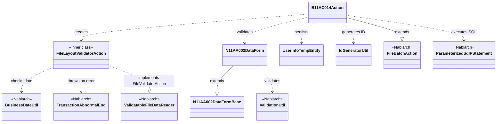
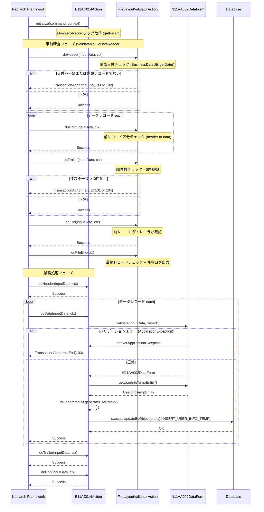

# Code Analysis: B11AC014Action

**Generated**: 2026-03-26 13:14:37
**Target**: ユーザ情報ファイル読み込み・ユーザ情報テンポラリ登録バッチアクション
**Modules**: tutorial
**Analysis Duration**: approx. 3m 22s

---

## Overview

`B11AC014Action` は固定長ファイル（ユーザ情報ファイル N11AA002）を入力として読み込み、各データレコードをバリデーションしてユーザ情報テンポラリテーブルへ登録するファイル入力バッチアクションである。

Nablarch の `FileBatchAction` を継承し、ファイルのレイアウト精査（ヘッダー・データ・トレーラ・エンドレコードの順序チェック）を内部クラス `FileLayoutValidatorAction` で実装。業務処理（`doData`）ではフォームによるバリデーション後、ID採番・Entity生成・DB登録を行う。コマンドライン引数 `allowZeroRecord` によりデータレコード0件の許容制御も可能。

---

## Architecture

### Dependency Graph



**Note**: This diagram uses Mermaid `classDiagram` syntax to show class names and their relationships. Use `--|>` for inheritance (extends/implements) and `..>` for dependencies (uses/creates).

### Component Summary

| Component | Role | Type | Dependencies |
|-----------|------|------|--------------|
| B11AC014Action | ファイル入力バッチアクション（業務処理） | Action | N11AA002DataForm, UserInfoTempEntity, IdGeneratorUtil, ParameterizedSqlPStatement |
| FileLayoutValidatorAction | ファイルレイアウト事前精査（内部クラス） | FileValidatorAction | BusinessDateUtil, TransactionAbnormalEnd |
| N11AA002DataForm | データレコードフォーム（バリデーション＋Entity変換） | Form | N11AA002DataFormBase, ValidationUtil, UserInfoTempEntity |
| UserInfoTempEntity | ユーザ情報テンポラリエンティティ | Entity | なし |
| IdGeneratorUtil | ユーザ情報ID採番ユーティリティ | Utility | IdGenerator (Nablarch), SystemRepository |

---

## Flow

### Processing Flow

バッチ起動時に `initialize()` でコマンドライン引数 `allowZeroRecord` を取得する。

処理開始前に `ValidatableFileDataReader` が `FileLayoutValidatorAction` を使って全レコードの事前精査を実行する。精査では①1レコード目がヘッダーかつ業務日付一致、②データレコードのレコード区分チェック、③トレーラの総件数とデータ件数の一致、④エンドレコードが最終レコードであること を確認する。

事前精査成功後、各レコードが `doHeader` / `doData` / `doTrailer` / `doEnd` へディスパッチされる。`doData` ではフォームバリデーション → UserInfoTempEntity 生成 → ID採番 → SQL実行（INSERT）の順で処理する。バリデーション失敗時は `TransactionAbnormalEnd(103)` をスローし異常終了する。

### Sequence Diagram



---

## Components

### B11AC014Action

**ファイル**: [B11AC014Action.java (.lw/nab-official/v1.4/tutorial/tutorial/main/java/please/change/me/tutorial/ss11AC)](../../.lw/nab-official/v1.4/tutorial/tutorial/main/java/please/change/me/tutorial/ss11AC/B11AC014Action.java)

**役割**: ユーザ情報ファイル（固定長）を読み込み、データレコードをバリデーション後にユーザ情報テンポラリテーブルへ登録するバッチアクション。

**主要メソッド**:
- `initialize(CommandLine, ExecutionContext)` (L41-43): コマンドライン引数 `allowZeroRecord` を取得しインスタンス変数に保存
- `doData(DataRecord, ExecutionContext)` (L67-86): フォームバリデーション → ID採番 → DB登録の業務処理コア
- `getValidatorAction()` (L130-132): `FileLayoutValidatorAction` を返却し事前精査を有効化
- `getDataFileName()` / `getFormatFileName()` (L120-127): ファイルID "N11AA002" を返却

**依存関係**: N11AA002DataForm (バリデーション), UserInfoTempEntity (DB登録), IdGeneratorUtil (ID採番), ParameterizedSqlPStatement (SQL実行)

---

### FileLayoutValidatorAction (内部クラス)

**ファイル**: [B11AC014Action.java (L152-310)](../../.lw/nab-official/v1.4/tutorial/tutorial/main/java/please/change/me/tutorial/ss11AC/B11AC014Action.java)

**役割**: `ValidatableFileDataReader.FileValidatorAction` を実装し、業務処理前にファイルレイアウトの整合性を精査する。

**主要メソッド**:
- `doHeader(DataRecord, ExecutionContext)` (L193-211): 先頭レコード確認 + 業務日付チェック
- `doData(DataRecord, ExecutionContext)` (L222-234): 前レコード区分検証 + データレコード件数カウント
- `doTrailer(DataRecord, ExecutionContext)` (L248-272): 総件数チェック + `allowZeroRecord` 判定
- `doEnd(DataRecord, ExecutionContext)` (L283-291): 前レコードがトレーラか確認
- `onFileEnd(ExecutionContext)` (L298-307): 最終レコード確認 + ログ出力

**依存関係**: BusinessDateUtil (業務日付取得), TransactionAbnormalEnd (異常終了)

---

### N11AA002DataForm

**ファイル**: [N11AA002DataForm.java](../../.lw/nab-official/v1.4/tutorial/tutorial/main/java/please/change/me/tutorial/ss11AC/N11AA002DataForm.java)

**役割**: ユーザ情報ファイルのデータレコードに対応するフォームクラス。バリデーションと UserInfoTempEntity への変換を担う。

**主要メソッド**:
- `validate(Map, String)` (L44-48): `ValidationUtil.validateAndConvertRequest` でバリデーション実行
- `validateForRegister(ValidationContext)` (L55-76): `@ValidateFor("insert")` で呼ばれる単項目 + 携帯電話番号項目間精査
- `getUserInfoTempEntity()` (L33-35): バリデーション済みデータから `UserInfoTempEntity` を生成

**依存関係**: N11AA002DataFormBase (継承), ValidationUtil, ValidationContext, UserInfoTempEntity

---

### UserInfoTempEntity

**ファイル**: [UserInfoTempEntity.java (.lw/nab-official/v1.4/...)](../../.lw/nab-official/v1.4/tutorial/tutorial/main/java/please/change/me/tutorial/ss11/entity/UserInfoTempEntity.java)

**役割**: ユーザ情報テンポラリテーブルと1対1に対応するエンティティ。`@UserId`, `@CurrentDateTime`, `@RequestId`, `@ExecutionId` アノテーションにより共通項目が自動設定される。

**依存関係**: Nablarch auto-property アノテーション (UserId, CurrentDateTime, RequestId, ExecutionId)

---

### IdGeneratorUtil

**ファイル**: [IdGeneratorUtil.java (.lw/nab-official/v1.4/tutorial/.../util)](../../.lw/nab-official/v1.4/tutorial/tutorial/main/java/please/change/me/tutorial/util/IdGeneratorUtil.java)

**役割**: Oracle シーケンスを使用してユーザ情報IDを採番するユーティリティ（20桁左0パディング）。

**主要メソッド**:
- `generateUserInfoId()` (L38-41): シーケンスID "1102" から20桁の採番を実施

**依存関係**: IdGenerator (Nablarch), SystemRepository (Nablarch), LpadFormatter (Nablarch)

---

## Nablarch Framework Usage

### FileBatchAction

**クラス**: `nablarch.fw.action.FileBatchAction`

**説明**: ファイル入力バッチの基底クラス。`getDataFileName()` と `getFormatFileName()` を実装するだけでファイルの読み込みが可能になる。レコードタイプ別メソッド（`doHeader` 等）は RecordTypeBinding ハンドラによって自動ディスパッチされる。

**使用方法**:
```java
public class MyBatchAction extends FileBatchAction {
    @Override
    public String getDataFileName() { return "N11AA002"; }
    @Override
    public String getFormatFileName() { return "N11AA002"; }

    public Result doData(DataRecord inputData, ExecutionContext ctx) {
        // データレコード処理
        return new Success();
    }
}
```

**重要ポイント**:
- ✅ **`getDataFileName()` と `getFormatFileName()` は必須実装**: これらがないとファイルリーダが生成されない
- ⚠️ **インスタンス変数使用時の制約**: `allowZeroRecord` のようにインスタンス変数を使う場合はマルチスレッド実行不可。`initialize()` で初期化し、以降読取専用であればマルチスレッド可
- 💡 **`createReader` / `handle` は実装不要**: スーパークラスに実装済み。`do+レコードタイプ名` メソッドを実装する

**このコードでの使い方**:
- `getDataFileName()` と `getFormatFileName()` で "N11AA002" を返却 (L120-127)
- `initialize()` で `allowZeroRecord` フラグを取得 (L41-43)
- `getValidatorAction()` をオーバーライドして事前精査を有効化 (L130-132)

---

### ValidatableFileDataReader / FileValidatorAction

**クラス**: `nablarch.fw.reader.ValidatableFileDataReader`

**説明**: 業務処理前にファイル全件の事前精査を行うデータリーダ。精査ロジックは `FileValidatorAction` インタフェースに実装し、業務処理から完全に分離できる。

**使用方法**:
```java
// FileBatchActionを継承する場合はgetValidatorAction()をオーバーライドするだけ
@Override
public ValidatableFileDataReader.FileValidatorAction getValidatorAction() {
    return new FileLayoutValidatorAction();
}

private class FileLayoutValidatorAction implements ValidatableFileDataReader.FileValidatorAction {
    public Result doHeader(DataRecord inputData, ExecutionContext ctx) { ... }
    public Result doData(DataRecord inputData, ExecutionContext ctx) { ... }
    public Result doTrailer(DataRecord inputData, ExecutionContext ctx) { ... }
    public Result doEnd(DataRecord inputData, ExecutionContext ctx) { ... }
    public void onFileEnd(ExecutionContext ctx) { ... }
}
```

**重要ポイント**:
- ✅ **`onFileEnd()` の実装は必須**: インタフェースで定義されており、最終レコードの確認やログ出力を行う
- ✅ **メソッド命名規約**: `do` + レコードタイプ名（header → `doHeader`、data → `doData` 等）に従う
- ⚠️ **`useCache` は原則不要**: ファイル入力がボトルネックでない限り false のままで良い
- 💡 **業務処理との分離**: 精査クラスが失敗すると業務処理は実行されないため、データ品質が保証された状態で業務ロジックを実行できる

**このコードでの使い方**:
- `FileLayoutValidatorAction` 内部クラスで実装 (L152-310)
- ヘッダー精査: 業務日付チェック (L193-211)
- データ精査: レコード区分検証とカウント (L222-234)
- トレーラ精査: 総件数チェックと0件制御 (L248-272)
- エンド精査: トレーラ後であることの確認 (L283-291)
- ファイル終了: 最終レコード確認とログ (L298-307)

---

### ParameterizedSqlPStatement

**クラス**: `nablarch.core.db.statement.ParameterizedSqlPStatement`

**説明**: Entity オブジェクトのプロパティを SQL のバインド変数に自動マッピングして実行するステートメント。`getParameterizedSqlStatement(sqlId)` で取得し `executeUpdateByObject(entity)` で実行する。

**使用方法**:
```java
ParameterizedSqlPStatement statement = getParameterizedSqlStatement("INSERT_USER_INFO_TEMP");
statement.executeUpdateByObject(entity);
```

**重要ポイント**:
- ✅ **Entityを使用すること**: 1項目ずつ set する実装では `@UserId` 等の共通項目自動設定機能が無効になる
- 💡 **SQL ID はリポジトリから取得**: SQL ファイル内の SQL ID を指定するだけでよい
- ⚡ **共通項目が自動設定される**: `@UserId`, `@CurrentDateTime`, `@RequestId`, `@ExecutionId` アノテーション付きフィールドはフレームワークが自動セット

**このコードでの使い方**:
- `doData()` 内で "INSERT_USER_INFO_TEMP" のステートメントを取得し `UserInfoTempEntity` でINSERT実行 (L81-83)

---

### ValidationUtil / ValidateFor

**クラス**: `nablarch.core.validation.ValidationUtil`, `nablarch.core.validation.ValidateFor`

**説明**: フォームまたはエンティティのバリデーションと型変換を行うユーティリティ。`validateAndConvertRequest` で Map からフォームオブジェクトを生成し、`abortIfInvalid()` でエラー時に `ApplicationException` をスローする。

**使用方法**:
```java
public static N11AA002DataForm validate(Map<String, ?> req, String validationName) {
    ValidationContext<N11AA002DataForm> context =
        ValidationUtil.validateAndConvertRequest(N11AA002DataForm.class, req, validationName);
    context.abortIfInvalid();
    return context.createObject();
}

@ValidateFor("insert")
public static void validateForRegister(ValidationContext<N11AA002DataForm> context) {
    ValidationUtil.validate(context, new String[]{"loginId", "kanjiName", ...});
}
```

**重要ポイント**:
- ✅ **`@ValidateFor` で検証グループを指定**: "insert" 等の名前でどのバリデーションを実行するか制御できる
- ✅ **`abortIfInvalid()` はエラー時に例外を投げる**: `ApplicationException` をキャッチして `TransactionAbnormalEnd` に変換すること
- 💡 **DataRecord は Map として渡せる**: `N11AA002DataForm.validate(inputData, "insert")` のように `DataRecord`（Map実装）を直接渡せる

**このコードでの使い方**:
- `doData()` 内で `N11AA002DataForm.validate(inputData, "insert")` を呼び出し (L71)
- `ApplicationException` をキャッチして `TransactionAbnormalEnd(103)` に変換 (L72-75)

---

### BusinessDateUtil

**クラス**: `nablarch.core.date.BusinessDateUtil`

**説明**: システムに設定された業務日付を取得するユーティリティ。

**使用方法**:
```java
String businessDate = BusinessDateUtil.getDate(); // "yyyyMMdd" 形式
```

**重要ポイント**:
- 🎯 **ヘッダーレコードの日付整合性チェックに使用**: ファイルのヘッダーに記録された処理日付と業務日付を比較する用途が典型的

**このコードでの使い方**:
- `FileLayoutValidatorAction.doHeader()` 内でヘッダーレコードの `date` フィールドと業務日付を比較 (L202-208)

---

## References

### Source Files

- [B11AC014Action.java (.lw/nab-official/v1.4/tutorial/tutorial/main/java/please/change/me/tutorial/ss11AC)](../../.lw/nab-official/v1.4/tutorial/tutorial/main/java/please/change/me/tutorial/ss11AC/B11AC014Action.java) - B11AC014Action
- [N11AA002DataForm.java](../../.lw/nab-official/v1.4/tutorial/tutorial/main/java/please/change/me/tutorial/ss11AC/N11AA002DataForm.java) - N11AA002DataForm
- [UserInfoTempEntity.java (.lw/nab-official/v1.4/tutorial/tutorial/main/java/please/change/me/tutorial/ss11/entity)](../../.lw/nab-official/v1.4/tutorial/tutorial/main/java/please/change/me/tutorial/ss11/entity/UserInfoTempEntity.java) - UserInfoTempEntity
- [IdGeneratorUtil.java (.lw/nab-official/v1.4/tutorial/tutorial/main/java/please/change/me/tutorial/util)](../../.lw/nab-official/v1.4/tutorial/tutorial/main/java/please/change/me/tutorial/util/IdGeneratorUtil.java) - IdGeneratorUtil

### Knowledge Base (Nabledge-1.4)

- guide/nablarch-batch/nablarch-batch-04_fileInputBatch.json - ファイル入力バッチの実装ガイド（FileLayoutValidatorActionパターン）
- component/readers/readers-ValidatableFileDataReader.json - ValidatableFileDataReader / FileValidatorAction の詳細
- component/handlers/handlers-FileBatchAction.json - FileBatchAction のハンドラ処理フロー
- guide/nablarch-batch/nablarch-batch-02_basic.json - FileBatchAction 基本実装
- component/libraries/libraries-08_02_validation_usage.json - Entity を使用したバリデーション＋DB登録パターン
- processing-pattern/nablarch-batch/nablarch-batch-2.json - Entity を使用したDB更新のベストプラクティス

### Official Documentation

(No official documentation links available)

---

**Note**: This documentation was generated by the code-analysis workflow of the nabledge-1.4 skill.
