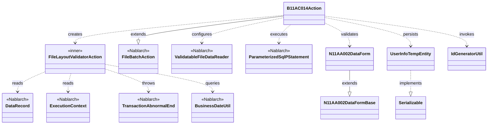
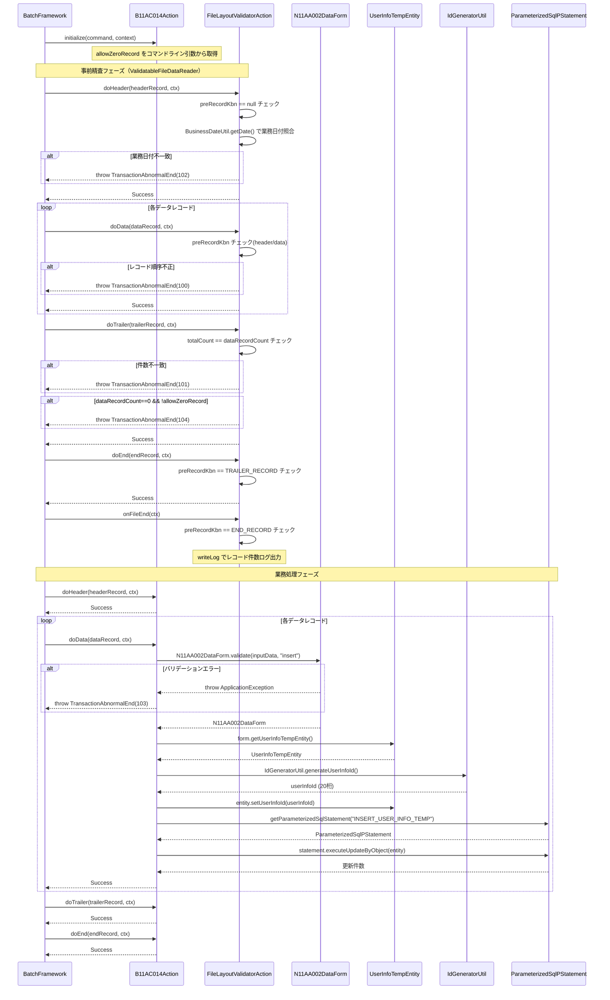

# Code Analysis: B11AC014Action

**Generated**: 2026-03-26 13:24:39
**Target**: ユーザ情報ファイルを読み込み、ユーザ情報テンポラリに保存するファイル入力バッチ
**Modules**: tutorial
**Analysis Duration**: approx. 3m 24s

---

## Overview

`B11AC014Action` は `FileBatchAction` を継承したファイル入力バッチアクションクラスである。固定長ファイル（N11AA002）からユーザ情報レコードを1件ずつ読み込み、バリデーション後にユーザ情報テンポラリテーブルへ登録する。

ファイルは ヘッダー・データ・トレーラ・エンドの4種類のレコードで構成される。内部クラス `FileLayoutValidatorAction` が事前にファイル全体のレイアウト精査（レコード順序・総件数整合性・業務日付照合）を実施し、精査通過後に `doData()` でデータレコードの業務処理を行う構造となっている。

コマンドライン引数 `allowZeroRecord` により、データレコード0件を許容するかどうかを切り替えることができる。

---

## Architecture

### Dependency Graph



**Note**: This diagram uses Mermaid `classDiagram` syntax to show class names and their relationships. Use `--|>` for inheritance (extends/implements) and `..>` for dependencies (uses/creates).

### Component Summary

| Component | Role | Type | Dependencies |
|-----------|------|------|--------------|
| B11AC014Action | ファイル入力バッチのメインアクション | Action | FileBatchAction, N11AA002DataForm, UserInfoTempEntity, IdGeneratorUtil, ParameterizedSqlPStatement |
| FileLayoutValidatorAction | ファイルレイアウト事前精査（内部クラス） | FileValidatorAction | DataRecord, ExecutionContext, TransactionAbnormalEnd, BusinessDateUtil |
| N11AA002DataForm | データレコードのバリデーション・変換フォーム | Form | N11AA002DataFormBase, ValidationUtil, UserInfoTempEntity |
| N11AA002DataFormBase | データレコードフォームの基底クラス | Form (abstract) | なし |
| UserInfoTempEntity | ユーザ情報テンポラリテーブルのエンティティ | Entity | なし |
| IdGeneratorUtil | ユーザ情報IDの採番ユーティリティ | Utility | IdGenerator, SystemRepository |

---

## Flow

### Processing Flow

バッチフレームワークは起動時に `initialize()` を呼び出し、コマンドライン引数 `allowZeroRecord` をインスタンス変数に格納する。

事前精査フェーズでは `ValidatableFileDataReader` が `FileLayoutValidatorAction` を使用してファイルを全件走査する。各レコードについて `doHeader`/`doData`/`doTrailer`/`doEnd` が順に呼ばれ、前レコードのレコード区分（`preRecordKbn`）と照合してレコード順序を検証する。ヘッダーレコードでは業務日付との一致も確認する。トレーラレコードでは総件数とデータレコード件数の一致、および0件許容設定を確認する。全レコード走査後に `onFileEnd()` が呼ばれ、最終レコードがエンドレコードであることを確認してレコード件数をログ出力する。

業務処理フェーズでは `doData()` がデータレコード1件ごとに呼ばれる。`N11AA002DataForm.validate()` でバリデーションを実施し、エラーの場合は `TransactionAbnormalEnd`（終了コード103）をスローする。バリデーション成功後は `UserInfoTempEntity` を生成し、`IdGeneratorUtil.generateUserInfoId()` で採番したIDをセットして `ParameterizedSqlPStatement` でINSERTする。ヘッダー・トレーラ・エンドレコードの業務処理はすべて `Success` を返すのみで、精査は事前精査クラスが担う。

### Sequence Diagram



---

## Components

### B11AC014Action

**ファイル**: [B11AC014Action.java (.lw/nab-official/v1.4/tutorial/tutorial/main/java/please/change/me/tutorial/ss11AC)](../../.lw/nab-official/v1.4/tutorial/tutorial/main/java/please/change/me/tutorial/ss11AC/B11AC014Action.java)

**役割**: ユーザ情報固定長ファイル（N11AA002）を読み込み、バリデーション後にユーザ情報テンポラリテーブルへ登録するファイル入力バッチのメインアクション。

**主要メソッド**:
- `initialize(CommandLine, ExecutionContext)` (L41-43): コマンドライン引数 `allowZeroRecord` を取得しインスタンス変数に格納
- `doData(DataRecord, ExecutionContext)` (L67-86): データレコード1件ごとのバリデーション・採番・DB登録
- `getDataFileName()` / `getFormatFileName()` (L120-127): 入力ファイルID "N11AA002" を返却
- `getValidatorAction()` (L130-132): `FileLayoutValidatorAction` インスタンスを返却して事前精査を有効化

**依存コンポーネント**: FileBatchAction (継承), N11AA002DataForm, UserInfoTempEntity, IdGeneratorUtil, ParameterizedSqlPStatement

---

### FileLayoutValidatorAction（内部クラス）

**ファイル**: [B11AC014Action.java (.lw/nab-official/v1.4/tutorial/tutorial/main/java/please/change/me/tutorial/ss11AC)](../../.lw/nab-official/v1.4/tutorial/tutorial/main/java/please/change/me/tutorial/ss11AC/B11AC014Action.java) (L152-310)

**役割**: `ValidatableFileDataReader.FileValidatorAction` を実装するファイルレイアウト精査クラス。ファイル全体のレコード順序・件数・業務日付を事前に検証する。

**主要メソッド**:
- `doHeader(DataRecord, ExecutionContext)` (L193-211): 1レコード目確認・業務日付照合
- `doData(DataRecord, ExecutionContext)` (L222-233): データレコードカウントアップ・前レコード区分確認
- `doTrailer(DataRecord, ExecutionContext)` (L248-272): 総件数一致確認・0件許容チェック
- `doEnd(DataRecord, ExecutionContext)` (L283-291): 前レコードがトレーラであることを確認
- `onFileEnd(ExecutionContext)` (L298-307): 最終レコードがエンドであることを確認・件数ログ出力

**依存コンポーネント**: DataRecord, ExecutionContext, TransactionAbnormalEnd, BusinessDateUtil

---

### N11AA002DataForm

**ファイル**: [N11AA002DataForm.java](../../.lw/nab-official/v1.4/tutorial/tutorial/main/java/please/change/me/tutorial/ss11AC/N11AA002DataForm.java)

**役割**: データレコードのバリデーションおよび `UserInfoTempEntity` への変換を担うフォームクラス。

**主要メソッド**:
- `validate(Map, String)` (L44-48): `ValidationUtil.validateAndConvertRequest` でバリデーション実施・フォームオブジェクト生成
- `validateForRegister(ValidationContext)` (L55-76): `@ValidateFor("insert")` で登録時の項目精査・携帯電話番号の項目間精査
- `getUserInfoTempEntity()` (L33-35): フォームデータを `UserInfoTempEntity` に変換して返却

---

### UserInfoTempEntity

**ファイル**: [UserInfoTempEntity.java (.lw/nab-official/v1.4/tutorial/tutorial/main/java/please/change/me/tutorial/ss11/entity)](../../.lw/nab-official/v1.4/tutorial/tutorial/main/java/please/change/me/tutorial/ss11/entity/UserInfoTempEntity.java)

**役割**: ユーザ情報テンポラリテーブルのエンティティクラス。`@UserId`・`@CurrentDateTime`・`@RequestId`・`@ExecutionId` アノテーションにより監査項目が自動設定される。

**主要フィールド**: `userInfoId`（採番後にセット）, `loginId`, `kanjiName`, `kanaName`, `mailAddress`, 内線番号3項目, 携帯番号3項目, 監査項目4種

---

### IdGeneratorUtil

**ファイル**: [IdGeneratorUtil.java (.lw/nab-official/v1.4/tutorial/tutorial/main/java/please/change/me/tutorial/util)](../../.lw/nab-official/v1.4/tutorial/tutorial/main/java/please/change/me/tutorial/util/IdGeneratorUtil.java)

**役割**: OracleシーケンスベースのID採番ユーティリティ。`SystemRepository` から `oracleSequenceIdGenerator` を取得して採番する。

**主要メソッド**:
- `generateUserInfoId()` (L38-41): シーケンスID "1102" を使用してユーザ情報IDを20桁左ゼロパディングで採番

---

## Nablarch Framework Usage

### FileBatchAction

**クラス**: `nablarch.fw.action.FileBatchAction`

**説明**: ファイル入力バッチの基底クラス。`getDataFileName()`・`getFormatFileName()` を実装することで固定長/可変長ファイルの読み込み処理が自動化される。`createReader` の実装が不要で、レコードタイプに応じて `do+レコードタイプ名` メソッドが自動的に呼び分けられる。

**使用方法**:
```java
public class B11AC014Action extends FileBatchAction {

    @Override
    public String getDataFileName() {
        return "N11AA002"; // ファイルID
    }

    @Override
    public String getFormatFileName() {
        return "N11AA002"; // フォーマット定義ファイルID
    }

    public Result doData(DataRecord inputData, ExecutionContext ctx) {
        // データレコード1件分の業務処理
        return new Success();
    }
}
```

**重要ポイント**:
- ✅ **`getDataFileName()`・`getFormatFileName()` は必須**: ファイルIDを返すだけで読み込み処理が自動化される
- ✅ **`do+レコードタイプ名` メソッドを実装**: RecordTypeBindingハンドラが入力レコードのレコードタイプに応じて自動的に呼び分ける
- ⚠️ **`createReader` は実装不要**: スーパークラスに実装済みであり、実装するとレコードタイプ別メソッド呼び分けが機能しなくなる
- ⚠️ **インスタンス変数はマルチスレッド非対応**: `allowZeroRecord` のようなインスタンス変数を使用するバッチアクションはマルチスレッド実行できない

**このコードでの使い方**:
- `getDataFileName()` / `getFormatFileName()` でファイルID "N11AA002" を返却 (L120-127)
- `doHeader`/`doData`/`doTrailer`/`doEnd` でレコードタイプ別の業務処理を実装 (L56-117)
- `initialize()` でコマンドライン引数を取得しインスタンス変数に保存 (L41-43)

**詳細**: [Nablarchバッチ処理](../../.claude/skills/nabledge-1.4/knowledge/guide/nablarch-batch/nablarch-batch-02_basic.json)

---

### ValidatableFileDataReader / FileValidatorAction

**クラス**: `nablarch.fw.reader.ValidatableFileDataReader`
**インタフェース**: `nablarch.fw.reader.ValidatableFileDataReader.FileValidatorAction`

**説明**: ファイルバッチに事前精査機能を追加するデータリーダ。業務処理の前にファイル全体を走査して `FileValidatorAction` の各メソッドを呼び出す。事前精査と業務処理が完全に分離されるため、精査済みデータのみを業務処理で受け取ることができる。

**使用方法**:
```java
// FileBatchAction を継承する場合は getValidatorAction() をオーバーライドするだけでよい
@Override
public ValidatableFileDataReader.FileValidatorAction getValidatorAction() {
    return new FileLayoutValidatorAction();
}

private class FileLayoutValidatorAction implements ValidatableFileDataReader.FileValidatorAction {
    public Result doHeader(DataRecord inputData, ExecutionContext ctx) { ... }
    public Result doData(DataRecord inputData, ExecutionContext ctx) { ... }
    public Result doTrailer(DataRecord inputData, ExecutionContext ctx) { ... }
    public Result doEnd(DataRecord inputData, ExecutionContext ctx) { ... }
    public void onFileEnd(ExecutionContext ctx) { ... }
}
```

**重要ポイント**:
- ✅ **`onFileEnd()` の実装は必須**: インタフェースで定義されており、全レコード精査終了後に呼ばれる。実装しないとコンパイルエラーとなる
- ✅ **精査メソッドの命名規約**: `do + レコードタイプ名`（フォーマット定義ファイルのレコードタイプ名に対応）
- 💡 **事前精査と業務処理の完全分離**: 精査済みのデータのみが業務処理で処理されるため、業務処理のコードがシンプルになる（`doHeader` で精査済みのため業務処理の `doHeader` は `Success` を返すだけでよい）
- ⚠️ **`useCache` は原則不要**: ファイル入力処理がボトルネックになっていない限りキャッシュは推奨しない

**このコードでの使い方**:
- `getValidatorAction()` で `FileLayoutValidatorAction` を返却して事前精査を有効化 (L130-132)
- `FileLayoutValidatorAction` 内でレコード区分チェック・業務日付照合・総件数検証を実装 (L152-310)

**詳細**: [ValidatableFileDataReader](../../.claude/skills/nabledge-1.4/knowledge/component/readers/readers-ValidatableFileDataReader.json)

---

### ParameterizedSqlPStatement

**クラス**: `nablarch.core.db.statement.ParameterizedSqlPStatement`

**説明**: JavaオブジェクトのプロパティをSQLのバインド変数に対応付けてDB更新を実行するステートメントクラス。`FileBatchAction`（`DbAccessSupport` 経由）の `getParameterizedSqlStatement(String sqlId)` で取得する。

**使用方法**:
```java
ParameterizedSqlPStatement statement = getParameterizedSqlStatement("INSERT_USER_INFO_TEMP");
statement.executeUpdateByObject(entity);
```

**重要ポイント**:
- ✅ **`executeUpdateByObject(Object)` でエンティティを直接バインド**: エンティティのプロパティ名がSQL変数名に自動対応する
- 💡 **`@UserId`・`@CurrentDateTime` アノテーション**: エンティティの監査項目は `executeUpdateByObject` 実行時に自動セットされる

**このコードでの使い方**:
- `doData()` 内で SQL_ID "INSERT_USER_INFO_TEMP" のステートメントを取得し `executeUpdateByObject(entity)` でINSERT実行 (L81-83)

**詳細**: [ファイル入力バッチ実装ガイド](../../.claude/skills/nabledge-1.4/knowledge/guide/nablarch-batch/nablarch-batch-04_fileInputBatch.json)

---

### BusinessDateUtil

**クラス**: `nablarch.core.date.BusinessDateUtil`

**説明**: システムに設定された業務日付を取得するユーティリティ。ファイルのヘッダーレコードに含まれる日付フィールドと業務日付を比較して、当日分のファイルであることを検証する用途に使用する。

**使用方法**:
```java
String businessDate = BusinessDateUtil.getDate(); // "yyyyMMdd" 形式
if (!businessDate.equals(date)) {
    throw new TransactionAbnormalEnd(102, "NB11AA0104", date, businessDate);
}
```

**重要ポイント**:
- 💡 **ファイルの鮮度チェックに使用**: ヘッダーレコードの日付と業務日付が一致しない場合に異常終了させることで、旧日付のファイルを誤って処理することを防ぐ

**このコードでの使い方**:
- `FileLayoutValidatorAction.doHeader()` 内でヘッダーレコードの `date` フィールドと業務日付を照合 (L202-208)

---

### TransactionAbnormalEnd

**クラス**: `nablarch.fw.TransactionAbnormalEnd`

**説明**: バッチ処理で異常終了が必要な場合にスローする例外クラス。終了コード・障害コード・メッセージパラメータを指定する。ハンドラチェーンにより適切なログ出力と終了処理が行われる。

**使用方法**:
```java
// 引数: (終了コード, 障害コード文字列, メッセージパラメータ...)
throw new TransactionAbnormalEnd(100, "NB11AA0102", inputData.getRecordNumber());

// ApplicationException を原因例外として含める場合
throw new TransactionAbnormalEnd(103, e, "NB11AA0105", inputData.getRecordNumber());
```

**重要ポイント**:
- ✅ **終了コードは用途ごとに使い分ける**: このクラスでは100（レイアウトエラー）, 101（件数不一致）, 102（日付不一致）, 103（データバリデーションエラー）, 104（0件エラー）
- ⚠️ **`ApplicationException` をラップする場合**: `TransactionAbnormalEnd(int exitCode, Throwable cause, String failureCode, Object... messageParams)` コンストラクタを使用する

**このコードでの使い方**:
- `FileLayoutValidatorAction` の各メソッドでレイアウトエラー時に終了コード100でスロー (L197, L229, L253, L286)
- `doData()` でバリデーションエラー時に `ApplicationException` をラップして終了コード103でスロー (L73-75)

---

## References

### Source Files

- [B11AC014Action.java (.lw/nab-official/v1.3/tutorial/main/java/please/change/me/tutorial/ss11AC)](../../.lw/nab-official/v1.3/tutorial/main/java/please/change/me/tutorial/ss11AC/B11AC014Action.java) - B11AC014Action
- [B11AC014Action.java (.lw/nab-official/v1.2/tutorial/main/java/nablarch/sample/ss11AC)](../../.lw/nab-official/v1.2/tutorial/main/java/nablarch/sample/ss11AC/B11AC014Action.java) - B11AC014Action
- [B11AC014Action.java (.lw/nab-official/v1.4/tutorial/tutorial/main/java/please/change/me/tutorial/ss11AC)](../../.lw/nab-official/v1.4/tutorial/tutorial/main/java/please/change/me/tutorial/ss11AC/B11AC014Action.java) - B11AC014Action
- [N11AA002DataForm.java](../../.lw/nab-official/v1.4/tutorial/tutorial/main/java/please/change/me/tutorial/ss11AC/N11AA002DataForm.java) - N11AA002DataForm
- [N11AA002DataFormBase.java](../../.lw/nab-official/v1.4/tutorial/tutorial/main/java/please/change/me/tutorial/ss11AC/N11AA002DataFormBase.java) - N11AA002DataFormBase
- [UserInfoTempEntity.java (.lw/nab-official/v1.4/tutorial/tutorial/main/java/please/change/me/tutorial/ss11/entity)](../../.lw/nab-official/v1.4/tutorial/tutorial/main/java/please/change/me/tutorial/ss11/entity/UserInfoTempEntity.java) - UserInfoTempEntity
- [IdGeneratorUtil.java (.lw/nab-official/v1.4/tutorial/tutorial/main/java/please/change/me/tutorial/util)](../../.lw/nab-official/v1.4/tutorial/tutorial/main/java/please/change/me/tutorial/util/IdGeneratorUtil.java) - IdGeneratorUtil

### Knowledge Base (Nabledge-1.4)

- [ファイル入力バッチ実装ガイド](../../.claude/skills/nabledge-1.4/knowledge/guide/nablarch-batch/nablarch-batch-04_fileInputBatch.json)
- [ValidatableFileDataReader](../../.claude/skills/nabledge-1.4/knowledge/component/readers/readers-ValidatableFileDataReader.json)
- [Nablarchバッチ処理基礎](../../.claude/skills/nabledge-1.4/knowledge/guide/nablarch-batch/nablarch-batch-02_basic.json)

### Official Documentation

(No official documentation links available)

---

**Note**: This documentation was generated by the code-analysis workflow of the nabledge-1.4 skill.
