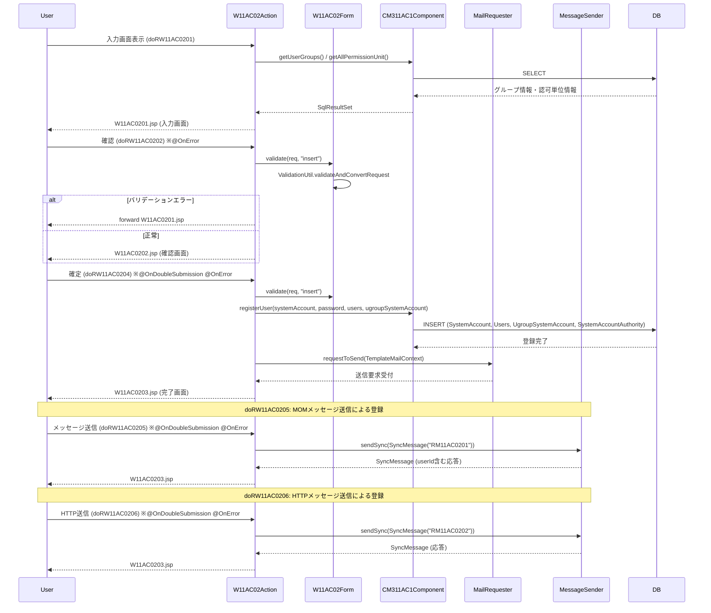

# Code Analysis: W11AC02Action

**Generated**: 2026-03-31 13:39:57
**Target**: ユーザ情報登録機能のアクションクラス
**Modules**: tutorial
**Analysis Duration**: approx. 8m 5s

---

## Overview

`W11AC02Action` はユーザ情報登録機能のアクションクラスである。画面遷移（入力→確認→完了）と3通りの登録方式（DBへの直接登録、MOMメッセージ送信、HTTPメッセージ送信）を提供する。`DbAccessSupport` を継承してSQLアクセスを行い、入力バリデーション・二重サブミット防止・メール送信を組み合わせた典型的なNablarchウェブ登録フローを実装している。

---

## Architecture

### Dependency Graph

```mermaid
classDiagram
    class W11AC02Action {
        <<Action>>
    }
    class W11AC02Form {
        <<Form>>
    }
    class W11AC02RequestForm {
        <<Form>>
    }
    class W11AC02ResponseForm {
        <<Form>>
    }
    class CM311AC1Component {
        <<Component>>
    }
    class DbAccessSupport {
        <<Nablarch>>
    }
    class W11AC02FormBase {
        <<FormBase>>
    }
    class SystemAccountEntity {
        <<Entity>>
    }
    class UsersEntity {
        <<Entity>>
    }
    class UgroupSystemAccountEntity {
        <<Entity>>
    }
    class MailRequester {
        <<Nablarch>>
    }
    class MessageSender {
        <<Nablarch>>
    }
    class ValidationUtil {
        <<Nablarch>>
    }

    W11AC02Action --|> DbAccessSupport : extends
    CM311AC1Component --|> DbAccessSupport : extends
    W11AC02Form --|> W11AC02FormBase : extends
    W11AC02Action ..> W11AC02Form : validates
    W11AC02Action ..> W11AC02RequestForm : validates
    W11AC02Action ..> W11AC02ResponseForm : receives
    W11AC02Action ..> CM311AC1Component : delegates to
    W11AC02Action ..> MailRequester : requests mail via
    W11AC02Action ..> MessageSender : sends sync message via
    W11AC02Form ..> ValidationUtil : validated by
    W11AC02Form ..> SystemAccountEntity : creates
    W11AC02Form ..> UsersEntity : creates
    W11AC02Form ..> UgroupSystemAccountEntity : creates
```



**Note**: This diagram uses Mermaid `classDiagram` syntax to show class names and their relationships. Use `--|>` for inheritance (extends/implements) and `..>` for dependencies (uses/creates).

### Component Summary

| Component | Role | Type | Dependencies |
|-----------|------|------|--------------|
| W11AC02Action | ユーザ登録画面遷移・登録処理 | Action | W11AC02Form, W11AC02RequestForm, CM311AC1Component, MailRequester, MessageSender |
| W11AC02Form | ユーザ登録入力バリデーション・Entity生成 | Form | ValidationUtil, SystemAccountEntity, UsersEntity, UgroupSystemAccountEntity |
| W11AC02RequestForm | HTTPメッセージ送信用リクエストForm | Form | ValidationUtil |
| W11AC02ResponseForm | HTTPメッセージ応答Form | Form | ValidationUtil |
| CM311AC1Component | ユーザ管理機能内共通コンポーネント | Component | DbAccessSupport, SystemAccountEntity, UsersEntity, UgroupSystemAccountEntity |
| SystemAccountEntity | システムアカウントEntity | Entity | なし |
| UsersEntity | ユーザ基本情報Entity | Entity | なし |
| UgroupSystemAccountEntity | グループシステムアカウントEntity | Entity | なし |

---

## Flow

### Processing Flow

画面遷移は「入力画面表示(doRW11AC0201) → 確認(doRW11AC0202) → 登録画面へ戻る(doRW11AC0203) → 確定(doRW11AC0204/0205/0206)」の4ステップで構成される。確定処理は3種類あり、それぞれ直接DB登録・MOMメッセージ送信・HTTPメッセージ送信を行う。確認画面からの遷移でも入力データはhiddenタグで保持されるため、確定ステップでも必ず再バリデーションを実施する。`@OnDoubleSubmission` により二重サブミットをサーバ側で検知・防止する。バリデーションエラー時は `@OnError` により入力画面へフォワードする。

### Sequence Diagram



---

## Components

### W11AC02Action

**ファイル**: [W11AC02Action.java](../../.lw/nab-official/v1.4/tutorial/tutorial/main/java/please/change/me/tutorial/ss11AC/W11AC02Action.java)

**役割**: ユーザ情報登録機能のメインアクションクラス。入力→確認→完了の画面遷移を管理し、3種類の登録方式（直接DB、MOMメッセージ、HTTPメッセージ）を提供する。

**主要メソッド**:

| メソッド | 行 | 説明 |
|---------|-----|------|
| `doRW11AC0201` | L49-55 | 入力画面表示（グループ・認可単位情報をリクエストスコープに設定） |
| `doRW11AC0202` | L65-73 | 確認イベント（バリデーション実施後に確認画面へ） |
| `doRW11AC0204` | L104-125 | 確定イベント（DB直接登録 + メール送信、二重サブミット防止） |
| `doRW11AC0205` | L231-270 | MOMメッセージ送信による登録 |
| `doRW11AC0206` | L281-301 | HTTPメッセージ送信による登録 |
| `sendMailToRegisteredUser` | L133-154 | 登録ユーザへのテンプレートメール送信 |
| `checkLoginId` | L209-217 | ログインID重複チェック（SQL: SELECT_SYSTEM_ACCOUNT） |
| `validate` | L181-202 | バリデーション + ログインID/グループID/認可単位IDチェック |

**依存関係**: CM311AC1Component, W11AC02Form, W11AC02RequestForm, W11AC02ResponseForm, MailRequester, MessageSender, ExecutionContext

---

### W11AC02Form

**ファイル**: [W11AC02Form.java](../../.lw/nab-official/v1.4/tutorial/tutorial/main/java/please/change/me/tutorial/ss11AC/W11AC02Form.java)

**役割**: ユーザ登録入力フォーム。バリデーションと各Entityへの変換を担当する。`W11AC02FormBase` を継承。

**主要メソッド**:

| メソッド | 行 | 説明 |
|---------|-----|------|
| `validate(HttpRequest, String)` | L70-75 | リクエストからバリデーション実施・Form生成 |
| `validate(ValidationContext)` | L82-98 | "insert"バリデーション（パスワード一致・携帯番号項目間精査含む） |
| `validateForSend(ValidationContext)` | L105-119 | "sendUser"バリデーション（パスワード・権限は除外） |
| `getSystemAccount()` | L50-52 | SystemAccountEntityを生成して返す |
| `getUsers()` | L41-43 | UsersEntityを生成して返す |

**依存関係**: ValidationUtil, SystemAccountEntity, UsersEntity, UgroupSystemAccountEntity

---

### CM311AC1Component

**ファイル**: [CM311AC1Component.java](../../.lw/nab-official/v1.4/tutorial/tutorial/main/java/please/change/me/tutorial/ss11AC/CM311AC1Component.java)

**役割**: ユーザ管理機能内共通コンポーネント。`DbAccessSupport` を継承しDBアクセスを集約する。ユーザ登録・検索・削除の全操作を提供する。

**主要メソッド**:

| メソッド | 行 | 説明 |
|---------|-----|------|
| `registerUser` | L106-147 | ユーザ一括登録（SystemAccount + Users + UgroupSystemAccount + Authority） |
| `getUserGroups` | L43-46 | 全グループ情報取得（SELECT_ALL_UGROUPS） |
| `existGroupId` | L64-70 | グループID存在チェック |
| `existPermissionUnitId` | L82-96 | 認可単位ID存在チェック（複数件対応） |
| `registerSystemAccountAuthority` | L192-204 | システムアカウント権限のバッチ挿入 |

**依存関係**: DbAccessSupport, ParameterizedSqlPStatement, SqlPStatement, SystemAccountEntity, UsersEntity, UgroupSystemAccountEntity, IdGeneratorUtil, AuthenticationUtil

---

## Nablarch Framework Usage

### DbAccessSupport

**クラス**: `nablarch.core.db.support.DbAccessSupport`

**説明**: SQLを実行するための基底クラス。継承することでSQLファイルからのStatement取得メソッドが利用できる。

**使用方法**:
```java
class CM311AC1Component extends DbAccessSupport {
    void registerSystemAccount(SystemAccountEntity systemAccount) {
        ParameterizedSqlPStatement statement =
            getParameterizedSqlStatement("INSERT_SYSTEM_ACCOUNT");
        statement.executeUpdateByObject(systemAccount);
    }
}
```

**重要ポイント**:
- ✅ **`getParameterizedSqlStatement`で更新**: EntityオブジェクトをそのままSQLパラメータにマッピングできる
- ✅ **`getSqlPStatement`で検索**: プレースホルダに値を個別バインドして検索結果を取得できる
- 💡 **SQLファイル管理**: クラス名に対応する`.sql`ファイルにSQL文をキー管理する

**このコードでの使い方**:
- `W11AC02Action.checkLoginId()` (L209-217): `getSqlPStatement("SELECT_SYSTEM_ACCOUNT")`でログインID重複確認
- `CM311AC1Component.registerUser()` (L106-147): `getParameterizedSqlStatement`でSystemAccount/Users/UgroupSystemAccount/Authorityを登録

---

### OnDoubleSubmission

**クラス**: `nablarch.common.web.token.OnDoubleSubmission`

**説明**: サーバ側トークン検証による二重サブミット防止アノテーション。

**使用方法**:
```java
@OnError(type = ApplicationException.class, path = "forward://RW11AC0201")
@OnDoubleSubmission(path = "forward://RW11AC0201")
public HttpResponse doRW11AC0204(HttpRequest req, ExecutionContext ctx) {
    // 確定処理
}
```

**重要ポイント**:
- ✅ **確定メソッドに必ず付与**: DBへの書き込みやメッセージ送信を行う全確定メソッドに付与する
- ⚠️ **インターセプタ実行順**: `interceptorsOrder` の設定で `OnDoubleSubmission` を `OnError` より前に定義すること
- 💡 **入力・確認画面共通化との組み合わせ**: JSP共通化機能を使う場合はuseToken設定不要、アノテーション付与のみで機能する

**このコードでの使い方**:
- `doRW11AC0204` (L103): DB直接登録確定に付与
- `doRW11AC0205` (L230): MOMメッセージ送信確定に付与
- `doRW11AC0206` (L279): HTTPメッセージ送信確定に付与

---

### OnError

**クラス**: `nablarch.fw.web.interceptor.OnError`

**説明**: 指定した例外がスローされた際に指定パスへフォワードするインターセプタアノテーション。

**使用方法**:
```java
@OnError(type = ApplicationException.class, path = "forward://RW11AC0201")
public HttpResponse doRW11AC0202(HttpRequest req, ExecutionContext ctx) {
    validate(req); // ApplicationExceptionがスローされると入力画面へフォワード
    // ...
}
```

**重要ポイント**:
- ✅ **バリデーションを実施するメソッドに付与**: `ApplicationException` 発生時に入力画面へ自動フォワード
- ⚠️ **`@OnErrors`でサブクラスを先に定義**: `OptimisticLockException`など `ApplicationException` のサブクラスは必ず上に定義すること

**このコードでの使い方**:
- `doRW11AC0202/0203/0204/0205/0206` (L64, L83, L102, L229, L279): 全てのバリデーション実施メソッドに付与し、エラー時は入力画面 `forward://RW11AC0201` へ遷移

---

### MailRequester / TemplateMailContext

**クラス**: `nablarch.common.mail.MailRequester` / `nablarch.common.mail.TemplateMailContext`

**説明**: 定型メール送信要求API。`MailUtil.getMailRequester()` でインスタンスを取得し、`TemplateMailContext` に設定した内容でメール送信要求を行う。

**使用方法**:
```java
TemplateMailContext tmctx = new TemplateMailContext();
tmctx.setFrom(SystemRepository.getString("defaultFromMailAddress"));
tmctx.addTo(user.getMailAddress());
tmctx.setTemplateId(USER_REGISTERED_MAIL_TEMPLATE_ID);
tmctx.setLang(USER_LANG);
tmctx.setReplaceKeyValue("kanjiName", user.getKanjiName());
tmctx.setReplaceKeyValue("loginId", systemAccount.getLoginId());
MailRequester mailRequester = MailUtil.getMailRequester();
mailRequester.requestToSend(tmctx);
```

**重要ポイント**:
- ✅ **From・To・templateId・langは必須**: 設定漏れはエラーの原因になる
- 💡 **即時送信ではなくキュー登録**: `requestToSend()` はメール送信要求テーブルに登録するだけ。実際の送信は逐次メール送信バッチが実施する
- ⚠️ **プレースホルダのキーはテンプレートと一致させる**: `setReplaceKeyValue("kanjiName", ...)` のキーはメールテンプレートテーブルの `{kanjiName}` プレースホルダと対応させること

**このコードでの使い方**:
- `sendMailToRegisteredUser()` (L133-154): DB直接登録確定(`doRW11AC0204`)後、登録ユーザへテンプレートID `"1"` の定型メールを送信要求

---

### MessageSender / SyncMessage

**クラス**: `nablarch.fw.messaging.MessageSender` / `nablarch.fw.messaging.SyncMessage`

**説明**: 対外システムへの同期応答メッセージ送信ユーティリティ。MOMメッセージング・HTTPメッセージング両対応。

**使用方法**:
```java
Map<String, Object> dataRecord = new HashMap<String, Object>();
dataRecord.put("dataKbn", REQUEST_MESSAGE_DATA_KBN);
dataRecord.put("loginId", systemAccount.getLoginId());
// ... 他フィールド設定

SyncMessage responseMessage = null;
try {
    responseMessage = MessageSender.sendSync(
        new SyncMessage("RM11AC0201").addDataRecord(dataRecord));
} catch (MessagingException e) {
    throw new ApplicationException(
        MessageUtil.createMessage(MessageLevel.ERROR, "MSG00025"));
}
String userId = (String) responseMessage.getDataRecord().get("userId");
```

**重要ポイント**:
- ✅ **`MessagingException` を必ずキャッチ**: 送信エラーは業務エラーとして扱い、ユーザに再試行を促す
- ⚠️ **`MessagingContextHandler` のハンドラ配置が必要**: MOMメッセージングはカレントスレッドのメッセージングコンテキストを利用するため、ハンドラキューに配置が必要
- 💡 **同期応答のみサポート**: 非同期・応答なし送信は `messaging_sending_batch` を使用する

**このコードでの使い方**:
- `doRW11AC0205` (L256-264): MOMメッセージ送信。送信ID `"RM11AC0201"` で要求、応答から `userId` を取得
- `doRW11AC0206` (L288-291): HTTPメッセージ送信。送信ID `"RM11AC0202"` で要求、応答をFormに変換して引き継ぎ

---

### ValidationUtil

**クラス**: `nablarch.core.validation.ValidationUtil`

**説明**: リクエストパラメータのバリデーションと型変換を提供するユーティリティクラス。

**使用方法**:
```java
// リクエストから直接バリデーションしてFormを生成
ValidationContext<W11AC02Form> context =
    ValidationUtil.validateAndConvertRequest("W11AC02", W11AC02Form.class, req, "insert");
context.abortIfInvalid(); // バリデーション失敗時はApplicationExceptionをスロー
return context.createObject();
```

**重要ポイント**:
- ✅ **`abortIfInvalid()` でApplicationExceptionをスロー**: `@OnError` との組み合わせでエラー画面遷移を自動化できる
- 💡 **`@ValidateFor` でバリデーション条件を切り替え**: 登録・更新・送信など操作に応じて使うバリデーション定義を変えられる（"insert", "sendUser"など）
- ⚠️ **確認画面からの再遷移でも必ずバリデーション**: hiddenタグ経由のデータは改竄可能なため、確定メソッドでも再実行する

**このコードでの使い方**:
- `W11AC02Form.validate(HttpRequest, String)` (L70-75): `validateAndConvertRequest` でリクエストを精査・変換
- `validate()`メソッド内 (L182): "insert" バリデーション、パスワード一致・携帯番号項目間精査を追加で実施

---

## References

### Source Files

- [W11AC02Action.java (.claude/skills/nabledge-1.3/knowledge/guide/web-application/assets/web-application-07_insert)](../../.claude/skills/nabledge-1.3/knowledge/guide/web-application/assets/web-application-07_insert/W11AC02Action.java) - W11AC02Action
- [W11AC02Action.java (.claude/skills/nabledge-1.3/knowledge/guide/web-application/assets/web-application-04_validation)](../../.claude/skills/nabledge-1.3/knowledge/guide/web-application/assets/web-application-04_validation/W11AC02Action.java) - W11AC02Action
- [W11AC02Action.java (.claude/skills/nabledge-1.2/knowledge/guide/web-application/assets/web-application-07_insert)](../../.claude/skills/nabledge-1.2/knowledge/guide/web-application/assets/web-application-07_insert/W11AC02Action.java) - W11AC02Action
- [W11AC02Action.java (.claude/skills/nabledge-1.2/knowledge/guide/web-application/assets/web-application-04_validation)](../../.claude/skills/nabledge-1.2/knowledge/guide/web-application/assets/web-application-04_validation/W11AC02Action.java) - W11AC02Action
- [W11AC02Action.java (.claude/skills/nabledge-1.4/knowledge/guide/web-application/assets/web-application-07_insert)](../../.claude/skills/nabledge-1.4/knowledge/guide/web-application/assets/web-application-07_insert/W11AC02Action.java) - W11AC02Action
- [W11AC02Action.java (.lw/nab-official/v1.3/document/guide/04_Explanation/_source/download)](../../.lw/nab-official/v1.3/document/guide/04_Explanation/_source/download/W11AC02Action.java) - W11AC02Action
- [W11AC02Action.java (.lw/nab-official/v1.3/tutorial/main/java/please/change/me/tutorial/ss11AC)](../../.lw/nab-official/v1.3/tutorial/main/java/please/change/me/tutorial/ss11AC/W11AC02Action.java) - W11AC02Action
- [W11AC02Action.java (.lw/nab-official/v1.2/document/guide/04_Explanation/_source/download)](../../.lw/nab-official/v1.2/document/guide/04_Explanation/_source/download/W11AC02Action.java) - W11AC02Action
- [W11AC02Action.java (.lw/nab-official/v1.2/tutorial/main/java/nablarch/sample/ss11AC)](../../.lw/nab-official/v1.2/tutorial/main/java/nablarch/sample/ss11AC/W11AC02Action.java) - W11AC02Action
- [W11AC02Action.java (.lw/nab-official/v1.4/document/guide/04_Explanation/_source/download)](../../.lw/nab-official/v1.4/document/guide/04_Explanation/_source/download/W11AC02Action.java) - W11AC02Action
- [W11AC02Action.java (.lw/nab-official/v1.4/workflow/sample_application/src/main/java/please/change/me/sample/ss11AC)](../../.lw/nab-official/v1.4/workflow/sample_application/src/main/java/please/change/me/sample/ss11AC/W11AC02Action.java) - W11AC02Action
- [W11AC02Action.java (.lw/nab-official/v1.4/tutorial/tutorial/main/java/please/change/me/tutorial/ss11AC)](../../.lw/nab-official/v1.4/tutorial/tutorial/main/java/please/change/me/tutorial/ss11AC/W11AC02Action.java) - W11AC02Action
- [W11AC02Action.java (tools/knowledge-creator/.cache/v1.3/knowledge/guide/web-application/assets/web-application-07_insert--s1)](../../tools/knowledge-creator/.cache/v1.3/knowledge/guide/web-application/assets/web-application-07_insert--s1/W11AC02Action.java) - W11AC02Action
- [W11AC02Action.java (tools/knowledge-creator/.cache/v1.3/knowledge/guide/web-application/assets/web-application-04_validation--s1)](../../tools/knowledge-creator/.cache/v1.3/knowledge/guide/web-application/assets/web-application-04_validation--s1/W11AC02Action.java) - W11AC02Action
- [W11AC02Action.java (tools/knowledge-creator/.cache/v1.2/knowledge/guide/web-application/assets/web-application-07_insert--s1)](../../tools/knowledge-creator/.cache/v1.2/knowledge/guide/web-application/assets/web-application-07_insert--s1/W11AC02Action.java) - W11AC02Action
- [W11AC02Action.java (tools/knowledge-creator/.cache/v1.2/knowledge/guide/web-application/assets/web-application-04_validation--s1)](../../tools/knowledge-creator/.cache/v1.2/knowledge/guide/web-application/assets/web-application-04_validation--s1/W11AC02Action.java) - W11AC02Action
- [W11AC02Action.java (tools/knowledge-creator/.cache/v1.4/knowledge/guide/web-application/assets/web-application-07_insert--s1)](../../tools/knowledge-creator/.cache/v1.4/knowledge/guide/web-application/assets/web-application-07_insert--s1/W11AC02Action.java) - W11AC02Action
- [W11AC02Form.java (.claude/skills/nabledge-1.3/knowledge/guide/web-application/assets/web-application-04_validation)](../../.claude/skills/nabledge-1.3/knowledge/guide/web-application/assets/web-application-04_validation/W11AC02Form.java) - W11AC02Form
- [W11AC02Form.java (.claude/skills/nabledge-1.2/knowledge/guide/web-application/assets/web-application-04_validation)](../../.claude/skills/nabledge-1.2/knowledge/guide/web-application/assets/web-application-04_validation/W11AC02Form.java) - W11AC02Form
- [W11AC02Form.java (.lw/nab-official/v1.3/document/guide/04_Explanation/_source/download)](../../.lw/nab-official/v1.3/document/guide/04_Explanation/_source/download/W11AC02Form.java) - W11AC02Form
- [W11AC02Form.java (.lw/nab-official/v1.3/tutorial/main/java/please/change/me/tutorial/ss11AC)](../../.lw/nab-official/v1.3/tutorial/main/java/please/change/me/tutorial/ss11AC/W11AC02Form.java) - W11AC02Form
- [W11AC02Form.java (.lw/nab-official/v1.2/document/guide/04_Explanation/_source/download)](../../.lw/nab-official/v1.2/document/guide/04_Explanation/_source/download/W11AC02Form.java) - W11AC02Form
- [W11AC02Form.java (.lw/nab-official/v1.2/tutorial/main/java/nablarch/sample/ss11AC)](../../.lw/nab-official/v1.2/tutorial/main/java/nablarch/sample/ss11AC/W11AC02Form.java) - W11AC02Form
- [W11AC02Form.java (.lw/nab-official/v1.4/document/guide/04_Explanation/_source/download)](../../.lw/nab-official/v1.4/document/guide/04_Explanation/_source/download/W11AC02Form.java) - W11AC02Form
- [W11AC02Form.java (.lw/nab-official/v1.4/workflow/sample_application/src/main/java/please/change/me/sample/ss11AC)](../../.lw/nab-official/v1.4/workflow/sample_application/src/main/java/please/change/me/sample/ss11AC/W11AC02Form.java) - W11AC02Form
- [W11AC02Form.java (.lw/nab-official/v1.4/tutorial/tutorial/main/java/please/change/me/tutorial/ss11AC)](../../.lw/nab-official/v1.4/tutorial/tutorial/main/java/please/change/me/tutorial/ss11AC/W11AC02Form.java) - W11AC02Form
- [W11AC02Form.java (tools/knowledge-creator/.cache/v1.3/knowledge/guide/web-application/assets/web-application-04_validation--s1)](../../tools/knowledge-creator/.cache/v1.3/knowledge/guide/web-application/assets/web-application-04_validation--s1/W11AC02Form.java) - W11AC02Form
- [W11AC02Form.java (tools/knowledge-creator/.cache/v1.2/knowledge/guide/web-application/assets/web-application-04_validation--s1)](../../tools/knowledge-creator/.cache/v1.2/knowledge/guide/web-application/assets/web-application-04_validation--s1/W11AC02Form.java) - W11AC02Form
- [CM311AC1Component.java (.claude/skills/nabledge-1.3/knowledge/guide/web-application/assets/web-application-07_insert)](../../.claude/skills/nabledge-1.3/knowledge/guide/web-application/assets/web-application-07_insert/CM311AC1Component.java) - CM311AC1Component
- [CM311AC1Component.java (.claude/skills/nabledge-1.3/knowledge/guide/web-application/assets/web-application-02_basic)](../../.claude/skills/nabledge-1.3/knowledge/guide/web-application/assets/web-application-02_basic/CM311AC1Component.java) - CM311AC1Component
- [CM311AC1Component.java (.claude/skills/nabledge-1.2/knowledge/guide/web-application/assets/web-application-07_insert)](../../.claude/skills/nabledge-1.2/knowledge/guide/web-application/assets/web-application-07_insert/CM311AC1Component.java) - CM311AC1Component
- [CM311AC1Component.java (.claude/skills/nabledge-1.2/knowledge/guide/web-application/assets/web-application-02_basic)](../../.claude/skills/nabledge-1.2/knowledge/guide/web-application/assets/web-application-02_basic/CM311AC1Component.java) - CM311AC1Component
- [CM311AC1Component.java (.claude/skills/nabledge-1.4/knowledge/guide/web-application/assets/web-application-07_insert)](../../.claude/skills/nabledge-1.4/knowledge/guide/web-application/assets/web-application-07_insert/CM311AC1Component.java) - CM311AC1Component
- [CM311AC1Component.java (.claude/skills/nabledge-1.4/knowledge/guide/web-application/assets/web-application-02_basic)](../../.claude/skills/nabledge-1.4/knowledge/guide/web-application/assets/web-application-02_basic/CM311AC1Component.java) - CM311AC1Component
- [CM311AC1Component.java (.lw/nab-official/v1.3/document/guide/04_Explanation/_source/download)](../../.lw/nab-official/v1.3/document/guide/04_Explanation/_source/download/CM311AC1Component.java) - CM311AC1Component
- [CM311AC1Component.java (.lw/nab-official/v1.3/tutorial/main/java/please/change/me/tutorial/ss11AC)](../../.lw/nab-official/v1.3/tutorial/main/java/please/change/me/tutorial/ss11AC/CM311AC1Component.java) - CM311AC1Component
- [CM311AC1Component.java (.lw/nab-official/v1.2/document/guide/04_Explanation/_source/download)](../../.lw/nab-official/v1.2/document/guide/04_Explanation/_source/download/CM311AC1Component.java) - CM311AC1Component
- [CM311AC1Component.java (.lw/nab-official/v1.2/tutorial/main/java/nablarch/sample/ss11AC)](../../.lw/nab-official/v1.2/tutorial/main/java/nablarch/sample/ss11AC/CM311AC1Component.java) - CM311AC1Component
- [CM311AC1Component.java (.lw/nab-official/v1.4/document/guide/04_Explanation/_source/download)](../../.lw/nab-official/v1.4/document/guide/04_Explanation/_source/download/CM311AC1Component.java) - CM311AC1Component
- [CM311AC1Component.java (.lw/nab-official/v1.4/tutorial/tutorial/main/java/please/change/me/tutorial/ss11AC)](../../.lw/nab-official/v1.4/tutorial/tutorial/main/java/please/change/me/tutorial/ss11AC/CM311AC1Component.java) - CM311AC1Component
- [CM311AC1Component.java (tools/knowledge-creator/.cache/v1.3/knowledge/guide/web-application/assets/web-application-07_insert--s1)](../../tools/knowledge-creator/.cache/v1.3/knowledge/guide/web-application/assets/web-application-07_insert--s1/CM311AC1Component.java) - CM311AC1Component
- [CM311AC1Component.java (tools/knowledge-creator/.cache/v1.3/knowledge/guide/web-application/assets/web-application-02_basic)](../../tools/knowledge-creator/.cache/v1.3/knowledge/guide/web-application/assets/web-application-02_basic/CM311AC1Component.java) - CM311AC1Component
- [CM311AC1Component.java (tools/knowledge-creator/.cache/v1.2/knowledge/guide/web-application/assets/web-application-07_insert--s1)](../../tools/knowledge-creator/.cache/v1.2/knowledge/guide/web-application/assets/web-application-07_insert--s1/CM311AC1Component.java) - CM311AC1Component
- [CM311AC1Component.java (tools/knowledge-creator/.cache/v1.2/knowledge/guide/web-application/assets/web-application-02_basic)](../../tools/knowledge-creator/.cache/v1.2/knowledge/guide/web-application/assets/web-application-02_basic/CM311AC1Component.java) - CM311AC1Component
- [CM311AC1Component.java (tools/knowledge-creator/.cache/v1.4/knowledge/guide/web-application/assets/web-application-07_insert--s1)](../../tools/knowledge-creator/.cache/v1.4/knowledge/guide/web-application/assets/web-application-07_insert--s1/CM311AC1Component.java) - CM311AC1Component
- [CM311AC1Component.java (tools/knowledge-creator/.cache/v1.4/knowledge/guide/web-application/assets/web-application-02_basic--s1)](../../tools/knowledge-creator/.cache/v1.4/knowledge/guide/web-application/assets/web-application-02_basic--s1/CM311AC1Component.java) - CM311AC1Component

### Knowledge Base (Nabledge-5)

- [Libraries Mail](../../.claude/skills/nabledge-5/docs/component/libraries/libraries-mail.md)

### Official Documentation


- [AttachedFile](https://nablarch.github.io/docs/LATEST/javadoc/nablarch/common/mail/AttachedFile.html)
- [FreeTextMailContext](https://nablarch.github.io/docs/LATEST/javadoc/nablarch/common/mail/FreeTextMailContext.html)
- [InvalidCharacterException](https://nablarch.github.io/docs/LATEST/javadoc/nablarch/common/mail/InvalidCharacterException.html)
- [MailAttachedFileTable](https://nablarch.github.io/docs/LATEST/javadoc/nablarch/common/mail/MailAttachedFileTable.html)
- [MailConfig](https://nablarch.github.io/docs/LATEST/javadoc/nablarch/common/mail/MailConfig.html)
- [MailRecipientTable](https://nablarch.github.io/docs/LATEST/javadoc/nablarch/common/mail/MailRecipientTable.html)
- [MailRequestConfig](https://nablarch.github.io/docs/LATEST/javadoc/nablarch/common/mail/MailRequestConfig.html)
- [MailRequestTable](https://nablarch.github.io/docs/LATEST/javadoc/nablarch/common/mail/MailRequestTable.html)
- [MailRequester](https://nablarch.github.io/docs/LATEST/javadoc/nablarch/common/mail/MailRequester.html)
- [MailSender](https://nablarch.github.io/docs/LATEST/javadoc/nablarch/common/mail/MailSender.html)
- [MailSessionConfig](https://nablarch.github.io/docs/LATEST/javadoc/nablarch/common/mail/MailSessionConfig.html)
- [MailTemplateTable](https://nablarch.github.io/docs/LATEST/javadoc/nablarch/common/mail/MailTemplateTable.html)
- [MailUtil](https://nablarch.github.io/docs/LATEST/javadoc/nablarch/common/mail/MailUtil.html)
- [Mail](https://nablarch.github.io/docs/LATEST/doc/application_framework/application_framework/libraries/mail.html)
- [TemplateMailContext](https://nablarch.github.io/docs/LATEST/javadoc/nablarch/common/mail/TemplateMailContext.html)
- [TinyTemplateEngineMailProcessor](https://nablarch.github.io/docs/LATEST/javadoc/nablarch/common/mail/TinyTemplateEngineMailProcessor.html)

---

**Note**: This documentation was generated by the code-analysis workflow of the nabledge-1.4 skill.
