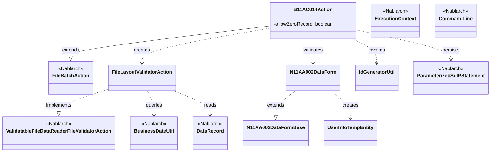
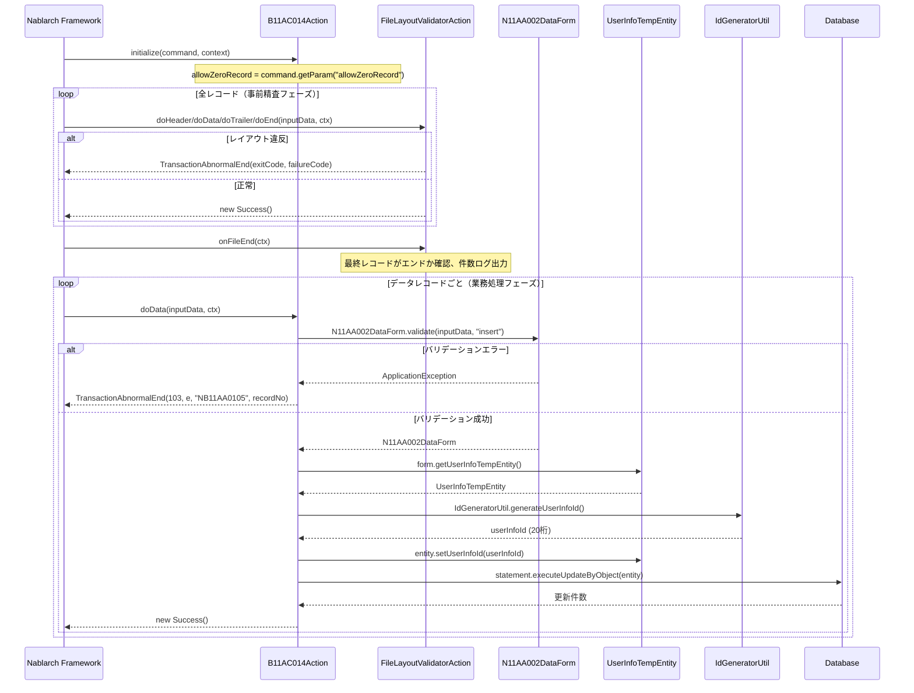

# Code Analysis: B11AC014Action

**Generated**: 2026-03-31 14:16:06
**Target**: ユーザ情報ファイル取込みバッチアクション
**Modules**: tutorial
**Analysis Duration**: approx. 2m 40s

---

## Overview

`B11AC014Action` は、ユーザ情報ファイル（固定長ファイル）を読み込み、バリデーション後にユーザ情報テンポラリテーブルへ登録するファイル入力バッチアクションである。`FileBatchAction` を継承し、`ValidatableFileDataReader` による事前ファイルレイアウト精査機能を組み込んでいる。

内部クラス `FileLayoutValidatorAction` がファイルのレコード構造（ヘッダー→データ→トレーラ→エンド）の整合性を事前に検証し、業務処理クラス `B11AC014Action` 本体は検証済みのデータレコードのみ処理する責務を持つ。

---

## Architecture

### Dependency Graph



**Note**: This diagram uses Mermaid `classDiagram` syntax to show class names and their relationships. Use `--|>` for inheritance (extends/implements) and `..>` for dependencies (uses/creates).

### Component Summary

| Component | Role | Type | Dependencies |
|-----------|------|------|--------------|
| B11AC014Action | ユーザ情報ファイル取込みバッチアクション | Action | FileBatchAction, N11AA002DataForm, UserInfoTempEntity, IdGeneratorUtil, ParameterizedSqlPStatement |
| FileLayoutValidatorAction | ファイルレコードレイアウト事前精査 | Inner Class (FileValidatorAction) | BusinessDateUtil, DataRecord, ExecutionContext |
| N11AA002DataForm | ユーザ情報ファイルデータレコードフォーム（精査・変換） | Form | N11AA002DataFormBase, ValidationUtil, UserInfoTempEntity |
| N11AA002DataFormBase | データレコードフォーム基底クラス（フィールド定義・バリデーションアノテーション） | Abstract Form | なし |
| UserInfoTempEntity | ユーザ情報テンポラリエンティティ（DB登録用） | Entity | なし |
| IdGeneratorUtil | ユーザ情報ID採番ユーティリティ | Utility | IdGenerator, SystemRepository |

---

## Flow

### Processing Flow

バッチ起動時に `initialize()` でコマンドライン引数 `allowZeroRecord` を取得する。`FileBatchAction` のフレームワーク機能により、`ValidatableFileDataReader` が内部クラス `FileLayoutValidatorAction` を使って全レコードを事前精査する。

事前精査では以下の順序でレコード構造を検証する：
1. **ヘッダー**：先頭レコードかつ業務日付一致確認
2. **データ**：前レコードがヘッダーまたはデータであることを確認、件数カウント
3. **トレーラ**：総件数とデータレコード件数の一致確認、`allowZeroRecord` チェック
4. **エンド**：前レコードがトレーラであることを確認
5. **ファイル終端 (onFileEnd)**：最終レコードがエンドレコードであることを確認、件数ログ出力

事前精査成功後、`doData()` でデータレコードごとに `N11AA002DataForm.validate()` を呼びバリデーションを実施。バリデーション成功後、`UserInfoTempEntity` にID（`IdGeneratorUtil` で採番）を設定し、`ParameterizedSqlPStatement.executeUpdateByObject()` でテンポラリテーブルに INSERT する。

### Sequence Diagram



---

## Components

### B11AC014Action

**ファイル**: [B11AC014Action.java (.lw/nab-official/v1.4/tutorial/tutorial/main/java/please/change/me/tutorial/ss11AC)](../../.lw/nab-official/v1.4/tutorial/tutorial/main/java/please/change/me/tutorial/ss11AC/B11AC014Action.java)

**役割**: ユーザ情報固定長ファイルを読み込み、バリデーション後にユーザ情報テンポラリテーブルへ登録するバッチアクション。

**主要メソッド**:
- `initialize(CommandLine, ExecutionContext)` [L41-43]: コマンドライン引数 `allowZeroRecord` を取得してインスタンス変数に格納
- `doHeader(DataRecord, ExecutionContext)` [L56-58]: ヘッダーレコード処理（事前精査済みのためスキップ）
- `doData(DataRecord, ExecutionContext)` [L67-86]: データレコードの精査とテンポラリテーブルへの登録
- `doTrailer(DataRecord, ExecutionContext)` [L100-102]: トレーラレコード処理（事前精査済みのためスキップ）
- `doEnd(DataRecord, ExecutionContext)` [L115-117]: エンドレコード処理（事前精査済みのためスキップ）
- `getDataFileName()` [L120-122]: 入力ファイルID "N11AA002" を返却
- `getFormatFileName()` [L125-127]: フォーマット定義ファイルID "N11AA002" を返却
- `getValidatorAction()` [L130-132]: `FileLayoutValidatorAction` を返却

**依存関係**: `FileBatchAction`（スーパークラス）、`N11AA002DataForm`（バリデーション）、`UserInfoTempEntity`（DB登録）、`IdGeneratorUtil`（ID採番）、`ParameterizedSqlPStatement`（SQL実行）

---

### FileLayoutValidatorAction（内部クラス）

**ファイル**: [B11AC014Action.java (.lw/nab-official/v1.4/tutorial/tutorial/main/java/please/change/me/tutorial/ss11AC)](../../.lw/nab-official/v1.4/tutorial/tutorial/main/java/please/change/me/tutorial/ss11AC/B11AC014Action.java) [L152-310]

**役割**: ファイルのレコード構造（ヘッダー→データ→トレーラ→エンド）を事前精査する。`ValidatableFileDataReader.FileValidatorAction` を実装。

**主要メソッド**:
- `doHeader(DataRecord, ExecutionContext)` [L193-210]: 先頭レコード確認と業務日付チェック
- `doData(DataRecord, ExecutionContext)` [L222-233]: 前レコード区分確認、データレコード件数カウント
- `doTrailer(DataRecord, ExecutionContext)` [L248-271]: 前レコード確認、総件数照合、ゼロレコードチェック
- `doEnd(DataRecord, ExecutionContext)` [L283-290]: 前レコードがトレーラであることを確認
- `onFileEnd(ExecutionContext)` [L298-307]: 最終レコードがエンドか確認、件数ログ出力

**依存関係**: `BusinessDateUtil`（業務日付取得）、`DataRecord`（レコードデータ取得）

---

### N11AA002DataForm

**ファイル**: [N11AA002DataForm.java](../../.lw/nab-official/v1.4/tutorial/tutorial/main/java/please/change/me/tutorial/ss11AC/N11AA002DataForm.java)

**役割**: ユーザ情報ファイルのデータレコードを精査・変換するフォームクラス。

**主要メソッド**:
- `validate(Map, String)` [L44-48]: `ValidationUtil` を使ってバリデーション実行、`N11AA002DataForm` を返却
- `getUserInfoTempEntity()` [L33-35]: フォームデータを `UserInfoTempEntity` に変換
- `validateForRegister(ValidationContext)` [L55-76]: "insert" バリデーション定義（項目バリデーション＋携帯番号項目間精査）

**依存関係**: `N11AA002DataFormBase`（フィールド定義）、`ValidationUtil`（バリデーション実行）、`UserInfoTempEntity`（データ変換先）

---

### UserInfoTempEntity

**ファイル**: [UserInfoTempEntity.java (.lw/nab-official/v1.4/tutorial/tutorial/main/java/please/change/me/tutorial/ss11/entity)](../../.lw/nab-official/v1.4/tutorial/tutorial/main/java/please/change/me/tutorial/ss11/entity/UserInfoTempEntity.java)

**役割**: ユーザ情報テンポラリテーブルへの登録データを保持するエンティティ。Nablarchの共通項目（`@UserId`, `@CurrentDateTime`, `@RequestId`, `@ExecutionId`）を保持。

**依存関係**: Nablarch auto-property アノテーション（共通項目自動設定）

---

### IdGeneratorUtil

**ファイル**: [IdGeneratorUtil.java (.lw/nab-official/v1.4/tutorial/tutorial/main/java/please/change/me/tutorial/util)](../../.lw/nab-official/v1.4/tutorial/tutorial/main/java/please/change/me/tutorial/util/IdGeneratorUtil.java)

**役割**: Oracleシーケンスを使ったID採番ユーティリティ。`SystemRepository` から `IdGenerator` を取得してID生成。

**主要メソッド**:
- `generateUserInfoId()` [L38-41]: ユーザ情報ID（20桁左0パディング）を採番

**依存関係**: `IdGenerator`（ID採番）、`LpadFormatter`（桁数整形）、`SystemRepository`（DIコンテナからの取得）

---

## Nablarch Framework Usage

### FileBatchAction

**クラス**: `nablarch.fw.action.FileBatchAction`

**説明**: ファイル入力バッチアクションの基底クラス。`getDataFileName()` と `getFormatFileName()` を実装するだけで固定長ファイルの読み込みが可能になる。

**使用方法**:
```java
public class B11AC014Action extends FileBatchAction {

    @Override
    public String getDataFileName() {
        return "N11AA002"; // 入力ファイルID
    }

    @Override
    public String getFormatFileName() {
        return "N11AA002"; // フォーマット定義ファイルID
    }

    public Result doData(DataRecord inputData, ExecutionContext ctx) {
        // データレコードごとの業務処理
        return new Success();
    }
}
```

**重要ポイント**:
- ✅ **`getDataFileName()` と `getFormatFileName()` は必須実装**: スーパークラスがファイルリーダを生成するために使用する
- ✅ **`do+レコードタイプ名` メソッドを実装**: `RecordTypeBindingHandler` がレコードタイプに応じてディスパッチする（例: `doHeader`, `doData`, `doTrailer`, `doEnd`）
- ⚠️ **`createReader` と `handle` は実装不要**: `FileBatchAction` のスーパークラスに実装済み
- ⚠️ **インスタンス変数はマルチスレッド非対応**: インスタンス変数を使用する場合はマルチスレッド実行不可。読取専用の変数のみマルチスレッド可能
- 💡 **フォーマット定義で物理レイアウトを隠蔽**: フォーマット定義ファイルにより、バイト位置を意識せずフィールド名でアクセス可能

**このコードでの使い方**:
- `B11AC014Action` が `FileBatchAction` を継承し、`getDataFileName()`/`getFormatFileName()` で "N11AA002" を返却
- `initialize()` で `allowZeroRecord` コマンドライン引数を取得
- `doHeader`, `doData`, `doTrailer`, `doEnd` メソッドでレコードタイプごとの業務処理を実装

---

### ValidatableFileDataReader / FileValidatorAction

**クラス**: `nablarch.fw.reader.ValidatableFileDataReader`

**説明**: ファイルの全レコードを事前精査してから業務処理を開始するファイルリーダ。`FileValidatorAction` インタフェースを実装した精査クラスをセットする。

**使用方法**:
```java
// FileBatchActionを継承する場合はgetValidatorAction()をオーバーライドするだけ
@Override
public ValidatableFileDataReader.FileValidatorAction getValidatorAction() {
    return new FileLayoutValidatorAction();
}

private class FileLayoutValidatorAction implements ValidatableFileDataReader.FileValidatorAction {
    public Result doHeader(DataRecord inputData, ExecutionContext ctx) { ... }
    public Result doData(DataRecord inputData, ExecutionContext ctx) { ... }
    public Result doTrailer(DataRecord inputData, ExecutionContext ctx) { ... }
    public Result doEnd(DataRecord inputData, ExecutionContext ctx) { ... }
    public void onFileEnd(ExecutionContext ctx) { ... }
}
```

**重要ポイント**:
- ✅ **`onFileEnd()` の実装は必須**: インタフェースで定義されているため、必ず実装する
- ✅ **精査メソッドの命名規約**: `do` + レコードタイプ名（`doHeader`, `doData`, `doTrailer`, `doEnd`）
- ⚠️ **`TransactionAbnormalEnd` で異常終了**: 精査エラー発生時はこの例外をスローしてバッチを終了させる
- 💡 **業務処理クラスは精査済みデータのみ処理**: 事前精査が通ったレコードのみ `B11AC014Action` の `doXxx` メソッドへ渡されるため、業務処理でのレイアウトチェックが不要になる

**このコードでの使い方**:
- `getValidatorAction()` [L130-132] で内部クラス `FileLayoutValidatorAction` を返却
- `FileLayoutValidatorAction` でヘッダー/データ/トレーラ/エンドの4種類のレコード構造を検証
- `onFileEnd()` [L298-307] で最終レコードがエンドか確認後、件数ログを出力

---

### ParameterizedSqlPStatement

**クラス**: `nablarch.core.db.statement.ParameterizedSqlPStatement`

**説明**: Entityオブジェクトを引数にSQLを実行するプリペアドステートメント。`executeUpdateByObject()` でEntityのフィールド名とSQL名前付きパラメータをバインドする。

**使用方法**:
```java
ParameterizedSqlPStatement statement = getParameterizedSqlStatement("INSERT_USER_INFO_TEMP");
statement.executeUpdateByObject(entity);
```

**重要ポイント**:
- ✅ **Entityを使ったDB更新を推奨**: 1項目ずつ `setString()` するより保守性・生産性が高い
- ✅ **共通項目の自動設定**: `@UserId`, `@CurrentDateTime` などのアノテーションによりNablarchが自動で値を設定
- ⚠️ **Entityを使わない場合は共通項目自動設定が無効**: `@UserId` 等の共通項目が設定されなくなる

**このコードでの使い方**:
- `doData()` [L81-83] で `getParameterizedSqlStatement("INSERT_USER_INFO_TEMP")` を呼び出し
- `statement.executeUpdateByObject(entity)` でユーザ情報テンポラリテーブルへINSERT

---

### BusinessDateUtil

**クラス**: `nablarch.core.date.BusinessDateUtil`

**説明**: システムの業務日付を取得するユーティリティ。設定ファイルで定義された業務日付を `String` 型（YYYYMMDD形式）で返す。

**使用方法**:
```java
String businessDate = BusinessDateUtil.getDate();
```

**重要ポイント**:
- 💡 **テスト環境での日付切り替えが容易**: 設定ファイルで業務日付を制御できるため、テスト時に任意の日付を設定可能
- 🎯 **ヘッダーレコードの日付整合性チェックに使用**: ファイルのヘッダー日付とシステム業務日付を比較する用途に適している

**このコードでの使い方**:
- `FileLayoutValidatorAction.doHeader()` [L201-207] でヘッダーレコードの `date` フィールドと業務日付を比較

---

## References

### Source Files

- [B11AC014Action.java (.lw/nab-official/v1.3/tutorial/main/java/please/change/me/tutorial/ss11AC)](../../.lw/nab-official/v1.3/tutorial/main/java/please/change/me/tutorial/ss11AC/B11AC014Action.java) - B11AC014Action
- [B11AC014Action.java (.lw/nab-official/v1.2/tutorial/main/java/nablarch/sample/ss11AC)](../../.lw/nab-official/v1.2/tutorial/main/java/nablarch/sample/ss11AC/B11AC014Action.java) - B11AC014Action
- [B11AC014Action.java (.lw/nab-official/v1.4/tutorial/tutorial/main/java/please/change/me/tutorial/ss11AC)](../../.lw/nab-official/v1.4/tutorial/tutorial/main/java/please/change/me/tutorial/ss11AC/B11AC014Action.java) - B11AC014Action
- [N11AA002DataForm.java](../../.lw/nab-official/v1.4/tutorial/tutorial/main/java/please/change/me/tutorial/ss11AC/N11AA002DataForm.java) - N11AA002DataForm
- [N11AA002DataFormBase.java](../../.lw/nab-official/v1.4/tutorial/tutorial/main/java/please/change/me/tutorial/ss11AC/N11AA002DataFormBase.java) - N11AA002DataFormBase
- [UserInfoTempEntity.java (.lw/nab-official/v1.3/tutorial/main/java/please/change/me/tutorial/ss11/entity)](../../.lw/nab-official/v1.3/tutorial/main/java/please/change/me/tutorial/ss11/entity/UserInfoTempEntity.java) - UserInfoTempEntity
- [UserInfoTempEntity.java (.lw/nab-official/v1.2/tutorial/main/java/nablarch/sample/ss11/entity)](../../.lw/nab-official/v1.2/tutorial/main/java/nablarch/sample/ss11/entity/UserInfoTempEntity.java) - UserInfoTempEntity
- [UserInfoTempEntity.java (.lw/nab-official/v1.4/tutorial/tutorial/main/java/please/change/me/tutorial/ss11/entity)](../../.lw/nab-official/v1.4/tutorial/tutorial/main/java/please/change/me/tutorial/ss11/entity/UserInfoTempEntity.java) - UserInfoTempEntity
- [IdGeneratorUtil.java (.lw/nab-official/v1.3/tutorial/main/java/please/change/me/tutorial/util)](../../.lw/nab-official/v1.3/tutorial/main/java/please/change/me/tutorial/util/IdGeneratorUtil.java) - IdGeneratorUtil
- [IdGeneratorUtil.java (.lw/nab-official/v5/nablarch-system-development-guide/en/Sample_Project/Source_Code/proman-project/proman-common/src/main/java/com/nablarch/example/proman/common/id)](../../.lw/nab-official/v5/nablarch-system-development-guide/en/Sample_Project/Source_Code/proman-project/proman-common/src/main/java/com/nablarch/example/proman/common/id/IdGeneratorUtil.java) - IdGeneratorUtil
- [IdGeneratorUtil.java (.lw/nab-official/v5/nablarch-system-development-guide/Sample_Project/Source_Code/proman-project/proman-common/src/main/java/com/nablarch/example/proman/common/id)](../../.lw/nab-official/v5/nablarch-system-development-guide/Sample_Project/Source_Code/proman-project/proman-common/src/main/java/com/nablarch/example/proman/common/id/IdGeneratorUtil.java) - IdGeneratorUtil
- [IdGeneratorUtil.java (.lw/nab-official/v1.2/tutorial/main/java/nablarch/sample/util)](../../.lw/nab-official/v1.2/tutorial/main/java/nablarch/sample/util/IdGeneratorUtil.java) - IdGeneratorUtil
- [IdGeneratorUtil.java (.lw/nab-official/v6/nablarch-system-development-guide/en/Sample_Project/Source_Code/proman-project/proman-common/src/main/java/com/nablarch/example/proman/common/id)](../../.lw/nab-official/v6/nablarch-system-development-guide/en/Sample_Project/Source_Code/proman-project/proman-common/src/main/java/com/nablarch/example/proman/common/id/IdGeneratorUtil.java) - IdGeneratorUtil
- [IdGeneratorUtil.java (.lw/nab-official/v6/nablarch-system-development-guide/Sample_Project/Source_Code/proman-project/proman-common/src/main/java/com/nablarch/example/proman/common/id)](../../.lw/nab-official/v6/nablarch-system-development-guide/Sample_Project/Source_Code/proman-project/proman-common/src/main/java/com/nablarch/example/proman/common/id/IdGeneratorUtil.java) - IdGeneratorUtil
- [IdGeneratorUtil.java (.lw/nab-official/v1.4/workflow/sample_application/src/main/java/please/change/me/sample/util)](../../.lw/nab-official/v1.4/workflow/sample_application/src/main/java/please/change/me/sample/util/IdGeneratorUtil.java) - IdGeneratorUtil
- [IdGeneratorUtil.java (.lw/nab-official/v1.4/tutorial/tutorial/main/java/please/change/me/tutorial/util)](../../.lw/nab-official/v1.4/tutorial/tutorial/main/java/please/change/me/tutorial/util/IdGeneratorUtil.java) - IdGeneratorUtil

### Knowledge Base (Nabledge-1.4)

- [ファイル入力バッチ実装ガイド](../../.claude/skills/nabledge-1.4/knowledge/guide/nablarch-batch/nablarch-batch-04_fileInputBatch.json)
- [ValidatableFileDataReader コンポーネント](../../.claude/skills/nabledge-1.4/knowledge/component/readers/readers-ValidatableFileDataReader.json)
- [FileBatchAction ハンドラ](../../.claude/skills/nabledge-1.4/knowledge/component/handlers/handlers-FileBatchAction.json)
- [バッチ処理基本ガイド](../../.claude/skills/nabledge-1.4/knowledge/guide/nablarch-batch/nablarch-batch-02_basic.json)
- [バッチDB更新パターン](../../.claude/skills/nabledge-1.4/knowledge/processing-pattern/nablarch-batch/nablarch-batch-2.json)

### Official Documentation

(No official documentation links available)

---

**Note**: This documentation was generated by the code-analysis workflow of the nabledge-1.4 skill.
