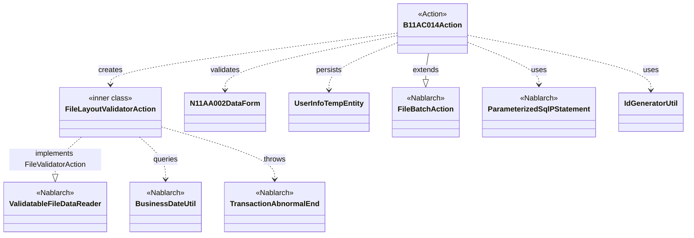
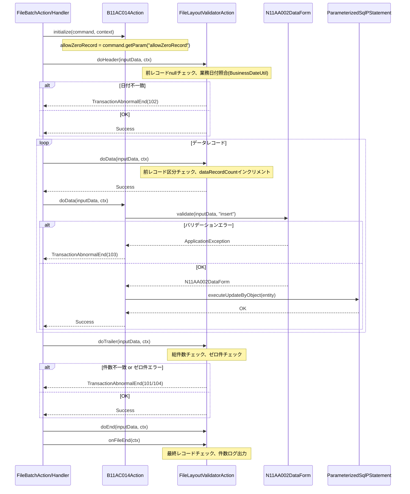

# Code Analysis: B11AC014Action

**Generated**: 2026-03-31 14:22:01
**Target**: ユーザ情報ファイル入力バッチアクション
**Modules**: tutorial
**Analysis Duration**: approx. 3m 53s

---

## Overview

`B11AC014Action`は、固定長ファイル（N11AA002）を読み込んでユーザ情報をデータベースのテンポラリテーブルへ登録するファイル入力バッチアクションである。`FileBatchAction`を継承し、レコードタイプ別メソッド（`doHeader`/`doData`/`doTrailer`/`doEnd`）でレコードごとの処理を担う。ファイルレイアウト精査は内部クラス`FileLayoutValidatorAction`が行い、ヘッダー・データ・トレーラー・エンドレコードの順序整合性と総件数チェックを実施する。データレコード処理では`N11AA002DataForm`でバリデーションを行い、`ParameterizedSqlPStatement`でエンティティをデータベースへ登録する。

---

## Architecture

### Dependency Graph



**Note**: This diagram uses Mermaid `classDiagram` syntax to show class names and their relationships. Use `--|>` for inheritance (extends/implements) and `..>` for dependencies (uses/creates).

### Component Summary

| Component | Role | Type | Dependencies |
|-----------|------|------|--------------|
| B11AC014Action | ユーザ情報ファイル入力バッチのメインアクション | Action | N11AA002DataForm, UserInfoTempEntity, FileLayoutValidatorAction, IdGeneratorUtil |
| FileLayoutValidatorAction | ファイルレイアウト精査内部クラス | FileValidatorAction | BusinessDateUtil, TransactionAbnormalEnd |
| N11AA002DataForm | データレコードフォーム（バリデーション） | Form | UserInfoTempEntity, ValidationUtil |
| UserInfoTempEntity | ユーザ情報テンポラリエンティティ | Entity | (Nablarch auto-property annotations) |
| IdGeneratorUtil | ユーザ情報ID採番ユーティリティ | Utility | なし |

---

## Flow

### Processing Flow

バッチ起動時に`initialize`でコマンドライン引数（`allowZeroRecord`）を取得する。その後`FileBatchAction`フレームワークがファイルを事前に全件読み込み、`FileLayoutValidatorAction`でレイアウト精査を行う。精査完了後、レコードタイプに応じて`doHeader`/`doData`/`doTrailer`/`doEnd`が呼び出される。`doData`でデータレコードのバリデーションとDB登録を行い、バリデーションエラー時は`TransactionAbnormalEnd`（終了コード103）をスローして異常終了する。トレーラレコードでは総件数とデータレコード件数の整合チェック、ゼロ件チェックを行う。全レコード処理完了後に`onFileEnd`が呼ばれ、最終レコードがエンドレコードであることを確認してログを出力する。

### Sequence Diagram



---

## Components

### B11AC014Action

**ファイル**: [B11AC014Action.java (.lw/nab-official/v1.4/tutorial/tutorial/main/java/please/change/me/tutorial/ss11AC)](../../.lw/nab-official/v1.4/tutorial/tutorial/main/java/please/change/me/tutorial/ss11AC/B11AC014Action.java)

**役割**: ファイル入力バッチのメインアクション。`FileBatchAction`を継承し、ファイルID・フォーマット定義・レイアウト精査クラスを提供する。データレコードごとにバリデーション・ID採番・DB登録を行う。

**主要メソッド**:
- `initialize(CommandLine, ExecutionContext)` (L41-43): コマンドライン引数`allowZeroRecord`を取得してインスタンス変数に設定
- `doData(DataRecord, ExecutionContext)` (L67-86): データレコード処理。フォームバリデーション→ID採番→DB INSERT
- `getValidatorAction()` (L130-132): `FileLayoutValidatorAction`を返してファイルレイアウト精査を有効化
- `getDataFileName()` / `getFormatFileName()` (L120-127): ファイルID "N11AA002" を返却

**依存関係**: `N11AA002DataForm`, `UserInfoTempEntity`, `FileLayoutValidatorAction`, `IdGeneratorUtil`, `ParameterizedSqlPStatement`

---

### FileLayoutValidatorAction (inner class)

**ファイル**: [B11AC014Action.java (.lw/nab-official/v1.4/tutorial/tutorial/main/java/please/change/me/tutorial/ss11AC)](../../.lw/nab-official/v1.4/tutorial/tutorial/main/java/please/change/me/tutorial/ss11AC/B11AC014Action.java) L152-310

**役割**: `ValidatableFileDataReader.FileValidatorAction`を実装したファイルレイアウト精査クラス。レコードの順序整合性と総件数を検証する。

**主要メソッド**:
- `doHeader(DataRecord, ExecutionContext)` (L193-211): ヘッダーが1レコード目であることと業務日付チェック
- `doData(DataRecord, ExecutionContext)` (L222-234): 前レコード区分チェック、`dataRecordCount`インクリメント
- `doTrailer(DataRecord, ExecutionContext)` (L248-272): 総件数チェックとゼロ件制御
- `doEnd(DataRecord, ExecutionContext)` (L283-291): 前レコードがトレーラであることを確認
- `onFileEnd(ExecutionContext)` (L298-307): 最終レコードがエンドであることを確認し件数ログ出力

**依存関係**: `BusinessDateUtil`, `TransactionAbnormalEnd`, `DataRecord`, `ExecutionContext`

---

### N11AA002DataForm

**ファイル**: [N11AA002DataForm.java](../../.lw/nab-official/v1.4/tutorial/tutorial/main/java/please/change/me/tutorial/ss11AC/N11AA002DataForm.java)

**役割**: データレコードのバリデーションフォーム。`ValidationUtil.validateAndConvertRequest`でバリデーション実行後、`UserInfoTempEntity`を生成する。

**主要メソッド**:
- `validate(Map, String)` (L44-48): バリデーション実行とフォームオブジェクト生成（staticファクトリメソッド）
- `validateForRegister(ValidationContext)` (L56-76): "insert"用バリデーション定義。単項目と携帯電話番号の項目間精査
- `getUserInfoTempEntity()` (L33-35): フォームデータから`UserInfoTempEntity`を生成

---

### UserInfoTempEntity

**ファイル**: [UserInfoTempEntity.java (.lw/nab-official/v1.4/tutorial/tutorial/main/java/please/change/me/tutorial/ss11/entity)](../../.lw/nab-official/v1.4/tutorial/tutorial/main/java/please/change/me/tutorial/ss11/entity/UserInfoTempEntity.java)

**役割**: ユーザ情報テンポラリテーブルのエンティティ。`@UserId`, `@CurrentDateTime`, `@RequestId`等のNablarch自動設定アノテーションを持つ。バリデーションアノテーション（`@Required`, `@Length`, `@SystemChar`）はセッターに付与。

**依存関係**: Nablarch auto-property annotations（`@UserId`, `@CurrentDateTime`, `@RequestId`）

---

## Nablarch Framework Usage

### FileBatchAction

**クラス**: `nablarch.fw.action.FileBatchAction`

**説明**: ファイル入力バッチアクションの基底クラス。`getDataFileName()`と`getFormatFileName()`を実装することでファイルデータリーダが自動生成される。レコードタイプに応じて`do+レコードタイプ名`メソッドが呼び出される。

**使用方法**:
```java
public class B11AC014Action extends FileBatchAction {
    @Override
    public String getDataFileName() { return "N11AA002"; }
    @Override
    public String getFormatFileName() { return "N11AA002"; }
    public Result doData(DataRecord inputData, ExecutionContext ctx) { ... }
}
```

**重要ポイント**:
- ✅ **`getDataFileName()`と`getFormatFileName()`は必須実装**: スーパークラスがデータリーダを自動生成するために必要
- ⚠️ **インスタンス変数使用時の制約**: インスタンス変数を更新するバッチアクションはマルチスレッド実行不可。読み取り専用であればマルチスレッド可
- 💡 **`createReader`・`handle`の実装不要**: スーパークラスに実装済み。代わりに`do+レコードタイプ名`を実装する
- 🎯 **`initialize`オーバーライド**: コマンドライン引数取得やインスタンス変数初期化が必要な場合にオーバーライドする

**このコードでの使い方**:
- `getDataFileName()`・`getFormatFileName()`でファイルID "N11AA002" を返却
- `initialize`でコマンドライン引数`allowZeroRecord`を取得
- `doHeader`/`doData`/`doTrailer`/`doEnd`でレコードタイプ別処理を実装

---

### ValidatableFileDataReader / FileValidatorAction

**クラス**: `nablarch.fw.reader.ValidatableFileDataReader`, `nablarch.fw.reader.ValidatableFileDataReader.FileValidatorAction`

**説明**: ファイルを事前に全件読み込んで精査を行うデータリーダ。`FileValidatorAction`インタフェースを実装した精査クラスを`getValidatorAction()`で返すことで事前精査が有効になる。

**使用方法**:
```java
@Override
public ValidatableFileDataReader.FileValidatorAction getValidatorAction() {
    return new FileLayoutValidatorAction();
}

private class FileLayoutValidatorAction implements ValidatableFileDataReader.FileValidatorAction {
    public Result doHeader(DataRecord inputData, ExecutionContext ctx) { ... }
    public Result doData(DataRecord inputData, ExecutionContext ctx) { ... }
    public Result doTrailer(DataRecord inputData, ExecutionContext ctx) { ... }
    public Result doEnd(DataRecord inputData, ExecutionContext ctx) { ... }
    public void onFileEnd(ExecutionContext ctx) { ... }
}
```

**重要ポイント**:
- ✅ **`onFileEnd`の実装**: ファイル全件精査後の最終チェック（最終レコード種別確認等）に使用
- 💡 **業務処理との完全分離**: ファイルレイアウト精査ロジックを業務処理（`doData`等）から分離できる
- ⚠️ **精査エラー時は`TransactionAbnormalEnd`をスロー**: バッチ異常終了として処理される
- 🎯 **`useCache`プロパティ**: 事前精査で読んだデータをキャッシュして業務処理で再利用可能。通常は不要

**このコードでの使い方**:
- `getValidatorAction()`が`FileLayoutValidatorAction`を返す
- `FileLayoutValidatorAction`内でヘッダー・データ・トレーラー・エンドの順序整合性と総件数を精査

---

### ParameterizedSqlPStatement

**クラス**: `nablarch.core.db.statement.ParameterizedSqlPStatement`

**説明**: エンティティオブジェクトを用いてパラメータ化SQLを実行するステートメントクラス。`executeUpdateByObject`でエンティティのプロパティをSQL名前付きパラメータにバインドしてUPDATE/INSERTを実行する。

**使用方法**:
```java
ParameterizedSqlPStatement statement = getParameterizedSqlStatement("INSERT_USER_INFO_TEMP");
statement.executeUpdateByObject(entity);
```

**重要ポイント**:
- ✅ **Entityを使う**: 1項目ずつ値を設定する実装より保守性・生産性が高い
- 💡 **共通項目の自動設定**: `@UserId`, `@CurrentDateTime`等のNablarchアノテーションが共通項目を自動設定する
- ⚠️ **Entityを使わない場合は共通項目が設定不可**: `getSqlPStatement`+個別`setXxx`の実装では共通項目が設定されない

**このコードでの使い方**:
- `doData`で`getParameterizedSqlStatement("INSERT_USER_INFO_TEMP")`でSQL取得
- `executeUpdateByObject(entity)`でユーザ情報テンポラリテーブルへINSERT

---

### BusinessDateUtil

**クラス**: `nablarch.core.date.BusinessDateUtil`

**説明**: 業務日付を取得するユーティリティクラス。データベースに設定された業務日付を返す。

**使用方法**:
```java
String businessDate = BusinessDateUtil.getDate();
```

**重要ポイント**:
- 🎯 **業務日付とシステム日付の違い**: `BusinessDateUtil.getDate()`はDBから取得した業務日付。`new Date()`等のシステム日付とは異なる
- ✅ **ファイルヘッダーの日付チェックに使用**: ファイルの作成日付と業務日付が一致することを確認する

**このコードでの使い方**:
- `FileLayoutValidatorAction.doHeader`でファイルヘッダーの`date`フィールドと業務日付を比較
- 不一致の場合は`TransactionAbnormalEnd(102)`をスロー

---

### TransactionAbnormalEnd

**クラス**: `nablarch.fw.TransactionAbnormalEnd`

**説明**: バッチ処理の異常終了を示す例外クラス。終了コード（プロセス終了コード）とメッセージIDを指定してスローする。

**使用方法**:
```java
throw new TransactionAbnormalEnd(103, e, "NB11AA0105", inputData.getRecordNumber());
```

**重要ポイント**:
- ✅ **終了コードの使い分け**: このコードでは100(レイアウトエラー), 101(件数不一致), 102(日付不一致), 103(バリデーションエラー), 104(ゼロ件エラー)を使い分けている
- 💡 **ApplicationExceptionのラップ**: バリデーションエラー時は`ApplicationException`を`TransactionAbnormalEnd`でラップして異常終了させる

**このコードでの使い方**:
- ファイルレイアウトエラー: `TransactionAbnormalEnd(100, ...)`
- データレコードバリデーションエラー: `TransactionAbnormalEnd(103, e, "NB11AA0105", recordNumber)`
- トレーラ件数不一致: `TransactionAbnormalEnd(101, ...)`
- ゼロ件エラー: `TransactionAbnormalEnd(104, "NB11AA0106")`

---

## References

### Source Files

- [B11AC014Action.java (.lw/nab-official/v1.3/tutorial/main/java/please/change/me/tutorial/ss11AC)](../../.lw/nab-official/v1.3/tutorial/main/java/please/change/me/tutorial/ss11AC/B11AC014Action.java) - B11AC014Action
- [B11AC014Action.java (.lw/nab-official/v1.2/tutorial/main/java/nablarch/sample/ss11AC)](../../.lw/nab-official/v1.2/tutorial/main/java/nablarch/sample/ss11AC/B11AC014Action.java) - B11AC014Action
- [B11AC014Action.java (.lw/nab-official/v1.4/tutorial/tutorial/main/java/please/change/me/tutorial/ss11AC)](../../.lw/nab-official/v1.4/tutorial/tutorial/main/java/please/change/me/tutorial/ss11AC/B11AC014Action.java) - B11AC014Action
- [N11AA002DataForm.java](../../.lw/nab-official/v1.4/tutorial/tutorial/main/java/please/change/me/tutorial/ss11AC/N11AA002DataForm.java) - N11AA002DataForm
- [UserInfoTempEntity.java (.lw/nab-official/v1.3/tutorial/main/java/please/change/me/tutorial/ss11/entity)](../../.lw/nab-official/v1.3/tutorial/main/java/please/change/me/tutorial/ss11/entity/UserInfoTempEntity.java) - UserInfoTempEntity
- [UserInfoTempEntity.java (.lw/nab-official/v1.2/tutorial/main/java/nablarch/sample/ss11/entity)](../../.lw/nab-official/v1.2/tutorial/main/java/nablarch/sample/ss11/entity/UserInfoTempEntity.java) - UserInfoTempEntity
- [UserInfoTempEntity.java (.lw/nab-official/v1.4/tutorial/tutorial/main/java/please/change/me/tutorial/ss11/entity)](../../.lw/nab-official/v1.4/tutorial/tutorial/main/java/please/change/me/tutorial/ss11/entity/UserInfoTempEntity.java) - UserInfoTempEntity

### Knowledge Base (Nabledge-1.4)

- guide/nablarch-batch/nablarch-batch-04_fileInputBatch.json - ファイル入力バッチの実装ガイド
- component/readers/readers-ValidatableFileDataReader.json - ValidatableFileDataReaderコンポーネント
- component/handlers/handlers-FileBatchAction.json - FileBatchActionハンドラ処理フロー
- processing-pattern/nablarch-batch/nablarch-batch-2.json - バッチDBアクセスパターン

### Official Documentation

(No official documentation links available)

---

**Note**: This documentation was generated by the code-analysis workflow of the nabledge-1.4 skill.
