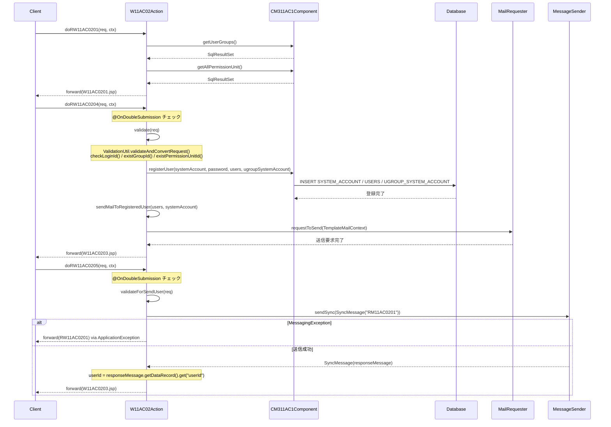

# Code Analysis: W11AC02Action

**Generated**: 2026-03-31 16:10:49
**Target**: ユーザー登録機能のアクションクラス
**Modules**: tutorial/tutorial
**Analysis Duration**: approx. 4m 10s

---

## Overview

W11AC02Action は Nablarch 1.4 チュートリアルアプリケーションにおけるユーザー登録機能の Web アクションクラスである。`DbAccessSupport` を継承し、登録入力画面の表示・バリデーション・DB 登録・メール送信・同期メッセージ送信の各処理を一連の画面フロー（入力 → 確認 → 完了）として実装している。

主なメソッド構成：
- `doRW11AC0201`: 登録入力画面の初期表示
- `doRW11AC0202`: 確認画面への遷移（バリデーション付き）
- `doRW11AC0203`: 入力画面への戻り
- `doRW11AC0204`: 登録確定処理（DB 登録 + メール送信、`@OnDoubleSubmission` 付き）
- `doRW11AC0205`: 同期応答メッセージ送信によるユーザー登録（`@OnDoubleSubmission` 付き）
- `doRW11AC0206`: HTTP 送信によるユーザー登録（`@OnDoubleSubmission` 付き）

バリデーション（`ValidationUtil`）、DB 登録（`ParameterizedSqlPStatement`）、メール送信要求（`MailRequester`）、同期メッセージ送信（`MessageSender`）の各 Nablarch 機能を統合して利用する。二重サブミット防止（`@OnDoubleSubmission`）とエラーハンドリング（`@OnError`）により堅牢な業務フローを実現している。

---

## Architecture

### Dependency Graph

```mermaid
classDiagram
    class W11AC02Action {
        <<Action>>
    }
    class W11AC02Form {
        <<Form>>
    }
    class CM311AC1Component {
        <<Component>>
    }
    class DbAccessSupport {
        <<Nablarch>>
    }
    class ValidationUtil {
        <<Nablarch>>
    }
    class MailRequester {
        <<Nablarch>>
    }
    class MessageSender {
        <<Nablarch>>
    }
    class SystemAccountEntity
    class UsersEntity
    class UgroupSystemAccountEntity

    W11AC02Action --|> DbAccessSupport : extends
    CM311AC1Component --|> DbAccessSupport : extends
    W11AC02Action ..> W11AC02Form : validates
    W11AC02Action ..> CM311AC1Component : delegates to
    W11AC02Action ..> ValidationUtil : invokes
    W11AC02Action ..> MailRequester : requestToSend
    W11AC02Action ..> MessageSender : sendSync
    W11AC02Form ..> SystemAccountEntity : creates
    W11AC02Form ..> UsersEntity : creates
    W11AC02Form ..> UgroupSystemAccountEntity : creates
```



**Note**: This diagram uses Mermaid `classDiagram` syntax to show class names and their relationships. Use `--|>` for inheritance (extends/implements) and `..>` for dependencies (uses/creates).

### Component Summary

| Component | Role | Type | Dependencies |
|-----------|------|------|--------------|
| W11AC02Action | ユーザー登録 Web アクション | Action | W11AC02Form, CM311AC1Component, ValidationUtil, MailRequester, MessageSender |
| W11AC02Form | ユーザー登録入力フォーム | Form | SystemAccountEntity, UsersEntity, UgroupSystemAccountEntity |
| CM311AC1Component | ユーザー管理機能内共通コンポーネント | Component | DbAccessSupport, ParameterizedSqlPStatement |
| SystemAccountEntity | システムアカウントエンティティ | Entity | なし |
| UsersEntity | ユーザーエンティティ | Entity | なし |
| UgroupSystemAccountEntity | グループシステムアカウントエンティティ | Entity | なし |

---

## Flow

### Processing Flow

**登録入力画面表示（doRW11AC0201）**:
1. `setUpViewData(ctx)` を呼び出し、グループ情報・認可単位情報をリクエストスコープに格納
2. `W11AC0201.jsp` を返却

**確認画面表示（doRW11AC0202）**:
1. `validate(req)` でバリデーション実行（エラー時は `@OnError` で `RW11AC0201` にフォワード）
2. `setUpViewData(ctx)` でビュー用データを格納
3. `W11AC0202.jsp` を返却

**登録確定（doRW11AC0204）**:
1. `@OnDoubleSubmission` で二重サブミットチェック
2. `validate(req)` でバリデーション（毎回実行、hidden 改竄対策）
3. `CM311AC1Component#registerUser()` で DB 登録実行（システムアカウント・ユーザー・グループシステムアカウントを一括登録）
4. `sendMailToRegisteredUser()` で登録ユーザーにメール送信要求
5. `ctx.setRequestScopedVar("userId", systemAccount.getUserId())` で引き継ぎ
6. `W11AC0203.jsp` を返却

**同期メッセージ送信によるユーザー登録（doRW11AC0205）**:
1. `@OnDoubleSubmission` で二重サブミットチェック
2. `validateForSendUser(req)` でバリデーション
3. データレコードを生成して `MessageSender.sendSync()` で同期電文送信（RM11AC0201）
4. 応答電文からユーザー ID を取得し、`systemAccount` に設定
5. `W11AC0203.jsp` を返却

**プライベートメソッド**:
- `validate(req)`: ValidationUtil でバリデーション + `checkLoginId()` + グループ/認可単位 ID チェック
- `validateForSendUser(req)`: sendUser グループでバリデーション + `checkLoginId()`
- `validateForHttpSendUser(req)`: sendHttpUser グループでバリデーション + `checkLoginId()`
- `checkLoginId(loginId)`: SQL 文でログイン ID 重複チェック（重複時は ApplicationException）
- `sendMailToRegisteredUser(user, systemAccount)`: TemplateMailContext を使用した定型メール送信要求
- `setUpViewData(ctx)`: CM311AC1Component からグループ情報・認可単位情報を取得してリクエストスコープに格納

### Sequence Diagram



---

## Components

### W11AC02Action

**File**: [W11AC02Action.java](../../.lw/nab-official/v1.4/tutorial/tutorial/main/java/please/change/me/tutorial/ss11AC/W11AC02Action.java)

**Role**: ユーザー情報登録の Web アクションクラス。HTTP リクエストを受け取り、バリデーション・DB 登録・メール送信・メッセージ送信の各処理を実行する。

**Key Methods**:
- `doRW11AC0201(req, ctx)` (L49-55): 登録入力画面の初期表示。setUpViewData を呼び出してグループ情報等を設定
- `doRW11AC0204(req, ctx)` (L104-125): 登録確定処理。`@OnDoubleSubmission` 付きで二重送信防止。validate → registerUser → sendMailToRegisteredUser の順で実行
- `doRW11AC0205(req, ctx)` (L231-270): 同期応答メッセージ送信によるユーザー登録。MessageSender で RM11AC0201 に電文送信し、応答から userId を取得
- `validate(req)` (L181-202): バリデーション + ログイン ID/グループ ID/認可単位 ID のビジネスロジックチェック
- `sendMailToRegisteredUser(user, systemAccount)` (L133-154): TemplateMailContext を使用した定型メール送信要求
- `checkLoginId(loginId)` (L209-217): SQL でログイン ID 重複チェック

**Dependencies**: W11AC02Form, CM311AC1Component, ValidationUtil, MailRequester, TemplateMailContext, MessageSender, ApplicationException, MessageUtil, SystemRepository

---

### W11AC02Form

**File**: [W11AC02Form.java](../../.lw/nab-official/v1.4/tutorial/tutorial/main/java/please/change/me/tutorial/ss11AC/W11AC02Form.java)

**Role**: ユーザー情報登録の入力フォームクラス。Entity クラスをプロパティとして保持し、処理に応じた複数のバリデーションメソッドを定義する。

**Key Methods**:
- `validate(req, validationName)` (L70-75): static メソッド。ValidationUtil でバリデーション実行後、abortIfInvalid で例外スロー、createObject でフォームオブジェクト生成
- `validate(context)` (L82-98): `@ValidateFor("insert")`。全プロパティを精査し、新パスワードと確認用パスワードの一致チェック・携帯電話番号の項目間チェック
- `validateForSend(context)` (L105-119): `@ValidateFor("sendUser")`。パスワードと権限情報を精査対象外とする

**Dependencies**: SystemAccountEntity, UsersEntity, UgroupSystemAccountEntity, ValidationUtil, ValidationContext

---

### CM311AC1Component

**File**: [CM311AC1Component.java](../../.lw/nab-official/v1.4/tutorial/tutorial/main/java/please/change/me/tutorial/ss11AC/CM311AC1Component.java)

**Role**: ユーザー管理機能内で共通利用されるコンポーネント。DB アクセス処理（グループ取得・ユーザー登録・削除等）をカプセル化する。

**Key Methods**:
- `registerUser(systemAccount, plainPassword, users, ugroupSystemAccount)` (L106-147): ユーザー ID 採番、日付設定、パスワード暗号化後に各テーブルへ INSERT（システムアカウント・ユーザー・グループシステムアカウント・権限）
- `getUserGroups()` (L43-45): 全グループを取得する SQL 実行
- `existGroupId(ugroupSystemAccount)` (L64-69): グループ ID の存在チェック
- `existPermissionUnitId(systemAccount)` (L82-95): 認可単位 ID の存在チェック（全 ID を確認）

**Dependencies**: DbAccessSupport, ParameterizedSqlPStatement, SqlPStatement, BusinessDateUtil, AuthenticationUtil, IdGeneratorUtil

---

## Nablarch Framework Usage

### ValidationUtil / ValidationContext

**Class**: `nablarch.core.validation.ValidationUtil`, `nablarch.core.validation.ValidationContext`

**Description**: リクエストパラメータのバリデーションと型変換を実行し、バリデーション済みオブジェクトを生成するフレームワーク機能。

**Usage**:
```java
public static W11AC02Form validate(HttpRequest req, String validationName) {
    ValidationContext<W11AC02Form> context = ValidationUtil.validateAndConvertRequest(
        "W11AC02", W11AC02Form.class, req, validationName);
    context.abortIfInvalid();
    return context.createObject();
}
```

**Important points**:
- ✅ **毎回バリデーションを実行する**: 確認画面からの遷移でも hidden データは改竄の可能性があるため、doRW11AC0204 でも必ず validate(req) を呼び出す
- ⚠️ **第4引数はバリデーショングループ名**: `validateAndConvertRequest` の第4引数（例: `"insert"`）は Form クラスの `@ValidateFor` アノテーション値と一致させる必要がある
- 💡 **@ValidateFor で処理ごとに切り替え**: 登録用（`insert`）とメッセージ送信用（`sendUser`）で異なるバリデーションメソッドを定義できる
- 🎯 **@OnError で遷移先を宣言**: ApplicationException が発生した場合の遷移先を `@OnError` アノテーションで指定するため、アクションメソッド内でのエラーハンドリングが不要

**Usage in this code**:
- `validate(req)` 内で insert グループのバリデーション実行 (W11AC02Form L70-75)
- `validateForSendUser(req)` 内で sendUser グループのバリデーション実行 (L311-319)
- バリデーションエラー時は ApplicationException をスローし、@OnError で入力画面にフォワード

**Details**: [Web Application 04 Validation](../../.claude/skills/nabledge-1.4/docs/guide/web-application/web-application-04_validation.md)

---

### OnDoubleSubmission

**Class**: `nablarch.common.web.token.OnDoubleSubmission`（アノテーション）

**Description**: 二重サブミット（同じリクエストの二重送信）を検出・防止する Nablarch のインターセプタアノテーション。

**Usage**:
```java
@OnError(type = ApplicationException.class, path = "forward://RW11AC0201")
@OnDoubleSubmission(path = "forward://RW11AC0201")
public HttpResponse doRW11AC0204(HttpRequest req, ExecutionContext ctx) {
    // メソッド呼び出し前にトークンチェックが実行される
}
```

**Important points**:
- ✅ **登録・更新の確定メソッドに必ず付与**: doRW11AC0204、doRW11AC0205 など副作用のある操作には必須
- ⚠️ **二重サブミット判定時は即座に遷移**: アクションメソッドの処理は実行されず、`path` で指定した画面にフォワードする
- 💡 **@OnError と組み合わせる**: バリデーションエラーと二重サブミットの両方の遷移先を宣言的に定義できる

**Usage in this code**:
- `doRW11AC0204`（L103）: 登録確定時の二重サブミット防止
- `doRW11AC0205`（L230）: メッセージ送信によるユーザー登録確定時の二重サブミット防止
- `doRW11AC0206`（L279）: HTTP 送信によるユーザー登録確定時の二重サブミット防止

**Details**: [Web Application 07 Insert](../../.claude/skills/nabledge-1.4/docs/guide/web-application/web-application-07_insert.md)

---

### MailRequester / TemplateMailContext

**Class**: `nablarch.common.mail.MailRequester`, `nablarch.common.mail.TemplateMailContext`

**Description**: メール送信要求 API とその定型メール用コンテキストクラス。メール送信要求テーブルへの登録を行い、逐次メール送信バッチが実際の送信処理を担う。

**Usage**:
```java
TemplateMailContext tmctx = new TemplateMailContext();
tmctx.setFrom(SystemRepository.getString("defaultFromMailAddress"));
tmctx.addTo(user.getMailAddress());
tmctx.setTemplateId(USER_REGISTERED_MAIL_TEMPLATE_ID);
tmctx.setLang(USER_LANG);
tmctx.setReplaceKeyValue("kanjiName", user.getKanjiName());
tmctx.setReplaceKeyValue("loginId", systemAccount.getLoginId());
MailRequester mailRequester = MailUtil.getMailRequester();
mailRequester.requestToSend(tmctx);
```

**Important points**:
- ✅ **MailUtil.getMailRequester() で取得**: MailRequester は SystemRepository から取得する
- 💡 **非同期送信**: requestToSend はテーブルへの登録のみ行い、実際の送信は別プロセスの MailSender バッチが実行する
- 🎯 **定型メールは TemplateMailContext**: テンプレート ID と言語を指定してプレースホルダを置換する方式

**Usage in this code**:
- `sendMailToRegisteredUser()` 内 (L133-154): TemplateMailContext にメールアドレス・テンプレート ID・言語・置換値を設定してメール送信要求

**Details**: [Web Application 07 Insert](../../.claude/skills/nabledge-1.4/docs/guide/web-application/web-application-07_insert.md)

---

### MessageSender / SyncMessage

**Class**: `nablarch.fw.messaging.MessageSender`, `nablarch.fw.messaging.SyncMessage`

**Description**: 同期応答メッセージ送信のフレームワーク機能。外部システムに電文を送信し、応答電文を受け取る。

**Usage**:
```java
SyncMessage responseMessage = MessageSender.sendSync(
    new SyncMessage("RM11AC0201").addDataRecord(dataRecord));
String userId = (String) responseMessage.getDataRecord().get("userId");
```

**Important points**:
- ⚠️ **MessagingException をキャッチ**: 送信エラーは `MessagingException` としてスローされるため、業務エラーとしてハンドリングが必要
- 💡 **応答電文からデータ取得**: `getDataRecord()` で応答電文のデータレコードを Map 形式で取得できる
- 🎯 **採番をサーバ側で実施**: doRW11AC0205 では応答電文から userId を受け取ることで、採番をサーバ（常駐バッチ）側で実施できる

**Usage in this code**:
- `doRW11AC0205()` 内 (L256-264): SyncMessage "RM11AC0201" で同期電文送信、応答から userId を取得して systemAccount に設定

**Details**: [Mom Messaging 03 User Send Sync Message Action](../../.claude/skills/nabledge-1.4/docs/guide/mom-messaging/mom-messaging-03_userSendSyncMessageAction.md)

---

### DbAccessSupport / ParameterizedSqlPStatement

**Class**: `nablarch.core.db.support.DbAccessSupport`, `nablarch.core.db.statement.ParameterizedSqlPStatement`

**Description**: データベースアクセスの基底クラスと、オブジェクトのフィールド値をバインド変数に自動設定して SQL を実行するステートメントクラス。

**Usage**:
```java
class CM311AC1Component extends DbAccessSupport {
    private void registerSystemAccount(SystemAccountEntity systemAccount) {
        ParameterizedSqlPStatement statement = getParameterizedSqlStatement("INSERT_SYSTEM_ACCOUNT");
        try {
            statement.executeUpdateByObject(systemAccount);
        } catch (DuplicateStatementException de) {
            throw new ApplicationException(
                MessageUtil.createMessage(MessageLevel.ERROR, "MSG00001"));
        }
    }
}
```

**Important points**:
- ✅ **DuplicateStatementException をキャッチ**: INSERT 時の重複エラーをビジネスエラーとして扱う場合は明示的にキャッチして ApplicationException に変換する
- 💡 **executeUpdateByObject**: Entity オブジェクトのフィールド名と SQL のバインド変数名を自動マッピングして実行
- ⚠️ **バッチ挿入は適切な間隔で executeBatch**: addBatchObject の呼び出しが多い場合はメモリ不足防止のため適切なタイミングで executeBatch を実行する

**Usage in this code**:
- `CM311AC1Component#registerSystemAccount()`: `executeUpdateByObject` で SystemAccountEntity を INSERT
- `CM311AC1Component#registerSystemAccountAuthority()`: `addBatchObject` + `executeBatch` でバッチ INSERT

**Details**: [Web Application 01 DbAccess Spec Example](../../.claude/skills/nabledge-1.4/docs/guide/web-application/web-application-01_DbAccessSpec_Example.md)

---

## References

### Source Files

- [W11AC02Action.java (.lw/nab-official/v1.4/tutorial/tutorial/main/java/please/change/me/tutorial/ss11AC)](../../.lw/nab-official/v1.4/tutorial/tutorial/main/java/please/change/me/tutorial/ss11AC/W11AC02Action.java) - W11AC02Action
- [W11AC02Form.java (.lw/nab-official/v1.4/tutorial/tutorial/main/java/please/change/me/tutorial/ss11AC)](../../.lw/nab-official/v1.4/tutorial/tutorial/main/java/please/change/me/tutorial/ss11AC/W11AC02Form.java) - W11AC02Form
- [CM311AC1Component.java (.lw/nab-official/v1.4/tutorial/tutorial/main/java/please/change/me/tutorial/ss11AC)](../../.lw/nab-official/v1.4/tutorial/tutorial/main/java/please/change/me/tutorial/ss11AC/CM311AC1Component.java) - CM311AC1Component

### Knowledge Base (Nabledge-1.4)

- [Web Application 04 Validation](../../.claude/skills/nabledge-1.4/docs/guide/web-application/web-application-04_validation.md)
- [Web Application 05 Create Form](../../.claude/skills/nabledge-1.4/docs/guide/web-application/web-application-05_create_form.md)
- [Web Application 07 Insert](../../.claude/skills/nabledge-1.4/docs/guide/web-application/web-application-07_insert.md)
- [Web Application 01 DbAccess Spec Example](../../.claude/skills/nabledge-1.4/docs/guide/web-application/web-application-01_DbAccessSpec_Example.md)
- [Mom Messaging 03 User Send Sync Message Action](../../.claude/skills/nabledge-1.4/docs/guide/mom-messaging/mom-messaging-03_userSendSyncMessageAction.md)

### Official Documentation

(No official documentation links available)

---

**Output**: `.nabledge/20260331/code-analysis-W11AC02Action.md`

**Note**: This documentation was generated by the code-analysis workflow of the nabledge-1.4 skill.