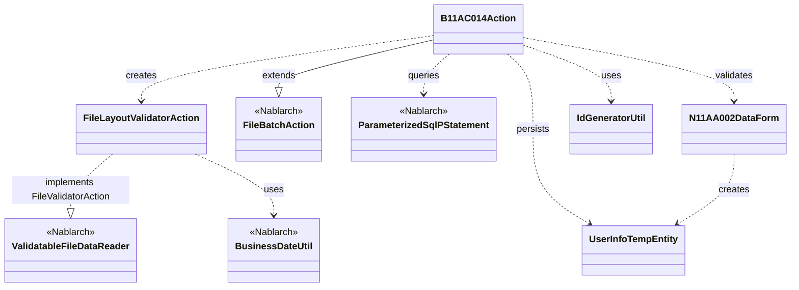
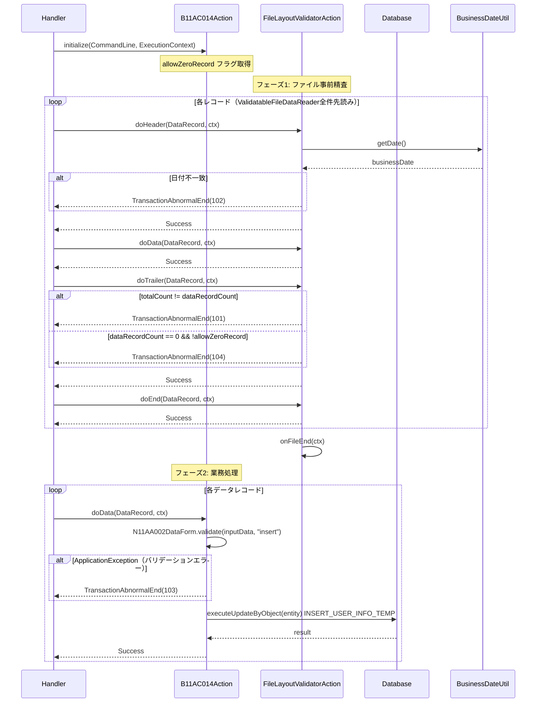

# Code Analysis: B11AC014Action

**Generated**: 2026-03-31 16:16:33
**Target**: ユーザ情報ファイル取込みバッチアクション
**Modules**: tutorial
**Analysis Duration**: approx. 4m 32s

---

## Overview

`B11AC014Action` は、固定長ファイルからユーザ情報を読み込み、ユーザ情報テンポラリテーブルに登録するファイル入力バッチアクション。Nablarchの `FileBatchAction` を継承し、4種類のレコードタイプ（ヘッダー・データ・トレーラ・エンド）を処理する。

内部クラス `FileLayoutValidatorAction` により、業務処理の前にファイル全体のレイアウト妥当性（レコード順序・総レコード数一致・業務日付チェック）を事前精査する。業務処理では、データレコードごとにバリデーション後、採番したIDを付与してDBに登録する。

---

## Architecture

### Dependency Graph



**Note**: This diagram uses Mermaid `classDiagram` syntax to show class names and their relationships. Use `--|>` for inheritance (extends/implements) and `..>` for dependencies (uses/creates).

### Component Summary

| Component | Role | Type | Dependencies |
|-----------|------|------|--------------|
| B11AC014Action | ユーザ情報ファイル読込みバッチの主処理 | Action | FileBatchAction, N11AA002DataForm, UserInfoTempEntity, IdGeneratorUtil |
| FileLayoutValidatorAction | ファイルレイアウト事前精査（内部クラス） | Validator | BusinessDateUtil, ValidatableFileDataReader.FileValidatorAction |
| N11AA002DataForm | データレコードのバリデーションフォーム | Form | UserInfoTempEntity, ValidationUtil |
| UserInfoTempEntity | ユーザ情報テンポラリエンティティ | Entity | なし |
| IdGeneratorUtil | ユーザ情報ID採番ユーティリティ | Utility | IdGenerator, SystemRepository |

---

## Flow

### Processing Flow

バッチ処理は2フェーズで実行される。

**フェーズ1: ファイル事前精査（FileLayoutValidatorAction）**

`ValidatableFileDataReader` がファイルを全件先読みし、`FileLayoutValidatorAction` でレイアウト妥当性を検証する。

1. `doHeader()`: ヘッダーが1レコード目であること、かつファイル日付が業務日付と一致することを確認
2. `doData()`: 前レコードがヘッダーまたはデータであることを確認し、データ件数をカウント
3. `doTrailer()`: 前レコードがデータ（またはヘッダー＝0件許容時）であること、総レコード数がデータ件数と一致すること、`allowZeroRecord=false` 時は0件エラーを確認
4. `doEnd()`: 前レコードがトレーラであることを確認
5. `onFileEnd()`: 最終レコードがエンドレコードであることを確認し、処理件数をログ出力

**フェーズ2: 業務処理（B11AC014Action）**

事前精査完了後、レコードごとに業務処理を実行する。

1. `initialize()`: コマンドライン引数から `allowZeroRecord` フラグを取得
2. `doHeader()`: ヘッダーは精査済みのため `Success` のみ返す
3. `doData()`: `N11AA002DataForm.validate()` でバリデーション → `IdGeneratorUtil.generateUserInfoId()` でID採番 → `getParameterizedSqlStatement("INSERT_USER_INFO_TEMP").executeUpdateByObject(entity)` でDB登録
4. `doTrailer()`: トレーラーは精査済みのため `Success` のみ返す
5. `doEnd()`: エンドレコードは精査済みのため `Success` のみ返す

### Sequence Diagram



---

## Components

### B11AC014Action

**ファイル**: [B11AC014Action.java](../../.lw/nab-official/v1.4/tutorial/tutorial/main/java/please/change/me/tutorial/ss11AC/B11AC014Action.java)

**役割**: ユーザ情報ファイルを読み込み、データレコードをバリデーションしてユーザ情報テンポラリテーブルに登録するバッチアクション

**主要メソッド**:
- `initialize()` (L41-43): コマンドライン引数 `allowZeroRecord` を取得し、フィールドに格納
- `doData()` (L67-86): データレコードのバリデーション、ID採番、DB登録を実行。バリデーション失敗時は `TransactionAbnormalEnd(103)` をスロー
- `getValidatorAction()` (L130-132): `FileLayoutValidatorAction` インスタンスを返し、事前精査を有効化
- `getDataFileName()` / `getFormatFileName()` (L120-127): ファイルID `N11AA002` を返す

**依存コンポーネント**: FileBatchAction, N11AA002DataForm, UserInfoTempEntity, IdGeneratorUtil, ParameterizedSqlPStatement

---

### FileLayoutValidatorAction（内部クラス）

**ファイル**: [B11AC014Action.java](../../.lw/nab-official/v1.4/tutorial/tutorial/main/java/please/change/me/tutorial/ss11AC/B11AC014Action.java) (L152-310)

**役割**: ファイル全体のレイアウト妥当性を事前精査する内部クラス。レコード順序・件数・業務日付を検証

**主要メソッド**:
- `doHeader()` (L193-211): 前レコードnull確認（1レコード目チェック）、業務日付との一致確認
- `doTrailer()` (L248-272): 総レコード数一致チェック、0件許容チェック
- `onFileEnd()` (L298-307): 最終レコードがエンドレコードであることを確認、処理件数をログ出力

**依存コンポーネント**: BusinessDateUtil, ValidatableFileDataReader.FileValidatorAction

---

### N11AA002DataForm

**ファイル**: [N11AA002DataForm.java](../../.lw/nab-official/v1.4/tutorial/tutorial/main/java/please/change/me/tutorial/ss11AC/N11AA002DataForm.java)

**役割**: ユーザ情報ファイルのデータレコードのバリデーションフォーム。`ValidationUtil` によるバリデーション実行と `UserInfoTempEntity` への変換を担当

**主要メソッド**:
- `validate()` (L44-48): `ValidationUtil.validateAndConvertRequest()` でバリデーション実行。エラー時は `abortIfInvalid()` で `ApplicationException` をスロー
- `validateForRegister()` (L55-76): `insert` バリデーション定義。各フィールドの単項目精査と携帯電話番号の項目間精査
- `getUserInfoTempEntity()` (L33-35): フォームデータから `UserInfoTempEntity` を生成

**依存コンポーネント**: UserInfoTempEntity, ValidationUtil, N11AA002DataFormBase

---

### UserInfoTempEntity

**ファイル**: [UserInfoTempEntity.java](../../.lw/nab-official/v1.4/tutorial/tutorial/main/java/please/change/me/tutorial/ss11/entity/UserInfoTempEntity.java)

**役割**: ユーザ情報テンポラリテーブルのエンティティ。バリデーションアノテーションを持つデータオブジェクト

**主要フィールド**: `userInfoId`, `loginId`, `kanjiName`, `kanaName`, `mailAddress`, `extensionNumber*`, `mobilePhoneNumber*`、各種自動セット項目（`@UserId`, `@CurrentDateTime`, `@RequestId`）

---

### IdGeneratorUtil

**ファイル**: [IdGeneratorUtil.java](../../.lw/nab-official/v1.4/tutorial/tutorial/main/java/please/change/me/tutorial/util/IdGeneratorUtil.java)

**役割**: オラクルシーケンスを使用したID採番ユーティリティ

**主要メソッド**:
- `generateUserInfoId()` (L38-41): シーケンス `1102` で20桁左0パディングのユーザ情報IDを採番

---

## Nablarch Framework Usage

### FileBatchAction

**クラス**: `nablarch.fw.action.FileBatchAction`

**説明**: ファイルを入力とするバッチ業務アクションハンドラのテンプレートクラス。レコードタイプに応じたディスパッチメソッド（`do[レコード種別名]()`）を実装することでファイル入力バッチを構築できる。

**使用方法**:
```java
public class B11AC014Action extends FileBatchAction {

    @Override
    public String getDataFileName() { return "N11AA002"; }

    @Override
    public String getFormatFileName() { return "N11AA002"; }

    public Result doHeader(DataRecord inputData, ExecutionContext ctx) { return new Success(); }
    public Result doData(DataRecord inputData, ExecutionContext ctx) { /* 業務処理 */ return new Success(); }
    public Result doTrailer(DataRecord inputData, ExecutionContext ctx) { return new Success(); }
    public Result doEnd(DataRecord inputData, ExecutionContext ctx) { return new Success(); }
}
```

**重要ポイント**:
- ✅ **`getDataFileName()` と `getFormatFileName()` は必須実装**: フレームワークが `FileDataReader` を生成する際に使用する
- ✅ **`do[レコード種別名]()` は必須実装**: 各レコードタイプに対応するメソッドが未定義の場合、`Result.NotFound`（ステータスコード404）でエラー終了する
- 💡 **`createReader` / `handle` は実装不要**: スーパークラスに実装済み。`do[レコード種別名]` に業務処理を集中できる
- ⚠️ **ディスパッチ名とレコードタイプの一致**: フォーマット定義ファイルの `[header]`/`[data]`/`[trailer]`/`[end]` 名と `doHeader`/`doData`/`doTrailer`/`doEnd` が対応する

**このコードでの使い方**:
- `B11AC014Action` が `FileBatchAction` を継承し、4メソッドを実装
- `initialize()` でコマンドライン引数取得
- `getValidatorAction()` で事前精査クラスを返却（任意のオーバーライド）

**詳細**: [Handlers FileBatchAction](../../.claude/skills/nabledge-1.4/docs/component/handlers/handlers-FileBatchAction.md)

---

### ValidatableFileDataReader / FileValidatorAction

**クラス**: `nablarch.fw.reader.ValidatableFileDataReader` / `nablarch.fw.reader.ValidatableFileDataReader.FileValidatorAction`

**説明**: `FileDataReader` に事前精査機能を追加したデータリーダ。`FileValidatorAction` インタフェースを実装した精査クラスを `getValidatorAction()` で返すことで、業務処理の前にファイル全体を先読みして検証できる。

**使用方法**:
```java
@Override
public ValidatableFileDataReader.FileValidatorAction getValidatorAction() {
    return new FileLayoutValidatorAction();
}

private class FileLayoutValidatorAction implements ValidatableFileDataReader.FileValidatorAction {
    public Result doHeader(DataRecord inputData, ExecutionContext ctx) { /* 精査処理 */ }
    public Result doData(DataRecord inputData, ExecutionContext ctx) { /* 精査処理 */ }
    public Result doTrailer(DataRecord inputData, ExecutionContext ctx) { /* 精査処理 */ }
    public Result doEnd(DataRecord inputData, ExecutionContext ctx) { /* 精査処理 */ }
    public void onFileEnd(ExecutionContext ctx) { /* ファイル終端処理 */ }
}
```

**重要ポイント**:
- ✅ **`onFileEnd()` は必ず実装**: `FileValidatorAction` インタフェースの必須メソッド。ファイル終端で呼ばれ、最終レコードの整合性確認やログ出力に使用する
- ✅ **`FileBatchAction` 継承時は `getValidatorAction()` のオーバーライドのみ**: `ValidatableFileDataReader` 生成はフレームワークが担当。直接インスタンス化は不要
- 💡 **業務処理との完全分離**: 精査ロジックを内部クラスに封じ込めることで、`doData()` 等の業務処理がクリーンになる
- ⚠️ **`useCache` は原則 `false`**: ファイル入力処理がボトルネックになる場合のみキャッシュを検討。通常のバッチ処理では不要

**このコードでの使い方**:
- `FileLayoutValidatorAction` が `ValidatableFileDataReader.FileValidatorAction` を実装
- `doTrailer()` でトレーラのデータ件数一致チェックと0件チェック
- `onFileEnd()` で最終レコードがエンドレコードであることを確認してログを出力

**詳細**: [Readers ValidatableFileDataReader](../../.claude/skills/nabledge-1.4/docs/component/readers/readers-ValidatableFileDataReader.md)

---

### BusinessDateUtil

**クラス**: `nablarch.core.date.BusinessDateUtil`

**説明**: システムに設定された業務日付を取得するユーティリティ。ファイルのヘッダーレコードの日付と業務日付を比較することで、誤ったファイルの入力を防ぐ。

**使用方法**:
```java
String businessDate = BusinessDateUtil.getDate();
if (!businessDate.equals(fileDate)) {
    throw new TransactionAbnormalEnd(102, "NB11AA0104", fileDate, businessDate);
}
```

**重要ポイント**:
- ✅ **システム設定の業務日付を取得**: `getDate()` はデフォルト区分の業務日付を返す
- 💡 **ファイル整合性チェックに活用**: ヘッダーレコードの日付と比較して誤ファイル投入を検知

**このコードでの使い方**:
- `FileLayoutValidatorAction.doHeader()` (L202-208) でヘッダーレコードの `date` フィールドと業務日付を比較

---

### ParameterizedSqlPStatement

**クラス**: `nablarch.core.db.statement.ParameterizedSqlPStatement`

**説明**: SQL定義ファイルのSQL文をJava Beansのプロパティを使ってパラメータバインドし実行するステートメント。`FileBatchAction` のスーパークラスが提供する `getParameterizedSqlStatement()` メソッドで取得する。

**使用方法**:
```java
ParameterizedSqlPStatement statement = getParameterizedSqlStatement("INSERT_USER_INFO_TEMP");
statement.executeUpdateByObject(entity);
```

**重要ポイント**:
- ✅ **SQL IDはSQL定義ファイルで管理**: `getParameterizedSqlStatement("SQL_ID")` でアクション固有のSQLを取得
- 💡 **`executeUpdateByObject()` でエンティティのプロパティが自動バインド**: フィールド名とSQL変数名を一致させることで型変換不要

**このコードでの使い方**:
- `doData()` (L81-83) で `INSERT_USER_INFO_TEMP` SQL IDを使ってユーザ情報テンポラリテーブルに登録

---

## References

### Source Files

- [B11AC014Action.java](../../.lw/nab-official/v1.4/tutorial/tutorial/main/java/please/change/me/tutorial/ss11AC/B11AC014Action.java) - B11AC014Action
- [N11AA002DataForm.java](../../.lw/nab-official/v1.4/tutorial/tutorial/main/java/please/change/me/tutorial/ss11AC/N11AA002DataForm.java) - N11AA002DataForm
- [UserInfoTempEntity.java](../../.lw/nab-official/v1.4/tutorial/tutorial/main/java/please/change/me/tutorial/ss11/entity/UserInfoTempEntity.java) - UserInfoTempEntity
- [IdGeneratorUtil.java](../../.lw/nab-official/v1.4/tutorial/tutorial/main/java/please/change/me/tutorial/util/IdGeneratorUtil.java) - IdGeneratorUtil

### Knowledge Base (Nabledge-1.4)

- [Handlers FileBatchAction](../../.claude/skills/nabledge-1.4/docs/component/handlers/handlers-FileBatchAction.md)
- [Readers ValidatableFileDataReader](../../.claude/skills/nabledge-1.4/docs/component/readers/readers-ValidatableFileDataReader.md)
- [Nablarch Batch File Input Batch](../../.claude/skills/nabledge-1.4/docs/guide/nablarch-batch/nablarch-batch-04_fileInputBatch.md)
- [Nablarch Batch Basic](../../.claude/skills/nabledge-1.4/docs/guide/nablarch-batch/nablarch-batch-02_basic.md)

### Official Documentation

(No official documentation links available)

---

**Output**: `.nabledge/20260331/code-analysis-B11AC014Action.md`

**Note**: This documentation was generated by the code-analysis workflow of the nabledge-1.4 skill.
