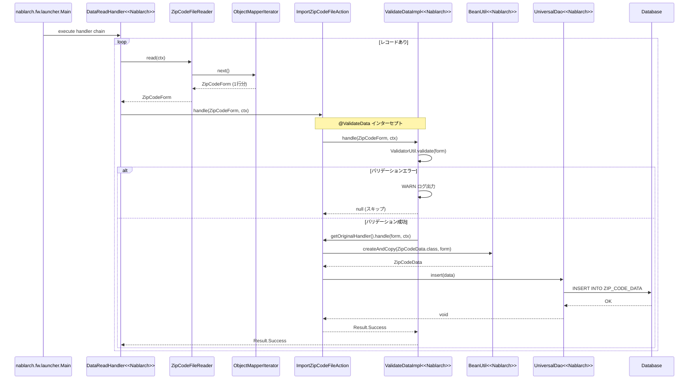

# Code Analysis: ImportZipCodeFileAction

**Generated**: 2026-03-13 20:59:11
**Target**: 住所CSVファイルをDBに登録するバッチアクション
**Modules**: nablarch-example-batch
**Analysis Duration**: approx. 4m 0s

---

## Overview

`ImportZipCodeFileAction` は住所CSVファイルを読み込み、1行ずつDBに登録するNablarchバッチアクションクラスである。`BatchAction<ZipCodeForm>` を継承し、`DataReader`（`ZipCodeFileReader`）から渡された住所データをBean Validationで検証した後、`UniversalDao.insert()` でDBに永続化する。バリデーション処理は `@ValidateData` インターセプタに委譲することで、アクション本体をDB登録ロジックのみに集中させている。CSVバインディングには `@Csv`/`@CsvFormat` アノテーションを使用し、データバインド機能（`ObjectMapper`）でCSVを `ZipCodeForm` に自動変換する。

---

## Architecture

### Dependency Graph

```mermaid
classDiagram
    class ImportZipCodeFileAction {
        <<Action>>
    }
    class BatchAction {
        <<Nablarch>>
    }
    class ZipCodeForm {
        <<Form>>
    }
    class ZipCodeFileReader {
        <<DataReader>>
    }
    class ObjectMapperIterator
    class ValidateData {
        <<Interceptor>>
    }
    class ValidateDataImpl {
        <<Nablarch>>
    }
    class ZipCodeData {
        <<Entity>>
    }
    class UniversalDao {
        <<Nablarch>>
    }
    class BeanUtil {
        <<Nablarch>>
    }
    class ObjectMapper {
        <<Nablarch>>
    }
    class ObjectMapperFactory {
        <<Nablarch>>
    }
    class FilePathSetting {
        <<Nablarch>>
    }

    ImportZipCodeFileAction --|> BatchAction : extends
    ImportZipCodeFileAction ..> ZipCodeForm : handles
    ImportZipCodeFileAction ..> ZipCodeFileReader : creates
    ImportZipCodeFileAction ..> BeanUtil : copies
    ImportZipCodeFileAction ..> UniversalDao : inserts
    ImportZipCodeFileAction ..> ZipCodeData : persists
    ValidateData ..> ValidateDataImpl : delegates
    ValidateDataImpl ..> ZipCodeForm : validates
    ZipCodeFileReader ..> ObjectMapperIterator : uses
    ObjectMapperIterator ..> ObjectMapper : wraps
    ZipCodeFileReader ..> ObjectMapperFactory : creates
    ZipCodeFileReader ..> FilePathSetting : resolves
```

### Component Summary

| Component | Role | Type | Dependencies |
|-----------|------|------|--------------|
| ImportZipCodeFileAction | 住所CSVファイルのDB登録バッチアクション | Action | ZipCodeFileReader, BeanUtil, UniversalDao, ZipCodeData |
| ZipCodeForm | CSVデータのバインド・バリデーション用フォーム | Form | なし（アノテーション定義のみ） |
| ZipCodeFileReader | CSVファイルを1行ずつ読み込むデータリーダ | DataReader | ObjectMapperIterator, ObjectMapperFactory, FilePathSetting |
| ObjectMapperIterator | ObjectMapperをIteratorラップするヘルパー | Utility | ObjectMapper |
| ValidateData | Bean Validationをインターセプトする共通アノテーション | Interceptor | ValidatorUtil, Interceptor |
| ZipCodeData | 住所情報のJPAエンティティ | Entity | なし |

---

## Flow

### Processing Flow

Nablarchバッチフレームワークがハンドラキューを実行する。`DataReadHandler` が `ZipCodeFileReader.read()` を呼び出し、CSVの1行分を `ZipCodeForm` として取得し `ImportZipCodeFileAction.handle()` に渡す。`handle()` メソッドには `@ValidateData` インターセプタが適用されており、`ValidateDataImpl` がBean Validationを実行する。バリデーションエラーの場合はWARNログを出力して処理をスキップし、次のレコードに進む。バリデーション成功時は `BeanUtil.createAndCopy()` で `ZipCodeData` エンティティを生成し、`UniversalDao.insert()` でDBに登録する。`LoopHandler` がデータがなくなるまでこの処理を繰り返し、コミット間隔毎にトランザクションをコミットする。

### Sequence Diagram

---

## Components

### ImportZipCodeFileAction

**ファイル**: ImportZipCodeFileAction.java (v5/nablarch-example-batch/.../batch/action/)

**役割**: 住所CSVファイルをDBに登録するバッチアクションの中核クラス。1レコードの処理単位を担当する。

**主要メソッド**:
- `handle(ZipCodeForm, ExecutionContext)` (L35-41): `@ValidateData` インターセプタを経由してバリデーション済みデータを受け取り、`BeanUtil.createAndCopy()` でエンティティ変換後に `UniversalDao.insert()` でDB登録する
- `createReader(ExecutionContext)` (L50-52): `ZipCodeFileReader` のインスタンスを生成して返す

**実装ポイント**:
- `BatchAction<ZipCodeForm>` を継承することで、フレームワークのバッチ処理ループに組み込まれる
- `@ValidateData` アノテーションでバリデーションロジックをインターセプタに委譲し、ハンドラ本体をDB登録処理に集中させている

---

### ZipCodeForm

**ファイル**: ZipCodeForm.java (v5/nablarch-example-batch/.../batch/form/)

**役割**: CSVの1行分のデータをバインドし、Bean Validationルールを定義するフォームクラス。

**主要定義**:
- クラスレベルの `@Csv`/`@CsvFormat` (L17-23): CSVフォーマットの宣言（フィールド順、区切り文字、文字コード等）
- 各フィールドの `@Domain`/`@Required` (L30-130): ドメインバリデーションと必須チェック
- `getLineNumber()` (L142-145): `@LineNumber` で行番号を取得（バリデーションエラーログ用）

---

### ZipCodeFileReader

**ファイル**: ZipCodeFileReader.java (v5/nablarch-example-batch/.../batch/reader/)

**役割**: CSVファイルを `ObjectMapper` で読み込み、1行ずつ `ZipCodeForm` として提供するデータリーダ。

**主要メソッド**:
- `read(ExecutionContext)` (L40-45): イテレータ未初期化時に `initialize()` を呼び出し、`iterator.next()` で1行分のデータを返す
- `hasNext(ExecutionContext)` (L54-59): イテレータの次レコード有無を確認する
- `close(ExecutionContext)` (L68-70): `ObjectMapper` をクローズしリソースを解放する
- `initialize()` (L78-89): `FilePathSetting` でファイルパスを取得し、`ObjectMapperFactory.create()` で `ObjectMapper` を生成してイテレータを初期化する

---

### ObjectMapperIterator

**ファイル**: ObjectMapperIterator.java (v5/nablarch-example-batch/.../batch/reader/iterator/)

**役割**: `ObjectMapper`（`read()`/`null`終端）を `Iterator`（`hasNext()`/`next()`）インタフェースでラップするユーティリティ。`DataReader` 実装をシンプルにするために使用する。

**主要メソッド**:
- コンストラクタ (L32-37): 初回データを先読みする
- `hasNext()` (L45-47): `form != null` で次レコードの有無を判定
- `next()` (L56-60): 現在の `form` を返しつつ次のデータを先読みする
- `close()` (L66-68): `mapper.close()` でリソースを解放する

---

### ValidateData

**ファイル**: ValidateData.java (v5/nablarch-example-batch/.../batch/interceptor/)

**役割**: `handle()` メソッドをインターセプトし、データレコードに対してBean Validationを実行するカスタムインターセプタ。複数バッチで共通使用できる。

**主要メソッド**:
- `ValidateDataImpl.handle(Object, ExecutionContext)` (L60-92): `ValidatorUtil.getValidator()` でバリデータを取得し、入力データを検証する。エラー時はWARNログを出力して `null` を返す。成功時は `getOriginalHandler().handle()` で元の処理に委譲する

---

## Nablarch Framework Usage

### BatchAction

**クラス**: `nablarch.fw.action.BatchAction`

**説明**: Nablarchバッチフレームワーク用の汎用バッチアクションテンプレートクラス。

**重要ポイント**:
- ✅ **`handle()` は1レコード単位**: フレームワークが `DataReader` から1件ずつ取得したデータを渡す。ループ処理はフレームワーク（`LoopHandler`）が担当
- 💡 **`DataReader` を自作可能**: `FileDataReader`/`ValidatableFileDataReader` は `data_format` 専用のため、`data_bind` を使う場合は `DataReader` を実装する
- ⚠️ **`FileBatchAction` は使わない**: `data_bind`（`ObjectMapper`）を使う場合は `FileBatchAction` ではなく `BatchAction` を継承すること

---

### UniversalDao

**クラス**: `nablarch.common.dao.UniversalDao`

**説明**: JPA 2.0アノテーションを使った簡易O/Rマッパー。SQLを書かずに単純なCRUD操作が可能。

**重要ポイント**:
- ✅ **`@Table`, `@Id`, `@Column` が必要**: エンティティクラスにJPAアノテーションを付与しないとCRUD操作できない
- 💡 **SQLなしでCRUD**: エンティティのJPAアノテーション定義だけでINSERTが実行できる
- ⚠️ **主キー以外の条件更新は不可**: 主キー以外を条件にした更新・削除は `database` 機能を使用すること

**このコードでの使い方**: `handle()` 内で `UniversalDao.insert(data)` を呼び出してエンティティを1件登録（L38）

---

### ObjectMapper / ObjectMapperFactory

**クラス**: `nablarch.common.databind.ObjectMapper`, `nablarch.common.databind.ObjectMapperFactory`

**説明**: CSVやTSV、固定長データをJava Beansオブジェクトとして読み書きする機能。

**重要ポイント**:
- ✅ **必ず `close()` を呼ぶ**: リソースを保持するため、使用後は必ず `close()` を呼び出すこと
- ⚠️ **外部データは全フィールド `String` 型で定義**: 不正値への対応のためにプロパティはすべてString型で定義すること
- 💡 **アノテーション駆動**: `@Csv`/`@CsvFormat` でフォーマットを宣言的に定義でき、設定ファイルが不要
- ⚡ **スレッドアンセーフ**: 複数スレッドで共有しないこと

---

### Bean Validation（@Csv, @CsvFormat, @Domain, @Required, @LineNumber）

**重要ポイント**:
- ✅ **`@Csv` の `properties` 順序がCSV列順**: 順番を間違えると誤ったフィールドにデータがバインドされる
- ✅ **`@Required` は `@Domain` と別**: `@Domain` にはドメインのバリデーションルールのみ定義し、`@Required` は必要なフィールドに個別に設定する
- 💡 **`@LineNumber` でエラー行番号取得**: バリデーションエラー時にCSVの行番号をログ出力できる

---

### ValidatorUtil（インターセプタでの明示的バリデーション）

**クラス**: `nablarch.core.validation.ee.ValidatorUtil`

**重要ポイント**:
- 💡 **インターセプタで共通化**: バリデーションロジックをインターセプタに切り出すことで、複数のバッチアクションで共通使用できる
- ⚠️ **エラー時は `null` を返す**: バリデーションエラーレコードはスキップしてバッチ処理を継続させる設計
- ✅ **行番号のログ出力**: `BeanUtil.getProperty(data, "lineNumber")` で行番号を取得し、エラーメッセージに含める

---

## References

### Source Files
- ImportZipCodeFileAction.java (v5/nablarch-example-batch/.../batch/action/)
- ZipCodeForm.java (v5/nablarch-example-batch/.../batch/form/)
- ZipCodeFileReader.java (v5/nablarch-example-batch/.../batch/reader/)
- ObjectMapperIterator.java (v5/nablarch-example-batch/.../batch/reader/iterator/)
- ValidateData.java (v5/nablarch-example-batch/.../batch/interceptor/)

### Knowledge Base (Nabledge-5)
- Nablarch Batch Getting Started
- Nablarch Batch Architecture
- Libraries Universal_dao
- Libraries Data_bind
- Libraries Bean_validation

### Official Documentation
- [BatchAction](https://nablarch.github.io/docs/LATEST/javadoc/nablarch/fw/action/BatchAction.html)
- [UniversalDao](https://nablarch.github.io/docs/LATEST/javadoc/nablarch/common/dao/UniversalDao.html)
- [ObjectMapper](https://nablarch.github.io/docs/LATEST/javadoc/nablarch/common/databind/ObjectMapper.html)
- [Data Bind](https://nablarch.github.io/docs/LATEST/doc/application_framework/application_framework/libraries/data_io/data_bind.html)
- [Bean Validation](https://nablarch.github.io/docs/LATEST/doc/application_framework/application_framework/libraries/validation/bean_validation.html)
- [Architecture](https://nablarch.github.io/docs/LATEST/doc/application_framework/application_framework/batch/nablarch_batch/architecture.html)