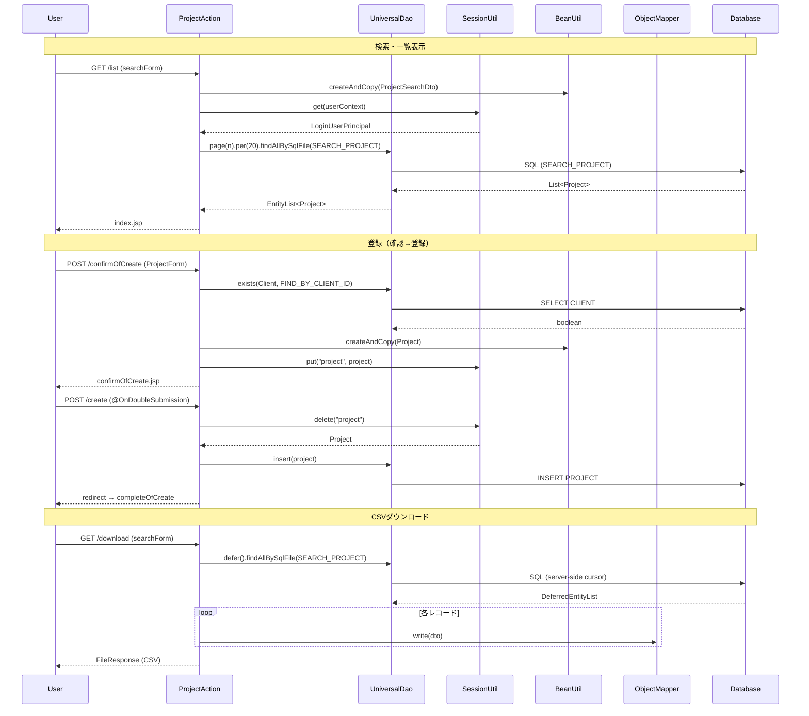

# Code Analysis: ProjectAction

**Generated**: 2026-03-30 18:57:03
**Target**: プロジェクトのCRUD（検索・登録・更新・削除）およびCSVダウンロード機能
**Modules**: nablarch-example-web
**Analysis Duration**: unknown

---

## Overview

`ProjectAction` はNablarch 5 Webアプリケーションにおけるプロジェクト管理機能の中心となるActionクラスです。プロジェクトの検索・一覧表示、新規登録（入力→確認→完了）、更新（編集→確認→完了）、削除、およびCSVダウンロードの各処理フローを担います。

`@InjectForm` によるBean Validationベースのフォームバリデーション、`@OnDoubleSubmission` による二重送信防止、`SessionUtil` を活用したセッションストアによる確認画面連携、および `UniversalDao` によるデータベースアクセスを組み合わせてCRUD操作を実現しています。

---

## Architecture

### Dependency Graph

```mermaid
classDiagram
    class ProjectAction
    class ProjectForm {
        <<Form>>
    }
    class ProjectSearchForm {
        <<Form>>
    }
    class ProjectUpdateForm {
        <<Form>>
    }
    class ProjectTargetForm {
        <<Form>>
    }
    class ProjectDto {
        <<DTO>>
    }
    class ProjectSearchDto {
        <<DTO>>
    }
    class ProjectDownloadDto {
        <<DTO>>
    }
    class Project {
        <<Entity>>
    }
    class Client {
        <<Entity>>
    }
    class LoginUserPrincipal {
        <<Session>>
    }
    class UniversalDao {
        <<Nablarch>>
    }
    class SessionUtil {
        <<Nablarch>>
    }
    class BeanUtil {
        <<Nablarch>>
    }
    class ObjectMapper {
        <<Nablarch>>
    }
    class FileResponse {
        <<Nablarch>>
    }
    class DeferredEntityList {
        <<Nablarch>>
    }
    class TempFileUtil

    ProjectAction ..> ProjectForm : validates
    ProjectAction ..> ProjectSearchForm : validates
    ProjectAction ..> ProjectUpdateForm : validates
    ProjectAction ..> ProjectTargetForm : validates
    ProjectAction ..> ProjectDto : creates
    ProjectAction ..> ProjectSearchDto : creates
    ProjectAction ..> ProjectDownloadDto : creates
    ProjectAction ..> Project : persists
    ProjectAction ..> Client : queries
    ProjectAction ..> LoginUserPrincipal : reads session
    ProjectAction ..> UniversalDao : queries/persists
    ProjectAction ..> SessionUtil : manages session
    ProjectAction ..> BeanUtil : copies beans
    ProjectAction ..> ObjectMapper : serializes CSV
    ProjectAction ..> FileResponse : creates download
    ProjectAction ..> DeferredEntityList : lazy loads
    ProjectAction ..> TempFileUtil : creates temp file
```



**Note**: This diagram uses Mermaid `classDiagram` syntax to show class names and their relationships. Use `--|>` for inheritance (extends/implements) and `..>` for dependencies (uses/creates).

### Component Summary

| Component | Role | Type | Dependencies |
|-----------|------|------|--------------|
| ProjectAction | プロジェクトCRUD・CSVダウンロード処理 | Action | ProjectForm, ProjectSearchForm, ProjectUpdateForm, ProjectTargetForm, UniversalDao, SessionUtil, BeanUtil, ObjectMapper |
| ProjectForm | 新規登録フォーム（バリデーション付き） | Form | DateRangeValidator |
| ProjectSearchForm | 検索条件フォーム | Form | なし |
| ProjectUpdateForm | 更新フォーム | Form | なし |
| ProjectTargetForm | 対象プロジェクトID受付フォーム | Form | なし |
| ProjectDto | プロジェクト表示用DTO | DTO | なし |
| ProjectSearchDto | 検索条件DTO | DTO | なし |
| ProjectDownloadDto | CSVダウンロード用DTO（@Csv付き） | DTO | なし |
| Project | プロジェクトエンティティ | Entity | なし |
| Client | 顧客エンティティ | Entity | なし |
| LoginUserPrincipal | ログインユーザー情報（セッション） | Session | なし |
| TempFileUtil | 一時ファイル作成ユーティリティ | Utility | なし |

---

## Flow

### Processing Flow

**検索・一覧**: `index()` で初期表示、`list()` で検索条件入力後の再検索。`@InjectForm` でフォームバリデーション実施後、`BeanUtil` でフォームを検索DTO に変換し `UniversalDao` でページング検索（20件/ページ）。セッションからログインユーザーIDを取得して必須検索条件として付加する。

**登録フロー**: `newEntity()` → `confirmOfCreate()` → `create()` → `completeOfCreate()` の4ステップ。確認画面への遷移時に `Project` エンティティをセッションに保存。`create()` では `@OnDoubleSubmission` で二重送信防止後、セッションのエンティティを `UniversalDao.insert()` でDB登録してリダイレクト。

**更新フロー**: `edit()` → `confirmOfUpdate()` → `update()` → `completeOfUpdate()` の4ステップ。楽観的ロックのため `edit()` でDB取得したエンティティをセッションに保存し、`update()` でセッションのエンティティを `UniversalDao.update()` で更新（バージョン検証あり）。

**削除フロー**: `delete()` でセッションの `Project` エンティティを取得し `UniversalDao.delete()` で主キー条件削除。`@OnDoubleSubmission` で二重送信防止。

**CSVダウンロード**: `download()` で `UniversalDao.defer()` による遅延ロード（メモリ効率）→ `ObjectMapper` で一時ファイルにCSV書き出し → `FileResponse` でダウンロードレスポンス。

### Sequence Diagram



---

## Components

### ProjectAction

**ファイル**: [ProjectAction.java](../../.lw/nab-official/v5/nablarch-example-web/src/main/java/com/nablarch/example/app/web/action/ProjectAction.java)

**役割**: プロジェクト管理の全HTTPリクエストを処理するActionクラス。検索・登録・更新・削除・CSVダウンロードの各処理フローを実装。

**主要メソッド**:

- `index()` (L153-167): 検索一覧初期表示。デフォルト条件（ID昇順、1ページ目）で `searchProject()` を呼び出す。
- `list()` (L176-187): `@InjectForm(ProjectSearchForm)` でバリデーション後に検索実行。
- `confirmOfCreate()` (L64-92): `@InjectForm(ProjectForm)` でバリデーション、`UniversalDao.exists()` で顧客存在確認、`Project` エンティティをセッションに保存。
- `create()` (L101-108): `@OnDoubleSubmission` で二重送信防止、セッションの `Project` を `UniversalDao.insert()` でDB登録。
- `edit()` (L281-298): `@InjectForm(ProjectTargetForm)` でプロジェクトID受付、`UniversalDao.findBySqlFile()` でデータ取得、楽観的ロック用エンティティをセッション保存。
- `update()` (L371-376): `@OnDoubleSubmission` で二重送信防止、セッションの `Project` を `UniversalDao.update()` でDB更新（楽観的ロック）。
- `delete()` (L397-401): `@OnDoubleSubmission`、セッションの `Project` を `UniversalDao.delete()` で削除。
- `download()` (L217-242): `UniversalDao.defer()` で遅延ロード、`ObjectMapper` でCSV生成、`FileResponse` で返却。
- `searchProject()` (L198-208): 検索共通メソッド。セッションからユーザーIDを取得してページング検索。

**依存**: UniversalDao, SessionUtil, BeanUtil, ObjectMapper, FileResponse, DeferredEntityList, TempFileUtil, ProjectForm, ProjectSearchForm, ProjectUpdateForm, ProjectTargetForm, ProjectDto, ProjectSearchDto, ProjectDownloadDto, Project, Client, LoginUserPrincipal

---

### ProjectForm

**ファイル**: [ProjectForm.java](../../.lw/nab-official/v5/nablarch-example-web/src/main/java/com/nablarch/example/app/web/form/ProjectForm.java)

**役割**: プロジェクト新規登録画面の入力値受付フォーム。`@Required`, `@Domain` によるBean Validationを実装。

**主要メソッド**:
- `isValidProjectPeriod()` (L355-357): `@AssertTrue` による相関バリデーション。開始日・終了日の前後チェック。

**依存**: DateRangeValidator (相関バリデーション)

---

### ProjectSearchForm

**ファイル**: [ProjectSearchForm.java](../../.lw/nab-official/v5/nablarch-example-web/src/main/java/com/nablarch/example/app/web/form/ProjectSearchForm.java)

**役割**: 検索条件フォーム。全プロパティをString型で宣言し `@Domain` でバリデーション。

---

### ProjectDownloadDto

**ファイル**: [ProjectDownloadDto.java](../../.lw/nab-official/v5/nablarch-example-web/src/main/java/com/nablarch/example/app/web/dto/ProjectDownloadDto.java)

**役割**: CSVダウンロード用DTO。`@Csv` でヘッダとプロパティの対応を定義、`@CsvFormat` でShift_JIS/カンマ区切り等のフォーマットを指定。

---

## Nablarch Framework Usage

### UniversalDao

**クラス**: `nablarch.common.dao.UniversalDao`

**説明**: JPA アノテーションを使用してSQLレスでデータベース操作を行うユーティリティクラス。CRUD操作・ページング・遅延ロードを提供する。

**使用方法**:
```java
// 登録
UniversalDao.insert(project);

// 更新（楽観的ロック付き）
UniversalDao.update(targetProject);

// 削除（主キー条件）
UniversalDao.delete(project);

// SQLファイルで検索（ページング）
List<Project> list = UniversalDao.page(1).per(20L)
    .findAllBySqlFile(Project.class, "SEARCH_PROJECT", condition);

// 存在確認
boolean exists = UniversalDao.exists(Client.class, "FIND_BY_CLIENT_ID", new Object[]{id});

// 遅延ロード（大量データ）
try (DeferredEntityList<ProjectDownloadDto> list =
        (DeferredEntityList<ProjectDownloadDto>) UniversalDao.defer()
            .findAllBySqlFile(ProjectDownloadDto.class, "SEARCH_PROJECT", condition)) {
    for (ProjectDownloadDto dto : list) { ... }
}
```

**重要ポイント**:
- ✅ **楽観的ロック**: エンティティに `@Version` アノテーションを付けると更新時に自動でバージョンチェックを行う。不整合時は `OptimisticLockException`。
- ⚠️ **遅延ロード時のclose必須**: `DeferredEntityList` はサーバサイドカーソルを使うため、`try-with-resources` で必ず `close()` すること。
- ⚠️ **遅延ロードとトランザクション**: カーソルオープン中にトランザクション制御を行うとカーソルがクローズされる場合がある。DBベンダのマニュアルを確認すること。
- 💡 **ページングの自動件数取得**: `per().page()` でページング検索すると件数取得SQLが自動発行される。性能劣化時は件数取得SQLをカスタマイズ可能。

**このコードでの使い方**:
- `confirmOfCreate()` / `confirmOfUpdate()` で `exists()` により顧客存在確認 (L70, L313)
- `create()` で `insert(project)` によりDB登録 (L105)
- `edit()` / `show()` で `findBySqlFile()` によりプロジェクト取得 (L258, L289)
- `update()` で `update(targetProject)` によりDB更新 (L373)
- `delete()` で `delete(project)` により主キー削除 (L399)
- `searchProject()` で `page().per().findAllBySqlFile()` によりページング検索 (L204-207)
- `download()` で `defer().findAllBySqlFile()` により遅延ロード (L227-229)

**詳細**: [Libraries Universal_dao](../../.claude/skills/nabledge-5/docs/component/libraries/libraries-universal_dao.md)

---

### SessionUtil

**クラス**: `nablarch.common.web.session.SessionUtil`

**説明**: セッションストアへの安全なオブジェクトの格納・取得・削除を提供するユーティリティクラス。

**使用方法**:
```java
// セッションに保存
SessionUtil.put(context, "project", project);

// セッションから取得
Project project = SessionUtil.get(context, "project");

// セッションから取得して削除
Project project = SessionUtil.delete(context, "project");
```

**重要ポイント**:
- ✅ **フォームはセッションに直接保存しない**: フォームオブジェクトをそのままセッションに格納するのではなく、エンティティ等のBeanに変換してから保存すること。
- 💡 **確認画面パターン**: 入力→確認→完了フローで確認画面に引き渡すデータはセッションに保存し、完了処理時に `delete()` で取り出す（PRGパターン）。
- ⚠️ **セッションキー管理**: キー名の重複を避けるため、機能ごとに固有のキー名を使用すること（例: `"project"`）。

**このコードでの使い方**:
- `newEntity()` でセッション初期化 `delete(context, "project")` (L53)
- `confirmOfCreate()` で `Project` エンティティをセッションへ `put()` (L83)
- `create()` でセッションから `Project` を取り出し削除 `delete()` (L103)
- `edit()` で楽観的ロック用に `BeanUtil.createAndCopy(Project.class, dto)` をセッションへ (L295)
- `update()` / `delete()` でセッションの `Project` を `delete()` で取り出す (L372, L398)

---

### ObjectMapper / ObjectMapperFactory

**クラス**: `nablarch.common.databind.ObjectMapper`, `nablarch.common.databind.ObjectMapperFactory`

**説明**: CSV・TSV・固定長データをJava Beansとして読み書きする機能を提供する。`@Csv` アノテーションを付けたDTOと組み合わせて使用する。

**使用方法**:
```java
try (DeferredEntityList<ProjectDownloadDto> searchList = ...;
     ObjectMapper<ProjectDownloadDto> mapper = ObjectMapperFactory.create(
             ProjectDownloadDto.class, TempFileUtil.newOutputStream(path))) {
    for (ProjectDownloadDto dto : searchList) {
        mapper.write(dto);
    }
}
```

**重要ポイント**:
- ✅ **try-with-resourcesでclose必須**: バッファフラッシュとリソース解放のため `close()` が必要。
- 💡 **アノテーション駆動**: `@Csv(headers={}, properties={})` でヘッダとプロパティの対応を宣言的に定義。`@CsvFormat` でcharset/区切り文字等を指定。
- ⚠️ **大量データ**: メモリ全展開しないため大量データも安全に処理できるが、`DeferredEntityList` と組み合わせて使うこと。

**このコードでの使い方**:
- `download()` でCSVファイルへの書き出しに使用 (L230-235)
- `ObjectMapperFactory.create(ProjectDownloadDto.class, outputStream)` でマッパー生成
- `mapper.write(dto)` で各レコードをCSV行として出力

**詳細**: [Libraries Data_bind](../../.claude/skills/nabledge-5/docs/component/libraries/libraries-data_bind.md)

---

### FileResponse

**クラス**: `nablarch.common.web.download.FileResponse`

**説明**: ファイルダウンロードレスポンスを生成するクラス。一時ファイルと組み合わせてCSV等をダウンロードさせる。

**使用方法**:
```java
FileResponse response = new FileResponse(path.toFile(), true); // true=リクエスト終了後に自動削除
response.setContentType("text/csv; charset=Shift_JIS");
response.setContentDisposition("プロジェクト一覧.csv");
return response;
```

**重要ポイント**:
- ✅ **コンストラクタ第2引数にtrueを渡す**: リクエスト処理終了後に一時ファイルを自動削除するため、必ず `true` を指定する。
- ✅ **Content-Type設定必須**: 文字コードを含めて `setContentType()` で指定する（例: `"text/csv; charset=Shift_JIS"`）。
- ✅ **Content-Disposition設定**: ファイル名を `setContentDisposition()` で指定する。日本語ファイル名も使用可能。

**このコードでの使い方**:
- `download()` でCSVダウンロードレスポンスとして返却 (L238-242)

**詳細**: [Libraries Data_bind](../../.claude/skills/nabledge-5/docs/component/libraries/libraries-data_bind.md)

---

### BeanUtil

**クラス**: `nablarch.core.beans.BeanUtil`

**説明**: JavaBeansの変換・コピーユーティリティ。フォーム→エンティティ→DTOの変換に使用する。

**使用方法**:
```java
// 新規オブジェクト生成と同名プロパティのコピー
Project project = BeanUtil.createAndCopy(Project.class, form);

// 既存オブジェクトへのコピー（同名プロパティを上書き）
BeanUtil.copy(form, project);
```

**重要ポイント**:
- 💡 **プロパティ名一致が前提**: コピー元とコピー先のプロパティ名が一致する項目のみコピーされる。型互換がある場合は型変換も自動実施。
- ⚠️ **型変換の制限**: 複雑な型変換（String→Date等）は変換ルール設定が必要な場合がある。

**このコードでの使い方**:
- `confirmOfCreate()` でフォーム→Projectエンティティ変換 `createAndCopy(Project.class, form)` (L80)
- `backToNew()` / `backToEdit()` でProject→ProjectDto変換 (L130, L348)
- `confirmOfUpdate()` でフォームの内容をセッションのプロジェクトエンティティにマージ `copy(form, project)` (L323)

---

## References

### Source Files

- [ProjectAction.java (.lw/nab-official/v5/nablarch-example-rest/src/main/java/com/nablarch/example/action)](../../.lw/nab-official/v5/nablarch-example-rest/src/main/java/com/nablarch/example/action/ProjectAction.java) - ProjectAction
- [ProjectAction.java (.lw/nab-official/v5/nablarch-example-web/src/main/java/com/nablarch/example/app/web/action)](../../.lw/nab-official/v5/nablarch-example-web/src/main/java/com/nablarch/example/app/web/action/ProjectAction.java) - ProjectAction
- [ProjectAction.java (.lw/nab-official/v6/nablarch-example-rest/src/main/java/com/nablarch/example/action)](../../.lw/nab-official/v6/nablarch-example-rest/src/main/java/com/nablarch/example/action/ProjectAction.java) - ProjectAction
- [ProjectAction.java (.lw/nab-official/v6/nablarch-example-web/src/main/java/com/nablarch/example/app/web/action)](../../.lw/nab-official/v6/nablarch-example-web/src/main/java/com/nablarch/example/app/web/action/ProjectAction.java) - ProjectAction
- [ProjectForm.java (.lw/nab-official/v5/nablarch-example-rest/src/main/java/com/nablarch/example/form)](../../.lw/nab-official/v5/nablarch-example-rest/src/main/java/com/nablarch/example/form/ProjectForm.java) - ProjectForm
- [ProjectForm.java (.lw/nab-official/v5/nablarch-example-web/src/main/java/com/nablarch/example/app/web/form)](../../.lw/nab-official/v5/nablarch-example-web/src/main/java/com/nablarch/example/app/web/form/ProjectForm.java) - ProjectForm
- [ProjectForm.java (.lw/nab-official/v6/nablarch-example-rest/src/main/java/com/nablarch/example/form)](../../.lw/nab-official/v6/nablarch-example-rest/src/main/java/com/nablarch/example/form/ProjectForm.java) - ProjectForm
- [ProjectForm.java (.lw/nab-official/v6/nablarch-example-web/src/main/java/com/nablarch/example/app/web/form)](../../.lw/nab-official/v6/nablarch-example-web/src/main/java/com/nablarch/example/app/web/form/ProjectForm.java) - ProjectForm
- [ProjectSearchForm.java (.lw/nab-official/v5/nablarch-example-web/src/main/java/com/nablarch/example/app/web/form)](../../.lw/nab-official/v5/nablarch-example-web/src/main/java/com/nablarch/example/app/web/form/ProjectSearchForm.java) - ProjectSearchForm
- [ProjectUpdateForm.java (.lw/nab-official/v5/nablarch-example-web/src/main/java/com/nablarch/example/app/web/form)](../../.lw/nab-official/v5/nablarch-example-web/src/main/java/com/nablarch/example/app/web/form/ProjectUpdateForm.java) - ProjectUpdateForm
- [ProjectTargetForm.java (.lw/nab-official/v5/nablarch-example-web/src/main/java/com/nablarch/example/app/web/form)](../../.lw/nab-official/v5/nablarch-example-web/src/main/java/com/nablarch/example/app/web/form/ProjectTargetForm.java) - ProjectTargetForm

### Knowledge Base (Nabledge-5)

- [Web Application Getting Started Project Search](../../.claude/skills/nabledge-5/docs/processing-pattern/web-application/web-application-getting-started-project-search.md)
- [Web Application Getting Started Project Download](../../.claude/skills/nabledge-5/docs/processing-pattern/web-application/web-application-getting-started-project-download.md)
- [Web Application Getting Started Project Update](../../.claude/skills/nabledge-5/docs/processing-pattern/web-application/web-application-getting-started-project-update.md)
- [Web Application Getting Started Project Delete](../../.claude/skills/nabledge-5/docs/processing-pattern/web-application/web-application-getting-started-project-delete.md)
- [Libraries Data_bind](../../.claude/skills/nabledge-5/docs/component/libraries/libraries-data_bind.md)
- [Libraries Universal_dao](../../.claude/skills/nabledge-5/docs/component/libraries/libraries-universal_dao.md)

### Official Documentation


- [BasicDaoContextFactory](https://nablarch.github.io/docs/LATEST/javadoc/nablarch/common/dao/BasicDaoContextFactory.html)
- [BeanUtil](https://nablarch.github.io/docs/LATEST/javadoc/nablarch/core/beans/BeanUtil.html)
- [ConnectionFactory](https://nablarch.github.io/docs/LATEST/javadoc/nablarch/core/db/connection/ConnectionFactory.html)
- [CsvDataBindConfig](https://nablarch.github.io/docs/LATEST/javadoc/nablarch/common/databind/csv/CsvDataBindConfig.html)
- [CsvFormat](https://nablarch.github.io/docs/LATEST/javadoc/nablarch/common/databind/csv/CsvFormat.html)
- [Csv](https://nablarch.github.io/docs/LATEST/javadoc/nablarch/common/databind/csv/Csv.html)
- [Data Bind](https://nablarch.github.io/docs/LATEST/doc/application_framework/application_framework/libraries/data_io/data_bind.html)
- [DataBindConfig](https://nablarch.github.io/docs/LATEST/javadoc/nablarch/common/databind/DataBindConfig.html)
- [DatabaseMetaDataExtractor](https://nablarch.github.io/docs/LATEST/javadoc/nablarch/common/dao/DatabaseMetaDataExtractor.html)
- [DeferredEntityList](https://nablarch.github.io/docs/LATEST/javadoc/nablarch/common/dao/DeferredEntityList.html)
- [Dialect](https://nablarch.github.io/docs/LATEST/javadoc/nablarch/core/db/dialect/Dialect.html)
- [EntityList](https://nablarch.github.io/docs/LATEST/javadoc/nablarch/common/dao/EntityList.html)
- [Field](https://nablarch.github.io/docs/LATEST/javadoc/nablarch/common/databind/fixedlength/Field.html)
- [FileResponse](https://nablarch.github.io/docs/LATEST/javadoc/nablarch/common/web/download/FileResponse.html)
- [FixedLengthDataBindConfigBuilder](https://nablarch.github.io/docs/LATEST/javadoc/nablarch/common/databind/fixedlength/FixedLengthDataBindConfigBuilder.html)
- [FixedLengthDataBindConfig](https://nablarch.github.io/docs/LATEST/javadoc/nablarch/common/databind/fixedlength/FixedLengthDataBindConfig.html)
- [FixedLength](https://nablarch.github.io/docs/LATEST/javadoc/nablarch/common/databind/fixedlength/FixedLength.html)
- [GenerationType](https://nablarch.github.io/docs/LATEST/javadoc/javax/persistence/GenerationType.html)
- [H2Dialect](https://nablarch.github.io/docs/LATEST/javadoc/nablarch/core/db/dialect/H2Dialect.html)
- [HttpResponse](https://nablarch.github.io/docs/LATEST/javadoc/nablarch/fw/web/HttpResponse.html)
- [Index](https://nablarch.github.io/docs/LATEST/doc/application_framework/application_framework/web/getting_started/project_delete/index.html)
- [Index](https://nablarch.github.io/docs/LATEST/doc/application_framework/application_framework/web/getting_started/project_download/index.html)
- [Index](https://nablarch.github.io/docs/LATEST/doc/application_framework/application_framework/web/getting_started/project_search/index.html)
- [Index](https://nablarch.github.io/docs/LATEST/doc/application_framework/application_framework/web/getting_started/project_update/index.html)
- [InjectForm](https://nablarch.github.io/docs/LATEST/javadoc/nablarch/common/web/interceptor/InjectForm.html)
- [LineNumber](https://nablarch.github.io/docs/LATEST/javadoc/nablarch/common/databind/LineNumber.html)
- [MultiLayout](https://nablarch.github.io/docs/LATEST/javadoc/nablarch/common/databind/fixedlength/MultiLayout.html)
- [NoDataException](https://nablarch.github.io/docs/LATEST/javadoc/nablarch/common/dao/NoDataException.html)
- [ObjectMapperFactory](https://nablarch.github.io/docs/LATEST/javadoc/nablarch/common/databind/ObjectMapperFactory.html)
- [ObjectMapper](https://nablarch.github.io/docs/LATEST/javadoc/nablarch/common/databind/ObjectMapper.html)
- [OnDoubleSubmission](https://nablarch.github.io/docs/LATEST/javadoc/nablarch/common/web/token/OnDoubleSubmission.html)
- [OnError](https://nablarch.github.io/docs/LATEST/javadoc/nablarch/fw/web/interceptor/OnError.html)
- [OptimisticLockException](https://nablarch.github.io/docs/LATEST/javadoc/javax/persistence/OptimisticLockException.html)
- [Pagination](https://nablarch.github.io/docs/LATEST/javadoc/nablarch/common/dao/Pagination.html)
- [PartInfo](https://nablarch.github.io/docs/LATEST/javadoc/nablarch/fw/web/upload/PartInfo.html)
- [RecordIdentifier](https://nablarch.github.io/docs/LATEST/javadoc/nablarch/common/databind/fixedlength/MultiLayoutConfig/RecordIdentifier.html)
- [ResourceLocator](https://nablarch.github.io/docs/LATEST/javadoc/nablarch/fw/web/ResourceLocator.html)
- [SimpleDbTransactionManager](https://nablarch.github.io/docs/LATEST/javadoc/nablarch/core/db/transaction/SimpleDbTransactionManager.html)
- [TransactionFactory](https://nablarch.github.io/docs/LATEST/javadoc/nablarch/core/transaction/TransactionFactory.html)
- [Universal Dao](https://nablarch.github.io/docs/LATEST/doc/application_framework/application_framework/libraries/database/universal_dao.html)
- [UniversalDao.Transaction](https://nablarch.github.io/docs/LATEST/javadoc/nablarch/common/dao/UniversalDao.Transaction.html)
- [UniversalDao](https://nablarch.github.io/docs/LATEST/javadoc/nablarch/common/dao/UniversalDao.html)

---

**Note**: This documentation was generated by the code-analysis workflow of the nabledge-5 skill.
