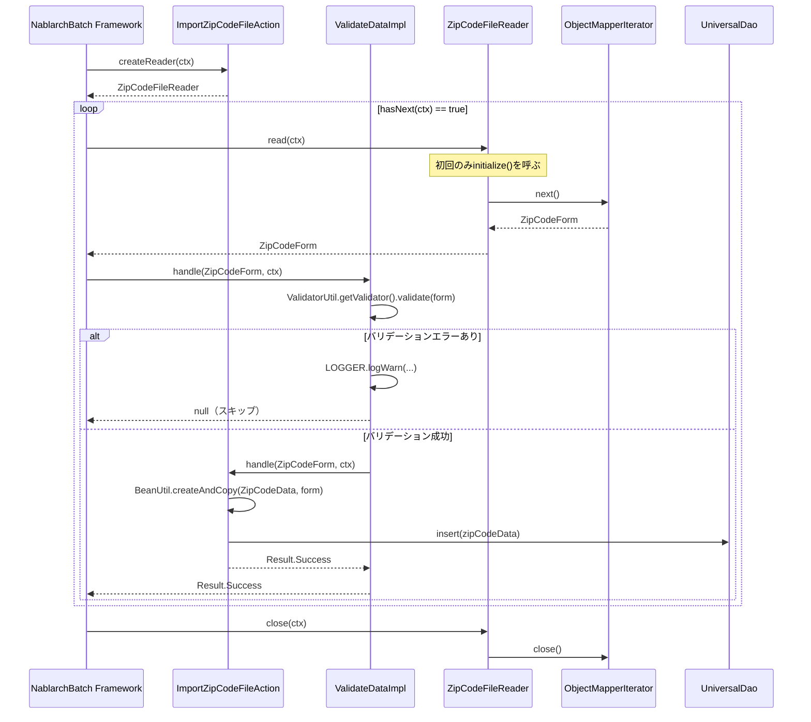

# Code Analysis: ImportZipCodeFileAction

**Generated**: 2026-03-30 19:06:46
**Target**: 住所CSVファイルをDBに登録するバッチアクション
**Modules**: nablarch-example-batch
**Analysis Duration**: unknown

---

## Overview

`ImportZipCodeFileAction` は、住所CSVファイルを1行ずつ読み込み、DB（ZIP_CODE_DATAテーブル）に登録するNablarchバッチアクションである。CSVの読み込みには `ZipCodeFileReader`（`DataReader` 実装）を使用し、`ZipCodeForm` にバインドされたデータを `BeanUtil.createAndCopy` で `ZipCodeData` エンティティに変換して `UniversalDao.insert` で登録する。バリデーションは `@ValidateData` インターセプタにより `handle()` 呼び出し前に自動実行され、エラー行はWARNログ出力後スキップされる。

---

## Architecture

### Dependency Graph

```mermaid
classDiagram
    class ImportZipCodeFileAction {
        <<Action>>
    }
    class ZipCodeForm {
        <<Form>>
    }
    class ZipCodeFileReader {
        <<DataReader>>
    }
    class ObjectMapperIterator
    class ValidateData {
        <<Interceptor>>
    }
    class ValidateDataImpl
    class BatchAction {
        <<Nablarch>>
    }
    class UniversalDao {
        <<Nablarch>>
    }
    class BeanUtil {
        <<Nablarch>>
    }
    class ObjectMapperFactory {
        <<Nablarch>>
    }
    class FilePathSetting {
        <<Nablarch>>
    }

    ImportZipCodeFileAction --|> BatchAction : extends
    ImportZipCodeFileAction ..> ZipCodeFileReader : creates
    ImportZipCodeFileAction ..> BeanUtil : copies
    ImportZipCodeFileAction ..> UniversalDao : persists
    ValidateDataImpl --|> Interceptor : extends
    ValidateDataImpl ..> ZipCodeForm : validates
    ZipCodeFileReader ..|> DataReader : implements
    ZipCodeFileReader ..> ZipCodeForm : reads
    ZipCodeFileReader ..> ObjectMapperIterator : delegates to
    ZipCodeFileReader ..> FilePathSetting : resolves path
    ZipCodeFileReader ..> ObjectMapperFactory : creates mapper
    ObjectMapperIterator ..> ZipCodeForm : iterates
```



**Note**: This diagram uses Mermaid `classDiagram` syntax to show class names and their relationships. Use `--|>` for inheritance (extends/implements) and `..>` for dependencies (uses/creates).

### Component Summary

| Component | Role | Type | Dependencies |
|-----------|------|------|--------------|
| ImportZipCodeFileAction | 住所データのDB登録バッチアクション | Action | ZipCodeFileReader, BeanUtil, UniversalDao |
| ZipCodeForm | CSVバインド＆バリデーション用フォーム | Form | Bean Validationアノテーション |
| ZipCodeFileReader | CSVファイルを1行ずつ提供するデータリーダ | DataReader | ObjectMapperIterator, FilePathSetting, ObjectMapperFactory |
| ObjectMapperIterator | ObjectMapperをIteratorインタフェースでラップ | Utility | ObjectMapper（Nablarch） |
| ValidateData / ValidateDataImpl | handleメソッドをインターセプトしBean Validationを実行 | Interceptor | ValidatorUtil（Nablarch） |

---

## Flow

### Processing Flow

Nablarchバッチフレームワークのループ処理により、`ZipCodeFileReader.hasNext()` が `false` を返すまで以下を繰り返す。

1. **初期化**: `createReader()` から `ZipCodeFileReader` を返す。初回 `read()` / `hasNext()` 呼び出し時に `initialize()` が実行され、`FilePathSetting` でファイルパスを解決し `ObjectMapperIterator` を生成する
2. **1行読み込み**: `ZipCodeFileReader.read()` → `ObjectMapperIterator.next()` → `ObjectMapper.read()` の順でCSV1行を `ZipCodeForm` にバインドして返す
3. **バリデーション**: `@ValidateData` インターセプタが `ValidatorUtil.getValidator().validate(form)` を実行
   - エラーあり: WARNログ出力 + `handle()` スキップ（`null` 返却）
   - エラーなし: `handle()` を呼び出す
4. **DB登録**: `BeanUtil.createAndCopy(ZipCodeData.class, inputData)` でエンティティ生成後、`UniversalDao.insert(data)` でDB登録
5. **終了**: ファイル終端で `ZipCodeFileReader.close()` → `ObjectMapperIterator.close()` → `ObjectMapper.close()` の順でリソースを解放

### Sequence Diagram



---

## Components

### ImportZipCodeFileAction

**ファイル**: [ImportZipCodeFileAction.java](../../.lw/nab-official/v5/nablarch-example-batch/src/main/java/com/nablarch/example/app/batch/action/ImportZipCodeFileAction.java)

**役割**: 住所CSVファイルをDBに登録するバッチアクション。`BatchAction<ZipCodeForm>` を継承し、Nablarchバッチフレームワークのエントリポイントとなる。

**主要メソッド**:
- `handle(ZipCodeForm inputData, ExecutionContext ctx)` (L35-41): バリデーション済み1行分のデータをDB登録する。`@ValidateData` インターセプタが先に実行されるため、このメソッドに渡されるデータは常にバリデーション済み。
- `createReader(ExecutionContext ctx)` (L50-52): `ZipCodeFileReader` を生成して返す。フレームワークが呼び出す。

**依存関係**:
- `ZipCodeFileReader`: データリーダ
- `BeanUtil.createAndCopy`: `ZipCodeForm` → `ZipCodeData` 変換
- `UniversalDao.insert`: エンティティのDB登録

---

### ZipCodeForm

**ファイル**: [ZipCodeForm.java](../../.lw/nab-official/v5/nablarch-example-batch/src/main/java/com/nablarch/example/app/batch/form/ZipCodeForm.java)

**役割**: CSVファイルの1行をバインドするフォームクラス。CSVバインディング定義（`@Csv`, `@CsvFormat`）とBean Validationアノテーション（`@Required`, `@Domain`）を持つ。

**主要アノテーション**:
- `@Csv(type = CsvType.CUSTOM, properties = {...})` (L17): 15列のカスタムCSVとしてバインド
- `@CsvFormat(charset = "UTF-8", fieldSeparator = ',', ...)` (L21): CSVフォーマット詳細設定
- `@Required` / `@Domain("...")` (各フィールド): ドメインバリデーション＋必須チェック
- `@LineNumber` (L142): ゲッタに付与することでバリデーションエラー時の行番号を自動設定

---

### ZipCodeFileReader

**ファイル**: [ZipCodeFileReader.java](../../.lw/nab-official/v5/nablarch-example-batch/src/main/java/com/nablarch/example/app/batch/reader/ZipCodeFileReader.java)

**役割**: `DataReader<ZipCodeForm>` を実装し、CSVファイルを1行ずつ読み込んで返すデータリーダ。

**主要メソッド**:
- `read(ExecutionContext ctx)` (L40-45): 未初期化なら `initialize()` を呼び、`iterator.next()` で次行を返す
- `hasNext(ExecutionContext ctx)` (L54-59): `iterator.hasNext()` に委譲
- `close(ExecutionContext ctx)` (L68-70): `iterator.close()` でリソースを解放
- `initialize()` (L78-89): `FilePathSetting` でファイルパスを解決し、`ObjectMapperFactory.create` で `ObjectMapperIterator` を生成

---

### ValidateData / ValidateDataImpl

**ファイル**: [ValidateData.java](../../.lw/nab-official/v5/nablarch-example-batch/src/main/java/com/nablarch/example/app/batch/interceptor/ValidateData.java)

**役割**: `handle()` メソッドに付与するBean Validationインターセプタアノテーション。バリデーションエラー時はWARNログを出力してレコードをスキップし、`handle()` は呼ばれない。

**主要ポイント**:
- バリデーションエラー時は `null` を返してスキップ（例外スローではない）
- エラーメッセージに行番号（`lineNumber` プロパティ）を含める（L74-77）
- バッチ間で共通のバリデーション処理をインターセプタに切り出すパターン

---

### ObjectMapperIterator

**ファイル**: [ObjectMapperIterator.java](../../.lw/nab-official/v5/nablarch-example-batch/src/main/java/com/nablarch/example/app/batch/reader/iterator/ObjectMapperIterator.java)

**役割**: `ObjectMapper` を `Iterator<E>` インタフェースでラップするユーティリティクラス。コンストラクタで初回データを先読みし、`hasNext()` で null チェックを行う。

**主要メソッド**:
- コンストラクタ (L32-37): `mapper.read()` で初回データを先読み
- `hasNext()` (L44-46): `form != null` を返す（null は終端を意味する）
- `next()` (L55-60): 現在のデータを返し、次データを先読み
- `close()` (L65-67): `mapper.close()` でリソース解放

---

## Nablarch Framework Usage

### BatchAction

**クラス**: `nablarch.fw.action.BatchAction`

**説明**: Nablarchバッチ処理の基底クラス。`handle()` と `createReader()` をオーバーライドして業務処理を実装する。

**使用方法**:
```java
public class ImportZipCodeFileAction extends BatchAction<ZipCodeForm> {
    @Override
    public Result handle(ZipCodeForm inputData, ExecutionContext ctx) {
        ZipCodeData data = BeanUtil.createAndCopy(ZipCodeData.class, inputData);
        UniversalDao.insert(data);
        return new Result.Success();
    }

    @Override
    public DataReader<ZipCodeForm> createReader(ExecutionContext ctx) {
        return new ZipCodeFileReader();
    }
}
```

**重要ポイント**:
- ✅ **`createReader()` でデータリーダを返す**: フレームワークが `hasNext()` が `false` になるまで `handle()` を繰り返し呼び出す
- ✅ **`handle()` に1件分の処理のみ実装**: ループはフレームワークが担う
- 💡 **インターセプタで共通処理を分離**: `@ValidateData` のようなインターセプタにより、バリデーションをバッチ間で共通化できる

**このコードでの使い方**:
- `handle()` (L35-41): バリデーション済みZipCodeFormをZipCodeDataにコピーしてDB登録
- `createReader()` (L50-52): ZipCodeFileReaderを返す

**詳細**: [Nablarch Batch Getting Started](../../.claude/skills/nabledge-5/docs/processing-pattern/nablarch-batch/nablarch-batch-getting-started-nablarch-batch.md)

---

### UniversalDao

**クラス**: `nablarch.common.dao.UniversalDao`

**説明**: JPA 2.0アノテーションを使った簡易O/Rマッパー。SQLを記述せずに単純なCRUD操作が実行できる。

**使用方法**:
```java
// 1件登録
UniversalDao.insert(data);

// 一括登録（大量データ時はbatchInsertが高パフォーマンス）
UniversalDao.batchInsert(dataList);
```

**重要ポイント**:
- ✅ **エンティティにJPAアノテーション必須**: `@Table`, `@Column`, `@Id` 等を定義する
- ⚠️ **主キー以外の条件で更新・削除不可**: 対応できない場合は `database` 機能を使用する
- 💡 **SQLを書かなくてよい**: 単純なCRUDはコード量が削減できる
- ⚡ **大量登録時は `batchInsert` 推奨**: ラウンドトリップ回数を削減しパフォーマンス向上

**このコードでの使い方**:
- `UniversalDao.insert(data)` (L38): ZipCodeDataエンティティを1件ずつDB登録

**詳細**: [Universal DAO](../../.claude/skills/nabledge-5/docs/component/libraries/libraries-universal_dao.md)

---

### BeanUtil

**クラス**: `nablarch.core.beans.BeanUtil`

**説明**: JavaBeansのプロパティコピーや生成を行うユーティリティ。同名プロパティを自動でコピーする。

**使用方法**:
```java
ZipCodeData data = BeanUtil.createAndCopy(ZipCodeData.class, inputData);
```

**重要ポイント**:
- ✅ **同名プロパティが自動コピー**: フォームとエンティティで同名のプロパティがあれば自動的にコピーされる
- ⚠️ **List型の型パラメータ非対応**: List型を持つBeanでは具象クラスでgetterをオーバーライドすること
- 💡 **フォーム→エンティティ変換に最適**: バリデーション済みフォームをエンティティに変換する定型パターン

**このコードでの使い方**:
- `BeanUtil.createAndCopy(ZipCodeData.class, inputData)` (L37): ZipCodeFormからZipCodeDataを生成・コピー

**詳細**: [Bean Util](../../.claude/skills/nabledge-5/docs/component/libraries/libraries-bean_util.md)

---

### ObjectMapper / ObjectMapperFactory（データバインド）

**クラス**: `nablarch.common.databind.ObjectMapper`, `nablarch.common.databind.ObjectMapperFactory`

**説明**: CSVやTSV、固定長データをJava Beansとして読み書きする機能。`@Csv`, `@CsvFormat` アノテーションでバインディング設定を宣言的に定義する。

**使用方法**:
```java
ObjectMapper<ZipCodeForm> mapper = ObjectMapperFactory.create(
    ZipCodeForm.class, new FileInputStream(zipCodeFile));
ZipCodeForm form = mapper.read(); // 1行読み込み（nullで終端）
mapper.close();
```

**重要ポイント**:
- ✅ **必ず `close()` を呼ぶ**: ファイルストリームを解放する（`ObjectMapperIterator.close()` 経由で実施）
- ✅ **`read()` が null を返したら終端**: ループの終了条件として使う
- ⚠️ **スレッドアンセーフ**: 複数スレッドで共有する場合は同期処理が必要
- 💡 **アノテーション駆動**: フォームクラスの `@Csv`, `@CsvFormat` でフォーマットを宣言的に設定できる

**このコードでの使い方**:
- `ZipCodeFileReader.initialize()` (L84): `ObjectMapperFactory.create()` でZipCodeForm用マッパを生成
- `ObjectMapperIterator` がマッパをラップし、`read()` / `close()` を管理

**詳細**: [データバインド](../../.claude/skills/nabledge-5/docs/component/libraries/libraries-data_bind.md)

---

### FilePathSetting

**クラス**: `nablarch.core.util.FilePathSetting`

**説明**: ファイルパスを論理名で管理するNablarchの設定クラス。論理名でファイルを参照することで環境によるパスの違いを吸収する。

**使用方法**:
```java
File file = FilePathSetting.getInstance().getFileWithoutCreate("csv-input", "importZipCode");
```

**重要ポイント**:
- ✅ **論理名でファイルを指定**: ベースパス（`csv-input`）とファイル名（`importZipCode`）を分離して管理
- ⚠️ **`getFileWithoutCreate` はファイル存在チェックをしない**: ファイルが存在しなくても例外は発生しない（FileInputStreamで発生）
- 💡 **環境依存パスを設定ファイルで管理**: 本番・開発・テスト環境でパスを変更しやすい

**このコードでの使い方**:
- `FilePathSetting.getInstance().getFileWithoutCreate("csv-input", FILE_NAME)` (L80): `importZipCode` ファイルのパスを解決

**詳細**: [File Path Management](../../.claude/skills/nabledge-5/docs/component/libraries/libraries-file_path_management.md)

---

### ValidatorUtil / Bean Validation

**クラス**: `nablarch.core.validation.ee.ValidatorUtil`, `nablarch.core.validation.ee.Required`, `nablarch.core.validation.ee.Domain`

**説明**: Java EE7のBean Validation（JSR349）に準拠したバリデーション機能。`@Required` で必須チェック、`@Domain` でドメイン定義のバリデーションルールを適用する。

**使用方法**:
```java
// フォームにアノテーション付与
@Domain("localGovernmentCode")
@Required
private String localGovernmentCode;

// バリデーション実行（ValidateDataImpl内）
Validator validator = ValidatorUtil.getValidator();
Set<ConstraintViolation<Object>> violations = validator.validate(data);
```

**重要ポイント**:
- ✅ **`@Domain` でバリデーションルールを一元管理**: ドメインごとにルールを定義し、プロパティでは `@Domain("ドメイン名")` のみ指定すれば良い
- ⚠️ **バリデーション実行順序は保証されない**: 相関バリデーション時は未入力状態でも例外が出ないよう実装すること
- 💡 **インターセプタで共通化**: `@ValidateData` のようなインターセプタを作成することでバリデーション処理をバッチ間で再利用できる

**このコードでの使い方**:
- `ZipCodeForm` の各フィールドに `@Required` と `@Domain` を付与（ZipCodeForm.java L30-130）
- `@LineNumber` でバリデーションエラー時の行番号をログ出力に活用（L142）
- `ValidateDataImpl.handle()` 内で `ValidatorUtil.getValidator()` を使用してバリデーション実行（L63）

**詳細**: [Bean Validation](../../.claude/skills/nabledge-5/docs/component/libraries/libraries-bean_validation.md)

---

## References

### Source Files

- [ImportZipCodeFileAction.java (.lw/nab-official/v5/nablarch-example-batch/src/main/java/com/nablarch/example/app/batch/action)](../../.lw/nab-official/v5/nablarch-example-batch/src/main/java/com/nablarch/example/app/batch/action/ImportZipCodeFileAction.java) - ImportZipCodeFileAction
- [ImportZipCodeFileAction.java (.lw/nab-official/v6/nablarch-example-batch/src/main/java/com/nablarch/example/app/batch/action)](../../.lw/nab-official/v6/nablarch-example-batch/src/main/java/com/nablarch/example/app/batch/action/ImportZipCodeFileAction.java) - ImportZipCodeFileAction
- [ZipCodeForm.java (.lw/nab-official/v5/nablarch-example-batch/src/main/java/com/nablarch/example/app/batch/form)](../../.lw/nab-official/v5/nablarch-example-batch/src/main/java/com/nablarch/example/app/batch/form/ZipCodeForm.java) - ZipCodeForm
- [ZipCodeForm.java (.lw/nab-official/v6/nablarch-example-batch/src/main/java/com/nablarch/example/app/batch/form)](../../.lw/nab-official/v6/nablarch-example-batch/src/main/java/com/nablarch/example/app/batch/form/ZipCodeForm.java) - ZipCodeForm
- [ZipCodeFileReader.java (.lw/nab-official/v5/nablarch-example-batch/src/main/java/com/nablarch/example/app/batch/reader)](../../.lw/nab-official/v5/nablarch-example-batch/src/main/java/com/nablarch/example/app/batch/reader/ZipCodeFileReader.java) - ZipCodeFileReader
- [ZipCodeFileReader.java (.lw/nab-official/v6/nablarch-example-batch/src/main/java/com/nablarch/example/app/batch/reader)](../../.lw/nab-official/v6/nablarch-example-batch/src/main/java/com/nablarch/example/app/batch/reader/ZipCodeFileReader.java) - ZipCodeFileReader
- [ObjectMapperIterator.java (.lw/nab-official/v5/nablarch-example-batch/src/main/java/com/nablarch/example/app/batch/reader/iterator)](../../.lw/nab-official/v5/nablarch-example-batch/src/main/java/com/nablarch/example/app/batch/reader/iterator/ObjectMapperIterator.java) - ObjectMapperIterator
- [ObjectMapperIterator.java (.lw/nab-official/v6/nablarch-example-batch/src/main/java/com/nablarch/example/app/batch/reader/iterator)](../../.lw/nab-official/v6/nablarch-example-batch/src/main/java/com/nablarch/example/app/batch/reader/iterator/ObjectMapperIterator.java) - ObjectMapperIterator
- [ValidateData.java (.lw/nab-official/v5/nablarch-example-batch/src/main/java/com/nablarch/example/app/batch/interceptor)](../../.lw/nab-official/v5/nablarch-example-batch/src/main/java/com/nablarch/example/app/batch/interceptor/ValidateData.java) - ValidateData
- [ValidateData.java (.lw/nab-official/v6/nablarch-example-batch/src/main/java/com/nablarch/example/app/batch/interceptor)](../../.lw/nab-official/v6/nablarch-example-batch/src/main/java/com/nablarch/example/app/batch/interceptor/ValidateData.java) - ValidateData

### Knowledge Base (Nabledge-5)

- [Nablarch Batch Getting Started Nablarch Batch](../../.claude/skills/nabledge-5/docs/processing-pattern/nablarch-batch/nablarch-batch-getting-started-nablarch-batch.md)
- [Libraries Data_bind](../../.claude/skills/nabledge-5/docs/component/libraries/libraries-data_bind.md)
- [Libraries Universal_dao](../../.claude/skills/nabledge-5/docs/component/libraries/libraries-universal_dao.md)
- [Libraries Bean_util](../../.claude/skills/nabledge-5/docs/component/libraries/libraries-bean_util.md)
- [Libraries File_path_management](../../.claude/skills/nabledge-5/docs/component/libraries/libraries-file_path_management.md)
- [Libraries Bean_validation](../../.claude/skills/nabledge-5/docs/component/libraries/libraries-bean_validation.md)

### Official Documentation

- [ApplicationException](https://nablarch.github.io/docs/LATEST/javadoc/nablarch/core/message/ApplicationException.html)
- [AssertTrue](https://nablarch.github.io/docs/LATEST/javadoc/javax/validation/constraints/AssertTrue.html)
- [BasicConversionManager](https://nablarch.github.io/docs/LATEST/javadoc/nablarch/core/beans/BasicConversionManager.html)
- [BasicDaoContextFactory](https://nablarch.github.io/docs/LATEST/javadoc/nablarch/common/dao/BasicDaoContextFactory.html)
- [BatchAction](https://nablarch.github.io/docs/LATEST/javadoc/nablarch/fw/action/BatchAction.html)
- [Bean Util](https://nablarch.github.io/docs/LATEST/doc/application_framework/application_framework/libraries/bean_util.html)
- [Bean Validation](https://nablarch.github.io/docs/LATEST/doc/application_framework/application_framework/libraries/validation/bean_validation.html)
- [BeanUtil](https://nablarch.github.io/docs/LATEST/javadoc/nablarch/core/beans/BeanUtil.html)
- [BeanValidationStrategy](https://nablarch.github.io/docs/LATEST/javadoc/nablarch/common/web/validator/BeanValidationStrategy.html)
- [CachingCharsetDef](https://nablarch.github.io/docs/LATEST/javadoc/nablarch/core/validation/validator/unicode/CachingCharsetDef.html)
- [CompositeCharsetDef](https://nablarch.github.io/docs/LATEST/javadoc/nablarch/core/validation/validator/unicode/CompositeCharsetDef.html)
- [ConnectionFactory](https://nablarch.github.io/docs/LATEST/javadoc/nablarch/core/db/connection/ConnectionFactory.html)
- [ConversionManager](https://nablarch.github.io/docs/LATEST/javadoc/nablarch/core/beans/ConversionManager.html)
- [Converter](https://nablarch.github.io/docs/LATEST/javadoc/nablarch/core/beans/Converter.html)
- [CopyOption](https://nablarch.github.io/docs/LATEST/javadoc/nablarch/core/beans/CopyOption.html)
- [CopyOptions.Builder](https://nablarch.github.io/docs/LATEST/javadoc/nablarch/core/beans/CopyOptions.Builder.html)
- [CopyOptions](https://nablarch.github.io/docs/LATEST/javadoc/nablarch/core/beans/CopyOptions.html)
- [CsvDataBindConfig](https://nablarch.github.io/docs/LATEST/javadoc/nablarch/common/databind/csv/CsvDataBindConfig.html)
- [CsvFormat](https://nablarch.github.io/docs/LATEST/javadoc/nablarch/common/databind/csv/CsvFormat.html)
- [Csv](https://nablarch.github.io/docs/LATEST/javadoc/nablarch/common/databind/csv/Csv.html)
- [Data Bind](https://nablarch.github.io/docs/LATEST/doc/application_framework/application_framework/libraries/data_io/data_bind.html)
- [DataBindConfig](https://nablarch.github.io/docs/LATEST/javadoc/nablarch/common/databind/DataBindConfig.html)
- [DataReader](https://nablarch.github.io/docs/LATEST/javadoc/nablarch/fw/DataReader.html)
- [DatabaseMetaDataExtractor](https://nablarch.github.io/docs/LATEST/javadoc/nablarch/common/dao/DatabaseMetaDataExtractor.html)
- [DeferredEntityList](https://nablarch.github.io/docs/LATEST/javadoc/nablarch/common/dao/DeferredEntityList.html)
- [Dialect](https://nablarch.github.io/docs/LATEST/javadoc/nablarch/core/db/dialect/Dialect.html)
- [DomainManager](https://nablarch.github.io/docs/LATEST/javadoc/nablarch/core/validation/ee/DomainManager.html)
- [Domain](https://nablarch.github.io/docs/LATEST/javadoc/nablarch/core/validation/ee/Domain.html)
- [EntityList](https://nablarch.github.io/docs/LATEST/javadoc/nablarch/common/dao/EntityList.html)
- [ExtensionConverter](https://nablarch.github.io/docs/LATEST/javadoc/nablarch/core/beans/ExtensionConverter.html)
- [Field](https://nablarch.github.io/docs/LATEST/javadoc/nablarch/common/databind/fixedlength/Field.html)
- [File Path Management](https://nablarch.github.io/docs/LATEST/doc/application_framework/application_framework/libraries/file_path_management.html)
- [FilePathSetting](https://nablarch.github.io/docs/LATEST/javadoc/nablarch/core/util/FilePathSetting.html)
- [FileResponse](https://nablarch.github.io/docs/LATEST/javadoc/nablarch/common/web/download/FileResponse.html)
- [FixedLengthDataBindConfigBuilder](https://nablarch.github.io/docs/LATEST/javadoc/nablarch/common/databind/fixedlength/FixedLengthDataBindConfigBuilder.html)
- [FixedLengthDataBindConfig](https://nablarch.github.io/docs/LATEST/javadoc/nablarch/common/databind/fixedlength/FixedLengthDataBindConfig.html)
- [FixedLength](https://nablarch.github.io/docs/LATEST/javadoc/nablarch/common/databind/fixedlength/FixedLength.html)
- [GenerationType](https://nablarch.github.io/docs/LATEST/javadoc/javax/persistence/GenerationType.html)
- [H2Dialect](https://nablarch.github.io/docs/LATEST/javadoc/nablarch/core/db/dialect/H2Dialect.html)
- [HttpRequest](https://nablarch.github.io/docs/LATEST/javadoc/nablarch/fw/web/HttpRequest.html)
- [Index](https://nablarch.github.io/docs/LATEST/doc/application_framework/application_framework/batch/nablarch_batch/getting_started/nablarch_batch/index.html)
- [ItemNamedConstraintViolationConverterFactory](https://nablarch.github.io/docs/LATEST/javadoc/nablarch/core/validation/ee/ItemNamedConstraintViolationConverterFactory.html)
- [LineNumber](https://nablarch.github.io/docs/LATEST/javadoc/nablarch/common/databind/LineNumber.html)
- [LiteralCharsetDef](https://nablarch.github.io/docs/LATEST/javadoc/nablarch/core/validation/validator/unicode/LiteralCharsetDef.html)
- [MessageInterpolator](https://nablarch.github.io/docs/LATEST/javadoc/javax/validation/MessageInterpolator.html)
- [MultiLayout](https://nablarch.github.io/docs/LATEST/javadoc/nablarch/common/databind/fixedlength/MultiLayout.html)
- [NablarchMessageInterpolator](https://nablarch.github.io/docs/LATEST/javadoc/nablarch/core/validation/ee/NablarchMessageInterpolator.html)
- [ObjectMapperFactory](https://nablarch.github.io/docs/LATEST/javadoc/nablarch/common/databind/ObjectMapperFactory.html)
- [ObjectMapper](https://nablarch.github.io/docs/LATEST/javadoc/nablarch/common/databind/ObjectMapper.html)
- [OnError](https://nablarch.github.io/docs/LATEST/javadoc/nablarch/fw/web/interceptor/OnError.html)
- [OptimisticLockException](https://nablarch.github.io/docs/LATEST/javadoc/javax/persistence/OptimisticLockException.html)
- [Pagination](https://nablarch.github.io/docs/LATEST/javadoc/nablarch/common/dao/Pagination.html)
- [PartInfo](https://nablarch.github.io/docs/LATEST/javadoc/nablarch/fw/web/upload/PartInfo.html)
- [RangedCharsetDef](https://nablarch.github.io/docs/LATEST/javadoc/nablarch/core/validation/validator/unicode/RangedCharsetDef.html)
- [RecordIdentifier](https://nablarch.github.io/docs/LATEST/javadoc/nablarch/common/databind/fixedlength/MultiLayoutConfig/RecordIdentifier.html)
- [Required](https://nablarch.github.io/docs/LATEST/javadoc/nablarch/core/validation/ee/Required.html)
- [SimpleDbTransactionManager](https://nablarch.github.io/docs/LATEST/javadoc/nablarch/core/db/transaction/SimpleDbTransactionManager.html)
- [Size](https://nablarch.github.io/docs/LATEST/javadoc/nablarch/core/validation/ee/Size.html)
- [SystemCharConfig](https://nablarch.github.io/docs/LATEST/javadoc/nablarch/core/validation/ee/SystemCharConfig.html)
- [SystemChar](https://nablarch.github.io/docs/LATEST/javadoc/nablarch/core/validation/ee/SystemChar.html)
- [TransactionFactory](https://nablarch.github.io/docs/LATEST/javadoc/nablarch/core/transaction/TransactionFactory.html)
- [Universal Dao](https://nablarch.github.io/docs/LATEST/doc/application_framework/application_framework/libraries/database/universal_dao.html)
- [UniversalDao.Transaction](https://nablarch.github.io/docs/LATEST/javadoc/nablarch/common/dao/UniversalDao.Transaction.html)
- [UniversalDao](https://nablarch.github.io/docs/LATEST/javadoc/nablarch/common/dao/UniversalDao.html)
- [Valid](https://nablarch.github.io/docs/LATEST/javadoc/javax/validation/Valid.html)
- [ValidationUtil](https://nablarch.github.io/docs/LATEST/javadoc/nablarch/core/validation/ValidationUtil.html)
- [ValidatorUtil](https://nablarch.github.io/docs/LATEST/javadoc/nablarch/core/validation/ee/ValidatorUtil.html)

---

**Note**: This documentation was generated by the code-analysis workflow of the nabledge-5 skill.
