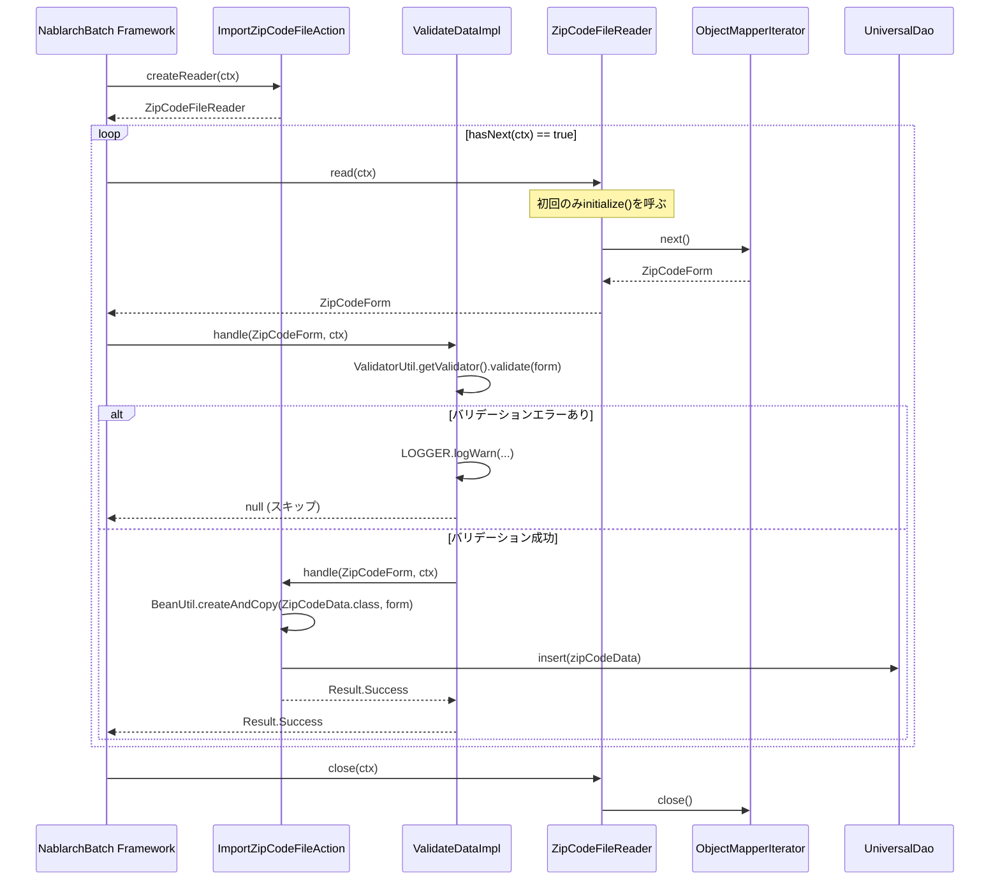

# Code Analysis: ImportZipCodeFileAction

**Generated**: 2026-03-30 19:06:46
**Target**: 住所CSVファイルをDBに登録するバッチアクション
**Modules**: nablarch-example-batch
**Analysis Duration**: approx. 4m 5s

---

## Overview

`ImportZipCodeFileAction` は、住所CSVファイルを1行ずつ読み込み、DB（ZipCodeDataテーブル）に登録するNablarchバッチアクションクラス。

処理は「フォーム（ZipCodeForm）→ データリーダ（ZipCodeFileReader）→ バッチアクション（ImportZipCodeFileAction）」の3コンポーネントで構成される。フォームにはCSVバインディングアノテーション（`@Csv`, `@CsvFormat`）とBean Validationアノテーション（`@Required`, `@Domain`）を付与し、データリーダはObjectMapperを使ってCSVファイルを1行ずつ読み込む。バッチアクションは `@ValidateData` インターセプタによってバリデーション済みのデータを受け取り、`BeanUtil.createAndCopy` でEntityに変換後、`UniversalDao.insert` でDB登録する。

---

## Architecture

### Dependency Graph

```mermaid
classDiagram
    class ImportZipCodeFileAction {
        <<Action>>
    }
    class ZipCodeForm {
        <<Form>>
    }
    class ZipCodeFileReader {
        <<DataReader>>
    }
    class ValidateData {
        <<Interceptor>>
    }
    class ValidateDataImpl {
        <<Interceptor>>
    }
    class ObjectMapperIterator
    class BatchAction {
        <<Nablarch>>
    }
    class DataReader {
        <<Nablarch>>
    }
    class UniversalDao {
        <<Nablarch>>
    }
    class BeanUtil {
        <<Nablarch>>
    }
    class ObjectMapperFactory {
        <<Nablarch>>
    }
    class FilePathSetting {
        <<Nablarch>>
    }
    class ValidatorUtil {
        <<Nablarch>>
    }

    ImportZipCodeFileAction --|> BatchAction : extends
    ImportZipCodeFileAction ..> ZipCodeFileReader : creates
    ImportZipCodeFileAction ..> UniversalDao : inserts
    ImportZipCodeFileAction ..> BeanUtil : copies
    ImportZipCodeFileAction ..> ValidateData : intercepted by
    ZipCodeFileReader ..|> DataReader : implements
    ZipCodeFileReader ..> ZipCodeForm : reads
    ZipCodeFileReader ..> ObjectMapperIterator : delegates to
    ZipCodeFileReader ..> FilePathSetting : resolves path
    ObjectMapperIterator ..> ObjectMapperFactory : wraps
    ValidateDataImpl --|> ValidateData : implements
    ValidateDataImpl ..> ValidatorUtil : validates
```



**Note**: This diagram uses Mermaid `classDiagram` syntax to show class names and their relationships. Use `--|>` for inheritance (extends/implements) and `..>` for dependencies (uses/creates).

### Component Summary

| Component | Role | Type | Dependencies |
|-----------|------|------|--------------|
| ImportZipCodeFileAction | 住所CSVのDB登録バッチアクション | Action | ZipCodeFileReader, UniversalDao, BeanUtil, ValidateData |
| ZipCodeForm | CSVバインディングとバリデーション定義 | Form | なし |
| ZipCodeFileReader | 住所CSVファイルのデータリーダ | DataReader | ObjectMapperIterator, FilePathSetting, ZipCodeForm |
| ValidateData / ValidateDataImpl | handleメソッドのBean Validationインターセプタ | Interceptor | ValidatorUtil |
| ObjectMapperIterator | ObjectMapperをIteratorとして扱うラッパ | Utility | ObjectMapper |

---

## Flow

### Processing Flow

Nablarchバッチフレームワークが `createReader()` でデータリーダを生成し、`hasNext()` が true の間、`read()` で1行分のデータを取得して `handle()` を呼び出す。

1. **データリーダ初期化**: `ZipCodeFileReader` が `FilePathSetting` からCSVファイルパスを解決し、`ObjectMapperFactory.create()` で `ObjectMapperIterator` を生成する
2. **1行読み込み**: `read()` → `ObjectMapperIterator.next()` → `ObjectMapper.read()` でCSV1行を `ZipCodeForm` にバインドして返す
3. **バリデーション**: `@ValidateData` インターセプタが `ValidatorUtil.getValidator()` でBean Validationを実行。エラーがあればWARNログを出力してスキップ（`handle()` は呼ばれない）
4. **DB登録**: バリデーション通過後、`BeanUtil.createAndCopy()` で `ZipCodeForm` → `ZipCodeData` に変換し、`UniversalDao.insert()` でDB登録
5. **終了**: `hasNext()` が false を返したら `close()` でストリームをクローズ

### Sequence Diagram



---

## Components

### ImportZipCodeFileAction

**ファイル**: [ImportZipCodeFileAction.java](../../.lw/nab-official/v5/nablarch-example-batch/src/main/java/com/nablarch/example/app/batch/action/ImportZipCodeFileAction.java)

**役割**: 住所CSVファイルをDBに登録するバッチアクション。`BatchAction<ZipCodeForm>` を継承し、Nablarchバッチフレームワークのエントリポイントとなる。

**キーメソッド**:
- `handle(ZipCodeForm, ExecutionContext)` (L35-41): バリデーション済み1行分のデータをDB登録する。`@ValidateData` インターセプタが先に実行されるため、このメソッドに渡されるデータは常にバリデーション済み。
- `createReader(ExecutionContext)` (L50-52): `ZipCodeFileReader` を生成して返す。フレームワークが呼び出す。

**依存**:
- `ZipCodeFileReader`: データリーダ
- `UniversalDao`: DB登録
- `BeanUtil`: フォームからエンティティへのコピー

---

### ZipCodeForm

**ファイル**: [ZipCodeForm.java](../../.lw/nab-official/v5/nablarch-example-batch/src/main/java/com/nablarch/example/app/batch/form/ZipCodeForm.java)

**役割**: CSVファイルの1行をバインドするフォームクラス。CSVバインディング定義（`@Csv`, `@CsvFormat`）とBean Validationアノテーション（`@Required`, `@Domain`）を持つ。

**キーポイント**:
- `@Csv(type = CsvType.CUSTOM)`: 15プロパティをカスタムCSVとしてバインド
- `@CsvFormat`: UTF-8, カンマ区切り, CRLF改行, ヘッダなし
- `@LineNumber` (L143): ゲッタに付与することで現在の行番号が自動設定される

---

### ZipCodeFileReader

**ファイル**: [ZipCodeFileReader.java](../../.lw/nab-official/v5/nablarch-example-batch/src/main/java/com/nablarch/example/app/batch/reader/ZipCodeFileReader.java)

**役割**: 住所CSVファイルを読み込む `DataReader<ZipCodeForm>` の実装。`ObjectMapperIterator` を使ってCSVを逐次読み込む。

**キーメソッド**:
- `read(ExecutionContext)` (L40-45): 初回呼び出し時に `initialize()` を実行し、以降は `iterator.next()` で1行取得
- `hasNext(ExecutionContext)` (L54-59): `iterator.hasNext()` に委譲
- `close(ExecutionContext)` (L68-70): `iterator.close()` でストリームをクローズ
- `initialize()` (L78-89): `FilePathSetting` でファイルパスを解決し `ObjectMapperIterator` を生成

---

### ValidateData / ValidateDataImpl

**ファイル**: [ValidateData.java](../../.lw/nab-official/v5/nablarch-example-batch/src/main/java/com/nablarch/example/app/batch/interceptor/ValidateData.java)

**役割**: `handle()` メソッドに付与するBean Validationインターセプタアノテーション。バリデーションエラー時はWARNログを出力してレコードをスキップし、`handle()` は呼ばれない。

**キーポイント**:
- バリデーションエラー時は `null` を返してスキップ（例外スローではない）
- エラーメッセージに行番号（`lineNumber` プロパティ）を含める
- バッチ間で共通のバリデーション処理をインターセプタに切り出すパターン

---

### ObjectMapperIterator

**ファイル**: [ObjectMapperIterator.java](../../.lw/nab-official/v5/nablarch-example-batch/src/main/java/com/nablarch/example/app/batch/reader/iterator/ObjectMapperIterator.java)

**役割**: `ObjectMapper` を `Iterator` として扱うラッパクラス。コンストラクタで初回読み込みを行い、`hasNext()` は次の要素が `null` でないかチェックする。

**キーポイント**:
- コンストラクタ内で `mapper.read()` を呼んで初回データをプリフェッチ (L36)
- `close()` で `mapper.close()` を呼ぶ責務を持つ (L66-68)

---

## Nablarch Framework Usage

### BatchAction

**クラス**: `nablarch.fw.action.BatchAction`

**説明**: Nablarchバッチ処理の基底クラス。`handle()` と `createReader()` をオーバーライドして業務処理を実装する。

**使用方法**:
```java
public class ImportZipCodeFileAction extends BatchAction<ZipCodeForm> {
    @Override
    public Result handle(ZipCodeForm inputData, ExecutionContext ctx) {
        // 1行分の業務処理
        return new Result.Success();
    }

    @Override
    public DataReader<ZipCodeForm> createReader(ExecutionContext ctx) {
        return new ZipCodeFileReader();
    }
}
```

**重要ポイント**:
- ✅ **`createReader()` でデータリーダを返す**: フレームワークが呼び出し、返されたリーダから1行ずつ `handle()` を呼ぶ
- ✅ **`handle()` は1レコード分の処理のみ**: ループは不要（フレームワークが `hasNext()` の間繰り返す）
- 💡 **インターセプタ活用**: `@ValidateData` のようなインターセプタで共通処理（バリデーション等）を分離できる

**このコードでの使い方**:
- `handle()` (L35-41): バリデーション済みZipCodeFormをZipCodeDataにコピーしてDB登録
- `createReader()` (L50-52): ZipCodeFileReaderを返す

**詳細**: [Nablarch Batch Getting Started](../../.claude/skills/nabledge-5/docs/processing-pattern/nablarch-batch/nablarch-batch-getting-started-nablarch-batch.md)

---

### UniversalDao

**クラス**: `nablarch.common.dao.UniversalDao`

**説明**: SQLを書かずにエンティティクラスでDB操作（CRUD）を行えるNablarchのDAOユーティリティ。

**使用方法**:
```java
// 1件登録
UniversalDao.insert(zipCodeData);
```

**重要ポイント**:
- ✅ **エンティティクラスのテーブル/カラム定義が必要**: `@Table`, `@Column`, `@Id` などのJPAアノテーションをエンティティに付与する
- ⚠️ **トランザクション管理はフレームワーク**: Nablarchバッチではフレームワークがトランザクションを管理するため、手動でコミットしない
- 💡 **SQLなしでCRUD**: 単純な登録・更新・削除はSQLファイル不要で実装できる

**このコードでの使い方**:
- `UniversalDao.insert(data)` (L38): ZipCodeDataエンティティをDB登録

**詳細**: [Universal DAO](../../.claude/skills/nabledge-5/docs/component/libraries/libraries-universal_dao.md)

---

### BeanUtil

**クラス**: `nablarch.core.beans.BeanUtil`

**説明**: JavaBeansのプロパティコピーや生成を行うユーティリティ。同名プロパティを自動でコピーする。

**使用方法**:
```java
ZipCodeData data = BeanUtil.createAndCopy(ZipCodeData.class, inputData);
```

**重要ポイント**:
- ✅ **同名プロパティが自動コピー**: フォームとエンティティで同名のプロパティがあれば自動的にコピーされる
- ⚠️ **型が一致しない場合はコピーされない**: 型変換が必要な場合は `CopyOptions` で個別設定が必要
- 💡 **フォーム→エンティティ変換に最適**: バリデーション済みフォームをエンティティに変換する定型パターン

**このコードでの使い方**:
- `BeanUtil.createAndCopy(ZipCodeData.class, inputData)` (L37): ZipCodeFormからZipCodeDataを生成・コピー

**詳細**: [Bean Util](../../.claude/skills/nabledge-5/docs/component/libraries/libraries-bean_util.md)

---

### ObjectMapper / ObjectMapperFactory（データバインド）

**クラス**: `nablarch.common.databind.ObjectMapper`, `nablarch.common.databind.ObjectMapperFactory`

**説明**: CSVやTSV、固定長データをJava Beansとして読み書きする機能。`@Csv`, `@CsvFormat` アノテーションでバインディング設定を宣言的に定義する。

**使用方法**:
```java
ObjectMapper<ZipCodeForm> mapper = ObjectMapperFactory.create(
    ZipCodeForm.class, new FileInputStream(zipCodeFile));
ZipCodeForm form = mapper.read(); // 1行読み込み (nullで終端)
mapper.close();
```

**重要ポイント**:
- ✅ **必ず `close()` を呼ぶ**: ファイルストリームを解放する（`ObjectMapperIterator.close()` 経由で実施）
- ✅ **`read()` が null を返したら終端**: ループの終了条件として使う
- 💡 **アノテーション駆動**: フォームクラスの `@Csv`, `@CsvFormat` でフォーマットを宣言的に設定できる
- 💡 **大量データ対応**: ストリーミング処理のため大量データでもメモリを圧迫しない

**このコードでの使い方**:
- `ZipCodeFileReader.initialize()` (L84): `ObjectMapperFactory.create()` でZipCodeForm用マッパを生成
- `ObjectMapperIterator` がマッパをラップし、`read()` / `close()` を管理

**詳細**: [データバインド](../../.claude/skills/nabledge-5/docs/component/libraries/libraries-data_bind.md)

---

### FilePathSetting

**クラス**: `nablarch.core.util.FilePathSetting`

**説明**: ファイルパスを論理名で管理するNablarchの設定クラス。論理名でファイルを参照することで環境によるパスの違いを吸収する。

**使用方法**:
```java
File file = FilePathSetting.getInstance().getFileWithoutCreate("csv-input", "importZipCode");
```

**重要ポイント**:
- ✅ **論理名でファイルを指定**: ベースパス（`csv-input`）とファイル名（`importZipCode`）を分離して管理
- ⚠️ **`getFileWithoutCreate` はファイル存在チェックをしない**: ファイルが存在しなくても例外は発生しない（FileInputStreamで発生）
- 💡 **環境依存パスを設定ファイルで管理**: 本番・開発・テスト環境でパスを変更しやすい

**このコードでの使い方**:
- `FilePathSetting.getInstance().getFileWithoutCreate("csv-input", FILE_NAME)` (L80): `importZipCode` ファイルのパスを解決

**詳細**: [File Path Management](../../.claude/skills/nabledge-5/docs/component/libraries/libraries-file_path_management.md)

---

### ValidatorUtil（Bean Validation）

**クラス**: `nablarch.core.validation.ee.ValidatorUtil`

**説明**: Bean Validationの `Validator` を取得するNablarchユーティリティ。`@Required`, `@Domain` などのアノテーションを持つBeanを検証する。

**使用方法**:
```java
Validator validator = ValidatorUtil.getValidator();
Set<ConstraintViolation<Object>> violations = validator.validate(data);
```

**重要ポイント**:
- 💡 **インターセプタ化で共通化**: 複数のバッチアクションで同一のバリデーション処理を共有できる
- ⚠️ **エラー時の動作はインターセプタ実装依存**: このコードでは例外スローではなくスキップ（null返却）

**このコードでの使い方**:
- `ValidateDataImpl.handle()` (L63-64): `ValidatorUtil.getValidator()` でバリデーション実行
- エラー時はWARNログ出力 + null返却でレコードをスキップ

**詳細**: [Bean Validation](../../.claude/skills/nabledge-5/docs/component/libraries/libraries-bean_validation.md)

---

## References

### Source Files

- [ImportZipCodeFileAction.java (v5)](../../.lw/nab-official/v5/nablarch-example-batch/src/main/java/com/nablarch/example/app/batch/action/ImportZipCodeFileAction.java)
- [ZipCodeForm.java (v5)](../../.lw/nab-official/v5/nablarch-example-batch/src/main/java/com/nablarch/example/app/batch/form/ZipCodeForm.java)
- [ZipCodeFileReader.java (v5)](../../.lw/nab-official/v5/nablarch-example-batch/src/main/java/com/nablarch/example/app/batch/reader/ZipCodeFileReader.java)
- [ObjectMapperIterator.java (v5)](../../.lw/nab-official/v5/nablarch-example-batch/src/main/java/com/nablarch/example/app/batch/reader/iterator/ObjectMapperIterator.java)
- [ValidateData.java (v5)](../../.lw/nab-official/v5/nablarch-example-batch/src/main/java/com/nablarch/example/app/batch/interceptor/ValidateData.java)

### Knowledge Base (Nabledge-5)

- [Nablarch Batch Getting Started Nablarch Batch](../../.claude/skills/nabledge-5/docs/processing-pattern/nablarch-batch/nablarch-batch-getting-started-nablarch-batch.md)
- [Libraries Data_bind](../../.claude/skills/nabledge-5/docs/component/libraries/libraries-data_bind.md)
- [Libraries Universal_dao](../../.claude/skills/nabledge-5/docs/component/libraries/libraries-universal_dao.md)
- [Libraries Bean_util](../../.claude/skills/nabledge-5/docs/component/libraries/libraries-bean_util.md)
- [Libraries File_path_management](../../.claude/skills/nabledge-5/docs/component/libraries/libraries-file_path_management.md)
- [Libraries Bean_validation](../../.claude/skills/nabledge-5/docs/component/libraries/libraries-bean_validation.md)

### Official Documentation

- [BatchAction](https://nablarch.github.io/docs/LATEST/javadoc/nablarch/fw/action/BatchAction.html)
- [Universal Dao](https://nablarch.github.io/docs/LATEST/doc/application_framework/application_framework/libraries/database/universal_dao.html)
- [Data Bind](https://nablarch.github.io/docs/LATEST/doc/application_framework/application_framework/libraries/data_io/data_bind.html)
- [Bean Util](https://nablarch.github.io/docs/LATEST/doc/application_framework/application_framework/libraries/bean_util.html)
- [Bean Validation](https://nablarch.github.io/docs/LATEST/doc/application_framework/application_framework/libraries/validation/bean_validation.html)
- [Index](https://nablarch.github.io/docs/LATEST/doc/application_framework/application_framework/batch/nablarch_batch/getting_started/nablarch_batch/index.html)

---

**Note**: This documentation was generated by the code-analysis workflow of the nabledge-5 skill.
