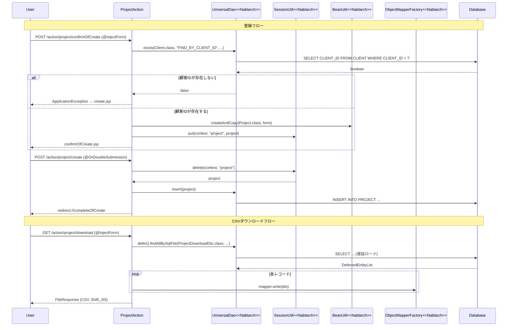

# Code Analysis: ProjectAction

**Generated**: 2026-03-31 11:24:45
**Target**: プロジェクト検索・登録・更新・削除機能のWebアクション
**Modules**: nablarch-example-web
**Analysis Duration**: approx. 3m 42s

---

## Overview

`ProjectAction` はNablarch 5 Webアプリケーションにおけるプロジェクト管理機能のアクションクラス。検索・登録・更新・削除という標準的なCRUD操作に加え、CSVダウンロード機能を提供する。

- **検索**: ページング付きプロジェクト一覧表示、CSVダウンロード
- **登録**: 入力→確認→完了の3ステップフロー（二重サブミット防止付き）
- **更新**: 詳細→編集→確認→完了の4ステップフロー（楽観的ロック対応）
- **削除**: セッションから取得したエンティティを削除（二重サブミット防止付き）

Nablarchの`UniversalDao`でDB操作、`SessionUtil`でセッション管理（楽観的ロック用エンティティ保存）、`@InjectForm`+`@OnError`でバリデーション制御、`@OnDoubleSubmission`で二重サブミット防止を行う。

---

## Architecture

### Dependency Graph

```mermaid
classDiagram
    class ProjectAction
    class ProjectForm {
        <<Form>>
    }
    class ProjectUpdateForm {
        <<Form>>
    }
    class ProjectSearchForm {
        <<Form>>
    }
    class ProjectTargetForm {
        <<Form>>
    }
    class ProjectDto {
        <<DTO>>
    }
    class ProjectSearchDto {
        <<DTO>>
    }
    class ProjectDownloadDto {
        <<DTO>>
    }
    class Project {
        <<Entity>>
    }
    class Client {
        <<Entity>>
    }
    class LoginUserPrincipal {
        <<Auth>>
    }
    class UniversalDao {
        <<Nablarch>>
    }
    class SessionUtil {
        <<Nablarch>>
    }
    class BeanUtil {
        <<Nablarch>>
    }
    class ObjectMapperFactory {
        <<Nablarch>>
    }
    class FileResponse {
        <<Nablarch>>
    }
    class TempFileUtil

    ProjectAction ..> ProjectForm : validates
    ProjectAction ..> ProjectUpdateForm : validates
    ProjectAction ..> ProjectSearchForm : validates
    ProjectAction ..> ProjectTargetForm : validates
    ProjectAction ..> ProjectDto : queries
    ProjectAction ..> ProjectSearchDto : queries
    ProjectAction ..> ProjectDownloadDto : serializes
    ProjectAction ..> Project : persists
    ProjectAction ..> Client : queries
    ProjectAction ..> LoginUserPrincipal : reads
    ProjectAction ..> UniversalDao : delegates to
    ProjectAction ..> SessionUtil : delegates to
    ProjectAction ..> BeanUtil : invokes
    ProjectAction ..> ObjectMapperFactory : creates
    ProjectAction ..> FileResponse : creates
    ProjectAction ..> TempFileUtil : invokes
```



**Note**: This diagram uses Mermaid `classDiagram` syntax to show class names and their relationships. Use `--|>` for inheritance (extends/implements) and `..>` for dependencies (uses/creates).

### Component Summary

| Component | Role | Type | Dependencies |
|-----------|------|------|--------------|
| ProjectAction | プロジェクトCRUD+CSV出力のWebアクション | Action | UniversalDao, SessionUtil, BeanUtil, ObjectMapperFactory, FileResponse |
| ProjectForm | プロジェクト登録入力値バリデーション | Form | DateRangeValidator |
| ProjectUpdateForm | プロジェクト更新入力値バリデーション | Form | なし |
| ProjectSearchForm | プロジェクト検索条件フォーム | Form | なし |
| ProjectTargetForm | 詳細・更新画面遷移用IDフォーム | Form | なし |
| ProjectDto | プロジェクト情報DTO（SQL結果受け取り用） | DTO | なし |
| ProjectSearchDto | 検索条件DTO | DTO | なし |
| ProjectDownloadDto | CSVダウンロード用DTO | DTO | なし |
| Project | プロジェクトエンティティ（DB永続化対象） | Entity | なし |
| Client | 顧客エンティティ（存在確認用） | Entity | なし |
| LoginUserPrincipal | ログインユーザ情報（セッションから取得） | Auth | なし |

---

## Flow

### Processing Flow

**検索フロー（index/list）**:
1. `index()`: 初期ページ番号・ソートキーをセットし`searchProject()`を呼び出す
2. `list()`: `@InjectForm`でフォームバリデーション後、`searchProject()`で検索
3. `searchProject()`: セッションからログインユーザIDを取得し、`UniversalDao.page().per(20).findAllBySqlFile()`でページング検索

**登録フロー（newEntity→confirmOfCreate→create→completeOfCreate）**:
1. `newEntity()`: セッションの`project`を削除し、登録初期画面表示
2. `confirmOfCreate()`: `@InjectForm`でバリデーション、顧客ID存在確認（`UniversalDao.exists()`）、エンティティをセッションに保存し確認画面へ
3. `create()`: `@OnDoubleSubmission`で二重サブミット防止、セッションからエンティティ取得・削除し`UniversalDao.insert()`、完了画面へリダイレクト
4. `completeOfCreate()`: 完了画面表示

**更新フロー（edit→confirmOfUpdate→update→completeOfUpdate）**:
1. `edit()`: `@InjectForm`でターゲットIDを受け取り、`UniversalDao.findBySqlFile()`でデータ取得、楽観的ロック用エンティティをセッションに保存
2. `confirmOfUpdate()`: `@InjectForm`でバリデーション、顧客ID存在確認、セッションのエンティティを`BeanUtil.copy()`で更新し確認画面へ
3. `update()`: `@OnDoubleSubmission`で二重サブミット防止、`UniversalDao.update()`で更新、完了画面へリダイレクト

**削除フロー（delete→completeOfDelete）**:
1. `delete()`: `@OnDoubleSubmission`で二重サブミット防止、セッションからエンティティ取得・削除し`UniversalDao.delete()`
2. `completeOfDelete()`: 完了画面表示

**CSVダウンロードフロー（download）**:
1. `@InjectForm`で検索条件フォームバリデーション、セッションからログインユーザIDを設定
2. `TempFileUtil.createTempFile()`で一時ファイル作成
3. `UniversalDao.defer().findAllBySqlFile()`で遅延ロード（大量データ対応）
4. `ObjectMapperFactory.create()`で`ObjectMapper`生成、`mapper.write(dto)`でCSV書き込み
5. `FileResponse`でCSVファイルをレスポンスとして返却

### Sequence Diagram



---

## Components

### ProjectAction

**ファイル**: [ProjectAction.java](../../.lw/nab-official/v5/nablarch-example-web/src/main/java/com/nablarch/example/app/web/action/ProjectAction.java)

**役割**: プロジェクトのCRUD操作とCSVダウンロードを担うWebアクションクラス

**主要メソッド**:

- `index()` (L153-167): 検索一覧初期画面表示。初期ページ番号・ソートキー設定後に`searchProject()`を呼び出す
- `list()` (L176-187): 検索条件フォーム受け取り後、`searchProject()`で検索結果を返す
- `download()` (L219-243): CSVダウンロード。`UniversalDao.defer()`で遅延ロード、`ObjectMapper`でCSV書き込み、`FileResponse`で返却
- `confirmOfCreate()` (L64-92): 登録確認。`UniversalDao.exists()`で顧客ID存在確認、`SessionUtil.put()`でエンティティ保存
- `create()` (L101-108): 登録実行。`@OnDoubleSubmission`で二重サブミット防止、`UniversalDao.insert()`
- `edit()` (L280-298): 更新初期画面。`UniversalDao.findBySqlFile()`でデータ取得、楽観的ロック用にセッション保存
- `update()` (L370-376): 更新実行。`@OnDoubleSubmission`で二重サブミット防止、`UniversalDao.update()`
- `delete()` (L396-401): 削除実行。`@OnDoubleSubmission`で二重サブミット防止、`UniversalDao.delete()`
- `searchProject()` (L198-208): 検索共通ロジック。セッションからユーザIDを取得し、ページング検索

**依存コンポーネント**: UniversalDao, SessionUtil, BeanUtil, ObjectMapperFactory, FileResponse, TempFileUtil, LoginUserPrincipal, Project, Client, ProjectForm, ProjectUpdateForm, ProjectSearchForm, ProjectTargetForm, ProjectDto, ProjectSearchDto, ProjectDownloadDto

### ProjectForm

**ファイル**: [ProjectForm.java](../../.lw/nab-official/v5/nablarch-example-web/src/main/java/com/nablarch/example/app/web/form/ProjectForm.java)

**役割**: プロジェクト登録画面の入力値バリデーションフォーム

**主要メソッド**:
- `hasClientId()` (L141-143): 顧客IDを保持しているか判定
- `isValidProjectPeriod()` (L355-357): 開始日・終了日の前後チェック（`@AssertTrue`で`DateRangeValidator`を利用）

**依存コンポーネント**: DateRangeValidator（日付範囲バリデーション）

### ProjectDto / ProjectSearchDto / ProjectDownloadDto

**ファイル**:
- [ProjectDto.java](../../.lw/nab-official/v5/nablarch-example-web/src/main/java/com/nablarch/example/app/web/dto/ProjectDto.java) — SQL結果受け取り用、バージョン番号保持（楽観的ロック用）
- [ProjectSearchDto.java](../../.lw/nab-official/v5/nablarch-example-web/src/main/java/com/nablarch/example/app/web/dto/ProjectSearchDto.java) — `UniversalDao.findAllBySqlFile()`へ渡す検索条件
- [ProjectDownloadDto.java](../../.lw/nab-official/v5/nablarch-example-web/src/main/java/com/nablarch/example/app/web/dto/ProjectDownloadDto.java) — `@Csv`/`@CsvFormat`でCSVフォーマット定義

---

## Nablarch Framework Usage

### UniversalDao

**クラス**: `nablarch.common.dao.UniversalDao`

**説明**: エンティティクラスのアノテーション情報に基づき、SQLを自動生成してDB操作を行うDAO

**使用方法**:
```java
// ページング検索
List<Project> list = UniversalDao
    .page(searchCondition.getPageNumber())
    .per(20L)
    .findAllBySqlFile(Project.class, "SEARCH_PROJECT", searchCondition);

// 存在確認
boolean exists = UniversalDao.exists(Client.class, "FIND_BY_CLIENT_ID", new Object[]{clientId});

// 遅延ロード（大量データ用）
DeferredEntityList<ProjectDownloadDto> list = (DeferredEntityList<ProjectDownloadDto>)
    UniversalDao.defer().findAllBySqlFile(ProjectDownloadDto.class, "SEARCH_PROJECT", condition);

// CRUD
UniversalDao.insert(project);
UniversalDao.update(project);
UniversalDao.delete(project);
```

**重要ポイント**:
- ✅ **ページングは`page().per()`で指定**: `page()`でページ番号、`per()`で1ページあたりの件数を設定する
- ⚠️ **大量データは`defer()`で遅延ロード**: 全件メモリに保持しないため、CSVダウンロード等の大量データ処理に必須
- 💡 **存在確認には`exists()`**: `findBySqlFile()`でNoDataExceptionを捕捉するよりも意図が明確

**このコードでの使い方**:
- `searchProject()` (L204-207): ページング付き検索
- `confirmOfCreate()`/`confirmOfUpdate()` (L70-71, L313): 顧客ID存在確認
- `download()` (L227-229): 遅延ロードでCSVダウンロード用データ取得
- `create()`/`update()`/`delete()` (L105, L373, L399): エンティティのCRUD

**詳細**: [Libraries Universal_dao](../../.claude/skills/nabledge-5/docs/component/libraries/libraries-universal_dao.md)

---

### SessionUtil

**クラス**: `nablarch.common.web.session.SessionUtil`

**説明**: セッションストアへのオブジェクト保存・取得・削除を行うユーティリティ。Webアプリケーションの確認→完了フローでエンティティを受け渡す際に使用する

**使用方法**:
```java
// セッションに保存
SessionUtil.put(context, "project", project);

// セッションから取得
Project project = SessionUtil.get(context, "project");

// セッションから取得して削除
Project project = SessionUtil.delete(context, "project");
```

**重要ポイント**:
- ✅ **確認→実行フローではエンティティをセッションに保存**: フォームのデータを直接保存するのではなく、エンティティに詰め替えてから保存する
- ⚠️ **フォームをセッションに直接格納しない**: セッションには`Serializable`を実装したエンティティを格納すること
- 💡 **`delete()`で取得と削除を同時に**: 登録・更新・削除実行時は`SessionUtil.delete()`でエンティティを取得と同時に削除し、セッション肥大化を防ぐ

**このコードでの使い方**:
- `confirmOfCreate()` (L83): `SessionUtil.put()`で登録用エンティティを保存
- `create()` (L103): `SessionUtil.delete()`で取得・削除
- `edit()` (L295): 楽観的ロック用に`SessionUtil.put()`でエンティティを保存
- `update()` (L372), `delete()` (L398): `SessionUtil.delete()`で取得・削除

**詳細**: [Libraries Session_store](../../.claude/skills/nabledge-5/docs/component/libraries/libraries-session_store.md)

---

### OnDoubleSubmission

**クラス**: `nablarch.common.web.token.OnDoubleSubmission`

**説明**: 二重サブミットを防止するインターセプタ。JSPの`<n:form useToken="true">`と連携してトークン検証を行う

**使用方法**:
```java
@OnDoubleSubmission
public HttpResponse create(HttpRequest request, ExecutionContext context) {
    // 登録処理
}
```

**重要ポイント**:
- ✅ **JSP側で`useToken="true"`が必須**: `@OnDoubleSubmission`だけでは動作しない。`<n:form useToken="true">`でトークン設定が必要
- ⚠️ **登録・更新・削除の実行メソッドに付与**: 確認画面への遷移メソッドではなく、実際にDBを更新するメソッドに付与する
- 💡 **二重サブミット時は自動でエラーページへ**: デフォルトのエラー画面に遷移するため、カスタムエラー処理は`BasicDoubleSubmissionHandler`の設定で対応

**このコードでの使い方**:
- `create()` (L101): 登録実行メソッドに付与
- `update()` (L370): 更新実行メソッドに付与
- `delete()` (L396): 削除実行メソッドに付与

**詳細**: [Handlers On_double_submission](../../.claude/skills/nabledge-5/docs/component/handlers/handlers-on_double_submission.md)

---

### ObjectMapper / ObjectMapperFactory

**クラス**: `nablarch.common.databind.ObjectMapper`, `nablarch.common.databind.ObjectMapperFactory`

**説明**: CSVなどのフォーマットをJava Beansとして読み書きする機能。`ObjectMapperFactory.create()`でインスタンスを生成し、`write()`でレコードを書き込む

**使用方法**:
```java
try (DeferredEntityList<ProjectDownloadDto> searchList = ...;
     ObjectMapper<ProjectDownloadDto> mapper = ObjectMapperFactory.create(
             ProjectDownloadDto.class, TempFileUtil.newOutputStream(path))) {
    for (ProjectDownloadDto dto : searchList) {
        mapper.write(dto);
    }
}
// try-with-resourcesで自動クローズ
```

**重要ポイント**:
- ✅ **try-with-resourcesで自動クローズ**: `ObjectMapper`は`Closeable`を実装しているため、必ずtry-with-resourcesで使用する
- ⚠️ **大量データ時は`DeferredEntityList`と組み合わせる**: `UniversalDao.defer()`で遅延ロードしたリストを`ObjectMapper`に渡すことでメモリ効率よく処理できる
- 💡 **`@Csv`/`@CsvFormat`でフォーマット宣言**: DTOクラスにアノテーションを付与するだけでCSVフォーマット（ヘッダ、文字コード、区切り文字等）を制御できる

**このコードでの使い方**:
- `download()` (L230-231): `ObjectMapperFactory.create(ProjectDownloadDto.class, outputStream)`でObjectMapper生成
- `download()` (L233-235): `mapper.write(dto)`で各レコードをCSV書き込み
- try-with-resourcesにより`download()`メソッド終了時に自動クローズ

**詳細**: [Libraries Data_bind](../../.claude/skills/nabledge-5/docs/component/libraries/libraries-data_bind.md)

---

### FileResponse

**クラス**: `nablarch.common.web.download.FileResponse`

**説明**: ファイルダウンロードレスポンスを生成するクラス。コンテンツタイプとコンテンツディスポジションを設定してCSVファイルをブラウザにダウンロードさせる

**使用方法**:
```java
FileResponse response = new FileResponse(path.toFile(), true); // true=リクエスト処理後に自動削除
response.setContentType("text/csv; charset=Shift_JIS");
response.setContentDisposition("プロジェクト一覧.csv");
return response;
```

**重要ポイント**:
- ✅ **第2引数`true`で一時ファイルを自動削除**: ダウンロード後に一時ファイルが残らないようにする
- ⚠️ **`Content-Type`に文字コードを明示**: ブラウザが正しくデコードできるよう`charset=Shift_JIS`を明示する
- 💡 **`TempFileUtil.createTempFile()`と組み合わせる**: アプリケーション管理の一時ファイルディレクトリを使用することで、ファイルの取り扱いが統一される

**このコードでの使い方**:
- `download()` (L238-242): 一時ファイルパスからFileResponseを生成し、CSVとしてレスポンス返却

**詳細**: [Libraries Data_bind](../../.claude/skills/nabledge-5/docs/component/libraries/libraries-data_bind.md)

---

## References

### Source Files

- [ProjectAction.java (.lw/nab-official/v5/nablarch-example-rest/src/main/java/com/nablarch/example/action)](../../.lw/nab-official/v5/nablarch-example-rest/src/main/java/com/nablarch/example/action/ProjectAction.java) - ProjectAction
- [ProjectAction.java (.lw/nab-official/v5/nablarch-example-web/src/main/java/com/nablarch/example/app/web/action)](../../.lw/nab-official/v5/nablarch-example-web/src/main/java/com/nablarch/example/app/web/action/ProjectAction.java) - ProjectAction
- [ProjectAction.java (.lw/nab-official/v6/nablarch-example-rest/src/main/java/com/nablarch/example/action)](../../.lw/nab-official/v6/nablarch-example-rest/src/main/java/com/nablarch/example/action/ProjectAction.java) - ProjectAction
- [ProjectAction.java (.lw/nab-official/v6/nablarch-example-web/src/main/java/com/nablarch/example/app/web/action)](../../.lw/nab-official/v6/nablarch-example-web/src/main/java/com/nablarch/example/app/web/action/ProjectAction.java) - ProjectAction
- [ProjectForm.java (.lw/nab-official/v5/nablarch-example-rest/src/main/java/com/nablarch/example/form)](../../.lw/nab-official/v5/nablarch-example-rest/src/main/java/com/nablarch/example/form/ProjectForm.java) - ProjectForm
- [ProjectForm.java (.lw/nab-official/v5/nablarch-example-web/src/main/java/com/nablarch/example/app/web/form)](../../.lw/nab-official/v5/nablarch-example-web/src/main/java/com/nablarch/example/app/web/form/ProjectForm.java) - ProjectForm
- [ProjectForm.java (.lw/nab-official/v6/nablarch-example-rest/src/main/java/com/nablarch/example/form)](../../.lw/nab-official/v6/nablarch-example-rest/src/main/java/com/nablarch/example/form/ProjectForm.java) - ProjectForm
- [ProjectForm.java (.lw/nab-official/v6/nablarch-example-web/src/main/java/com/nablarch/example/app/web/form)](../../.lw/nab-official/v6/nablarch-example-web/src/main/java/com/nablarch/example/app/web/form/ProjectForm.java) - ProjectForm
- [ProjectUpdateForm.java (.lw/nab-official/v5/nablarch-system-development-guide/en/Sample_Project/Source_Code/proman-project/proman-web/src/main/java/com/nablarch/example/proman/web/project)](../../.lw/nab-official/v5/nablarch-system-development-guide/en/Sample_Project/Source_Code/proman-project/proman-web/src/main/java/com/nablarch/example/proman/web/project/ProjectUpdateForm.java) - ProjectUpdateForm
- [ProjectUpdateForm.java (.lw/nab-official/v5/nablarch-system-development-guide/Sample_Project/Source_Code/proman-project/proman-web/src/main/java/com/nablarch/example/proman/web/project)](../../.lw/nab-official/v5/nablarch-system-development-guide/Sample_Project/Source_Code/proman-project/proman-web/src/main/java/com/nablarch/example/proman/web/project/ProjectUpdateForm.java) - ProjectUpdateForm
- [ProjectUpdateForm.java (.lw/nab-official/v5/nablarch-example-rest/src/main/java/com/nablarch/example/form)](../../.lw/nab-official/v5/nablarch-example-rest/src/main/java/com/nablarch/example/form/ProjectUpdateForm.java) - ProjectUpdateForm
- [ProjectUpdateForm.java (.lw/nab-official/v5/nablarch-example-web/src/main/java/com/nablarch/example/app/web/form)](../../.lw/nab-official/v5/nablarch-example-web/src/main/java/com/nablarch/example/app/web/form/ProjectUpdateForm.java) - ProjectUpdateForm
- [ProjectUpdateForm.java (.lw/nab-official/v6/nablarch-system-development-guide/en/Sample_Project/Source_Code/proman-project/proman-web/src/main/java/com/nablarch/example/proman/web/project)](../../.lw/nab-official/v6/nablarch-system-development-guide/en/Sample_Project/Source_Code/proman-project/proman-web/src/main/java/com/nablarch/example/proman/web/project/ProjectUpdateForm.java) - ProjectUpdateForm
- [ProjectUpdateForm.java (.lw/nab-official/v6/nablarch-system-development-guide/Sample_Project/Source_Code/proman-project/proman-web/src/main/java/com/nablarch/example/proman/web/project)](../../.lw/nab-official/v6/nablarch-system-development-guide/Sample_Project/Source_Code/proman-project/proman-web/src/main/java/com/nablarch/example/proman/web/project/ProjectUpdateForm.java) - ProjectUpdateForm
- [ProjectUpdateForm.java (.lw/nab-official/v6/nablarch-example-rest/src/main/java/com/nablarch/example/form)](../../.lw/nab-official/v6/nablarch-example-rest/src/main/java/com/nablarch/example/form/ProjectUpdateForm.java) - ProjectUpdateForm
- [ProjectUpdateForm.java (.lw/nab-official/v6/nablarch-example-web/src/main/java/com/nablarch/example/app/web/form)](../../.lw/nab-official/v6/nablarch-example-web/src/main/java/com/nablarch/example/app/web/form/ProjectUpdateForm.java) - ProjectUpdateForm
- [ProjectSearchForm.java (.lw/nab-official/v5/nablarch-system-development-guide/en/Sample_Project/Source_Code/proman-project/proman-web/src/main/java/com/nablarch/example/proman/web/project)](../../.lw/nab-official/v5/nablarch-system-development-guide/en/Sample_Project/Source_Code/proman-project/proman-web/src/main/java/com/nablarch/example/proman/web/project/ProjectSearchForm.java) - ProjectSearchForm
- [ProjectSearchForm.java (.lw/nab-official/v5/nablarch-system-development-guide/Sample_Project/Source_Code/proman-project/proman-web/src/main/java/com/nablarch/example/proman/web/project)](../../.lw/nab-official/v5/nablarch-system-development-guide/Sample_Project/Source_Code/proman-project/proman-web/src/main/java/com/nablarch/example/proman/web/project/ProjectSearchForm.java) - ProjectSearchForm
- [ProjectSearchForm.java (.lw/nab-official/v5/nablarch-example-rest/src/main/java/com/nablarch/example/form)](../../.lw/nab-official/v5/nablarch-example-rest/src/main/java/com/nablarch/example/form/ProjectSearchForm.java) - ProjectSearchForm
- [ProjectSearchForm.java (.lw/nab-official/v5/nablarch-example-web/src/main/java/com/nablarch/example/app/web/form)](../../.lw/nab-official/v5/nablarch-example-web/src/main/java/com/nablarch/example/app/web/form/ProjectSearchForm.java) - ProjectSearchForm
- [ProjectSearchForm.java (.lw/nab-official/v6/nablarch-system-development-guide/en/Sample_Project/Source_Code/proman-project/proman-web/src/main/java/com/nablarch/example/proman/web/project)](../../.lw/nab-official/v6/nablarch-system-development-guide/en/Sample_Project/Source_Code/proman-project/proman-web/src/main/java/com/nablarch/example/proman/web/project/ProjectSearchForm.java) - ProjectSearchForm
- [ProjectSearchForm.java (.lw/nab-official/v6/nablarch-system-development-guide/Sample_Project/Source_Code/proman-project/proman-web/src/main/java/com/nablarch/example/proman/web/project)](../../.lw/nab-official/v6/nablarch-system-development-guide/Sample_Project/Source_Code/proman-project/proman-web/src/main/java/com/nablarch/example/proman/web/project/ProjectSearchForm.java) - ProjectSearchForm
- [ProjectSearchForm.java (.lw/nab-official/v6/nablarch-example-rest/src/main/java/com/nablarch/example/form)](../../.lw/nab-official/v6/nablarch-example-rest/src/main/java/com/nablarch/example/form/ProjectSearchForm.java) - ProjectSearchForm
- [ProjectSearchForm.java (.lw/nab-official/v6/nablarch-example-web/src/main/java/com/nablarch/example/app/web/form)](../../.lw/nab-official/v6/nablarch-example-web/src/main/java/com/nablarch/example/app/web/form/ProjectSearchForm.java) - ProjectSearchForm
- [ProjectTargetForm.java (.lw/nab-official/v5/nablarch-example-web/src/main/java/com/nablarch/example/app/web/form)](../../.lw/nab-official/v5/nablarch-example-web/src/main/java/com/nablarch/example/app/web/form/ProjectTargetForm.java) - ProjectTargetForm
- [ProjectTargetForm.java (.lw/nab-official/v6/nablarch-example-web/src/main/java/com/nablarch/example/app/web/form)](../../.lw/nab-official/v6/nablarch-example-web/src/main/java/com/nablarch/example/app/web/form/ProjectTargetForm.java) - ProjectTargetForm
- [ProjectDto.java (.lw/nab-official/v5/nablarch-system-development-guide/en/Sample_Project/Source_Code/proman-project/proman-batch/src/main/java/com/nablarch/example/proman/batch/project)](../../.lw/nab-official/v5/nablarch-system-development-guide/en/Sample_Project/Source_Code/proman-project/proman-batch/src/main/java/com/nablarch/example/proman/batch/project/ProjectDto.java) - ProjectDto
- [ProjectDto.java (.lw/nab-official/v5/nablarch-system-development-guide/Sample_Project/Source_Code/proman-project/proman-batch/src/main/java/com/nablarch/example/proman/batch/project)](../../.lw/nab-official/v5/nablarch-system-development-guide/Sample_Project/Source_Code/proman-project/proman-batch/src/main/java/com/nablarch/example/proman/batch/project/ProjectDto.java) - ProjectDto
- [ProjectDto.java (.lw/nab-official/v5/nablarch-example-web/src/main/java/com/nablarch/example/app/web/dto)](../../.lw/nab-official/v5/nablarch-example-web/src/main/java/com/nablarch/example/app/web/dto/ProjectDto.java) - ProjectDto
- [ProjectDto.java (.lw/nab-official/v6/nablarch-system-development-guide/en/Sample_Project/Source_Code/proman-project/proman-batch/src/main/java/com/nablarch/example/proman/batch/project)](../../.lw/nab-official/v6/nablarch-system-development-guide/en/Sample_Project/Source_Code/proman-project/proman-batch/src/main/java/com/nablarch/example/proman/batch/project/ProjectDto.java) - ProjectDto
- [ProjectDto.java (.lw/nab-official/v6/nablarch-system-development-guide/Sample_Project/Source_Code/proman-project/proman-batch/src/main/java/com/nablarch/example/proman/batch/project)](../../.lw/nab-official/v6/nablarch-system-development-guide/Sample_Project/Source_Code/proman-project/proman-batch/src/main/java/com/nablarch/example/proman/batch/project/ProjectDto.java) - ProjectDto
- [ProjectDto.java (.lw/nab-official/v6/nablarch-example-web/src/main/java/com/nablarch/example/app/web/dto)](../../.lw/nab-official/v6/nablarch-example-web/src/main/java/com/nablarch/example/app/web/dto/ProjectDto.java) - ProjectDto
- [ProjectSearchDto.java (.lw/nab-official/v5/nablarch-example-rest/src/main/java/com/nablarch/example/dto)](../../.lw/nab-official/v5/nablarch-example-rest/src/main/java/com/nablarch/example/dto/ProjectSearchDto.java) - ProjectSearchDto
- [ProjectSearchDto.java (.lw/nab-official/v5/nablarch-example-web/src/main/java/com/nablarch/example/app/web/dto)](../../.lw/nab-official/v5/nablarch-example-web/src/main/java/com/nablarch/example/app/web/dto/ProjectSearchDto.java) - ProjectSearchDto
- [ProjectSearchDto.java (.lw/nab-official/v6/nablarch-example-rest/src/main/java/com/nablarch/example/dto)](../../.lw/nab-official/v6/nablarch-example-rest/src/main/java/com/nablarch/example/dto/ProjectSearchDto.java) - ProjectSearchDto
- [ProjectSearchDto.java (.lw/nab-official/v6/nablarch-example-web/src/main/java/com/nablarch/example/app/web/dto)](../../.lw/nab-official/v6/nablarch-example-web/src/main/java/com/nablarch/example/app/web/dto/ProjectSearchDto.java) - ProjectSearchDto
- [ProjectDownloadDto.java (.lw/nab-official/v5/nablarch-example-web/src/main/java/com/nablarch/example/app/web/dto)](../../.lw/nab-official/v5/nablarch-example-web/src/main/java/com/nablarch/example/app/web/dto/ProjectDownloadDto.java) - ProjectDownloadDto
- [ProjectDownloadDto.java (.lw/nab-official/v6/nablarch-example-web/src/main/java/com/nablarch/example/app/web/dto)](../../.lw/nab-official/v6/nablarch-example-web/src/main/java/com/nablarch/example/app/web/dto/ProjectDownloadDto.java) - ProjectDownloadDto

### Knowledge Base (Nabledge-5)

- [Libraries Universal_dao](../../.claude/skills/nabledge-5/docs/component/libraries/libraries-universal_dao.md)
- [Handlers On_double_submission](../../.claude/skills/nabledge-5/docs/component/handlers/handlers-on_double_submission.md)
- [Libraries Data_bind](../../.claude/skills/nabledge-5/docs/component/libraries/libraries-data_bind.md)
- [Libraries Session_store](../../.claude/skills/nabledge-5/docs/component/libraries/libraries-session_store.md)
- [Web Application Getting Started Project Download](../../.claude/skills/nabledge-5/docs/processing-pattern/web-application/web-application-getting-started-project-download.md)
- [Web Application Getting Started Project Update](../../.claude/skills/nabledge-5/docs/processing-pattern/web-application/web-application-getting-started-project-update.md)
- [Web Application Getting Started Project Search](../../.claude/skills/nabledge-5/docs/processing-pattern/web-application/web-application-getting-started-project-search.md)

### Official Documentation


- [AesEncryptor](https://nablarch.github.io/docs/LATEST/javadoc/nablarch/common/encryption/AesEncryptor.html)
- [Base64Key](https://nablarch.github.io/docs/LATEST/javadoc/nablarch/common/encryption/Base64Key.html)
- [Base64Util](https://nablarch.github.io/docs/LATEST/javadoc/nablarch/core/util/Base64Util.html)
- [BasicDaoContextFactory](https://nablarch.github.io/docs/LATEST/javadoc/nablarch/common/dao/BasicDaoContextFactory.html)
- [BasicDoubleSubmissionHandler](https://nablarch.github.io/docs/LATEST/javadoc/nablarch/common/web/token/BasicDoubleSubmissionHandler.html)
- [BeanUtil](https://nablarch.github.io/docs/LATEST/javadoc/nablarch/core/beans/BeanUtil.html)
- [ConnectionFactory](https://nablarch.github.io/docs/LATEST/javadoc/nablarch/core/db/connection/ConnectionFactory.html)
- [CsvDataBindConfig](https://nablarch.github.io/docs/LATEST/javadoc/nablarch/common/databind/csv/CsvDataBindConfig.html)
- [CsvFormat](https://nablarch.github.io/docs/LATEST/javadoc/nablarch/common/databind/csv/CsvFormat.html)
- [Csv](https://nablarch.github.io/docs/LATEST/javadoc/nablarch/common/databind/csv/Csv.html)
- [Data Bind](https://nablarch.github.io/docs/LATEST/doc/application_framework/application_framework/libraries/data_io/data_bind.html)
- [DataBindConfig](https://nablarch.github.io/docs/LATEST/javadoc/nablarch/common/databind/DataBindConfig.html)
- [DatabaseMetaDataExtractor](https://nablarch.github.io/docs/LATEST/javadoc/nablarch/common/dao/DatabaseMetaDataExtractor.html)
- [DbStore](https://nablarch.github.io/docs/LATEST/javadoc/nablarch/common/web/session/store/DbStore.html)
- [DeferredEntityList](https://nablarch.github.io/docs/LATEST/javadoc/nablarch/common/dao/DeferredEntityList.html)
- [Dialect](https://nablarch.github.io/docs/LATEST/javadoc/nablarch/core/db/dialect/Dialect.html)
- [DoubleSubmissionHandler](https://nablarch.github.io/docs/LATEST/javadoc/nablarch/common/web/token/DoubleSubmissionHandler.html)
- [EntityList](https://nablarch.github.io/docs/LATEST/javadoc/nablarch/common/dao/EntityList.html)
- [ExecutionContext](https://nablarch.github.io/docs/LATEST/javadoc/nablarch/fw/ExecutionContext.html)
- [Field](https://nablarch.github.io/docs/LATEST/javadoc/nablarch/common/databind/fixedlength/Field.html)
- [FileResponse](https://nablarch.github.io/docs/LATEST/javadoc/nablarch/common/web/download/FileResponse.html)
- [FixedLengthDataBindConfigBuilder](https://nablarch.github.io/docs/LATEST/javadoc/nablarch/common/databind/fixedlength/FixedLengthDataBindConfigBuilder.html)
- [FixedLengthDataBindConfig](https://nablarch.github.io/docs/LATEST/javadoc/nablarch/common/databind/fixedlength/FixedLengthDataBindConfig.html)
- [FixedLength](https://nablarch.github.io/docs/LATEST/javadoc/nablarch/common/databind/fixedlength/FixedLength.html)
- [GenerationType](https://nablarch.github.io/docs/LATEST/javadoc/javax/persistence/GenerationType.html)
- [H2Dialect](https://nablarch.github.io/docs/LATEST/javadoc/nablarch/core/db/dialect/H2Dialect.html)
- [HttpResponse](https://nablarch.github.io/docs/LATEST/javadoc/nablarch/fw/web/HttpResponse.html)
- [Index](https://nablarch.github.io/docs/LATEST/doc/application_framework/application_framework/web/getting_started/project_download/index.html)
- [Index](https://nablarch.github.io/docs/LATEST/doc/application_framework/application_framework/web/getting_started/project_search/index.html)
- [Index](https://nablarch.github.io/docs/LATEST/doc/application_framework/application_framework/web/getting_started/project_update/index.html)
- [InjectForm](https://nablarch.github.io/docs/LATEST/javadoc/nablarch/common/web/interceptor/InjectForm.html)
- [JavaSerializeEncryptStateEncoder](https://nablarch.github.io/docs/LATEST/javadoc/nablarch/common/web/session/encoder/JavaSerializeEncryptStateEncoder.html)
- [JavaSerializeStateEncoder](https://nablarch.github.io/docs/LATEST/javadoc/nablarch/common/web/session/encoder/JavaSerializeStateEncoder.html)
- [JaxbStateEncoder](https://nablarch.github.io/docs/LATEST/javadoc/nablarch/common/web/session/encoder/JaxbStateEncoder.html)
- [LineNumber](https://nablarch.github.io/docs/LATEST/javadoc/nablarch/common/databind/LineNumber.html)
- [MultiLayout](https://nablarch.github.io/docs/LATEST/javadoc/nablarch/common/databind/fixedlength/MultiLayout.html)
- [NoDataException](https://nablarch.github.io/docs/LATEST/javadoc/nablarch/common/dao/NoDataException.html)
- [ObjectMapperFactory](https://nablarch.github.io/docs/LATEST/javadoc/nablarch/common/databind/ObjectMapperFactory.html)
- [ObjectMapper](https://nablarch.github.io/docs/LATEST/javadoc/nablarch/common/databind/ObjectMapper.html)
- [On Double Submission](https://nablarch.github.io/docs/LATEST/doc/application_framework/application_framework/handlers/web_interceptor/on_double_submission.html)
- [OnDoubleSubmission](https://nablarch.github.io/docs/LATEST/javadoc/nablarch/common/web/token/OnDoubleSubmission.html)
- [OnError](https://nablarch.github.io/docs/LATEST/javadoc/nablarch/fw/web/interceptor/OnError.html)
- [OptimisticLockException](https://nablarch.github.io/docs/LATEST/javadoc/javax/persistence/OptimisticLockException.html)
- [Pagination](https://nablarch.github.io/docs/LATEST/javadoc/nablarch/common/dao/Pagination.html)
- [PartInfo](https://nablarch.github.io/docs/LATEST/javadoc/nablarch/fw/web/upload/PartInfo.html)
- [RecordIdentifier](https://nablarch.github.io/docs/LATEST/javadoc/nablarch/common/databind/fixedlength/MultiLayoutConfig/RecordIdentifier.html)
- [ResourceLocator](https://nablarch.github.io/docs/LATEST/javadoc/nablarch/fw/web/ResourceLocator.html)
- [Session Store](https://nablarch.github.io/docs/LATEST/doc/application_framework/application_framework/libraries/session_store.html)
- [SessionKeyNotFoundException](https://nablarch.github.io/docs/LATEST/javadoc/nablarch/common/web/session/SessionKeyNotFoundException.html)
- [SessionManager](https://nablarch.github.io/docs/LATEST/javadoc/nablarch/common/web/session/SessionManager.html)
- [SessionStore](https://nablarch.github.io/docs/LATEST/javadoc/nablarch/common/web/session/SessionStore.html)
- [SessionUtil](https://nablarch.github.io/docs/LATEST/javadoc/nablarch/common/web/session/SessionUtil.html)
- [SimpleDbTransactionManager](https://nablarch.github.io/docs/LATEST/javadoc/nablarch/core/db/transaction/SimpleDbTransactionManager.html)
- [TransactionFactory](https://nablarch.github.io/docs/LATEST/javadoc/nablarch/core/transaction/TransactionFactory.html)
- [Universal Dao](https://nablarch.github.io/docs/LATEST/doc/application_framework/application_framework/libraries/database/universal_dao.html)
- [UniversalDao.Transaction](https://nablarch.github.io/docs/LATEST/javadoc/nablarch/common/dao/UniversalDao.Transaction.html)
- [UniversalDao](https://nablarch.github.io/docs/LATEST/javadoc/nablarch/common/dao/UniversalDao.html)
- [UserSessionSchema](https://nablarch.github.io/docs/LATEST/javadoc/nablarch/common/web/session/store/UserSessionSchema.html)

---

**Note**: This documentation was generated by the code-analysis workflow of the nabledge-5 skill.
