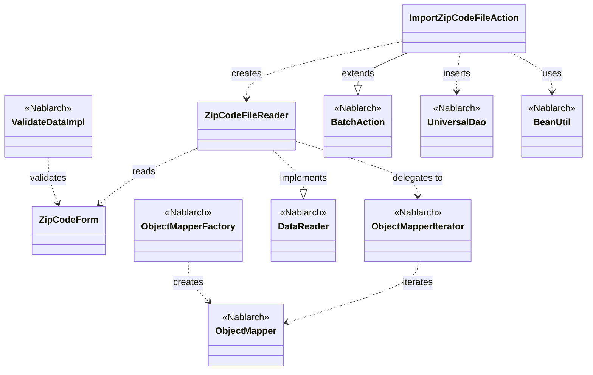
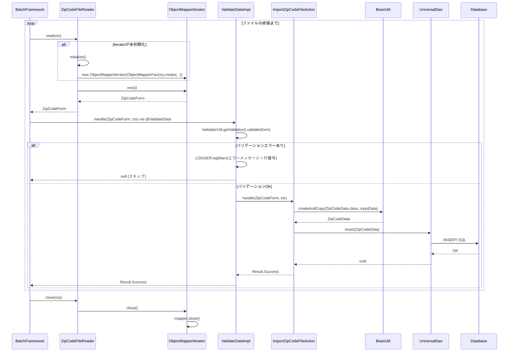

# Code Analysis: ImportZipCodeFileAction

**Generated**: 2026-03-31 11:35:36
**Target**: 住所CSVファイルをDBに登録するNablarchバッチアクション
**Modules**: nablarch-example-batch
**Analysis Duration**: approx. 3m 12s

---

## Overview

`ImportZipCodeFileAction` は、住所CSVファイルを読み込んでDBに一括登録するNablarchバッチアクションクラス。`BatchAction<ZipCodeForm>` を継承し、`ZipCodeFileReader` から1行ずつCSVデータを受け取り、`BeanUtil` でエンティティに変換後、`UniversalDao.insert` でDBに登録する。バリデーションは `@ValidateData` インターセプタによって `handle()` メソッド実行前に自動実行される。CSVバインドはdata_bindライブラリの `@Csv`/`@CsvFormat` アノテーションにより宣言的に定義されている。

**主なコンポーネント**: ImportZipCodeFileAction（バッチアクション）、ZipCodeForm（CSVフォーム）、ZipCodeFileReader（データリーダ）、ObjectMapperIterator（イテレータ）、ValidateData（バリデーションインターセプタ）

---

## Architecture

### Dependency Graph



**Note**: This diagram uses Mermaid `classDiagram` syntax to show class names and their relationships. Use `--|>` for inheritance (extends/implements) and `..>` for dependencies (uses/creates).

### Component Summary

| Component | Role | Type | Dependencies |
|-----------|------|------|--------------|
| ImportZipCodeFileAction | 住所CSVをDBに登録するバッチアクション | Action | ZipCodeFileReader, BeanUtil, UniversalDao |
| ZipCodeForm | CSVレコードをバインドし検証するフォーム | Form | なし |
| ZipCodeFileReader | 住所CSVファイルを1行ずつ読み込むデータリーダ | DataReader | ObjectMapperIterator, ObjectMapperFactory, FilePathSetting |
| ObjectMapperIterator | ObjectMapperをIteratorパターンでラップするヘルパー | Iterator | ObjectMapper |
| ValidateData / ValidateDataImpl | handle()実行前にBean Validationを実行するインターセプタ | Interceptor | ValidatorUtil, BeanUtil |

---

## Flow

### Processing Flow

バッチフレームワークが `ZipCodeFileReader.read()` を呼び出してCSVから1行分のデータ（`ZipCodeForm`）を取得。次に `@ValidateData` インターセプタが `ImportZipCodeFileAction.handle()` をインターセプトし、Bean Validationを実行。バリデーションが通過した場合のみ `handle()` が呼び出され、`BeanUtil.createAndCopy` でフォームをエンティティ（`ZipCodeData`）に変換し、`UniversalDao.insert` でDBに登録。最終的に `Result.Success` を返す。バリデーションエラーが発生した場合はWARNログを出力し、当該レコードをスキップして次レコードへ進む。

### Sequence Diagram



---

## Components

### ImportZipCodeFileAction

**ファイル**: [ImportZipCodeFileAction.java](../../.lw/nab-official/v5/nablarch-example-batch/src/main/java/com/nablarch/example/app/batch/action/ImportZipCodeFileAction.java)

**役割**: 住所CSVファイルの1レコードをDBに登録するバッチアクション。`BatchAction<ZipCodeForm>` を継承し、フレームワークのバッチ処理テンプレートを活用する。

**主なメソッド**:
- `handle(ZipCodeForm inputData, ExecutionContext ctx)` (L35-41): `@ValidateData` インターセプタ経由で呼ばれる業務ロジック。`BeanUtil.createAndCopy` でエンティティに変換し `UniversalDao.insert` でDB登録
- `createReader(ExecutionContext ctx)` (L50-52): `ZipCodeFileReader` のインスタンスを返してデータリーダを生成

**依存関係**: ZipCodeFileReader、BeanUtil（Nablarch）、UniversalDao（Nablarch）、ZipCodeData（Entity）、ExecutionContext（Nablarch）

---

### ZipCodeForm

**ファイル**: [ZipCodeForm.java](../../.lw/nab-official/v5/nablarch-example-batch/src/main/java/com/nablarch/example/app/batch/form/ZipCodeForm.java)

**役割**: CSVレコードをJava Beanにバインドし、Bean Validationで入力検証するフォームクラス。`@Csv` と `@CsvFormat` でCSVフォーマットを宣言的に定義。

**主なフィールド/メソッド**:
- クラスレベル: `@Csv(type=CsvType.CUSTOM, properties={...})` (L17-20)、`@CsvFormat(charset="UTF-8", ...)` (L21-23) でCSVフォーマット指定
- 各フィールド: `@Domain("xxx")` と `@Required` でドメインバリデーション定義（L30-130）
- `getLineNumber()` (L143-145): `@LineNumber` で行番号を自動インジェクション

**依存関係**: Nablarch data_bindアノテーション（@Csv, @CsvFormat, @LineNumber）、Bean Validationアノテーション（@Domain, @Required）

---

### ZipCodeFileReader

**ファイル**: [ZipCodeFileReader.java](../../.lw/nab-official/v5/nablarch-example-batch/src/main/java/com/nablarch/example/app/batch/reader/ZipCodeFileReader.java)

**役割**: 住所CSVファイルを `ObjectMapperIterator` 経由で1行ずつ読み込む `DataReader` 実装。`FilePathSetting` でファイルパスを解決し、`ObjectMapperFactory` でCSVマッパーを生成する。

**主なメソッド**:
- `read(ExecutionContext ctx)` (L40-45): 未初期化時に `initialize()` を呼び出し、`iterator.next()` で次レコードを返す
- `hasNext(ExecutionContext ctx)` (L54-59): `iterator.hasNext()` の結果を返す
- `close(ExecutionContext ctx)` (L68-70): `iterator.close()` でリソース解放
- `initialize()` (L78-89): `FilePathSetting.getInstance().getFileWithoutCreate("csv-input", "importZipCode")` でファイル取得、`ObjectMapperFactory.create` でイテレータ生成

**依存関係**: ObjectMapperIterator、ObjectMapperFactory（Nablarch）、FilePathSetting（Nablarch）、ZipCodeForm

---

### ObjectMapperIterator

**ファイル**: [ObjectMapperIterator.java](../../.lw/nab-official/v5/nablarch-example-batch/src/main/java/com/nablarch/example/app/batch/reader/iterator/ObjectMapperIterator.java)

**役割**: `ObjectMapper` を `Iterator<E>` パターンでラップし、`DataReader` から簡単に利用できるようにするヘルパークラス。コンストラクタで最初の1レコードを先読みする。

**主なメソッド**:
- コンストラクタ (L32-36): `mapper` を受け取り、最初のレコードを `mapper.read()` で先読みして保持
- `hasNext()` (L44-46): 保持中のデータが `null` でなければ `true`
- `next()` (L55-60): 現在のデータを返し、次のデータを `mapper.read()` で読み込む
- `close()` (L65-67): `mapper.close()` でリソース解放

**依存関係**: ObjectMapper（Nablarch）

---

### ValidateData / ValidateDataImpl

**ファイル**: [ValidateData.java](../../.lw/nab-official/v5/nablarch-example-batch/src/main/java/com/nablarch/example/app/batch/interceptor/ValidateData.java)

**役割**: `@ValidateData` アノテーションを付けたメソッドをインターセプトし、引数のBeanに対してBean Validationを実行するインターセプタ。エラー時はWARNログを出力してスキップ（`null` 返却）。

**主なメソッド**:
- `handle(Object data, ExecutionContext context)` (L60-92): `ValidatorUtil.getValidator().validate(data)` でバリデーション実行。エラーがない場合のみ元ハンドラ（`handle()`）を呼び出す。エラー時は行番号付きWARNログを出力

**依存関係**: ValidatorUtil（Nablarch）、BeanUtil（Nablarch）、LoggerManager（Nablarch）、MessageUtil（Nablarch）

---

## Nablarch Framework Usage

### UniversalDao

**クラス**: `nablarch.common.dao.UniversalDao`

**説明**: JPAアノテーションを使った簡易O/Rマッパー。SQLを書かずにエンティティの単純なCRUD操作が可能。

**使用方法**:
```java
// エンティティの登録
UniversalDao.insert(entity);

// 主キー指定での検索
ZipCodeData data = UniversalDao.findById(ZipCodeData.class, primaryKey);
```

**重要ポイント**:
- ✅ **事前にdatabaseの設定が必要**: UniversalDAOは内部でdatabaseライブラリを使用するため、使用前にdatabaseの設定が必要
- ⚠️ **主キー以外の条件による更新/削除は不可**: 主キー以外の条件を使った更新/削除はdatabaseライブラリを使用すること
- 💡 **SQLを書かなくてよい**: JPAアノテーションを付与するだけで単純なCRUDが可能
- ⚠️ **共通項目の自動設定は非サポート**: 登録ユーザや更新ユーザ等の共通項目への自動設定は提供しない。必要な場合はDomaアダプタを使用するか、アプリケーション側で明示的に設定すること

**このコードでの使い方**:
- `handle()` (L38) で `UniversalDao.insert(data)` を呼び出してZipCodeDataエンティティをDBに登録

**詳細**: [Libraries Universal_dao](../../.claude/skills/nabledge-5/docs/component/libraries/libraries-universal_dao.md)

---

### ObjectMapper / ObjectMapperFactory

**クラス**: `nablarch.common.databind.ObjectMapper`, `nablarch.common.databind.ObjectMapperFactory`

**説明**: CSVやTSV、固定長データをJava BeansオブジェクトまたはMapオブジェクトとして扱う機能。`@Csv` / `@CsvFormat` アノテーションでフォーマットを宣言的に定義できる。

**使用方法**:
```java
// Java Beansクラスにバインドして読み込む場合
try (ObjectMapper<ZipCodeForm> mapper = ObjectMapperFactory.create(
        ZipCodeForm.class, new FileInputStream(file))) {
    ZipCodeForm form;
    while ((form = mapper.read()) != null) {
        // 1レコードずつ処理
    }
}
```

**重要ポイント**:
- ✅ **必ずclose()を呼ぶ**: リソース解放のため `close()` が必須（`try-with-resources` 推奨）
- ⚠️ **スレッドアンセーフ**: 複数スレッドでの共有は不可。複数スレッドで使用する場合は同期処理が必要
- 💡 **アノテーション駆動**: `@Csv`, `@CsvFormat` で設定ファイル不要のフォーマット定義が可能
- ⚠️ **外部データはString型で受け取る**: 外部から受け付けたデータは不正データ対策のため、プロパティはすべてString型で定義すること

**このコードでの使い方**:
- `ZipCodeFileReader.initialize()` (L84) で `ObjectMapperFactory.create(ZipCodeForm.class, new FileInputStream(file))` によりマッパーを生成
- `ObjectMapperIterator` にラップして1レコードずつ読み込む形式で利用

**詳細**: [Libraries Data_bind](../../.claude/skills/nabledge-5/docs/component/libraries/libraries-data_bind.md)

---

### BeanUtil

**クラス**: `nablarch.core.beans.BeanUtil`

**説明**: Java Beansオブジェクト間でプロパティ値をコピー・変換するユーティリティ。同名のプロパティを自動的にコピーし、型変換もサポート。

**使用方法**:
```java
// FormからEntityへのコピー
ZipCodeData data = BeanUtil.createAndCopy(ZipCodeData.class, zipCodeForm);
```

**重要ポイント**:
- ✅ **同名プロパティの自動コピー**: 送り元と送り先で同名のプロパティが自動的にコピーされる
- ⚠️ **型変換失敗時は例外**: 型変換に失敗した場合は例外が発生しJava Beansオブジェクトは生成されない

**このコードでの使い方**:
- `handle()` (L37) で `BeanUtil.createAndCopy(ZipCodeData.class, inputData)` を呼び出し、`ZipCodeForm` から `ZipCodeData` エンティティへプロパティをコピー

**詳細**: [Libraries Data_bind](../../.claude/skills/nabledge-5/docs/component/libraries/libraries-data_bind.md)

---

### Bean Validation (@ValidateData インターセプタ経由)

**クラス**: `nablarch.core.validation.ee.ValidatorUtil`, `javax.validation.Validator`

**説明**: JSR-380（Bean Validation 2.0）に基づく入力値検証。`@Domain`, `@Required` などのアノテーションをBeanのフィールドに付与して宣言的に検証ルールを定義する。このコードでは `@ValidateData` インターセプタを通じて自動的にバリデーションが実行される。

**使用方法**:
```java
// ValidateDataImpl内での実行例
Validator validator = ValidatorUtil.getValidator();
Set<ConstraintViolation<Object>> violations = validator.validate(data);
if (violations.isEmpty()) {
    return getOriginalHandler().handle(data, context);
}
// エラー時はWARNログ出力してnullを返す
```

**重要ポイント**:
- 💡 **インターセプタで共通化**: `@ValidateData` アノテーションを `handle()` に付けるだけで複数バッチ間でバリデーションロジックを共通化できる
- ✅ **バリデーションエラー行はスキップ**: エラーレコードはWARNログ出力後にスキップされ、バッチ処理は継続する
- 🎯 **行番号ロギング**: フォームに `lineNumber` プロパティ（`@LineNumber` 付与）があれば、エラーログに行番号が含まれる

**このコードでの使い方**:
- `ImportZipCodeFileAction.handle()` (L34) に `@ValidateData` を付与することで、メソッド実行前に `ValidateDataImpl.handle()` が自動的にBean Validationを実行
- `ZipCodeForm` の各フィールドに `@Domain` と `@Required` を付与して検証ルールを定義

**詳細**: [Libraries Bean_validation](../../.claude/skills/nabledge-5/docs/component/libraries/libraries-bean_validation.md)

---

## References

### Source Files

- [ImportZipCodeFileAction.java (.lw/nab-official/v5/...)](../../.lw/nab-official/v5/nablarch-example-batch/src/main/java/com/nablarch/example/app/batch/action/ImportZipCodeFileAction.java)
- [ZipCodeForm.java (.lw/nab-official/v5/...)](../../.lw/nab-official/v5/nablarch-example-batch/src/main/java/com/nablarch/example/app/batch/form/ZipCodeForm.java)
- [ZipCodeFileReader.java (.lw/nab-official/v5/...)](../../.lw/nab-official/v5/nablarch-example-batch/src/main/java/com/nablarch/example/app/batch/reader/ZipCodeFileReader.java)
- [ObjectMapperIterator.java (.lw/nab-official/v5/...)](../../.lw/nab-official/v5/nablarch-example-batch/src/main/java/com/nablarch/example/app/batch/reader/iterator/ObjectMapperIterator.java)
- [ValidateData.java (.lw/nab-official/v5/...)](../../.lw/nab-official/v5/nablarch-example-batch/src/main/java/com/nablarch/example/app/batch/interceptor/ValidateData.java)

### Knowledge Base (Nabledge-5)

- [Nablarch Batch Getting Started](../../.claude/skills/nabledge-5/docs/processing-pattern/nablarch-batch/nablarch-batch-getting-started-nablarch-batch.md)
- [Libraries Data_bind](../../.claude/skills/nabledge-5/docs/component/libraries/libraries-data_bind.md)
- [Libraries Universal_dao](../../.claude/skills/nabledge-5/docs/component/libraries/libraries-universal_dao.md)
- [Libraries Bean_validation](../../.claude/skills/nabledge-5/docs/component/libraries/libraries-bean_validation.md)

### Official Documentation

- [BatchAction](https://nablarch.github.io/docs/LATEST/javadoc/nablarch/fw/action/BatchAction.html)
- [UniversalDao](https://nablarch.github.io/docs/LATEST/javadoc/nablarch/common/dao/UniversalDao.html)
- [Universal Dao](https://nablarch.github.io/docs/LATEST/doc/application_framework/application_framework/libraries/database/universal_dao.html)
- [ObjectMapper](https://nablarch.github.io/docs/LATEST/javadoc/nablarch/common/databind/ObjectMapper.html)
- [ObjectMapperFactory](https://nablarch.github.io/docs/LATEST/javadoc/nablarch/common/databind/ObjectMapperFactory.html)
- [Data Bind](https://nablarch.github.io/docs/LATEST/doc/application_framework/application_framework/libraries/data_io/data_bind.html)
- [DataReader](https://nablarch.github.io/docs/LATEST/javadoc/nablarch/fw/DataReader.html)
- [BeanUtil](https://nablarch.github.io/docs/LATEST/javadoc/nablarch/core/beans/BeanUtil.html)
- [ValidatorUtil](https://nablarch.github.io/docs/LATEST/javadoc/nablarch/core/validation/ee/ValidatorUtil.html)
- [Bean Validation](https://nablarch.github.io/docs/LATEST/doc/application_framework/application_framework/libraries/validation/bean_validation.html)

---

**Note**: This documentation was generated by the code-analysis workflow of the nabledge-5 skill.