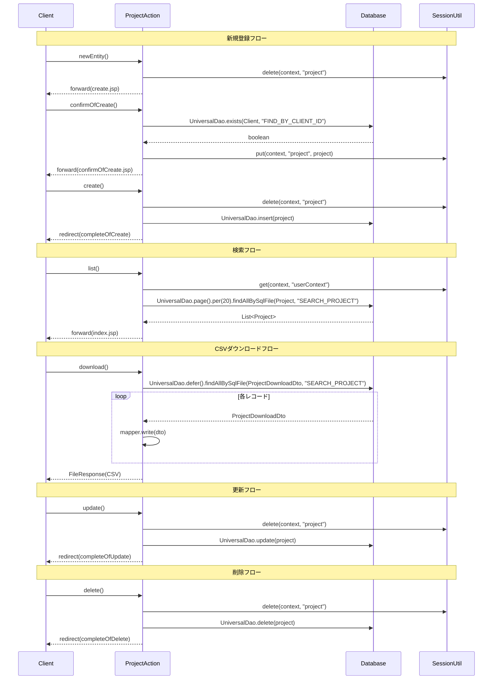

# Code Analysis: ProjectAction

**Generated**: 2026-03-31 15:43:32
**Target**: プロジェクト検索・登録・更新・削除機能を提供するウェブアクション
**Modules**: nablarch-example-web
**Analysis Duration**: approx. 4m 37s

---

## Overview

`ProjectAction` はNablarch 5ウェブアプリケーションにおけるプロジェクト管理機能の中心的なアクションクラスである。プロジェクトの検索・一覧表示、新規登録、更新、削除、およびCSVダウンロードの5つの主要機能を実装する。

各機能は確認画面付きのPRGパターン（Post/Redirect/Get）を採用し、二重サブミット防止（`@OnDoubleSubmission`）とセッションストアを活用した入力値の受け渡しを行う。`UniversalDao` によるDB操作、`InjectForm` による入力バリデーション、`SessionUtil` によるセッション管理、`ObjectMapper` によるCSV出力といったNablarchの主要コンポーネントを組み合わせている。

---

## Architecture

### Dependency Graph

```mermaid
classDiagram
    class ProjectAction
    class ProjectProfit
    class ProjectForm
    class ProjectSearchForm
    class ProjectTargetForm
    class ProjectUpdateForm
    class ProjectDto
    class ProjectSearchDto
    class ProjectDownloadDto
    class TempFileUtil
    class Project {
        <<Entity>>
    }
    class Client {
        <<Entity>>
    }
    class UniversalDao {
        <<Nablarch>>
    }
    class SessionUtil {
        <<Nablarch>>
    }
    class BeanUtil {
        <<Nablarch>>
    }
    class ObjectMapper {
        <<Nablarch>>
    }
    class FileResponse {
        <<Nablarch>>
    }
    class DeferredEntityList {
        <<Nablarch>>
    }

    ProjectAction ..> ProjectForm : validates
    ProjectAction ..> ProjectSearchForm : validates
    ProjectAction ..> ProjectTargetForm : validates
    ProjectAction ..> ProjectUpdateForm : validates
    ProjectAction ..> ProjectDto : creates
    ProjectAction ..> ProjectSearchDto : creates
    ProjectAction ..> ProjectDownloadDto : creates
    ProjectAction ..> ProjectProfit : creates
    ProjectAction ..> Project : persists
    ProjectAction ..> Client : queries
    ProjectAction ..> UniversalDao : queries/persists
    ProjectAction ..> SessionUtil : manages session
    ProjectAction ..> BeanUtil : copies properties
    ProjectAction ..> ObjectMapper : serializes CSV
    ProjectAction ..> FileResponse : creates response
    ProjectAction ..> DeferredEntityList : lazy loads
    ProjectAction ..> TempFileUtil : creates temp file
    ProjectSearchDto --|> ProjectSearchForm : mapped from
```



**Note**: This diagram uses Mermaid `classDiagram` syntax to show class names and their relationships. Use `--|>` for inheritance (extends/implements) and `..>` for dependencies (uses/creates).

### Component Summary

| Component | Role | Type | Dependencies |
|-----------|------|------|--------------|
| ProjectAction | プロジェクトCRUD+CSVダウンロードのメインアクション | Action | UniversalDao, SessionUtil, BeanUtil, ObjectMapper, FileResponse |
| ProjectProfit | プロジェクト利益計算（売上総利益・営業利益・利益率） | Utility | なし（純粋計算クラス） |
| ProjectForm | プロジェクト新規登録フォーム（バリデーション付き） | Form | DateRangeValidator |
| ProjectSearchForm | プロジェクト検索条件フォーム（ページング・ソート対応） | Form | SearchFormBase |
| ProjectTargetForm | プロジェクト特定用フォーム（projectIdのみ） | Form | なし |
| ProjectUpdateForm | プロジェクト更新フォーム（バリデーション付き） | Form | なし |
| ProjectDto | プロジェクト表示用DTO | DTO | なし |
| ProjectSearchDto | プロジェクト検索条件DTO（SQLバインド用） | DTO | なし |
| ProjectDownloadDto | CSVダウンロード用DTO（@Csvアノテーション付き） | DTO | なし |
| TempFileUtil | 一時ファイル作成ユーティリティ | Utility | なし |
| Project | プロジェクトエンティティ（DB永続化対象） | Entity | なし |
| Client | 顧客エンティティ（DB参照用） | Entity | なし |

---

## Flow

### Processing Flow

ProjectActionは以下6つのフロー群で構成される。

**1. 新規登録フロー**
- `newEntity()`: セッションのproject削除後、登録画面を表示
- `confirmOfCreate()` [@InjectForm, @OnError]: フォームバリデーション → 顧客ID存在確認（`UniversalDao.exists()`）→ プロジェクトBeanをセッションに格納 → 確認画面表示
- `create()` [@OnDoubleSubmission]: セッションからproject取得・削除 → `UniversalDao.insert()` → 完了画面へリダイレクト
- `completeOfCreate()`: 完了画面表示
- `backToNew()`: セッションからprojectを読み取り、入力画面へ戻る

**2. 検索・一覧フロー**
- `index()`: 初期ページ番号・ソートキーを設定し、`searchProject()`を呼び出して一覧表示
- `list()` [@InjectForm, @OnError]: 検索フォームバリデーション → `searchProject()`で検索実行 → 一覧表示
- `searchProject()`（privateヘルパー）: セッションからユーザーIDを取得し、`UniversalDao.page().per().findAllBySqlFile()`でページング検索

**3. CSVダウンロードフロー**
- `download()` [@InjectForm, @OnError]: 検索条件を取得 → 一時ファイル作成（`TempFileUtil`）→ `UniversalDao.defer()`で遅延ロード → `ObjectMapper.write()`でCSV書き出し → `FileResponse`でダウンロード応答

**4. 詳細表示フロー**
- `show()` [@InjectForm]: プロジェクトIDでDB検索 → ProjectProfitを計算してリクエストスコープにセット → 詳細画面表示

**5. 更新フロー**
- `edit()` [@InjectForm]: セッションのproject削除 → DBから現在値取得 → セッションに格納 → 更新画面表示
- `confirmOfUpdate()` [@InjectForm, @OnError]: フォームバリデーション → 顧客ID存在確認 → セッションのprojectをBeanUtil.copy()で更新 → 確認画面表示
- `update()` [@OnDoubleSubmission]: セッションからproject取得・削除 → `UniversalDao.update()`（楽観的ロック） → 完了画面へリダイレクト
- `completeOfUpdate()`: 完了画面表示
- `backToEdit()`: セッションからprojectを読み取り、更新画面へ戻る

**6. 削除フロー**
- `delete()` [@OnDoubleSubmission]: セッションからproject取得・削除 → `UniversalDao.delete()` → 完了画面へリダイレクト
- `completeOfDelete()`: 完了画面表示

### Sequence Diagram



---

## Components

### ProjectAction

**ファイル**: [ProjectAction.java](../../.lw/nab-official/v5/nablarch-example-web/src/main/java/com/nablarch/example/app/web/action/ProjectAction.java)

**役割**: プロジェクトのCRUD操作（検索・登録・更新・削除）とCSVダウンロードを処理するメインアクションクラス。Nablarchウェブアプリケーションのアクションとして、HTTPリクエストを受け取りレスポンスを返す。

**主要メソッド**:
- `newEntity()` (L50-55): プロジェクト登録初期画面表示。セッションのproject削除後に登録フォームへフォワード
- `confirmOfCreate()` (L64-92): [@InjectForm, @OnError] 登録確認処理。フォームバリデーション→顧客存在確認→セッション格納→確認画面表示
- `create()` (L101-108): [@OnDoubleSubmission] 登録実行。セッションからproject取得削除→DB insert→リダイレクト
- `list()` (L176-187): [@InjectForm, @OnError] 検索実行。バリデーション済みフォームから検索条件生成→`searchProject()`呼び出し
- `download()` (L217-243): [@InjectForm, @OnError] CSVダウンロード。遅延ロードで検索→ObjectMapperでCSV書き出し→FileResponse返却
- `show()` (L252-271): [@InjectForm] 詳細表示。DBからProjectDto取得→ProjectProfit計算→詳細画面表示
- `update()` (L371-376): [@OnDoubleSubmission] 更新実行。セッションからproject取得削除→DB update（楽観的ロック）→リダイレクト
- `delete()` (L396-402): [@OnDoubleSubmission] 削除実行。セッションからproject取得削除→DB delete→リダイレクト
- `searchProject()` (L198-208): プライベートヘルパー。セッションからユーザーID取得→ページング検索実行

**依存関係**: UniversalDao, SessionUtil, BeanUtil, ObjectMapper, ObjectMapperFactory, FileResponse, DeferredEntityList, TempFileUtil, ApplicationException, MessageUtil

---

### ProjectProfit

**ファイル**: [ProjectProfit.java](../../.lw/nab-official/v5/nablarch-example-web/src/main/java/com/nablarch/example/app/web/action/ProjectProfit.java)

**役割**: プロジェクトの財務情報（売上高・売上原価・販管費・本社配賦）から各種利益を計算する値オブジェクト。Nablarch依存なし。

**主要メソッド**:
- `getGrossProfit()` (L49-54): 売上総利益（売上高 - 売上原価）を計算。nullあり時はnull返却
- `getProfitBeforeAllocation()` (L62-67): 配賦前利益（売上高 - 売上原価 - 販管費）を計算
- `getOperatingProfit()` (L95-100): 営業利益（売上高 - 全費用）を計算
- `getOperatingProfitRate()` (L108-120): 営業利益率を小数点3桁で計算。売上高ゼロ時はBigDecimal.ZERO返却

---

### ProjectForm

**ファイル**: [ProjectForm.java](../../.lw/nab-official/v5/nablarch-example-web/src/main/java/com/nablarch/example/app/web/form/ProjectForm.java)

**役割**: プロジェクト新規登録用フォーム。Bean Validationアノテーション（`@Required`, `@Domain`）によるバリデーションと、プロジェクト期間の相関バリデーション（`@AssertTrue`）を実装。

**主要メソッド**:
- `hasClientId()` (L141-143): 顧客IDの有無を確認（DBバリデーション条件判定に使用）
- `isValidProjectPeriod()` (L354-357): プロジェクト開始日と終了日の前後関係を検証（`DateRangeValidator`を使用）

---

### ProjectSearchForm

**ファイル**: [ProjectSearchForm.java](../../.lw/nab-official/v5/nablarch-example-web/src/main/java/com/nablarch/example/app/web/form/ProjectSearchForm.java)

**役割**: プロジェクト検索条件フォーム。`SearchFormBase`を継承し、ページング情報を管理。ソートIDの解析・生成ロジックを実装。複数選択可能なプロジェクト分類フィールド（内部クラス`ProjectClass`）を保持。

**主要メソッド**:
- `getSortId()` (L275-282): sortKeyとsortDirからソートIDを生成（例: "idAsc", "nameDesc"）
- `setSortId()` (L289-303): ソートIDからsortKeyとsortDirを解析

---

## Nablarch Framework Usage

### UniversalDao

**クラス**: `nablarch.common.dao.UniversalDao`

**説明**: SQL外部ファイルを使用したDB操作（検索・登録・更新・削除）を提供するNablarchのユニバーサルDAOコンポーネント。主キー条件操作からSQLID指定の複雑なクエリまで対応する。

**使用方法**:
```java
// ページング検索
List<Project> list = UniversalDao
    .page(pageNumber)
    .per(20L)
    .findAllBySqlFile(Project.class, "SEARCH_PROJECT", searchCondition);

// 存在確認
boolean exists = UniversalDao.exists(Client.class, "FIND_BY_CLIENT_ID", new Object[]{clientId});

// 登録・更新・削除
UniversalDao.insert(project);
UniversalDao.update(project);  // 楽観的ロック実行
UniversalDao.delete(project);  // 主キー条件で削除

// 遅延ロード（大量データ）
try (DeferredEntityList<ProjectDownloadDto> list =
        (DeferredEntityList<ProjectDownloadDto>) UniversalDao.defer()
            .findAllBySqlFile(ProjectDownloadDto.class, "SEARCH_PROJECT", condition)) {
    for (ProjectDownloadDto dto : list) { ... }
}
```

**重要ポイント**:
- ✅ **ページングは `page()` + `per()` のチェーン**: `UniversalDao.page(n).per(20L).findAllBySqlFile(...)` の順で呼び出す
- ⚠️ **遅延ロード時は必ずtry-with-resources**: `DeferredEntityList`は`close()`が必要。サーバサイドカーソルを使用するため、トランザクション制御中のカーソルクローズに注意
- ✅ **楽観的ロックは自動**: `@Version`アノテーション付きエンティティで`update()`を呼ぶと自動的にVERSION条件でロックチェック
- 💡 **delete()は主キー削除のみ**: 主キー以外の条件削除はSQLを別途作成して実行する必要がある
- ⚡ **ページング時にCOUNTクエリが発行**: 件数取得SQLが自動生成されるため、高負荷な場合はカスタムCOUNT SQLを定義可能

**このコードでの使い方**:
- `confirmOfCreate()`/`confirmOfUpdate()`: `exists()`で顧客IDの存在確認
- `searchProject()`: `page().per(20).findAllBySqlFile()`でページング検索
- `show()`/`edit()`: `findBySqlFile()`で単件取得
- `backToNew()`/`backToEdit()`: `findById()`で顧客情報取得
- `create()`: `insert()`でプロジェクト登録
- `update()`: `update()`でプロジェクト更新（楽観的ロック）
- `delete()`: `delete()`でプロジェクト削除
- `download()`: `defer().findAllBySqlFile()`で遅延ロード検索

**詳細**: [ユニバーサルDAO](../../.claude/skills/nabledge-5/docs/component/libraries/libraries-universal_dao.md)

---

### SessionUtil

**クラス**: `nablarch.common.web.session.SessionUtil`

**説明**: Nablarchウェブアプリケーションのセッションストアへのアクセスユーティリティ。オブジェクトのput/get/deleteをタイプセーフに行う。

**使用方法**:
```java
// セッションへ格納
SessionUtil.put(context, "project", project);

// セッションから取得
Project project = SessionUtil.get(context, "project");
LoginUserPrincipal userContext = SessionUtil.get(context, "userContext");

// セッションから取得して削除
Project project = SessionUtil.delete(context, "project");
```

**重要ポイント**:
- ✅ **確認→実行フローでは `delete()` で取得**: 二重実行防止と不要データ削除を兼ねて`delete()`を使用する
- ⚠️ **登録/更新開始時にセッションを明示的に削除**: `newEntity()`と`edit()`の先頭で旧セッションを`delete()`して不整合を防ぐ
- 💡 **PRGパターンでのデータ受け渡し**: フォーム入力→確認→実行の画面遷移でセッションが活躍する

**このコードでの使い方**:
- `newEntity()`: 旧セッションの`project`を`delete()`でクリア
- `confirmOfCreate()`: 確認画面用に`project`を`put()`
- `create()`: 実行時に`project`を`delete()`で取得（同時に削除）
- `searchProject()`: `userContext`を`get()`でログインユーザー情報取得
- 全機能でログインユーザー情報(`userContext`)を`get()`で取得

---

### InjectForm / OnError

**クラス**: `nablarch.common.web.interceptor.InjectForm`, `nablarch.fw.web.interceptor.OnError`

**説明**: アクションメソッドへのリクエストパラメータのバリデーションとフォームインジェクションを行うインターセプタ。バリデーションエラー時のフォワード先を`@OnError`で指定。

**使用方法**:
```java
@InjectForm(form = ProjectSearchForm.class, prefix = "searchForm", name = "searchForm")
@OnError(type = ApplicationException.class, path = "/WEB-INF/view/project/index.jsp")
public HttpResponse list(HttpRequest request, ExecutionContext context) {
    ProjectSearchForm searchForm = context.getRequestScopedVar("searchForm");
    // ...
}
```

**重要ポイント**:
- ✅ **外部入力は必ず`@InjectForm`**: バリデーション済みフォームをリクエストスコープから取得する
- ⚠️ **`name`属性でスコープ変数名を指定**: `prefix`はリクエストパラメータのプレフィックス、`name`はスコープへの格納名
- 💡 **`@OnError`でエラー遷移先を宣言的に指定**: バリデーションエラー時のフォワード先をアノテーションで明示できる

**このコードでの使い方**:
- 全ての入力受け付けメソッド（`confirmOfCreate`, `list`, `download`, `show`, `edit`, `confirmOfUpdate`）に適用
- `searchForm`プレフィックスの検索条件フォームでは`name`属性で`"searchForm"`を指定

---

### OnDoubleSubmission

**クラス**: `nablarch.common.web.token.OnDoubleSubmission`

**説明**: 二重サブミット防止のインターセプタ。トークンチェックにより同一リクエストの重複実行を防ぐ。

**使用方法**:
```java
@OnDoubleSubmission
public HttpResponse create(HttpRequest request, ExecutionContext context) {
    // 登録・更新・削除処理
}
```

**重要ポイント**:
- ✅ **DB変更を伴うメソッドには必ず付与**: `create()`, `update()`, `delete()` の全DB更新メソッドに適用する
- 💡 **PRGパターンと組み合わせる**: `@OnDoubleSubmission`でトークン検証後、処理完了後はリダイレクトでブラウザ更新による再実行を防ぐ

**このコードでの使い方**:
- `create()`、`update()`、`delete()`の3メソッドに`@OnDoubleSubmission`を付与

---

### ObjectMapper / ObjectMapperFactory

**クラス**: `nablarch.common.databind.ObjectMapper`, `nablarch.common.databind.ObjectMapperFactory`

**説明**: DTOとCSV/固定長ファイルのシリアライズ・デシリアライズを行うデータバインドコンポーネント。`@Csv`/`@CsvFormat`アノテーションで宣言的にフォーマットを定義する。

**使用方法**:
```java
final Path path = TempFileUtil.createTempFile();
try (DeferredEntityList<ProjectDownloadDto> searchList = ...;
     ObjectMapper<ProjectDownloadDto> mapper = ObjectMapperFactory.create(
         ProjectDownloadDto.class, TempFileUtil.newOutputStream(path))) {
    for (ProjectDownloadDto dto : searchList) {
        mapper.write(dto);
    }
}
FileResponse response = new FileResponse(path.toFile(), true);
response.setContentType("text/csv; charset=Shift_JIS");
response.setContentDisposition("プロジェクト一覧.csv");
```

**重要ポイント**:
- ✅ **try-with-resourcesで確実にclose()**: `ObjectMapper`はバッファを持つためクローズを忘れるとデータが欠損する
- ✅ **FileResponse第二引数はtrue**: `new FileResponse(path.toFile(), true)`でリクエスト処理後に一時ファイルを自動削除する
- ⚠️ **大量データは遅延ロードと組み合わせる**: `UniversalDao.defer()`で遅延ロードしてからObjectMapperで書き出すことでメモリ圧迫を防ぐ
- 💡 **Content-TypeとContent-Dispositionを明示設定**: ブラウザが正しくダウンロードファイルとして扱えるよう、レスポンスヘッダを設定する

**このコードでの使い方**:
- `download()`: 一時ファイルへのOutputStreamにObjectMapperを作成し、検索結果を順次CSV書き出し

---

### BeanUtil

**クラス**: `nablarch.core.beans.BeanUtil`

**説明**: JavaBeans間のプロパティコピーと型変換を行うユーティリティ。同名プロパティの自動マッピングにより、Form→DTO→Entity間の値受け渡しを簡潔に記述できる。

**使用方法**:
```java
// コピーしながら新規インスタンス生成
Project project = BeanUtil.createAndCopy(Project.class, form);
ProjectDto dto = BeanUtil.createAndCopy(ProjectDto.class, project);

// 既存インスタンスにコピー
BeanUtil.copy(form, project);
```

**重要ポイント**:
- 💡 **同名プロパティは自動マッピング**: フォームとエンティティのプロパティ名を合わせることで自動コピーが機能する
- ✅ **型変換も自動**: String→Integer等の型変換を自動で処理するため、フォームはString型で宣言しエンティティ側で型を定義できる

**このコードでの使い方**:
- `confirmOfCreate()`: `BeanUtil.createAndCopy(Project.class, form)`でフォームからエンティティを生成
- `backToNew()`/`backToEdit()`: セッションのProjectをProjectDtoに変換して入力画面へ戻す
- `edit()`: DBから取得したProjectDtoをProjectエンティティに変換してセッションへ格納
- `confirmOfUpdate()`: `BeanUtil.copy(form, project)`で更新フォームの値をセッションのprojectに上書き

---

## References

### Source Files

- [ProjectAction.java](../../.lw/nab-official/v5/nablarch-example-web/src/main/java/com/nablarch/example/app/web/action/ProjectAction.java)
- [ProjectProfit.java](../../.lw/nab-official/v5/nablarch-example-web/src/main/java/com/nablarch/example/app/web/action/ProjectProfit.java)
- [ProjectForm.java](../../.lw/nab-official/v5/nablarch-example-web/src/main/java/com/nablarch/example/app/web/form/ProjectForm.java)
- [ProjectSearchForm.java](../../.lw/nab-official/v5/nablarch-example-web/src/main/java/com/nablarch/example/app/web/form/ProjectSearchForm.java)
- [ProjectTargetForm.java](../../.lw/nab-official/v5/nablarch-example-web/src/main/java/com/nablarch/example/app/web/form/ProjectTargetForm.java)
- [ProjectUpdateForm.java](../../.lw/nab-official/v5/nablarch-example-web/src/main/java/com/nablarch/example/app/web/form/ProjectUpdateForm.java)
- [ProjectDto.java](../../.lw/nab-official/v5/nablarch-example-web/src/main/java/com/nablarch/example/app/web/dto/ProjectDto.java)
- [ProjectSearchDto.java](../../.lw/nab-official/v5/nablarch-example-web/src/main/java/com/nablarch/example/app/web/dto/ProjectSearchDto.java)
- [ProjectDownloadDto.java](../../.lw/nab-official/v5/nablarch-example-web/src/main/java/com/nablarch/example/app/web/dto/ProjectDownloadDto.java)
- [TempFileUtil.java](../../.lw/nab-official/v5/nablarch-example-web/src/main/java/com/nablarch/example/app/web/common/file/TempFileUtil.java)

### Knowledge Base (Nabledge-5)

- [プロジェクトダウンロード機能](../../.claude/skills/nabledge-5/docs/processing-pattern/web-application/web-application-getting-started-project-download.md) - CSVダウンロード実装パターン
- [プロジェクト検索機能](../../.claude/skills/nabledge-5/docs/processing-pattern/web-application/web-application-getting-started-project-search.md) - ページング検索実装パターン
- [プロジェクト更新機能](../../.claude/skills/nabledge-5/docs/processing-pattern/web-application/web-application-getting-started-project-update.md) - 更新・楽観的ロック・二重サブミット防止
- [プロジェクト削除機能](../../.claude/skills/nabledge-5/docs/processing-pattern/web-application/web-application-getting-started-project-delete.md) - 削除処理パターン
- [データバインド](../../.claude/skills/nabledge-5/docs/component/libraries/libraries-data_bind.md) - ObjectMapper・FileResponseの詳細
- [ユニバーサルDAO](../../.claude/skills/nabledge-5/docs/component/libraries/libraries-universal_dao.md) - UniversalDao・ページング・遅延ロードの詳細

### Official Documentation

- [プロジェクトダウンロード機能実装](https://nablarch.github.io/docs/LATEST/doc/application_framework/application_framework/web/getting_started/project_download/index.html)
- [プロジェクト検索機能実装](https://nablarch.github.io/docs/LATEST/doc/application_framework/application_framework/web/getting_started/project_search/index.html)
- [プロジェクト更新機能実装](https://nablarch.github.io/docs/LATEST/doc/application_framework/application_framework/web/getting_started/project_update/index.html)
- [プロジェクト削除機能実装](https://nablarch.github.io/docs/LATEST/doc/application_framework/application_framework/web/getting_started/project_delete/index.html)
- [UniversalDao](https://nablarch.github.io/docs/LATEST/doc/application_framework/application_framework/libraries/database/universal_dao.html)
- [UniversalDao Javadoc](https://nablarch.github.io/docs/LATEST/javadoc/nablarch/common/dao/UniversalDao.html)
- [データバインド](https://nablarch.github.io/docs/LATEST/doc/application_framework/application_framework/libraries/data_io/data_bind.html)
- [ObjectMapper Javadoc](https://nablarch.github.io/docs/LATEST/javadoc/nablarch/common/databind/ObjectMapper.html)
- [FileResponse Javadoc](https://nablarch.github.io/docs/LATEST/javadoc/nablarch/common/web/download/FileResponse.html)
- [OnDoubleSubmission Javadoc](https://nablarch.github.io/docs/LATEST/javadoc/nablarch/common/web/token/OnDoubleSubmission.html)
- [InjectForm Javadoc](https://nablarch.github.io/docs/LATEST/javadoc/nablarch/common/web/interceptor/InjectForm.html)
- [DeferredEntityList Javadoc](https://nablarch.github.io/docs/LATEST/javadoc/nablarch/common/dao/DeferredEntityList.html)

---

**Output**: `.nabledge/20260331/code-analysis-ProjectAction.md`

**Note**: This documentation was generated by the code-analysis workflow of the nabledge-5 skill.