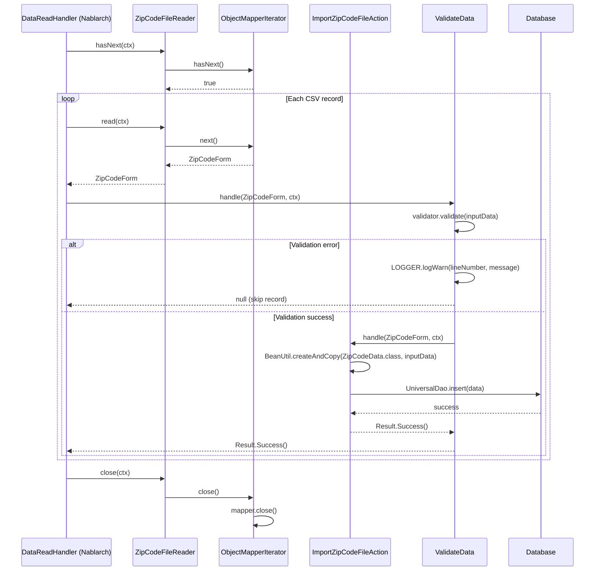

# Code Analysis: ImportZipCodeFileAction

**Generated**: 2026-03-31 15:55:30
**Target**: 住所CSVファイルをDBに一括登録するNablarchバッチアクション
**Modules**: nablarch-example-batch
**Analysis Duration**: approx. 5m 56s

---

## Overview

`ImportZipCodeFileAction` は、住所（郵便番号）CSVファイルをDBに登録するNablarchバッチアクションクラスである。`BatchAction<ZipCodeForm>` を継承し、CSVファイルから1行ずつ読み込んだデータをバリデーションしてDBに登録する。

主要コンポーネントは以下の3つで構成される:
- **ImportZipCodeFileAction**: バッチアクション本体。`handle()` でDB登録、`createReader()` でデータリーダを生成する
- **ZipCodeFileReader**: CSVファイル読み込み用のカスタムデータリーダ。`ObjectMapperFactory` と `ObjectMapperIterator` を組み合わせてファイルを1行ずつ提供する
- **ZipCodeForm**: CSVバインディングとBean Validationを兼ねるフォームクラス。`@Csv`/`@CsvFormat` でCSVフォーマットを定義し、`@Domain`/`@Required` でバリデーションルールを定義する

バリデーションは `@ValidateData` インターセプタで自動実行され、エラー時はWARNログを出力してそのレコードをスキップする。

---

## Architecture

### Dependency Graph

```mermaid
classDiagram
    class ImportZipCodeFileAction {
        <<BatchAction>>
    }
    class ZipCodeFileReader {
        <<DataReader>>
    }
    class ObjectMapperIterator {
        <<Iterator>>
    }
    class ZipCodeForm {
        <<Form>>
    }
    class ValidateData {
        <<Interceptor>>
    }
    class BatchAction {
        <<Nablarch>>
    }
    class UniversalDao {
        <<Nablarch>>
    }
    class BeanUtil {
        <<Nablarch>>
    }
    class ObjectMapperFactory {
        <<Nablarch>>
    }
    class FilePathSetting {
        <<Nablarch>>
    }
    class ZipCodeData {
        <<Entity>>
    }

    ImportZipCodeFileAction --|> BatchAction : extends
    ImportZipCodeFileAction ..> ZipCodeFileReader : creates
    ImportZipCodeFileAction ..> BeanUtil : copies form to entity
    ImportZipCodeFileAction ..> UniversalDao : inserts
    ImportZipCodeFileAction ..> ZipCodeData : persists
    ImportZipCodeFileAction ..> ValidateData : intercepted by
    ZipCodeFileReader ..|> DataReader : implements
    ZipCodeFileReader ..> ObjectMapperIterator : delegates
    ZipCodeFileReader ..> ObjectMapperFactory : creates reader
    ZipCodeFileReader ..> FilePathSetting : resolves file path
    ObjectMapperIterator ..> ZipCodeForm : reads
    ValidateData ..> ZipCodeForm : validates
```



**Note**: This diagram uses Mermaid `classDiagram` syntax to show class names and their relationships. Use `--|>` for inheritance (extends/implements) and `..>` for dependencies (uses/creates).

### Component Summary

| Component | Role | Type | Dependencies |
|-----------|------|------|--------------|
| ImportZipCodeFileAction | CSVデータのDB登録バッチアクション | Action (BatchAction) | ZipCodeFileReader, BeanUtil, UniversalDao, ZipCodeData |
| ZipCodeFileReader | 住所CSVファイル読み込みデータリーダ | DataReader | ObjectMapperIterator, ObjectMapperFactory, FilePathSetting |
| ObjectMapperIterator | ObjectMapperをIteratorとして扱うアダプタ | Iterator | ObjectMapper (Nablarch) |
| ZipCodeForm | CSVバインディング＋バリデーション用フォーム | Form | @Csv, @CsvFormat, @Domain, @Required |
| ValidateData | Bean Validationを実行するインターセプタ | Interceptor | ValidatorUtil, BeanUtil, Logger |

---

## Flow

### Processing Flow

Nablarchバッチフレームワークのハンドラキューがループ処理を制御する。処理の流れは以下のとおり:

1. **ハンドラキュー起動**: `Main` がハンドラキューを実行し、`DataReadHandler` が `ZipCodeFileReader` を呼び出す
2. **ファイル読み込み** (`ZipCodeFileReader`):
   - `read()` 初回呼び出し時に `initialize()` で `FilePathSetting` からCSVファイルのパスを取得
   - `ObjectMapperFactory.create()` で `ObjectMapper<ZipCodeForm>` を生成
   - `ObjectMapperIterator` に `ObjectMapper` を渡し、ラップする
   - 以降の呼び出しでは `iterator.next()` で1行分の `ZipCodeForm` を返す
3. **バリデーション** (`@ValidateData` インターセプタ):
   - `ValidatorUtil.getValidator()` で `Validator` を取得
   - `validator.validate(inputData)` でBean Validationを実行
   - バリデーションエラーがある場合: 行番号と違反内容をWARNログに出力し、`null` を返してそのレコードをスキップ
   - バリデーション成功: 後続の `handle()` を呼び出す
4. **DB登録** (`ImportZipCodeFileAction.handle()`):
   - `BeanUtil.createAndCopy(ZipCodeData.class, inputData)` でフォームをエンティティにコピー
   - `UniversalDao.insert(data)` でエンティティをDBに登録
   - `Result.Success()` を返す
5. **ループ制御**: `ZipCodeFileReader.hasNext()` が `false` を返すまで2〜4を繰り返す
6. **クローズ** (`ZipCodeFileReader.close()`): `ObjectMapperIterator.close()` → `ObjectMapper.close()` でリソースを解放

### Sequence Diagram



---

## Components

### ImportZipCodeFileAction

**ファイル**: [ImportZipCodeFileAction.java](../../.lw/nab-official/v5/nablarch-example-batch/src/main/java/com/nablarch/example/app/batch/action/ImportZipCodeFileAction.java)

**役割**: CSVから読み込んだ住所データを1件ずつDBに登録するバッチアクション

**キーメソッド**:
- `handle(ZipCodeForm inputData, ExecutionContext ctx)` (L35-40): `@ValidateData` インターセプタによりバリデーション済みデータを受け取り、`BeanUtil.createAndCopy` でエンティティに変換して `UniversalDao.insert` で登録する
- `createReader(ExecutionContext ctx)` (L50-52): `ZipCodeFileReader` のインスタンスを生成して返す

**依存関係**:
- `ZipCodeFileReader` (プロジェクトコード): データリーダ
- `ZipCodeForm` (プロジェクトコード): 入力フォーム（バリデーション付き）
- `ZipCodeData` (エンティティ): DB登録対象エンティティ
- `BeanUtil` (Nablarch): フォーム→エンティティのプロパティコピー
- `UniversalDao` (Nablarch): DB登録
- `ValidateData` (プロジェクト): バリデーションインターセプタ

**実装ポイント**:
- `@ValidateData` アノテーションを `handle()` に付与することでバリデーション処理をインターセプタに委譲し、アクション本体は登録ロジックのみに集中できる
- `BatchAction<ZipCodeForm>` の型パラメータで入力データ型を指定する

---

### ZipCodeFileReader

**ファイル**: [ZipCodeFileReader.java](../../.lw/nab-official/v5/nablarch-example-batch/src/main/java/com/nablarch/example/app/batch/reader/ZipCodeFileReader.java)

**役割**: 住所CSVファイルを1行ずつ読み込む `DataReader` 実装クラス

**キーメソッド**:
- `read(ExecutionContext ctx)` (L40-44): `iterator.next()` で次の `ZipCodeForm` を返す。初回は `initialize()` を呼び出す
- `hasNext(ExecutionContext ctx)` (L54-58): `iterator.hasNext()` で次行の有無を返す
- `close(ExecutionContext ctx)` (L68-70): `iterator.close()` でリソースを解放する
- `initialize()` (L78-88): `FilePathSetting` でCSVファイルを取得し、`ObjectMapperFactory.create()` で `ObjectMapper` を生成して `ObjectMapperIterator` にラップする

**依存関係**:
- `ZipCodeForm` (プロジェクトコード): バインディング対象フォーム
- `ObjectMapperIterator` (プロジェクトコード): `ObjectMapper` のIteratorアダプタ
- `ObjectMapperFactory` (Nablarch): `ObjectMapper` の生成
- `FilePathSetting` (Nablarch): ファイルパスの解決

---

### ObjectMapperIterator

**ファイル**: [ObjectMapperIterator.java](../../.lw/nab-official/v5/nablarch-example-batch/src/main/java/com/nablarch/example/app/batch/reader/iterator/ObjectMapperIterator.java)

**役割**: `ObjectMapper<E>` を `Iterator<E>` として扱うアダプタクラス

**キーメソッド**:
- コンストラクタ (L32-37): `ObjectMapper` を受け取り、初回データをプリフェッチする
- `hasNext()` (L44-46): `form != null` で次行の有無を判定
- `next()` (L54-60): 現在の `form` を返し、次のデータをプリフェッチする
- `close()` (L65-67): `mapper.close()` でリソースを解放する

---

### ZipCodeForm

**ファイル**: [ZipCodeForm.java](../../.lw/nab-official/v5/nablarch-example-batch/src/main/java/com/nablarch/example/app/batch/form/ZipCodeForm.java)

**役割**: CSVバインディングとBean Validationを兼ねるフォームクラス。15フィールドのCSV列定義と各フィールドのバリデーションルールを保持する

**主要アノテーション** (L17-23):
- `@Csv`: CSVプロパティ定義と `CsvType.CUSTOM` 指定
- `@CsvFormat`: 文字コードUTF-8、カンマ区切り、CRLF改行、クォートモードNORMAL などの詳細フォーマット指定
- `@Domain` / `@Required`: 各フィールドのバリデーションルール
- `@LineNumber` (L143): `getLineNumber()` に付与し、エラー時の行番号取得に使用

---

### ValidateData

**ファイル**: [ValidateData.java](../../.lw/nab-official/v5/nablarch-example-batch/src/main/java/com/nablarch/example/app/batch/interceptor/ValidateData.java)

**役割**: `handle()` メソッドをインターセプトしてBean Validationを実行するアノテーション型インターセプタ

**処理内容** (ValidateDataImpl.handle, L60-91):
1. `ValidatorUtil.getValidator()` でバリデータを取得
2. `validator.validate(data)` でバリデーション実行
3. バリデーションエラーなし → `getOriginalHandler().handle(data, context)` で後続処理を呼び出す
4. バリデーションエラーあり → 行番号と違反内容をWARNログに出力し、`null` を返す（そのレコードをスキップ）

---

## Nablarch Framework Usage

### BatchAction

**クラス**: `nablarch.fw.action.BatchAction<TData>`

**説明**: Nablarchバッチの汎用アクションテンプレートクラス。`handle()` と `createReader()` を実装することでデータ読み込みと処理ロジックを定義できる

**使用方法**:
```java
public class ImportZipCodeFileAction extends BatchAction<ZipCodeForm> {
    @Override
    public Result handle(ZipCodeForm inputData, ExecutionContext ctx) {
        // 1レコード分の処理
        return new Result.Success();
    }

    @Override
    public DataReader<ZipCodeForm> createReader(ExecutionContext ctx) {
        return new ZipCodeFileReader();
    }
}
```

**重要ポイント**:
- ✅ **型パラメータで入力型を指定**: `BatchAction<ZipCodeForm>` の型パラメータが `handle()` の引数型になる
- 💡 **ループ制御はフレームワークが担当**: `DataReadHandler` が `DataReader.hasNext()` に基づいてループを制御するため、アクションは1件分の処理のみ実装すればよい
- ⚠️ **`FileBatchAction` との使い分け**: `data_bind` を使う場合は `FileBatchAction` ではなく `BatchAction` を使うこと。`FileBatchAction` は `data_format` モジュール依存

**このコードでの使い方**:
- `handle()` でCSV1行分をDB登録
- `createReader()` で `ZipCodeFileReader` を返す

**詳細**: [Nablarchバッチ アーキテクチャ](../../.claude/skills/nabledge-5/docs/processing-pattern/nablarch-batch/nablarch-batch-architecture.md)

---

### UniversalDao

**クラス**: `nablarch.common.dao.UniversalDao`

**説明**: JPA 2.0アノテーションを使ったNablarchの簡易O/Rマッパー。SQLを書かずに単純なCRUD処理が可能

**使用方法**:
```java
// 1件登録
ZipCodeData data = BeanUtil.createAndCopy(ZipCodeData.class, inputData);
UniversalDao.insert(data);

// 一括登録（大量データ向け）
List<ZipCodeData> dataList = ...;
UniversalDao.batchInsert(dataList);
```

**重要ポイント**:
- ✅ **エンティティにJPAアノテーションが必要**: `@Table`、`@Id`、`@Column` などのJPAアノテーションをエンティティクラスに付与する
- 💡 **SQLを書かずにCRUDが可能**: 登録・主キー検索・更新・削除はSQLなしで実行できる
- ⚠️ **主キー以外の条件での更新・削除不可**: 条件付き更新・削除は `database` モジュールを使うこと
- ⚡ **大量データには `batchInsert` を使う**: ラウンドトリップ削減によりパフォーマンスが向上する

**このコードでの使い方**:
- `handle()` の中で `UniversalDao.insert(data)` を呼び出し、CSVから変換したエンティティを1件ずつ登録する

**詳細**: [ユニバーサルDAO](../../.claude/skills/nabledge-5/docs/component/libraries/libraries-universal_dao.md)

---

### ObjectMapperFactory / ObjectMapper (data_bind)

**クラス**: `nablarch.common.databind.ObjectMapperFactory`, `nablarch.common.databind.ObjectMapper`

**説明**: CSVやTSV、固定長データをJava BeansオブジェクトとしてバインドするNablarchのデータバインドモジュール。フォーマット定義はアノテーションで宣言的に記述できる

**使用方法** (読み込み):
```java
// ObjectMapper生成（アノテーション定義のZipCodeFormにバインド）
ObjectMapper<ZipCodeForm> mapper = ObjectMapperFactory.create(ZipCodeForm.class, inputStream);

// 1行ずつ読み込む
ZipCodeForm form;
while ((form = mapper.read()) != null) {
    // 処理
}
mapper.close();
```

**重要ポイント**:
- ✅ **必ず `close()` を呼ぶ**: リソースを解放する。`try-with-resources` の使用を推奨
- ✅ **外部データのプロパティはすべて `String` 型で定義**: 不正データを業務エラーとして扱うため
- ⚠️ **スレッドアンセーフ**: 複数スレッドで `ObjectMapper` を共有する場合は同期処理が必要
- 💡 **アノテーション駆動**: `@Csv`、`@CsvFormat` でフォーマットを宣言的に定義できる
- 🎯 **`DataReader` と組み合わせて使う**: `ObjectMapper` は `hasNext()` を持たないため、`ObjectMapperIterator` のようなアダプタを作ると `DataReader` 実装がシンプルになる

**このコードでの使い方**:
- `ZipCodeFileReader.initialize()` で `ObjectMapperFactory.create(ZipCodeForm.class, fileInputStream)` により `ObjectMapper` を生成
- `ObjectMapperIterator` でラップしてIteratorとして使用
- `ZipCodeFileReader.close()` → `ObjectMapperIterator.close()` → `mapper.close()` でリソース解放

**詳細**: [データバインド](../../.claude/skills/nabledge-5/docs/component/libraries/libraries-data_bind.md)

---

### BeanUtil

**クラス**: `nablarch.core.beans.BeanUtil`

**説明**: Javaクラス間のプロパティコピーやBean変換を行うユーティリティクラス

**使用方法**:
```java
// フォーム → エンティティへのプロパティコピー（同名プロパティを自動マッピング）
ZipCodeData data = BeanUtil.createAndCopy(ZipCodeData.class, inputData);
```

**重要ポイント**:
- ✅ **同名プロパティが自動でコピーされる**: ソースにあってコピー先にないプロパティは無視される
- ⚠️ **型が異なる場合は `ConversionUtil` で変換**: 変換失敗時は実行時例外が発生する
- ⚠️ **`List` 型パラメータ未対応**: `List<T>` 型のプロパティを持つ場合はgetterをオーバーライドする必要がある

**このコードでの使い方**:
- `handle()` で `BeanUtil.createAndCopy(ZipCodeData.class, inputData)` を呼び出し、`ZipCodeForm` の15フィールドを `ZipCodeData` エンティティにコピーする

**詳細**: [BeanUtil](../../.claude/skills/nabledge-5/docs/component/libraries/libraries-bean_util.md)

---

## References

### Source Files

- [ImportZipCodeFileAction.java](../../.lw/nab-official/v5/nablarch-example-batch/src/main/java/com/nablarch/example/app/batch/action/ImportZipCodeFileAction.java) - バッチアクション本体
- [ZipCodeForm.java](../../.lw/nab-official/v5/nablarch-example-batch/src/main/java/com/nablarch/example/app/batch/form/ZipCodeForm.java) - CSVバインディング＋バリデーションフォーム
- [ZipCodeFileReader.java](../../.lw/nab-official/v5/nablarch-example-batch/src/main/java/com/nablarch/example/app/batch/reader/ZipCodeFileReader.java) - カスタムデータリーダ
- [ObjectMapperIterator.java](../../.lw/nab-official/v5/nablarch-example-batch/src/main/java/com/nablarch/example/app/batch/reader/iterator/ObjectMapperIterator.java) - ObjectMapperのIteratorアダプタ
- [ValidateData.java](../../.lw/nab-official/v5/nablarch-example-batch/src/main/java/com/nablarch/example/app/batch/interceptor/ValidateData.java) - バリデーションインターセプタ

### Knowledge Base (Nabledge-5)

- [Nablarch Batch Getting Started](../../.claude/skills/nabledge-5/docs/processing-pattern/nablarch-batch/nablarch-batch-getting-started-nablarch-batch.md)
- [Data Bind](../../.claude/skills/nabledge-5/docs/component/libraries/libraries-data_bind.md)
- [Universal Dao](../../.claude/skills/nabledge-5/docs/component/libraries/libraries-universal_dao.md)
- [Bean Util](../../.claude/skills/nabledge-5/docs/component/libraries/libraries-bean_util.md)
- [Nablarch Batch Architecture](../../.claude/skills/nabledge-5/docs/processing-pattern/nablarch-batch/nablarch-batch-architecture.md)

### Official Documentation

- [Universal DAO](https://nablarch.github.io/docs/LATEST/doc/application_framework/application_framework/libraries/database/universal_dao.html)
- [Data Bind](https://nablarch.github.io/docs/LATEST/doc/application_framework/application_framework/libraries/data_io/data_bind.html)
- [Bean Util](https://nablarch.github.io/docs/LATEST/doc/application_framework/application_framework/libraries/bean_util.html)
- [Nablarch Batch Architecture](https://nablarch.github.io/docs/LATEST/doc/application_framework/application_framework/batch/nablarch_batch/architecture.html)
- [Nablarch Batch Getting Started](https://nablarch.github.io/docs/LATEST/doc/application_framework/application_framework/batch/nablarch_batch/getting_started/nablarch_batch/index.html)
- [BatchAction (Javadoc)](https://nablarch.github.io/docs/LATEST/javadoc/nablarch/fw/action/BatchAction.html)
- [DataReader (Javadoc)](https://nablarch.github.io/docs/LATEST/javadoc/nablarch/fw/DataReader.html)
- [UniversalDao (Javadoc)](https://nablarch.github.io/docs/LATEST/javadoc/nablarch/common/dao/UniversalDao.html)
- [ObjectMapper (Javadoc)](https://nablarch.github.io/docs/LATEST/javadoc/nablarch/common/databind/ObjectMapper.html)
- [ObjectMapperFactory (Javadoc)](https://nablarch.github.io/docs/LATEST/javadoc/nablarch/common/databind/ObjectMapperFactory.html)
- [BeanUtil (Javadoc)](https://nablarch.github.io/docs/LATEST/javadoc/nablarch/core/beans/BeanUtil.html)
- [LineNumber (Javadoc)](https://nablarch.github.io/docs/LATEST/javadoc/nablarch/common/databind/LineNumber.html)

---

**Output**: `.nabledge/20260331/code-analysis-ImportZipCodeFileAction.md`

**Note**: This documentation was generated by the code-analysis workflow of the nabledge-5 skill.