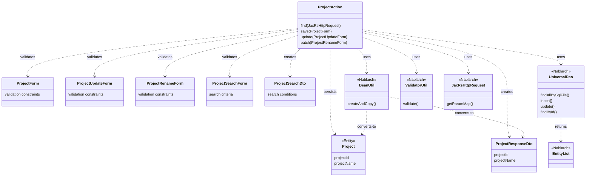
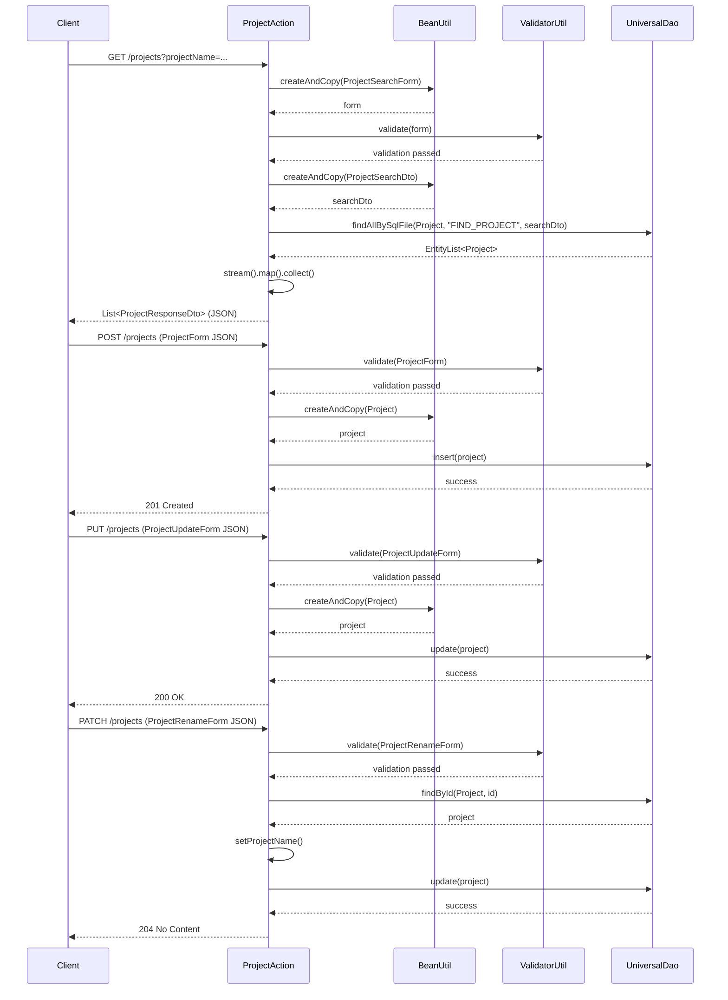

# Code Analysis: ProjectAction

**Generated**: 2026-04-07 15:56:59
**Target**: REST API for project CRUD operations
**Modules**: nablarch-example-rest
**Analysis Duration**: approx. 1m 27s

---

## Overview

ProjectAction is a JAX-RS REST API implementation providing CRUD operations (Create, Read, Update, Patch) for project management. The class demonstrates core Nablarch patterns for RESTful web services including request parameter conversion, validation, bean mapping, and database operations through UniversalDao. Four HTTP endpoint methods handle GET (search), POST (create), PUT (update), and PATCH (partial update) operations on project resources.

---

## Architecture

### Dependency Graph



**Note**: This diagram uses Mermaid `classDiagram` syntax to show class names and their relationships. Use `--|>` for inheritance (extends/implements) and `..>` for dependencies (uses/creates).

### Component Summary

| Component | Role | Type | Dependencies |
|-----------|------|------|--------------|
| ProjectAction | REST API endpoint handler | Action | ProjectForm, ProjectUpdateForm, ProjectRenameForm, ProjectSearchForm, Project, ProjectResponseDto, ProjectSearchDto, UniversalDao, BeanUtil, ValidatorUtil, JaxRsHttpRequest |
| ProjectForm | Create request validation | Form | Standard JSR-303 Bean Validation |
| ProjectUpdateForm | Update request validation | Form | Standard JSR-303 Bean Validation |
| ProjectRenameForm | Partial update validation | Form | Standard JSR-303 Bean Validation |
| ProjectSearchForm | Search criteria validation | Form | Standard JSR-303 Bean Validation |
| Project | Project entity with JPA annotations | Entity | Nablarch Entity support |
| ProjectResponseDto | Project data transfer object | DTO | Holds project data for JSON responses |
| ProjectSearchDto | Search filter DTO | DTO | Passes search criteria to UniversalDao |
| UniversalDao | Simplified O/R mapper operations | Framework | Nablarch database abstraction |
| BeanUtil | Object property copying utility | Framework | Nablarch bean utilities |
| ValidatorUtil | Bean Validation executor | Framework | Nablarch validation support |

---

## Flow

### Processing Flow

**GET /projects** (Line 45-58): Search operation retrieves filtered project list. Request parameters are extracted into ProjectSearchForm via BeanUtil.createAndCopy(), validated using ValidatorUtil.validate(), converted to ProjectSearchDto for database queries, and searched using UniversalDao.findAllBySqlFile() with SQL file reference. Results are streamed, mapped to ProjectResponseDto objects for JSON serialization, and collected into a response list.

**POST /projects** (Line 70-72): Create operation inserts new project. Input ProjectForm undergoes @Valid annotation-triggered validation by JAX-RS handler, converts to Project entity via BeanUtil, inserts via UniversalDao.insert(), and returns 201 Created status.

**PUT /projects** (Line 84-89): Full update operation replaces all project fields. ProjectUpdateForm validates via @Valid, converts to Project entity, updates via UniversalDao.update(), returns 200 OK.

**PATCH /projects** (Line 101-107): Partial update operation modifies only project name. ProjectRenameForm validates, retrieves existing Project by ID via UniversalDao.findById(), updates name property, persists via UniversalDao.update(), returns 204 No Content.

### Sequence Diagram



---

## Components

### ProjectAction (Action Handler)

**File**: [ProjectAction.java](../../.lw/nab-official/v5/nablarch-example-rest/src/main/java/com/nablarch/example/action/ProjectAction.java)

**Role**: REST API endpoint implementation for project resource management

**Key Methods**:
- `find(JaxRsHttpRequest req)` (Line 45-59): GET handler retrieving project list with search filters
- `save(ProjectForm project)` (Line 70-72): POST handler creating new project
- `update(ProjectUpdateForm form)` (Line 84-89): PUT handler updating entire project record
- `patch(ProjectRenameForm form)` (Line 101-107): PATCH handler updating project name only

**Dependencies**: JaxRsHttpRequest, ProjectSearchForm, ProjectForm, ProjectUpdateForm, ProjectRenameForm, UniversalDao, BeanUtil, ValidatorUtil

**Implementation Patterns**: Uses Nablarch REST framework with JAX-RS annotations (@Path, @GET, @POST, @PUT, @PATCH), BeanValidation integration via @Valid, Stream API for collections, and UniversalDao CRUD operations.

### ProjectSearchForm

**Role**: Form object for search request validation with Bean Validation constraints

**Key Usage**: Created from request parameters (Line 48), validated (Line 51), then converted to ProjectSearchDto for database query (Line 53)

### Project Entity

**Role**: JPA-annotated entity representing project persistent data model

**Key Usage**: Result of findAllBySqlFile() query (Line 54), target for insert (Line 71) and update (Line 87), retrieved by findById() (Line 102)

### ProjectResponseDto

**Role**: Data transfer object for JSON response serialization

**Key Usage**: Maps from Project entity (Line 57), collected into response list (Line 58)

---

## Nablarch Framework Usage

### UniversalDao

**Class**: `nablarch.common.dao.UniversalDao`

**Description**: Provides simplified O/R mapping for basic CRUD operations. Internally uses the database library, so database configuration is required before use. Supports querying by JPA-annotated entities, executing SQL from files, and automatic result bean mapping.

**Usage**:
```java
// CRUD operations
EntityList<Project> projectList = UniversalDao.findAllBySqlFile(
    Project.class, "FIND_PROJECT", searchCondition);
UniversalDao.insert(project);
UniversalDao.update(project);
Project project = UniversalDao.findById(Project.class, projectId);
```

**Important points**:
- ✅ **Simple CRUD without SQL**: Supports basic create, read, update, delete operations using only JPA annotations on Entity classes
- ⚠️ **Limited query capabilities**: Restricted to primary-key-based operations and SQL file-based queries. Complex queries require using the database library directly
- 💡 **Bean mapping from SQL results**: Automatically maps SQL query results to Java beans based on column name and bean property matching
- 🎯 **Perfect for**: REST APIs with straightforward CRUD operations, especially read-search and create-update patterns

**Usage in this code**:
- Line 54: `findAllBySqlFile()` executes FIND_PROJECT SQL with search conditions
- Line 71: `insert()` creates new Project record
- Line 87: `update()` persists Project modifications
- Line 102: `findById()` retrieves specific project by primary key

**Details**: [Universal Dao](../../.claude/skills/nabledge-5/docs/component/libraries/libraries-universal_dao.md)

### BeanUtil

**Class**: `nablarch.core.beans.BeanUtil`

**Description**: Provides utility methods for bean object manipulation including property copying between beans, type conversion, and bean instantiation.

**Usage**:
```java
// Create bean and copy matching properties
ProjectSearchForm form = BeanUtil.createAndCopy(ProjectSearchForm.class, req.getParamMap());
ProjectSearchDto searchDto = BeanUtil.createAndCopy(ProjectSearchDto.class, form);
```

**Important points**:
- ✅ **Property name matching**: Automatically copies properties from source to target when names match (case-sensitive)
- ⚠️ **Type conversion limitations**: Some type conversions may require manual setup; always verify expected properties are copied
- 💡 **Nested object support**: Handles nested bean structures efficiently
- ⚡ **Performance**: Optimized for typical use cases; suitable for request/response transformation

**Usage in this code**:
- Line 48: Converts request parameters (Map) to ProjectSearchForm
- Line 53: Converts ProjectSearchForm to ProjectSearchDto
- Line 71: Converts ProjectForm to Project entity for insert
- Line 85: Converts ProjectUpdateForm to Project entity for update

**Details**: [Bean Util](../../.claude/skills/nabledge-5/docs/component/libraries/libraries-bean_util.md)

### ValidatorUtil

**Class**: `nablarch.core.validation.ee.ValidatorUtil`

**Description**: Provides convenient methods to validate beans using standard JSR-303/JSR-380 Bean Validation constraints. Integrates with Nablarch's validation framework and error handling.

**Usage**:
```java
ValidatorUtil.validate(form);  // Throws exception if validation fails
```

**Important points**:
- ✅ **Standard constraint support**: Uses standard @NotNull, @NotEmpty, @Size, @Email, @Pattern and Nablarch custom constraints
- ⚠️ **Exception on failure**: Raises validation exception immediately on constraint violation; must be caught or declared
- 💡 **Declarative validation**: Define constraints as annotations on Form/Entity properties, not imperative code
- 🎯 **Integration**: Works seamlessly with JAX-RS @Valid annotation for automatic request validation

**Usage in this code**:
- Line 51: Validates ProjectSearchForm search criteria
- Implicit validation via @Valid annotation (Lines 69, 83, 100) on POST/PUT/PATCH methods triggers ValidatorUtil automatically

**Details**: [Bean Validation](../../.claude/skills/nabledge-5/docs/component/libraries/libraries-bean_validation.md)

---

## References

### Source Files

- [ProjectAction.java](../../.lw/nab-official/v5/nablarch-example-rest/src/main/java/com/nablarch/example/action/ProjectAction.java) - ProjectAction

### Knowledge Base (Nabledge-5)

- [Universal Dao](../../.claude/skills/nabledge-5/docs/component/libraries/libraries-universal_dao.md)
- [Bean Util](../../.claude/skills/nabledge-5/docs/component/libraries/libraries-bean_util.md)
- [Bean Validation](../../.claude/skills/nabledge-5/docs/component/libraries/libraries-bean_validation.md)

### Official Documentation

(No official documentation links available)

---

**Output**: `.nabledge/20260407/code-analysis-ProjectAction.md`

**Note**: This documentation was generated by the code-analysis workflow of the nabledge-5 skill.
