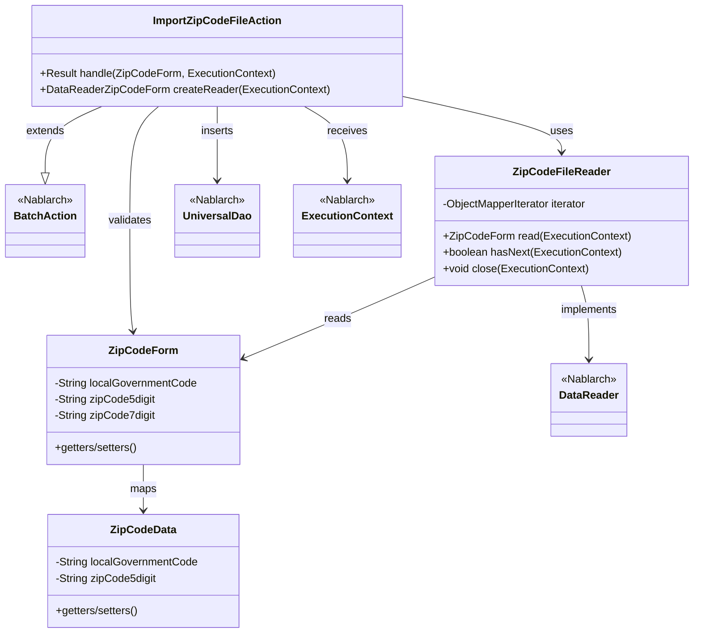
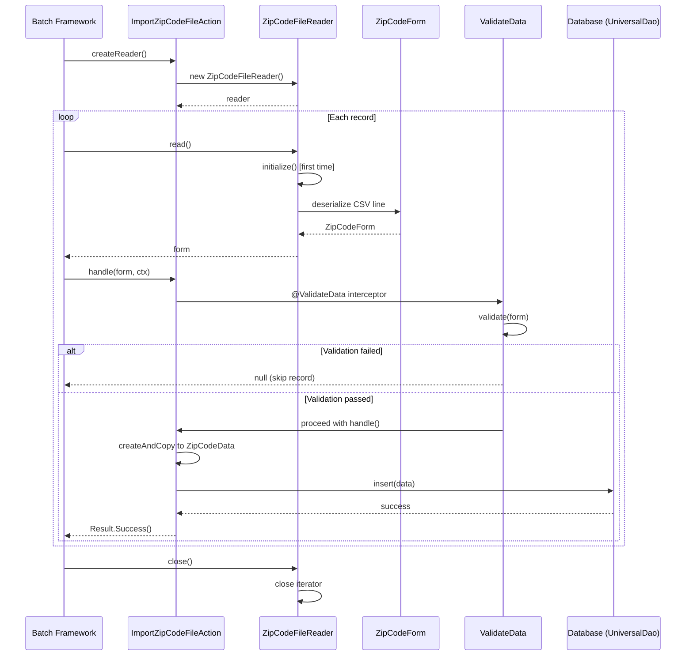

# Code Analysis: ImportZipCodeFileAction

**Generated**: 2026-04-07 15:58:14
**Target**: Batch action to import postal code data to database
**Modules**: nablarch-example-batch
**Analysis Duration: approx. 2m 26s

---

## Overview

ImportZipCodeFileAction is a batch action that reads postal code data from a CSV file and stores it in the database. The action implements the `BatchAction<ZipCodeForm>` interface and processes each record through a validation interceptor before persisting to the database using UniversalDao. The processing follows a typical batch pattern: create data reader, iterate over records with validation, insert valid records into the database.

---

## Architecture

### Dependency Graph



### Component Summary

| Component | Role | Type | Dependencies |
|-----------|------|------|--------------|
| ImportZipCodeFileAction | Main batch action processing | Action | ZipCodeFileReader, UniversalDao, ValidateData |
| ZipCodeFileReader | CSV file data reader implementation | DataReader | ObjectMapperFactory, FilePathSetting, ZipCodeForm |
| ZipCodeForm | Input form with CSV binding and validation | Form | CSV data binding annotations, validation annotations |
| ValidateData | Bean validation interceptor | Interceptor | Bean Validation (JSR-380), Validator |
| ZipCodeData | Database entity for postal code data | Entity | UniversalDao |

---

## Flow

### Processing Flow

The batch process follows these steps:

1. **Setup Phase** (BatchAction framework): Call `createReader()` to get a `ZipCodeFileReader` instance
2. **Data Reader Creation** (ZipCodeFileReader.createReader): Return new ZipCodeFileReader, which loads the CSV file path from FilePathSetting on first `read()` call
3. **Record Loop** (BatchAction framework): For each record:
   - Call `reader.read()` to get next ZipCodeForm object deserialized from CSV
   - Call `action.handle(form, ctx)` with the form
4. **Validation Interceptor** (@ValidateData annotation): 
   - Intercept `handle()` method and run Bean Validation on ZipCodeForm
   - If validation fails, log error with line number and skip record (return null)
   - If validation passes, proceed to handle() method
5. **Data Processing** (handle method):
   - Convert ZipCodeForm to ZipCodeData entity using `BeanUtil.createAndCopy()`
   - Insert entity to database via `UniversalDao.insert(data)`
   - Return Success result
6. **Cleanup Phase**: Call `reader.close()` to release file resources

### Sequence Diagram



---

## Components

### 1. ImportZipCodeFileAction (Lines 21-42)

**Role**: Main batch action handler that processes each postal code record

**Key Methods**:
- `handle(ZipCodeForm inputData, ExecutionContext ctx)` (Lines 35-41) - Processes validated form data, converts to entity, and inserts into database
- `createReader(ExecutionContext ctx)` (Lines 50-52) - Creates and returns ZipCodeFileReader instance

**Dependencies**: ZipCodeFileReader, UniversalDao, BeanUtil, Result, BatchAction, ValidateData

**Implementation Details**:
- Extends `BatchAction<ZipCodeForm>` to define generic type for batch processing
- Uses `@ValidateData` annotation on `handle()` method to enable validation interceptor
- Converts form data to database entity using `BeanUtil.createAndCopy()` (Line 37)
- Inserts entity using `UniversalDao.insert()` (Line 38)
- Always returns `Result.Success()` for valid records (Line 40)

### 2. ZipCodeFileReader (Lines 21-91)

**Role**: DataReader implementation that deserializes CSV file data into ZipCodeForm objects

**Key Methods**:
- `read(ExecutionContext ctx)` (Lines 40-45) - Returns next ZipCodeForm or null when finished
- `hasNext(ExecutionContext ctx)` (Lines 54-59) - Checks if more records available
- `close(ExecutionContext ctx)` (Lines 68-70) - Closes resources (calls iterator.close())
- `initialize()` (Lines 78-89) - Loads CSV file and creates ObjectMapperIterator (called on first read)

**Dependencies**: ObjectMapperFactory, FilePathSetting, ObjectMapperIterator, ZipCodeForm

**Implementation Details**:
- Lazy initialization of iterator on first `read()` or `hasNext()` call (Lines 41-43, 55-57)
- Uses `FilePathSetting.getInstance()` to get configured file path for "csv-input"/"importZipCode" (Lines 79-80)
- Wraps `ObjectMapperFactory.create()` in try-catch to convert FileNotFoundException to IllegalStateException (Lines 84-88)
- ObjectMapperIterator handles CSV deserialization transparently

### 3. ZipCodeForm (Lines 12-425)

**Role**: Input form class with CSV binding and bean validation annotations

**Key Annotations**:
- `@Csv` (Lines 17-20) - Declares CSV format with 15 field properties
- `@CsvFormat` (Lines 21-23) - Specifies CSV parsing: UTF-8, comma-separated, quote handling
- `@Required` (Lines 30-31, 37, etc.) - Marks fields as required for validation
- `@Domain` (Lines 30, 37, etc.) - Associates field with domain rules for validation
- `@LineNumber` (Line 142) - Stores line number for error reporting

**Key Fields** (15 total):
- Location/address fields: localGovernmentCode, zipCode5digit, zipCode7digit, prefectureKana, cityKana, addressKana, prefectureKanji, cityKanji, addressKanji
- Flag fields (all required): multipleZipCodes, numberedEveryKoaza, addressWithChome, multipleAddress
- Metadata fields: updateData, updateDataReason, lineNumber

**Implementation Details**:
- All 15 CSV columns have corresponding properties with getter/setter methods
- `lineNumber` property enables ValidateData interceptor to report error line numbers (Line 135)
- Properties use consistent naming: camelCase for Java, hyphen-separated for CSV mapping

### 4. ValidateData (Lines 1-95)

**Role**: Annotation-based interceptor that validates batch record data using Bean Validation

**Key Components**:
- `@interface ValidateData` (Lines 37-41) - Marker annotation for methods needing validation
- `ValidateDataImpl extends Interceptor.Impl` (Lines 47-93) - Actual interceptor implementation
- `handle()` method (Lines 60-92) - Validates object and either proceeds or returns null

**Validation Logic** (Lines 62-91):
- Uses `ValidatorUtil.getValidator()` to get Bean Validation validator (Line 63)
- Runs `validator.validate(data)` and collects constraint violations (Line 64)
- If no violations, calls original handler (Line 68)
- If violations found, logs each violation with field path, message, and line number (Lines 71-90), returns null (Line 91)

**Implementation Details**:
- Intercepts annotated method and wraps it with validation logic
- Attempts to read `lineNumber` property for error reporting (Lines 74-79), catches exception if not present
- Creates Message objects via MessageUtil with code "invalid_data_record" for localized error messages
- Logs all violations at WARN level via LoggerManager

### 5. ZipCodeData (Entity)

**Role**: JPA/Nablarch entity class mapped to database table for postal code records

**Expected Structure**:
- Same 15 properties as ZipCodeForm (localGovernmentCode, zipCode5digit, etc.)
- Database annotations (@Entity, @Table, @Column) for ORM mapping
- Used by UniversalDao.insert() to persist data

---

## Nablarch Framework Usage

### BatchAction

**Class**: `nablarch.fw.action.BatchAction<T>`

**Description**: Base class for batch actions that process records from a data reader. Handles framework integration for file I/O, transaction management, and error handling.

**Usage**:
```java
public class ImportZipCodeFileAction extends BatchAction<ZipCodeForm> {
    @Override
    public Result handle(ZipCodeForm inputData, ExecutionContext ctx) {
        // Process each record
        return new Result.Success();
    }
    
    @Override
    public DataReader<ZipCodeForm> createReader(ExecutionContext ctx) {
        return new ZipCodeFileReader();
    }
}
```

**Important Points**:
- ✅ **Must implement two methods**: `handle()` for record processing and `createReader()` to provide data source
- ✅ **Generic type defines record type**: `<ZipCodeForm>` specifies what handle() receives
- ⚠️ **Framework manages iteration**: Do not call reader.read() directly; framework calls handle() for each record
- 💡 **Automatic error handling**: Framework logs/counts validation failures without stopping batch
- 🎯 **Use for file-to-DB patterns**: Ideal for importing data from CSV, TSV, or fixed-length files

**Usage in this code**:
- ImportZipCodeFileAction extends BatchAction to process CSV records
- Generic type `<ZipCodeForm>` means handle() receives deserialized form objects
- createReader() returns ZipCodeFileReader for framework to iterate over CSV file

**Details**: Nablarch Batch Action documentation

### DataReader

**Class**: `nablarch.fw.DataReader<T>`

**Description**: Interface for reading records in a batch context. Provides lazy initialization, iteration, and resource cleanup.

**Usage**:
```java
public class ZipCodeFileReader implements DataReader<ZipCodeForm> {
    @Override
    public ZipCodeForm read(ExecutionContext ctx) {
        if (iterator == null) initialize();
        return iterator.next();
    }
    
    @Override
    public boolean hasNext(ExecutionContext ctx) {
        return iterator.hasNext();
    }
    
    @Override
    public void close(ExecutionContext ctx) {
        iterator.close();
    }
}
```

**Important Points**:
- ✅ **Three methods required**: read(), hasNext(), close()
- ✅ **Lazy initialization pattern**: Initialize expensive resources (files, connections) in first read()
- ⚠️ **close() must release resources**: Open files, connections, or iterators leak if not closed
- 💡 **Generic type matches BatchAction**: `<ZipCodeForm>` must match BatchAction's generic type
- 🎯 **When to use**: Implement when custom record reading logic needed (files, DB queries, message queues)

**Usage in this code**:
- ZipCodeFileReader implements DataReader for CSV file reading
- read() returns next deserialized ZipCodeForm or null when exhausted
- initialize() creates ObjectMapperIterator on first read (lazy initialization pattern)
- close() releases file resources via iterator.close()

**Details**: Nablarch DataReader documentation

### UniversalDao

**Class**: `nablarch.common.dao.UniversalDao`

**Description**: High-level data access object providing CRUD operations using SQL files or inline queries. Handles automatic parameter binding and result mapping.

**Usage**:
```java
// Insert single record
ZipCodeData data = new ZipCodeData();
data.setZipCode("1234567");
UniversalDao.insert(data);

// Find by ID
ZipCodeData found = UniversalDao.findById(ZipCodeData.class, id);

// Query with SQL file
List<ZipCodeData> results = UniversalDao.findAllBySqlFile(ZipCodeData.class, "FIND_BY_CODE", code);
```

**Important Points**:
- ✅ **Automatic parameter binding**: Entity properties mapped to SQL parameters via column annotations
- ✅ **Transaction handled by framework**: No explicit transaction management needed in batch actions
- ⚠️ **Entity class required**: Target class must have `@Entity` and `@Column` annotations for column mapping
- ⚠️ **SQL file location**: SQL files must be in configured directory and referenced without path/extension
- 💡 **Batch processing**: UniversalDao.insert() is efficient for record-by-record inserts in batches
- 🎯 **When to use**: Use for straightforward CRUD. For complex queries, use ExecuteUpdate with custom SQL

**Usage in this code**:
- `UniversalDao.insert(data)` inserts validated ZipCodeData entity
- Entity properties automatically bound to INSERT statement columns
- Framework manages transaction (commits after handle() returns)

**Details**: Nablarch UniversalDao documentation

### ObjectMapper

**Class**: `nablarch.common.databind.ObjectMapper<T>`

**Description**: Provides streaming serialization/deserialization of CSV, TSV, or fixed-length data as Java objects. Memory-efficient for large files.

**Usage**:
```java
// Deserialization (reading CSV)
ObjectMapper<ZipCodeForm> mapper = ObjectMapperFactory.create(
    ZipCodeForm.class, 
    new FileInputStream(csvFile)
);
while (mapper.hasNext()) {
    ZipCodeForm record = mapper.read();
    // process record
}
mapper.close();

// Serialization (writing CSV)
ObjectMapper<ProjectDto> mapper = ObjectMapperFactory.create(
    ProjectDto.class, 
    outputStream
);
mapper.write(dto);
mapper.close();
```

**Important Points**:
- ✅ **Always call close()**: Flushes buffers and releases file handles
- ✅ **Format defined by annotations**: `@Csv`, `@CsvFormat`, `@FixedLength` on form class
- ⚠️ **Streaming processing**: Does not load entire file into memory; processes records one at a time
- ⚠️ **Type safety**: Deserialized objects are instance of T; casting already done
- 💡 **Encoding support**: Charset specified in `@CsvFormat` (e.g., UTF-8, Shift_JIS)
- 💡 **Quote handling**: `@CsvFormat.quoteMode` controls CSV quote escaping (NORMAL, ALL, MINIMAL)

**Usage in this code**:
- ObjectMapperFactory.create() in ZipCodeFileReader.initialize() creates mapper for ZipCodeForm
- Mapper deserializes each CSV line into ZipCodeForm object with data binding and type conversion
- Mapper.close() in DataReader.close() releases file resources

**Details**: Nablarch ObjectMapper documentation

### Bean Validation (ValidateData Interceptor)

**Class**: `javax.validation.Validator`, `nablarch.core.validation.ee.ValidatorUtil`

**Description**: Framework for declarative object validation using JSR-380 annotations (`@Required`, `@Domain`, etc.). ValidateData is a custom Nablarch interceptor that applies Bean Validation to batch records.

**Usage**:
```java
public class ZipCodeForm {
    @Required  // Must not be null
    @Domain("zipCode")  // Apply domain validation rules
    private String zipCode7digit;
    
    // getters/setters
}

// In action:
@ValidateData  // Annotation triggers validation interceptor
public Result handle(ZipCodeForm inputData, ExecutionContext ctx) {
    // inputData is guaranteed to be valid here
    // If validation failed, interceptor returned null and this wasn't called
    return processValidData(inputData);
}
```

**Important Points**:
- ✅ **Declarative validation**: Use annotations on fields, not procedural code
- ✅ **Domain rules reusable**: `@Domain` applies consistent validation rules across multiple fields
- ⚠️ **@ValidateData only for batch**: Use in batch actions; for web use form validators
- ⚠️ **Line number tracking**: Include `lineNumber` property on form for error reports
- 💡 **Error logging**: ValidateData logs violations at WARN level with field name and message
- 💡 **Error handling**: Validation failures skip records; batch continues processing

**Usage in this code**:
- ZipCodeForm declares 15 required fields via `@Required` and `@Domain` annotations
- ValidateData interceptor validates each form before handle() processes it
- If validation fails, error logged with lineNumber and record skipped
- Only valid records reach handle() and get inserted into database

**Details**: Nablarch Bean Validation documentation

### FilePathSetting

**Class**: `nablarch.core.util.FilePathSetting`

**Description**: Configuration utility for managing file system paths in a centralized, environment-independent way. Supports logical path names that resolve to actual directories.

**Usage**:
```java
FilePathSetting setting = FilePathSetting.getInstance();

// Get file (creates directory if missing)
File file = setting.getFile("csv-input", "importZipCode");

// Get file without creating directory
File file = setting.getFileWithoutCreate("csv-input", "importZipCode");
```

**Important Points**:
- ✅ **Centralized configuration**: File paths defined in configuration file, not hardcoded
- ✅ **Logical path mapping**: "csv-input" is logical name; actual path defined in config
- ⚠️ **getFile() creates directory**: May fail if no write permission; use getFileWithoutCreate() if not needed
- 💡 **Environment independence**: Same code works across dev/test/production environments
- 🎯 **Batch context**: Ideal for batch to read/write files with configurable paths

**Usage in this code**:
- ZipCodeFileReader.initialize() uses FilePathSetting to get CSV file path
- Logical name "csv-input" with file name "importZipCode" resolves to actual file location
- getFileWithoutCreate() used since file must already exist to read

**Details**: Nablarch FilePathSetting documentation

### BeanUtil

**Class**: `nablarch.core.beans.BeanUtil`

**Description**: Utility for working with Java objects (beans). Provides property access, copying between objects, and map conversion.

**Usage**:
```java
// Create object and copy properties from source
ZipCodeData data = BeanUtil.createAndCopy(ZipCodeData.class, inputForm);

// Get property by name
String code = BeanUtil.getProperty(obj, "zipCode");

// Set property by name
BeanUtil.setProperty(obj, "zipCode", "1234567");

// Copy properties from Map
User user = BeanUtil.createAndCopy(User.class, paramMap);
```

**Important Points**:
- ✅ **Type-safe copying**: Automatic property matching by name; type conversion as needed
- ✅ **Reflection-based**: No need for manual getters/setters in copy logic
- ⚠️ **Property name matching**: Only properties with same name are copied
- 💡 **Null handling**: Null values copy as-is; nulls don't override existing values
- 🎯 **Form-to-Entity pattern**: Ideal for converting form/DTO objects to entities for persistence

**Usage in this code**:
- `BeanUtil.createAndCopy(ZipCodeData.class, inputData)` converts ZipCodeForm to ZipCodeData
- Properties with matching names copied automatically (e.g., zipCode5digit → zipCode5digit)
- New ZipCodeData instance created; original form unaffected

**Details**: Nablarch BeanUtil documentation

### ExecutionContext

**Class**: `nablarch.fw.ExecutionContext`

**Description**: Runtime context passed to handlers containing request/response data, execution state, and framework services.

**Usage**:
```java
public Result handle(ZipCodeForm inputData, ExecutionContext ctx) {
    // Access request properties
    String userId = ctx.getRequestProperty("userId");
    
    // Set response properties
    ctx.setResponseProperty("processedCount", count);
    
    // Access user/session (if in web context)
    User user = ctx.getUser();
}
```

**Important Points**:
- ✅ **Passed to every handler**: Available in all action methods
- ✅ **Request/response properties**: Generic name-value access for cross-handler communication
- ⚠️ **Context scope**: Lost after batch finishes; for persistence use database or files
- 💡 **Thread-local in request**: Each batch record processing gets fresh context
- 🎯 **Batch usage**: Less common than in web; mainly used for accessing logging/configuration

**Usage in this code**:
- Received as parameter in handle() method (Line 35)
- Not actively used in this simple batch action (validation and insertion don't need it)
- Available if needed for logging or accessing batch execution state

**Details**: Nablarch ExecutionContext documentation

---

## References

### Source Files

- [ImportZipCodeFileAction.java](.../.lw/nab-official/v5/nablarch-example-batch/src/main/java/com/nablarch/example/app/batch/action/ImportZipCodeFileAction.java) - Main batch action
- [ZipCodeFileReader.java](.../.lw/nab-official/v5/nablarch-example-batch/src/main/java/com/nablarch/example/app/batch/reader/ZipCodeFileReader.java) - CSV data reader
- [ZipCodeForm.java](.../.lw/nab-official/v5/nablarch-example-batch/src/main/java/com/nablarch/example/app/batch/form/ZipCodeForm.java) - Input form with CSV binding
- [ValidateData.java](.../.lw/nab-official/v5/nablarch-example-batch/src/main/java/com/nablarch/example/app/batch/interceptor/ValidateData.java) - Validation interceptor

### Knowledge Base (Nabledge-5)

(Knowledge files not available for nabledge-5)

### Official Documentation

(Official docs not extracted)

---

**Output**: `.nabledge/20260407/code-analysis-ImportZipCodeFileAction.md`

**Note**: This documentation was generated by the code-analysis workflow of the nabledge-5 skill.
