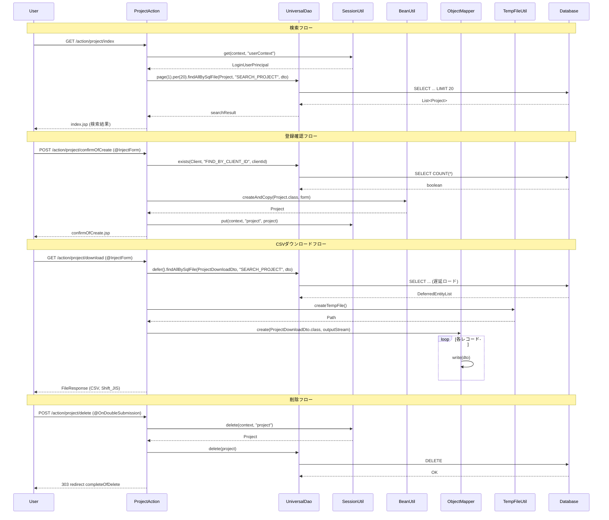

# Code Analysis: ProjectAction

**Generated**: 2026-03-13 20:30:12
**Target**: プロジェクトのCRUD操作（検索・登録・更新・削除・CSVダウンロード）を提供するWebアクション
**Modules**: nablarch-example-web
**Analysis Duration**: approx. 3m 31s

---

## Overview

`ProjectAction` は、プロジェクト管理Webアプリケーションの中核となるアクションクラスで、プロジェクトの検索・登録・更新・削除・CSVダウンロードの5つの機能を提供する。

各機能は確認画面を挟む2ステップ方式（入力→確認→完了）で実装されており、`@InjectForm` によるバリデーション、`SessionUtil` によるセッションストアを活用して画面間データを受け渡す。`@OnDoubleSubmission` により二重送信が防止される。CSVダウンロードでは `UniversalDao.defer()` と `ObjectMapper` を組み合わせた遅延ロードによるストリーミング出力を実装している。

---

## Architecture

### Dependency Graph

```mermaid
classDiagram
    class ProjectAction
    class ProjectForm {
        <<Form>>
    }
    class ProjectSearchForm {
        <<Form>>
    }
    class ProjectUpdateForm {
        <<Form>>
    }
    class ProjectTargetForm {
        <<Form>>
    }
    class ProjectSearchDto
    class ProjectDownloadDto
    class ProjectDto
    class Project {
        <<Entity>>
    }
    class Client {
        <<Entity>>
    }
    class LoginUserPrincipal
    class UniversalDao {
        <<Nablarch>>
    }
    class SessionUtil {
        <<Nablarch>>
    }
    class BeanUtil {
        <<Nablarch>>
    }
    class ObjectMapperFactory {
        <<Nablarch>>
    }
    class FileResponse {
        <<Nablarch>>
    }
    class DeferredEntityList {
        <<Nablarch>>
    }

    ProjectAction ..> ProjectForm : validates
    ProjectAction ..> ProjectSearchForm : validates
    ProjectAction ..> ProjectUpdateForm : validates
    ProjectAction ..> ProjectTargetForm : validates
    ProjectAction ..> ProjectSearchDto : queries
    ProjectAction ..> ProjectDownloadDto : serializes
    ProjectAction ..> ProjectDto : reads
    ProjectAction ..> Project : persists
    ProjectAction ..> Client : queries
    ProjectAction ..> LoginUserPrincipal : reads
    ProjectAction ..> UniversalDao : uses
    ProjectAction ..> SessionUtil : uses
    ProjectAction ..> BeanUtil : uses
    ProjectAction ..> ObjectMapperFactory : creates
    ProjectAction ..> FileResponse : creates
    ProjectAction ..> DeferredEntityList : uses
    ProjectSearchForm --|> SearchFormBase
```



**Note**: This diagram uses Mermaid `classDiagram` syntax to show class names and their relationships. Use `--|>` for inheritance (extends/implements) and `..>` for dependencies (uses/creates).

### Component Summary

| Component | Role | Type | Dependencies |
|-----------|------|------|--------------|
| ProjectAction | プロジェクトCRUD + CSVダウンロード | Action | ProjectForm, ProjectSearchForm, ProjectUpdateForm, ProjectTargetForm, Project, Client, UniversalDao, SessionUtil, BeanUtil, ObjectMapperFactory |
| ProjectForm | プロジェクト登録フォーム（バリデーション付き） | Form | なし |
| ProjectSearchForm | プロジェクト検索フォーム（ページング・ソート含む） | Form | SearchFormBase |
| ProjectUpdateForm | プロジェクト更新フォーム | Form | なし |
| ProjectTargetForm | 対象プロジェクトID取得フォーム | Form | なし |
| ProjectSearchDto | 検索条件DTO（UniversalDaoへ渡す） | DTO | なし |
| ProjectDownloadDto | CSVダウンロード用DTO（@Csvアノテーション付き） | DTO | なし |
| ProjectDto | プロジェクト詳細表示用DTO | DTO | なし |
| Project | プロジェクトエンティティ | Entity | なし |
| Client | 顧客エンティティ | Entity | なし |
| LoginUserPrincipal | ログインユーザー情報 | Value Object | なし |

---

## Flow

### Processing Flow

**登録フロー（newEntity → confirmOfCreate → create → completeOfCreate）**:
1. `newEntity()`: セッションから "project" を削除して登録初期画面を表示
2. `confirmOfCreate()`: `@InjectForm(ProjectForm)` でバリデーション。顧客IDが指定された場合は `UniversalDao.exists()` で存在確認。`BeanUtil.createAndCopy()` でフォーム→エンティティ変換し、セッションに保存して確認画面を表示
3. `create()`: `@OnDoubleSubmission` で二重送信防止。セッションからエンティティを取得し `UniversalDao.insert()` で登録後、303リダイレクト
4. `completeOfCreate()`: 完了画面を表示

**検索フロー（index → list）**:
1. `index()`: 初期値（ページ1、IDソート）でプロジェクト一覧を検索して表示
2. `list()`: `@InjectForm(ProjectSearchForm)` でバリデーション後、`UniversalDao.page().per(20).findAllBySqlFile()` でページング検索

**CSVダウンロードフロー（download）**:
- `@InjectForm(ProjectSearchForm)` で検索条件を取得
- `UniversalDao.defer().findAllBySqlFile()` で遅延ロード（`DeferredEntityList`）
- `ObjectMapperFactory.create()` で一時ファイルへのCSV出力
- `FileResponse` でCSVレスポンスを返却

**更新フロー（edit → confirmOfUpdate → update → completeOfUpdate）**:
1. `edit()`: `UniversalDao.findBySqlFile()` でプロジェクト取得、セッションに保存
2. `confirmOfUpdate()`: `@InjectForm(ProjectUpdateForm)` でバリデーション後、確認画面表示
3. `update()`: `@OnDoubleSubmission` で二重送信防止。`UniversalDao.update()` で更新
4. `completeOfUpdate()`: 完了画面を表示

**削除フロー（delete → completeOfDelete）**:
1. `delete()`: `@OnDoubleSubmission` で二重送信防止。セッションからエンティティを取得し `UniversalDao.delete()` で削除

### Sequence Diagram



---

## Components

### ProjectAction

**ファイル**: [ProjectAction.java (.lw/nab-official/v6/nablarch-example-web)](../../.lw/nab-official/v6/nablarch-example-web/src/main/java/com/nablarch/example/app/web/action/ProjectAction.java)

**役割**: プロジェクト管理のCRUD全操作を提供するWebアクション

**主要メソッド**:
- `confirmOfCreate()` [L64-92]: `@InjectForm` + `@OnError` でバリデーション。顧客存在確認後、エンティティをセッション保存
- `create()` [L101-108]: `@OnDoubleSubmission` 付き。セッションから取得して `UniversalDao.insert()`
- `searchProject()` [L198-208]: ページング検索の共通メソッド。`UniversalDao.page().per(20).findAllBySqlFile()`
- `download()` [L217-243]: `UniversalDao.defer()` + `ObjectMapper` でCSVストリーミング出力
- `delete()` [L396-402]: `@OnDoubleSubmission` + `UniversalDao.delete()`

**依存関係**: UniversalDao, SessionUtil, BeanUtil, ObjectMapperFactory, FileResponse, DeferredEntityList

---

### ProjectForm

**ファイル**: [ProjectForm.java (.lw/nab-official/v6/nablarch-example-web)](../../.lw/nab-official/v6/nablarch-example-web/src/main/java/com/nablarch/example/app/web/form/ProjectForm.java)

**役割**: プロジェクト登録用入力フォーム（バリデーション定義含む）

**主要メソッド**:
- `isValidProjectPeriod()` [L355-357]: `@AssertTrue` による相関バリデーション（開始日 ≤ 終了日）
- `hasClientId()` [L141-143]: 顧客ID保持チェック

**依存関係**: DateRangeValidator（相関バリデーション用）

---

### ProjectSearchForm

**ファイル**: [ProjectSearchForm.java (.lw/nab-official/v6/nablarch-example-web)](../../.lw/nab-official/v6/nablarch-example-web/src/main/java/com/nablarch/example/app/web/form/ProjectSearchForm.java)

**役割**: プロジェクト検索条件フォーム（ページング・ソートキー含む）

**主要メソッド**:
- `getSortId()` / `setSortId()` [L275-303]: sortKey + sortDir からソートIDを算出

**依存関係**: SearchFormBase（ページ番号管理）

---

### ProjectSearchDto

**ファイル**: [ProjectSearchDto.java (.lw/nab-official/v6/nablarch-example-web)](../../.lw/nab-official/v6/nablarch-example-web/src/main/java/com/nablarch/example/app/web/dto/ProjectSearchDto.java)

**役割**: `UniversalDao.findAllBySqlFile()` に渡す検索条件オブジェクト。ページ番号・ソート情報含む

**依存関係**: なし

---

## Nablarch Framework Usage

### UniversalDao

**クラス**: `nablarch.common.dao.UniversalDao`

**説明**: SQLファイルやエンティティクラスを使ってDBアクセスを行うNablarchのユニバーサルDAO

**使用方法**:
```java
// ページング検索
List<Project> list = UniversalDao
    .page(searchCondition.getPageNumber())
    .per(20L)
    .findAllBySqlFile(Project.class, "SEARCH_PROJECT", searchCondition);

// 存在確認
boolean exists = UniversalDao.exists(Client.class, "FIND_BY_CLIENT_ID", new Object[]{clientId});

// 登録
UniversalDao.insert(project);

// 更新
UniversalDao.update(project);

// 削除
UniversalDao.delete(project);

// 遅延ロード（CSVダウンロード等大量データ）
DeferredEntityList<ProjectDownloadDto> list = (DeferredEntityList<ProjectDownloadDto>)
    UniversalDao.defer().findAllBySqlFile(ProjectDownloadDto.class, "SEARCH_PROJECT", searchCondition);
```

**重要ポイント**:
- ✅ **ページングは `page().per()` チェーン**: `page(pageNumber).per(20L)` でページング検索を実現。ページ番号は1始まり
- ⚠️ **`defer()` 使用時はtry-with-resources必須**: `DeferredEntityList` はリソースを保持するためクローズが必要
- 💡 **`exists()` で存在確認**: `findById()` は存在しない場合 `NoDataException` をスローするが、`exists()` はboolean返却でより安全
- 🎯 **`delete()` は主キーで削除**: エンティティの主キーフィールドを使って DELETE を発行する

**このコードでの使い方**:
- `searchProject()` (L204-208): `page().per(20).findAllBySqlFile()` でページング検索
- `confirmOfCreate()` (L70-71): `exists()` で顧客IDの存在確認
- `create()` (L105): `insert()` でプロジェクト登録
- `show()` / `edit()` (L258, L289): `findBySqlFile()` でプロジェクト詳細取得
- `download()` (L227-229): `defer().findAllBySqlFile()` で遅延ロード
- `update()` (L373): `update()` でプロジェクト更新
- `delete()` (L399): `delete()` でプロジェクト削除

**詳細**: [Libraries Data_bind](../../.claude/skills/nabledge-6/docs/component/libraries/libraries-data_bind.md)

---

### SessionUtil

**クラス**: `nablarch.common.web.session.SessionUtil`

**説明**: NablarchのセッションストアへのアクセスユーティリティAPI

**使用方法**:
```java
// セッションに保存
SessionUtil.put(context, "project", project);

// セッションから取得
Project project = SessionUtil.get(context, "project");

// セッションから取得して削除
Project project = SessionUtil.delete(context, "project");
```

**重要ポイント**:
- ✅ **確認→実行パターンは `delete()` で取得**: `create()` / `update()` / `delete()` メソッドでは `SessionUtil.delete()` を使い、処理後にセッションを自動クリア
- ⚠️ **セッションに保存するオブジェクトはSerializable必須**: エンティティやDTOは `Serializable` を実装する必要がある
- 💡 **画面間データ受け渡しの標準パターン**: 確認画面を挟むフローではセッションストアを使うのがNablarchの推奨パターン

**このコードでの使い方**:
- `confirmOfCreate()` (L81-83): ユーザーコンテキスト取得 + projectをセッションに保存
- `create()` (L103): `delete()` でセッションから取得しつつクリア
- `edit()` (L284, 295): セッションクリア後に再取得、projectを保存
- `delete()` (L398): `delete()` でセッションから取得しつつクリア

**詳細**: [Web Application Getting Started Project Update](../../.claude/skills/nabledge-6/docs/processing-pattern/web-application/web-application-getting-started-project-update.md)

---

### @InjectForm / @OnError

**クラス**: `nablarch.common.web.interceptor.InjectForm` / `nablarch.fw.web.interceptor.OnError`

**説明**: `@InjectForm` はHTTPリクエストパラメータをフォームクラスにバインドし、Bean Validationを実行するインターセプタ。`@OnError` はバリデーションエラー時の遷移先を指定する

**使用方法**:
```java
@InjectForm(form = ProjectForm.class, prefix = "form")
@OnError(type = ApplicationException.class, path = "/WEB-INF/view/project/create.jsp")
public HttpResponse confirmOfCreate(HttpRequest request, ExecutionContext context) {
    ProjectForm form = context.getRequestScopedVar("form");
    // フォームはリクエストスコープから取得
}
```

**重要ポイント**:
- ✅ **`@OnError` とセットで使用**: バリデーション失敗時の遷移先を `@OnError` で必ず指定する
- ✅ **フォームはリクエストスコープから取得**: `context.getRequestScopedVar("form")` でバインド済みフォームを取得
- ⚠️ **`prefix` と `name` の使い分け**: `prefix` はリクエストパラメータのプレフィックス、`name` はリクエストスコープへの格納キー名

**このコードでの使い方**:
- `confirmOfCreate()` (L64-65): `prefix="form"` でプロジェクト登録フォームをバインド
- `list()` / `download()` (L176-177, L217-218): `prefix="searchForm", name="searchForm"` で検索フォームをバインド
- `show()` / `edit()` (L252, L280): `ProjectTargetForm` でプロジェクトIDを取得

**詳細**: [Web Application Getting Started Project Search](../../.claude/skills/nabledge-6/docs/processing-pattern/web-application/web-application-getting-started-project-search.md)

---

### @OnDoubleSubmission

**クラス**: `nablarch.common.web.token.OnDoubleSubmission`

**説明**: 二重送信を防止するインターセプタ。確認画面の `<n:form useToken="true">` と組み合わせて使用する

**使用方法**:
```java
@OnDoubleSubmission
public HttpResponse create(HttpRequest request, ExecutionContext context) {
    // 二重送信時はデフォルトのエラーレスポンスが返る
}
```

**重要ポイント**:
- ✅ **JSP側に `useToken="true"` が必要**: 確認画面の `<n:form useToken="true">` でトークンを埋め込む
- ⚠️ **二重送信時は `allowDoubleSubmission` なしの場合エラー画面へ**: デフォルトでシステムエラーとなるため、ユーザーへの適切なメッセージ設計が必要
- 💡 **登録・更新・削除の実行処理に付与**: 確認→実行パターンの「実行」メソッドには必ず付与する

**このコードでの使い方**:
- `create()` (L101): プロジェクト登録実行に付与
- `update()` (L370): プロジェクト更新実行に付与
- `delete()` (L396): プロジェクト削除実行に付与

**詳細**: [Web Application Client_create4](../../.claude/skills/nabledge-6/docs/processing-pattern/web-application/web-application-client_create4.md)

---

### ObjectMapper / ObjectMapperFactory / DeferredEntityList

**クラス**: `nablarch.common.databind.ObjectMapper` / `nablarch.common.databind.ObjectMapperFactory` / `nablarch.common.dao.DeferredEntityList`

**説明**: `ObjectMapper` はCSV等へのデータバインドを提供するインターフェース。`ObjectMapperFactory` でインスタンスを生成する。`DeferredEntityList` は大量データを逐次処理するための遅延ロードリスト

**使用方法**:
```java
final Path path = TempFileUtil.createTempFile();
try (DeferredEntityList<ProjectDownloadDto> searchList = (DeferredEntityList<ProjectDownloadDto>)
        UniversalDao.defer().findAllBySqlFile(ProjectDownloadDto.class, "SEARCH_PROJECT", searchCondition);
     ObjectMapper<ProjectDownloadDto> mapper = ObjectMapperFactory.create(
             ProjectDownloadDto.class, TempFileUtil.newOutputStream(path))) {
    for (ProjectDownloadDto dto : searchList) {
        mapper.write(dto);
    }
}
FileResponse response = new FileResponse(path.toFile(), true);
response.setContentType("text/csv; charset=Shift_JIS");
response.setContentDisposition("プロジェクト一覧.csv");
```

**重要ポイント**:
- ✅ **try-with-resources でクローズ**: `DeferredEntityList` と `ObjectMapper` は両方 `AutoCloseable` 。try-with-resources で確実にクローズする
- ✅ **`FileResponse` の第2引数 `true` は自動削除**: `new FileResponse(path.toFile(), true)` で送信後に一時ファイルが自動削除される
- ⚠️ **`@Csv` アノテーションが `ProjectDownloadDto` に必要**: CSVヘッダーとプロパティの対応は `@Csv(headers=..., properties=...)` で定義
- 💡 **`defer()` で大量データをメモリ効率よく処理**: 全件をメモリに載せず逐次処理するため、大量データでも安全

**このコードでの使い方**:
- `download()` (L226-242): 一時ファイルに検索結果をCSV出力し、`FileResponse` でレスポンス

**詳細**: [Libraries Data_bind](../../.claude/skills/nabledge-6/docs/component/libraries/libraries-data_bind.md)

---

### BeanUtil

**クラス**: `nablarch.core.beans.BeanUtil`

**説明**: JavaBeans間でプロパティをコピーするユーティリティ。フォーム→エンティティ、エンティティ→DTOなどの変換に使用する

**使用方法**:
```java
// フォームからエンティティを生成
Project project = BeanUtil.createAndCopy(Project.class, form);

// エンティティからDTOをコピー
ProjectDto dto = BeanUtil.createAndCopy(ProjectDto.class, project);

// 既存オブジェクトへのコピー（上書き）
BeanUtil.copy(form, project);
```

**重要ポイント**:
- ✅ **同名プロパティが自動マッピング**: フォームとエンティティでプロパティ名が同じ場合は自動でコピーされる
- ⚠️ **型変換は対応する型のみ**: `String` → `Integer` 等の基本的な型変換は自動だが、複雑な変換は手動設定が必要
- 💡 **`createAndCopy()` vs `copy()`**: 新規オブジェクト生成なら `createAndCopy()`、既存オブジェクトへの上書きなら `copy()`

**このコードでの使い方**:
- `confirmOfCreate()` (L80): `BeanUtil.createAndCopy(Project.class, form)` でフォーム→エンティティ変換
- `backToNew()` (L130): `BeanUtil.createAndCopy(ProjectDto.class, project)` でエンティティ→DTO変換
- `confirmOfUpdate()` (L323-326): `BeanUtil.copy(form, project)` で既存エンティティへ上書き

**詳細**: [Web Application Getting Started Project Update](../../.claude/skills/nabledge-6/docs/processing-pattern/web-application/web-application-getting-started-project-update.md)

---

## References

### Source Files

- [ProjectAction.java (.lw/nab-official/v5/nablarch-example-rest/src/main/java/com/nablarch/example/action)](../../.lw/nab-official/v5/nablarch-example-rest/src/main/java/com/nablarch/example/action/ProjectAction.java) - ProjectAction
- [ProjectAction.java (.lw/nab-official/v5/nablarch-example-web/src/main/java/com/nablarch/example/app/web/action)](../../.lw/nab-official/v5/nablarch-example-web/src/main/java/com/nablarch/example/app/web/action/ProjectAction.java) - ProjectAction
- [ProjectAction.java (.lw/nab-official/v6/nablarch-example-rest/src/main/java/com/nablarch/example/action)](../../.lw/nab-official/v6/nablarch-example-rest/src/main/java/com/nablarch/example/action/ProjectAction.java) - ProjectAction
- [ProjectAction.java (.lw/nab-official/v6/nablarch-example-web/src/main/java/com/nablarch/example/app/web/action)](../../.lw/nab-official/v6/nablarch-example-web/src/main/java/com/nablarch/example/app/web/action/ProjectAction.java) - ProjectAction
- [ProjectForm.java (.lw/nab-official/v5/nablarch-example-rest/src/main/java/com/nablarch/example/form)](../../.lw/nab-official/v5/nablarch-example-rest/src/main/java/com/nablarch/example/form/ProjectForm.java) - ProjectForm
- [ProjectForm.java (.lw/nab-official/v5/nablarch-example-web/src/main/java/com/nablarch/example/app/web/form)](../../.lw/nab-official/v5/nablarch-example-web/src/main/java/com/nablarch/example/app/web/form/ProjectForm.java) - ProjectForm
- [ProjectForm.java (.lw/nab-official/v6/nablarch-example-rest/src/main/java/com/nablarch/example/form)](../../.lw/nab-official/v6/nablarch-example-rest/src/main/java/com/nablarch/example/form/ProjectForm.java) - ProjectForm
- [ProjectForm.java (.lw/nab-official/v6/nablarch-example-web/src/main/java/com/nablarch/example/app/web/form)](../../.lw/nab-official/v6/nablarch-example-web/src/main/java/com/nablarch/example/app/web/form/ProjectForm.java) - ProjectForm
- [ProjectSearchForm.java (.lw/nab-official/v5/nablarch-system-development-guide/en/Sample_Project/Source_Code/proman-project/proman-web/src/main/java/com/nablarch/example/proman/web/project)](../../.lw/nab-official/v5/nablarch-system-development-guide/en/Sample_Project/Source_Code/proman-project/proman-web/src/main/java/com/nablarch/example/proman/web/project/ProjectSearchForm.java) - ProjectSearchForm
- [ProjectSearchForm.java (.lw/nab-official/v5/nablarch-system-development-guide/Sample_Project/Source_Code/proman-project/proman-web/src/main/java/com/nablarch/example/proman/web/project)](../../.lw/nab-official/v5/nablarch-system-development-guide/Sample_Project/Source_Code/proman-project/proman-web/src/main/java/com/nablarch/example/proman/web/project/ProjectSearchForm.java) - ProjectSearchForm
- [ProjectSearchForm.java (.lw/nab-official/v5/nablarch-example-rest/src/main/java/com/nablarch/example/form)](../../.lw/nab-official/v5/nablarch-example-rest/src/main/java/com/nablarch/example/form/ProjectSearchForm.java) - ProjectSearchForm
- [ProjectSearchForm.java (.lw/nab-official/v5/nablarch-example-web/src/main/java/com/nablarch/example/app/web/form)](../../.lw/nab-official/v5/nablarch-example-web/src/main/java/com/nablarch/example/app/web/form/ProjectSearchForm.java) - ProjectSearchForm
- [ProjectSearchForm.java (.lw/nab-official/v6/nablarch-system-development-guide/en/Sample_Project/Source_Code/proman-project/proman-web/src/main/java/com/nablarch/example/proman/web/project)](../../.lw/nab-official/v6/nablarch-system-development-guide/en/Sample_Project/Source_Code/proman-project/proman-web/src/main/java/com/nablarch/example/proman/web/project/ProjectSearchForm.java) - ProjectSearchForm
- [ProjectSearchForm.java (.lw/nab-official/v6/nablarch-system-development-guide/Sample_Project/Source_Code/proman-project/proman-web/src/main/java/com/nablarch/example/proman/web/project)](../../.lw/nab-official/v6/nablarch-system-development-guide/Sample_Project/Source_Code/proman-project/proman-web/src/main/java/com/nablarch/example/proman/web/project/ProjectSearchForm.java) - ProjectSearchForm
- [ProjectSearchForm.java (.lw/nab-official/v6/nablarch-example-rest/src/main/java/com/nablarch/example/form)](../../.lw/nab-official/v6/nablarch-example-rest/src/main/java/com/nablarch/example/form/ProjectSearchForm.java) - ProjectSearchForm
- [ProjectSearchForm.java (.lw/nab-official/v6/nablarch-example-web/src/main/java/com/nablarch/example/app/web/form)](../../.lw/nab-official/v6/nablarch-example-web/src/main/java/com/nablarch/example/app/web/form/ProjectSearchForm.java) - ProjectSearchForm
- [ProjectUpdateForm.java (.lw/nab-official/v5/nablarch-system-development-guide/en/Sample_Project/Source_Code/proman-project/proman-web/src/main/java/com/nablarch/example/proman/web/project)](../../.lw/nab-official/v5/nablarch-system-development-guide/en/Sample_Project/Source_Code/proman-project/proman-web/src/main/java/com/nablarch/example/proman/web/project/ProjectUpdateForm.java) - ProjectUpdateForm
- [ProjectUpdateForm.java (.lw/nab-official/v5/nablarch-system-development-guide/Sample_Project/Source_Code/proman-project/proman-web/src/main/java/com/nablarch/example/proman/web/project)](../../.lw/nab-official/v5/nablarch-system-development-guide/Sample_Project/Source_Code/proman-project/proman-web/src/main/java/com/nablarch/example/proman/web/project/ProjectUpdateForm.java) - ProjectUpdateForm
- [ProjectUpdateForm.java (.lw/nab-official/v5/nablarch-example-rest/src/main/java/com/nablarch/example/form)](../../.lw/nab-official/v5/nablarch-example-rest/src/main/java/com/nablarch/example/form/ProjectUpdateForm.java) - ProjectUpdateForm
- [ProjectUpdateForm.java (.lw/nab-official/v5/nablarch-example-web/src/main/java/com/nablarch/example/app/web/form)](../../.lw/nab-official/v5/nablarch-example-web/src/main/java/com/nablarch/example/app/web/form/ProjectUpdateForm.java) - ProjectUpdateForm
- [ProjectUpdateForm.java (.lw/nab-official/v6/nablarch-system-development-guide/en/Sample_Project/Source_Code/proman-project/proman-web/src/main/java/com/nablarch/example/proman/web/project)](../../.lw/nab-official/v6/nablarch-system-development-guide/en/Sample_Project/Source_Code/proman-project/proman-web/src/main/java/com/nablarch/example/proman/web/project/ProjectUpdateForm.java) - ProjectUpdateForm
- [ProjectUpdateForm.java (.lw/nab-official/v6/nablarch-system-development-guide/Sample_Project/Source_Code/proman-project/proman-web/src/main/java/com/nablarch/example/proman/web/project)](../../.lw/nab-official/v6/nablarch-system-development-guide/Sample_Project/Source_Code/proman-project/proman-web/src/main/java/com/nablarch/example/proman/web/project/ProjectUpdateForm.java) - ProjectUpdateForm
- [ProjectUpdateForm.java (.lw/nab-official/v6/nablarch-example-rest/src/main/java/com/nablarch/example/form)](../../.lw/nab-official/v6/nablarch-example-rest/src/main/java/com/nablarch/example/form/ProjectUpdateForm.java) - ProjectUpdateForm
- [ProjectUpdateForm.java (.lw/nab-official/v6/nablarch-example-web/src/main/java/com/nablarch/example/app/web/form)](../../.lw/nab-official/v6/nablarch-example-web/src/main/java/com/nablarch/example/app/web/form/ProjectUpdateForm.java) - ProjectUpdateForm
- [ProjectTargetForm.java (.lw/nab-official/v5/nablarch-example-web/src/main/java/com/nablarch/example/app/web/form)](../../.lw/nab-official/v5/nablarch-example-web/src/main/java/com/nablarch/example/app/web/form/ProjectTargetForm.java) - ProjectTargetForm
- [ProjectTargetForm.java (.lw/nab-official/v6/nablarch-example-web/src/main/java/com/nablarch/example/app/web/form)](../../.lw/nab-official/v6/nablarch-example-web/src/main/java/com/nablarch/example/app/web/form/ProjectTargetForm.java) - ProjectTargetForm
- [ProjectSearchDto.java (.lw/nab-official/v5/nablarch-example-rest/src/main/java/com/nablarch/example/dto)](../../.lw/nab-official/v5/nablarch-example-rest/src/main/java/com/nablarch/example/dto/ProjectSearchDto.java) - ProjectSearchDto
- [ProjectSearchDto.java (.lw/nab-official/v5/nablarch-example-web/src/main/java/com/nablarch/example/app/web/dto)](../../.lw/nab-official/v5/nablarch-example-web/src/main/java/com/nablarch/example/app/web/dto/ProjectSearchDto.java) - ProjectSearchDto
- [ProjectSearchDto.java (.lw/nab-official/v6/nablarch-example-rest/src/main/java/com/nablarch/example/dto)](../../.lw/nab-official/v6/nablarch-example-rest/src/main/java/com/nablarch/example/dto/ProjectSearchDto.java) - ProjectSearchDto
- [ProjectSearchDto.java (.lw/nab-official/v6/nablarch-example-web/src/main/java/com/nablarch/example/app/web/dto)](../../.lw/nab-official/v6/nablarch-example-web/src/main/java/com/nablarch/example/app/web/dto/ProjectSearchDto.java) - ProjectSearchDto
- [ProjectDownloadDto.java (.lw/nab-official/v5/nablarch-example-web/src/main/java/com/nablarch/example/app/web/dto)](../../.lw/nab-official/v5/nablarch-example-web/src/main/java/com/nablarch/example/app/web/dto/ProjectDownloadDto.java) - ProjectDownloadDto
- [ProjectDownloadDto.java (.lw/nab-official/v6/nablarch-example-web/src/main/java/com/nablarch/example/app/web/dto)](../../.lw/nab-official/v6/nablarch-example-web/src/main/java/com/nablarch/example/app/web/dto/ProjectDownloadDto.java) - ProjectDownloadDto
- [ProjectDto.java (.lw/nab-official/v5/nablarch-system-development-guide/en/Sample_Project/Source_Code/proman-project/proman-batch/src/main/java/com/nablarch/example/proman/batch/project)](../../.lw/nab-official/v5/nablarch-system-development-guide/en/Sample_Project/Source_Code/proman-project/proman-batch/src/main/java/com/nablarch/example/proman/batch/project/ProjectDto.java) - ProjectDto
- [ProjectDto.java (.lw/nab-official/v5/nablarch-system-development-guide/Sample_Project/Source_Code/proman-project/proman-batch/src/main/java/com/nablarch/example/proman/batch/project)](../../.lw/nab-official/v5/nablarch-system-development-guide/Sample_Project/Source_Code/proman-project/proman-batch/src/main/java/com/nablarch/example/proman/batch/project/ProjectDto.java) - ProjectDto
- [ProjectDto.java (.lw/nab-official/v5/nablarch-example-web/src/main/java/com/nablarch/example/app/web/dto)](../../.lw/nab-official/v5/nablarch-example-web/src/main/java/com/nablarch/example/app/web/dto/ProjectDto.java) - ProjectDto
- [ProjectDto.java (.lw/nab-official/v6/nablarch-system-development-guide/en/Sample_Project/Source_Code/proman-project/proman-batch/src/main/java/com/nablarch/example/proman/batch/project)](../../.lw/nab-official/v6/nablarch-system-development-guide/en/Sample_Project/Source_Code/proman-project/proman-batch/src/main/java/com/nablarch/example/proman/batch/project/ProjectDto.java) - ProjectDto
- [ProjectDto.java (.lw/nab-official/v6/nablarch-system-development-guide/Sample_Project/Source_Code/proman-project/proman-batch/src/main/java/com/nablarch/example/proman/batch/project)](../../.lw/nab-official/v6/nablarch-system-development-guide/Sample_Project/Source_Code/proman-project/proman-batch/src/main/java/com/nablarch/example/proman/batch/project/ProjectDto.java) - ProjectDto
- [ProjectDto.java (.lw/nab-official/v6/nablarch-example-web/src/main/java/com/nablarch/example/app/web/dto)](../../.lw/nab-official/v6/nablarch-example-web/src/main/java/com/nablarch/example/app/web/dto/ProjectDto.java) - ProjectDto

### Knowledge Base (Nabledge-6)

- [Web Application Getting Started Project Download](../../.claude/skills/nabledge-6/docs/processing-pattern/web-application/web-application-getting-started-project-download.md)
- [Web Application Getting Started Project Update](../../.claude/skills/nabledge-6/docs/processing-pattern/web-application/web-application-getting-started-project-update.md)
- [Web Application Getting Started Project Search](../../.claude/skills/nabledge-6/docs/processing-pattern/web-application/web-application-getting-started-project-search.md)
- [Web Application Getting Started Project Delete](../../.claude/skills/nabledge-6/docs/processing-pattern/web-application/web-application-getting-started-project-delete.md)
- [Web Application Client_create4](../../.claude/skills/nabledge-6/docs/processing-pattern/web-application/web-application-client_create4.md)
- [Libraries Data_bind](../../.claude/skills/nabledge-6/docs/component/libraries/libraries-data_bind.md)

### Official Documentation


- [BeanUtil](https://nablarch.github.io/docs/LATEST/javadoc/nablarch/core/beans/BeanUtil.html)
- [Client Create4](https://nablarch.github.io/docs/LATEST/doc/application_framework/application_framework/web/getting_started/client_create/client_create4.html)
- [CsvDataBindConfig](https://nablarch.github.io/docs/LATEST/javadoc/nablarch/common/databind/csv/CsvDataBindConfig.html)
- [CsvFormat](https://nablarch.github.io/docs/LATEST/javadoc/nablarch/common/databind/csv/CsvFormat.html)
- [Csv](https://nablarch.github.io/docs/LATEST/javadoc/nablarch/common/databind/csv/Csv.html)
- [Data Bind](https://nablarch.github.io/docs/LATEST/doc/application_framework/application_framework/libraries/data_io/data_bind.html)
- [DataBindConfig](https://nablarch.github.io/docs/LATEST/javadoc/nablarch/common/databind/DataBindConfig.html)
- [Field](https://nablarch.github.io/docs/LATEST/javadoc/nablarch/common/databind/fixedlength/Field.html)
- [FileResponse](https://nablarch.github.io/docs/LATEST/javadoc/nablarch/common/web/download/FileResponse.html)
- [FixedLengthDataBindConfigBuilder](https://nablarch.github.io/docs/LATEST/javadoc/nablarch/common/databind/fixedlength/FixedLengthDataBindConfigBuilder.html)
- [FixedLengthDataBindConfig](https://nablarch.github.io/docs/LATEST/javadoc/nablarch/common/databind/fixedlength/FixedLengthDataBindConfig.html)
- [FixedLength](https://nablarch.github.io/docs/LATEST/javadoc/nablarch/common/databind/fixedlength/FixedLength.html)
- [HttpResponse](https://nablarch.github.io/docs/LATEST/javadoc/nablarch/fw/web/HttpResponse.html)
- [Index](https://nablarch.github.io/docs/LATEST/doc/application_framework/application_framework/web/getting_started/project_delete/index.html)
- [Index](https://nablarch.github.io/docs/LATEST/doc/application_framework/application_framework/web/getting_started/project_download/index.html)
- [Index](https://nablarch.github.io/docs/LATEST/doc/application_framework/application_framework/web/getting_started/project_search/index.html)
- [Index](https://nablarch.github.io/docs/LATEST/doc/application_framework/application_framework/web/getting_started/project_update/index.html)
- [InjectForm](https://nablarch.github.io/docs/LATEST/javadoc/nablarch/common/web/interceptor/InjectForm.html)
- [LineNumber](https://nablarch.github.io/docs/LATEST/javadoc/nablarch/common/databind/LineNumber.html)
- [MultiLayoutConfig.RecordIdentifier](https://nablarch.github.io/docs/LATEST/javadoc/nablarch/common/databind/fixedlength/MultiLayoutConfig.RecordIdentifier.html)
- [MultiLayout](https://nablarch.github.io/docs/LATEST/javadoc/nablarch/common/databind/fixedlength/MultiLayout.html)
- [NoDataException](https://nablarch.github.io/docs/LATEST/javadoc/nablarch/common/dao/NoDataException.html)
- [ObjectMapperFactory](https://nablarch.github.io/docs/LATEST/javadoc/nablarch/common/databind/ObjectMapperFactory.html)
- [ObjectMapper](https://nablarch.github.io/docs/LATEST/javadoc/nablarch/common/databind/ObjectMapper.html)
- [OnDoubleSubmission](https://nablarch.github.io/docs/LATEST/javadoc/nablarch/common/web/token/OnDoubleSubmission.html)
- [PartInfo](https://nablarch.github.io/docs/LATEST/javadoc/nablarch/fw/web/upload/PartInfo.html)
- [ResourceLocator](https://nablarch.github.io/docs/LATEST/javadoc/nablarch/fw/web/ResourceLocator.html)
- [UniversalDao](https://nablarch.github.io/docs/LATEST/javadoc/nablarch/common/dao/UniversalDao.html)

---

**Note**: This documentation was generated by the code-analysis workflow of the nabledge-6 skill.
