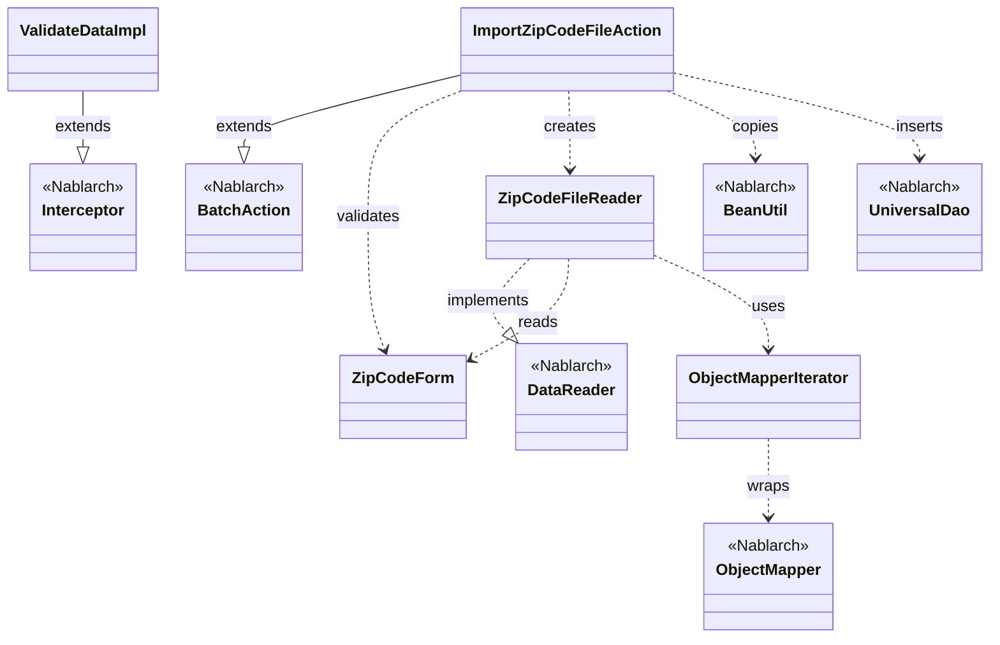
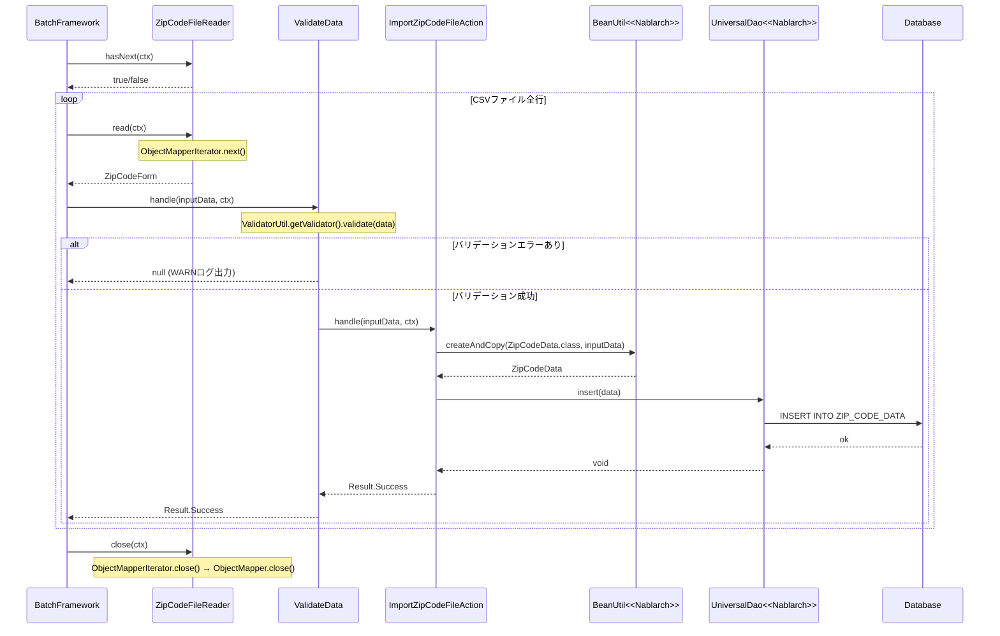

# Code Analysis: ImportZipCodeFileAction

**Generated**: 2026-03-13 20:30:29
**Target**: 住所ファイルをDBに登録するNablarchバッチアクション
**Modules**: nablarch-example-batch
**Analysis Duration**: unknown

---

## Overview

`ImportZipCodeFileAction` は、CSVファイル形式の住所データを読み込み、1レコードずつDBに登録するNablarchバッチアクションクラス。`BatchAction<ZipCodeForm>` を継承し、Nablarchバッチフレームワーク上で動作する。

主な処理の流れ：
1. `ZipCodeFileReader`（DataReader実装）がCSVファイルから1行ずつ`ZipCodeForm`として読み込む
2. `@ValidateData` インターセプタがBean Validationを実行し、バリデーションエラー時はWARNログを出力してスキップ
3. バリデーション済みデータを`BeanUtil.createAndCopy`で`ZipCodeData`エンティティに変換
4. `UniversalDao.insert`でDBに登録

フォームクラス（`ZipCodeForm`）には`@Csv`/`@CsvFormat`アノテーションでCSVフォーマットを定義し、`ObjectMapper`+`ObjectMapperIterator`でデータバインドを行う。

---

## Architecture

### Dependency Graph



**Note**: This diagram uses Mermaid `classDiagram` syntax to show class names and their relationships. Use `--|>` for inheritance (extends/implements) and `..>` for dependencies (uses/creates).

### Component Summary

| Component | Role | Type | Dependencies |
|-----------|------|------|--------------|
| ImportZipCodeFileAction | 住所CSVファイルをDBに登録するバッチアクション | Action | ZipCodeForm, ZipCodeFileReader, BeanUtil, UniversalDao |
| ZipCodeForm | CSV1行分のデータをバインドし、バリデーションを定義するフォーム | Form | なし |
| ZipCodeFileReader | CSVファイルから1行ずつZipCodeFormを読み込むデータリーダ | Reader | ZipCodeForm, ObjectMapperIterator, ObjectMapper, FilePathSetting |
| ValidateData | handleメソッド実行前にBean Validationを行うインターセプタ | Interceptor | ValidatorUtil, BeanUtil |
| ObjectMapperIterator | ObjectMapperをIteratorインターフェースでラップするユーティリティ | Utility | ObjectMapper |

---

## Flow

### Processing Flow

バッチフレームワークがメインループを制御し、`ZipCodeFileReader`からデータがなくなるまで以下を繰り返す：

1. **データ読み込み**: `ZipCodeFileReader.read(ctx)` がCSVファイルから1行を`ZipCodeForm`として返す
2. **バリデーション**: `@ValidateData`インターセプタが`ValidatorUtil.getValidator()`でBean Validationを実行
   - エラーあり: WARNログ出力後、`handle`はスキップ（`null`を返す）
   - エラーなし: 後続の`handle`処理へ進む
3. **エンティティ変換**: `BeanUtil.createAndCopy(ZipCodeData.class, inputData)` でFormをEntityに変換
4. **DB登録**: `UniversalDao.insert(data)` で`ZIP_CODE_DATA`テーブルに登録
5. **成功返却**: `new Result.Success()` を返してフレームワークに成功を通知

### Sequence Diagram



---

## Components

### ImportZipCodeFileAction

**ファイル**: [ImportZipCodeFileAction.java](../../.lw/nab-official/v6/nablarch-example-batch/src/main/java/com/nablarch/example/app/batch/action/ImportZipCodeFileAction.java)

**役割**: `BatchAction<ZipCodeForm>`を継承したバッチのメイン処理クラス。CSVから読み込んだ住所データを1件ずつDBに登録する。

**主要メソッド**:
- `handle(ZipCodeForm inputData, ExecutionContext ctx)` (L35-41): @ValidateDataインターセプタを経由して呼ばれる。BeanUtilでZipCodeDataに変換してUniversalDao.insertでDB登録
- `createReader(ExecutionContext ctx)` (L50-52): ZipCodeFileReaderのインスタンスを生成して返す

**依存コンポーネント**: ZipCodeForm, ZipCodeFileReader, BeanUtil, UniversalDao

**実装ポイント**:
- `@ValidateData`アノテーションを`handle`メソッドに付与することで、バリデーション処理をインターセプタに委譲し、handleには常にバリデーション済みデータが届く
- `BeanUtil.createAndCopy`でFormからEntityへの変換を行うため、フォームとエンティティのプロパティ名を一致させる必要がある

---

### ZipCodeForm

**ファイル**: [ZipCodeForm.java](../../.lw/nab-official/v6/nablarch-example-batch/src/main/java/com/nablarch/example/app/batch/form/ZipCodeForm.java)

**役割**: CSVファイルの1行分のデータをバインドし、Bean Validationのルールを定義するフォームクラス。

**主要アノテーション**:
- `@Csv(type = CsvType.CUSTOM, properties = {...})` (L17-20): CSVのカラムとプロパティのマッピングを定義
- `@CsvFormat(charset = "UTF-8", ...)` (L21-23): CSVのフォーマット詳細設定
- `@Domain` / `@Required`: 各プロパティのバリデーションルール
- `@LineNumber` on `getLineNumber()` (L143): 行番号の自動設定

**依存コンポーネント**: なし（データクラス）

**実装ポイント**:
- 全プロパティがString型（バイナリデータとして受け取り、バリデーション後にentityで型変換）
- `lineNumber`プロパティにより、バリデーションエラー時のログに行番号が出力される

---

### ZipCodeFileReader

**ファイル**: [ZipCodeFileReader.java](../../.lw/nab-official/v6/nablarch-example-batch/src/main/java/com/nablarch/example/app/batch/reader/ZipCodeFileReader.java)

**役割**: `DataReader<ZipCodeForm>`を実装し、CSVファイルを1行ずつ読み込んで`ZipCodeForm`として返すデータリーダ。

**主要メソッド**:
- `read(ExecutionContext ctx)` (L40-45): 初回呼び出し時にinitialize()で初期化し、イテレータから1行分を返す
- `hasNext(ExecutionContext ctx)` (L54-59): 次行の有無を判定
- `close(ExecutionContext ctx)` (L68-70): `ObjectMapperIterator.close()`を呼び出す
- `initialize()` (L78-89): `FilePathSetting`でファイルパスを取得し、`ObjectMapperFactory`でObjectMapperを生成してObjectMapperIteratorにラップ

**依存コンポーネント**: ZipCodeForm, ObjectMapperIterator, ObjectMapper, ObjectMapperFactory, FilePathSetting

**実装ポイント**:
- ファイル名は定数`FILE_NAME = "importZipCode"`で固定。`FilePathSetting`の`csv-input`ベースパス設定でディレクトリが決まる
- `ObjectMapperIterator`でラップすることでhasNext/nextのイテレータ形式に変換し、DataReaderの実装をシンプルにしている

---

### ValidateData

**ファイル**: [ValidateData.java](../../.lw/nab-official/v6/nablarch-example-batch/src/main/java/com/nablarch/example/app/batch/interceptor/ValidateData.java)

**役割**: `@Interceptor`アノテーションで定義されたバッチインターセプタ。`handle`メソッド実行前にBean Validationを行い、エラー時はWARNログを出力してhandleの実行をスキップする。

**主要メソッド**:
- `ValidateDataImpl.handle(Object data, ExecutionContext context)` (L60-93): `ValidatorUtil.getValidator()`でバリデーション実行。エラーがなければgetOriginalHandler()で後続のhandleを呼び出す

**依存コンポーネント**: ValidatorUtil, BeanUtil, LoggerManager, MessageUtil

**実装ポイント**:
- バリデーションエラー時は`null`を返すことでhandleをスキップし、バッチ処理を継続する（エラーがあっても後続レコードの処理を止めない）
- `lineNumber`プロパティの取得を`BeanUtil.getProperty`で行い、例外時はnullとして扱うことで、lineNumberプロパティがないBeanでも動作する

---

### ObjectMapperIterator

**ファイル**: [ObjectMapperIterator.java](../../.lw/nab-official/v6/nablarch-example-batch/src/main/java/com/nablarch/example/app/batch/reader/iterator/ObjectMapperIterator.java)

**役割**: `ObjectMapper`を`Iterator<E>`インターフェースでラップし、hasNext/nextの形式でデータを順次取得できるユーティリティクラス。

**主要メソッド**:
- コンストラクタ (L32-37): ObjectMapperを受け取り、最初の1件を先読みして`form`フィールドに保持
- `hasNext()` (L45-47): `form != null`で次行の有無を判定
- `next()` (L56-61): 現在の`form`を返しつつ次の`mapper.read()`で先読み
- `close()` (L66-68): `mapper.close()`でリソース解放

**依存コンポーネント**: ObjectMapper

**実装ポイント**:
- 1件先読み方式により、`hasNext()`が現在のデータ有無を正確に判定できる
- `close()`の呼び出しがないとCSVファイルのストリームが閉じられないため、`ZipCodeFileReader.close()`から必ず呼ぶ必要がある

---

## Nablarch Framework Usage

### BatchAction

**クラス**: `nablarch.fw.action.BatchAction`

**説明**: Nablarchバッチフレームワークのベースクラス。型パラメータにデータリーダが返すフォームクラスを指定する。フレームワークがDataReaderとのデータの橋渡しを行う。

**使用方法**:
```java
public class ImportZipCodeFileAction extends BatchAction<ZipCodeForm> {

    @Override
    public Result handle(ZipCodeForm inputData, ExecutionContext ctx) {
        // 1レコードの処理
        return new Result.Success();
    }

    @Override
    public DataReader<ZipCodeForm> createReader(ExecutionContext ctx) {
        return new ZipCodeFileReader();
    }
}
```

**重要ポイント**:
- ✅ **`createReader`でDataReaderを返す**: フレームワークがこのメソッドを呼び出してリーダーを取得する
- ✅ **`handle`の返値**: 正常終了時は`new Result.Success()`を返す
- 💡 **型パラメータ**: `BatchAction<ZipCodeForm>`の型パラメータが`handle`の引数型を決める

**このコードでの使い方**:
- `ImportZipCodeFileAction`が`BatchAction<ZipCodeForm>`を継承
- `handle(ZipCodeForm, ExecutionContext)`でDB登録処理を実装（L35-41）
- `createReader`で`ZipCodeFileReader`インスタンスを生成（L50-52）

**詳細**: [Nablarch Batch Getting Started](../../.claude/skills/nabledge-6/docs/processing-pattern/nablarch-batch/nablarch-batch-getting-started-nablarch-batch.md)

---

### UniversalDao

**クラス**: `nablarch.common.dao.UniversalDao`

**説明**: Jakarta PersistenceアノテーションをEntityに付けるだけで単純なCRUD操作ができる簡易O/Rマッパー。SQL文は実行時に自動構築される。

**使用方法**:
```java
// ZipCodeDataエンティティをINSERT
ZipCodeData data = BeanUtil.createAndCopy(ZipCodeData.class, inputData);
UniversalDao.insert(data);
```

**重要ポイント**:
- ✅ **EntityにJakarta Persistenceアノテーションが必要**: `@Entity`, `@Table`, `@Id`, `@Column`等をEntityクラスに付与する
- ⚠️ **主キー以外の条件での更新/削除不可**: 主キー以外の条件が必要な場合はdatabaseライブラリを使用する
- 💡 **SQLを書かなくてよい**: insert/update/delete/findBySqlFile等のメソッドで基本的なCRUDが実現できる
- ⚠️ **共通項目の自動設定なし**: 登録ユーザ・更新日時等の共通項目は、アプリケーションで明示的に設定する必要がある

**このコードでの使い方**:
- `handle`メソッド内でBeanUtil変換後のZipCodeDataをinsertする（L38）
- 1レコードずつinsertを呼び出すため、大量件数の場合はバッチinsert（`batchInsert`）の使用も検討する

**詳細**: [Libraries Universal DAO](../../.claude/skills/nabledge-6/docs/component/libraries/libraries-universal_dao.md)

---

### ObjectMapper / ObjectMapperFactory

**クラス**: `nablarch.common.databind.ObjectMapper` / `nablarch.common.databind.ObjectMapperFactory`

**説明**: CSVやTSV、固定長データをJava Beansとして扱うデータバインド機能。`ObjectMapperFactory.create`でObjectMapperを生成し、`read()`で1レコードずつデータを取得する。

**使用方法**:
```java
// ZipCodeFormクラスのアノテーション定義に従ってCSVをバインド
ObjectMapper<ZipCodeForm> mapper = ObjectMapperFactory.create(
    ZipCodeForm.class, new FileInputStream(zipCodeFile));

ZipCodeForm form = mapper.read(); // 1行読み込み
// null が返ったらファイル終端
mapper.close(); // 必ずclose
```

**重要ポイント**:
- ✅ **`close()`を必ず呼ぶ**: ストリームのリソース解放のために必須
- ⚠️ **スレッドアンセーフ**: 複数スレッドでインスタンスを共有しないこと
- 💡 **アノテーション駆動**: `ZipCodeForm`の`@Csv`/`@CsvFormat`でフォーマットを宣言的に定義できる
- ⚠️ **外部データは全プロパティString型で**: 不正データを業務エラーとして通知するため、外部から受け付けたデータのフォームプロパティはString型にする

**このコードでの使い方**:
- `ZipCodeFileReader.initialize()`で`ObjectMapperFactory.create(ZipCodeForm.class, ...)`でmapperを生成（L84-85）
- `ObjectMapperIterator`にラップしてDataReaderのhasNext/readパターンに対応
- `ZipCodeFileReader.close(ctx)`経由で`ObjectMapperIterator.close()`→`mapper.close()`が呼ばれる（L68-70）

**詳細**: [Libraries Data Bind](../../.claude/skills/nabledge-6/docs/component/libraries/libraries-data_bind.md)

---

### ValidatorUtil / Bean Validation

**クラス**: `nablarch.core.validation.ee.ValidatorUtil`

**説明**: Jakarta Bean ValidationのValidatorを取得するNablarchユーティリティ。`ValidatorUtil.getValidator()`でValidatorインスタンスを取得し、`validate(bean)`でBean Validationを実行する。

**使用方法**:
```java
// ValidateDataImpl.handle内での使い方
Validator validator = ValidatorUtil.getValidator();
Set<ConstraintViolation<Object>> violations = validator.validate(data);

if (violations.isEmpty()) {
    // バリデーション成功 → 後続処理へ
    return getOriginalHandler().handle(data, context);
}
// バリデーションエラー → ログ出力してスキップ
```

**重要ポイント**:
- ✅ **ドメインバリデーションには`@Domain`アノテーション**: `ZipCodeForm`の各プロパティに`@Domain("zipCode")`等を付与することで、ドメイン定義のルールが適用される
- 💡 **バリデーション共通化**: `@ValidateData`インターセプタを使うことで、複数のバッチアクションでバリデーション処理を共通化できる
- ⚠️ **バリデーション実行順序は保証されない**: Jakarta Bean Validationの仕様上、相関バリデーションが先に呼ばれる場合があるため、未入力状態でも例外が発生しない実装が必要

**このコードでの使い方**:
- `ValidateData.ValidateDataImpl.handle`内で`ValidatorUtil.getValidator()`を使用（L63）
- `ZipCodeForm`の各フィールドに`@Required`と`@Domain`アノテーションを付与してバリデーションルールを定義

**詳細**: [Libraries Bean Validation](../../.claude/skills/nabledge-6/docs/component/libraries/libraries-bean_validation.md)

---

## References

### Source Files

- [ImportZipCodeFileAction.java (.lw/nab-official/v5/nablarch-example-batch/src/main/java/com/nablarch/example/app/batch/action)](../../.lw/nab-official/v5/nablarch-example-batch/src/main/java/com/nablarch/example/app/batch/action/ImportZipCodeFileAction.java) - ImportZipCodeFileAction
- [ImportZipCodeFileAction.java (.lw/nab-official/v6/nablarch-example-batch/src/main/java/com/nablarch/example/app/batch/action)](../../.lw/nab-official/v6/nablarch-example-batch/src/main/java/com/nablarch/example/app/batch/action/ImportZipCodeFileAction.java) - ImportZipCodeFileAction
- [ZipCodeForm.java (.lw/nab-official/v5/nablarch-example-batch/src/main/java/com/nablarch/example/app/batch/form)](../../.lw/nab-official/v5/nablarch-example-batch/src/main/java/com/nablarch/example/app/batch/form/ZipCodeForm.java) - ZipCodeForm
- [ZipCodeForm.java (.lw/nab-official/v6/nablarch-example-batch/src/main/java/com/nablarch/example/app/batch/form)](../../.lw/nab-official/v6/nablarch-example-batch/src/main/java/com/nablarch/example/app/batch/form/ZipCodeForm.java) - ZipCodeForm
- [ZipCodeFileReader.java (.lw/nab-official/v5/nablarch-example-batch/src/main/java/com/nablarch/example/app/batch/reader)](../../.lw/nab-official/v5/nablarch-example-batch/src/main/java/com/nablarch/example/app/batch/reader/ZipCodeFileReader.java) - ZipCodeFileReader
- [ZipCodeFileReader.java (.lw/nab-official/v6/nablarch-example-batch/src/main/java/com/nablarch/example/app/batch/reader)](../../.lw/nab-official/v6/nablarch-example-batch/src/main/java/com/nablarch/example/app/batch/reader/ZipCodeFileReader.java) - ZipCodeFileReader
- [ValidateData.java (.lw/nab-official/v5/nablarch-example-batch/src/main/java/com/nablarch/example/app/batch/interceptor)](../../.lw/nab-official/v5/nablarch-example-batch/src/main/java/com/nablarch/example/app/batch/interceptor/ValidateData.java) - ValidateData
- [ValidateData.java (.lw/nab-official/v6/nablarch-example-batch/src/main/java/com/nablarch/example/app/batch/interceptor)](../../.lw/nab-official/v6/nablarch-example-batch/src/main/java/com/nablarch/example/app/batch/interceptor/ValidateData.java) - ValidateData
- [ObjectMapperIterator.java (.lw/nab-official/v5/nablarch-example-batch/src/main/java/com/nablarch/example/app/batch/reader/iterator)](../../.lw/nab-official/v5/nablarch-example-batch/src/main/java/com/nablarch/example/app/batch/reader/iterator/ObjectMapperIterator.java) - ObjectMapperIterator
- [ObjectMapperIterator.java (.lw/nab-official/v6/nablarch-example-batch/src/main/java/com/nablarch/example/app/batch/reader/iterator)](../../.lw/nab-official/v6/nablarch-example-batch/src/main/java/com/nablarch/example/app/batch/reader/iterator/ObjectMapperIterator.java) - ObjectMapperIterator

### Knowledge Base (Nabledge-6)

- [Nablarch Batch Getting Started Nablarch Batch](../../.claude/skills/nabledge-6/docs/processing-pattern/nablarch-batch/nablarch-batch-getting-started-nablarch-batch.md)
- [Libraries Data_bind](../../.claude/skills/nabledge-6/docs/component/libraries/libraries-data_bind.md)
- [Libraries Bean_validation](../../.claude/skills/nabledge-6/docs/component/libraries/libraries-bean_validation.md)
- [Libraries Universal_dao](../../.claude/skills/nabledge-6/docs/component/libraries/libraries-universal_dao.md)

### Official Documentation


- [ApplicationException](https://nablarch.github.io/docs/LATEST/javadoc/nablarch/core/message/ApplicationException.html)
- [AssertTrue](https://nablarch.github.io/docs/LATEST/javadoc/jakarta/validation/constraints/AssertTrue.html)
- [BasicDaoContextFactory](https://nablarch.github.io/docs/LATEST/javadoc/nablarch/common/dao/BasicDaoContextFactory.html)
- [BatchAction](https://nablarch.github.io/docs/LATEST/javadoc/nablarch/fw/action/BatchAction.html)
- [Bean Validation](https://nablarch.github.io/docs/LATEST/doc/application_framework/application_framework/libraries/validation/bean_validation.html)
- [BeanUtil](https://nablarch.github.io/docs/LATEST/javadoc/nablarch/core/beans/BeanUtil.html)
- [BeanValidationStrategy](https://nablarch.github.io/docs/LATEST/javadoc/nablarch/common/web/validator/BeanValidationStrategy.html)
- [CachingCharsetDef](https://nablarch.github.io/docs/LATEST/javadoc/nablarch/core/validation/validator/unicode/CachingCharsetDef.html)
- [CompositeCharsetDef](https://nablarch.github.io/docs/LATEST/javadoc/nablarch/core/validation/validator/unicode/CompositeCharsetDef.html)
- [ConnectionFactory](https://nablarch.github.io/docs/LATEST/javadoc/nablarch/core/db/connection/ConnectionFactory.html)
- [CsvDataBindConfig](https://nablarch.github.io/docs/LATEST/javadoc/nablarch/common/databind/csv/CsvDataBindConfig.html)
- [CsvFormat](https://nablarch.github.io/docs/LATEST/javadoc/nablarch/common/databind/csv/CsvFormat.html)
- [Csv](https://nablarch.github.io/docs/LATEST/javadoc/nablarch/common/databind/csv/Csv.html)
- [Data Bind](https://nablarch.github.io/docs/LATEST/doc/application_framework/application_framework/libraries/data_io/data_bind.html)
- [DataBindConfig](https://nablarch.github.io/docs/LATEST/javadoc/nablarch/common/databind/DataBindConfig.html)
- [DataReader](https://nablarch.github.io/docs/LATEST/javadoc/nablarch/fw/DataReader.html)
- [DatabaseMetaDataExtractor](https://nablarch.github.io/docs/LATEST/javadoc/nablarch/common/dao/DatabaseMetaDataExtractor.html)
- [DatabaseMetaData](https://nablarch.github.io/docs/LATEST/javadoc/java/sql/DatabaseMetaData.html)
- [DeferredEntityList](https://nablarch.github.io/docs/LATEST/javadoc/nablarch/common/dao/DeferredEntityList.html)
- [Dialect](https://nablarch.github.io/docs/LATEST/javadoc/nablarch/core/db/dialect/Dialect.html)
- [DomainManager](https://nablarch.github.io/docs/LATEST/javadoc/nablarch/core/validation/ee/DomainManager.html)
- [Domain](https://nablarch.github.io/docs/LATEST/javadoc/nablarch/core/validation/ee/Domain.html)
- [EntityList](https://nablarch.github.io/docs/LATEST/javadoc/nablarch/common/dao/EntityList.html)
- [Field](https://nablarch.github.io/docs/LATEST/javadoc/nablarch/common/databind/fixedlength/Field.html)
- [FileResponse](https://nablarch.github.io/docs/LATEST/javadoc/nablarch/common/web/download/FileResponse.html)
- [FixedLengthDataBindConfigBuilder](https://nablarch.github.io/docs/LATEST/javadoc/nablarch/common/databind/fixedlength/FixedLengthDataBindConfigBuilder.html)
- [FixedLengthDataBindConfig](https://nablarch.github.io/docs/LATEST/javadoc/nablarch/common/databind/fixedlength/FixedLengthDataBindConfig.html)
- [FixedLength](https://nablarch.github.io/docs/LATEST/javadoc/nablarch/common/databind/fixedlength/FixedLength.html)
- [H2Dialect](https://nablarch.github.io/docs/LATEST/javadoc/nablarch/core/db/dialect/H2Dialect.html)
- [HttpRequest](https://nablarch.github.io/docs/LATEST/javadoc/nablarch/fw/web/HttpRequest.html)
- [Index](https://nablarch.github.io/docs/LATEST/doc/application_framework/application_framework/batch/nablarch_batch/getting_started/nablarch_batch/index.html)
- [ItemNamedConstraintViolationConverterFactory](https://nablarch.github.io/docs/LATEST/javadoc/nablarch/core/validation/ee/ItemNamedConstraintViolationConverterFactory.html)
- [LineNumber](https://nablarch.github.io/docs/LATEST/javadoc/nablarch/common/databind/LineNumber.html)
- [LiteralCharsetDef](https://nablarch.github.io/docs/LATEST/javadoc/nablarch/core/validation/validator/unicode/LiteralCharsetDef.html)
- [MessageInterpolator](https://nablarch.github.io/docs/LATEST/javadoc/jakarta/validation/MessageInterpolator.html)
- [MultiLayoutConfig.RecordIdentifier](https://nablarch.github.io/docs/LATEST/javadoc/nablarch/common/databind/fixedlength/MultiLayoutConfig.RecordIdentifier.html)
- [MultiLayout](https://nablarch.github.io/docs/LATEST/javadoc/nablarch/common/databind/fixedlength/MultiLayout.html)
- [NablarchMessageInterpolator](https://nablarch.github.io/docs/LATEST/javadoc/nablarch/core/validation/ee/NablarchMessageInterpolator.html)
- [ObjectMapperFactory](https://nablarch.github.io/docs/LATEST/javadoc/nablarch/common/databind/ObjectMapperFactory.html)
- [ObjectMapper](https://nablarch.github.io/docs/LATEST/javadoc/nablarch/common/databind/ObjectMapper.html)
- [OnError](https://nablarch.github.io/docs/LATEST/javadoc/nablarch/fw/web/interceptor/OnError.html)
- [Pagination](https://nablarch.github.io/docs/LATEST/javadoc/nablarch/common/dao/Pagination.html)
- [PartInfo](https://nablarch.github.io/docs/LATEST/javadoc/nablarch/fw/web/upload/PartInfo.html)
- [RangedCharsetDef](https://nablarch.github.io/docs/LATEST/javadoc/nablarch/core/validation/validator/unicode/RangedCharsetDef.html)
- [Required](https://nablarch.github.io/docs/LATEST/javadoc/nablarch/core/validation/ee/Required.html)
- [SimpleDbTransactionManager](https://nablarch.github.io/docs/LATEST/javadoc/nablarch/core/db/transaction/SimpleDbTransactionManager.html)
- [Size](https://nablarch.github.io/docs/LATEST/javadoc/nablarch/core/validation/ee/Size.html)
- [SystemCharConfig](https://nablarch.github.io/docs/LATEST/javadoc/nablarch/core/validation/ee/SystemCharConfig.html)
- [SystemChar](https://nablarch.github.io/docs/LATEST/javadoc/nablarch/core/validation/ee/SystemChar.html)
- [TransactionFactory](https://nablarch.github.io/docs/LATEST/javadoc/nablarch/core/transaction/TransactionFactory.html)
- [Universal Dao](https://nablarch.github.io/docs/LATEST/doc/application_framework/application_framework/libraries/database/universal_dao.html)
- [UniversalDao.Transaction](https://nablarch.github.io/docs/LATEST/javadoc/nablarch/common/dao/UniversalDao.Transaction.html)
- [UniversalDao](https://nablarch.github.io/docs/LATEST/javadoc/nablarch/common/dao/UniversalDao.html)
- [Valid](https://nablarch.github.io/docs/LATEST/javadoc/jakarta/validation/Valid.html)
- [ValidationUtil](https://nablarch.github.io/docs/LATEST/javadoc/nablarch/core/validation/ValidationUtil.html)
- [ValidatorUtil](https://nablarch.github.io/docs/LATEST/javadoc/nablarch/core/validation/ee/ValidatorUtil.html)

---

**Note**: This documentation was generated by the code-analysis workflow of the nabledge-6 skill.
