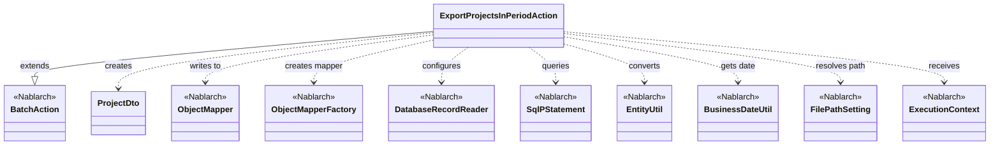
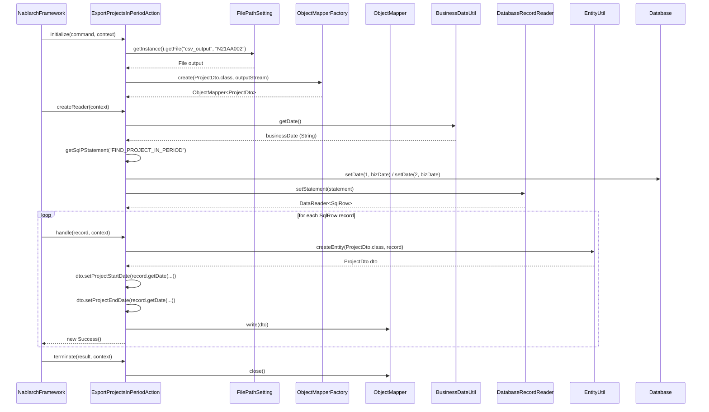

# Code Analysis: ExportProjectsInPeriodAction

**Generated**: 2026-03-13 20:38:09
**Target**: 期間内プロジェクト一覧出力バッチアクション
**Modules**: proman-batch
**Analysis Duration**: approx. 2m 49s

---

## Overview

`ExportProjectsInPeriodAction` は、業務日付を基準として期間内のプロジェクト一覧をCSVファイルに出力する都度起動バッチアクションクラス。Nablarchの `BatchAction<SqlRow>` を継承し、`initialize` / `createReader` / `handle` / `terminate` の4メソッドを実装するDB→CSVエクスポートパターンを採用している。

- `initialize`: `FilePathSetting` でCSV出力先を特定し、`ObjectMapperFactory` で `ProjectDto` 用の `ObjectMapper` を生成
- `createReader`: `BusinessDateUtil` で業務日付を取得し、`DatabaseRecordReader` + `SqlPStatement` でプロジェクトをSQL検索
- `handle`: `EntityUtil.createEntity` で `SqlRow` を `ProjectDto` に変換後、`mapper.write(dto)` でCSVに1行出力
- `terminate`: `mapper.close()` でリソース解放

---

## Architecture

### Dependency Graph



**Note**: This diagram uses Mermaid `classDiagram` syntax to show class names and their relationships. Use `--|>` for inheritance (extends/implements) and `..>` for dependencies (uses/creates).

### Component Summary

| Component | Role | Type | Dependencies |
|-----------|------|------|--------------|
| ExportProjectsInPeriodAction | 期間内プロジェクトCSV出力バッチアクション | Action | ProjectDto, ObjectMapper, DatabaseRecordReader, FilePathSetting, BusinessDateUtil, EntityUtil |
| ProjectDto | プロジェクト情報CSV出力用DTO | Bean | なし |
| FIND_PROJECT_IN_PERIOD | 期間内プロジェクト検索SQL | SQL | なし |

---

## Flow

### Processing Flow

バッチフレームワークが `initialize` → `createReader` → `handle`（全レコード繰り返し）→ `terminate` の順に呼び出す。

1. **初期化** (`initialize`): `FilePathSetting.getInstance().getFile("csv_output", "N21AA002")` でCSV出力ファイルパスを解決し、`ObjectMapperFactory.create(ProjectDto.class, outputStream)` で `ObjectMapper` を生成
2. **データリーダ生成** (`createReader`): `BusinessDateUtil.getDate()` で業務日付を取得し、SQL `FIND_PROJECT_IN_PERIOD` に業務日付を開始日・終了日の両パラメータとしてセット。`DatabaseRecordReader` にステートメントを設定して返却
3. **レコード処理** (`handle`): フレームワークがSQLの全結果行を1件ずつ渡す。`EntityUtil.createEntity(ProjectDto.class, record)` で `ProjectDto` に変換後、日付型が異なる `PROJECT_START_DATE` / `PROJECT_END_DATE` は `record.getDate()` → setter で個別設定。`mapper.write(dto)` でCSV1行を出力し `new Success()` を返す
4. **終了処理** (`terminate`): `mapper.close()` でバッファをフラッシュしストリームをクローズ

### Sequence Diagram



---

## Components

### ExportProjectsInPeriodAction

**ファイル**: [ExportProjectsInPeriodAction.java](../../.lw/nab-official/v6/nablarch-system-development-guide/Sample_Project/Source_Code/proman-project/proman-batch/src/main/java/com/nablarch/example/proman/batch/project/ExportProjectsInPeriodAction.java)

**役割**: 業務日付を基準に期間内プロジェクトをDBから取得し、CSVファイルに出力する都度起動バッチアクション

**主要メソッド**:
- `initialize(CommandLine, ExecutionContext)` (L44-54): 出力先ファイルを特定し `ObjectMapper` を初期化
- `createReader(ExecutionContext)` (L57-65): 業務日付パラメータ付きのDB検索ステートメントを設定した `DatabaseRecordReader` を生成
- `handle(SqlRow, ExecutionContext)` (L68-75): `SqlRow` → `ProjectDto` 変換と `mapper.write(dto)` によるCSV1行出力
- `terminate(Result, ExecutionContext)` (L78-80): `mapper.close()` によるリソース解放

**依存コンポーネント**: `ProjectDto`, `ObjectMapper`, `ObjectMapperFactory`, `DatabaseRecordReader`, `SqlPStatement`, `EntityUtil`, `BusinessDateUtil`, `FilePathSetting`, `ExecutionContext`

**実装上の注意**: `EntityUtil.createEntity` は型が一致するプロパティのみ自動マッピングするため、`java.sql.Date` 型の `PROJECT_START_DATE` / `PROJECT_END_DATE` は `String` 型の `ProjectDto` フィールドと型が合わず、個別に setter を呼び出している (L71-72)

### ProjectDto

**ファイル**: [ProjectDto.java](../../.lw/nab-official/v6/nablarch-system-development-guide/Sample_Project/Source_Code/proman-project/proman-batch/src/main/java/com/nablarch/example/proman/batch/project/ProjectDto.java)

**役割**: CSVファイル出力用のプロジェクト情報DTO。`@Csv` / `@CsvFormat` アノテーションでCSVフォーマットを定義

**アノテーション設定** (L15-21):
- `@Csv(type = Csv.CsvType.CUSTOM, properties = {...}, headers = {...})`: 出力列の順序と日本語ヘッダを定義
- `@CsvFormat(fieldSeparator = ',', lineSeparator = "\r\n", quote = '"', quoteMode = CsvDataBindConfig.QuoteMode.ALL, charset = "UTF-8")`: 全フィールドをダブルクォートで囲む設定 (`QuoteMode.ALL`)

**依存コンポーネント**: なし（純粋なデータオブジェクト）

---

## Nablarch Framework Usage

### BatchAction

**クラス**: `nablarch.fw.action.BatchAction`

**説明**: Nablarch都度起動バッチのベースクラス。`initialize` / `createReader` / `handle` / `terminate` のライフサイクルメソッドを提供する

**使用方法**:
```java
public class ExportProjectsInPeriodAction extends BatchAction<SqlRow> {
    @Override
    protected void initialize(CommandLine command, ExecutionContext context) { ... }

    @Override
    public DataReader<SqlRow> createReader(ExecutionContext context) { ... }

    @Override
    public Result handle(SqlRow record, ExecutionContext context) { ... }

    @Override
    protected void terminate(Result result, ExecutionContext context) { ... }
}
```

**重要ポイント**:
- ✅ **`terminate` でリソース解放**: `ObjectMapper` など `initialize` で生成したリソースは必ず `terminate` で `close()` すること
- 💡 **`getSqlPStatement` メソッド**: `BatchAction` 基底クラスが提供するメソッドで、SQL IDに対応するステートメントを取得できる
- 🎯 **DB to FILE パターン**: `createReader` で `DatabaseRecordReader` を返すことでDBレコードを1件ずつ処理するパターンを実現

**このコードでの使い方**:
- `initialize` でObjectMapper生成、`createReader` でDB検索設定、`handle` で1件処理、`terminate` でclose

**詳細**: [Nablarch Batch Architecture](../../.claude/skills/nabledge-6/docs/processing-pattern/nablarch-batch/nablarch-batch-architecture.md)

---

### DatabaseRecordReader

**クラス**: `nablarch.fw.reader.DatabaseRecordReader`

**説明**: データベースのクエリ結果を1件ずつ `DataReader` として提供する標準データリーダ

**使用方法**:
```java
DatabaseRecordReader reader = new DatabaseRecordReader();
SqlPStatement statement = getSqlPStatement("FIND_PROJECT_IN_PERIOD");
statement.setDate(1, bizDate);
reader.setStatement(statement);
return reader;
```

**重要ポイント**:
- ✅ **パラメータはステートメントにセット**: `setStatement` 前にバインドパラメータを設定すること
- ⚠️ **`data_bind` 使用時は `FileDataReader` を使わない**: `DatabaseRecordReader` はDB向け、`FileDataReader` はデータフォーマット機能向けのため、`data_bind` を使う場合は `DatabaseRecordReader` を選択

**このコードでの使い方**:
- `createReader` (L58-64) で生成し、業務日付パラメータ付きSQLをセット

**詳細**: [Nablarch Batch Architecture](../../.claude/skills/nabledge-6/docs/processing-pattern/nablarch-batch/nablarch-batch-architecture.md)

---

### ObjectMapper / ObjectMapperFactory

**クラス**: `nablarch.common.databind.ObjectMapper` / `nablarch.common.databind.ObjectMapperFactory`

**説明**: CSVやTSV、固定長データをJava Beansとして扱う機能を提供する。`@Csv` / `@CsvFormat` アノテーションで定義されたフォーマットに従いデータを書き込む

**使用方法**:
```java
// initialize() での生成
FileOutputStream outputStream = new FileOutputStream(output);
this.mapper = ObjectMapperFactory.create(ProjectDto.class, outputStream);

// handle() での書き込み
mapper.write(dto);

// terminate() でのクローズ
this.mapper.close();
```

**重要ポイント**:
- ✅ **必ず `close()` を呼ぶ**: バッファをフラッシュしリソースを解放する。`terminate()` でのクローズが必須
- ⚠️ **スレッドアンセーフ**: `ObjectMapper` インスタンスを複数スレッドで共有してはならない
- ⚠️ **型変換の制限**: `null` プロパティは空文字として出力される。型変換が必要な場合は個別 setter が必要（`ProjectStartDate` / `ProjectEndDate` の実装参照）
- 💡 **アノテーション駆動**: `@Csv` / `@CsvFormat` でフォーマットを宣言的に定義できる

**このコードでの使い方**:
- `initialize()` (L50) で `ProjectDto` 用 `ObjectMapper` を生成し、`handle()` (L73) で `mapper.write(dto)` を呼び出し、`terminate()` (L79) で `mapper.close()`

**詳細**: [Libraries Data_bind](../../.claude/skills/nabledge-6/docs/component/libraries/libraries-data_bind.md)

---

### FilePathSetting

**クラス**: `nablarch.core.util.FilePathSetting`

**説明**: ファイルの論理名とディレクトリパスを紐付けて管理する。コンポーネント定義で `basePathSettings` / `fileExtensions` を設定し、`getFile(論理名, ファイル名)` で実際のファイルオブジェクトを取得する

**使用方法**:
```java
FilePathSetting filePathSetting = FilePathSetting.getInstance();
File output = filePathSetting.getFile("csv_output", "N21AA002");
```

**コンポーネント設定例**:
```xml
<component name="filePathSetting" class="nablarch.core.util.FilePathSetting">
  <property name="basePathSettings">
    <map>
      <entry key="csv_output" value="file:/var/nablarch/output" />
    </map>
  </property>
  <property name="fileExtensions">
    <map>
      <entry key="csv_output" value="csv" />
    </map>
  </property>
</component>
```

**重要ポイント**:
- ✅ **コンポーネント名は `filePathSetting`**: Nablarchが自動で認識する名前
- 💡 **論理名でパス管理**: 環境ごとにベースパスを変更でき、コードの変更なしに出力先を切り替え可能
- ⚠️ **`classpath` スキームはWebサーバによっては使用不可**: JBoss/WildflyなどではfileスキームのUseを推奨

**このコードでの使い方**:
- `initialize()` (L45-47) で `FilePathSetting.getInstance()` を呼び出し、`"csv_output"` 論理名から `N21AA002.csv` の出力先 `File` オブジェクトを取得

**詳細**: [Libraries File_path_management](../../.claude/skills/nabledge-6/docs/component/libraries/libraries-file_path_management.md)

---

### BusinessDateUtil

**クラス**: `nablarch.core.date.BusinessDateUtil`

**説明**: システムに設定された業務日付を取得するユーティリティ。実際のシステム日付ではなく、業務上の「本日」を返す

**使用方法**:
```java
String bizDateStr = BusinessDateUtil.getDate(); // "20260313" 形式
Date bizDate = new Date(DateUtil.getDate(bizDateStr).getTime());
statement.setDate(1, bizDate);
```

**重要ポイント**:
- 🎯 **業務日付 vs システム日付**: テストや締め日処理など、システム日付と業務日付を分離して管理する場合に使用
- 💡 **`DateUtil.getDate()` と組み合わせ**: `BusinessDateUtil.getDate()` が返す文字列("yyyyMMdd")を `java.util.Date` に変換するには `DateUtil.getDate()` を使用

**このコードでの使い方**:
- `createReader()` (L60) で業務日付を取得し、`project_start_date <= ? AND project_end_date >= ?` のパラメータに設定

---

## References

### Source Files

- [ExportProjectsInPeriodAction.java (.lw/nab-official/v5/nablarch-system-development-guide/en/Sample_Project/Source_Code/proman-project/proman-batch/src/main/java/com/nablarch/example/proman/batch/project)](../../.lw/nab-official/v5/nablarch-system-development-guide/en/Sample_Project/Source_Code/proman-project/proman-batch/src/main/java/com/nablarch/example/proman/batch/project/ExportProjectsInPeriodAction.java) - ExportProjectsInPeriodAction
- [ExportProjectsInPeriodAction.java (.lw/nab-official/v5/nablarch-system-development-guide/Sample_Project/Source_Code/proman-project/proman-batch/src/main/java/com/nablarch/example/proman/batch/project)](../../.lw/nab-official/v5/nablarch-system-development-guide/Sample_Project/Source_Code/proman-project/proman-batch/src/main/java/com/nablarch/example/proman/batch/project/ExportProjectsInPeriodAction.java) - ExportProjectsInPeriodAction
- [ExportProjectsInPeriodAction.java (.lw/nab-official/v6/nablarch-system-development-guide/en/Sample_Project/Source_Code/proman-project/proman-batch/src/main/java/com/nablarch/example/proman/batch/project)](../../.lw/nab-official/v6/nablarch-system-development-guide/en/Sample_Project/Source_Code/proman-project/proman-batch/src/main/java/com/nablarch/example/proman/batch/project/ExportProjectsInPeriodAction.java) - ExportProjectsInPeriodAction
- [ExportProjectsInPeriodAction.java (.lw/nab-official/v6/nablarch-system-development-guide/Sample_Project/Source_Code/proman-project/proman-batch/src/main/java/com/nablarch/example/proman/batch/project)](../../.lw/nab-official/v6/nablarch-system-development-guide/Sample_Project/Source_Code/proman-project/proman-batch/src/main/java/com/nablarch/example/proman/batch/project/ExportProjectsInPeriodAction.java) - ExportProjectsInPeriodAction
- [ProjectDto.java (.lw/nab-official/v5/nablarch-system-development-guide/en/Sample_Project/Source_Code/proman-project/proman-batch/src/main/java/com/nablarch/example/proman/batch/project)](../../.lw/nab-official/v5/nablarch-system-development-guide/en/Sample_Project/Source_Code/proman-project/proman-batch/src/main/java/com/nablarch/example/proman/batch/project/ProjectDto.java) - ProjectDto
- [ProjectDto.java (.lw/nab-official/v5/nablarch-system-development-guide/Sample_Project/Source_Code/proman-project/proman-batch/src/main/java/com/nablarch/example/proman/batch/project)](../../.lw/nab-official/v5/nablarch-system-development-guide/Sample_Project/Source_Code/proman-project/proman-batch/src/main/java/com/nablarch/example/proman/batch/project/ProjectDto.java) - ProjectDto
- [ProjectDto.java (.lw/nab-official/v5/nablarch-example-web/src/main/java/com/nablarch/example/app/web/dto)](../../.lw/nab-official/v5/nablarch-example-web/src/main/java/com/nablarch/example/app/web/dto/ProjectDto.java) - ProjectDto
- [ProjectDto.java (.lw/nab-official/v6/nablarch-system-development-guide/en/Sample_Project/Source_Code/proman-project/proman-batch/src/main/java/com/nablarch/example/proman/batch/project)](../../.lw/nab-official/v6/nablarch-system-development-guide/en/Sample_Project/Source_Code/proman-project/proman-batch/src/main/java/com/nablarch/example/proman/batch/project/ProjectDto.java) - ProjectDto
- [ProjectDto.java (.lw/nab-official/v6/nablarch-system-development-guide/Sample_Project/Source_Code/proman-project/proman-batch/src/main/java/com/nablarch/example/proman/batch/project)](../../.lw/nab-official/v6/nablarch-system-development-guide/Sample_Project/Source_Code/proman-project/proman-batch/src/main/java/com/nablarch/example/proman/batch/project/ProjectDto.java) - ProjectDto
- [ProjectDto.java (.lw/nab-official/v6/nablarch-example-web/src/main/java/com/nablarch/example/app/web/dto)](../../.lw/nab-official/v6/nablarch-example-web/src/main/java/com/nablarch/example/app/web/dto/ProjectDto.java) - ProjectDto

### Knowledge Base (Nabledge-6)

- [Libraries Data_bind](../../.claude/skills/nabledge-6/docs/component/libraries/libraries-data_bind.md)
- [Nablarch Batch Architecture](../../.claude/skills/nabledge-6/docs/processing-pattern/nablarch-batch/nablarch-batch-architecture.md)
- [Nablarch Batch Nablarch_batch_pessimistic_lock](../../.claude/skills/nabledge-6/docs/processing-pattern/nablarch-batch/nablarch-batch-nablarch_batch_pessimistic_lock.md)
- [Libraries File_path_management](../../.claude/skills/nabledge-6/docs/component/libraries/libraries-file_path_management.md)
- [Nablarch Batch Getting Started Nablarch Batch](../../.claude/skills/nabledge-6/docs/processing-pattern/nablarch-batch/nablarch-batch-getting-started-nablarch-batch.md)

### Official Documentation


- [Architecture](https://nablarch.github.io/docs/LATEST/doc/application_framework/application_framework/batch/nablarch_batch/architecture.html)
- [AsyncMessageSendAction](https://nablarch.github.io/docs/LATEST/javadoc/nablarch/fw/messaging/action/AsyncMessageSendAction.html)
- [BatchAction](https://nablarch.github.io/docs/LATEST/javadoc/nablarch/fw/action/BatchAction.html)
- [BeanUtil](https://nablarch.github.io/docs/LATEST/javadoc/nablarch/core/beans/BeanUtil.html)
- [CsvDataBindConfig](https://nablarch.github.io/docs/LATEST/javadoc/nablarch/common/databind/csv/CsvDataBindConfig.html)
- [CsvFormat](https://nablarch.github.io/docs/LATEST/javadoc/nablarch/common/databind/csv/CsvFormat.html)
- [Csv](https://nablarch.github.io/docs/LATEST/javadoc/nablarch/common/databind/csv/Csv.html)
- [Data Bind](https://nablarch.github.io/docs/LATEST/doc/application_framework/application_framework/libraries/data_io/data_bind.html)
- [DataBindConfig](https://nablarch.github.io/docs/LATEST/javadoc/nablarch/common/databind/DataBindConfig.html)
- [DataReader](https://nablarch.github.io/docs/LATEST/javadoc/nablarch/fw/DataReader.html)
- [DatabaseRecordReader](https://nablarch.github.io/docs/LATEST/javadoc/nablarch/fw/reader/DatabaseRecordReader.html)
- [DispatchHandler](https://nablarch.github.io/docs/LATEST/javadoc/nablarch/fw/handler/DispatchHandler.html)
- [Field](https://nablarch.github.io/docs/LATEST/javadoc/nablarch/common/databind/fixedlength/Field.html)
- [File Path Management](https://nablarch.github.io/docs/LATEST/doc/application_framework/application_framework/libraries/file_path_management.html)
- [FileBatchAction](https://nablarch.github.io/docs/LATEST/javadoc/nablarch/fw/action/FileBatchAction.html)
- [FileDataReader](https://nablarch.github.io/docs/LATEST/javadoc/nablarch/fw/reader/FileDataReader.html)
- [FilePathSetting](https://nablarch.github.io/docs/LATEST/javadoc/nablarch/core/util/FilePathSetting.html)
- [FileResponse](https://nablarch.github.io/docs/LATEST/javadoc/nablarch/common/web/download/FileResponse.html)
- [FixedLengthDataBindConfigBuilder](https://nablarch.github.io/docs/LATEST/javadoc/nablarch/common/databind/fixedlength/FixedLengthDataBindConfigBuilder.html)
- [FixedLengthDataBindConfig](https://nablarch.github.io/docs/LATEST/javadoc/nablarch/common/databind/fixedlength/FixedLengthDataBindConfig.html)
- [FixedLength](https://nablarch.github.io/docs/LATEST/javadoc/nablarch/common/databind/fixedlength/FixedLength.html)
- [Index](https://nablarch.github.io/docs/LATEST/doc/application_framework/application_framework/batch/nablarch_batch/getting_started/nablarch_batch/index.html)
- [LineNumber](https://nablarch.github.io/docs/LATEST/javadoc/nablarch/common/databind/LineNumber.html)
- [MultiLayoutConfig.RecordIdentifier](https://nablarch.github.io/docs/LATEST/javadoc/nablarch/common/databind/fixedlength/MultiLayoutConfig.RecordIdentifier.html)
- [MultiLayout](https://nablarch.github.io/docs/LATEST/javadoc/nablarch/common/databind/fixedlength/MultiLayout.html)
- [Nablarch Batch Pessimistic Lock](https://nablarch.github.io/docs/LATEST/doc/application_framework/application_framework/batch/nablarch_batch/feature_details/nablarch_batch_pessimistic_lock.html)
- [NoInputDataBatchAction](https://nablarch.github.io/docs/LATEST/javadoc/nablarch/fw/action/NoInputDataBatchAction.html)
- [ObjectMapperFactory](https://nablarch.github.io/docs/LATEST/javadoc/nablarch/common/databind/ObjectMapperFactory.html)
- [ObjectMapper](https://nablarch.github.io/docs/LATEST/javadoc/nablarch/common/databind/ObjectMapper.html)
- [PartInfo](https://nablarch.github.io/docs/LATEST/javadoc/nablarch/fw/web/upload/PartInfo.html)
- [ProcessStopHandler.ProcessStop](https://nablarch.github.io/docs/LATEST/javadoc/nablarch/fw/handler/ProcessStopHandler.ProcessStop.html)
- [Result](https://nablarch.github.io/docs/LATEST/javadoc/nablarch/fw/Result.html)
- [ResumeDataReader](https://nablarch.github.io/docs/LATEST/javadoc/nablarch/fw/reader/ResumeDataReader.html)
- [StatusCodeConvertHandler](https://nablarch.github.io/docs/LATEST/javadoc/nablarch/fw/handler/StatusCodeConvertHandler.html)
- [UniversalDao](https://nablarch.github.io/docs/LATEST/javadoc/nablarch/common/dao/UniversalDao.html)
- [ValidatableFileDataReader](https://nablarch.github.io/docs/LATEST/javadoc/nablarch/fw/reader/ValidatableFileDataReader.html)

---

**Note**: This documentation was generated by the code-analysis workflow of the nabledge-6 skill.
