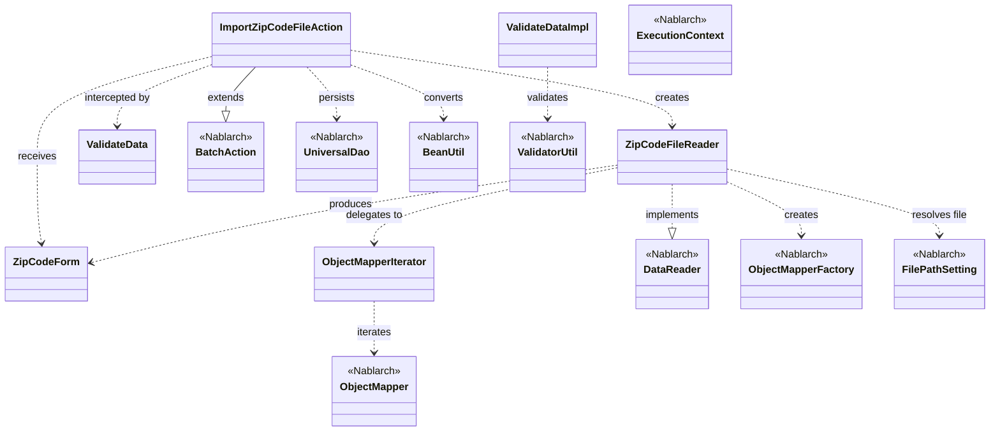
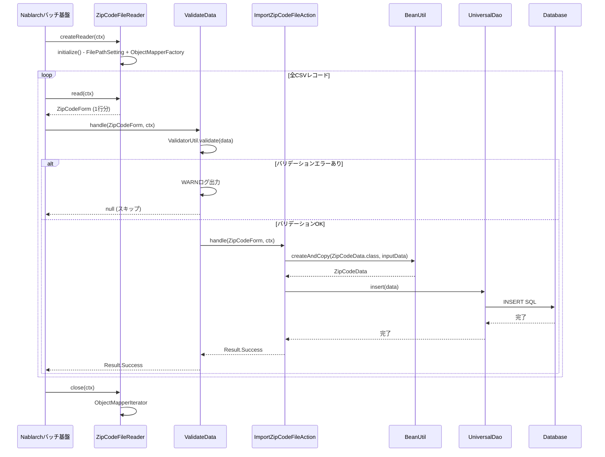

# Code Analysis: ImportZipCodeFileAction

**Generated**: 2026-03-30 18:56:59
**Target**: 住所ファイルCSVをDBに一括インポートするバッチアクション
**Modules**: nablarch-example-batch
**Analysis Duration**: approx. 3m 31s

---

## Overview

`ImportZipCodeFileAction` は Nablarch バッチフレームワークを使用して、住所CSVファイルの全レコードをDBに登録するバッチアクションクラスである。`BatchAction<ZipCodeForm>` を継承し、`ZipCodeFileReader` がCSVから1行ずつ読み込んだ `ZipCodeForm` を受け取って、`BeanUtil` でエンティティに変換後 `UniversalDao.insert` でDBに登録する。バリデーションは `@ValidateData` インターセプタにより `handle` メソッド実行前に自動実行されるため、`handle` には常にバリデーション済みデータが渡される。

---

## Architecture

### Dependency Graph



**Note**: This diagram uses Mermaid `classDiagram` syntax to show class names and their relationships. Use `--|>` for inheritance (extends/implements) and `..>` for dependencies (uses/creates).

### Component Summary

| Component | Role | Type | Dependencies |
|-----------|------|------|--------------|
| ImportZipCodeFileAction | CSVインポートバッチアクション | Action | ZipCodeForm, ZipCodeFileReader, BeanUtil, UniversalDao |
| ZipCodeForm | CSVバインド・バリデーションフォーム | Form | なし |
| ZipCodeFileReader | 住所CSVファイルデータリーダ | DataReader | ObjectMapperFactory, ObjectMapperIterator, FilePathSetting |
| ObjectMapperIterator | ObjectMapperをIteratorとしてラップ | Iterator | ObjectMapper |
| ValidateData | Bean Validationを実行するインターセプタ | Interceptor | ValidatorUtil, BeanUtil |

---

## Flow

### Processing Flow

バッチ起動後、Nablarchハンドラキューが実行される。`ZipCodeFileReader` が CSV ファイルを開き、1レコードずつ `ZipCodeForm` にバインドして提供する。`@ValidateData` インターセプタが各レコードに対して Bean Validation を実行し、エラーがあれば WARN ログを出力してそのレコードをスキップする。バリデーション通過後は `handle` メソッドが呼ばれ、`BeanUtil.createAndCopy` でフォームを `ZipCodeData` エンティティに変換し、`UniversalDao.insert` でDBに登録する。全レコード処理が完了すると `ZipCodeFileReader#close` でファイルリソースが解放される。

### Sequence Diagram



---

## Components

### ImportZipCodeFileAction

**ファイル**: [ImportZipCodeFileAction.java](../../.lw/nab-official/v6/nablarch-example-batch/src/main/java/com/nablarch/example/app/batch/action/ImportZipCodeFileAction.java)

**役割**: 住所CSVの各レコードをDBに登録するバッチアクション

**主要メソッド**:
- `handle(ZipCodeForm, ExecutionContext)` (L35-41): `@ValidateData` でインターセプトされる。`BeanUtil.createAndCopy` でフォームをエンティティに変換し `UniversalDao.insert` でDB登録
- `createReader(ExecutionContext)` (L50-52): `ZipCodeFileReader` インスタンスを返す

**依存コンポーネント**: `ZipCodeForm`, `ZipCodeFileReader`, `BeanUtil`, `UniversalDao`, `ValidateData`

---

### ZipCodeForm

**ファイル**: [ZipCodeForm.java](../../.lw/nab-official/v6/nablarch-example-batch/src/main/java/com/nablarch/example/app/batch/form/ZipCodeForm.java)

**役割**: CSVの1レコードをバインドし、Bean Validationを実施するフォームクラス

**主要フィールド**:
- `localGovernmentCode`, `zipCode5digit`, `zipCode7digit`: 地域コード・郵便番号（@Domain/@Required）
- `prefectureKana`, `cityKana`, `addressKana`: カナ住所情報
- `prefectureKanji`, `cityKanji`, `addressKanji`: 漢字住所情報
- `lineNumber` (L136): `@LineNumber` で行番号が自動設定される (L143)

**クラスアノテーション**:
- `@Csv(type=CsvType.CUSTOM, properties={...})`: CSVプロパティマッピング定義
- `@CsvFormat(charset="UTF-8", fieldSeparator=',', quoteMode=QuoteMode.NORMAL, ...)`: CSV読み取り設定

**依存コンポーネント**: なし（データオブジェクト）

---

### ZipCodeFileReader

**ファイル**: [ZipCodeFileReader.java](../../.lw/nab-official/v6/nablarch-example-batch/src/main/java/com/nablarch/example/app/batch/reader/ZipCodeFileReader.java)

**役割**: 住所CSVファイルを読み込んで1行ずつ `ZipCodeForm` を返すデータリーダ

**主要メソッド**:
- `read(ExecutionContext)` (L40-45): イテレータから1行分のデータを返す。未初期化時は `initialize()` を呼ぶ
- `hasNext(ExecutionContext)` (L54-59): 次行の有無を判定
- `close(ExecutionContext)` (L68-70): `ObjectMapperIterator#close()` を呼び出してリソース解放
- `initialize()` (L78-89): `FilePathSetting` でファイルパス解決、`ObjectMapperFactory` でマッパー生成、`ObjectMapperIterator` でラップ

**依存コンポーネント**: `ZipCodeForm`, `ObjectMapperFactory`, `ObjectMapperIterator`, `FilePathSetting`

---

### ObjectMapperIterator

**ファイル**: [ObjectMapperIterator.java](../../.lw/nab-official/v6/nablarch-example-batch/src/main/java/com/nablarch/example/app/batch/reader/iterator/ObjectMapperIterator.java)

**役割**: `ObjectMapper` を `Iterator` インタフェースでラップして、データリーダの実装をシンプルにするユーティリティ

**主要メソッド**:
- コンストラクタ (L32-37): `ObjectMapper` を受け取り、初回データ読み込みを実施
- `hasNext()` (L45-47): 読み込んだデータが `null` でなければ `true`
- `next()` (L56-60): 現在のデータを返しつつ次のデータを先読み
- `close()` (L65-67): `mapper.close()` を呼び出し

**依存コンポーネント**: `ObjectMapper`

---

### ValidateData

**ファイル**: [ValidateData.java](../../.lw/nab-official/v6/nablarch-example-batch/src/main/java/com/nablarch/example/app/batch/interceptor/ValidateData.java)

**役割**: `handle` メソッドをインターセプトしてBean Validationを実行するインターセプタアノテーション

**主要メソッド** (`ValidateDataImpl#handle`, L60-92):
- `ValidatorUtil.getValidator()` でバリデータを取得し `validator.validate(data)` を実行
- バリデーションエラーなし: `getOriginalHandler().handle(data, context)` で元ハンドラに委譲
- バリデーションエラーあり: WARN ログを出力し `null` を返却（そのレコードをスキップ）
- `lineNumber` プロパティがあれば行番号もログに含める (L74-79)

**依存コンポーネント**: `ValidatorUtil`, `BeanUtil`, `LoggerManager`, `MessageUtil`

---

## Nablarch Framework Usage

### BatchAction

**クラス**: `nablarch.fw.action.BatchAction<T>`

**説明**: 汎用バッチアクションの基底クラス。データリーダから渡されるレコード1件ごとの業務ロジックを実装するためのテンプレートクラス

**使用方法**:
```java
public class ImportZipCodeFileAction extends BatchAction<ZipCodeForm> {
    @Override
    public Result handle(ZipCodeForm inputData, ExecutionContext ctx) {
        // 業務ロジック
        return new Result.Success();
    }

    @Override
    public DataReader<ZipCodeForm> createReader(ExecutionContext ctx) {
        return new ZipCodeFileReader();
    }
}
```

**重要ポイント**:
- ✅ **`handle` の戻り値**: 正常終了は `new Result.Success()` を返す
- ⚠️ **`FileBatchAction` との使い分け**: `FileBatchAction` は `data_format` を使用するため、`data_bind`（ObjectMapper）を使う場合は `BatchAction` を使うこと
- 💡 **インターセプタ活用**: `@ValidateData` のようにインターセプタを定義すると、バリデーション処理をバッチ間で共通化できる

**このコードでの使い方**:
- `ImportZipCodeFileAction` が `BatchAction<ZipCodeForm>` を継承
- `handle` (L35-41): フォーム→エンティティ変換+DB登録
- `createReader` (L50-52): `ZipCodeFileReader` のインスタンスを返す

**詳細**: [Nablarch Batch Getting Started Nablarch Batch](../../.claude/skills/nabledge-6/docs/processing-pattern/nablarch-batch/nablarch-batch-getting-started-nablarch-batch.md)

---

### ObjectMapper / ObjectMapperFactory

**クラス**: `nablarch.common.databind.ObjectMapper`, `nablarch.common.databind.ObjectMapperFactory`

**説明**: CSVやTSV、固定長データをJava Beansとして扱う機能を提供する。`ObjectMapperFactory.create` でマッパーを生成し、`read()` で1レコードずつ読み込む

**使用方法**:
```java
ObjectMapper<ZipCodeForm> mapper = ObjectMapperFactory.create(
    ZipCodeForm.class,
    new FileInputStream(zipCodeFile));
ZipCodeForm form = mapper.read();  // 1件読み込み
mapper.close();  // 必ずclose
```

**重要ポイント**:
- ✅ **必ず `close()` を呼ぶ**: バッファフラッシュとリソース解放が必要。`ZipCodeFileReader#close` → `ObjectMapperIterator#close` → `mapper.close()` の連鎖で実施
- ⚠️ **スレッドアンセーフ**: 複数スレッドで `ObjectMapper` インスタンスを共有しないこと
- ⚠️ **外部データのプロパティ型**: アップロードファイルなど外部データを読む場合、不正データを業務エラーとして通知するためプロパティはすべて `String` 型で定義すること
- 💡 **アノテーション駆動**: `@Csv(type=CsvType.CUSTOM)` + `@CsvFormat` でフォーマットを宣言的に定義。Mapクラスへのバインドは `ObjectMapper` 生成時に `CsvDataBindConfig` で指定

**このコードでの使い方**:
- `ZipCodeFileReader#initialize()` (L84-85): `ObjectMapperFactory.create(ZipCodeForm.class, inputStream)` でマッパー生成
- `ObjectMapperIterator` にラップして `read()`/`hasNext()` を `Iterator` として使用

**詳細**: [Libraries Data_bind](../../.claude/skills/nabledge-6/docs/component/libraries/libraries-data_bind.md)

---

### UniversalDao

**クラス**: `nablarch.common.dao.UniversalDao`

**説明**: Jakarta Persistenceアノテーションを使った簡易O/Rマッパー。SQLを書かずに単純なCRUD操作が可能

**使用方法**:
```java
// 1件登録
ZipCodeData data = BeanUtil.createAndCopy(ZipCodeData.class, inputData);
UniversalDao.insert(data);
```

**重要ポイント**:
- ✅ **エンティティに `@Entity` が必要**: クラス名（パスカルケース）がテーブル名に変換される。テーブル名が一致しない場合は `@Table(name="...")` で明示指定
- ⚠️ **主キー以外の条件での更新/削除は不可**: その場合は `database`（JDBCラッパー）を使用すること
- 💡 **SQL自動構築**: `insert`/`update`/`delete`/`findById` はSQL文を実行時に自動構築するため、SQL記述不要

**このコードでの使い方**:
- `handle` (L38): `UniversalDao.insert(data)` で変換後の `ZipCodeData` を1件ずつDB登録

**詳細**: [Libraries Universal_dao](../../.claude/skills/nabledge-6/docs/component/libraries/libraries-universal_dao.md)

---

### BeanUtil

**クラス**: `nablarch.core.beans.BeanUtil`

**説明**: JavaBeansのプロパティコピーや生成を行うユーティリティ。同名プロパティ間の値コピーに使用

**使用方法**:
```java
ZipCodeData data = BeanUtil.createAndCopy(ZipCodeData.class, inputData);
```

**重要ポイント**:
- ✅ **`createAndCopy`**: 第1引数のクラスのインスタンスを生成し、第2引数オブジェクトの同名プロパティ値をコピー
- ⚠️ **型変換**: 同名でも型が異なる場合は変換されないため注意（`String` → `String` の単純コピーは問題なし）

**このコードでの使い方**:
- `handle` (L37): `BeanUtil.createAndCopy(ZipCodeData.class, inputData)` でフォームをエンティティに変換

**詳細**: [Libraries Data_bind](../../.claude/skills/nabledge-6/docs/component/libraries/libraries-data_bind.md)

---

## References

### Source Files

- [ImportZipCodeFileAction.java (.lw/nab-official/v5/nablarch-example-batch/src/main/java/com/nablarch/example/app/batch/action)](../../.lw/nab-official/v5/nablarch-example-batch/src/main/java/com/nablarch/example/app/batch/action/ImportZipCodeFileAction.java) - ImportZipCodeFileAction
- [ImportZipCodeFileAction.java (.lw/nab-official/v6/nablarch-example-batch/src/main/java/com/nablarch/example/app/batch/action)](../../.lw/nab-official/v6/nablarch-example-batch/src/main/java/com/nablarch/example/app/batch/action/ImportZipCodeFileAction.java) - ImportZipCodeFileAction
- [ZipCodeForm.java (.lw/nab-official/v5/nablarch-example-batch/src/main/java/com/nablarch/example/app/batch/form)](../../.lw/nab-official/v5/nablarch-example-batch/src/main/java/com/nablarch/example/app/batch/form/ZipCodeForm.java) - ZipCodeForm
- [ZipCodeForm.java (.lw/nab-official/v6/nablarch-example-batch/src/main/java/com/nablarch/example/app/batch/form)](../../.lw/nab-official/v6/nablarch-example-batch/src/main/java/com/nablarch/example/app/batch/form/ZipCodeForm.java) - ZipCodeForm
- [ZipCodeFileReader.java (.lw/nab-official/v5/nablarch-example-batch/src/main/java/com/nablarch/example/app/batch/reader)](../../.lw/nab-official/v5/nablarch-example-batch/src/main/java/com/nablarch/example/app/batch/reader/ZipCodeFileReader.java) - ZipCodeFileReader
- [ZipCodeFileReader.java (.lw/nab-official/v6/nablarch-example-batch/src/main/java/com/nablarch/example/app/batch/reader)](../../.lw/nab-official/v6/nablarch-example-batch/src/main/java/com/nablarch/example/app/batch/reader/ZipCodeFileReader.java) - ZipCodeFileReader
- [ObjectMapperIterator.java (.lw/nab-official/v5/nablarch-example-batch/src/main/java/com/nablarch/example/app/batch/reader/iterator)](../../.lw/nab-official/v5/nablarch-example-batch/src/main/java/com/nablarch/example/app/batch/reader/iterator/ObjectMapperIterator.java) - ObjectMapperIterator
- [ObjectMapperIterator.java (.lw/nab-official/v6/nablarch-example-batch/src/main/java/com/nablarch/example/app/batch/reader/iterator)](../../.lw/nab-official/v6/nablarch-example-batch/src/main/java/com/nablarch/example/app/batch/reader/iterator/ObjectMapperIterator.java) - ObjectMapperIterator
- [ValidateData.java (.lw/nab-official/v5/nablarch-example-batch/src/main/java/com/nablarch/example/app/batch/interceptor)](../../.lw/nab-official/v5/nablarch-example-batch/src/main/java/com/nablarch/example/app/batch/interceptor/ValidateData.java) - ValidateData
- [ValidateData.java (.lw/nab-official/v6/nablarch-example-batch/src/main/java/com/nablarch/example/app/batch/interceptor)](../../.lw/nab-official/v6/nablarch-example-batch/src/main/java/com/nablarch/example/app/batch/interceptor/ValidateData.java) - ValidateData

### Knowledge Base (Nabledge-6)

- [Nablarch Batch Getting Started Nablarch Batch](../../.claude/skills/nabledge-6/docs/processing-pattern/nablarch-batch/nablarch-batch-getting-started-nablarch-batch.md)
- [Nablarch Batch Architecture](../../.claude/skills/nabledge-6/docs/processing-pattern/nablarch-batch/nablarch-batch-architecture.md)
- [Libraries Data_bind](../../.claude/skills/nabledge-6/docs/component/libraries/libraries-data_bind.md)
- [Libraries Universal_dao](../../.claude/skills/nabledge-6/docs/component/libraries/libraries-universal_dao.md)

### Official Documentation


- [Architecture](https://nablarch.github.io/docs/LATEST/doc/application_framework/application_framework/batch/nablarch_batch/architecture.html)
- [AsyncMessageSendAction](https://nablarch.github.io/docs/LATEST/javadoc/nablarch/fw/messaging/action/AsyncMessageSendAction.html)
- [BasicDaoContextFactory](https://nablarch.github.io/docs/LATEST/javadoc/nablarch/common/dao/BasicDaoContextFactory.html)
- [BatchAction](https://nablarch.github.io/docs/LATEST/javadoc/nablarch/fw/action/BatchAction.html)
- [BeanUtil](https://nablarch.github.io/docs/LATEST/javadoc/nablarch/core/beans/BeanUtil.html)
- [ConnectionFactory](https://nablarch.github.io/docs/LATEST/javadoc/nablarch/core/db/connection/ConnectionFactory.html)
- [CsvDataBindConfig](https://nablarch.github.io/docs/LATEST/javadoc/nablarch/common/databind/csv/CsvDataBindConfig.html)
- [CsvFormat](https://nablarch.github.io/docs/LATEST/javadoc/nablarch/common/databind/csv/CsvFormat.html)
- [Csv](https://nablarch.github.io/docs/LATEST/javadoc/nablarch/common/databind/csv/Csv.html)
- [Data Bind](https://nablarch.github.io/docs/LATEST/doc/application_framework/application_framework/libraries/data_io/data_bind.html)
- [DataBindConfig](https://nablarch.github.io/docs/LATEST/javadoc/nablarch/common/databind/DataBindConfig.html)
- [DataReader](https://nablarch.github.io/docs/LATEST/javadoc/nablarch/fw/DataReader.html)
- [DatabaseMetaDataExtractor](https://nablarch.github.io/docs/LATEST/javadoc/nablarch/common/dao/DatabaseMetaDataExtractor.html)
- [DatabaseMetaData](https://nablarch.github.io/docs/LATEST/javadoc/java/sql/DatabaseMetaData.html)
- [DatabaseRecordReader](https://nablarch.github.io/docs/LATEST/javadoc/nablarch/fw/reader/DatabaseRecordReader.html)
- [DeferredEntityList](https://nablarch.github.io/docs/LATEST/javadoc/nablarch/common/dao/DeferredEntityList.html)
- [Dialect](https://nablarch.github.io/docs/LATEST/javadoc/nablarch/core/db/dialect/Dialect.html)
- [DispatchHandler](https://nablarch.github.io/docs/LATEST/javadoc/nablarch/fw/handler/DispatchHandler.html)
- [EntityList](https://nablarch.github.io/docs/LATEST/javadoc/nablarch/common/dao/EntityList.html)
- [Field](https://nablarch.github.io/docs/LATEST/javadoc/nablarch/common/databind/fixedlength/Field.html)
- [FileBatchAction](https://nablarch.github.io/docs/LATEST/javadoc/nablarch/fw/action/FileBatchAction.html)
- [FileDataReader](https://nablarch.github.io/docs/LATEST/javadoc/nablarch/fw/reader/FileDataReader.html)
- [FileResponse](https://nablarch.github.io/docs/LATEST/javadoc/nablarch/common/web/download/FileResponse.html)
- [FixedLengthDataBindConfigBuilder](https://nablarch.github.io/docs/LATEST/javadoc/nablarch/common/databind/fixedlength/FixedLengthDataBindConfigBuilder.html)
- [FixedLengthDataBindConfig](https://nablarch.github.io/docs/LATEST/javadoc/nablarch/common/databind/fixedlength/FixedLengthDataBindConfig.html)
- [FixedLength](https://nablarch.github.io/docs/LATEST/javadoc/nablarch/common/databind/fixedlength/FixedLength.html)
- [H2Dialect](https://nablarch.github.io/docs/LATEST/javadoc/nablarch/core/db/dialect/H2Dialect.html)
- [Index](https://nablarch.github.io/docs/LATEST/doc/application_framework/application_framework/batch/nablarch_batch/getting_started/nablarch_batch/index.html)
- [LineNumber](https://nablarch.github.io/docs/LATEST/javadoc/nablarch/common/databind/LineNumber.html)
- [MultiLayoutConfig.RecordIdentifier](https://nablarch.github.io/docs/LATEST/javadoc/nablarch/common/databind/fixedlength/MultiLayoutConfig.RecordIdentifier.html)
- [MultiLayout](https://nablarch.github.io/docs/LATEST/javadoc/nablarch/common/databind/fixedlength/MultiLayout.html)
- [NoInputDataBatchAction](https://nablarch.github.io/docs/LATEST/javadoc/nablarch/fw/action/NoInputDataBatchAction.html)
- [ObjectMapperFactory](https://nablarch.github.io/docs/LATEST/javadoc/nablarch/common/databind/ObjectMapperFactory.html)
- [ObjectMapper](https://nablarch.github.io/docs/LATEST/javadoc/nablarch/common/databind/ObjectMapper.html)
- [OnError](https://nablarch.github.io/docs/LATEST/javadoc/nablarch/fw/web/interceptor/OnError.html)
- [Pagination](https://nablarch.github.io/docs/LATEST/javadoc/nablarch/common/dao/Pagination.html)
- [PartInfo](https://nablarch.github.io/docs/LATEST/javadoc/nablarch/fw/web/upload/PartInfo.html)
- [ProcessStopHandler.ProcessStop](https://nablarch.github.io/docs/LATEST/javadoc/nablarch/fw/handler/ProcessStopHandler.ProcessStop.html)
- [Result](https://nablarch.github.io/docs/LATEST/javadoc/nablarch/fw/Result.html)
- [ResumeDataReader](https://nablarch.github.io/docs/LATEST/javadoc/nablarch/fw/reader/ResumeDataReader.html)
- [SimpleDbTransactionManager](https://nablarch.github.io/docs/LATEST/javadoc/nablarch/core/db/transaction/SimpleDbTransactionManager.html)
- [StatusCodeConvertHandler](https://nablarch.github.io/docs/LATEST/javadoc/nablarch/fw/handler/StatusCodeConvertHandler.html)
- [TransactionFactory](https://nablarch.github.io/docs/LATEST/javadoc/nablarch/core/transaction/TransactionFactory.html)
- [Universal Dao](https://nablarch.github.io/docs/LATEST/doc/application_framework/application_framework/libraries/database/universal_dao.html)
- [UniversalDao.Transaction](https://nablarch.github.io/docs/LATEST/javadoc/nablarch/common/dao/UniversalDao.Transaction.html)
- [UniversalDao](https://nablarch.github.io/docs/LATEST/javadoc/nablarch/common/dao/UniversalDao.html)
- [ValidatableFileDataReader](https://nablarch.github.io/docs/LATEST/javadoc/nablarch/fw/reader/ValidatableFileDataReader.html)

---

**Note**: This documentation was generated by the code-analysis workflow of the nabledge-6 skill.
