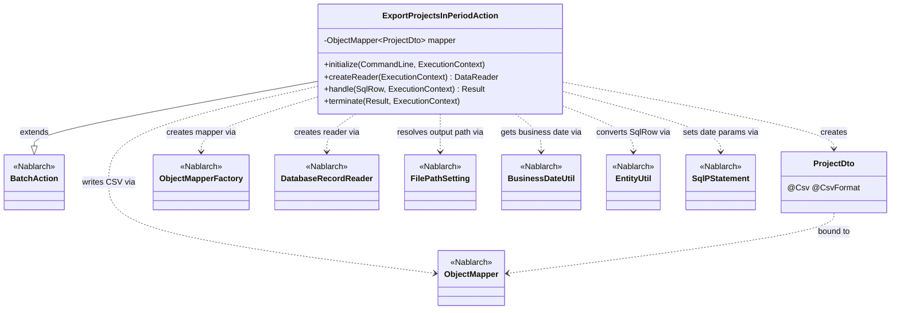
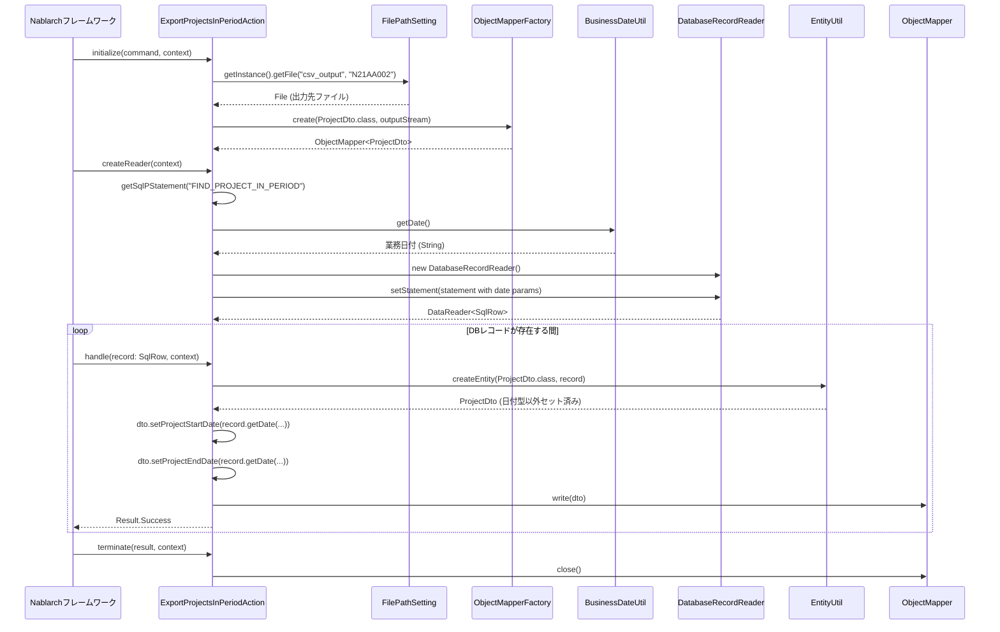

# Code Analysis: ExportProjectsInPeriodAction

**Generated**: 2026-03-30 19:05:49
**Target**: 期間内プロジェクト一覧出力バッチアクション
**Modules**: proman-batch
**Analysis Duration**: approx. 3m 0s

---

## Overview

`ExportProjectsInPeriodAction` は、業務日付を基準として期間内のプロジェクト一覧をCSVファイルへ出力する都度起動バッチアクションクラスである。`BatchAction<SqlRow>` を継承し、DBからデータを読み込んで `ObjectMapper` でCSV書き込みを行う「DB to FILE」パターンを実装している。

処理の流れは、`initialize()` でCSV出力先ファイルと `ObjectMapper` を初期化し、`createReader()` で業務日付を絞り込み条件にした `DatabaseRecordReader` を生成、`handle()` で各レコードを `ProjectDto` に変換してCSVへ書き込み、`terminate()` で `ObjectMapper` を閉じてリソースを解放する。

---

## Architecture

### Dependency Graph



**Note**: This diagram uses Mermaid `classDiagram` syntax to show class names and their relationships. Use `--|>` for inheritance (extends/implements) and `..>` for dependencies (uses/creates).

### Component Summary

| Component | Role | Type | Dependencies |
|-----------|------|------|--------------|
| ExportProjectsInPeriodAction | 期間内プロジェクトCSV出力バッチアクション | Action | DatabaseRecordReader, ObjectMapper, FilePathSetting, BusinessDateUtil, EntityUtil |
| ProjectDto | プロジェクト情報CSV出力用DTO（@Csv/@CsvFormat定義済み） | DTO/Bean | なし |

---

## Flow

### Processing Flow

1. **初期化フェーズ** (`initialize`): `FilePathSetting` で論理名 `csv_output` からCSV出力先ファイルパスを解決し、`ObjectMapperFactory.create()` で `ProjectDto` 向けの `ObjectMapper` を生成する。
2. **データリーダ生成** (`createReader`): `getSqlPStatement("FIND_PROJECT_IN_PERIOD")` でSQL文を取得し、`BusinessDateUtil.getDate()` で取得した業務日付（開始・終了）を検索条件としてバインド。`DatabaseRecordReader` にセットして返却する。
3. **レコード処理** (`handle`): フレームワークが各レコード（`SqlRow`）をループで渡す。`EntityUtil.createEntity()` で `SqlRow` を `ProjectDto` に変換し、日付型の不一致フィールドは明示的に `setProjectStartDate`/`setProjectEndDate` で設定後、`mapper.write(dto)` でCSV出力する。
4. **終了処理** (`terminate`): `mapper.close()` を呼び出してバッファフラッシュとリソース解放を行う。

### Sequence Diagram



---

## Components

### ExportProjectsInPeriodAction

**ファイル**: [ExportProjectsInPeriodAction.java](../../.lw/nab-official/v6/nablarch-system-development-guide/Sample_Project/Source_Code/proman-project/proman-batch/src/main/java/com/nablarch/example/proman/batch/project/ExportProjectsInPeriodAction.java)

**役割**: 期間内のプロジェクト情報をDBから読み込み、CSVファイルに出力する都度起動バッチアクション。`BatchAction<SqlRow>` のライフサイクルメソッドを実装して「DB to FILE」パターンを実現する。

**主要メソッド**:

- `initialize(CommandLine, ExecutionContext)` (L44-54): CSV出力先ファイルを `FilePathSetting` で解決し、`ObjectMapperFactory.create()` で `ObjectMapper` を生成・フィールドに保持する。
- `createReader(ExecutionContext)` (L57-65): `FIND_PROJECT_IN_PERIOD` SQLに業務日付を2箇所（開始・終了）バインドし、`DatabaseRecordReader` を構築して返却する。
- `handle(SqlRow, ExecutionContext)` (L68-75): `EntityUtil.createEntity()` で SqlRow を ProjectDto に変換後、型不一致の日付フィールドを明示的に設定し、`mapper.write(dto)` でCSVへ出力する。`Result.Success` を返す。
- `terminate(Result, ExecutionContext)` (L78-80): `mapper.close()` を呼び出してリソースを解放する。

**依存コンポーネント**: `ObjectMapper<ProjectDto>`, `FilePathSetting`, `DatabaseRecordReader`, `BusinessDateUtil`, `EntityUtil`, `SqlPStatement`, `ProjectDto`

---

### ProjectDto

**ファイル**: [ProjectDto.java](../../.lw/nab-official/v6/nablarch-system-development-guide/Sample_Project/Source_Code/proman-project/proman-batch/src/main/java/com/nablarch/example/proman/batch/project/ProjectDto.java)

**役割**: CSV出力対象のプロジェクト情報を保持するDTOクラス。`@Csv(type = CsvType.CUSTOM)` と `@CsvFormat` でCSVフォーマット（区切り文字、囲み文字、文字コード等）をアノテーションで宣言的に定義している。

**主要定義**:

- `@Csv` (L15-19): 出力プロパティ順序と日本語ヘッダ名を定義。
- `@CsvFormat` (L20-21): カスタムフォーマット（`QuoteMode.ALL`、UTF-8、CR+LF改行）を定義。
- `setProjectStartDate(Date)` / `setProjectEndDate(Date)` (L138-156): `java.util.Date` を受け取り `DateUtil.formatDate()` で `yyyy/MM/dd` 文字列に変換してフィールドにセットする。`EntityUtil` では型変換できないため Action 側から明示的に呼ばれる。

**依存コンポーネント**: `DateUtil` (Nablarch)

---

## Nablarch Framework Usage

### BatchAction

**クラス**: `nablarch.fw.action.BatchAction`

**説明**: Nablarchバッチ処理の汎用テンプレートクラス。フレームワークが `initialize` → (`createReader` → `handle` × N) → `terminate` の順でライフサイクルメソッドを呼び出す。

**使用方法**:
```java
public class ExportProjectsInPeriodAction extends BatchAction<SqlRow> {
    @Override
    protected void initialize(CommandLine command, ExecutionContext context) { ... }
    @Override
    public DataReader<SqlRow> createReader(ExecutionContext context) { ... }
    @Override
    public Result handle(SqlRow record, ExecutionContext context) { ... }
    @Override
    protected void terminate(Result result, ExecutionContext context) { ... }
}
```

**重要ポイント**:
- ✅ **`terminate()` で必ずリソース解放を行う**: `ObjectMapper` などのリソースはここで `close()` する。例外発生時も呼ばれるため、安全なクリーンアップが保証される。
- ⚠️ **`FileBatchAction` は data_bind と非互換**: `data_bind` の `ObjectMapper` を使う場合は `BatchAction` または `NoInputDataBatchAction` を使うこと。`FileBatchAction` は `data_format` を前提とする。
- 💡 **DB to FILEパターンの標準実装**: `createReader()` で `DatabaseRecordReader` を返し、`handle()` でCSV書き込みを行う構成が推奨パターン。

**このコードでの使い方**: `ExportProjectsInPeriodAction` が継承。`handle()` でレコードごとにCSV書き込み、`terminate()` で `ObjectMapper` を close。

**詳細**: [Nablarch Batch Architecture](../../.claude/skills/nabledge-6/docs/processing-pattern/nablarch-batch/nablarch-batch-architecture.md)

---

### ObjectMapper / ObjectMapperFactory

**クラス**: `nablarch.common.databind.ObjectMapper` / `nablarch.common.databind.ObjectMapperFactory`

**説明**: CSVやTSV、固定長データをJava Beansとして扱う機能を提供する。`ObjectMapperFactory.create()` でインスタンスを生成し、`write()` でデータを書き込む。

**使用方法**:
```java
// initialize() で生成
ObjectMapper<ProjectDto> mapper = ObjectMapperFactory.create(ProjectDto.class, outputStream);

// handle() でレコードごとに書き込み
mapper.write(dto);

// terminate() でリソース解放
mapper.close();
```

**重要ポイント**:
- ✅ **必ず `close()` を呼ぶ**: バッファをフラッシュしリソースを解放する。`terminate()` で確実に実行する。
- ⚠️ **スレッドアンセーフ**: 複数スレッドで `ObjectMapper` を共有してはならない。バッチの各スレッドで個別に生成すること。
- 💡 **アノテーション駆動**: `@Csv(type = CUSTOM)` と `@CsvFormat` でフォーマットを宣言的に定義できる。`ObjectMapperFactory.create()` 時に `DataBindConfig` は不要。

**このコードでの使い方**: `initialize()` で `ProjectDto` 用のmapperを生成してフィールドに保持。`handle()` で `mapper.write(dto)` を呼び出し、`terminate()` で `mapper.close()` を実行。

**詳細**: [Libraries Data_bind](../../.claude/skills/nabledge-6/docs/component/libraries/libraries-data_bind.md)

---

### DatabaseRecordReader

**クラス**: `nablarch.fw.reader.DatabaseRecordReader`

**説明**: DBの検索結果を1件ずつ `SqlRow` として `BatchAction` に提供するデータリーダ。`SqlPStatement` をセットして使用する。

**使用方法**:
```java
DatabaseRecordReader reader = new DatabaseRecordReader();
SqlPStatement statement = getSqlPStatement("FIND_PROJECT_IN_PERIOD");
statement.setDate(1, bizDate);
statement.setDate(2, bizDate);
reader.setStatement(statement);
return reader;
```

**重要ポイント**:
- ✅ **`getSqlPStatement()` で SQL を取得**: アクションクラスの `getSqlPStatement()` を使い、SQL IDでSQL文を取得する。
- 💡 **大量データ対応**: DBカーソルで逐次読み込むため、全件をメモリに展開せずに大量データを処理できる。

**このコードでの使い方**: `createReader()` で生成し、業務日付を開始・終了日として2回 `setDate()` でバインド後に返却。

**詳細**: [Nablarch Batch Architecture](../../.claude/skills/nabledge-6/docs/processing-pattern/nablarch-batch/nablarch-batch-architecture.md)

---

### FilePathSetting

**クラス**: `nablarch.core.util.FilePathSetting`

**説明**: コンポーネント設定ファイルで定義した論理ベースパス名からファイルパスを解決するユーティリティ。ハードコードを排除して環境依存のパスを設定ファイルで管理できる。

**使用方法**:
```java
FilePathSetting filePathSetting = FilePathSetting.getInstance();
File output = filePathSetting.getFile("csv_output", "N21AA002");
```

**重要ポイント**:
- ✅ **コンポーネント設定ファイルで `filePathSetting` コンポーネントを定義**: `basePathSettings` に論理名とディレクトリを、`fileExtensions` に拡張子を設定する。
- ⚠️ **classpathスキームはJBoss/Wildflyで動作しない**: 本番環境ではfileスキームを推奨。

**このコードでの使い方**: `initialize()` で `FilePathSetting.getInstance()` を呼び出し、論理名 `csv_output` からCSV出力先ファイル `N21AA002.csv` のパスを解決する。

**詳細**: [Libraries File_path_management](../../.claude/skills/nabledge-6/docs/component/libraries/libraries-file_path_management.md)

---

### BusinessDateUtil

**クラス**: `nablarch.core.date.BusinessDateUtil`

**説明**: システムで管理される業務日付を取得するユーティリティ。実際の日付でなく業務上の基準日を使った処理に使用する。

**使用方法**:
```java
// 業務日付を取得してSQLパラメータにバインド
Date bizDate = new Date(DateUtil.getDate(BusinessDateUtil.getDate()).getTime());
statement.setDate(1, bizDate);
```

**重要ポイント**:
- 💡 **システム日付との違い**: `BusinessDateUtil.getDate()` はDBやコンポーネント設定で管理される業務日付を返す。テスト・本番切り替えが容易。
- ⚠️ **文字列 → java.sql.Date 変換が必要**: `BusinessDateUtil.getDate()` は `String` を返すため、`DateUtil.getDate()` と `java.sql.Date` でラップして SQL パラメータに渡す。

**このコードでの使い方**: `createReader()` で業務日付を取得し、プロジェクト検索SQLの開始・終了日パラメータとして2回バインドする。

**詳細**: [Nablarch Batch Architecture](../../.claude/skills/nabledge-6/docs/processing-pattern/nablarch-batch/nablarch-batch-architecture.md)

---

### EntityUtil

**クラス**: `nablarch.common.dao.EntityUtil`

**説明**: `SqlRow`（DBレコード）をJava Beanクラスにマッピングするユーティリティ。列名とプロパティ名の対応を自動で処理する。

**使用方法**:
```java
ProjectDto dto = EntityUtil.createEntity(ProjectDto.class, record);
// 型が一致しないフィールドは明示的にsetter呼び出し
dto.setProjectStartDate(record.getDate("PROJECT_START_DATE"));
```

**重要ポイント**:
- ⚠️ **型不一致フィールドは自動変換されない**: `SqlRow` の `java.sql.Date` 型フィールドをDTOの `String` 型フィールドにマッピングする場合など、型が異なる場合は `EntityUtil` では設定できないため、明示的にsetterを呼ぶ必要がある。

**このコードでの使い方**: `handle()` で `EntityUtil.createEntity(ProjectDto.class, record)` を呼び出し、日付型フィールド（`projectStartDate`、`projectEndDate`）は型不一致のため `record.getDate()` で取得して明示的にsetterを呼ぶ。

**詳細**: [Nablarch Batch Architecture](../../.claude/skills/nabledge-6/docs/processing-pattern/nablarch-batch/nablarch-batch-architecture.md)

---

## References

### Source Files

- [ExportProjectsInPeriodAction.java (v6)](../../.lw/nab-official/v6/nablarch-system-development-guide/Sample_Project/Source_Code/proman-project/proman-batch/src/main/java/com/nablarch/example/proman/batch/project/ExportProjectsInPeriodAction.java)
- [ProjectDto.java (v6)](../../.lw/nab-official/v6/nablarch-system-development-guide/Sample_Project/Source_Code/proman-project/proman-batch/src/main/java/com/nablarch/example/proman/batch/project/ProjectDto.java)

### Knowledge Base (Nabledge-6)

- [Libraries Data_bind](../../.claude/skills/nabledge-6/docs/component/libraries/libraries-data_bind.md)
- [Libraries File_path_management](../../.claude/skills/nabledge-6/docs/component/libraries/libraries-file_path_management.md)
- [Nablarch Batch Architecture](../../.claude/skills/nabledge-6/docs/processing-pattern/nablarch-batch/nablarch-batch-architecture.md)
- [Nablarch Batch Getting Started](../../.claude/skills/nabledge-6/docs/processing-pattern/nablarch-batch/nablarch-batch-getting-started-nablarch-batch.md)

### Official Documentation

- [BatchAction Javadoc](https://nablarch.github.io/docs/LATEST/javadoc/nablarch/fw/action/BatchAction.html)
- [ObjectMapper Javadoc](https://nablarch.github.io/docs/LATEST/javadoc/nablarch/common/databind/ObjectMapper.html)
- [DatabaseRecordReader Javadoc](https://nablarch.github.io/docs/LATEST/javadoc/nablarch/fw/reader/DatabaseRecordReader.html)
- [FilePathSetting Javadoc](https://nablarch.github.io/docs/LATEST/javadoc/nablarch/core/util/FilePathSetting.html)
- [Data Bind](https://nablarch.github.io/docs/LATEST/doc/application_framework/application_framework/libraries/data_io/data_bind.html)
- [Batch Architecture](https://nablarch.github.io/docs/LATEST/doc/application_framework/application_framework/batch/nablarch_batch/architecture.html)

---

**Note**: This documentation was generated by the code-analysis workflow of the nabledge-6 skill.
