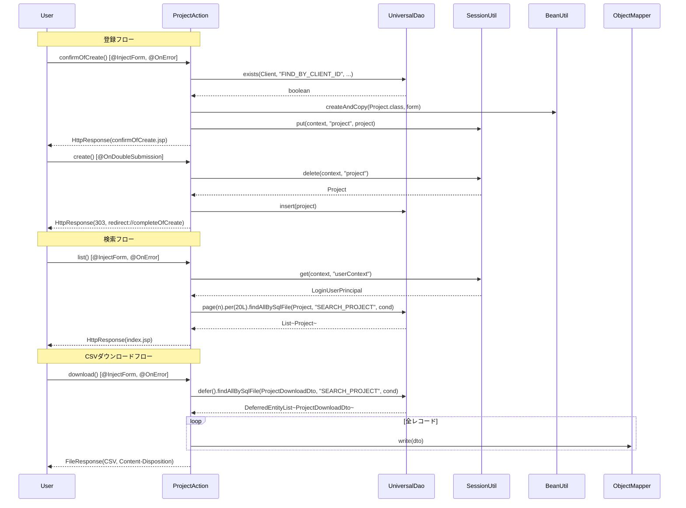

# Code Analysis: ProjectAction

**Generated**: 2026-03-31 10:54:21
**Target**: プロジェクトCRUD・検索・CSVダウンロード処理
**Modules**: nablarch-example-web
**Analysis Duration**: unknown

---

## Overview

`ProjectAction` はNablarch 6のウェブアプリケーションにおけるプロジェクト管理機能の中心的なActionクラスです。プロジェクトの新規登録・確認・更新・削除・一覧検索・CSVダウンロードという一連のCRUD操作を提供します。

セッションストアを活用したPRG（Post/Redirect/Get）パターンを採用し、二重サブミット防止（`@OnDoubleSubmission`）や入力バリデーション（`@InjectForm` + Bean Validation）、楽観的ロック（`@Version`）を組み合わせた堅牢なWebフォームフローを実現しています。CSVダウンロードでは`UniversalDao#defer`による遅延ロードと`ObjectMapper`の組み合わせで大量データを効率的に処理します。

---

## Architecture

### Dependency Graph

```mermaid
classDiagram
    class ProjectAction
    class Project
    class Client
    class ProjectForm
    class ProjectSearchForm
    class ProjectTargetForm
    class ProjectUpdateForm
    class ProjectDto
    class ProjectSearchDto
    class ProjectDownloadDto
    class LoginUserPrincipal
    class UniversalDao {
        <<Nablarch>>
    }
    class SessionUtil {
        <<Nablarch>>
    }
    class BeanUtil {
        <<Nablarch>>
    }
    class ObjectMapper {
        <<Nablarch>>
    }
    class FileResponse {
        <<Nablarch>>
    }
    class DeferredEntityList {
        <<Nablarch>>
    }

    ProjectAction ..> Project : persists
    ProjectAction ..> Client : queries
    ProjectAction ..> ProjectForm : validates
    ProjectAction ..> ProjectSearchForm : validates
    ProjectAction ..> ProjectTargetForm : validates
    ProjectAction ..> ProjectUpdateForm : validates
    ProjectAction ..> ProjectDto : maps to
    ProjectAction ..> ProjectSearchDto : maps to
    ProjectAction ..> ProjectDownloadDto : maps to
    ProjectAction ..> LoginUserPrincipal : reads session
    ProjectAction ..> UniversalDao : queries/persists
    ProjectAction ..> SessionUtil : manages session
    ProjectAction ..> BeanUtil : copies beans
    ProjectAction ..> ObjectMapper : serializes CSV
    ProjectAction ..> FileResponse : returns download
    ProjectAction ..> DeferredEntityList : deferred load
```



**Note**: This diagram uses Mermaid `classDiagram` syntax to show class names and their relationships. Use `--|>` for inheritance (extends/implements) and `..>` for dependencies (uses/creates).

### Component Summary

| Component | Role | Type | Dependencies |
|-----------|------|------|--------------|
| ProjectAction | プロジェクトCRUD・検索・ダウンロード処理 | Action | UniversalDao, SessionUtil, BeanUtil, ObjectMapper, FileResponse |
| Project | プロジェクトエンティティ（DB対応） | Entity | なし |
| Client | 顧客エンティティ（存在確認用） | Entity | なし |
| ProjectForm | プロジェクト登録フォーム（バリデーション付き） | Form | Bean Validation |
| ProjectSearchForm | プロジェクト検索フォーム（ページング・ソート） | Form | Bean Validation |
| ProjectTargetForm | プロジェクト特定フォーム（ID指定） | Form | Bean Validation |
| ProjectUpdateForm | プロジェクト更新フォーム | Form | Bean Validation |
| ProjectDto | プロジェクト情報DTO（JOIN結果含む） | DTO | なし |
| ProjectSearchDto | 検索条件Bean（型変換済み） | DTO | なし |
| ProjectDownloadDto | CSVダウンロード用Bean（@Csv付き） | DTO | なし |
| LoginUserPrincipal | ログインユーザー情報（セッション格納） | Auth | なし |

---

## Flow

### Processing Flow

ProjectActionは以下の主要フローを提供します。

**登録フロー**: `newEntity` → `confirmOfCreate`（入力→確認）→ `create`（DB登録、303リダイレクト）→ `completeOfCreate`（完了）。確認画面への遷移時に`@InjectForm`でバリデーション、顧客IDの存在確認を`UniversalDao#exists`で実施。セッションストアにProjectエンティティを一時格納し、`@OnDoubleSubmission`で二重送信を防止。

**検索フロー**: `index`（初期表示）→ `list`（検索実行）。`UniversalDao.page().per(20L).findAllBySqlFile()`でページング検索を実現。ログインユーザーIDを検索条件に追加してユーザー固有データのみ表示。

**更新フロー**: `edit`（更新画面）→ `confirmOfUpdate`（確認）→ `update`（DB更新）→ `completeOfUpdate`。楽観的ロック（`@Version`）によりデータ競合を検知。

**削除フロー**: `delete`（`@OnDoubleSubmission`付き）→ `completeOfDelete`。セッションから取得したProjectエンティティで`UniversalDao#delete`を実行。

**CSVダウンロードフロー**: `download`にて`UniversalDao#defer`でカーソル型の遅延ロード、`ObjectMapper`で1件ずつCSV書き込み、`FileResponse`でダウンロードレスポンスを返却。

### Sequence Diagram



---

## Components

### ProjectAction

**ファイル**: [ProjectAction.java](../../.lw/nab-official/v6/nablarch-example-web/src/main/java/com/nablarch/example/app/web/action/ProjectAction.java)

**役割**: プロジェクト管理機能全体を担うActionクラス。登録・更新・削除・検索・CSVダウンロードのHTTPエンドポイントを提供する。

**主要メソッド**:

- `newEntity` (L50-55): 登録初期画面表示。セッションの古い"project"を削除してから遷移。
- `confirmOfCreate` (L64-92): 登録確認画面表示。`@InjectForm`でバリデーション、顧客ID存在確認、Projectエンティティをセッション格納。
- `create` (L101-108): DB登録処理。`@OnDoubleSubmission`で二重送信防止、セッションからProjectを取得してinsert、303リダイレクト。
- `list` (L176-187) / `searchProject` (L198-208): 検索実行。ページング検索、ログインユーザーIDを条件に追加。
- `download` (L217-243): CSVダウンロード。遅延ロード＋ObjectMapper＋FileResponseでCSV出力。
- `edit` (L280-298): 更新初期画面。既存データをDTOで取得し画面に表示、楽観的ロック用にエンティティをセッション保存。
- `update` (L370-376): DB更新処理。`@OnDoubleSubmission`、楽観的ロック付きupdate実行。
- `delete` (L396-402): DB削除処理。セッションからProjectを取得しdelete実行。

**依存コンポーネント**:
- `UniversalDao`: CRUD操作、ページング検索、遅延ロード
- `SessionUtil`: ログインユーザー情報取得、PRGパターン用エンティティの一時格納
- `BeanUtil`: フォーム→エンティティ/DTO間のプロパティコピー
- `ObjectMapper` / `FileResponse`: CSVダウンロード

### ProjectForm / ProjectUpdateForm

**役割**: プロジェクト登録・更新時の入力値受付フォーム。`@Required` / `@Domain`でBean Validationを設定。

**実装ポイント**:
- 全プロパティをString型で定義（バリデーション後にBeanUtilで型変換）
- `@AssertTrue`で日付範囲のカスタムバリデーション（`isValidProjectPeriod`）

### ProjectSearchForm

**役割**: 検索条件入力フォーム（`SearchFormBase`を継承）。ページ番号・ソートキー管理を担う。

**実装ポイント**:
- `getSortId()`でsortKey+sortDirを組み合わせてSQLのソートIDを生成
- projectClassは`List<ProjectClass>`型で`@Valid`によるネストバリデーション

---

## Nablarch Framework Usage

### UniversalDao

**クラス**: `nablarch.common.dao.UniversalDao`

**説明**: Jakarta PersistenceアノテーションベースのシンプルなO/Rマッパー。SQLを記述せずにCRUD操作が可能で、SQLファイルを使った柔軟な検索もサポートする。

**使用方法**:
```java
// 主キー検索
Client client = UniversalDao.findById(Client.class, dto.getClientId());

// SQLファイル検索（JOIN結果をDTOにマッピング）
ProjectDto dto = UniversalDao.findBySqlFile(ProjectDto.class, "FIND_BY_PROJECT",
        new Object[]{projectId, userId});

// ページング検索
List<Project> list = UniversalDao
        .page(searchCondition.getPageNumber())
        .per(20L)
        .findAllBySqlFile(Project.class, "SEARCH_PROJECT", searchCondition);

// 遅延ロード（大量データ）
DeferredEntityList<ProjectDownloadDto> searchList =
    (DeferredEntityList<ProjectDownloadDto>) UniversalDao
        .defer()
        .findAllBySqlFile(ProjectDownloadDto.class, "SEARCH_PROJECT", searchCondition);

// 登録・更新・削除
UniversalDao.insert(project);
UniversalDao.update(project);  // @Versionで楽観的ロック
UniversalDao.delete(project);
```

**重要ポイント**:
- ✅ **CRUD操作はSQLなしで実現**: `insert` / `update` / `delete` はエンティティのJPAアノテーションからSQLを自動生成
- ⚠️ **主キー以外の条件での更新/削除はDatabase利用**: UniversalDaoは主キー指定の更新/削除のみサポート
- 💡 **ページング**: `page(n).per(m)` で簡潔にページング検索を実装。内部でCOUNT SQLも自動発行
- ⚡ **大量データは`defer()`を使用**: `findAllBySqlFile`は全件をメモリにロードするが、`defer()`はカーソル型で逐次処理しメモリ使用量を抑制

**このコードでの使い方**:
- `exists(Client, "FIND_BY_CLIENT_ID", ...)`: confirmOfCreate/confirmOfUpdateで顧客IDの存在確認（L70-71, L313）
- `insert(project)`: create()でProjectエンティティをDB登録（L105）
- `update(targetProject)`: update()で楽観的ロック付き更新（L373）
- `delete(project)`: delete()で主キー削除（L399）
- `page().per().findAllBySqlFile()`: searchProject()でページング検索（L204-207）
- `defer().findAllBySqlFile()`: download()でCSVダウンロード時の遅延ロード（L227-229）

**詳細**: [Libraries Universal_dao](../../.claude/skills/nabledge-6/docs/component/libraries/libraries-universal_dao.md)

---

### SessionUtil

**クラス**: `nablarch.common.web.session.SessionUtil`

**説明**: セッションストアに対する型安全なget/put/delete操作を提供するユーティリティ。PRGパターンでフォーム→確認→登録をまたぐデータ受け渡しに使用する。

**使用方法**:
```java
// セッションに格納
SessionUtil.put(context, "project", project);

// セッションから取得
LoginUserPrincipal userContext = SessionUtil.get(context, "userContext");

// セッションから取得してキー削除（登録・削除時）
Project project = SessionUtil.delete(context, "project");
```

**重要ポイント**:
- ✅ **フォームをセッションに格納しない**: セッションに格納するのはエンティティ（Bean）。フォームを直接格納すると型変換やバリデーション問題の原因になる
- ⚠️ **`delete`は取得と削除を同時実行**: create/update/delete処理でセッションから取得と同時に削除することで、処理後の残留データを防ぐ
- 💡 **PRGパターンとの組み合わせ**: 入力→確認→処理のフローでセッションを橋渡しに利用し、戻るボタンへの対応も可能

**このコードでの使い方**:
- `get(context, "userContext")`: 全フロー共通のログインユーザー情報取得（L81, L201, L223, etc.）
- `put(context, "project", project)`: confirmOfCreate/editでエンティティをセッション格納（L83, L295）
- `delete(context, "project")`: create/update/deleteでセッションから取得＆削除（L103, L372, L398）

---

### ObjectMapper / ObjectMapperFactory

**クラス**: `nablarch.common.databind.ObjectMapper`, `nablarch.common.databind.ObjectMapperFactory`

**説明**: JavaBeanとCSV/TSV/固定長ファイルの相互変換を行うデータバインドライブラリ。ストリームベースで処理するためメモリ効率が高い。

**使用方法**:
```java
final Path path = TempFileUtil.createTempFile();
try (DeferredEntityList<ProjectDownloadDto> searchList = ...;
     ObjectMapper<ProjectDownloadDto> mapper = ObjectMapperFactory.create(
             ProjectDownloadDto.class, TempFileUtil.newOutputStream(path))) {
    for (ProjectDownloadDto dto : searchList) {
        mapper.write(dto);
    }
}
FileResponse response = new FileResponse(path.toFile(), true);
response.setContentType("text/csv; charset=Shift_JIS");
response.setContentDisposition("プロジェクト一覧.csv");
```

**重要ポイント**:
- ✅ **try-with-resourcesで必ずclose**: OutputStreamへのフラッシュとリソース解放に必須
- ✅ **一時ファイルに書き出してからFileResponseに渡す**: レスポンスとしてストリームを返す前に全データを書き込み完了させる
- 💡 **`FileResponse(file, true)`の第2引数**: `true`指定でレスポンス送信後に一時ファイルが自動削除される
- ⚠️ **DTOに`@Csv`/`@CsvFormat`が必要**: ヘッダーとプロパティのマッピング、文字コード・区切り文字などはアノテーションで定義

**このコードでの使い方**:
- `download()`メソッド（L227-235）で`DeferredEntityList`と組み合わせて全件CSVを遅延出力

**詳細**: [Libraries Data_bind](../../.claude/skills/nabledge-6/docs/component/libraries/libraries-data_bind.md)

---

### @InjectForm / @OnError

**クラス**: `nablarch.common.web.interceptor.InjectForm`, `nablarch.fw.web.interceptor.OnError`

**説明**: `@InjectForm`はHTTPリクエストパラメータをフォームBeanにバインドしBean Validationを実行するインターセプター。`@OnError`はバリデーション例外発生時の遷移先を宣言的に指定する。

**使用方法**:
```java
@InjectForm(form = ProjectForm.class, prefix = "form")
@OnError(type = ApplicationException.class, path = "/WEB-INF/view/project/create.jsp")
public HttpResponse confirmOfCreate(HttpRequest request, ExecutionContext context) {
    ProjectForm form = context.getRequestScopedVar("form");
    // バリデーション済みフォームをリクエストスコープから取得
}
```

**重要ポイント**:
- ✅ **バリデーション済みフォームはリクエストスコープから取得**: `@InjectForm`が自動でリクエストスコープに格納
- ⚠️ **DBバリデーションは業務アクションに記述**: Bean Validationでは不可能なDB検索を要するバリデーション（存在確認等）はアクションメソッドに明示的に記述
- 💡 **`name`パラメータ**: JSPで参照するスコープ変数名を指定。省略時はデフォルト"form"

**このコードでの使い方**:
- `confirmOfCreate`(L64-65): ProjectFormのバリデーション、エラー時create.jspへ戻る
- `list`(L176-177): ProjectSearchFormのバリデーション、エラー時index.jspへ戻る
- `download`(L217-218): 検索条件のバリデーション
- `edit`(L280): ProjectTargetFormのバリデーション（IDの取得）

---

### @OnDoubleSubmission

**クラス**: `nablarch.common.web.token.OnDoubleSubmission`

**説明**: フォームトークンを利用したサーバーサイドの二重サブミット防止。JSが無効な環境でも確実に二重実行を防ぐ。

**使用方法**:
```java
@OnDoubleSubmission
public HttpResponse create(HttpRequest request, ExecutionContext context) {
    // 二重実行された場合はエラーページに遷移
}
```

**重要ポイント**:
- ✅ **登録・更新・削除処理に必ず付与**: 副作用のある処理（DB変更）は必ず二重サブミット防止を実装
- ⚠️ **JSPの`<n:form useToken="true">`と対応が必要**: サーバーサイドのトークンチェックとJSPのトークン埋め込みはセットで設定する
- 💡 **デフォルトエラー遷移先はコンポーネント設定で指定**: 個別に指定しない場合はコンポーネント設定のデフォルト遷移先を使用

**このコードでの使い方**:
- `create`(L101): プロジェクト新規登録
- `update`(L370): プロジェクト更新
- `delete`(L396): プロジェクト削除

---

## References

### Source Files

- [ProjectAction.java (.lw/nab-official/v5/nablarch-example-rest/src/main/java/com/nablarch/example/action)](../../.lw/nab-official/v5/nablarch-example-rest/src/main/java/com/nablarch/example/action/ProjectAction.java) - ProjectAction
- [ProjectAction.java (.lw/nab-official/v5/nablarch-example-web/src/main/java/com/nablarch/example/app/web/action)](../../.lw/nab-official/v5/nablarch-example-web/src/main/java/com/nablarch/example/app/web/action/ProjectAction.java) - ProjectAction
- [ProjectAction.java (.lw/nab-official/v6/nablarch-example-rest/src/main/java/com/nablarch/example/action)](../../.lw/nab-official/v6/nablarch-example-rest/src/main/java/com/nablarch/example/action/ProjectAction.java) - ProjectAction
- [ProjectAction.java (.lw/nab-official/v6/nablarch-example-web/src/main/java/com/nablarch/example/app/web/action)](../../.lw/nab-official/v6/nablarch-example-web/src/main/java/com/nablarch/example/app/web/action/ProjectAction.java) - ProjectAction
- [ProjectForm.java (.lw/nab-official/v6/nablarch-example-web/src/main/java/com/nablarch/example/app/web/form)](../../.lw/nab-official/v6/nablarch-example-web/src/main/java/com/nablarch/example/app/web/form/ProjectForm.java) - ProjectForm
- [ProjectSearchForm.java (.lw/nab-official/v6/nablarch-example-web/src/main/java/com/nablarch/example/app/web/form)](../../.lw/nab-official/v6/nablarch-example-web/src/main/java/com/nablarch/example/app/web/form/ProjectSearchForm.java) - ProjectSearchForm
- [ProjectUpdateForm.java (.lw/nab-official/v6/nablarch-example-web/src/main/java/com/nablarch/example/app/web/form)](../../.lw/nab-official/v6/nablarch-example-web/src/main/java/com/nablarch/example/app/web/form/ProjectUpdateForm.java) - ProjectUpdateForm
- [ProjectTargetForm.java (.lw/nab-official/v6/nablarch-example-web/src/main/java/com/nablarch/example/app/web/form)](../../.lw/nab-official/v6/nablarch-example-web/src/main/java/com/nablarch/example/app/web/form/ProjectTargetForm.java) - ProjectTargetForm
- [ProjectDto.java (.lw/nab-official/v6/nablarch-example-web/src/main/java/com/nablarch/example/app/web/dto)](../../.lw/nab-official/v6/nablarch-example-web/src/main/java/com/nablarch/example/app/web/dto/ProjectDto.java) - ProjectDto
- [ProjectSearchDto.java (.lw/nab-official/v6/nablarch-example-web/src/main/java/com/nablarch/example/app/web/dto)](../../.lw/nab-official/v6/nablarch-example-web/src/main/java/com/nablarch/example/app/web/dto/ProjectSearchDto.java) - ProjectSearchDto
- [ProjectDownloadDto.java (.lw/nab-official/v6/nablarch-example-web/src/main/java/com/nablarch/example/app/web/dto)](../../.lw/nab-official/v6/nablarch-example-web/src/main/java/com/nablarch/example/app/web/dto/ProjectDownloadDto.java) - ProjectDownloadDto

### Knowledge Base (Nabledge-6)

- [Web Application Getting Started Project Download](../../.claude/skills/nabledge-6/docs/processing-pattern/web-application/web-application-getting-started-project-download.md)
- [Web Application Getting Started Project Search](../../.claude/skills/nabledge-6/docs/processing-pattern/web-application/web-application-getting-started-project-search.md)
- [Web Application Getting Started Project Update](../../.claude/skills/nabledge-6/docs/processing-pattern/web-application/web-application-getting-started-project-update.md)
- [Web Application Getting Started Project Delete](../../.claude/skills/nabledge-6/docs/processing-pattern/web-application/web-application-getting-started-project-delete.md)
- [Libraries Data_bind](../../.claude/skills/nabledge-6/docs/component/libraries/libraries-data_bind.md)
- [Libraries Universal_dao](../../.claude/skills/nabledge-6/docs/component/libraries/libraries-universal_dao.md)

### Official Documentation

- [UniversalDao](https://nablarch.github.io/docs/LATEST/javadoc/nablarch/common/dao/UniversalDao.html)
- [Universal Dao](https://nablarch.github.io/docs/LATEST/doc/application_framework/application_framework/libraries/database/universal_dao.html)
- [DeferredEntityList](https://nablarch.github.io/docs/LATEST/javadoc/nablarch/common/dao/DeferredEntityList.html)
- [ObjectMapper](https://nablarch.github.io/docs/LATEST/javadoc/nablarch/common/databind/ObjectMapper.html)
- [ObjectMapperFactory](https://nablarch.github.io/docs/LATEST/javadoc/nablarch/common/databind/ObjectMapperFactory.html)
- [FileResponse](https://nablarch.github.io/docs/LATEST/javadoc/nablarch/common/web/download/FileResponse.html)
- [InjectForm](https://nablarch.github.io/docs/LATEST/javadoc/nablarch/common/web/interceptor/InjectForm.html)
- [OnDoubleSubmission](https://nablarch.github.io/docs/LATEST/javadoc/nablarch/common/web/token/OnDoubleSubmission.html)
- [OnError](https://nablarch.github.io/docs/LATEST/javadoc/nablarch/fw/web/interceptor/OnError.html)
- [Data Bind](https://nablarch.github.io/docs/LATEST/doc/application_framework/application_framework/libraries/data_io/data_bind.html)
- [BeanUtil](https://nablarch.github.io/docs/LATEST/javadoc/nablarch/core/beans/BeanUtil.html)
- [Index](https://nablarch.github.io/docs/LATEST/doc/application_framework/application_framework/web/getting_started/project_search/index.html)
- [Index](https://nablarch.github.io/docs/LATEST/doc/application_framework/application_framework/web/getting_started/project_update/index.html)
- [Index](https://nablarch.github.io/docs/LATEST/doc/application_framework/application_framework/web/getting_started/project_delete/index.html)
- [Index](https://nablarch.github.io/docs/LATEST/doc/application_framework/application_framework/web/getting_started/project_download/index.html)

---

**Note**: This documentation was generated by the code-analysis workflow of the nabledge-6 skill.
