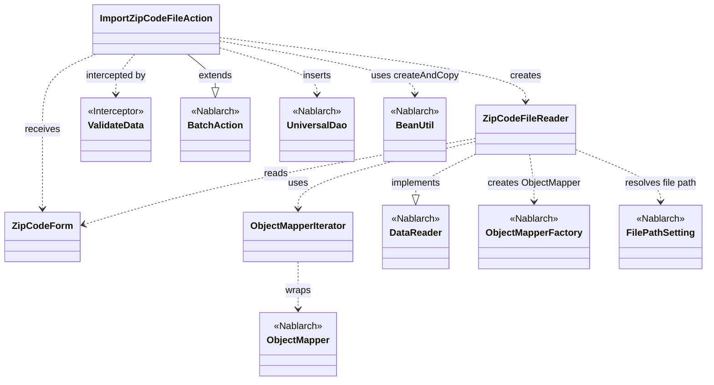
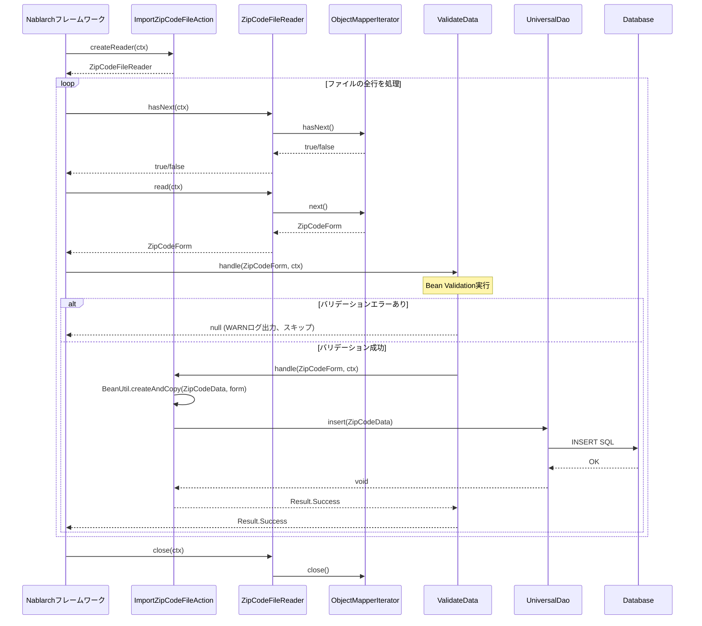

# Code Analysis: ImportZipCodeFileAction

**Generated**: 2026-03-31 10:54:37
**Target**: 住所ファイルをDBに登録するバッチアクション
**Modules**: nablarch-example-batch
**Analysis Duration**: approx. 3m 13s

---

## Overview

`ImportZipCodeFileAction` は、CSVフォーマットの住所ファイルを読み込み、1レコードずつDBに登録するNablarchバッチアクションクラスです。`BatchAction<ZipCodeForm>` を継承し、データリーダ（`ZipCodeFileReader`）が提供する1行分のフォームデータを受け取ってエンティティ（`ZipCodeData`）に変換後、`UniversalDao.insert` でDBに登録します。バリデーションは `@ValidateData` インターセプタで共通化されており、`handle` メソッドには常にバリデーション済みデータが渡されます。

---

## Architecture

### Dependency Graph



**Note**: This diagram uses Mermaid `classDiagram` syntax to show class names and their relationships. Use `--|>` for inheritance (extends/implements) and `..>` for dependencies (uses/creates).

### Component Summary

| Component | Role | Type | Dependencies |
|-----------|------|------|--------------|
| ImportZipCodeFileAction | 住所ファイルをDBに登録するバッチアクション | Action | ZipCodeFileReader, ZipCodeForm, BeanUtil, UniversalDao, ValidateData |
| ZipCodeFileReader | CSVファイルを1行ずつ読み込むデータリーダ | DataReader | ObjectMapperFactory, ObjectMapperIterator, FilePathSetting |
| ZipCodeForm | CSV1行分のデータをバインドし、バリデーションするフォーム | Form | なし |
| ValidateData | handle実行前にBean Validationを行うインターセプタ | Interceptor | ValidatorUtil, BeanUtil |
| ObjectMapperIterator | ObjectMapperをIteratorとしてラップするユーティリティ | Iterator | ObjectMapper |

---

## Flow

### Processing Flow

1. バッチプロセス起動時、Nablarchハンドラキューが `createReader()` を呼び出し、`ZipCodeFileReader` インスタンスを取得します。
2. `ZipCodeFileReader.read()` が呼ばれるたびに、`ObjectMapperFactory` で生成した `ObjectMapper` から1行分のCSVデータを `ZipCodeForm` として読み込み、業務アクションに渡します。
3. `@ValidateData` インターセプタが `handle()` の前に実行され、`ZipCodeForm` に対してBean Validationを行います。バリデーションエラーがある場合はWARNログを出力し、そのレコードのhandle処理をスキップします。
4. バリデーション通過後、`handle()` が実行されます。`BeanUtil.createAndCopy()` で `ZipCodeForm` から `ZipCodeData` エンティティを生成し、`UniversalDao.insert()` でDBに登録します。
5. `Result.Success` を返し、次のレコード処理に進みます。
6. `ZipCodeFileReader.hasNext()` が `false` を返すとファイル読み込み終了。`close()` でストリームをクローズします。

### Sequence Diagram



---

## Components

### ImportZipCodeFileAction

**ファイル**: [ImportZipCodeFileAction.java](../../.lw/nab-official/v6/nablarch-example-batch/src/main/java/com/nablarch/example/app/batch/action/ImportZipCodeFileAction.java)

**役割**: `BatchAction<ZipCodeForm>` を継承した業務アクションクラス。CSVから読み込んだ住所データをDBに登録します。

**主要メソッド**:
- `handle(ZipCodeForm, ExecutionContext)` (L35-41): `@ValidateData` インターセプタにより常にバリデーション済みデータを受け取る。`BeanUtil.createAndCopy` でエンティティ変換後、`UniversalDao.insert` でDB登録。`Result.Success` を返す。
- `createReader(ExecutionContext)` (L50-52): `ZipCodeFileReader` のインスタンスを生成して返す。

**依存**:
- `ZipCodeFileReader`: データリーダ（createReaderで生成）
- `ZipCodeForm`: 入力データフォーム
- `ZipCodeData`: DB登録エンティティ
- `BeanUtil`: フォーム→エンティティ変換
- `UniversalDao`: DB登録
- `ValidateData`: バリデーションインターセプタ（アノテーション）

### ZipCodeFileReader

**ファイル**: [ZipCodeFileReader.java](../../.lw/nab-official/v6/nablarch-example-batch/src/main/java/com/nablarch/example/app/batch/reader/ZipCodeFileReader.java)

**役割**: `DataReader<ZipCodeForm>` を実装したファイル読み込みクラス。`ObjectMapper` を用いてCSVを1行ずつ `ZipCodeForm` として読み込む。

**主要メソッド**:
- `read(ExecutionContext)` (L40-45): イテレータが未初期化の場合 `initialize()` を呼んでから `iterator.next()` で1行分データを返す。
- `hasNext(ExecutionContext)` (L54-59): 同様に初期化後 `iterator.hasNext()` で次行の有無を判定。
- `close(ExecutionContext)` (L68-70): `iterator.close()` でストリームをクローズ。
- `initialize()` (L78-88): `FilePathSetting.getInstance()` でファイルパスを解決し、`ObjectMapperFactory.create` で `ObjectMapper` を生成して `ObjectMapperIterator` でラップ。

**依存**:
- `ObjectMapperFactory`: ObjectMapper生成
- `ObjectMapperIterator`: イテレータラッパー
- `FilePathSetting`: ファイルパス解決（`csv-input` ベースパスから `importZipCode` を取得）

### ZipCodeForm

**ファイル**: [ZipCodeForm.java](../../.lw/nab-official/v6/nablarch-example-batch/src/main/java/com/nablarch/example/app/batch/form/ZipCodeForm.java)

**役割**: CSVの1行分データをバインドし、Bean Validationを適用するフォームクラス。全15フィールドはString型で定義。

**主要アノテーション**:
- `@Csv(type = CsvType.CUSTOM, properties = {...})`: カスタムCSVフォーマットのバインド設定
- `@CsvFormat(charset = "UTF-8", ...)`: 文字コード・区切り文字等の個別フォーマット指定
- `@Domain`, `@Required`: 各フィールドへのバリデーション定義
- `@LineNumber` on `getLineNumber()` (L143): データリーダが行番号を自動設定する

**依存**: なし（Pure Form Bean）

### ValidateData (インターセプタ)

**ファイル**: [ValidateData.java](../../.lw/nab-official/v6/nablarch-example-batch/src/main/java/com/nablarch/example/app/batch/interceptor/ValidateData.java)

**役割**: `handle()` メソッドをインターセプトし、入力データのBean Validationを実行する。バリデーションエラー時はWARNログを出力しhandleをスキップする。

**主要メソッド**:
- `ValidateDataImpl.handle(Object, ExecutionContext)` (L60-92): `ValidatorUtil.getValidator()` でバリデーターを取得し `validate()` 実行。エラーがあれば `lineNumber` プロパティからエラー行番号を取得してWARNログ。エラーなしの場合は `getOriginalHandler().handle()` で元のhandleを呼び出す。

**依存**:
- `ValidatorUtil`: Bean Validationのバリデーター取得
- `BeanUtil`: lineNumberプロパティ取得

### ObjectMapperIterator

**ファイル**: [ObjectMapperIterator.java](../../.lw/nab-official/v6/nablarch-example-batch/src/main/java/com/nablarch/example/app/batch/reader/iterator/ObjectMapperIterator.java)

**役割**: `ObjectMapper` を `Iterator` インタフェースでラップするユーティリティクラス。`DataReader` の実装をシンプルにする目的で利用。

**主要メソッド**:
- `ObjectMapperIterator(ObjectMapper<E>)` (L32-37): コンストラクタで最初のデータをプリロード（`mapper.read()`）。
- `hasNext()` (L45-47): 読み込み済みデータが `null` でなければ `true`。
- `next()` (L56-61): 現在データを返しつつ次データをプリロード。
- `close()` (L66-68): `mapper.close()` でマッパーをクローズ。

**依存**:
- `ObjectMapper`: ラップ対象のNablarchデータバインドマッパー

---

## Nablarch Framework Usage

### BatchAction

**クラス**: `nablarch.fw.action.BatchAction<D>`

**説明**: Nablarchバッチ処理の汎用アクションテンプレートクラス。データリーダからデータを受け取り、1件ずつ業務ロジックを実行するバッチアクションの基底クラス。

**使用方法**:
```java
public class ImportZipCodeFileAction extends BatchAction<ZipCodeForm> {
    @Override
    public Result handle(ZipCodeForm inputData, ExecutionContext ctx) {
        // 業務ロジック
        return new Result.Success();
    }

    @Override
    public DataReader<ZipCodeForm> createReader(ExecutionContext ctx) {
        return new ZipCodeFileReader();
    }
}
```

**重要ポイント**:
- ✅ **handle戻り値**: `Result.Success` を返すと正常終了。例外を投げると異常終了扱いになる。
- ⚠️ **FileBatchActionとの違い**: `FileBatchAction` は data_format を使用するため、data_bind（ObjectMapper）を使う場合は `BatchAction` を使うこと。
- 💡 **インターセプタ活用**: バリデーション等の共通処理は `@Interceptor` で `handle` をインターセプトすることで、複数バッチ間で共通化できる。

**このコードでの使い方**:
- `handle()` で1行分の `ZipCodeForm` を受け取りDB登録処理を実行（L35-41）
- `createReader()` で `ZipCodeFileReader` を返し、ファイル読み込みの主体を設定（L50-52）

**詳細**: [Nablarch Batch Architecture](../../.claude/skills/nabledge-6/docs/processing-pattern/nablarch-batch/nablarch-batch-architecture.md)

---

### UniversalDao

**クラス**: `nablarch.common.dao.UniversalDao`

**説明**: Jakarta PersistenceアノテーションベースのシンプルなO/Rマッパー。SQLを書かずに基本的なCRUD操作が可能。

**使用方法**:
```java
// エンティティのINSERT
ZipCodeData data = BeanUtil.createAndCopy(ZipCodeData.class, inputData);
UniversalDao.insert(data);
```

**重要ポイント**:
- ✅ **エンティティへのアノテーション**: `@Table`, `@Column`, `@Id` 等のJakarta PersistenceアノテーションをエンティティBeanに定義することが前提。
- ⚠️ **共通項目の自動設定なし**: 登録ユーザ・更新日時等の共通項目は自動設定されない。必要な場合はアプリケーションで明示的に設定すること。
- 💡 **SQL自動構築**: `insert()` は実行時にSQLを自動構築するため、SQL定義ファイルが不要。

**このコードでの使い方**:
- `handle()` 内で `UniversalDao.insert(data)` を呼び出し、`ZipCodeData` エンティティをDBに登録（L38）

**詳細**: [Libraries Universal Dao](../../.claude/skills/nabledge-6/docs/component/libraries/libraries-universal_dao.md)

---

### ObjectMapper / ObjectMapperFactory（データバインド）

**クラス**: `nablarch.common.databind.ObjectMapper`, `nablarch.common.databind.ObjectMapperFactory`

**説明**: CSVやTSV、固定長データをJava BeansまたはMapオブジェクトとして扱う機能。フォーマット定義はアノテーション（`@Csv`, `@CsvFormat`）またはプログラムで指定する。

**使用方法**:
```java
// Java BeanクラスへのCSVバインド（読み込み）
ObjectMapper<ZipCodeForm> mapper = ObjectMapperFactory.create(
    ZipCodeForm.class, new FileInputStream(zipCodeFile));
ZipCodeForm form = mapper.read(); // nullが返るまで繰り返し
mapper.close();
```

**重要ポイント**:
- ✅ **必ずclose()を呼ぶ**: ストリームのクローズを確実に行うこと。このコードでは `ObjectMapperIterator.close()` → `ObjectMapper.close()` の順で呼ばれる。
- ⚠️ **スレッドアンセーフ**: `ObjectMapper` インスタンスはスレッド間で共有不可。
- ⚠️ **外部データのプロパティ型**: 外部ファイルから受け付けたデータをバインドする場合、プロパティは全てString型で定義すること（型変換失敗で例外が発生するため）。
- 💡 **ObjectMapperIterator活用**: `hasNext()` を持たない `ObjectMapper` を `Iterator` でラップすることで、DataReaderの実装をシンプルにできる。
- 🎯 **CsvType.CUSTOM**: 定義済みフォーマットセット（DEFAULT, RFC4180等）に合わない場合は `CsvType.CUSTOM` + `@CsvFormat` で個別指定する（このコードの場合）。

**このコードでの使い方**:
- `ZipCodeFileReader.initialize()` で `ObjectMapperFactory.create(ZipCodeForm.class, inputStream)` を呼び、`ObjectMapperIterator` でラップ（L84-85）
- `ZipCodeForm` の `@Csv`, `@CsvFormat` アノテーションでCSVフォーマット（UTF-8、カンマ区切り、クォートモード NORMAL等）を定義

**詳細**: [Libraries Data_bind](../../.claude/skills/nabledge-6/docs/component/libraries/libraries-data_bind.md)

---

### BeanUtil（createAndCopy）

**クラス**: `nablarch.core.beans.BeanUtil`

**説明**: JavaBeansのプロパティ操作ユーティリティ。`createAndCopy` は指定クラスのインスタンスを生成し、同名プロパティを元Beanからコピーする。

**使用方法**:
```java
ZipCodeData data = BeanUtil.createAndCopy(ZipCodeData.class, inputData);
```

**重要ポイント**:
- 💡 **フォーム→エンティティ変換**: フォームとエンティティで同名プロパティが多い場合、`createAndCopy` で変換コードを簡潔に書ける。
- ⚠️ **型の一致**: コピー元と先で型が異なるプロパティは自動変換される場合とされない場合があるため注意。

**このコードでの使い方**:
- `handle()` で `BeanUtil.createAndCopy(ZipCodeData.class, inputData)` を呼び、`ZipCodeForm` のプロパティを `ZipCodeData` にコピー（L37）

**詳細**: [Nablarch Batch Getting Started](../../.claude/skills/nabledge-6/docs/processing-pattern/nablarch-batch/nablarch-batch-getting-started-nablarch-batch.md)

---

## References

### Source Files

- [ImportZipCodeFileAction.java (.lw/nab-official/v5/nablarch-example-batch/src/main/java/com/nablarch/example/app/batch/action)](../../.lw/nab-official/v5/nablarch-example-batch/src/main/java/com/nablarch/example/app/batch/action/ImportZipCodeFileAction.java) - ImportZipCodeFileAction
- [ImportZipCodeFileAction.java (.lw/nab-official/v6/nablarch-example-batch/src/main/java/com/nablarch/example/app/batch/action)](../../.lw/nab-official/v6/nablarch-example-batch/src/main/java/com/nablarch/example/app/batch/action/ImportZipCodeFileAction.java) - ImportZipCodeFileAction
- [ZipCodeFileReader.java (.lw/nab-official/v5/nablarch-example-batch/src/main/java/com/nablarch/example/app/batch/reader)](../../.lw/nab-official/v5/nablarch-example-batch/src/main/java/com/nablarch/example/app/batch/reader/ZipCodeFileReader.java) - ZipCodeFileReader
- [ZipCodeFileReader.java (.lw/nab-official/v6/nablarch-example-batch/src/main/java/com/nablarch/example/app/batch/reader)](../../.lw/nab-official/v6/nablarch-example-batch/src/main/java/com/nablarch/example/app/batch/reader/ZipCodeFileReader.java) - ZipCodeFileReader
- [ZipCodeForm.java (.lw/nab-official/v5/nablarch-example-batch/src/main/java/com/nablarch/example/app/batch/form)](../../.lw/nab-official/v5/nablarch-example-batch/src/main/java/com/nablarch/example/app/batch/form/ZipCodeForm.java) - ZipCodeForm
- [ZipCodeForm.java (.lw/nab-official/v6/nablarch-example-batch/src/main/java/com/nablarch/example/app/batch/form)](../../.lw/nab-official/v6/nablarch-example-batch/src/main/java/com/nablarch/example/app/batch/form/ZipCodeForm.java) - ZipCodeForm
- [ValidateData.java (.lw/nab-official/v5/nablarch-example-batch/src/main/java/com/nablarch/example/app/batch/interceptor)](../../.lw/nab-official/v5/nablarch-example-batch/src/main/java/com/nablarch/example/app/batch/interceptor/ValidateData.java) - ValidateData
- [ValidateData.java (.lw/nab-official/v6/nablarch-example-batch/src/main/java/com/nablarch/example/app/batch/interceptor)](../../.lw/nab-official/v6/nablarch-example-batch/src/main/java/com/nablarch/example/app/batch/interceptor/ValidateData.java) - ValidateData
- [ObjectMapperIterator.java (.lw/nab-official/v5/nablarch-example-batch/src/main/java/com/nablarch/example/app/batch/reader/iterator)](../../.lw/nab-official/v5/nablarch-example-batch/src/main/java/com/nablarch/example/app/batch/reader/iterator/ObjectMapperIterator.java) - ObjectMapperIterator
- [ObjectMapperIterator.java (.lw/nab-official/v6/nablarch-example-batch/src/main/java/com/nablarch/example/app/batch/reader/iterator)](../../.lw/nab-official/v6/nablarch-example-batch/src/main/java/com/nablarch/example/app/batch/reader/iterator/ObjectMapperIterator.java) - ObjectMapperIterator

### Knowledge Base (Nabledge-6)

- [Nablarch Batch Getting Started Nablarch Batch](../../.claude/skills/nabledge-6/docs/processing-pattern/nablarch-batch/nablarch-batch-getting-started-nablarch-batch.md)
- [Libraries Data_bind](../../.claude/skills/nabledge-6/docs/component/libraries/libraries-data_bind.md)
- [Nablarch Batch Architecture](../../.claude/skills/nabledge-6/docs/processing-pattern/nablarch-batch/nablarch-batch-architecture.md)
- [Libraries Universal_dao](../../.claude/skills/nabledge-6/docs/component/libraries/libraries-universal_dao.md)

### Official Documentation


- [Architecture](https://nablarch.github.io/docs/LATEST/doc/application_framework/application_framework/batch/nablarch_batch/architecture.html)
- [AsyncMessageSendAction](https://nablarch.github.io/docs/LATEST/javadoc/nablarch/fw/messaging/action/AsyncMessageSendAction.html)
- [BasicDaoContextFactory](https://nablarch.github.io/docs/LATEST/javadoc/nablarch/common/dao/BasicDaoContextFactory.html)
- [BatchAction](https://nablarch.github.io/docs/LATEST/javadoc/nablarch/fw/action/BatchAction.html)
- [BeanUtil](https://nablarch.github.io/docs/LATEST/javadoc/nablarch/core/beans/BeanUtil.html)
- [ConnectionFactory](https://nablarch.github.io/docs/LATEST/javadoc/nablarch/core/db/connection/ConnectionFactory.html)
- [CsvDataBindConfig](https://nablarch.github.io/docs/LATEST/javadoc/nablarch/common/databind/csv/CsvDataBindConfig.html)
- [CsvFormat](https://nablarch.github.io/docs/LATEST/javadoc/nablarch/common/databind/csv/CsvFormat.html)
- [Csv](https://nablarch.github.io/docs/LATEST/javadoc/nablarch/common/databind/csv/Csv.html)
- [Data Bind](https://nablarch.github.io/docs/LATEST/doc/application_framework/application_framework/libraries/data_io/data_bind.html)
- [DataBindConfig](https://nablarch.github.io/docs/LATEST/javadoc/nablarch/common/databind/DataBindConfig.html)
- [DataReader](https://nablarch.github.io/docs/LATEST/javadoc/nablarch/fw/DataReader.html)
- [DatabaseMetaDataExtractor](https://nablarch.github.io/docs/LATEST/javadoc/nablarch/common/dao/DatabaseMetaDataExtractor.html)
- [DatabaseMetaData](https://nablarch.github.io/docs/LATEST/javadoc/java/sql/DatabaseMetaData.html)
- [DatabaseRecordReader](https://nablarch.github.io/docs/LATEST/javadoc/nablarch/fw/reader/DatabaseRecordReader.html)
- [DeferredEntityList](https://nablarch.github.io/docs/LATEST/javadoc/nablarch/common/dao/DeferredEntityList.html)
- [Dialect](https://nablarch.github.io/docs/LATEST/javadoc/nablarch/core/db/dialect/Dialect.html)
- [DispatchHandler](https://nablarch.github.io/docs/LATEST/javadoc/nablarch/fw/handler/DispatchHandler.html)
- [EntityList](https://nablarch.github.io/docs/LATEST/javadoc/nablarch/common/dao/EntityList.html)
- [Field](https://nablarch.github.io/docs/LATEST/javadoc/nablarch/common/databind/fixedlength/Field.html)
- [FileBatchAction](https://nablarch.github.io/docs/LATEST/javadoc/nablarch/fw/action/FileBatchAction.html)
- [FileDataReader](https://nablarch.github.io/docs/LATEST/javadoc/nablarch/fw/reader/FileDataReader.html)
- [FileResponse](https://nablarch.github.io/docs/LATEST/javadoc/nablarch/common/web/download/FileResponse.html)
- [FixedLengthDataBindConfigBuilder](https://nablarch.github.io/docs/LATEST/javadoc/nablarch/common/databind/fixedlength/FixedLengthDataBindConfigBuilder.html)
- [FixedLengthDataBindConfig](https://nablarch.github.io/docs/LATEST/javadoc/nablarch/common/databind/fixedlength/FixedLengthDataBindConfig.html)
- [FixedLength](https://nablarch.github.io/docs/LATEST/javadoc/nablarch/common/databind/fixedlength/FixedLength.html)
- [H2Dialect](https://nablarch.github.io/docs/LATEST/javadoc/nablarch/core/db/dialect/H2Dialect.html)
- [Index](https://nablarch.github.io/docs/LATEST/doc/application_framework/application_framework/batch/nablarch_batch/getting_started/nablarch_batch/index.html)
- [LineNumber](https://nablarch.github.io/docs/LATEST/javadoc/nablarch/common/databind/LineNumber.html)
- [MultiLayoutConfig.RecordIdentifier](https://nablarch.github.io/docs/LATEST/javadoc/nablarch/common/databind/fixedlength/MultiLayoutConfig.RecordIdentifier.html)
- [MultiLayout](https://nablarch.github.io/docs/LATEST/javadoc/nablarch/common/databind/fixedlength/MultiLayout.html)
- [NoInputDataBatchAction](https://nablarch.github.io/docs/LATEST/javadoc/nablarch/fw/action/NoInputDataBatchAction.html)
- [ObjectMapperFactory](https://nablarch.github.io/docs/LATEST/javadoc/nablarch/common/databind/ObjectMapperFactory.html)
- [ObjectMapper](https://nablarch.github.io/docs/LATEST/javadoc/nablarch/common/databind/ObjectMapper.html)
- [OnError](https://nablarch.github.io/docs/LATEST/javadoc/nablarch/fw/web/interceptor/OnError.html)
- [Pagination](https://nablarch.github.io/docs/LATEST/javadoc/nablarch/common/dao/Pagination.html)
- [PartInfo](https://nablarch.github.io/docs/LATEST/javadoc/nablarch/fw/web/upload/PartInfo.html)
- [ProcessStopHandler.ProcessStop](https://nablarch.github.io/docs/LATEST/javadoc/nablarch/fw/handler/ProcessStopHandler.ProcessStop.html)
- [Result](https://nablarch.github.io/docs/LATEST/javadoc/nablarch/fw/Result.html)
- [ResumeDataReader](https://nablarch.github.io/docs/LATEST/javadoc/nablarch/fw/reader/ResumeDataReader.html)
- [SimpleDbTransactionManager](https://nablarch.github.io/docs/LATEST/javadoc/nablarch/core/db/transaction/SimpleDbTransactionManager.html)
- [StatusCodeConvertHandler](https://nablarch.github.io/docs/LATEST/javadoc/nablarch/fw/handler/StatusCodeConvertHandler.html)
- [TransactionFactory](https://nablarch.github.io/docs/LATEST/javadoc/nablarch/core/transaction/TransactionFactory.html)
- [Universal Dao](https://nablarch.github.io/docs/LATEST/doc/application_framework/application_framework/libraries/database/universal_dao.html)
- [UniversalDao.Transaction](https://nablarch.github.io/docs/LATEST/javadoc/nablarch/common/dao/UniversalDao.Transaction.html)
- [UniversalDao](https://nablarch.github.io/docs/LATEST/javadoc/nablarch/common/dao/UniversalDao.html)
- [ValidatableFileDataReader](https://nablarch.github.io/docs/LATEST/javadoc/nablarch/fw/reader/ValidatableFileDataReader.html)

---

**Note**: This documentation was generated by the code-analysis workflow of the nabledge-6 skill.
