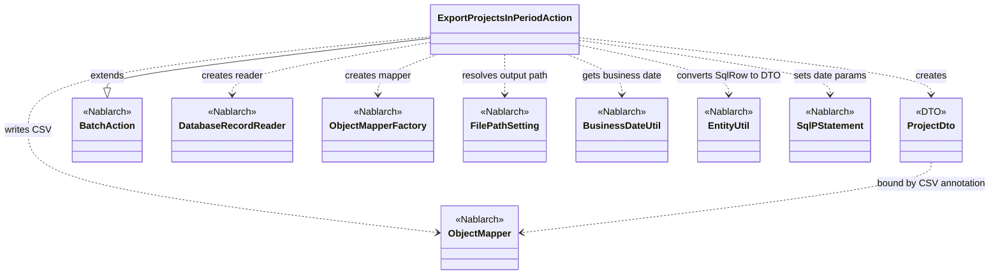
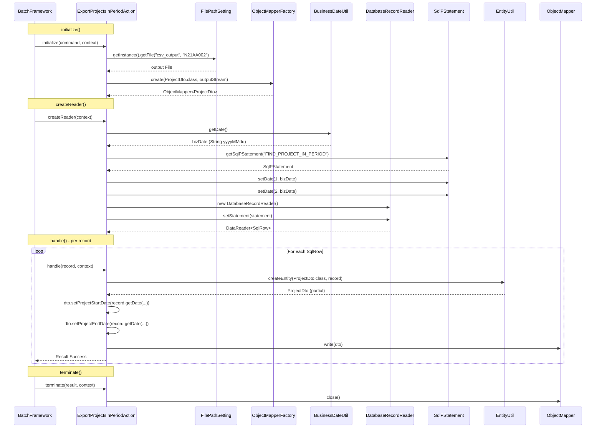

# Code Analysis: ExportProjectsInPeriodAction

**Generated**: 2026-03-31 11:06:19
**Target**: 期間内プロジェクト一覧CSV出力バッチアクション
**Modules**: proman-batch
**Analysis Duration**: approx. 2m 50s

---

## Overview

`ExportProjectsInPeriodAction` は、業務日付を基準に期間内のプロジェクト情報をデータベースから読み込み、CSVファイルに出力する都度起動バッチアクションクラス。

Nablarchの `BatchAction<SqlRow>` を継承し、DB to FILEパターンで実装されている。`DatabaseRecordReader` でSQLクエリ結果をレコード単位に読み込み、`ObjectMapper` でCSVに書き出す。出力先ファイルパスは `FilePathSetting` で管理され、業務日付は `BusinessDateUtil` から取得する。

---

## Architecture

### Dependency Graph



**Note**: This diagram uses Mermaid `classDiagram` syntax to show class names and their relationships. Use `--|>` for inheritance (extends/implements) and `..>` for dependencies (uses/creates).

### Component Summary

| Component | Role | Type | Dependencies |
|-----------|------|------|--------------|
| ExportProjectsInPeriodAction | 期間内プロジェクト一覧CSV出力バッチアクション | Action | DatabaseRecordReader, ObjectMapper, FilePathSetting, BusinessDateUtil, EntityUtil |
| ProjectDto | CSVバインド用プロジェクト情報DTO | Bean | なし |

---

## Flow

### Processing Flow

バッチフレームワークが `initialize()` → `createReader()` → `handle()` (繰り返し) → `terminate()` の順でライフサイクルメソッドを呼び出す。

1. **initialize()**: `FilePathSetting` で出力先CSVファイルパスを解決し、`ObjectMapperFactory` で `ProjectDto` 用の `ObjectMapper` を生成する
2. **createReader()**: `BusinessDateUtil` で業務日付を取得し、`FIND_PROJECT_IN_PERIOD` SQLの検索条件（開始日・終了日）に業務日付を設定した `DatabaseRecordReader` を生成して返す
3. **handle()**: `DatabaseRecordReader` から渡される `SqlRow` を `EntityUtil.createEntity()` で `ProjectDto` に変換し、日付型が一致しない `projectStartDate` / `projectEndDate` は明示的なsetterで設定する。`mapper.write(dto)` でCSVに1レコード出力し `Result.Success` を返す
4. **terminate()**: `mapper.close()` を呼び出してバッファをフラッシュしリソースを解放する

### Sequence Diagram



---

## Components

### ExportProjectsInPeriodAction

**ファイル**: [ExportProjectsInPeriodAction.java](../../.lw/nab-official/v6/nablarch-system-development-guide/Sample_Project/Source_Code/proman-project/proman-batch/src/main/java/com/nablarch/example/proman/batch/project/ExportProjectsInPeriodAction.java)

**役割**: 業務日付を条件にDBからプロジェクト情報を取得し、CSVファイルへ出力する都度起動バッチ

**型**: `BatchAction<SqlRow>` を継承

**主要メソッド**:

- `initialize(CommandLine, ExecutionContext)` (L44-53): 出力CSVファイルのストリームを開き、`ObjectMapper` を初期化する。`FilePathSetting` から `csv_output` ベースパスで `N21AA002` ファイルを解決する
- `createReader(ExecutionContext)` (L57-65): 業務日付を取得し `FIND_PROJECT_IN_PERIOD` SQLへ日付パラメータをセットした `DatabaseRecordReader` を返す
- `handle(SqlRow, ExecutionContext)` (L68-75): `EntityUtil` で `SqlRow` → `ProjectDto` に変換後、日付フィールドを個別setterで設定し `mapper.write(dto)` でCSV出力する
- `terminate(Result, ExecutionContext)` (L78-80): `mapper.close()` でリソースを解放する

**依存コンポーネント**: `DatabaseRecordReader`, `ObjectMapper`, `FilePathSetting`, `BusinessDateUtil`, `EntityUtil`, `SqlPStatement`

### ProjectDto

**ファイル**: [ProjectDto.java](../../.lw/nab-official/v6/nablarch-system-development-guide/Sample_Project/Source_Code/proman-project/proman-batch/src/main/java/com/nablarch/example/proman/batch/project/ProjectDto.java)

**役割**: CSV出力用データバインドクラス。`@Csv(type=CUSTOM)` と `@CsvFormat` でカスタムCSVフォーマットを定義

**型**: CSV出力専用Bean（継承なし）

**主要ポイント**:

- `@Csv` の `properties` でCSV列順、`headers` で日本語ヘッダを定義 (L15-19)
- `@CsvFormat` でカスタム設定: 区切り=`,`、改行=`\r\n`、クォート=`"`、`QuoteMode.ALL`（全フィールドをクォート）、charset=UTF-8 (L20-21)
- `projectStartDate` / `projectEndDate` のsetterは `java.util.Date` 型を受け取り `DateUtil.formatDate` で `yyyy/MM/dd` 形式の文字列に変換する (L138-139, L154-155)
- `EntityUtil.createEntity()` では日付型変換ができないため、これらフィールドはActionから明示的にsetterを呼び出している

**依存コンポーネント**: なし（Nablarchアノテーションのみ）

---

## Nablarch Framework Usage

### ObjectMapper / ObjectMapperFactory

**クラス**: `nablarch.common.databind.ObjectMapper` / `nablarch.common.databind.ObjectMapperFactory`

**説明**: CSVやTSV、固定長データをJava BeansオブジェクトとしてI/Oする機能。アノテーションまたは `DataBindConfig` でフォーマットを指定する

**使用方法**:
```java
// 書き込み (Java Beansバインド)
FileOutputStream outputStream = new FileOutputStream(output);
ObjectMapper<ProjectDto> mapper = ObjectMapperFactory.create(ProjectDto.class, outputStream);
mapper.write(dto);  // 1レコード書き込み
mapper.close();     // 必須: バッファフラッシュ＆リソース解放
```

**重要ポイント**:
- ✅ **必ず `close()` を呼ぶ**: バッファをフラッシュしリソースを解放する。この実装では `terminate()` で呼んでいる
- ⚠️ **スレッドアンセーフ**: 複数スレッドで `ObjectMapper` インスタンスを共有してはならない。バッチでは1インスタンスをシングルスレッドで使用するため問題なし
- 💡 **アノテーション駆動**: `@Csv(type=CUSTOM)` と `@CsvFormat` でフォーマットを宣言的に定義できる
- ⚠️ **型変換の制限**: Java Beansバインドの場合、型変換が必要なフィールドは手動setterが必要（`EntityUtil` と同様の制約）

**このコードでの使い方**:
- `initialize()` (L50) で `ObjectMapperFactory.create(ProjectDto.class, outputStream)` によりマッパーを生成
- `handle()` (L73) で `mapper.write(dto)` によりレコードごとにCSVへ書き込み
- `terminate()` (L79) で `mapper.close()` によりリソースを解放

**詳細**: [Libraries Data_bind](../../.claude/skills/nabledge-6/docs/component/libraries/libraries-data_bind.md)

---

### BatchAction / DatabaseRecordReader

**クラス**: `nablarch.fw.action.BatchAction` / `nablarch.fw.reader.DatabaseRecordReader`

**説明**: Nablarchバッチフレームワークの基底アクションクラスと、DBレコードをデータソースとするデータリーダ

**使用方法**:
```java
public class SampleAction extends BatchAction<SqlRow> {

    @Override
    public DataReader<SqlRow> createReader(ExecutionContext ctx) {
        DatabaseRecordReader reader = new DatabaseRecordReader();
        SqlPStatement statement = getSqlPStatement("FIND_RECORDS");
        reader.setStatement(statement);
        return reader;
    }

    @Override
    public Result handle(SqlRow record, ExecutionContext ctx) {
        // 1レコードの処理
        return new Success();
    }
}
```

**重要ポイント**:
- 🎯 **ライフサイクルメソッド**: `initialize()` → `createReader()` → `handle()` (繰り返し) → `terminate()` の順で呼び出される
- ✅ **getSqlPStatement()**: `BatchAction` の継承メソッドでSQLIDからステートメントを取得できる
- 💡 **DatabaseRecordReader**: DBの検索結果を1レコードずつ `handle()` に渡すデータリーダ。大量データでもメモリに全件保持しない
- ⚠️ **data_bindとFileDataReaderは併用不可**: `data_bind` を使う場合は `FileDataReader` / `ValidatableFileDataReader` を使用しないこと

**このコードでの使い方**:
- `ExportProjectsInPeriodAction` は `BatchAction<SqlRow>` を継承 (L31)
- `createReader()` (L57-65) でSQLに業務日付をバインドした `DatabaseRecordReader` を返す
- コマンドライン引数 `-requestPath` でアクションクラスとリクエストIDを指定して起動する

**詳細**: [Nablarch Batch Architecture](../../.claude/skills/nabledge-6/docs/processing-pattern/nablarch-batch/nablarch-batch-architecture.md)

---

### BusinessDateUtil

**クラス**: `nablarch.core.date.BusinessDateUtil`

**説明**: コンポーネント設定で管理される業務日付を取得するユーティリティ。業務日付はDBのテーブルで管理され、アプリ起動時に初期化される

**使用方法**:
```java
// 業務日付を文字列 (yyyyMMdd形式) で取得
String bizDateStr = BusinessDateUtil.getDate();

// java.util.Date型に変換して使用する場合
Date bizDate = new Date(DateUtil.getDate(BusinessDateUtil.getDate()).getTime());
```

**重要ポイント**:
- 🎯 **業務日付はDBで管理**: `BasicBusinessDateProvider` がDBから業務日付を読み込む。区分ごとに複数の業務日付を管理できる
- 💡 **コンポーネント設定で切り替え可能**: テスト時に任意の日付に差し替えられる
- ⚠️ **`getDate()` の戻り値は文字列**: `yyyyMMdd` 形式の文字列を返す。`java.sql.Date` へ変換する場合は `DateUtil.getDate()` 経由が必要

**このコードでの使い方**:
- `createReader()` (L60) で `BusinessDateUtil.getDate()` を取得し、`DateUtil.getDate()` → `java.sql.Date` に変換してSQLパラメータにセット

**詳細**: [Libraries Data_bind](../../.claude/skills/nabledge-6/docs/component/libraries/libraries-data_bind.md)

---

### FilePathSetting

**クラス**: `nablarch.core.util.FilePathSetting`

**説明**: ファイルのベースパスと拡張子をコンポーネント設定で管理する機能。論理名とファイル名から実際のファイルパスを解決する

**使用方法**:
```java
// コンポーネント設定で定義した論理名 "csv_output" から "N21AA002" ファイルを解決
FilePathSetting filePathSetting = FilePathSetting.getInstance();
File output = filePathSetting.getFile("csv_output", "N21AA002");
```

**重要ポイント**:
- ✅ **コンポーネント名は `filePathSetting` とすること**: `getInstance()` はこのコンポーネント名で検索する
- 💡 **環境依存パスを設定ファイルで管理**: ファイルパスをコードから切り離し、環境ごとにコンポーネント設定で変更できる
- ⚠️ **classpathスキームはJBoss/Wildflyで使用不可**: fileスキームの使用を推奨

**このコードでの使い方**:
- `initialize()` (L45-47) で `FilePathSetting.getInstance().getFile("csv_output", "N21AA002")` により出力先 `N21AA002.csv` を解決

**詳細**: [Nablarch Batch Architecture](../../.claude/skills/nabledge-6/docs/processing-pattern/nablarch-batch/nablarch-batch-architecture.md)

---

### EntityUtil

**クラス**: `nablarch.common.dao.EntityUtil`

**説明**: `SqlRow`（DBレコード）をエンティティクラスやDTOに変換するユーティリティ

**使用方法**:
```java
ProjectDto dto = EntityUtil.createEntity(ProjectDto.class, record);
```

**重要ポイント**:
- ⚠️ **型変換の制限**: `SqlRow` のカラム型とBeanのプロパティ型が異なる場合は変換できない。`projectStartDate` / `projectEndDate` のような `java.sql.Date` → `String` 変換は手動setterが必要
- 💡 **カラム名の自動マッピング**: スネークケースのカラム名をキャメルケースのプロパティ名に自動変換して設定する

**このコードでの使い方**:
- `handle()` (L69) で `EntityUtil.createEntity(ProjectDto.class, record)` により `SqlRow` → `ProjectDto` に変換
- 日付フィールド (`projectStartDate`, `projectEndDate`) は型不一致のため L71-72 で明示的にsetterを呼び出している

**詳細**: [Nablarch Batch Getting Started](../../.claude/skills/nabledge-6/docs/processing-pattern/nablarch-batch/nablarch-batch-getting-started-nablarch-batch.md)

---

## References

### Source Files

- [ExportProjectsInPeriodAction.java (.lw/nab-official/v5/nablarch-system-development-guide/en/Sample_Project/Source_Code/proman-project/proman-batch/src/main/java/com/nablarch/example/proman/batch/project)](../../.lw/nab-official/v5/nablarch-system-development-guide/en/Sample_Project/Source_Code/proman-project/proman-batch/src/main/java/com/nablarch/example/proman/batch/project/ExportProjectsInPeriodAction.java) - ExportProjectsInPeriodAction
- [ExportProjectsInPeriodAction.java (.lw/nab-official/v5/nablarch-system-development-guide/Sample_Project/Source_Code/proman-project/proman-batch/src/main/java/com/nablarch/example/proman/batch/project)](../../.lw/nab-official/v5/nablarch-system-development-guide/Sample_Project/Source_Code/proman-project/proman-batch/src/main/java/com/nablarch/example/proman/batch/project/ExportProjectsInPeriodAction.java) - ExportProjectsInPeriodAction
- [ExportProjectsInPeriodAction.java (.lw/nab-official/v6/nablarch-system-development-guide/en/Sample_Project/Source_Code/proman-project/proman-batch/src/main/java/com/nablarch/example/proman/batch/project)](../../.lw/nab-official/v6/nablarch-system-development-guide/en/Sample_Project/Source_Code/proman-project/proman-batch/src/main/java/com/nablarch/example/proman/batch/project/ExportProjectsInPeriodAction.java) - ExportProjectsInPeriodAction
- [ExportProjectsInPeriodAction.java (.lw/nab-official/v6/nablarch-system-development-guide/Sample_Project/Source_Code/proman-project/proman-batch/src/main/java/com/nablarch/example/proman/batch/project)](../../.lw/nab-official/v6/nablarch-system-development-guide/Sample_Project/Source_Code/proman-project/proman-batch/src/main/java/com/nablarch/example/proman/batch/project/ExportProjectsInPeriodAction.java) - ExportProjectsInPeriodAction
- [ProjectDto.java (.lw/nab-official/v5/nablarch-system-development-guide/en/Sample_Project/Source_Code/proman-project/proman-batch/src/main/java/com/nablarch/example/proman/batch/project)](../../.lw/nab-official/v5/nablarch-system-development-guide/en/Sample_Project/Source_Code/proman-project/proman-batch/src/main/java/com/nablarch/example/proman/batch/project/ProjectDto.java) - ProjectDto
- [ProjectDto.java (.lw/nab-official/v5/nablarch-system-development-guide/Sample_Project/Source_Code/proman-project/proman-batch/src/main/java/com/nablarch/example/proman/batch/project)](../../.lw/nab-official/v5/nablarch-system-development-guide/Sample_Project/Source_Code/proman-project/proman-batch/src/main/java/com/nablarch/example/proman/batch/project/ProjectDto.java) - ProjectDto
- [ProjectDto.java (.lw/nab-official/v5/nablarch-example-web/src/main/java/com/nablarch/example/app/web/dto)](../../.lw/nab-official/v5/nablarch-example-web/src/main/java/com/nablarch/example/app/web/dto/ProjectDto.java) - ProjectDto
- [ProjectDto.java (.lw/nab-official/v6/nablarch-system-development-guide/en/Sample_Project/Source_Code/proman-project/proman-batch/src/main/java/com/nablarch/example/proman/batch/project)](../../.lw/nab-official/v6/nablarch-system-development-guide/en/Sample_Project/Source_Code/proman-project/proman-batch/src/main/java/com/nablarch/example/proman/batch/project/ProjectDto.java) - ProjectDto
- [ProjectDto.java (.lw/nab-official/v6/nablarch-system-development-guide/Sample_Project/Source_Code/proman-project/proman-batch/src/main/java/com/nablarch/example/proman/batch/project)](../../.lw/nab-official/v6/nablarch-system-development-guide/Sample_Project/Source_Code/proman-project/proman-batch/src/main/java/com/nablarch/example/proman/batch/project/ProjectDto.java) - ProjectDto
- [ProjectDto.java (.lw/nab-official/v6/nablarch-example-web/src/main/java/com/nablarch/example/app/web/dto)](../../.lw/nab-official/v6/nablarch-example-web/src/main/java/com/nablarch/example/app/web/dto/ProjectDto.java) - ProjectDto

### Knowledge Base (Nabledge-6)

- [Libraries Data_bind](../../.claude/skills/nabledge-6/docs/component/libraries/libraries-data_bind.md)
- [Nablarch Batch Getting Started Nablarch Batch](../../.claude/skills/nabledge-6/docs/processing-pattern/nablarch-batch/nablarch-batch-getting-started-nablarch-batch.md)
- [Nablarch Batch Architecture](../../.claude/skills/nabledge-6/docs/processing-pattern/nablarch-batch/nablarch-batch-architecture.md)

### Official Documentation


- [Architecture](https://nablarch.github.io/docs/LATEST/doc/application_framework/application_framework/batch/nablarch_batch/architecture.html)
- [AsyncMessageSendAction](https://nablarch.github.io/docs/LATEST/javadoc/nablarch/fw/messaging/action/AsyncMessageSendAction.html)
- [BatchAction](https://nablarch.github.io/docs/LATEST/javadoc/nablarch/fw/action/BatchAction.html)
- [BeanUtil](https://nablarch.github.io/docs/LATEST/javadoc/nablarch/core/beans/BeanUtil.html)
- [CsvDataBindConfig](https://nablarch.github.io/docs/LATEST/javadoc/nablarch/common/databind/csv/CsvDataBindConfig.html)
- [CsvFormat](https://nablarch.github.io/docs/LATEST/javadoc/nablarch/common/databind/csv/CsvFormat.html)
- [Csv](https://nablarch.github.io/docs/LATEST/javadoc/nablarch/common/databind/csv/Csv.html)
- [Data Bind](https://nablarch.github.io/docs/LATEST/doc/application_framework/application_framework/libraries/data_io/data_bind.html)
- [DataBindConfig](https://nablarch.github.io/docs/LATEST/javadoc/nablarch/common/databind/DataBindConfig.html)
- [DataReader](https://nablarch.github.io/docs/LATEST/javadoc/nablarch/fw/DataReader.html)
- [DatabaseRecordReader](https://nablarch.github.io/docs/LATEST/javadoc/nablarch/fw/reader/DatabaseRecordReader.html)
- [DispatchHandler](https://nablarch.github.io/docs/LATEST/javadoc/nablarch/fw/handler/DispatchHandler.html)
- [Field](https://nablarch.github.io/docs/LATEST/javadoc/nablarch/common/databind/fixedlength/Field.html)
- [FileBatchAction](https://nablarch.github.io/docs/LATEST/javadoc/nablarch/fw/action/FileBatchAction.html)
- [FileDataReader](https://nablarch.github.io/docs/LATEST/javadoc/nablarch/fw/reader/FileDataReader.html)
- [FileResponse](https://nablarch.github.io/docs/LATEST/javadoc/nablarch/fw/download/FileResponse.html)
- [FixedLengthDataBindConfigBuilder](https://nablarch.github.io/docs/LATEST/javadoc/nablarch/common/databind/fixedlength/FixedLengthDataBindConfigBuilder.html)
- [FixedLengthDataBindConfig](https://nablarch.github.io/docs/LATEST/javadoc/nablarch/common/databind/fixedlength/FixedLengthDataBindConfig.html)
- [FixedLength](https://nablarch.github.io/docs/LATEST/javadoc/nablarch/common/databind/fixedlength/FixedLength.html)
- [Index](https://nablarch.github.io/docs/LATEST/doc/application_framework/application_framework/batch/nablarch_batch/getting_started/nablarch_batch/index.html)
- [LineNumber](https://nablarch.github.io/docs/LATEST/javadoc/nablarch/common/databind/LineNumber.html)
- [MultiLayoutConfig.RecordIdentifier](https://nablarch.github.io/docs/LATEST/javadoc/nablarch/common/databind/fixedlength/MultiLayoutConfig.RecordIdentifier.html)
- [MultiLayout](https://nablarch.github.io/docs/LATEST/javadoc/nablarch/common/databind/fixedlength/MultiLayout.html)
- [NoInputDataBatchAction](https://nablarch.github.io/docs/LATEST/javadoc/nablarch/fw/action/NoInputDataBatchAction.html)
- [ObjectMapperFactory](https://nablarch.github.io/docs/LATEST/javadoc/nablarch/common/databind/ObjectMapperFactory.html)
- [ObjectMapper](https://nablarch.github.io/docs/LATEST/javadoc/nablarch/common/databind/ObjectMapper.html)
- [PartInfo](https://nablarch.github.io/docs/LATEST/javadoc/nablarch/fw/web/upload/PartInfo.html)
- [ProcessStopHandler.ProcessStop](https://nablarch.github.io/docs/LATEST/javadoc/nablarch/fw/handler/ProcessStopHandler.ProcessStop.html)
- [Result](https://nablarch.github.io/docs/LATEST/javadoc/nablarch/fw/Result.html)
- [ResumeDataReader](https://nablarch.github.io/docs/LATEST/javadoc/nablarch/fw/reader/ResumeDataReader.html)
- [StatusCodeConvertHandler](https://nablarch.github.io/docs/LATEST/javadoc/nablarch/fw/handler/StatusCodeConvertHandler.html)
- [UniversalDao](https://nablarch.github.io/docs/LATEST/javadoc/nablarch/common/dao/UniversalDao.html)
- [ValidatableFileDataReader](https://nablarch.github.io/docs/LATEST/javadoc/nablarch/fw/reader/ValidatableFileDataReader.html)

---

**Note**: This documentation was generated by the code-analysis workflow of the nabledge-6 skill.
