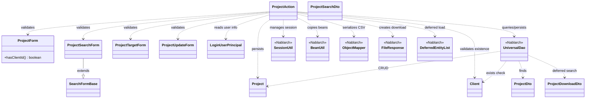
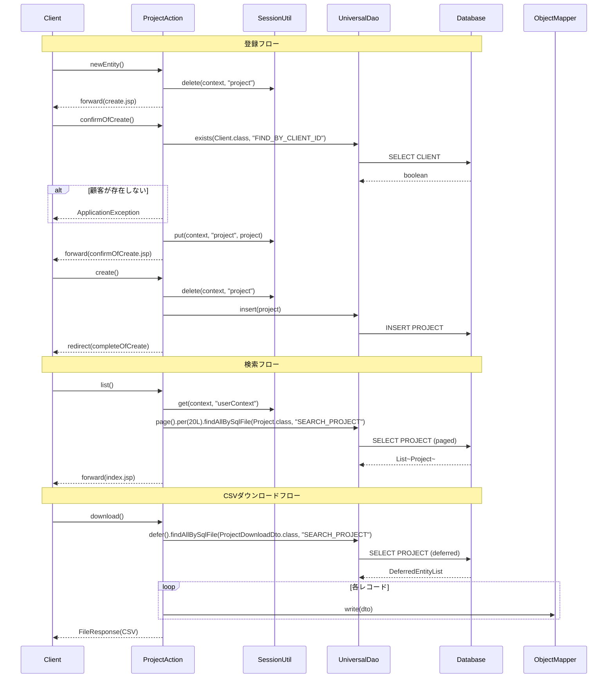

# Code Analysis: ProjectAction

**Generated**: 2026-03-31 15:23:27
**Target**: プロジェクトのCRUD操作（検索・登録・更新・削除・CSVダウンロード）を処理するWebアクション
**Modules**: nablarch-example-web
**Analysis Duration**: approx. 4m 22s

---

## Overview

`ProjectAction` はNablarch 6 Webアプリケーションのプロジェクト管理機能を担うActionクラスです。プロジェクトの検索・登録・更新・削除・CSVダウンロードという5つの主要機能を提供します。

各機能は `@InjectForm` によるバリデーション、`UniversalDao` によるDB操作、`SessionUtil` によるセッション管理、`@OnDoubleSubmission` による二重サブミット防止の組み合わせで実装されています。CSVダウンロードでは `ObjectMapper` と `DeferredEntityList` を使用した遅延ロードによる大量データ出力をサポートします。

---

## Architecture

### Dependency Graph



**Note**: This diagram uses Mermaid `classDiagram` syntax to show class names and their relationships. Use `--|>` for inheritance (extends/implements) and `..>` for dependencies (uses/creates).

### Component Summary

| Component | Role | Type | Dependencies |
|-----------|------|------|--------------|
| ProjectAction | プロジェクトCRUD処理 | Action | ProjectForm, ProjectSearchForm, ProjectTargetForm, ProjectUpdateForm, UniversalDao, SessionUtil, BeanUtil, ObjectMapper |
| ProjectForm | プロジェクト登録入力バリデーション | Form | なし |
| ProjectSearchForm | プロジェクト検索条件バリデーション | Form | SearchFormBase |
| ProjectTargetForm | プロジェクト対象指定（ID取得） | Form | なし |
| ProjectUpdateForm | プロジェクト更新入力バリデーション | Form | なし |
| Project | プロジェクトエンティティ | Entity | なし |
| ProjectDto | プロジェクト詳細表示用DTO | Bean | なし |
| ProjectSearchDto | 検索条件Bean（DB型対応） | Bean | なし |
| ProjectDownloadDto | CSVダウンロード用Bean | Bean | なし |
| LoginUserPrincipal | ログインユーザ情報 | Security | なし |
| Client | 顧客エンティティ | Entity | なし |

---

## Flow

### Processing Flow

**登録フロー（newEntity → confirmOfCreate → create）**:

1. `newEntity()` (L50-55): セッションの既存プロジェクト情報を削除し、登録初期画面へ遷移
2. `confirmOfCreate()` (L64-92): `@InjectForm` でフォームバリデーション実行。顧客IDがあれば `UniversalDao.exists()` で顧客存在確認。`BeanUtil.createAndCopy()` でフォームをEntityに変換してセッション保存。利益計算オブジェクト `ProjectProfit` をリクエストスコープにセット
3. `create()` (L101-108): `@OnDoubleSubmission` で二重サブミット防止。セッションからプロジェクト取得後 `UniversalDao.insert()` でDB登録。303リダイレクト

**検索フロー（index / list）**:

1. `index()` (L153-167): ページ番号1・デフォルトソートで初期検索実行。`searchProject()` ヘルパーを呼び出す
2. `list()` (L176-187): `@InjectForm` でフォームバリデーション。`searchProject()` ヘルパーで条件付き検索
3. `searchProject()` (L198-208): セッションからログインユーザを取得し検索条件に設定。`UniversalDao.page().per(20L).findAllBySqlFile()` でページング検索

**更新フロー（edit → confirmOfUpdate → update）**:

1. `edit()` (L281-298): `@InjectForm` でプロジェクトID取得。`UniversalDao.findBySqlFile()` でプロジェクト詳細を取得。楽観的ロック用にセッションへEntityを保存
2. `confirmOfUpdate()` (L307-335): `@InjectForm` で更新フォームバリデーション。`UniversalDao.exists()` で顧客存在確認。セッションのEntityに変更をマージ
3. `update()` (L371-376): `@OnDoubleSubmission` で二重サブミット防止。`UniversalDao.update()` で楽観的ロック付き更新。303リダイレクト

**削除フロー（delete）**:

1. `delete()` (L397-402): `@OnDoubleSubmission` で二重サブミット防止。セッションからプロジェクト取得後 `UniversalDao.delete()` で削除。303リダイレクト

**CSVダウンロードフロー（download）**:

1. `download()` (L219-243): `@InjectForm` で検索条件バリデーション。`UniversalDao.defer().findAllBySqlFile()` で遅延ロード検索。`ObjectMapperFactory.create()` でCSVマッパー作成。`DeferredEntityList` を逐次処理してCSV出力。`FileResponse` でCSVダウンロードレスポンス返却

### Sequence Diagram



---

## Components

### ProjectAction

**ファイル**: [ProjectAction.java](../../.lw/nab-official/v6/nablarch-example-web/src/main/java/com/nablarch/example/app/web/action/ProjectAction.java)

**役割**: プロジェクト管理機能（検索・登録・更新・削除・CSVダウンロード）を処理するWebアクションクラス

**主要メソッド**:
- `newEntity()` (L50-55): 登録初期画面表示。セッションをクリアして登録画面へ遷移
- `confirmOfCreate()` (L64-92): 登録確認画面表示。`@InjectForm` バリデーション、顧客存在確認、セッション保存
- `create()` (L101-108): DB登録処理。`@OnDoubleSubmission` で二重サブミット防止
- `index()` (L153-167): 検索初期画面表示。デフォルト条件でプロジェクト一覧検索
- `list()` (L176-187): 条件検索結果表示。`@InjectForm` バリデーション後に `searchProject()` を呼び出す
- `searchProject()` (L198-208): 検索ヘルパーメソッド。ユーザIDをセッションから取得して検索条件に追加、ページング検索実行
- `download()` (L219-243): CSV遅延ロードダウンロード処理
- `edit()` (L281-298): 更新初期画面表示。セッションに楽観的ロック用Entity保存
- `confirmOfUpdate()` (L307-335): 更新確認画面表示。`@InjectForm` バリデーション、セッションのEntityへ変更マージ
- `update()` (L371-376): DB更新処理。楽観的ロック付きUPDATE実行
- `delete()` (L397-402): DB削除処理。セッションからプロジェクト取得して削除

**依存関係**: UniversalDao, SessionUtil, BeanUtil, ObjectMapper, FileResponse, DeferredEntityList, TempFileUtil, LoginUserPrincipal, Project, Client, ProjectForm, ProjectSearchForm, ProjectTargetForm, ProjectUpdateForm, ProjectDto, ProjectSearchDto, ProjectDownloadDto

### ProjectForm

**ファイル**: [ProjectForm.java](../../.lw/nab-official/v6/nablarch-example-web/src/main/java/com/nablarch/example/app/web/form/ProjectForm.java)

**役割**: プロジェクト登録画面の入力値を受け取るフォームクラス。`@Required`・`@Domain` アノテーションによるバリデーション定義を持つ

**主要メソッド**:
- `hasClientId()` (L141-143): 顧客IDが設定されているかを返す。`confirmOfCreate()` での顧客存在確認前チェックに使用

**依存関係**: なし

### ProjectSearchForm

**ファイル**: [ProjectSearchForm.java](../../.lw/nab-official/v6/nablarch-example-web/src/main/java/com/nablarch/example/app/web/form/ProjectSearchForm.java)

**役割**: 検索条件入力フォーム。`SearchFormBase` を継承しページング情報を保持。プロジェクト分類は複数選択のため内部クラス `ProjectClass` でリスト管理

**主要メソッド**:
- `getSortId()` (L275-282): sortKeyとsortDirからソートIDを生成（例: "nameDesc"）
- `setSortId()` (L289-303): ソートIDからsortKeyとsortDirを逆算する

**依存関係**: SearchFormBase

### ProjectTargetForm / ProjectUpdateForm

**ファイル**: [ProjectTargetForm.java](../../.lw/nab-official/v6/nablarch-example-web/src/main/java/com/nablarch/example/app/web/form/ProjectTargetForm.java) / [ProjectUpdateForm.java](../../.lw/nab-official/v6/nablarch-example-web/src/main/java/com/nablarch/example/app/web/form/ProjectUpdateForm.java)

**役割**: `ProjectTargetForm` はURL末尾のプロジェクトIDを受け取る。`ProjectUpdateForm` は更新画面の編集後入力値を受け取る。登録画面と項目が重複しても用途が異なるため独立したフォームクラスとして実装

---

## Nablarch Framework Usage

### UniversalDao

**クラス**: `nablarch.common.dao.UniversalDao`

**説明**: SQL外部ファイルを使ったDB操作、主キーCRUD、ページング検索、存在確認など汎用的なDB操作を提供するNablarchのDAOクラス

**使用方法**:
```java
// 存在確認
boolean exists = UniversalDao.exists(Client.class, "FIND_BY_CLIENT_ID",
        new Object[] {Integer.parseInt(form.getClientId())});

// ページング検索
List<Project> list = UniversalDao
        .page(searchCondition.getPageNumber())
        .per(20L)
        .findAllBySqlFile(Project.class, "SEARCH_PROJECT", searchCondition);

// SQL結合結果をBeanで取得
ProjectDto dto = UniversalDao.findBySqlFile(ProjectDto.class, "FIND_BY_PROJECT",
        new Object[] {projectId, userId});

// 遅延ロード
DeferredEntityList<ProjectDownloadDto> list = (DeferredEntityList<ProjectDownloadDto>)
        UniversalDao.defer().findAllBySqlFile(ProjectDownloadDto.class, "SEARCH_PROJECT", condition);
```

**重要ポイント**:
- ✅ **ページング検索**: `page()` と `per()` をメソッドチェーンで指定する。`per()` の引数は `long` 型
- ⚠️ **`findBySqlFile` の対象不在**: 対象データが存在しない場合 `NoDataException` が送出される。エラーハンドラで404画面へ遷移させる
- 💡 **`defer()` で遅延ロード**: 大量データ取得時はメモリ逼迫防止のために `defer()` を使用。`DeferredEntityList` は `Closeable` なので try-with-resources で使用する

**このコードでの使い方**:
- `confirmOfCreate()` (L70-77): `exists()` で顧客の存在確認
- `searchProject()` (L204-207): `page().per(20L).findAllBySqlFile()` でページング検索
- `edit()` (L288-290): `findBySqlFile()` でプロジェクト詳細取得（楽観的ロック対応）
- `download()` (L227-229): `defer().findAllBySqlFile()` で大量データを遅延ロード
- `create()` (L105): `insert()`、`update()` (L373): `update()`、`delete()` (L399): `delete()`

**詳細**: [Web Application Getting Started Project Search](../../.claude/skills/nabledge-6/docs/processing-pattern/web-application/web-application-getting-started-project-search.md)

---

### SessionUtil

**クラス**: `nablarch.common.web.session.SessionUtil`

**説明**: HTTPセッションへの型安全な読み書き、削除を行うNablarchのユーティリティクラス

**使用方法**:
```java
// セッションに保存
SessionUtil.put(context, "project", project);

// セッションから取得
LoginUserPrincipal userContext = SessionUtil.get(context, "userContext");

// 取得と同時に削除
Project project = SessionUtil.delete(context, "project");
```

**重要ポイント**:
- ✅ **確定時は `delete()` で取得**: `create()` / `update()` / `delete()` では `SessionUtil.delete()` でセッションから取得と同時にクリアし、セッションの肥大化を防ぐ
- ⚠️ **フォームをセッションに格納しない**: フォームオブジェクトをそのままセッション保存せず、Entityや専用Beanに詰め替えてから保存する（セッション肥大化・型不整合防止）
- 💡 **楽観的ロック**: `edit()` で取得したEntityをセッションに保存することで、`update()` 時にバージョン番号を使った楽観的ロックが機能する

**このコードでの使い方**:
- `newEntity()` (L53): セッションの "project" を削除して初期化
- `confirmOfCreate()` (L81-83): ログインユーザ取得と確認用プロジェクトのセッション保存
- `create()` (L103): `delete()` でプロジェクト取得とセッションクリア
- `searchProject()` (L201): ログインユーザのUserIdを検索条件に設定

**詳細**: [Web Application Getting Started Project Update](../../.claude/skills/nabledge-6/docs/processing-pattern/web-application/web-application-getting-started-project-update.md)

---

### OnDoubleSubmission

**クラス**: `nablarch.common.web.token.OnDoubleSubmission` (アノテーション)

**説明**: トークンを使った二重サブミット防止アノテーション。付与されたアクションメソッドへの2回目以降のリクエストをエラーとして扱う

**使用方法**:
```java
@OnDoubleSubmission
public HttpResponse create(HttpRequest request, ExecutionContext context) {
    // 処理
    return new HttpResponse(303, "redirect://completeOfCreate");
}
```

**重要ポイント**:
- ✅ **登録・更新・削除に付与**: DB変更を伴う確定系アクションメソッドには必ず `@OnDoubleSubmission` を付与する
- ⚠️ **JSP側の設定も必要**: `<n:form useToken="true">` でトークンをフォームに埋め込み、確定ボタンに `allowDoubleSubmission="false"` を設定する
- 💡 **PRGパターンと組み合わせ**: 二重サブミット防止後は `redirect://` による303リダイレクトでブラウザのリロード再サブミットも防止する

**このコードでの使い方**:
- `create()` (L101): プロジェクト登録確定
- `update()` (L370): プロジェクト更新確定
- `delete()` (L396): プロジェクト削除確定

**詳細**: [Web Application Getting Started Project Update](../../.claude/skills/nabledge-6/docs/processing-pattern/web-application/web-application-getting-started-project-update.md)

---

### ObjectMapper / ObjectMapperFactory

**クラス**: `nablarch.common.databind.ObjectMapper` / `nablarch.common.databind.ObjectMapperFactory`

**説明**: CSV・TSV・固定長データをJava Beansとして扱うデータバインドクラス。`@Csv`・`@CsvFormat` アノテーションでフォーマットを宣言的に定義する

**使用方法**:
```java
final Path path = TempFileUtil.createTempFile();
try (DeferredEntityList<ProjectDownloadDto> searchList = ...;
     ObjectMapper<ProjectDownloadDto> mapper = ObjectMapperFactory.create(
             ProjectDownloadDto.class, TempFileUtil.newOutputStream(path))) {
    for (ProjectDownloadDto dto : searchList) {
        mapper.write(dto);
    }
}
FileResponse response = new FileResponse(path.toFile(), true);
response.setContentType("text/csv; charset=Shift_JIS");
response.setContentDisposition("プロジェクト一覧.csv");
```

**重要ポイント**:
- ✅ **try-with-resources で使用**: `ObjectMapper` は `Closeable` なので必ず try-with-resources またはfinallyで `close()` を呼ぶ。`DeferredEntityList` も同様
- ⚠️ **一時ファイルへの出力**: Webアプリでのダウンロードはメモリ逼迫防止のため `TempFileUtil.createTempFile()` で一時ファイルを作成して出力する
- 💡 **自動ファイル削除**: `FileResponse` コンストラクタの第2引数に `true` を指定すると、レスポンス処理終了後に一時ファイルが自動削除される

**このコードでの使い方**:
- `download()` (L230-235): `ObjectMapperFactory.create()` でマッパー生成、`DeferredEntityList` を逐次処理してCSV出力

**詳細**: [Libraries Data Bind](../../.claude/skills/nabledge-6/docs/component/libraries/libraries-data_bind.md)

---

### InjectForm / OnError

**クラス**: `nablarch.common.web.interceptor.InjectForm` / `nablarch.fw.web.interceptor.OnError` (アノテーション)

**説明**: `@InjectForm` はリクエストパラメータのフォームへのバインドとバリデーションを実行するインターセプター。`@OnError` はバリデーションエラー時の遷移先を指定する

**使用方法**:
```java
@InjectForm(form = ProjectSearchForm.class, prefix = "searchForm", name = "searchForm")
@OnError(type = ApplicationException.class, path = "/WEB-INF/view/project/index.jsp")
public HttpResponse list(HttpRequest request, ExecutionContext context) {
    ProjectSearchForm searchForm = context.getRequestScopedVar("searchForm");
    // ...
}
```

**重要ポイント**:
- ✅ **バリデーション済みフォームはリクエストスコープから取得**: `@InjectForm` 後はフォームがリクエストスコープに格納される。`context.getRequestScopedVar("form")` で取得する
- ⚠️ **prefixとnameの使い分け**: `prefix` はリクエストパラメータのプレフィックス（例: `searchForm.projectName`）、`name` はリクエストスコープへの格納名。省略時はデフォルト `"form"` になる
- 💡 **DB検索バリデーションは業務ロジックに記述**: `UniversalDao.exists()` などDB参照が必要なバリデーションは `@InjectForm` では扱えないため、アクションメソッド内に記述する

**このコードでの使い方**:
- `confirmOfCreate()` (L64-65): ProjectFormバリデーション
- `list()` (L176-177): ProjectSearchFormバリデーション（name="searchForm"で格納）
- `download()` (L217-218): ProjectSearchFormバリデーション
- `edit()` (L280): ProjectTargetFormバリデーション
- `confirmOfUpdate()` (L307-308): ProjectUpdateFormバリデーション

**詳細**: [Web Application Getting Started Project Search](../../.claude/skills/nabledge-6/docs/processing-pattern/web-application/web-application-getting-started-project-search.md)

---

## References

### Source Files

- [ProjectAction.java](../../.lw/nab-official/v6/nablarch-example-web/src/main/java/com/nablarch/example/app/web/action/ProjectAction.java)
- [ProjectForm.java](../../.lw/nab-official/v6/nablarch-example-web/src/main/java/com/nablarch/example/app/web/form/ProjectForm.java)
- [ProjectSearchForm.java](../../.lw/nab-official/v6/nablarch-example-web/src/main/java/com/nablarch/example/app/web/form/ProjectSearchForm.java)
- [ProjectTargetForm.java](../../.lw/nab-official/v6/nablarch-example-web/src/main/java/com/nablarch/example/app/web/form/ProjectTargetForm.java)
- [ProjectUpdateForm.java](../../.lw/nab-official/v6/nablarch-example-web/src/main/java/com/nablarch/example/app/web/form/ProjectUpdateForm.java)
- [ProjectDto.java](../../.lw/nab-official/v6/nablarch-example-web/src/main/java/com/nablarch/example/app/web/dto/ProjectDto.java)
- [ProjectSearchDto.java](../../.lw/nab-official/v6/nablarch-example-web/src/main/java/com/nablarch/example/app/web/dto/ProjectSearchDto.java)
- [ProjectDownloadDto.java](../../.lw/nab-official/v6/nablarch-example-web/src/main/java/com/nablarch/example/app/web/dto/ProjectDownloadDto.java)

### Knowledge Base (Nabledge-6)

- [Web Application Getting Started Project Search](../../.claude/skills/nabledge-6/docs/processing-pattern/web-application/web-application-getting-started-project-search.md)
- [Web Application Getting Started Project Update](../../.claude/skills/nabledge-6/docs/processing-pattern/web-application/web-application-getting-started-project-update.md)
- [Web Application Getting Started Project Delete](../../.claude/skills/nabledge-6/docs/processing-pattern/web-application/web-application-getting-started-project-delete.md)
- [Web Application Getting Started Project Download](../../.claude/skills/nabledge-6/docs/processing-pattern/web-application/web-application-getting-started-project-download.md)
- [Libraries Data Bind](../../.claude/skills/nabledge-6/docs/component/libraries/libraries-data_bind.md)

### Official Documentation

- [Project Search Guide](https://nablarch.github.io/docs/LATEST/doc/application_framework/application_framework/web/getting_started/project_search/index.html)
- [BeanUtil](https://nablarch.github.io/docs/LATEST/javadoc/nablarch/core/beans/BeanUtil.html)
- [InjectForm](https://nablarch.github.io/docs/LATEST/javadoc/nablarch/common/web/interceptor/InjectForm.html)
- [UniversalDao](https://nablarch.github.io/docs/LATEST/javadoc/nablarch/common/dao/UniversalDao.html)
- [Project Update Guide](https://nablarch.github.io/docs/LATEST/doc/application_framework/application_framework/web/getting_started/project_update/index.html)
- [NoDataException](https://nablarch.github.io/docs/LATEST/javadoc/nablarch/common/dao/NoDataException.html)
- [OnDoubleSubmission](https://nablarch.github.io/docs/LATEST/javadoc/nablarch/common/web/token/OnDoubleSubmission.html)
- [Data Bind](https://nablarch.github.io/docs/LATEST/doc/application_framework/application_framework/libraries/data_io/data_bind.html)
- [ObjectMapperFactory](https://nablarch.github.io/docs/LATEST/javadoc/nablarch/common/databind/ObjectMapperFactory.html)
- [ObjectMapper](https://nablarch.github.io/docs/LATEST/javadoc/nablarch/common/databind/ObjectMapper.html)
- [FileResponse](https://nablarch.github.io/docs/LATEST/javadoc/nablarch/common/web/download/FileResponse.html)
- [SessionUtil](https://nablarch.github.io/docs/LATEST/javadoc/nablarch/common/web/session/SessionUtil.html)

---

**Output**: `.nabledge/20260331/code-analysis-ProjectAction.md`

**Note**: This documentation was generated by the code-analysis workflow of the nabledge-6 skill.
