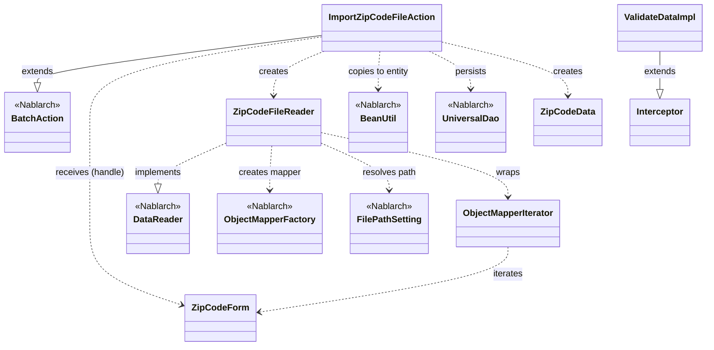
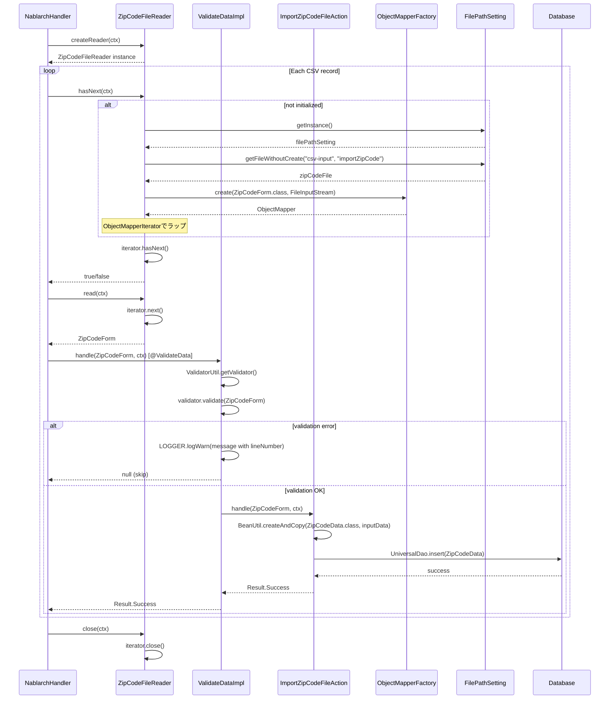

# Code Analysis: ImportZipCodeFileAction

**Generated**: 2026-03-31 15:25:07
**Target**: 住所CSVファイルをDBに登録するバッチアクション
**Modules**: nablarch-example-batch
**Analysis Duration**: approx. 5m 21s

---

## Overview

`ImportZipCodeFileAction` は、郵便番号CSVファイルを読み込み、各行のデータをバリデーション後にDBへ登録するNablarchバッチアクションクラス。`BatchAction<ZipCodeForm>` を継承し、`handle()` メソッドで1レコードずつのDB登録処理を行う。CSVの読み込みは `ZipCodeFileReader` が担当し、`ObjectMapperFactory` と `ObjectMapper` でCSVをJava Beansにバインドする。バリデーションは `@ValidateData` インターセプタにより共通化されており、バリデーションエラー発生時は警告ログを出力してスキップする。

---

## Architecture

### Dependency Graph



**Note**: This diagram uses Mermaid `classDiagram` syntax to show class names and their relationships. Use `--|>` for inheritance (extends/implements) and `..>` for dependencies (uses/creates).

### Component Summary

| Component | Role | Type | Dependencies |
|-----------|------|------|--------------|
| ImportZipCodeFileAction | 郵便番号CSV一括登録バッチアクション | Action (BatchAction) | ZipCodeFileReader, ZipCodeForm, BeanUtil, UniversalDao |
| ZipCodeForm | CSVレコードバインドとバリデーション用フォーム | Form | @Csv, @CsvFormat, @Domain, @Required, @LineNumber |
| ZipCodeFileReader | CSVファイル読み込みデータリーダ | DataReader | ObjectMapperFactory, FilePathSetting, ObjectMapperIterator |
| ObjectMapperIterator | ObjectMapperをIteratorとしてラップするクラス | Utility | ObjectMapper |
| ValidateData | ハンドラ実行をインターセプトしBean Validationを実行するインターセプタ | Interceptor | ValidatorUtil, BeanUtil, Logger |
| ZipCodeData | 郵便番号データエンティティ（DB登録対象） | Entity | なし（外部モジュール） |
| UniversalDao | DB登録処理（insert） | Nablarch | Database |

---

## Flow

### Processing Flow

バッチフレームワークのハンドラキューが処理を駆動する。`ZipCodeFileReader.read()` がCSVファイルから1行を読み込み `ZipCodeForm` として返す。`@ValidateData` インターセプタが `handle()` 実行前にBean Validationを実行し、エラーがあれば警告ログを出力してスキップ、エラーなしなら `ImportZipCodeFileAction.handle()` を呼び出す。`handle()` では `BeanUtil.createAndCopy()` で `ZipCodeForm` を `ZipCodeData` エンティティに変換し、`UniversalDao.insert()` でDBに登録する。ファイルの終端に達すると `ZipCodeFileReader.hasNext()` が `false` を返して処理完了。

**ヘルパーメソッドの詳細**:
- `ZipCodeFileReader.initialize()` (L78-88): 遅延初期化。`FilePathSetting.getInstance()` でファイルパス取得、`ObjectMapperFactory.create()` で `ObjectMapper` 生成、`ObjectMapperIterator` でラップ
- `ObjectMapperIterator.next()` (L56-60): 現在行を返し次行をプリフェッチ
- `ValidateDataImpl.handle()` (L60-91): バリデーション失敗時に行番号付きWARNログを出力しnullを返す

### Sequence Diagram



---

## Components

### ImportZipCodeFileAction

**ファイル**: [ImportZipCodeFileAction.java](../../.lw/nab-official/v6/nablarch-example-batch/src/main/java/com/nablarch/example/app/batch/action/ImportZipCodeFileAction.java)

**役割**: 郵便番号CSVファイルの1レコードをDBに登録するバッチアクション。`BatchAction<ZipCodeForm>` を継承し、フレームワークのハンドラキューから呼び出される。

**主要メソッド**:
- `handle(ZipCodeForm inputData, ExecutionContext ctx)` (L35-41): `@ValidateData` インターセプタによりバリデーション済みの入力を受け取り、`BeanUtil.createAndCopy()` でエンティティ変換後、`UniversalDao.insert()` でDB登録。`Result.Success` を返す
- `createReader(ExecutionContext ctx)` (L50-52): `ZipCodeFileReader` のインスタンスを返す

**依存**:
- `ZipCodeForm` (バリデーション済み入力データ)
- `ZipCodeData` (DB登録対象エンティティ)
- `BeanUtil` (フォーム→エンティティ変換)
- `UniversalDao` (DB insert)
- `ZipCodeFileReader` (DataReader実装)

---

### ZipCodeForm

**ファイル**: [ZipCodeForm.java](../../.lw/nab-official/v6/nablarch-example-batch/src/main/java/com/nablarch/example/app/batch/form/ZipCodeForm.java)

**役割**: CSVレコードをバインドし、Bean Validationでバリデーションを行うフォームクラス。CSVフォーマット定義はアノテーションで宣言的に指定。

**主要フィールド/メソッド**:
- クラスアノテーション `@Csv(type=CsvType.CUSTOM, properties={...})` (L17-20): CSVのカラム順・プロパティマッピング定義
- クラスアノテーション `@CsvFormat(charset="UTF-8", fieldSeparator=',', ...)` (L21-23): CSVフォーマット詳細（文字コード、区切り文字、クォートモード等）
- `getLineNumber()` (L143-145): `@LineNumber` アノテーション付きゲッタ。バリデーションエラー時の行番号ログ出力に使用
- 各フィールド: `@Domain` + `@Required` アノテーションでドメインバリデーションルールを定義

**依存**: Nablarch Bean Validation (`@Domain`, `@Required`, `@LineNumber`)

---

### ZipCodeFileReader

**ファイル**: [ZipCodeFileReader.java](../../.lw/nab-official/v6/nablarch-example-batch/src/main/java/com/nablarch/example/app/batch/reader/ZipCodeFileReader.java)

**役割**: CSVファイルを読み込む `DataReader<ZipCodeForm>` 実装クラス。遅延初期化でファイルを開き、`ObjectMapperIterator` を通じて1行ずつ返す。

**主要メソッド**:
- `read(ExecutionContext ctx)` (L40-45): `iterator.next()` で1行を返す。未初期化の場合は `initialize()` を呼ぶ
- `hasNext(ExecutionContext ctx)` (L54-59): `iterator.hasNext()` で次行有無を確認。未初期化の場合は `initialize()` を呼ぶ
- `close(ExecutionContext ctx)` (L68-70): `iterator.close()` でストリームを解放
- `initialize()` (L78-88): `FilePathSetting.getInstance()` でファイルパス取得、`ObjectMapperFactory.create()` でマッパー生成、`ObjectMapperIterator` でラップ

**依存**: `ObjectMapperFactory`, `FilePathSetting`, `ObjectMapperIterator`, `ZipCodeForm`

---

### ObjectMapperIterator

**ファイル**: [ObjectMapperIterator.java](../../.lw/nab-official/v6/nablarch-example-batch/src/main/java/com/nablarch/example/app/batch/reader/iterator/ObjectMapperIterator.java)

**役割**: `ObjectMapper` を `Iterator<E>` としてラップし、データリーダの実装をシンプルにするユーティリティクラス。コンストラクタで初回データをプリフェッチする。

**主要メソッド**:
- コンストラクタ `ObjectMapperIterator(ObjectMapper<E> mapper)` (L32-37): `mapper.read()` で初回データをプリフェッチ
- `hasNext()` (L45-47): `form != null` で次行有無を判定
- `next()` (L56-60): 現在の `form` を返し、次のデータをプリフェッチ
- `close()` (L66-68): `mapper.close()` でリソース解放

**依存**: `ObjectMapper` (Nablarch)

---

### ValidateData

**ファイル**: [ValidateData.java](../../.lw/nab-official/v6/nablarch-example-batch/src/main/java/com/nablarch/example/app/batch/interceptor/ValidateData.java)

**役割**: `@ValidateData` アノテーション付きメソッドの実行をインターセプトし、Jakarta Bean Validationを実行するインターセプタ。バリデーションエラー時はWARNログを出力してスキップ（null返却）。

**主要メソッド**:
- `ValidateDataImpl.handle(Object data, ExecutionContext context)` (L60-91): `ValidatorUtil.getValidator()` でバリデータ取得、`validator.validate(data)` で検証実行。エラーなし→元のハンドラを呼び出し。エラーあり→行番号付きWARNログを出力しnullを返す

**依存**: `ValidatorUtil`, `BeanUtil`, `Logger`, `MessageUtil`

---

## Nablarch Framework Usage

### BatchAction

**クラス**: `nablarch.fw.action.BatchAction`

**説明**: 汎用的なNablarchバッチアクションのテンプレートクラス。`DataReader` から受け取った入力データに対する業務ロジックを `handle()` メソッドに実装する。

**使用方法**:
```java
public class ImportZipCodeFileAction extends BatchAction<ZipCodeForm> {
    @Override
    @ValidateData
    public Result handle(ZipCodeForm inputData, ExecutionContext ctx) {
        ZipCodeData data = BeanUtil.createAndCopy(ZipCodeData.class, inputData);
        UniversalDao.insert(data);
        return new Result.Success();
    }

    @Override
    public DataReader<ZipCodeForm> createReader(ExecutionContext ctx) {
        return new ZipCodeFileReader();
    }
}
```

**重要ポイント**:
- ✅ **`handle()` の戻り値**: 処理成功時は `return new Result.Success()` を返す。フレームワークが処理結果を管理する
- ✅ **`createReader()` の実装**: 使用する `DataReader` のインスタンスを返す。バッチ起動時に一度だけ呼ばれる
- 💡 **`data_bind` を使う場合**: `FileBatchAction` ではなく `BatchAction` を継承する。`FileBatchAction` は `data_format` を使用するため
- 🎯 **インターセプタによるバリデーション共通化**: `@ValidateData` のようなカスタムインターセプタで複数バッチ間のバリデーション処理を共通化できる

**このコードでの使い方**:
- `ImportZipCodeFileAction` が `BatchAction<ZipCodeForm>` を継承 (L21)
- `handle()` でフォーム→エンティティ変換とDB登録 (L35-41)
- `createReader()` で `ZipCodeFileReader` を返す (L50-52)

**詳細**: [nablarch-batch-architecture](../../.claude/skills/nabledge-6/docs/processing-pattern/nablarch-batch/nablarch-batch-architecture.md)

---

### UniversalDao

**クラス**: `nablarch.common.dao.UniversalDao`

**説明**: Jakarta PersistenceアノテーションによるシンプルなO/Rマッパー。SQLを書かずにEntityクラスに対するCRUD操作が可能。

**使用方法**:
```java
ZipCodeData data = BeanUtil.createAndCopy(ZipCodeData.class, inputData);
UniversalDao.insert(data);
```

**重要ポイント**:
- ✅ **事前設定必須**: `BasicDaoContextFactory` をコンポーネント定義に `daoContextFactory` という名前で設定する必要がある
- ✅ **Entityクラスに `@Table`, `@Id` 等のJakarta Persistenceアノテーションが必要**: SQLは実行時に自動構築される
- ⚠️ **主キー以外での更新・削除は不可**: 主キー以外の条件での更新・削除は `database` ライブラリを直接使う
- 💡 **SQLを書かずにCRUDが可能**: 単純な登録・更新・削除・主キー検索はEntityアノテーションだけで実現

**このコードでの使い方**:
- `handle()` 内で `UniversalDao.insert(data)` でDB登録 (L38)
- `BeanUtil.createAndCopy()` で `ZipCodeForm` → `ZipCodeData` に変換した後に呼び出す

**詳細**: [libraries-universal_dao](../../.claude/skills/nabledge-6/docs/component/libraries/libraries-universal_dao.md)

---

### ObjectMapperFactory / ObjectMapper (data_bind)

**クラス**: `nablarch.common.databind.ObjectMapperFactory`, `nablarch.common.databind.ObjectMapper`

**説明**: CSVやTSV、固定長データをJava Beansとして扱う機能。`ZipCodeForm` に付与した `@Csv` / `@CsvFormat` アノテーションの定義に従ってCSVをバインドする。

**使用方法**:
```java
// ZipCodeFileReader.initialize() での使い方
ObjectMapperIterator<ZipCodeForm> iterator = new ObjectMapperIterator<>(
    ObjectMapperFactory.create(ZipCodeForm.class, new FileInputStream(zipCodeFile))
);

// ZipCodeForm のアノテーション定義
@Csv(properties = {"localGovernmentCode", "zipCode5digit", ...}, type = CsvType.CUSTOM)
@CsvFormat(charset = "UTF-8", fieldSeparator = ',', ignoreEmptyLine = true, ...)
public class ZipCodeForm { ... }
```

**重要ポイント**:
- ✅ **`ObjectMapper#close()` を必ず呼ぶ**: ストリームを解放するため。`ObjectMapperIterator.close()` → `ObjectMapper.close()` の連鎖で解放
- ⚠️ **`ObjectMapper` はスレッドアンセーフ**: 複数スレッドで共有しないこと
- ⚠️ **外部から受け付けたデータのプロパティはすべて `String` 型で定義**: 不正データを業務エラーとして通知するため
- 💡 **`ObjectMapperIterator` パターン**: `ObjectMapper` に `hasNext()` メソッドがないため、`ObjectMapperIterator` でラップしてデータリーダの実装をシンプルにする

**このコードでの使い方**:
- `ZipCodeFileReader.initialize()` で `ObjectMapperFactory.create()` を呼び出し (L84)
- `ObjectMapperIterator` でラップしてイテレータとして使用 (L84)
- `close(ctx)` で `iterator.close()` → `mapper.close()` を呼び出す (L69)

**詳細**: [libraries-data_bind](../../.claude/skills/nabledge-6/docs/component/libraries/libraries-data_bind.md)

---

### BeanUtil

**クラス**: `nablarch.core.beans.BeanUtil`

**説明**: JavaBeansのプロパティコピーを提供するユーティリティクラス。`createAndCopy()` で異なる型のBeanに値をコピーできる。

**使用方法**:
```java
ZipCodeData data = BeanUtil.createAndCopy(ZipCodeData.class, inputData);
```

**重要ポイント**:
- ✅ **型変換**: 同名プロパティ間でのコピーで、型変換も自動的に行う（String → Longなど）
- 🎯 **フォーム→エンティティ変換パターン**: バッチでよく使われるパターン。フォームで受け取ったバリデーション済みデータをエンティティに変換してDBアクセス

**このコードでの使い方**:
- `handle()` 内で `BeanUtil.createAndCopy(ZipCodeData.class, inputData)` (L37)
- `ValidateDataImpl.handle()` 内で `BeanUtil.getProperty(data, "lineNumber")` で行番号取得 (L76)

**詳細**: [libraries-bean_validation](../../.claude/skills/nabledge-6/docs/component/libraries/libraries-bean_validation.md)

---

### @Csv / @CsvFormat / @LineNumber (data_bind)

**クラス**: `nablarch.common.databind.csv.Csv`, `nablarch.common.databind.csv.CsvFormat`, `nablarch.common.databind.LineNumber`

**説明**: CSVフォーマット定義のアノテーション。`@Csv` でカラム順・プロパティマッピングを定義し、`@CsvFormat` で詳細フォーマットを指定。`@LineNumber` で論理行番号を自動設定。

**使用方法**:
```java
@Csv(properties = {"col1", "col2"}, type = CsvType.CUSTOM)
@CsvFormat(charset = "UTF-8", fieldSeparator = ',', ignoreEmptyLine = true,
           lineSeparator = "\r\n", quote = '"', quoteMode = QuoteMode.NORMAL,
           requiredHeader = false, emptyToNull = true)
public class ZipCodeForm {
    private Long lineNumber;

    @LineNumber
    public Long getLineNumber() { return lineNumber; }
}
```

**重要ポイント**:
- ✅ **`CsvType.CUSTOM` 使用時は `@CsvFormat` が必須**: フォーマットセットに該当しない場合に個別指定する
- 💡 **`@LineNumber` でバリデーションエラー行番号を取得**: バリデーションエラー発生時に行番号をログに出力できる
- ⚠️ **`emptyToNull = true` の設定**: 空フィールドを `null` として扱う。`@Required` と組み合わせてnullチェックに活用

**このコードでの使い方**:
- `ZipCodeForm` に `@Csv` + `@CsvFormat` で15カラムのCSVフォーマットを定義 (L17-23)
- `getLineNumber()` に `@LineNumber` を付与して行番号を自動設定 (L143)
- `ValidateData` インターセプタが行番号をWARNログに出力 (ValidateData.java L76)

**詳細**: [libraries-data_bind](../../.claude/skills/nabledge-6/docs/component/libraries/libraries-data_bind.md)

---

## References

### Source Files

- [ImportZipCodeFileAction.java](../../.lw/nab-official/v6/nablarch-example-batch/src/main/java/com/nablarch/example/app/batch/action/ImportZipCodeFileAction.java) - ImportZipCodeFileAction
- [ZipCodeForm.java](../../.lw/nab-official/v6/nablarch-example-batch/src/main/java/com/nablarch/example/app/batch/form/ZipCodeForm.java) - ZipCodeForm
- [ZipCodeFileReader.java](../../.lw/nab-official/v6/nablarch-example-batch/src/main/java/com/nablarch/example/app/batch/reader/ZipCodeFileReader.java) - ZipCodeFileReader
- [ObjectMapperIterator.java](../../.lw/nab-official/v6/nablarch-example-batch/src/main/java/com/nablarch/example/app/batch/reader/iterator/ObjectMapperIterator.java) - ObjectMapperIterator
- [ValidateData.java](../../.lw/nab-official/v6/nablarch-example-batch/src/main/java/com/nablarch/example/app/batch/interceptor/ValidateData.java) - ValidateData

### Knowledge Base (Nabledge-6)

- [nablarch-batch-getting-started-nablarch-batch](../../.claude/skills/nabledge-6/docs/processing-pattern/nablarch-batch/nablarch-batch-getting-started-nablarch-batch.md)
- [nablarch-batch-architecture](../../.claude/skills/nabledge-6/docs/processing-pattern/nablarch-batch/nablarch-batch-architecture.md)
- [libraries-data_bind](../../.claude/skills/nabledge-6/docs/component/libraries/libraries-data_bind.md)
- [libraries-universal_dao](../../.claude/skills/nabledge-6/docs/component/libraries/libraries-universal_dao.md)
- [libraries-bean_validation](../../.claude/skills/nabledge-6/docs/component/libraries/libraries-bean_validation.md)

### Official Documentation

- [architecture](https://nablarch.github.io/docs/LATEST/doc/application_framework/application_framework/batch/nablarch_batch/architecture.html)
- [index](https://nablarch.github.io/docs/LATEST/doc/application_framework/application_framework/batch/nablarch_batch/getting_started/nablarch_batch/index.html)
- [data bind](https://nablarch.github.io/docs/LATEST/doc/application_framework/application_framework/libraries/data_io/data_bind.html)
- [universal dao](https://nablarch.github.io/docs/LATEST/doc/application_framework/application_framework/libraries/database/universal_dao.html)
- [bean validation](https://nablarch.github.io/docs/LATEST/doc/application_framework/application_framework/libraries/validation/bean_validation.html)
- [BatchAction](https://nablarch.github.io/docs/LATEST/javadoc/nablarch/fw/action/BatchAction.html)
- [DataReader](https://nablarch.github.io/docs/LATEST/javadoc/nablarch/fw/DataReader.html)
- [ObjectMapper](https://nablarch.github.io/docs/LATEST/javadoc/nablarch/common/databind/ObjectMapper.html)
- [ObjectMapperFactory](https://nablarch.github.io/docs/LATEST/javadoc/nablarch/common/databind/ObjectMapperFactory.html)
- [UniversalDao](https://nablarch.github.io/docs/LATEST/javadoc/nablarch/common/dao/UniversalDao.html)
- [BeanUtil](https://nablarch.github.io/docs/LATEST/javadoc/nablarch/core/beans/BeanUtil.html)

---

**Output**: `.nabledge/20260331/code-analysis-ImportZipCodeFileAction.md`

**Note**: This documentation was generated by the code-analysis workflow of the nabledge-6 skill.
