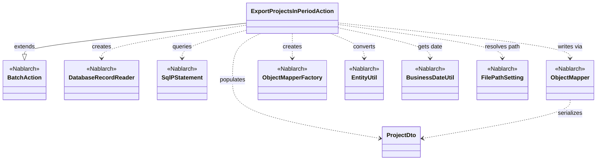
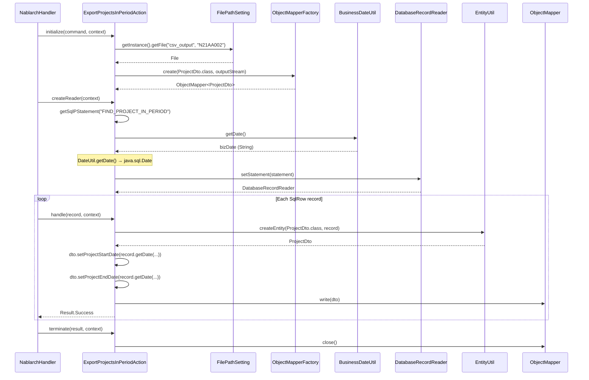

# Code Analysis: ExportProjectsInPeriodAction

**Generated**: 2026-03-31 15:32:28
**Target**: 期間内プロジェクト一覧CSV出力バッチアクション
**Modules**: proman-batch
**Analysis Duration**: approx. 6m 33s

---

## Overview

`ExportProjectsInPeriodAction` は、業務日付を基準に「期間内」のプロジェクト一覧をデータベースから読み込み、CSVファイルとして出力するNablarchバッチアクションクラスである。

アーキテクチャは `BatchAction<SqlRow>` を継承した都度起動バッチで、以下の3フェーズで動作する：
1. **初期化** (`initialize`): 出力先CSVファイルを `FilePathSetting` から解決し、`ObjectMapperFactory` でCSVライタを準備する
2. **データ読み込み** (`createReader`): `DatabaseRecordReader` + `SqlPStatement` で業務日付を条件に対象プロジェクトを検索する
3. **レコード処理** (`handle`): 各 `SqlRow` を `EntityUtil` で `ProjectDto` に変換し `ObjectMapper` でCSV出力する

`ProjectDto` は `@Csv` / `@CsvFormat` アノテーションでCSVフォーマットを宣言的に定義するデータ転送オブジェクトである。

---

## Architecture

### Dependency Graph



**Note**: This diagram uses Mermaid `classDiagram` syntax to show class names and their relationships. Use `--|>` for inheritance (extends/implements) and `..>` for dependencies (uses/creates).

### Component Summary

| Component | Role | Type | Dependencies |
|-----------|------|------|--------------|
| ExportProjectsInPeriodAction | 期間内プロジェクトCSV出力バッチアクション | Action (BatchAction) | DatabaseRecordReader, ObjectMapper, FilePathSetting, EntityUtil, BusinessDateUtil |
| ProjectDto | プロジェクト情報CSV出力用DTO | Bean (CSV annotated) | DateUtil |

---

## Flow

### Processing Flow

バッチフレームワークは `initialize` → `createReader` → `handle` (各レコード) → `terminate` の順にメソッドを呼び出す。

**initialize()** (L44-54):
CSVファイル出力先を `FilePathSetting.getInstance()` で `csv_output` ベースパス / `N21AA002` として解決する。`FileOutputStream` を生成し `ObjectMapperFactory.create(ProjectDto.class, outputStream)` でCSVマッパーを初期化する。ファイルが見つからない場合は `IllegalStateException` をスローする。

**createReader()** (L57-65):
`DatabaseRecordReader` を生成し、`getSqlPStatement("FIND_PROJECT_IN_PERIOD")` で検索SQL文を取得する。`BusinessDateUtil.getDate()` で業務日付を取得し `java.sql.Date` に変換して、SQL文の第1・第2パラメータ（開始日・終了日条件）に設定する。

**handle()** (L68-75):
`EntityUtil.createEntity(ProjectDto.class, record)` で `SqlRow` から `ProjectDto` を生成する。日付フィールド（`PROJECT_START_DATE`, `PROJECT_END_DATE`）は型不一致のため `EntityUtil` では設定できないので、`record.getDate()` と明示的 setter 呼び出しで設定する。`mapper.write(dto)` でCSV1行を出力し `Result.Success` を返す。

**terminate()** (L78-80):
`mapper.close()` を呼び出してCSVバッファをフラッシュしファイルストリームをクローズする。

### Sequence Diagram



---

## Components

### ExportProjectsInPeriodAction

**ファイル**: [ExportProjectsInPeriodAction.java](../../.lw/nab-official/v6/nablarch-system-development-guide/Sample_Project/Source_Code/proman-project/proman-batch/src/main/java/com/nablarch/example/proman/batch/project/ExportProjectsInPeriodAction.java)

**役割**: 業務日付を条件にDB検索し、期間内プロジェクトをCSVファイルとして出力する都度起動バッチアクション

**主要メソッド**:
- `initialize(CommandLine, ExecutionContext)` (L44-54): CSVファイル出力先の解決と `ObjectMapper` の初期化
- `createReader(ExecutionContext)` (L57-65): `DatabaseRecordReader` を生成し業務日付を検索条件として設定
- `handle(SqlRow, ExecutionContext)` (L68-75): 1レコードをDTOに変換しCSV出力
- `terminate(Result, ExecutionContext)` (L78-80): `ObjectMapper` のクローズ処理

**依存**:
- `BatchAction<SqlRow>` (Nablarch): バッチアクション基底クラス
- `DatabaseRecordReader` (Nablarch): DB読み込みデータリーダ
- `ObjectMapper<ProjectDto>` (Nablarch): CSVマッパー（インスタンスフィールド）
- `EntityUtil` (Nablarch): `SqlRow` → Bean 変換
- `BusinessDateUtil` (Nablarch): 業務日付取得
- `FilePathSetting` (Nablarch): ファイルパス解決

**実装ポイント**:
- `ProjectDto` の日付フィールドは setter 引数が `java.util.Date` 型だが、`SqlRow.getDate()` は `java.sql.Date` を返す。`EntityUtil` では自動変換できないため `handle()` で明示的に setter を呼んでいる (L71-72)
- `mapper` はインスタンスフィールドとして `initialize()` で初期化し `handle()` で使い回す。`BatchAction` はシングルスレッド実行のため問題ない

---

### ProjectDto

**ファイル**: [ProjectDto.java](../../.lw/nab-official/v6/nablarch-system-development-guide/Sample_Project/Source_Code/proman-project/proman-batch/src/main/java/com/nablarch/example/proman/batch/project/ProjectDto.java)

**役割**: CSV出力用のデータ転送オブジェクト。アノテーションでCSVフォーマットを宣言定義する

**主要メソッド**:
- `setProjectStartDate(Date)` (L138-140): `DateUtil.formatDate` で `Date` → `"yyyy/MM/dd"` 文字列に変換してフィールドに格納
- `setProjectEndDate(Date)` (L154-156): 同上（終了日付）

**依存**:
- `@Csv` / `@CsvFormat` (Nablarch): CSVフォーマット定義アノテーション
- `DateUtil` (Nablarch): 日付フォーマット変換

**実装ポイント**:
- 全フィールドは `String` 型。日付フィールドのみ setter 引数が `java.util.Date` で内部で文字列変換している
- `@Csv(type = CsvType.CUSTOM)` + `@CsvFormat(quoteMode = QuoteMode.ALL, charset = "UTF-8")` の組み合わせでカスタムCSVフォーマットを定義

---

## Nablarch Framework Usage

### BatchAction

**クラス**: `nablarch.fw.action.BatchAction<D>`

**説明**: Nablarchバッチ処理の汎用テンプレートクラス。`initialize`/`createReader`/`handle`/`terminate` のライフサイクルメソッドをオーバーライドして業務ロジックを実装する。

**使用方法**:
```java
public class MyBatchAction extends BatchAction<SqlRow> {
    @Override
    protected void initialize(CommandLine command, ExecutionContext context) { /* 初期化 */ }

    @Override
    public DataReader<SqlRow> createReader(ExecutionContext context) {
        DatabaseRecordReader reader = new DatabaseRecordReader();
        reader.setStatement(getSqlPStatement("SELECT_SQL"));
        return reader;
    }

    @Override
    public Result handle(SqlRow record, ExecutionContext context) {
        // 業務ロジック
        return new Success();
    }

    @Override
    protected void terminate(Result result, ExecutionContext context) { /* クローズ処理 */ }
}
```

**重要ポイント**:
- ✅ **`terminate()` でリソースを必ずクローズ**: `ObjectMapper` 等のリソースは `terminate()` でクローズする。例外が発生してもフレームワークが呼び出す
- ⚠️ **`FileBatchAction` との違い**: `FileBatchAction` は data_format ライブラリに依存するため、data_bind (ObjectMapper) を使う場合は `BatchAction` を選択すること
- 💡 **DB to FILE パターン**: DBを読み込んでファイルを出力する場合は `BatchAction<SqlRow>` + `DatabaseRecordReader` が標準パターン

**このコードでの使い方**:
- `BatchAction<SqlRow>` を継承。`SqlRow` でDBレコードを1件ずつ受け取る
- `initialize` でObjectMapperを準備、`createReader` でDB読み込みリーダを設定、`handle` でCSV出力、`terminate` でclose

**詳細**: [Nablarchバッチ処理 アーキテクチャ](../../.claude/skills/nabledge-6/docs/processing-pattern/nablarch-batch/nablarch-batch-architecture.md)

---

### ObjectMapper / ObjectMapperFactory

**クラス**: `nablarch.common.databind.ObjectMapper` / `nablarch.common.databind.ObjectMapperFactory`

**説明**: CSV・TSV・固定長データをJava Beansとして扱う機能を提供する。`@Csv` / `@CsvFormat` アノテーションでフォーマットを宣言的に定義できる。

**使用方法**:
```java
// CSVファイル書き込み
ObjectMapper<ProjectDto> mapper = ObjectMapperFactory.create(ProjectDto.class, outputStream);
mapper.write(dto);  // 1レコード書き込み
mapper.close();     // 必ずクローズ（バッファフラッシュ + リソース解放）
```

**重要ポイント**:
- ✅ **必ず `close()` を呼ぶ**: バッファをフラッシュしリソースを解放する。このコードでは `terminate()` で実施している
- ⚠️ **スレッドアンセーフ**: `ObjectMapper` はスレッドセーフではない。複数スレッドで共有してはならない。このバッチはシングルスレッド実行のためインスタンスフィールドとして保持しても問題ない
- 💡 **アノテーション駆動**: `@Csv(type = CsvType.CUSTOM)` + `@CsvFormat` でフォーマットを宣言的に定義できる
- ⚠️ **型変換の制限**: `EntityUtil` と同様に、型変換が必要な項目（日付型など）は個別の setter 設定が必要

**このコードでの使い方**:
- `initialize()` (L50): `ObjectMapperFactory.create(ProjectDto.class, outputStream)` でマッパーを生成
- `handle()` (L73): `mapper.write(dto)` で各レコードをCSV1行として出力
- `terminate()` (L79): `mapper.close()` でリソース解放

**詳細**: [データバインド](../../.claude/skills/nabledge-6/docs/component/libraries/libraries-data_bind.md)

---

### DatabaseRecordReader

**クラス**: `nablarch.fw.reader.DatabaseRecordReader`

**説明**: バッチ処理でデータベースのレコードを1件ずつ読み込む標準データリーダ。`SqlPStatement` を設定して使用する。

**使用方法**:
```java
DatabaseRecordReader reader = new DatabaseRecordReader();
SqlPStatement statement = getSqlPStatement("FIND_PROJECT_IN_PERIOD");
statement.setDate(1, bizDate);
reader.setStatement(statement);
return reader;
```

**重要ポイント**:
- 💡 **標準DBリーダ**: `BatchAction` と組み合わせて使う標準的なDB読み込みリーダ。DB to FILE出力バッチで多用する
- ⚠️ **data_bind との組み合わせ**: `FileDataReader` / `ValidatableFileDataReader` は data_format に依存するため、data_bind を使う場合は `DatabaseRecordReader` を使うこと
- 🎯 **使い所**: DBテーブルを1件ずつ読み込んで処理するバッチ（DB to FILE、DB to DB等）に適している

**このコードでの使い方**:
- `createReader()` (L58-64): `DatabaseRecordReader` を生成し業務日付パラメータ付きの SQL 文を設定して返却

**詳細**: [Nablarchバッチ処理 アーキテクチャ](../../.claude/skills/nabledge-6/docs/processing-pattern/nablarch-batch/nablarch-batch-architecture.md)

---

### BusinessDateUtil

**クラス**: `nablarch.core.date.BusinessDateUtil`

**説明**: システムで管理している業務日付を取得するユーティリティクラス。

**使用方法**:
```java
String bizDateStr = BusinessDateUtil.getDate();  // "yyyyMMdd" 形式の文字列
Date bizDate = new Date(DateUtil.getDate(bizDateStr).getTime());  // java.sql.Date に変換
```

**重要ポイント**:
- 🎯 **業務日付 vs システム日付**: 業務処理の日付条件には `BusinessDateUtil.getDate()` を使う。`new Date()` やシステム時刻は使わないこと
- ⚠️ **型変換が必要**: `getDate()` は `String`（"yyyyMMdd"形式）を返す。`SqlPStatement.setDate()` に渡すには `DateUtil.getDate()` → `java.sql.Date` の変換が必要

**このコードでの使い方**:
- `createReader()` (L60): `BusinessDateUtil.getDate()` で業務日付文字列を取得し `java.sql.Date` に変換、SQL 検索条件（開始日・終了日）として設定

**詳細**: [日付管理](../../.claude/skills/nabledge-6/docs/component/libraries/libraries-date.md)

---

### EntityUtil

**クラス**: `nablarch.common.dao.EntityUtil`

**説明**: `SqlRow` などのマップ形式データをエンティティBeanに変換するユーティリティクラス。

**使用方法**:
```java
ProjectDto dto = EntityUtil.createEntity(ProjectDto.class, record);
// 型不一致フィールドは明示的に設定
dto.setProjectStartDate(record.getDate("PROJECT_START_DATE"));
```

**重要ポイント**:
- ⚠️ **型変換の制限**: `SqlRow` のカラム型と Beanのフィールド型が一致しない場合は自動変換できない。このコードの日付フィールドがその例（`SqlRow` は `java.sql.Date`、`ProjectDto` の setter 引数は `java.util.Date`）
- 💡 **大部分のフィールドを自動変換**: 型が一致するフィールドは自動マッピングされるため、手動 set は型不一致分のみでよい

**このコードでの使い方**:
- `handle()` (L69): `EntityUtil.createEntity(ProjectDto.class, record)` で `SqlRow` から `ProjectDto` を生成。日付フィールド（L71-72）は型不一致のため明示的 setter で設定

---

## References

### Source Files

- [ExportProjectsInPeriodAction.java](../../.lw/nab-official/v6/nablarch-system-development-guide/en/Sample_Project/Source_Code/proman-project/proman-batch/src/main/java/com/nablarch/example/proman/batch/project/ExportProjectsInPeriodAction.java)
- [ProjectDto.java](../../.lw/nab-official/v6/nablarch-system-development-guide/en/Sample_Project/Source_Code/proman-project/proman-batch/src/main/java/com/nablarch/example/proman/batch/project/ProjectDto.java)

### Knowledge Base (Nabledge-6)

- [Nablarchバッチ処理 アーキテクチャ](../../.claude/skills/nabledge-6/docs/processing-pattern/nablarch-batch/nablarch-batch-architecture.md)
- [Nablarchバッチ処理 はじめから作成するチュートリアル](../../.claude/skills/nabledge-6/docs/processing-pattern/nablarch-batch/nablarch-batch-getting-started-nablarch-batch.md)
- [データバインド](../../.claude/skills/nabledge-6/docs/component/libraries/libraries-data_bind.md)
- [日付管理](../../.claude/skills/nabledge-6/docs/component/libraries/libraries-date.md)

### Official Documentation

- [Nablarchバッチのアーキテクチャ](https://nablarch.github.io/docs/LATEST/doc/application_framework/application_framework/batch/nablarch_batch/architecture.html)
- [Nablarchバッチ - はじめから作成するチュートリアル](https://nablarch.github.io/docs/LATEST/doc/application_framework/application_framework/batch/nablarch_batch/getting_started/nablarch_batch/index.html)
- [データバインド](https://nablarch.github.io/docs/LATEST/doc/application_framework/application_framework/libraries/data_io/data_bind.html)
- [日付管理](https://nablarch.github.io/docs/LATEST/doc/application_framework/application_framework/libraries/date.html)
- [ObjectMapper Javadoc](https://nablarch.github.io/docs/LATEST/javadoc/nablarch/common/databind/ObjectMapper.html)
- [ObjectMapperFactory Javadoc](https://nablarch.github.io/docs/LATEST/javadoc/nablarch/common/databind/ObjectMapperFactory.html)
- [BusinessDateUtil Javadoc](https://nablarch.github.io/docs/LATEST/javadoc/nablarch/core/date/BusinessDateUtil.html)

---

**Output**: `.nabledge/20260331/code-analysis-ExportProjectsInPeriodAction.md`

**Note**: This documentation was generated by the code-analysis workflow of the nabledge-6 skill.
