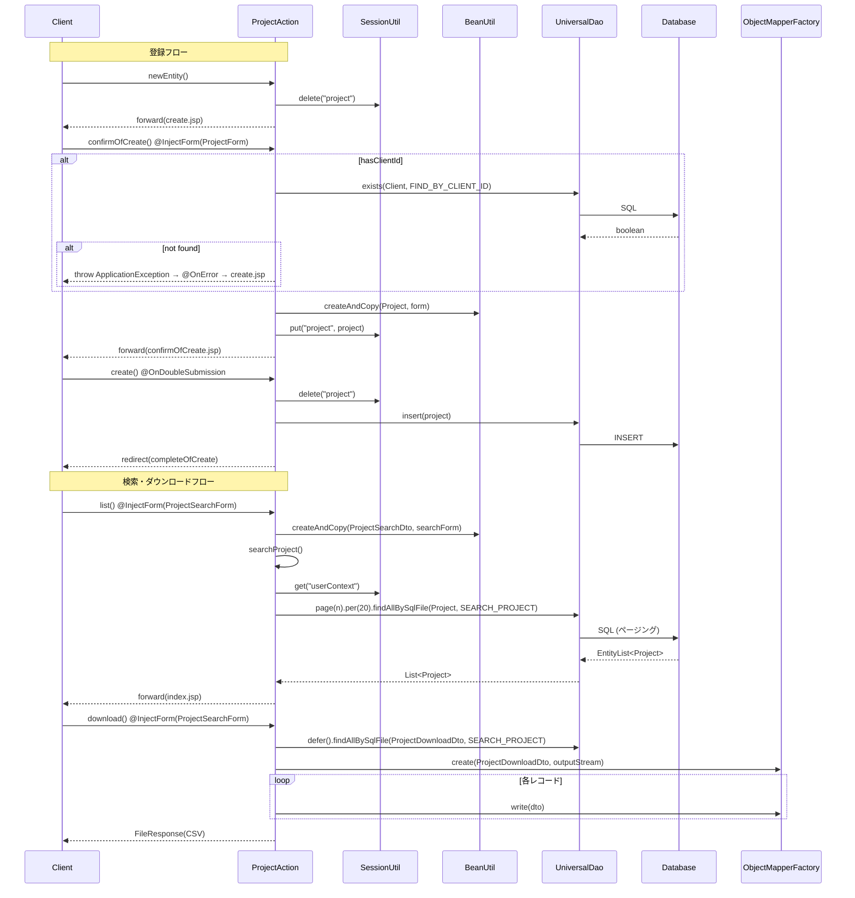

# Code Analysis: ProjectAction

**Generated**: 2026-04-24 08:06:54
**Target**: プロジェクト検索、登録、更新、削除機能のWebアクション
**Modules**: nablarch-example-web
**Analysis Duration**: unknown

---

## Overview

`ProjectAction` は nablarch-example-web のプロジェクト管理機能を提供するWebアクションクラスである。プロジェクトの登録、検索、一覧表示、CSVダウンロード、詳細表示、更新、削除という CRUD に加え、確認画面を挟んだ二段階の登録・更新フローと、遅延ロードを用いた大量データの CSV ダウンロードを実装している。ユニバーサルDAOによる DB アクセス、セッションストアによる一時データ保持、`@InjectForm`/`@OnError`/`@OnDoubleSubmission` インターセプタによる入力検証・業務例外制御・二重サブミット防止を組み合わせた、典型的な Nablarch Web アクションの構成となっている。

---

## Architecture

### Dependency Graph

```mermaid
classDiagram
    class ProjectAction
    class ProjectForm
    class ProjectSearchForm
    class ProjectUpdateForm
    class ProjectTargetForm
    class ProjectDto
    class ProjectSearchDto
    class ProjectDownloadDto
    class ProjectProfit
    class Project
    class Client
    class LoginUserPrincipal
    class ProjectSortKey
    class TempFileUtil
    class UniversalDao {
        <<Nablarch>>
    }
    class SessionUtil {
        <<Nablarch>>
    }
    class BeanUtil {
        <<Nablarch>>
    }
    class ObjectMapperFactory {
        <<Nablarch>>
    }
    class DeferredEntityList {
        <<Nablarch>>
    }
    class FileResponse {
        <<Nablarch>>
    }
    class ExecutionContext {
        <<Nablarch>>
    }
    class HttpResponse {
        <<Nablarch>>
    }
    class MessageUtil {
        <<Nablarch>>
    }
    class ApplicationException {
        <<Nablarch>>
    }

    ProjectAction ..> ProjectForm : validates
    ProjectAction ..> ProjectSearchForm : validates
    ProjectAction ..> ProjectUpdateForm : validates
    ProjectAction ..> ProjectTargetForm : validates
    ProjectAction ..> ProjectDto : creates
    ProjectAction ..> ProjectSearchDto : creates
    ProjectAction ..> ProjectDownloadDto : queries
    ProjectAction ..> ProjectProfit : creates
    ProjectAction ..> Project : persists
    ProjectAction ..> Client : queries
    ProjectAction ..> LoginUserPrincipal : reads
    ProjectAction ..> ProjectSortKey : uses
    ProjectAction ..> TempFileUtil : uses
    ProjectAction ..> UniversalDao : queries
    ProjectAction ..> SessionUtil : uses
    ProjectAction ..> BeanUtil : uses
    ProjectAction ..> ObjectMapperFactory : creates
    ProjectAction ..> DeferredEntityList : consumes
    ProjectAction ..> FileResponse : returns
    ProjectAction ..> ExecutionContext : uses
    ProjectAction ..> HttpResponse : returns
    ProjectAction ..> MessageUtil : uses
    ProjectAction ..> ApplicationException : throws
```



**Note**: This diagram uses Mermaid `classDiagram` syntax to show class names and their relationships. Use `--|>` for inheritance (extends/implements) and `..>` for dependencies (uses/creates).

### Component Summary

| Component | Role | Type | Dependencies |
|-----------|------|------|--------------|
| ProjectAction | プロジェクトCRUDの制御 | Action | Form群, Dto群, Project, Client, Nablarch各種 |
| ProjectForm | 登録入力のバリデーション対象 | Form | (Bean Validation) |
| ProjectSearchForm | 検索条件入力のバリデーション対象 | Form | ProjectSortKey |
| ProjectUpdateForm | 更新入力のバリデーション対象 | Form | (Bean Validation) |
| ProjectTargetForm | 対象プロジェクトID指定用 | Form | (Bean Validation) |
| ProjectDto | 画面表示・セッション転送用 | DTO | Project |
| ProjectSearchDto | DAO検索条件の受け渡し | DTO | ProjectSearchForm |
| ProjectDownloadDto | CSVダウンロード用の射影 | DTO | (DB mapping) |
| ProjectProfit | 売上・利益計算の不変オブジェクト | Value Object | none |

---

## Flow

### Processing Flow

ProjectAction は機能ごとに次のフローを提供する。

- 登録フロー: `newEntity()` で入力画面を表示 → `confirmOfCreate()` で入力を検証し、`Client` 存在チェックを行ったうえで `Project` をセッションに退避し利益情報 `ProjectProfit` をリクエストスコープに載せて確認画面へ → `create()` (二重サブミット防止) でセッションから `Project` を取り出し `UniversalDao.insert` → 303 リダイレクトで `completeOfCreate()` へ遷移。入力に戻る場合は `backToNew()` が `Client` 再取得を伴って入力画面に戻す。
- 検索フロー: `index()` はデフォルトのページ番号・ソートキーを設定し `searchProject()` を呼ぶ。`list()` は `@InjectForm` で受けた `ProjectSearchForm` を DTO に変換して `searchProject()` を呼ぶ。private ヘルパ `searchProject()` はログインユーザを `SessionUtil.get(..., "userContext")` から取得して検索条件に載せ、`UniversalDao.page(...).per(20L).findAllBySqlFile` でページング検索を実行する。
- ダウンロード: `download()` は同じ検索条件に対し `UniversalDao.defer().findAllBySqlFile` で `DeferredEntityList` を開き、`ObjectMapperFactory.create(ProjectDownloadDto.class, ...)` で CSV `ObjectMapper` を生成。try-with-resources で両方を確実に close しつつ `mapper.write(dto)` を呼び、`FileResponse` に Content-Type とファイル名を設定して返す。
- 詳細/更新フロー: `show()` と `edit()` は `@InjectForm(ProjectTargetForm.class)` でIDを受け、`UniversalDao.findBySqlFile(ProjectDto.class, "FIND_BY_PROJECT", ...)` で取得。`edit()` はさらに `SessionUtil.put(ctx, "project", ...)` で更新中エンティティをセッション保持する。`confirmOfUpdate()` は `Client` 存在チェック後 `BeanUtil.copy` で Form の値を既存 `Project` にマージして確認画面へ進める。`update()` (二重サブミット防止) は `UniversalDao.update` を行い `completeOfUpdate` へ 303 リダイレクト。`backToEdit()` は更新画面に戻す。
- 削除フロー: `delete()` (二重サブミット防止) はセッションの `Project` を `UniversalDao.delete` し `completeOfDelete` へリダイレクトする。

例外処理は `@OnError(type = ApplicationException.class, path = ...)` により、`confirmOfCreate`/`list`/`download`/`confirmOfUpdate` で業務例外発生時の遷移先が宣言的に定義される。

### Sequence Diagram



---

## Components

### ProjectAction

- 役割: プロジェクトCRUDのWebアクション
- 主要メソッド:
  - `confirmOfCreate()` (L70-95): 登録確認。Client存在チェック、`BeanUtil.createAndCopy(Project.class, form)`、`SessionUtil.put("project", ...)`、`ProjectProfit` 生成
  - `create()` (L103-110): `@OnDoubleSubmission` を伴う登録実行。`UniversalDao.insert(project)`
  - `list()` / `index()` (L161-183): 一覧表示。`searchProject()` に委譲
  - `searchProject()` (L194-204, private): `UniversalDao.page(...).per(20L).findAllBySqlFile` によるページング検索
  - `download()` (L213-236): `UniversalDao.defer()` と `ObjectMapperFactory` を try-with-resources で組み合わせた CSV ダウンロード
  - `show()` / `edit()` (L245-290): `findBySqlFile(ProjectDto.class, "FIND_BY_PROJECT", ...)` による詳細取得
  - `confirmOfUpdate()` (L298-327): 更新確認。`BeanUtil.copy(form, project)` で既存エンティティにマージ
  - `update()` / `delete()` (L359-386): `@OnDoubleSubmission` を伴う更新・削除
- 依存: 前掲 Dependency Graph 参照
- ファイル: [ProjectAction.java](../../.lw/nab-official/v6/nablarch-example-web/src/main/java/com/nablarch/example/app/web/action/ProjectAction.java)

### ProjectProfit

- 役割: プロジェクトの売上・売上原価・販管費・本社配賦から売上総利益/配賦前利益/営業利益とそれぞれの利益率を算出する不変値オブジェクト
- 主要メソッド:
  - `getGrossProfit()` / `getProfitBeforeAllocation()` / `getOperatingProfit()`: null 値を含む場合は null を返すガード付きの利益算出
  - `getProfitRateBeforeAllocation()` / `getOperatingProfitRate()`: `BigDecimal.divide(..., 3, RoundingMode.DOWN)` で利益率を計算。`ArithmeticException` 発生時は `BigDecimal.ZERO.setScale(3, RoundingMode.DOWN)` にフォールバック
- 依存: なし (JDKのみ)
- ファイル: [ProjectProfit.java](../../.lw/nab-official/v6/nablarch-example-web/src/main/java/com/nablarch/example/app/web/action/ProjectProfit.java)

---

## Nablarch Framework Usage

### UniversalDao

**Class**: `nablarch.common.dao.UniversalDao`

**Description**: SQL ID を指定した SQL ファイルベースの検索・更新・削除や、ページング・遅延ロードを提供する Nablarch 標準の DAO。

**Usage**:
```java
// ページング検索
UniversalDao.page(searchCondition.getPageNumber())
            .per(20L)
            .findAllBySqlFile(Project.class, "SEARCH_PROJECT", searchCondition);

// 遅延ロード (ダウンロード)
try (DeferredEntityList<ProjectDownloadDto> list = (DeferredEntityList<ProjectDownloadDto>) UniversalDao
        .defer()
        .findAllBySqlFile(ProjectDownloadDto.class, "SEARCH_PROJECT", searchCondition)) {
    for (ProjectDownloadDto dto : list) { /* ... */ }
}

// 単体取得・存在確認・CUD
UniversalDao.findBySqlFile(ProjectDto.class, "FIND_BY_PROJECT", params);
UniversalDao.exists(Client.class, "FIND_BY_CLIENT_ID", params);
UniversalDao.insert(project); UniversalDao.update(project); UniversalDao.delete(project);
```

**Important points**:
- ✅ **SQLファイル配置**: `findAllBySqlFile(User.class, ...)` の SQL ファイルは対応 Bean のパッケージと同じ位置 (例: `sample/entity/User.sql`) に置く。
- ⚠️ **遅延ロードは try-with-resources 必須**: `DeferredEntityList` はサーバサイドカーソルを保持するため、`close()` を呼ばないとカーソルがリークする。`ProjectAction.download()` は try-with-resources で担保。
- ⚠️ **ページング中のトランザクション**: 遅延ロード中にトランザクション制御が入るとカーソルが閉じる RDBMS があるため、大量データはページングや JDBC 設定で回避する。
- 💡 **ページング**: `page(n).per(size).findAllBySqlFile(...)` だけで件数取得SQLと範囲指定SQLが発行され、`Pagination` が `EntityList.getPagination()` から取得できる。

**Usage in this code**:
- 検索 (`searchProject` L203): `UniversalDao.page(...).per(20L).findAllBySqlFile(Project.class, "SEARCH_PROJECT", searchCondition)` でページング検索
- ダウンロード (`download` L222-225): `UniversalDao.defer().findAllBySqlFile(ProjectDownloadDto.class, "SEARCH_PROJECT", ...)` で遅延ロード
- 単体取得 (`show`/`edit`): `UniversalDao.findBySqlFile(ProjectDto.class, "FIND_BY_PROJECT", ...)`
- 存在確認 (`confirmOfCreate`/`confirmOfUpdate`): `UniversalDao.exists(Client.class, "FIND_BY_CLIENT_ID", ...)`
- CUD: `create`/`update`/`delete` で `insert`/`update`/`delete(project)`

**Details**: [Libraries Universal Dao](../../.claude/skills/nabledge-6/docs/component/libraries/libraries-universal-dao.md)

### @InjectForm / @OnError

**Class**: `nablarch.common.web.interceptor.InjectForm`, `nablarch.fw.web.interceptor.OnError`

**Description**: `@InjectForm` はリクエストパラメータから Form Bean を生成・バリデーションしリクエストスコープに注入するインターセプタ。`@OnError` はメソッド内で指定型の `RuntimeException` が発生した場合の遷移先を宣言的に指定する。

**Usage**:
```java
@InjectForm(form = ProjectForm.class, prefix = "form")
@OnError(type = ApplicationException.class, path = "/WEB-INF/view/project/create.jsp")
public HttpResponse confirmOfCreate(HttpRequest request, ExecutionContext context) {
    ProjectForm form = context.getRequestScopedVar("form");
    // ...
}
```

**Important points**:
- ✅ **変数名の既定は `form`**: `name` 属性を省略すると `ctx.getRequestScopedVar("form")` で取得できる。`list`/`download` のように複数フォームを使う場合は `name = "searchForm"` で明示する。
- 🎯 **業務例外の遷移先を宣言化**: `@OnError(type = ApplicationException.class, path = ...)` を付けるだけで、Action メソッドから throw された業務例外を指定パスへ遷移させられる。
- 💡 **type はサブクラスも対象**: `type` に指定した例外のサブクラスも対象となる。

**Usage in this code**:
- `confirmOfCreate` (L68-69): `ProjectForm` のバリデーションと、`ApplicationException` 発生時 `create.jsp` への遷移
- `list`/`download` (L155-156, L208-209): `ProjectSearchForm` を `name = "searchForm"` で注入し、エラー時は `index.jsp` へ遷移
- `show`/`edit` (L245, L265): `ProjectTargetForm` で ID を注入
- `confirmOfUpdate` (L297-298): `ProjectUpdateForm` を注入し、エラー時は `update.jsp` へ遷移

**Details**: [Handlers InjectForm](../../.claude/skills/nabledge-6/docs/component/handlers/handlers-InjectForm.md), [Handlers On Error](../../.claude/skills/nabledge-6/docs/component/handlers/handlers-on-error.md)

### @OnDoubleSubmission

**Class**: `nablarch.common.web.token.OnDoubleSubmission`

**Description**: 登録・更新・削除など副作用を伴うアクションに付与して、トークン方式で二重サブミットを検知・抑止するインターセプタ。

**Usage**:
```java
@OnDoubleSubmission
public HttpResponse create(HttpRequest request, ExecutionContext context) {
    // ...
}

// 遷移先を明示する場合
@OnDoubleSubmission(path = "/WEB-INF/view/error/userError.jsp")
public HttpResponse register(HttpRequest req, ExecutionContext ctx) { /* ... */ }
```

**Important points**:
- ✅ **副作用メソッドに必ず付与**: `create`/`update`/`delete` など DB を変更するメソッドに付けて二重登録・多重更新を防ぐ。
- 🎯 **path 属性で遷移先変更**: 二重サブミット時の遷移先を `path` で上書きできる。本コードでは既定値を使用。

**Usage in this code**:
- `create()` (L102), `update()` (L358), `delete()` (L381) に付与。確認画面 → 実行系のメソッド全てに付いており、ユーザーが連打しても二重登録されない設計。

**Details**: [Handlers On Double Submission](../../.claude/skills/nabledge-6/docs/component/handlers/handlers-on-double-submission.md)

### SessionUtil (セッションストア)

**Class**: `nablarch.common.web.session.SessionUtil`

**Description**: セッションストア (DB/HIDDEN/HTTPセッション/Redis) に対して型安全に `put`/`get`/`delete` を行うユーティリティ。

**Usage**:
```java
SessionUtil.put(context, "project", project);
Project project = SessionUtil.get(context, "project");
SessionUtil.delete(context, "project");
```

**Important points**:
- ⚠️ **保存対象はシリアライズ可能であること**: セッション変数は直列化されるため、保存対象はシリアライズ可能な Java Beans であること。
- 💡 **保存先を選択できる**: DB ストア / HIDDEN ストア / HTTP セッションストアから用途に応じて選択可能 (Redis アダプタも選択可)。
- 🎯 **フロー跨ぎの一時データに使う**: 登録・更新の確認画面 → 実行のように複数リクエスト跨ぎでエンティティを保持したい場合に利用する。

**Usage in this code**:
- 確認画面から実行へのエンティティ受け渡し: `confirmOfCreate` → `create` / `confirmOfUpdate` → `update` で `"project"` を put/delete
- ログインユーザ取得: `SessionUtil.get(context, "userContext")` で `LoginUserPrincipal` を取得し検索条件などに反映 (`searchProject`, `confirmOfCreate`, `show`, `edit`, `download`)
- 登録・更新入口でのクリア: `newEntity()`, `edit()` で `SessionUtil.delete(context, "project")` を実行

**Details**: [Libraries Session Store](../../.claude/skills/nabledge-6/docs/component/libraries/libraries-session-store.md)

### BeanUtil

**Class**: `nablarch.core.beans.BeanUtil`

**Description**: Java Beans 間のプロパティコピーや Map との相互変換を行うユーティリティ。`ConversionUtil` による型変換を伴う。

**Usage**:
```java
Project project = BeanUtil.createAndCopy(Project.class, form);
BeanUtil.copy(form, project);
```

**Important points**:
- ✅ **プロパティ名一致でコピー**: `createAndCopy` は移送元と移送先で名前が一致するプロパティに値を移送する。型が異なる場合は `ConversionUtil` で変換。
- ⚠️ **List型の型パラメータ非対応**: `List<T>` を扱うには具象クラスでゲッタをオーバーライドする必要がある。
- 💡 **Form→Entity, Entity→DTOの定型化**: 登録時の `form → Project`、詳細表示時の `Project → ProjectDto`、更新時の `ProjectForm → 既存Project` のマージがすべて同じAPIで書ける。

**Usage in this code**:
- `confirmOfCreate` L87: `BeanUtil.createAndCopy(Project.class, form)` で Form → Entity
- `backToNew`/`backToEdit`: `BeanUtil.createAndCopy(ProjectDto.class, project)` で Entity → DTO (画面戻し)
- `list`/`download`: `BeanUtil.createAndCopy(ProjectSearchDto.class, searchForm)` で Form → 検索DTO
- `confirmOfUpdate` L318: `BeanUtil.copy(form, project)` で Form の値を既存 Project にマージ
- `edit` L281: `BeanUtil.createAndCopy(Project.class, dto)` で DTO → Entity をセッションに保存

**Details**: [Libraries Bean Util](../../.claude/skills/nabledge-6/docs/component/libraries/libraries-bean-util.md)

### ObjectMapper (Data Bind)

**Class**: `nablarch.common.databind.ObjectMapper`, `nablarch.common.databind.ObjectMapperFactory`

**Description**: CSV/TSV/固定長のデータファイルを Java Beans として読み書きできる Data Bind 機能。アノテーションでフォーマットを宣言する。

**Usage**:
```java
try (ObjectMapper<ProjectDownloadDto> mapper = ObjectMapperFactory.create(
        ProjectDownloadDto.class, TempFileUtil.newOutputStream(path))) {
    for (ProjectDownloadDto dto : list) {
        mapper.write(dto);
    }
}
```

**Important points**:
- ✅ **close() が必須**: バッファのフラッシュとリソース解放のため、必ず close する (try-with-resources 推奨)。
- ⚠️ **外部データ読み込み時は全プロパティ String**: アップロードファイルなど外部入力を読む場合、業務エラーで扱うため Bean のプロパティは全て String 型にする必要がある (本コードは出力なので Integer 等も可)。
- 💡 **アノテーション駆動**: `@Csv`, `@CsvFormat` などでフォーマットを宣言できる。

**Usage in this code**:
- `download()` L226-228: `ObjectMapperFactory.create(ProjectDownloadDto.class, TempFileUtil.newOutputStream(path))` で CSV ライタを生成
- L231-232: 遅延ロードで取得した各 DTO を `mapper.write(dto)` で 1 件ずつ CSV に書き込み
- try-with-resources で `DeferredEntityList` と `ObjectMapper` の close を担保

**Details**: [Libraries Data Bind](../../.claude/skills/nabledge-6/docs/component/libraries/libraries-data-bind.md)

---

## References

### Source Files

- [ProjectAction.java](../../.lw/nab-official/v6/nablarch-example-web/src/main/java/com/nablarch/example/app/web/action/ProjectAction.java) - ProjectAction
- [ProjectForm.java](../../.lw/nab-official/v6/nablarch-example-web/src/main/java/com/nablarch/example/app/web/form/ProjectForm.java) - ProjectForm
- [ProjectSearchForm.java](../../.lw/nab-official/v6/nablarch-example-web/src/main/java/com/nablarch/example/app/web/form/ProjectSearchForm.java) - ProjectSearchForm
- [ProjectUpdateForm.java](../../.lw/nab-official/v6/nablarch-example-web/src/main/java/com/nablarch/example/app/web/form/ProjectUpdateForm.java) - ProjectUpdateForm
- [ProjectTargetForm.java](../../.lw/nab-official/v6/nablarch-example-web/src/main/java/com/nablarch/example/app/web/form/ProjectTargetForm.java) - ProjectTargetForm
- [ProjectDto.java](../../.lw/nab-official/v6/nablarch-example-web/src/main/java/com/nablarch/example/app/web/dto/ProjectDto.java) - ProjectDto
- [ProjectSearchDto.java](../../.lw/nab-official/v6/nablarch-example-web/src/main/java/com/nablarch/example/app/web/dto/ProjectSearchDto.java) - ProjectSearchDto
- [ProjectDownloadDto.java](../../.lw/nab-official/v6/nablarch-example-web/src/main/java/com/nablarch/example/app/web/dto/ProjectDownloadDto.java) - ProjectDownloadDto
- [ProjectProfit.java](../../.lw/nab-official/v6/nablarch-example-web/src/main/java/com/nablarch/example/app/web/action/ProjectProfit.java) - ProjectProfit

### Knowledge Base (Nabledge-6)

- [Libraries Universal Dao](../../.claude/skills/nabledge-6/docs/component/libraries/libraries-universal-dao.md)
- [Libraries Data Bind](../../.claude/skills/nabledge-6/docs/component/libraries/libraries-data-bind.md)
- [Libraries Session Store](../../.claude/skills/nabledge-6/docs/component/libraries/libraries-session-store.md)
- [Libraries Bean Util](../../.claude/skills/nabledge-6/docs/component/libraries/libraries-bean-util.md)
- [Handlers InjectForm](../../.claude/skills/nabledge-6/docs/component/handlers/handlers-InjectForm.md)
- [Handlers On Error](../../.claude/skills/nabledge-6/docs/component/handlers/handlers-on-error.md)
- [Handlers On Double Submission](../../.claude/skills/nabledge-6/docs/component/handlers/handlers-on-double-submission.md)

### Official Documentation

(No official documentation links available)

---

**Output**: `.nabledge/20260424/code-analysis-ProjectAction.md`

**Note**: This documentation was generated by the code-analysis workflow of the nabledge-6 skill.
