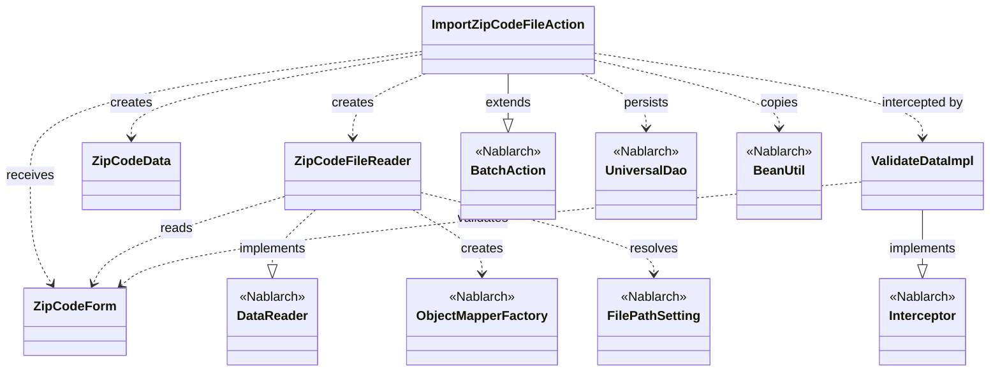
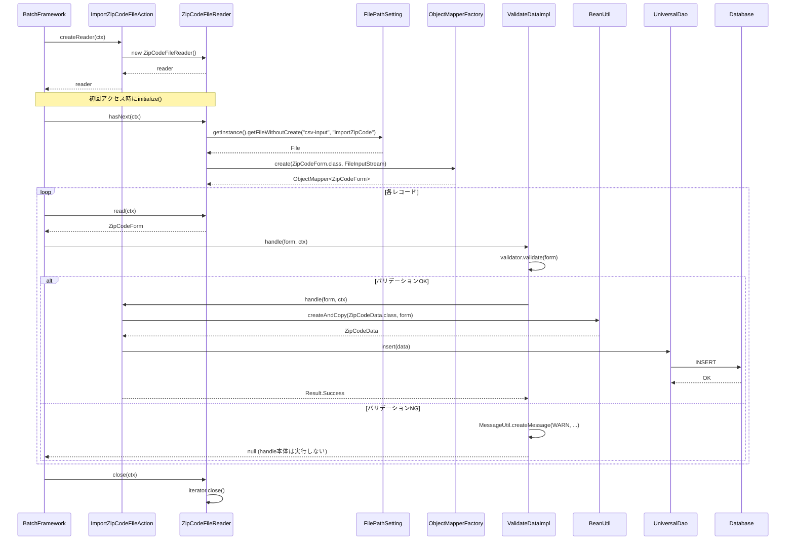

# Code Analysis: ImportZipCodeFileAction

**Generated**: 2026-04-24 08:06:34
**Target**: 住所ファイルをDBに登録するバッチアクション
**Modules**: nablarch-example-batch
**Analysis Duration**: approx. 2m 59s

---

## Overview

`ImportZipCodeFileAction` は、CSV形式の住所 (郵便番号) ファイルを1行ずつ読み込み、Bean Validation による入力チェックを経て、データベースへ登録する Nablarch のバッチアクションクラスである。`BatchAction<ZipCodeForm>` を継承し、データリーダとして `ZipCodeFileReader` を生成、各レコードを `@ValidateData` インターセプタで検証した上で、`BeanUtil` による値コピーと `UniversalDao.insert` による登録を行う File to DB 型のバッチ処理である。

---

## Architecture

### Dependency Graph



### Component Summary

| Component | Role | Type | Dependencies |
|-----------|------|------|--------------|
| ImportZipCodeFileAction | 住所ファイル1行をDB登録するバッチ処理 | Action | ZipCodeForm, ZipCodeData, ZipCodeFileReader, UniversalDao, BeanUtil |
| ZipCodeForm | CSV 1行をバインド・バリデーションするフォーム | Form | (アノテーションのみ) |
| ZipCodeFileReader | CSVファイルを1行ずつ読むデータリーダ | Reader | ObjectMapperFactory, FilePathSetting, ZipCodeForm |
| ValidateData | ハンドラ実行前に Bean Validation を行うインターセプタ | Interceptor | Validator (Jakarta), BeanUtil |
| ZipCodeData | DB登録用のEntity | Entity | なし |

---

## Flow

### Processing Flow

バッチ起動時、Nablarch のバッチフレームワークが `createReader(ctx)` を呼び出して `ZipCodeFileReader` を生成する。`ZipCodeFileReader` は初回アクセス時に `FilePathSetting.getInstance().getFileWithoutCreate("csv-input", "importZipCode")` でベースパスからCSVファイルを解決し、`ObjectMapperFactory.create(ZipCodeForm.class, ...)` で `@Csv`/`@CsvFormat` アノテーションに従った CSV → Bean バインダ (ObjectMapper) を生成、イテレータ経由で1行ずつ `ZipCodeForm` を返す。

各レコードごとにフレームワークは `handle(inputData, ctx)` を呼び出す。`handle` には `@ValidateData` アノテーションが付与されているため、実行前に `ValidateData.ValidateDataImpl` がインターセプトし、`ValidatorUtil.getValidator().validate(data)` で `@Required`/`@Domain` 制約を検査する。違反がある場合は `MessageUtil.createMessage(WARN, "invalid_data_record", ...)` でエラー内容とエラー行の行番号 (`@LineNumber` プロパティ `lineNumber`) を WARN ログに出力し、`null` を返して後続の `handle` 本体は実行しない。違反がなければ元のハンドラへ委譲する。

本体の `handle` では `BeanUtil.createAndCopy(ZipCodeData.class, inputData)` で `ZipCodeForm` → `ZipCodeData` へプロパティをコピーし、`UniversalDao.insert(data)` で DB に登録、`new Result.Success()` を返す。

### Sequence Diagram



---

## Components

### ImportZipCodeFileAction

- **ファイル**: [ImportZipCodeFileAction.java](../../.lw/nab-official/v6/nablarch-example-batch/src/main/java/com/nablarch/example/app/batch/action/ImportZipCodeFileAction.java)
- **役割**: 1行分の住所データをDBへ登録するバッチアクション。`BatchAction<ZipCodeForm>` を継承。
- **主要メソッド**:
  - `handle(ZipCodeForm inputData, ExecutionContext ctx)` (L34-41): `@ValidateData` インターセプタが付与された処理本体。`BeanUtil.createAndCopy` で `ZipCodeData` を生成し `UniversalDao.insert` で登録、`Result.Success` を返す。
  - `createReader(ExecutionContext ctx)` (L49-51): `ZipCodeFileReader` を新規生成して返す。
- **依存**: `ZipCodeForm`, `ZipCodeData`, `ZipCodeFileReader`, `@ValidateData`, `UniversalDao`, `BeanUtil`, `BatchAction`, `ExecutionContext`, `Result`。

### ZipCodeForm

- **ファイル**: [ZipCodeForm.java](../../.lw/nab-official/v6/nablarch-example-batch/src/main/java/com/nablarch/example/app/batch/form/ZipCodeForm.java)
- **役割**: CSV 1 行をバインドしバリデーションするフォーム。`@Csv(properties={...}, type=CUSTOM)`, `@CsvFormat(charset="UTF-8", fieldSeparator=',', lineSeparator="\r\n", quote='"', quoteMode=NORMAL, requiredHeader=false, emptyToNull=true)` でフォーマットを定義。
- **主要点**:
  - 各プロパティに `@Required` と `@Domain("...")` (例: `zipCode`, `prefecture`, `city`, `address`, `flag`, `code` 等) を付与し、プロジェクト共通のドメイン定義で検証。
  - `@LineNumber` 付き `getLineNumber()` によりバリデーションエラー時の行番号を ValidateData 側で参照できる。

### ZipCodeFileReader

- **ファイル**: [ZipCodeFileReader.java](../../.lw/nab-official/v6/nablarch-example-batch/src/main/java/com/nablarch/example/app/batch/reader/ZipCodeFileReader.java)
- **役割**: `DataReader<ZipCodeForm>` 実装。`ObjectMapperIterator` を介して CSV を 1 行ずつ `ZipCodeForm` として返す。
- **主要メソッド**:
  - `read(ctx)`, `hasNext(ctx)`: 初回呼び出し時に `initialize()` を実行し、以降はイテレータを通じて行を返却・終端判定。
  - `close(ctx)`: `iterator.close()` を呼び出して解放。
  - `initialize()`: `FilePathSetting.getInstance().getFileWithoutCreate("csv-input", FILE_NAME)` で入力ファイルを解決し、`ObjectMapperFactory.create(ZipCodeForm.class, new FileInputStream(file))` で ObjectMapper を生成、`ObjectMapperIterator` にラップ。`FileNotFoundException` は `IllegalStateException` で包んで再送出。

### ValidateData (Interceptor)

- **ファイル**: [ValidateData.java](../../.lw/nab-official/v6/nablarch-example-batch/src/main/java/com/nablarch/example/app/batch/interceptor/ValidateData.java)
- **役割**: ハンドラ呼び出しをインターセプトし、引数データを Bean Validation で検証。
- **主要点**:
  - `@Interceptor(ValidateData.ValidateDataImpl.class)` で実装クラスを指定する Nablarch の `Interceptor` 機構。
  - `ValidatorUtil.getValidator().validate(data)` で Jakarta Validation を実行。
  - 違反があれば `BeanUtil.getProperty(data, "lineNumber")` で行番号を取得し、`MessageUtil.createMessage(MessageLevel.WARN, "invalid_data_record", path, message, lineNumber)` で WARN ログを出力し、本体処理はスキップして `null` を返す。

---

## Nablarch Framework Usage

### BatchAction

**クラス**: `nablarch.fw.action.BatchAction`

**説明**: Nablarch のバッチ処理の基本骨格を提供する抽象クラス。`createReader` で DataReader を返し、`handle` で 1 レコードずつの処理を記述する。

**使用方法**:
```java
public class ImportZipCodeFileAction extends BatchAction<ZipCodeForm> {
    @Override
    @ValidateData
    public Result handle(ZipCodeForm inputData, ExecutionContext ctx) { ... }

    @Override
    public DataReader<ZipCodeForm> createReader(ExecutionContext ctx) { ... }
}
```

**重要ポイント**:
- ✅ **`createReader` で DataReader を返す**: 入力データの供給責務を DataReader に分離する。
- 🎯 **File to DB / DB to File パターンに利用**: レコード毎の処理を `handle` に集約する。
- 💡 **1 レコード処理に集中**: トランザクション境界やループ制御はフレームワークが担当する。

**このコードでの使い方**:
- `handle` でバリデーション済みフォームを Entity へ変換して `UniversalDao.insert`。
- `createReader` で `ZipCodeFileReader` を生成。

**詳細**: [Nablarchバッチ知識ベース](../../.claude/skills/nabledge-6/docs/component/libraries/libraries-universal-dao.md)

### UniversalDao

**クラス**: `nablarch.common.dao.UniversalDao`

**説明**: Entity の CRUD を提供する Nablarch 標準の DAO。`insert`, `update`, `delete`, `findById`, `findAllBySqlFile` 等の静的メソッドで DB アクセスできる。

**使用方法**:
```java
ZipCodeData data = BeanUtil.createAndCopy(ZipCodeData.class, inputData);
UniversalDao.insert(data);
```

**重要ポイント**:
- ✅ **Entity を渡すだけで INSERT**: `@Entity`/`@Table` 等のアノテーションに基づいて SQL が発行される。
- ⚠️ **トランザクション境界はフレームワーク管理**: バッチではレコード単位のトランザクションがフレームワーク側で張られる。
- 💡 **静的メソッド API**: DI 不要で呼び出せる。

**このコードでの使い方**:
- `handle` 内で `UniversalDao.insert(data)` により 1 レコードずつ DB 登録。

**詳細**: [Universal DAO 知識ベース](../../.claude/skills/nabledge-6/docs/component/libraries/libraries-universal-dao.md)

### BeanUtil

**クラス**: `nablarch.core.beans.BeanUtil`

**説明**: Bean 間のプロパティコピーや値取得を提供するユーティリティ。`createAndCopy` でソース Bean から新しい Bean を生成しながら同名プロパティをコピーできる。

**使用方法**:
```java
ZipCodeData data = BeanUtil.createAndCopy(ZipCodeData.class, inputData);
Long lineNumber = (Long) BeanUtil.getProperty(data, "lineNumber");
```

**重要ポイント**:
- ✅ **同名プロパティの自動コピー**: Form → Entity の変換ボイラープレートを削減。
- ⚠️ **`BeansException` の扱い**: プロパティが存在しない場合に発生するため、条件付きアクセスでは catch して無視する必要がある (ValidateData の lineNumber 取得例)。
- 💡 **リフレクションベース**: getter/setter を前提に動作する。

**このコードでの使い方**:
- `handle` で `BeanUtil.createAndCopy(ZipCodeData.class, inputData)` により `ZipCodeForm` → `ZipCodeData` へ変換。
- インターセプタ `ValidateDataImpl` で `BeanUtil.getProperty(data, "lineNumber")` によりエラー行を取得。

**詳細**: [BeanUtil 知識ベース](../../.claude/skills/nabledge-6/docs/component/libraries/libraries-bean-util.md)

### ObjectMapperFactory / @Csv / @CsvFormat (Data Bind)

**クラス**: `nablarch.common.databind.ObjectMapperFactory`, `nablarch.common.databind.csv.Csv`, `nablarch.common.databind.csv.CsvFormat`

**説明**: CSV/TSV/固定長データを Java Bean とマッピングする機能。`@Csv` と `@CsvFormat` でフォーマットを宣言し、`ObjectMapperFactory.create(BeanClass, InputStream)` で ObjectMapper を生成する。

**使用方法**:
```java
@Csv(properties = { "localGovernmentCode", ... }, type = CsvType.CUSTOM)
@CsvFormat(charset = "UTF-8", fieldSeparator = ',',
           ignoreEmptyLine = true, lineSeparator = "\r\n",
           quote = '"', quoteMode = QuoteMode.NORMAL,
           requiredHeader = false, emptyToNull = true)
public class ZipCodeForm { ... }

ObjectMapper<ZipCodeForm> mapper =
    ObjectMapperFactory.create(ZipCodeForm.class, new FileInputStream(file));
```

**重要ポイント**:
- ✅ **アノテーション駆動**: `@Csv.properties` で列順、`@CsvFormat` で区切り・改行・クォート等を宣言的に定義。
- ⚠️ **必ず `close()` を呼ぶ**: ストリームのリソース解放が必要 (本例では `ObjectMapperIterator#close` 経由)。
- ⚡ **ストリーム処理**: 大量データでもメモリに全件保持しないため安全。
- 💡 **`@LineNumber`**: エラー時にバリデーションで行番号を参照可能にする。

**このコードでの使い方**:
- `ZipCodeForm` に `@Csv` / `@CsvFormat` / `@LineNumber` を付与。
- `ZipCodeFileReader.initialize()` で `ObjectMapperFactory.create(ZipCodeForm.class, ...)` を実行し、`ObjectMapperIterator` にラップして読み出す。

**詳細**: [データバインド知識ベース](../../.claude/skills/nabledge-6/docs/component/libraries/libraries-data-bind.md)

### FilePathSetting

**クラス**: `nablarch.core.util.FilePathSetting`

**説明**: ベースパス (論理名) とファイル名から実ファイルパスを解決する設定。コンポーネント定義で `csv-input` 等の論理名にディレクトリを割り当て、コードでは `getFileWithoutCreate(baseName, fileName)` で取得する。

**使用方法**:
```java
File file = FilePathSetting.getInstance()
                           .getFileWithoutCreate("csv-input", "importZipCode");
```

**重要ポイント**:
- ✅ **環境差異を設定に隔離**: パスを外部化することで環境ごとに差し替え可能。
- 🎯 **ベースパス名**: `csv-input` などの論理名はコンポーネント定義で定義する必要がある。
- ⚠️ **`getFileWithoutCreate` はファイル存在を検証しない**: 実際のオープン時に `FileNotFoundException` が発生しうるため呼び出し側で対処 (本例では `IllegalStateException` に包む)。

**このコードでの使い方**:
- `ZipCodeFileReader.initialize()` でベースパス `csv-input` からファイル `importZipCode` を解決。

**詳細**: [ファイルパス管理知識ベース](../../.claude/skills/nabledge-6/docs/component/libraries/libraries-file-path-management.md)

### Interceptor (@ValidateData)

**クラス**: `nablarch.fw.Interceptor`, `nablarch.core.validation.ee.ValidatorUtil`

**説明**: ハンドラ実行前後に割り込み処理を差し込む Nablarch の共通機構。`@Interceptor(Impl.class)` を付与したアノテーションを定義し、`Interceptor.Impl` を継承した実装で `handle` をオーバーライドする。

**使用方法**:
```java
@Target(ElementType.METHOD)
@Retention(RetentionPolicy.RUNTIME)
@Interceptor(ValidateData.ValidateDataImpl.class)
public @interface ValidateData {
    class ValidateDataImpl extends Interceptor.Impl<Object, Result, ValidateData> {
        @Override
        public Result handle(Object data, ExecutionContext context) {
            Validator validator = ValidatorUtil.getValidator();
            Set<ConstraintViolation<Object>> v = validator.validate(data);
            if (v.isEmpty()) return getOriginalHandler().handle(data, context);
            // WARN ログ出力して null を返す (本体処理はスキップ)
        }
    }
}
```

**重要ポイント**:
- ✅ **メソッドに付与するアノテーション**: `@Target(METHOD)` 必須。
- ⚠️ **違反時に `null` を返すか例外を投げるかは実装者の選択**: 本例では 1 行ずつログに残し後続処理を継続するため `null` を返している。
- 💡 **共通処理の再利用**: バリデーション等の横断的関心事をアノテーション 1 つで有効化できる。
- 🎯 **`@LineNumber` 連携**: `BeanUtil.getProperty(data, "lineNumber")` により行番号付きの WARN ログを出力できる。

**このコードでの使い方**:
- `handle(ZipCodeForm, ExecutionContext)` に `@ValidateData` を付与し、実行前に Bean Validation を実施。違反時は `MessageLevel.WARN` で `invalid_data_record` メッセージを出力し本体をスキップ。

**詳細**: [Bean Validation 知識ベース](../../.claude/skills/nabledge-6/docs/component/libraries/libraries-bean-validation.md)

---

## References

### Source Files

- [ImportZipCodeFileAction.java (.lw/nab-official/v5/nablarch-example-batch/src/main/java/com/nablarch/example/app/batch/action)](../../.lw/nab-official/v5/nablarch-example-batch/src/main/java/com/nablarch/example/app/batch/action/ImportZipCodeFileAction.java) - ImportZipCodeFileAction
- [ImportZipCodeFileAction.java (.lw/nab-official/v6/nablarch-example-batch/src/main/java/com/nablarch/example/app/batch/action)](../../.lw/nab-official/v6/nablarch-example-batch/src/main/java/com/nablarch/example/app/batch/action/ImportZipCodeFileAction.java) - ImportZipCodeFileAction
- [ZipCodeForm.java (.lw/nab-official/v5/nablarch-example-batch/src/main/java/com/nablarch/example/app/batch/form)](../../.lw/nab-official/v5/nablarch-example-batch/src/main/java/com/nablarch/example/app/batch/form/ZipCodeForm.java) - ZipCodeForm
- [ZipCodeForm.java (.lw/nab-official/v6/nablarch-example-batch/src/main/java/com/nablarch/example/app/batch/form)](../../.lw/nab-official/v6/nablarch-example-batch/src/main/java/com/nablarch/example/app/batch/form/ZipCodeForm.java) - ZipCodeForm
- [ZipCodeFileReader.java (.lw/nab-official/v5/nablarch-example-batch/src/main/java/com/nablarch/example/app/batch/reader)](../../.lw/nab-official/v5/nablarch-example-batch/src/main/java/com/nablarch/example/app/batch/reader/ZipCodeFileReader.java) - ZipCodeFileReader
- [ZipCodeFileReader.java (.lw/nab-official/v6/nablarch-example-batch/src/main/java/com/nablarch/example/app/batch/reader)](../../.lw/nab-official/v6/nablarch-example-batch/src/main/java/com/nablarch/example/app/batch/reader/ZipCodeFileReader.java) - ZipCodeFileReader
- [ValidateData.java (.lw/nab-official/v5/nablarch-example-batch/src/main/java/com/nablarch/example/app/batch/interceptor)](../../.lw/nab-official/v5/nablarch-example-batch/src/main/java/com/nablarch/example/app/batch/interceptor/ValidateData.java) - ValidateData
- [ValidateData.java (.lw/nab-official/v6/nablarch-example-batch/src/main/java/com/nablarch/example/app/batch/interceptor)](../../.lw/nab-official/v6/nablarch-example-batch/src/main/java/com/nablarch/example/app/batch/interceptor/ValidateData.java) - ValidateData

### Knowledge Base (Nabledge-6)

- [Libraries Universal Dao](../../.claude/skills/nabledge-6/docs/component/libraries/libraries-universal-dao.md)
- [Libraries Data Bind](../../.claude/skills/nabledge-6/docs/component/libraries/libraries-data-bind.md)
- [Libraries Bean Util](../../.claude/skills/nabledge-6/docs/component/libraries/libraries-bean-util.md)
- [Libraries File Path Management](../../.claude/skills/nabledge-6/docs/component/libraries/libraries-file-path-management.md)
- [Libraries Bean Validation](../../.claude/skills/nabledge-6/docs/component/libraries/libraries-bean-validation.md)

### Official Documentation

(No official documentation links available)

---

**Output**: `.nabledge/20260424/code-analysis-ImportZipCodeFileAction.md`

**Note**: This documentation was generated by the code-analysis workflow of the nabledge-6 skill.
