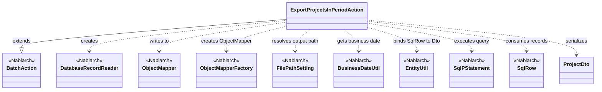

# Code Analysis: ExportProjectsInPeriodAction

**Generated**: 2026-04-24 08:11:44
**Target**: 期間内プロジェクト一覧出力の都度起動バッチアクション（CSV出力）
**Modules**: proman-batch
**Analysis Duration**: approx. 2m 54s

---

## Overview

`ExportProjectsInPeriodAction` は、業務日付時点で有効な期間内プロジェクトをデータベースから検索し、その一覧を CSV ファイルとして出力する都度起動型のバッチアクションである。Nablarch の `BatchAction<SqlRow>` を継承し、`createReader()` で `DatabaseRecordReader` を生成して SQL 検索結果をレコード単位で処理する。各レコードは `ProjectDto` に変換され、`ObjectMapper` 経由で CSV ファイル (`N21AA002`) に書き出される。ファイル出力先は `FilePathSetting` の論理名 `csv_output` で解決し、基準日は `BusinessDateUtil` で取得する。

---

## Architecture

### Dependency Graph



**Note**: This diagram uses Mermaid `classDiagram` syntax to show class names and their relationships. Use `--|>` for inheritance (extends/implements) and `..>` for dependencies (uses/creates).

### Component Summary

| Component | Role | Type | Dependencies |
|-----------|------|------|--------------|
| ExportProjectsInPeriodAction | 期間内プロジェクト一覧 CSV 出力バッチアクション | Action (BatchAction) | DatabaseRecordReader, ObjectMapper, FilePathSetting, BusinessDateUtil, EntityUtil, ProjectDto |
| ProjectDto | CSV 出力用 Bean（`@Csv`/`@CsvFormat` でフォーマット定義） | DTO (Bean) | なし |
| FIND_PROJECT_IN_PERIOD | 期間内プロジェクト検索 SQL（SQL ファイル定義） | SQL | なし |

---

## Flow

### Processing Flow

本バッチは Nablarch バッチフレームワークの都度起動モデルに従い、`-requestPath=com.nablarch.example.proman.batch.project.ExportProjectsInPeriodAction/<リクエストID>` で起動される。フレームワークは次の順序で `BatchAction` のメソッドを呼び出す。

1. `initialize(CommandLine, ExecutionContext)` (Line 44-54): `FilePathSetting` から論理名 `csv_output` と出力ファイル名 `N21AA002` を組み合わせて `File` を取得し、`FileOutputStream` を開いて `ObjectMapperFactory.create(ProjectDto.class, outputStream)` で `ObjectMapper<ProjectDto>` を生成する。`FileNotFoundException` は `IllegalStateException` にラップして再送出する。
2. `createReader(ExecutionContext)` (Line 57-65): `DatabaseRecordReader` を生成し、`getSqlPStatement("FIND_PROJECT_IN_PERIOD")` で SQL ステートメントを取得。`BusinessDateUtil.getDate()` で業務日付を取得し `DateUtil.getDate()` 経由で `java.sql.Date` に変換、パラメータ 1・2 に設定して `reader.setStatement(statement)` で登録する。
3. `handle(SqlRow, ExecutionContext)` (Line 68-75): フレームワークが `DataReader` から読み出した 1 レコードを受け取り、`EntityUtil.createEntity(ProjectDto.class, record)` で `SqlRow` を `ProjectDto` にバインドする。`projectStartDate` と `projectEndDate` は DB 側 (`java.sql.Date`) と DTO 側 (`String` へフォーマットするセッタ) の型が異なり `EntityUtil` で自動設定できないため、`record.getDate(...)` で取り出し明示的に `setProjectStartDate`/`setProjectEndDate` を呼ぶ。その後 `mapper.write(dto)` で CSV に 1 行書き出し、`new Success()` を返却して正常終了を通知する。
4. `terminate(Result, ExecutionContext)` (Line 78-81): `mapper.close()` を呼び、CSV バッファをフラッシュしつつファイルハンドルを解放する。

### Sequence Diagram

```mermaid
sequenceDiagram
    participant Framework as BatchFramework
    participant Action as ExportProjectsInPeriodAction
    participant FPS as FilePathSetting
    participant OMF as ObjectMapperFactory
    participant Mapper as ObjectMapper
    participant Reader as DatabaseRecordReader
    participant BDU as BusinessDateUtil
    participant Stmt as SqlPStatement
    participant EU as EntityUtil

    Framework->>Action: initialize(command, context)
    Action->>FPS: getInstance().getFile("csv_output", "N21AA002")
    FPS-->>Action: File
    Action->>OMF: create(ProjectDto.class, outputStream)
    OMF-->>Action: ObjectMapper<ProjectDto>
    Note over Action: mapper field is initialized

    Framework->>Action: createReader(context)
    Action->>Action: getSqlPStatement("FIND_PROJECT_IN_PERIOD")
    Action->>BDU: getDate()
    BDU-->>Action: business date
    Action->>Stmt: setDate(1, bizDate); setDate(2, bizDate)
    Action->>Reader: setStatement(statement)
    Action-->>Framework: DatabaseRecordReader

    loop Each SqlRow from reader
        Framework->>Action: handle(record, context)
        Action->>EU: createEntity(ProjectDto.class, record)
        EU-->>Action: ProjectDto
        Action->>Action: setProjectStartDate / setProjectEndDate (型変換)
        Action->>Mapper: write(dto)
        Action-->>Framework: new Success()
    end

    Framework->>Action: terminate(result, context)
    Action->>Mapper: close()
```

---

## Components

### ExportProjectsInPeriodAction

- **File**: [ExportProjectsInPeriodAction.java](../../.lw/nab-official/v6/nablarch-system-development-guide/Sample_Project/Source_Code/proman-project/proman-batch/src/main/java/com/nablarch/example/proman/batch/project/ExportProjectsInPeriodAction.java)
- **Role**: 期間内プロジェクトを DB から検索し、CSV ファイル (`N21AA002`) に一覧出力する `BatchAction<SqlRow>` の実装。
- **Key methods**:
  - `initialize(CommandLine, ExecutionContext)` (Line 44-54): 出力ファイルを解決し `ObjectMapper<ProjectDto>` を生成。
  - `createReader(ExecutionContext)` (Line 57-65): `FIND_PROJECT_IN_PERIOD` を使って `DatabaseRecordReader` を組み立てる。
  - `handle(SqlRow, ExecutionContext)` (Line 68-75): `SqlRow` → `ProjectDto` 変換と CSV 1 行書き出し。
  - `terminate(Result, ExecutionContext)` (Line 78-81): `ObjectMapper#close()` でリソース解放。
- **Dependencies**: `BatchAction`, `DatabaseRecordReader`, `ObjectMapper`, `ObjectMapperFactory`, `FilePathSetting`, `BusinessDateUtil`, `DateUtil`, `EntityUtil`, `SqlPStatement`, `SqlRow`, `ProjectDto`。
- **Key implementation points**:
  - 型パラメータは `SqlRow` — DB クエリの行をそのまま `handle()` に流し込む DB→FILE パターン。
  - `projectStartDate`/`projectEndDate` は DTO 側セッタが `java.util.Date` を受けて文字列化するため、`EntityUtil` では自動バインドできず手動呼び出しが必要。
  - 出力ファイル名は定数 `OUTPUT_FILE_NAME = "N21AA002"` で固定。

### ProjectDto

- **File**: [ProjectDto.java](../../.lw/nab-official/v6/nablarch-system-development-guide/Sample_Project/Source_Code/proman-project/proman-batch/src/main/java/com/nablarch/example/proman/batch/project/ProjectDto.java)
- **Role**: CSV 出力の 1 行を表す Java Bean。`@Csv` / `@CsvFormat` によって CSV カラム順・区切り文字・クォート方式・文字コードを宣言的に定義。
- **Key methods**:
  - `setProjectStartDate(Date)` (Line 137-139): `DateUtil.formatDate(date, "yyyy/MM/dd")` で文字列化して保持。
  - `setProjectEndDate(Date)` (Line 153-155): 同上。
  - 他のフィールドは単純な getter/setter。
- **Dependencies**: `nablarch.common.databind.csv.Csv`, `CsvFormat`, `CsvDataBindConfig`, `DateUtil`。
- **Key implementation points**:
  - `@Csv(type = CsvType.CUSTOM, properties = {...}, headers = {...})` と `@CsvFormat(..., quoteMode = QuoteMode.ALL, charset = "UTF-8")` により全項目を `"` でクォートする UTF-8 CSV を出力。
  - プロパティ順 (`properties`) と ヘッダ (`headers`) は CSV カラム順と完全に一致している必要がある。

---

## Nablarch Framework Usage

### BatchAction

**Class**: `nablarch.fw.action.BatchAction<T>`

**Description**: Nablarch が標準で提供する汎用バッチのテンプレートクラス。`initialize` → `createReader` → `handle` × N → `terminate` のライフサイクルを持つ。

**Usage**:
```java
public class ExportProjectsInPeriodAction extends BatchAction<SqlRow> {
    @Override protected void initialize(CommandLine cmd, ExecutionContext ctx) { /* ... */ }
    @Override public DataReader<SqlRow> createReader(ExecutionContext ctx) { /* ... */ }
    @Override public Result handle(SqlRow record, ExecutionContext ctx) { /* ... */ }
    @Override protected void terminate(Result result, ExecutionContext ctx) { /* ... */ }
}
```

**Important points**:
- ✅ **`-requestPath=クラス名/リクエストID` で起動**: Nablarch バッチはコマンドライン引数でアクションとリクエスト ID を指定する。
- 🎯 **DB をキュー/入力として使う場合は型パラメータに `SqlRow` を指定**: 検索結果行を `handle()` で逐次処理するパターンに適合する。
- 💡 **ライフサイクル分離**: リソース確保は `initialize`、解放は `terminate` に寄せることでリークを防げる。

**Usage in this code**:
- `ExportProjectsInPeriodAction` は `BatchAction<SqlRow>` を継承し、`initialize()` で `ObjectMapper` を確保、`createReader()` で `DatabaseRecordReader` を供給、`handle()` で 1 行書き出し、`terminate()` で `mapper.close()` を実行する。

**Details**: [Nablarch Batch Architecture](../../.claude/skills/nabledge-6/docs/processing-pattern/nablarch-batch/nablarch-batch-architecture.md)

### DatabaseRecordReader

**Class**: `nablarch.fw.reader.DatabaseRecordReader`

**Description**: SQL の検索結果を 1 行ずつ `SqlRow` として `BatchAction` に供給する標準データリーダ。

**Usage**:
```java
DatabaseRecordReader reader = new DatabaseRecordReader();
SqlPStatement statement = getSqlPStatement("FIND_PROJECT_IN_PERIOD");
statement.setDate(1, bizDate);
statement.setDate(2, bizDate);
reader.setStatement(statement);
return reader;
```

**Important points**:
- ✅ **`setStatement()` に渡す `SqlPStatement` はパラメータ設定済みにしておく**: `createReader()` の中で `setDate` など必要なバインドを済ませる。
- 🎯 **DB → FILE / DB → 他処理パターンで使用**: 検索結果をレコード単位で逐次処理したいバッチに適合。
- 💡 **標準提供のリーダで要件を満たせない場合のみ `DataReader` 自作**: まずは標準リーダを検討する。

**Usage in this code**:
- `createReader()` で `FIND_PROJECT_IN_PERIOD` 用 `SqlPStatement` を取得、業務日付を 2 個のパラメータに設定し、`DatabaseRecordReader` に登録している。

**Details**: [Nablarch Batch Architecture](../../.claude/skills/nabledge-6/docs/processing-pattern/nablarch-batch/nablarch-batch-architecture.md)

### ObjectMapper (データバインド)

**Class**: `nablarch.common.databind.ObjectMapper` / `nablarch.common.databind.ObjectMapperFactory`

**Description**: Java Beans ↔ CSV / 固定長 / TSV の読み書きを、クラスに付与した `@Csv`・`@CsvFormat` などのアノテーション駆動で行う。

**Usage**:
```java
try (ObjectMapper<ProjectDto> mapper = ObjectMapperFactory.create(ProjectDto.class, outputStream)) {
    mapper.write(dto);
}
```

**Important points**:
- ✅ **必ず `close()` を呼ぶ**: バッファフラッシュとストリーム解放のため。本コードでは `terminate()` で実施。
- 💡 **アノテーション駆動**: `ProjectDto` の `@Csv(type = CUSTOM, ...)` と `@CsvFormat(charset = "UTF-8", quoteMode = ALL, ...)` で書式を宣言するだけで良く、書き出し側のコードはシンプルになる。
- ⚠️ **`null` は未入力を表す値として出力される**: CSV の場合は空文字。

**Usage in this code**:
- `initialize()` で `ObjectMapperFactory.create(ProjectDto.class, outputStream)` を呼び `mapper` フィールドを初期化。
- `handle()` で 1 レコードごとに `mapper.write(dto)`。
- `terminate()` で `mapper.close()`。

**Details**: [Libraries Data Bind](../../.claude/skills/nabledge-6/docs/component/libraries/libraries-data-bind.md)

### FilePathSetting

**Class**: `nablarch.core.util.FilePathSetting`

**Description**: 論理名 (例: `csv_output`) とベースディレクトリ・拡張子の対応をコンポーネント設定で管理し、ファイル実体のパス解決を行うユーティリティ。

**Usage**:
```java
FilePathSetting filePathSetting = FilePathSetting.getInstance();
File output = filePathSetting.getFile("csv_output", "N21AA002");
```

**Important points**:
- ✅ **コンポーネント名は `filePathSetting`**: `basePathSettings` に論理名→ディレクトリ、`fileExtensions` に拡張子を設定する。
- 🎯 **環境ごとに異なる出力先を設定で切り替えたい時に使う**: コード側は論理名のみで書ける。
- ⚠️ **パスにスペースは含められない／`classpath` スキームは WildFly などでは利用不可**: 通常は `file:` スキームを推奨。

**Usage in this code**:
- `initialize()` で `FilePathSetting.getInstance().getFile("csv_output", OUTPUT_FILE_NAME)` を呼び、論理名 `csv_output` が指すディレクトリに `N21AA002` (+ 拡張子 `csv`) を組み立てたファイルを取得している。

**Details**: [Libraries File Path Management](../../.claude/skills/nabledge-6/docs/component/libraries/libraries-file-path-management.md)

### BusinessDateUtil

**Class**: `nablarch.core.date.BusinessDateUtil`

**Description**: システムの業務日付 (ビジネスカレンダー上の「今日」) を取得するユーティリティ。

**Usage**:
```java
String businessDate = BusinessDateUtil.getDate();
```

**Important points**:
- ✅ **業務日付は必ず `BusinessDateUtil` 経由で取得**: `new java.util.Date()` やシステム時刻を直接使わない。祝休日スキップ・日替わりタイミング制御が効かなくなるため。
- 💡 **バッチ再実行時も同じ業務日付を使える**: 締め処理などの再実行整合性を担保できる。

**Usage in this code**:
- `createReader()` で `BusinessDateUtil.getDate()` の戻り (`yyyyMMdd` 文字列) を `DateUtil.getDate()` で `java.util.Date` に変換し、さらに `java.sql.Date` にラップして SQL のパラメータ 1・2 に設定している（検索 SQL が「業務日付時点で有効なプロジェクト」を抽出することを意図）。

**Details**: [Libraries Date](../../.claude/skills/nabledge-6/docs/component/libraries/libraries-date.md)

### EntityUtil / SqlPStatement / SqlRow

**Class**: `nablarch.common.dao.EntityUtil`, `nablarch.core.db.statement.SqlPStatement`, `nablarch.core.db.statement.SqlRow`

**Description**: `SqlRow` は SQL 結果 1 行の汎用表現、`SqlPStatement` は SQL 実行用パラメタライズドステートメント、`EntityUtil.createEntity` は `SqlRow` の列を同名プロパティに自動バインドして Bean を生成するヘルパー。

**Usage**:
```java
ProjectDto dto = EntityUtil.createEntity(ProjectDto.class, record);
// 型が違う項目だけ手動設定
dto.setProjectStartDate(record.getDate("PROJECT_START_DATE"));
```

**Important points**:
- ⚠️ **DB 型と Bean プロパティ型が異なる列は `EntityUtil` では設定されない**: 本コードのように明示的な setter 呼び出しで補完が必要。
- 💡 **`getSqlPStatement("<SQL ID>")` で SQL ファイル定義の SQL を参照**: SQL 本体をコードに書かず、外部ファイル (SQL ID = `FIND_PROJECT_IN_PERIOD`) で管理できる。
- 🎯 **DB → DTO → CSV のパイプライン**: `SqlRow` をハブに、`EntityUtil` で詰め替え → `ObjectMapper` で出力という組み合わせが本アクションの骨格。

**Usage in this code**:
- `createReader()` で `getSqlPStatement("FIND_PROJECT_IN_PERIOD")` を取得し `setDate` でパラメータをバインド。
- `handle()` で `EntityUtil.createEntity(ProjectDto.class, record)` による自動バインド後、日付 2 項目のみ明示的に setter を呼んで型変換を通す。

**Details**: [Libraries Database](../../.claude/skills/nabledge-6/docs/component/libraries/libraries-database.md)

---

## References

### Source Files

- [ExportProjectsInPeriodAction.java (.lw/nab-official/v5/nablarch-system-development-guide/en/Sample_Project/Source_Code/proman-project/proman-batch/src/main/java/com/nablarch/example/proman/batch/project)](../../.lw/nab-official/v5/nablarch-system-development-guide/en/Sample_Project/Source_Code/proman-project/proman-batch/src/main/java/com/nablarch/example/proman/batch/project/ExportProjectsInPeriodAction.java) - ExportProjectsInPeriodAction
- [ExportProjectsInPeriodAction.java (.lw/nab-official/v5/nablarch-system-development-guide/Sample_Project/Source_Code/proman-project/proman-batch/src/main/java/com/nablarch/example/proman/batch/project)](../../.lw/nab-official/v5/nablarch-system-development-guide/Sample_Project/Source_Code/proman-project/proman-batch/src/main/java/com/nablarch/example/proman/batch/project/ExportProjectsInPeriodAction.java) - ExportProjectsInPeriodAction
- [ExportProjectsInPeriodAction.java (.lw/nab-official/v6/nablarch-system-development-guide/en/Sample_Project/Source_Code/proman-project/proman-batch/src/main/java/com/nablarch/example/proman/batch/project)](../../.lw/nab-official/v6/nablarch-system-development-guide/en/Sample_Project/Source_Code/proman-project/proman-batch/src/main/java/com/nablarch/example/proman/batch/project/ExportProjectsInPeriodAction.java) - ExportProjectsInPeriodAction
- [ExportProjectsInPeriodAction.java (.lw/nab-official/v6/nablarch-system-development-guide/Sample_Project/Source_Code/proman-project/proman-batch/src/main/java/com/nablarch/example/proman/batch/project)](../../.lw/nab-official/v6/nablarch-system-development-guide/Sample_Project/Source_Code/proman-project/proman-batch/src/main/java/com/nablarch/example/proman/batch/project/ExportProjectsInPeriodAction.java) - ExportProjectsInPeriodAction
- [ProjectDto.java (.lw/nab-official/v5/nablarch-system-development-guide/en/Sample_Project/Source_Code/proman-project/proman-batch/src/main/java/com/nablarch/example/proman/batch/project)](../../.lw/nab-official/v5/nablarch-system-development-guide/en/Sample_Project/Source_Code/proman-project/proman-batch/src/main/java/com/nablarch/example/proman/batch/project/ProjectDto.java) - ProjectDto
- [ProjectDto.java (.lw/nab-official/v5/nablarch-system-development-guide/Sample_Project/Source_Code/proman-project/proman-batch/src/main/java/com/nablarch/example/proman/batch/project)](../../.lw/nab-official/v5/nablarch-system-development-guide/Sample_Project/Source_Code/proman-project/proman-batch/src/main/java/com/nablarch/example/proman/batch/project/ProjectDto.java) - ProjectDto
- [ProjectDto.java (.lw/nab-official/v5/nablarch-example-web/src/main/java/com/nablarch/example/app/web/dto)](../../.lw/nab-official/v5/nablarch-example-web/src/main/java/com/nablarch/example/app/web/dto/ProjectDto.java) - ProjectDto
- [ProjectDto.java (.lw/nab-official/v6/nablarch-system-development-guide/en/Sample_Project/Source_Code/proman-project/proman-batch/src/main/java/com/nablarch/example/proman/batch/project)](../../.lw/nab-official/v6/nablarch-system-development-guide/en/Sample_Project/Source_Code/proman-project/proman-batch/src/main/java/com/nablarch/example/proman/batch/project/ProjectDto.java) - ProjectDto
- [ProjectDto.java (.lw/nab-official/v6/nablarch-system-development-guide/Sample_Project/Source_Code/proman-project/proman-batch/src/main/java/com/nablarch/example/proman/batch/project)](../../.lw/nab-official/v6/nablarch-system-development-guide/Sample_Project/Source_Code/proman-project/proman-batch/src/main/java/com/nablarch/example/proman/batch/project/ProjectDto.java) - ProjectDto
- [ProjectDto.java (.lw/nab-official/v6/nablarch-example-web/src/main/java/com/nablarch/example/app/web/dto)](../../.lw/nab-official/v6/nablarch-example-web/src/main/java/com/nablarch/example/app/web/dto/ProjectDto.java) - ProjectDto

### Knowledge Base (Nabledge-6)

- [Nablarch Batch Architecture](../../.claude/skills/nabledge-6/docs/processing-pattern/nablarch-batch/nablarch-batch-architecture.md)
- [Nablarch Batch Getting Started Nablarch Batch](../../.claude/skills/nabledge-6/docs/processing-pattern/nablarch-batch/nablarch-batch-getting-started-nablarch-batch.md)
- [Libraries Data Bind](../../.claude/skills/nabledge-6/docs/component/libraries/libraries-data-bind.md)
- [Libraries File Path Management](../../.claude/skills/nabledge-6/docs/component/libraries/libraries-file-path-management.md)
- [Libraries Date](../../.claude/skills/nabledge-6/docs/component/libraries/libraries-date.md)
- [Libraries Database](../../.claude/skills/nabledge-6/docs/component/libraries/libraries-database.md)

### Official Documentation

(No official documentation links available)

---

**Output**: `.nabledge/20260424/code-analysis-ExportProjectsInPeriodAction.md`

**Note**: This documentation was generated by the code-analysis workflow of the nabledge-6 skill.
