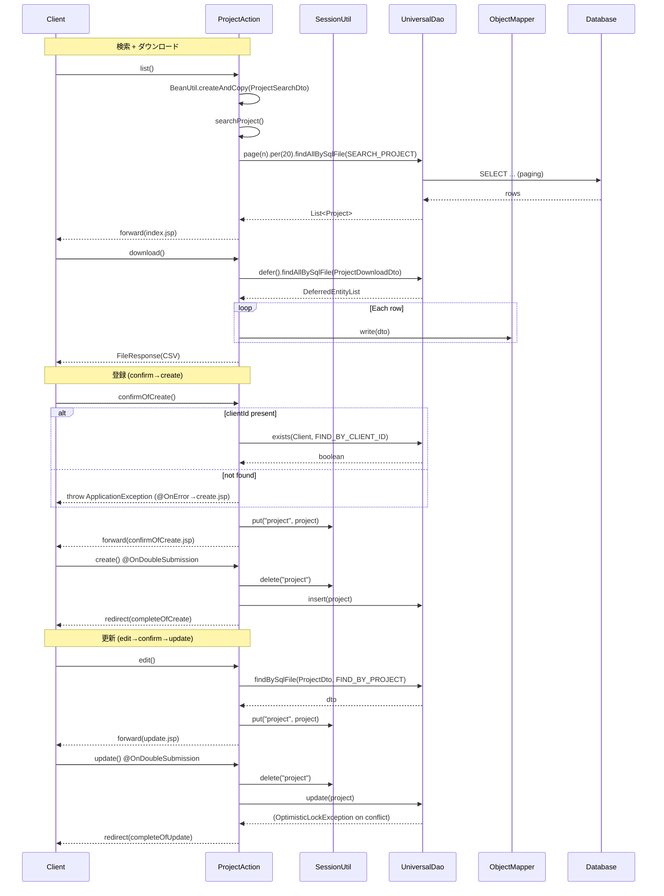

# Code Analysis: ProjectAction

**Generated**: 2026-04-24 10:33:01
**Target**: プロジェクトの検索・登録・更新・削除・CSVダウンロード機能を提供するWebアクション
**Modules**: nablarch-example-web
**Analysis Duration**: approx. 2m 13s

---

## Overview

`ProjectAction` は、プロジェクト情報を管理する CRUD + CSV ダウンロード機能を提供する Web 業務アクション。`UniversalDao` によるページング検索、`@InjectForm` / `@OnError` によるバリデーションとエラー遷移、`@OnDoubleSubmission` による二重サブミット防止、`ObjectMapper` + `FileResponse` による大量データの一時ファイル経由ダウンロードを組み合わせる。登録・更新では `SessionUtil` に編集中エンティティを保持し、確認→実行の2段階フローを構成する。

---

## Architecture

### Dependency Graph

```mermaid
classDiagram
    class ProjectAction
    class ProjectForm
    class ProjectSearchForm
    class ProjectUpdateForm
    class ProjectTargetForm
    class Project
    class Client
    class ProjectDto
    class ProjectDownloadDto
    class ProjectSearchDto
    class ProjectProfit
    class UniversalDao {
        <<Nablarch>>
    }
    class SessionUtil {
        <<Nablarch>>
    }
    class BeanUtil {
        <<Nablarch>>
    }
    class ObjectMapperFactory {
        <<Nablarch>>
    }
    class FileResponse {
        <<Nablarch>>
    }
    class ExecutionContext {
        <<Nablarch>>
    }
    class InjectForm {
        <<Nablarch>>
    }
    class OnError {
        <<Nablarch>>
    }
    class OnDoubleSubmission {
        <<Nablarch>>
    }
    class ApplicationException {
        <<Nablarch>>
    }

    ProjectSearchForm --|> SearchFormBase : extends
    ProjectForm ..|> Serializable : implements
    ProjectSearchForm ..|> Serializable : implements
    ProjectUpdateForm ..|> Serializable : implements
    ProjectTargetForm ..|> Serializable : implements

    ProjectAction ..> ProjectForm : validates
    ProjectAction ..> ProjectSearchForm : validates
    ProjectAction ..> ProjectUpdateForm : validates
    ProjectAction ..> ProjectTargetForm : validates
    ProjectAction ..> UniversalDao : queries / persists
    ProjectAction ..> SessionUtil : stores edit state
    ProjectAction ..> BeanUtil : copies form to entity
    ProjectAction ..> ObjectMapperFactory : creates CSV mapper
    ProjectAction ..> FileResponse : returns download
    ProjectAction ..> ExecutionContext : request scope
    ProjectAction ..> Project : persists
    ProjectAction ..> Client : existence check
    ProjectAction ..> ProjectDto : view model
    ProjectAction ..> ProjectDownloadDto : CSV row
    ProjectAction ..> ProjectSearchDto : search condition
    ProjectAction ..> ProjectProfit : request scope
    ProjectAction ..> InjectForm : uses
    ProjectAction ..> OnError : uses
    ProjectAction ..> OnDoubleSubmission : uses
    ProjectAction ..> ApplicationException : throws
```



**Note**: This diagram uses Mermaid `classDiagram` syntax to show class names and their relationships. Use `--|>` for inheritance (extends/implements) and `..>` for dependencies (uses/creates).

### Component Summary

| Component | Role | Type | Dependencies |
|-----------|------|------|--------------|
| ProjectAction | プロジェクトCRUD + CSVダウンロード処理 | Action | Forms, DTOs, UniversalDao, SessionUtil |
| ProjectForm | 登録入力フォーム | Form | none |
| ProjectSearchForm | 検索条件フォーム（SearchFormBase継承） | Form | SearchFormBase |
| ProjectUpdateForm | 更新入力フォーム | Form | none |
| ProjectTargetForm | プロジェクトID受付フォーム | Form | none |
| ProjectDto | 画面表示用DTO | DTO | none |
| ProjectSearchDto | SQLバインド用検索条件DTO | DTO | none |
| ProjectDownloadDto | CSV出力用DTO（@Csv/@CsvFormat） | DTO | none |
| ProjectProfit | 利益表示用値オブジェクト | ValueObject | none |
| UniversalDao | DB アクセス（ページング・SQLID 検索・CRUD） | Nablarch | - |
| SessionUtil | セッションストア操作 | Nablarch | - |
| BeanUtil | Bean 間プロパティコピー | Nablarch | - |
| ObjectMapperFactory | CSV マッパー生成 | Nablarch | - |
| FileResponse | ファイルダウンロードレスポンス | Nablarch | - |

---

## Flow

### Processing Flow

`ProjectAction` は大きく3系統 (検索/登録/更新/削除) のフローを持つ。

- **検索系**: `index()` で初期検索、`list()` で条件検索、`download()` で CSV 出力。いずれも `ProjectSearchForm` を `@InjectForm` でバインドし、`BeanUtil.createAndCopy` で `ProjectSearchDto` に詰め替え、プライベートヘルパー `searchProject()` が `UniversalDao.page().per().findAllBySqlFile()` でページング検索を実行する。`download()` は `UniversalDao.defer()` による遅延ロードで `DeferredEntityList` を取得し、`ObjectMapper` で一時ファイルへ書き出して `FileResponse` を返す。
- **登録系**: `newEntity()` → `confirmOfCreate()` (`@InjectForm` + `@OnError`) → `create()` (`@OnDoubleSubmission`) → `completeOfCreate()`。`confirmOfCreate()` では `UniversalDao.exists` で顧客存在チェックし、NG なら `ApplicationException` を送出。OK なら `Project` を `SessionUtil.put` に保存して確認画面へ。`create()` は `SessionUtil.delete` で取り出し `UniversalDao.insert` → 303 リダイレクト。`backToNew()` は戻る導線。
- **更新系**: `show()`/`edit()` (`@InjectForm(ProjectTargetForm)`) → `confirmOfUpdate()` (`@InjectForm` + `@OnError`) → `update()` (`@OnDoubleSubmission`) → `completeOfUpdate()`。`edit()` では `UniversalDao.findBySqlFile` でエンティティ取得し SessionStore 格納。`confirmOfUpdate()` は `BeanUtil.copy` でフォーム値をセッション上のエンティティへ上書き。`update()` は `UniversalDao.update` で楽観的ロック付き更新 → 303 リダイレクト。
- **削除系**: `delete()` (`@OnDoubleSubmission`) で `SessionUtil.delete` → `UniversalDao.delete(project)` → `completeOfDelete()`。

### Sequence Diagram



---

## Components

### ProjectAction

- **Role**: プロジェクトの検索・登録・更新・削除・CSV ダウンロードを扱う Web 業務アクション
- **Key methods**:
  - `list(HttpRequest, ExecutionContext):174-184` — `@InjectForm(ProjectSearchForm)` + `@OnError` 付きの検索。`searchProject` に委譲。
  - `searchProject(ProjectSearchDto, ExecutionContext):195-205` — プライベート。`UniversalDao.page().per(20L).findAllBySqlFile(Project.class, "SEARCH_PROJECT", ...)` でページング検索。
  - `download(HttpRequest, ExecutionContext):215-235` — `UniversalDao.defer()` + `ObjectMapper` + `FileResponse` で CSV 出力。try-with-resources でリソース解放。
  - `confirmOfCreate(HttpRequest, ExecutionContext):66-91` — `@InjectForm(ProjectForm)` + `@OnError`。`UniversalDao.exists(Client, "FIND_BY_CLIENT_ID", ...)` で外部キー存在確認、NG で `ApplicationException`。`SessionUtil.put` にエンティティ保存。
  - `create(HttpRequest, ExecutionContext):101-106` — `@OnDoubleSubmission` で二重サブミット防止、`UniversalDao.insert` → 303 リダイレクト。
  - `edit(HttpRequest, ExecutionContext):253-271` — `@InjectForm(ProjectTargetForm)`。`UniversalDao.findBySqlFile(ProjectDto, "FIND_BY_PROJECT", ...)` で編集対象取得、SessionStore へ格納。
  - `confirmOfUpdate(HttpRequest, ExecutionContext):280-309` — `@InjectForm(ProjectUpdateForm)` + `@OnError`。DB 存在チェック後、`BeanUtil.copy` でフォーム→セッション上の `Project` に上書き。
  - `update(HttpRequest, ExecutionContext):341-347` — `@OnDoubleSubmission`。`UniversalDao.update` は `@Version` による楽観的ロック動作（`OptimisticLockException`）。
  - `delete(HttpRequest, ExecutionContext):369-374` — `@OnDoubleSubmission`。`UniversalDao.delete` で主キー削除。
- **Dependencies**: Forms/DTOs (同梱)、`Project`/`Client` エンティティ、`UniversalDao`/`SessionUtil`/`BeanUtil`/`ObjectMapperFactory`/`FileResponse` (Nablarch)
- **File**: [ProjectAction.java](../../.lw/nab-official/v6/nablarch-example-web/src/main/java/com/nablarch/example/app/web/action/ProjectAction.java)

### ProjectSearchForm / ProjectForm / ProjectUpdateForm / ProjectTargetForm

- **Role**: 画面入力値を受け付ける Bean Validation 対象フォーム。`ProjectSearchForm` は `SearchFormBase` 継承でソート・ページ情報を持つ。`ProjectTargetForm` はパスパラメータ `projectId` を受ける最小フォーム。
- **Key points**:
  - 入力値プロパティは全て `String` で宣言 (Bean Validation 規約)
  - `@Required` / `@Domain("id"|"projectName"|"date")` 等のドメイン制約をプロパティに付与
  - HTML フォーム単位で分割 (登録用と更新用を分けている)
- **File**: [ProjectForm.java](../../.lw/nab-official/v6/nablarch-example-web/src/main/java/com/nablarch/example/app/web/form/ProjectForm.java) 他 4 ファイル

### ProjectDto / ProjectSearchDto / ProjectDownloadDto / ProjectProfit

- **Role**: 画面表示・SQL バインド・CSV 出力・利益計算用の DTO / 値オブジェクト。
- **Key points**:
  - `ProjectSearchDto`: DB カラム互換型で宣言。`BeanUtil.createAndCopy` でフォームから型変換しつつ移送。
  - `ProjectDownloadDto`: `@Csv` / `@CsvFormat` でCSVフォーマットを宣言。
  - `ProjectProfit`: 売上・原価・販管費・配賦額から利益をリクエストスコープで算出。

---

## Nablarch Framework Usage

### UniversalDao

**Class**: `nablarch.common.dao.UniversalDao`

**Description**: エンティティ / SQLID / ページング / 遅延ロード / 楽観的ロックを備えた汎用 DAO。

**Usage**:
```java
// ページング付き SQLID 検索
return UniversalDao
        .page(searchCondition.getPageNumber())
        .per(20L)
        .findAllBySqlFile(Project.class, "SEARCH_PROJECT", searchCondition);

// 存在確認 / 主キー検索 / 更新 / 削除
UniversalDao.exists(Client.class, "FIND_BY_CLIENT_ID", new Object[]{clientId});
Project project = UniversalDao.findById(Client.class, dto.getClientId());
UniversalDao.insert(project);
UniversalDao.update(project); // @Version で楽観的ロック
UniversalDao.delete(project);

// CSV ダウンロード用の遅延ロード
try (DeferredEntityList<ProjectDownloadDto> list =
        (DeferredEntityList<ProjectDownloadDto>) UniversalDao.defer()
            .findAllBySqlFile(ProjectDownloadDto.class, "SEARCH_PROJECT", cond)) { ... }
```

**Important points**:
- ✅ **ページングは `page().per()` 経由**: `findAllBySqlFile` の直前にチェーンして指定する。
- ✅ **大量データは `defer()` を使う**: `DeferredEntityList` を try-with-resources で扱い、メモリ逼迫を防ぐ。
- ⚠️ **楽観的ロックは単体更新のみ**: `batchUpdate` では `@Version` による楽観的ロックは動作しない。
- ⚠️ **`OptimisticLockException` を `@OnError` で捕捉**: 排他エラー時の遷移先は宣言的に設定する。
- 🎯 **SQLID は外部 SQL ファイル**: SQL インジェクション防止と可読性のため `.sql` に切り出して ID 指定。

**Usage in this code**:
- `searchProject()`: ページング SQLID 検索 (L195-205)
- `download()`: `defer()` による遅延ロード + `ObjectMapper` 出力 (L215-235)
- `confirmOfCreate()` / `confirmOfUpdate()`: `exists` で顧客存在チェック (L72-78, L282-290)
- `edit()` / `show()`: `findBySqlFile` で一意キー検索 (L229-230, L262-263)
- `create()` / `update()` / `delete()`: `insert` / `update` / `delete` で永続化

**Details**: [Libraries Universal Dao](../../.claude/skills/nabledge-6/docs/component/libraries/libraries-universal-dao.md)

### @InjectForm / @OnError

**Class**: `nablarch.common.web.interceptor.InjectForm` / `nablarch.fw.web.interceptor.OnError`

**Description**: リクエストパラメータを指定フォームに自動バインドし Bean Validation を実行するインターセプタ (`@InjectForm`)、業務例外発生時の遷移先画面を宣言的に指定するインターセプタ (`@OnError`)。

**Usage**:
```java
@InjectForm(form = ProjectSearchForm.class, prefix = "searchForm", name = "searchForm")
@OnError(type = ApplicationException.class, path = "/WEB-INF/view/project/index.jsp")
public HttpResponse list(HttpRequest request, ExecutionContext context) {
    ProjectSearchForm searchForm = context.getRequestScopedVar("searchForm");
    // ...
}
```

**Important points**:
- ✅ **バリデーション済みフォームはリクエストスコープから取得**: `context.getRequestScopedVar(name)` で取り出す (name 未指定時は `"form"`)。
- ✅ **`path` には JSP もしくは `forward://メソッド名` を指定可**: 初期表示用メソッドへの内部フォワードで、プルダウン等の表示データを再取得できる。
- ⚠️ **`@OnError` は例外1クラスに対し遷移先1つ**: 同一例外で遷移を切り替えたい場合はメソッド内で try-catch + `HttpErrorResponse` を使う。

**Usage in this code**:
- `@InjectForm(ProjectSearchForm, prefix=searchForm, name=searchForm)` + `@OnError(ApplicationException → index.jsp)`: `list()` / `download()` (L168, L213)
- `@InjectForm(ProjectForm, prefix=form)` + `@OnError(ApplicationException → create.jsp)`: `confirmOfCreate()` (L63-64)
- `@InjectForm(ProjectUpdateForm, prefix=form)` + `@OnError(ApplicationException → update.jsp)`: `confirmOfUpdate()` (L277-278)
- `@InjectForm(ProjectTargetForm)`: `show()` / `edit()` (L239, L251)

**Details**: [Handlers InjectForm](../../.claude/skills/nabledge-6/docs/component/handlers/handlers-InjectForm.md), [Handlers On Error](../../.claude/skills/nabledge-6/docs/component/handlers/handlers-on-error.md)

### @OnDoubleSubmission

**Class**: `nablarch.common.web.token.OnDoubleSubmission`

**Description**: 登録/更新/削除など「副作用のあるリクエスト」で、同一トークンの再送信を検出し二重実行を防ぐインターセプタ。

**Usage**:
```java
@OnDoubleSubmission
public HttpResponse create(HttpRequest request, ExecutionContext context) {
    // ...
}
// path 属性でアプリ個別の遷移先を指定することも可能
@OnDoubleSubmission(path = "/WEB-INF/view/error/userError.jsp")
```

**Important points**:
- ✅ **副作用のある確定メソッドに付与**: `create` / `update` / `delete` のように DB を書き換えるメソッドに付ける。
- ⚠️ **path 未指定時の既定値に注意**: `@OnDoubleSubmission` と `BasicDoubleSubmissionHandler` の双方で path 未設定だとシステムエラーになる。どちらかで path を必ず指定する。
- 💡 **アプリ共通設定は `BasicDoubleSubmissionHandler`**: コンポーネント定義 `doubleSubmissionHandler` で共通のリソースパス・メッセージID・ステータスコードを宣言可能。
- 🎯 **JSP 側は `<n:submit allowDoubleSubmission="false">`**: サーバ側アノテーションと併用して多重クリックを抑止する。

**Usage in this code**:
- `create():99` / `update():340` / `delete():368` に付与

**Details**: [Handlers On Double Submission](../../.claude/skills/nabledge-6/docs/component/handlers/handlers-on-double-submission.md)

### SessionUtil / BeanUtil

**Class**: `nablarch.common.web.session.SessionUtil` / `nablarch.core.beans.BeanUtil`

**Description**: SessionStore への get/put/delete 操作と、Bean 間プロパティコピー (型変換込み) を提供するユーティリティ。

**Usage**:
```java
SessionUtil.put(context, "project", project);
Project p = SessionUtil.get(context, "project");
Project removed = SessionUtil.delete(context, "project");

Project project = BeanUtil.createAndCopy(Project.class, form);
BeanUtil.copy(form, project); // 既存インスタンスへ上書き
```

**Important points**:
- ✅ **編集途中のエンティティはセッションストアに保持**: 確認→確定の2段階フローで、画面往復中の状態を安全に保つ。
- ⚠️ **フォームを直接 SessionStore に入れない**: 責務配置としてエンティティ/DTO に詰め替えてから格納する。
- 💡 **`BeanUtil` は互換型を自動変換**: プロパティ名が一致するものを型変換しつつコピーするので、フォーム(String)→DTO(Date/Integer)の移送が簡潔に書ける。

**Usage in this code**:
- `newEntity()` / `edit()` / `create()` / `update()` / `delete()` で `SessionUtil.put/get/delete` により "project" キーを管理 (L52, L85, L100, L257, L271, L341, L369)
- `confirmOfCreate()` / `backToNew()` / `backToEdit()` で `BeanUtil.createAndCopy` によりフォーム↔Bean 変換 (L80, L123, L327)

### ObjectMapper / FileResponse (Data Bind)

**Class**: `nablarch.common.databind.ObjectMapper` / `ObjectMapperFactory`, `nablarch.common.web.download.FileResponse`

**Description**: Java Bean をデータファイル (CSV/TSV/固定長) にバインドする `ObjectMapper` と、一時ファイルをダウンロードレスポンスとして返す `FileResponse`。

**Usage**:
```java
final Path path = TempFileUtil.createTempFile();
try (DeferredEntityList<ProjectDownloadDto> list = (DeferredEntityList<ProjectDownloadDto>)
         UniversalDao.defer().findAllBySqlFile(ProjectDownloadDto.class, "SEARCH_PROJECT", cond);
     ObjectMapper<ProjectDownloadDto> mapper =
         ObjectMapperFactory.create(ProjectDownloadDto.class, TempFileUtil.newOutputStream(path))) {
    for (ProjectDownloadDto dto : list) {
        mapper.write(dto);
    }
}
FileResponse response = new FileResponse(path.toFile(), true);
response.setContentType("text/csv; charset=Shift_JIS");
response.setContentDisposition("プロジェクト一覧.csv");
```

**Important points**:
- ✅ **必ず `close()`**: `ObjectMapper` は try-with-resources で閉じてバッファをフラッシュしリソースを解放する。
- ✅ **`FileResponse(file, true)` で一時ファイル自動削除**: 第2引数 true でレスポンス送信後の削除を Nablarch に委ねる。
- ⚠️ **大量データはメモリ展開しない**: `UniversalDao.defer()` と組み合わせ、ストリーム的に書き出す。
- 💡 **アノテーション駆動フォーマット**: `@Csv` / `@CsvFormat` を DTO に宣言するだけで CSV の列順・区切り・エンコーディングが決定する。

**Usage in this code**:
- `download():215-235` で `TempFileUtil` + `ObjectMapper` + `FileResponse` の組み合わせを実装。

**Details**: [Libraries Data Bind](../../.claude/skills/nabledge-6/docs/component/libraries/libraries-data-bind.md)

---

## References

### Source Files

- [ProjectAction.java](../../.lw/nab-official/v6/nablarch-example-web/src/main/java/com/nablarch/example/app/web/action/ProjectAction.java) - ProjectAction
- [ProjectForm.java](../../.lw/nab-official/v6/nablarch-example-web/src/main/java/com/nablarch/example/app/web/form/ProjectForm.java) - ProjectForm
- [ProjectSearchForm.java](../../.lw/nab-official/v6/nablarch-example-web/src/main/java/com/nablarch/example/app/web/form/ProjectSearchForm.java) - ProjectSearchForm
- [ProjectUpdateForm.java](../../.lw/nab-official/v6/nablarch-example-web/src/main/java/com/nablarch/example/app/web/form/ProjectUpdateForm.java) - ProjectUpdateForm
- [ProjectTargetForm.java](../../.lw/nab-official/v6/nablarch-example-web/src/main/java/com/nablarch/example/app/web/form/ProjectTargetForm.java) - ProjectTargetForm

### Knowledge Base (Nabledge-6)

- [Libraries Universal Dao](../../.claude/skills/nabledge-6/docs/component/libraries/libraries-universal-dao.md)
- [Libraries Data Bind](../../.claude/skills/nabledge-6/docs/component/libraries/libraries-data-bind.md)
- [Handlers On Error](../../.claude/skills/nabledge-6/docs/component/handlers/handlers-on-error.md)
- [Handlers InjectForm](../../.claude/skills/nabledge-6/docs/component/handlers/handlers-InjectForm.md)
- [Handlers On Double Submission](../../.claude/skills/nabledge-6/docs/component/handlers/handlers-on-double-submission.md)
- [Web Application Getting Started Project Search](../../.claude/skills/nabledge-6/docs/processing-pattern/web-application/web-application-getting-started-project-search.md)
- [Web Application Getting Started Project Update](../../.claude/skills/nabledge-6/docs/processing-pattern/web-application/web-application-getting-started-project-update.md)
- [Web Application Getting Started Project Download](../../.claude/skills/nabledge-6/docs/processing-pattern/web-application/web-application-getting-started-project-download.md)
- [Web Application Getting Started Project Delete](../../.claude/skills/nabledge-6/docs/processing-pattern/web-application/web-application-getting-started-project-delete.md)

### Official Documentation

(No official documentation links available)

---

**Output**: `.nabledge/20260424/code-analysis-ProjectAction.md`

**Note**: This documentation was generated by the code-analysis workflow of the nabledge-6 skill.
