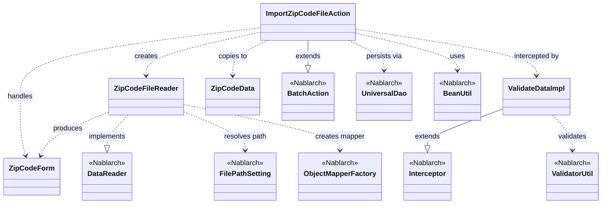
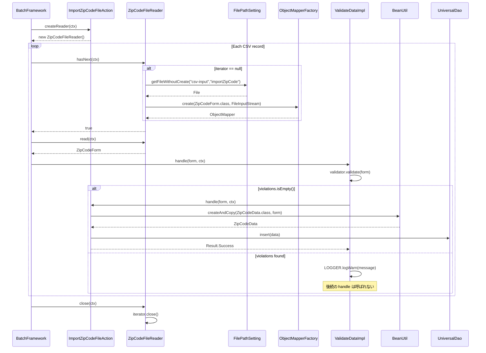

# Code Analysis: ImportZipCodeFileAction

**Generated**: 2026-04-24 10:33:41
**Target**: 住所ファイル(CSV)を読み込んでDBに登録するバッチアクション
**Modules**: nablarch-example-batch
**Analysis Duration**: unknown

---

## Overview

`ImportZipCodeFileAction` は Nablarch の `BatchAction` を継承したバッチ業務アクションであり、郵便番号(住所)CSVファイルを一行ずつ読み込んで DB に登録する処理を行う。`createReader()` で `ZipCodeFileReader` を生成し、リーダが返す `ZipCodeForm` をフレームワークが `handle()` に引き渡す。`handle()` は `@ValidateData` インターセプタにより事前に Bean Validation が掛けられ、バリデーション済みフォームを `BeanUtil.createAndCopy` で `ZipCodeData` エンティティに詰め替え、`UniversalDao.insert()` で1レコード登録する。ファイルのパスは `FilePathSetting` により論理名 `csv-input/importZipCode` で解決される。

---

## Architecture

### Dependency Graph



**Note**: This diagram uses Mermaid `classDiagram` syntax to show class names and their relationships. Use `--|>` for inheritance (extends/implements) and `..>` for dependencies (uses/creates).

### Component Summary

| Component | Role | Type | Dependencies |
|-----------|------|------|--------------|
| ImportZipCodeFileAction | 住所CSVを1件ずつDB登録する業務アクション | Action (Batch) | ZipCodeForm, ZipCodeFileReader, ZipCodeData, UniversalDao, BeanUtil |
| ZipCodeForm | CSV1レコードをバインドするフォーム(バリデーション対象) | Form | @Csv/@CsvFormat/@Domain/@Required/@LineNumber |
| ZipCodeFileReader | 住所CSVを読み込むデータリーダ | DataReader | ObjectMapperFactory, FilePathSetting, ObjectMapperIterator |
| ValidateData (interceptor) | ハンドラ実行前に Bean Validation を行うインターセプタ | Interceptor | ValidatorUtil, BeanUtil, MessageUtil, Logger |
| ZipCodeData | DB登録用エンティティ | Entity | (データ保持のみ) |

---

## Flow

### Processing Flow

起動時、Nablarch バッチフレームワークはまず `createReader()` を呼び出し、`ZipCodeFileReader` を取得する。リーダの初回アクセス時に `initialize()` が動き、`FilePathSetting.getFileWithoutCreate("csv-input", "importZipCode")` で入力ファイルパスを解決し、`ObjectMapperFactory.create(ZipCodeForm.class, FileInputStream)` で CSV→Bean バインド用の `ObjectMapper` を生成、これを `ObjectMapperIterator` でラップする。以降、フレームワークは `hasNext()`/`read()` を繰り返しながら、1行分の `ZipCodeForm` を取り出して `handle(inputData, ctx)` に渡す。`handle()` は `@ValidateData` インターセプタにより前処理され、`ValidatorUtil.getValidator().validate(data)` で Bean Validation を実行し、違反があれば `MessageUtil.createMessage` で WARN ログを出して後続処理をスキップする。違反が無ければ本体が実行され、`BeanUtil.createAndCopy(ZipCodeData.class, inputData)` でフォームからエンティティへ値コピーし、`UniversalDao.insert(data)` で DB に登録、`Result.Success` を返す。ファイル読み込み完了後、フレームワークは `close()` を呼び出し、`ObjectMapperIterator#close()` 経由でストリームを解放する。

### Sequence Diagram



---

## Components

### ImportZipCodeFileAction

住所CSVをDBに登録するバッチアクション本体。`BatchAction<ZipCodeForm>` を継承し、フレームワークが1レコードごとに呼び出す `handle()` と、リーダを供給する `createReader()` を実装する。

**Key methods**:
- `handle(ZipCodeForm inputData, ExecutionContext ctx)` (`:34-42`) — `@ValidateData` 付与。`BeanUtil.createAndCopy` でフォーム→エンティティに詰め替え、`UniversalDao.insert()` で登録。戻り値は `Result.Success`。
- `createReader(ExecutionContext ctx)` (`:50-52`) — `ZipCodeFileReader` を生成して返す。

**Dependencies**: ZipCodeForm, ZipCodeData, ZipCodeFileReader, ValidateData, UniversalDao, BeanUtil, BatchAction, ExecutionContext, Result。

**Source**: [ImportZipCodeFileAction.java:21-53](../../.lw/nab-official/v6/nablarch-example-batch/src/main/java/com/nablarch/example/app/batch/action/ImportZipCodeFileAction.java)

### ZipCodeForm

CSV1レコードをバインドするフォーム。`@Csv(type = CUSTOM)` + `@CsvFormat` でCSVフォーマット(UTF-8, カンマ区切り, CRLF, ダブルクォート, emptyToNull)を指定し、各プロパティに `@Required` と `@Domain(...)` を付与して Bean Validation を有効化。`@LineNumber` 付きの `getLineNumber()` により、エラー発生時の行番号をフレームワーク/インターセプタから取得可能。

**Key fields**: localGovernmentCode, zipCode5digit, zipCode7digit, prefectureKana/Kanji, cityKana/Kanji, addressKana/Kanji, multipleZipCodes, numberedEveryKoaza, addressWithChome, multipleAddress, updateData, updateDataReason, lineNumber。

**Source**: [ZipCodeForm.java:18-24 (annotations), :125-135 (lineNumber)](../../.lw/nab-official/v6/nablarch-example-batch/src/main/java/com/nablarch/example/app/batch/form/ZipCodeForm.java)

### ZipCodeFileReader

`DataReader<ZipCodeForm>` の実装。`FilePathSetting` で論理名 `csv-input/importZipCode` を物理パスに解決し、`ObjectMapperFactory.create()` で生成した `ObjectMapper` を `ObjectMapperIterator` でラップしてイテレーション可能にする。

**Key methods**:
- `read(ExecutionContext ctx)` (`:34-40`) — 初回アクセス時 `initialize()` を呼び、以後 `iterator.next()` を返す。
- `hasNext(ExecutionContext ctx)` (`:48-54`) — 同じく初期化後 `iterator.hasNext()` を返す。
- `close(ExecutionContext ctx)` (`:62-64`) — `iterator.close()` を呼びストリームを解放。
- `initialize()` (`:71-82`, private) — `FilePathSetting.getInstance().getFileWithoutCreate("csv-input", "importZipCode")` でファイル取得、`ObjectMapperFactory.create(ZipCodeForm.class, FileInputStream)` を `ObjectMapperIterator` でラップ。

**Source**: [ZipCodeFileReader.java:18-84](../../.lw/nab-official/v6/nablarch-example-batch/src/main/java/com/nablarch/example/app/batch/reader/ZipCodeFileReader.java)

### ValidateData (Interceptor)

ハンドラ実行前に Bean Validation を行うメソッドレベルのカスタムインターセプタ。`@Interceptor(ValidateData.ValidateDataImpl.class)` と `@Target(METHOD)/@Retention(RUNTIME)` を付与したアノテーション自体と、`Interceptor.Impl<Object, Result, ValidateData>` を継承した内部実装クラスからなる。

**Key methods**:
- `ValidateDataImpl.handle(Object data, ExecutionContext context)` — `ValidatorUtil.getValidator().validate(data)` を実行し、違反なしなら `getOriginalHandler().handle(data, context)` で元ハンドラを呼ぶ。違反ありの場合は、`BeanUtil.getProperty(data, "lineNumber")` で行番号を取得し、`MessageUtil.createMessage(WARN, "invalid_data_record", ...)` を整形して `LOGGER.logWarn` に出力、`null` を返し後続処理をスキップ。

**Source**: [ValidateData.java:32-88](../../.lw/nab-official/v6/nablarch-example-batch/src/main/java/com/nablarch/example/app/batch/interceptor/ValidateData.java)

---

## Nablarch Framework Usage

### BatchAction

**Class**: `nablarch.fw.action.BatchAction`

**Description**: 汎用的なバッチアクションのテンプレートクラス。`handle()` に1レコード分のビジネス処理、`createReader()` にデータソースからレコードを供給するリーダを実装する。

**Usage**:
```java
public class ImportZipCodeFileAction extends BatchAction<ZipCodeForm> {
    @Override @ValidateData
    public Result handle(ZipCodeForm inputData, ExecutionContext ctx) {
        ZipCodeData data = BeanUtil.createAndCopy(ZipCodeData.class, inputData);
        UniversalDao.insert(data);
        return new Result.Success();
    }
    @Override
    public DataReader<ZipCodeForm> createReader(ExecutionContext ctx) {
        return new ZipCodeFileReader();
    }
}
```

**Important points**:
- ✅ **handle に1レコード処理を書く**: データリーダが返す1件分のオブジェクトが引数で渡る。返り値は `Result.Success` などを返す。
- 🎯 **ファイル入力でデータバインドを使う場合**: 標準提供の `FileBatchAction` は汎用データフォーマット向けなので、データバインド(@Csv等)を使う場合は `BatchAction` を使う。
- 💡 **リーダ分離**: `createReader()` でリーダを差し替えられるため、入力ソースを変えてもアクション側は再利用しやすい。

**Usage in this code**:
- `ImportZipCodeFileAction` (`:21`) が `BatchAction<ZipCodeForm>` を継承。
- `handle()` (`:34`) に登録処理、`createReader()` (`:50`) で `ZipCodeFileReader` を返却。

**Details**: [Nablarch Batch Getting Started](../../.claude/skills/nabledge-6/docs/processing-pattern/nablarch-batch/nablarch-batch-getting-started-nablarch-batch.md), [Nablarch Batch Architecture](../../.claude/skills/nabledge-6/docs/processing-pattern/nablarch-batch/nablarch-batch-architecture.md)

### データバインド (@Csv / @CsvFormat / @LineNumber)

**Class**: `nablarch.common.databind.csv.Csv`, `CsvFormat`, `nablarch.common.databind.LineNumber`, `ObjectMapperFactory`

**Description**: CSV/固定長ファイルを Java Beans にバインドするライブラリ。`ObjectMapperFactory.create(Class, InputStream/OutputStream)` で `ObjectMapper` を生成し、1件ずつ read/write する。`@LineNumber` を付けたゲッタにフレームワークが自動で行番号を設定する。

**Usage**:
```java
@Csv(properties = {...}, type = CsvType.CUSTOM)
@CsvFormat(charset = "UTF-8", fieldSeparator = ',', lineSeparator = "\r\n",
           quote = '"', quoteMode = QuoteMode.NORMAL,
           requiredHeader = false, emptyToNull = true, ignoreEmptyLine = true)
public class ZipCodeForm {
    @Domain("zipCode") @Required private String zipCode7digit;
    @LineNumber public Long getLineNumber() { return lineNumber; }
}

ObjectMapper<ZipCodeForm> mapper =
    ObjectMapperFactory.create(ZipCodeForm.class, new FileInputStream(file));
```

**Important points**:
- ✅ **Bean バインドでは @Csv/@CsvFormat を使う**: `type=CUSTOM` のときは `@CsvFormat` でフォーマットを個別指定。
- 💡 **@LineNumber で行番号を自動取得**: エラーログ出力等でどの行が不正かを示すのに使える。
- ⚠️ **ObjectMapper は try-with-resources などで close すること**: ストリームのクローズ漏れに注意。

**Usage in this code**:
- `ZipCodeForm` (`:18-24`) が `@Csv(type=CUSTOM)` と `@CsvFormat(...)` でフォーマット指定。
- `ZipCodeForm.getLineNumber()` (`:129-132`) に `@LineNumber`。
- `ZipCodeFileReader.initialize()` (`:78-80`) で `ObjectMapperFactory.create(ZipCodeForm.class, FileInputStream)`。

**Details**: [Libraries Data Bind](../../.claude/skills/nabledge-6/docs/component/libraries/libraries-data-bind.md)

### FilePathSetting

**Class**: `nablarch.core.util.FilePathSetting`

**Description**: 論理ベースディレクトリ名(例: `csv-input`)と論理ファイル名から物理ファイルパスを解決するユーティリティ。環境依存パスをアプリコードから排除する。

**Usage**:
```java
FilePathSetting fps = FilePathSetting.getInstance();
File f = fps.getFileWithoutCreate("csv-input", "importZipCode");
```

**Important points**:
- ✅ **ハードコードせず論理名で解決**: 環境ごとにベースディレクトリを差し替え可能。
- 🎯 **入力系CSVは `csv-input`**: `csv-output`/`fixed-file-input` など用途ごとに論理名を使い分ける。
- 💡 **`getFileWithoutCreate` は存在チェックなしで File を返す**: 存在確認は呼び出し側で行う。

**Usage in this code**:
- `ZipCodeFileReader.initialize()` (`:73-74`) で `FilePathSetting.getInstance().getFileWithoutCreate("csv-input", "importZipCode")`。

**Details**: [Libraries File Path Management](../../.claude/skills/nabledge-6/docs/component/libraries/libraries-file-path-management.md)

### Interceptor (@ValidateData 経由)

**Class**: `nablarch.fw.Interceptor`, `Interceptor.Impl`, `nablarch.core.validation.ee.ValidatorUtil`

**Description**: インターセプタは実行時に動的にハンドラキューに追加されるハンドラ。メソッドに付与したアノテーションから共通処理(認可、バリデーション等)を差し込める。Bean Validation は `ValidatorUtil.getValidator()` で `jakarta.validation.Validator` を取得して実行する。

**Usage**:
```java
@Target(METHOD) @Retention(RUNTIME)
@Interceptor(ValidateData.ValidateDataImpl.class)
public @interface ValidateData {
    class ValidateDataImpl extends Interceptor.Impl<Object, Result, ValidateData> {
        public Result handle(Object data, ExecutionContext ctx) {
            Validator v = ValidatorUtil.getValidator();
            Set<ConstraintViolation<Object>> vs = v.validate(data);
            if (vs.isEmpty()) return getOriginalHandler().handle(data, ctx);
            // WARN ログを出して null を返す → 後続処理スキップ
            return null;
        }
    }
}
```

**Important points**:
- ✅ **`getOriginalHandler().handle(...)` の戻り値をそのまま返す**: 違反なしのときに元ハンドラを呼ばないと業務処理が実行されない。
- ⚠️ **バッチでは `null` を返すと該当レコードだけスキップできる**: 違反時に業務処理を飛ばす実装パターン。
- 💡 **行番号を出力したい場合は Bean に `lineNumber` プロパティを用意**: `BeanUtil.getProperty(data, "lineNumber")` で取得、無ければ "null" と出力される。

**Usage in this code**:
- `ImportZipCodeFileAction.handle()` (`:33`) に `@ValidateData` 付与。
- `ValidateData.ValidateDataImpl.handle()` でバリデーション実行。違反なしは `getOriginalHandler().handle(data, context)` を呼び、違反ありは `LOGGER.logWarn` で警告出力後 `null` 返却。

**Details**: [About Nablarch Architecture](../../.claude/skills/nabledge-6/docs/about/about-nablarch/about-nablarch-architecture.md), [Libraries Bean Validation](../../.claude/skills/nabledge-6/docs/component/libraries/libraries-bean-validation.md)

### UniversalDao

**Class**: `nablarch.common.dao.UniversalDao`

**Description**: アノテーションベースの汎用DAO。エンティティクラスを渡すだけで CRUD(`insert`/`update`/`delete`/`findById` 等)を実行できる。

**Usage**:
```java
ZipCodeData data = BeanUtil.createAndCopy(ZipCodeData.class, inputData);
UniversalDao.insert(data);
```

**Important points**:
- ✅ **エンティティには JPA アノテーション(@Entity, @Id 等)を付与する**: UniversalDao はこれらを参照して SQL を組み立てる。
- 🎯 **単純なCRUDはこれで書ける**: 独自SQLが必要な場合は SQL ファイルベースのメソッドを使う。
- 💡 **`BeanUtil.createAndCopy` と組み合わせ**: Form→Entity の詰め替えに便利。

**Usage in this code**:
- `ImportZipCodeFileAction.handle()` (`:40`) で `UniversalDao.insert(data)` により1件INSERT。

**Details**: [Libraries Universal Dao](../../.claude/skills/nabledge-6/docs/component/libraries/libraries-universal-dao.md)

### BeanUtil

**Class**: `nablarch.core.beans.BeanUtil`

**Description**: Java Beans 間のプロパティコピーやプロパティ取得を行うユーティリティ。Form→Entity の詰め替えによく使う。

**Usage**:
```java
ZipCodeData data = BeanUtil.createAndCopy(ZipCodeData.class, inputData);
Long ln = (Long) BeanUtil.getProperty(data, "lineNumber");
```

**Important points**:
- ✅ **`createAndCopy` は新インスタンスを生成して同名プロパティをコピー**: Form/Entity で同じプロパティ名を合わせておくのが前提。
- ⚠️ **`getProperty` は対象プロパティが無いと `BeansException`**: 任意プロパティを扱うときは try-catch が必要。

**Usage in this code**:
- `ImportZipCodeFileAction.handle()` (`:39`) で `BeanUtil.createAndCopy(ZipCodeData.class, inputData)`。
- `ValidateData.ValidateDataImpl.handle()` で `BeanUtil.getProperty(data, "lineNumber")` を try-catch して行番号取得。

**Details**: [Libraries Bean Util](../../.claude/skills/nabledge-6/docs/component/libraries/libraries-bean-util.md)

---

## References

### Source Files

- [ImportZipCodeFileAction.java (.lw/nab-official/v5/nablarch-example-batch/src/main/java/com/nablarch/example/app/batch/action)](../../.lw/nab-official/v5/nablarch-example-batch/src/main/java/com/nablarch/example/app/batch/action/ImportZipCodeFileAction.java) - ImportZipCodeFileAction
- [ImportZipCodeFileAction.java (.lw/nab-official/v6/nablarch-example-batch/src/main/java/com/nablarch/example/app/batch/action)](../../.lw/nab-official/v6/nablarch-example-batch/src/main/java/com/nablarch/example/app/batch/action/ImportZipCodeFileAction.java) - ImportZipCodeFileAction
- [ZipCodeForm.java (.lw/nab-official/v5/nablarch-example-batch/src/main/java/com/nablarch/example/app/batch/form)](../../.lw/nab-official/v5/nablarch-example-batch/src/main/java/com/nablarch/example/app/batch/form/ZipCodeForm.java) - ZipCodeForm
- [ZipCodeForm.java (.lw/nab-official/v6/nablarch-example-batch/src/main/java/com/nablarch/example/app/batch/form)](../../.lw/nab-official/v6/nablarch-example-batch/src/main/java/com/nablarch/example/app/batch/form/ZipCodeForm.java) - ZipCodeForm
- [ZipCodeFileReader.java (.lw/nab-official/v5/nablarch-example-batch/src/main/java/com/nablarch/example/app/batch/reader)](../../.lw/nab-official/v5/nablarch-example-batch/src/main/java/com/nablarch/example/app/batch/reader/ZipCodeFileReader.java) - ZipCodeFileReader
- [ZipCodeFileReader.java (.lw/nab-official/v6/nablarch-example-batch/src/main/java/com/nablarch/example/app/batch/reader)](../../.lw/nab-official/v6/nablarch-example-batch/src/main/java/com/nablarch/example/app/batch/reader/ZipCodeFileReader.java) - ZipCodeFileReader
- [ValidateData.java (.lw/nab-official/v5/nablarch-example-batch/src/main/java/com/nablarch/example/app/batch/interceptor)](../../.lw/nab-official/v5/nablarch-example-batch/src/main/java/com/nablarch/example/app/batch/interceptor/ValidateData.java) - ValidateData
- [ValidateData.java (.lw/nab-official/v6/nablarch-example-batch/src/main/java/com/nablarch/example/app/batch/interceptor)](../../.lw/nab-official/v6/nablarch-example-batch/src/main/java/com/nablarch/example/app/batch/interceptor/ValidateData.java) - ValidateData

### Knowledge Base (Nabledge-6)

- [Nablarch Batch Getting Started Nablarch Batch](../../.claude/skills/nabledge-6/docs/processing-pattern/nablarch-batch/nablarch-batch-getting-started-nablarch-batch.md)
- [Nablarch Batch Architecture](../../.claude/skills/nabledge-6/docs/processing-pattern/nablarch-batch/nablarch-batch-architecture.md)
- [Libraries Data Bind](../../.claude/skills/nabledge-6/docs/component/libraries/libraries-data-bind.md)
- [Libraries File Path Management](../../.claude/skills/nabledge-6/docs/component/libraries/libraries-file-path-management.md)
- [Libraries Bean Validation](../../.claude/skills/nabledge-6/docs/component/libraries/libraries-bean-validation.md)
- [Libraries Universal Dao](../../.claude/skills/nabledge-6/docs/component/libraries/libraries-universal-dao.md)
- [Libraries Bean Util](../../.claude/skills/nabledge-6/docs/component/libraries/libraries-bean-util.md)
- [About Nablarch Architecture](../../.claude/skills/nabledge-6/docs/about/about-nablarch/about-nablarch-architecture.md)

### Official Documentation

(No official documentation links available)

---

**Output**: `.nabledge/20260424/code-analysis-ImportZipCodeFileAction.md`

**Note**: This documentation was generated by the code-analysis workflow of the nabledge-6 skill.
