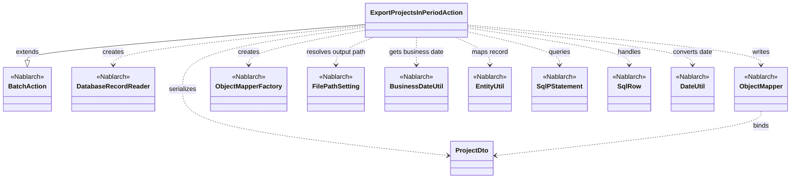
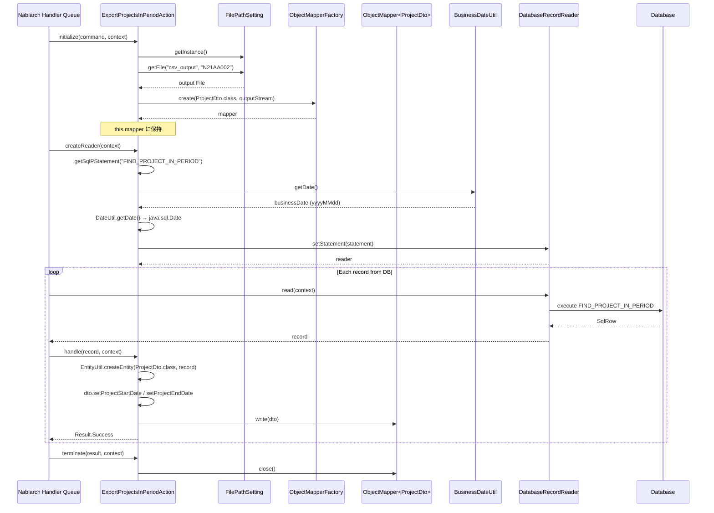

# Code Analysis: ExportProjectsInPeriodAction

**Generated**: 2026-04-24 10:56:18
**Target**: 期間内プロジェクト一覧CSV出力の都度起動バッチアクション
**Modules**: proman-batch
**Analysis Duration**: approx. 2m 34s

---

## Overview

`ExportProjectsInPeriodAction` は、業務日付を基準に期間内のプロジェクト情報をデータベースから検索し、CSVファイルとして出力する都度起動バッチアクションである。Nablarch の `BatchAction<SqlRow>` を継承し、`DatabaseRecordReader` で SQL ファイルから取得したレコードを1件ずつ `ProjectDto` にバインドして `ObjectMapper` で CSV に書き込む「DB to FILE」パターンを実装している。出力先ファイルは `FilePathSetting` で論理名 `csv_output` から解決する。

---

## Architecture

### Dependency Graph



### Component Summary

| Component | Role | Type | Dependencies |
|-----------|------|------|--------------|
| ExportProjectsInPeriodAction | 期間内プロジェクトCSV出力バッチ本体 | Action (BatchAction) | ProjectDto, DatabaseRecordReader, ObjectMapper, FilePathSetting, BusinessDateUtil |
| ProjectDto | CSV行にバインドされるプロジェクト情報Bean | Bean (DTO) | なし (@Csv / @CsvFormat アノテーションのみ) |
| FIND_PROJECT_IN_PERIOD | 期間内プロジェクト検索用SQL文 (SQLファイル内SQLID) | SQL | なし |

---

## Flow

### Processing Flow

Nablarch バッチのハンドラキューから以下の順で呼び出される。

1. **`initialize()`** (Line 43-53): 出力CSVファイルのパスを `FilePathSetting` で解決し、`FileOutputStream` と `ObjectMapperFactory.create(ProjectDto.class, outputStream)` で CSV 書き込み用の `ObjectMapper` を生成してフィールドに保持する。`FileNotFoundException` は `IllegalStateException` にラップして再送出する。
2. **`createReader()`** (Line 56-64): `DatabaseRecordReader` を生成し、`getSqlPStatement("FIND_PROJECT_IN_PERIOD")` で SQL ファイルから `SqlPStatement` を取得する。`BusinessDateUtil.getDate()` で取得した業務日付を `DateUtil.getDate()` 経由で `java.sql.Date` に変換し、第1・第2バインド変数に設定して `DatabaseRecordReader` に渡す。
3. **`handle()`** (Line 67-74): データリーダから渡された1行分の `SqlRow` を `EntityUtil.createEntity(ProjectDto.class, record)` で `ProjectDto` にマッピングする。`EntityUtil` では型変換できない `projectStartDate` / `projectEndDate` は明示的に `setDate(...)` で設定し、`mapper.write(dto)` で CSV に1行出力して `Result.Success` を返却する。
4. **`terminate()`** (Line 77-79): `mapper.close()` で CSV バッファのフラッシュとリソース解放を行う。

ハンドラキュー側で「リクエストディスパッチハンドラ → マルチスレッド実行制御ハンドラ → DB接続管理ハンドラ → トランザクションループ制御ハンドラ → データリードハンドラ」が構成されているため、本クラスはデータ読込・トランザクション・コミット間隔を意識せずに1レコード単位の処理だけに集中できる。

### Sequence Diagram



---

## Components

### 1. ExportProjectsInPeriodAction

**ファイル**: [ExportProjectsInPeriodAction.java](../../.lw/nab-official/v6/nablarch-system-development-guide/Sample_Project/Source_Code/proman-project/proman-batch/src/main/java/com/nablarch/example/proman/batch/project/ExportProjectsInPeriodAction.java)

**役割**: 業務日付を基準に、期間内に該当するプロジェクト情報を DB から検索し、CSV ファイルとして1件ずつ書き出す都度起動バッチアクション。`BatchAction<SqlRow>` を継承し、データリーダは `DatabaseRecordReader`、出力先は `FilePathSetting` の論理名 `csv_output` で解決する `N21AA002` ファイル。

**主要メソッド**:
- `initialize(CommandLine, ExecutionContext)` (L43-53): 出力ファイルの決定と `ObjectMapper` の生成。`FilePathSetting.getFile("csv_output", OUTPUT_FILE_NAME)` でパスを解決し、`ObjectMapperFactory.create(ProjectDto.class, outputStream)` で CSV 書き込みマッパーを生成する。
- `createReader(ExecutionContext)` (L56-64): `DatabaseRecordReader` を生成し、SQLID `FIND_PROJECT_IN_PERIOD` のプリペアドステートメントに業務日付 (`BusinessDateUtil.getDate()`) を `java.sql.Date` に変換して2個のバインド変数としてセットする。
- `handle(SqlRow, ExecutionContext)` (L67-74): 1レコードを `EntityUtil.createEntity(...)` で `ProjectDto` に詰め替え、`java.sql.Date` 型の開始日・終了日だけは `EntityUtil` では設定できないため明示的にセッタを呼んだうえで `mapper.write(dto)` で CSV に出力する。
- `terminate(Result, ExecutionContext)` (L77-79): `mapper.close()` でリソースを解放する。

**依存先**: `BatchAction`, `DatabaseRecordReader`, `SqlPStatement`, `SqlRow`, `ObjectMapper`, `ObjectMapperFactory`, `FilePathSetting`, `BusinessDateUtil`, `DateUtil`, `EntityUtil`, `ProjectDto`, `java.io.FileOutputStream`, `java.sql.Date`

### 2. ProjectDto

**ファイル**: [ProjectDto.java](../../.lw/nab-official/v6/nablarch-system-development-guide/Sample_Project/Source_Code/proman-project/proman-batch/src/main/java/com/nablarch/example/proman/batch/project/ProjectDto.java)

**役割**: CSV 1行にバインドされるプロジェクト情報を保持する Bean。`@Csv(type = CUSTOM, properties = {...}, headers = {...})` と `@CsvFormat(fieldSeparator=',', lineSeparator="\r\n", quote='"', charset="UTF-8", emptyToNull=true, quoteMode=ALL, ...)` でカラム順・ヘッダ行・フォーマットを宣言的に定義する。

**主要メソッド**:
- `setProjectStartDate(Date)` / `setProjectEndDate(Date)`: `java.util.Date` を受け取り、`DateUtil.formatDate(d, "yyyy/MM/dd")` で文字列に整形してフィールドに保持する。`EntityUtil.createEntity` で直接マッピングできない型変換をここで担う。
- その他は全カラム (プロジェクトID/名/種別/分類/日付/組織/顧客/PM/PL/備考/売上/バージョン番号) の getter / setter。

**依存先**: `@Csv`, `@CsvFormat`, `CsvDataBindConfig.QuoteMode`, `DateUtil`

### 3. FIND_PROJECT_IN_PERIOD (SQL)

**役割**: SQLID `FIND_PROJECT_IN_PERIOD` に紐付くSQL文。`createReader()` で `getSqlPStatement(...)` によって SQL ファイルから取得され、バインド変数2個 (いずれも業務日付) を受け取り、期間内に有効なプロジェクトを返す想定。`DatabaseRecordReader` がこのステートメントを実行し、`SqlRow` を1件ずつアクションへ供給する。

---

## Nablarch Framework Usage

### BatchAction

**クラス**: `nablarch.fw.action.BatchAction`

**説明**: 汎用バッチ用のテンプレートクラス。`createReader()` で返却した `DataReader` から読み込まれたレコードが、`handle()` に1件ずつ渡される「DB to FILE」「DB to DB」パターンに適合する。

**使用方法**:
```java
public class ExportProjectsInPeriodAction extends BatchAction<SqlRow> {
    @Override protected void initialize(CommandLine cmd, ExecutionContext ctx) { ... }
    @Override public DataReader<SqlRow> createReader(ExecutionContext ctx) { ... }
    @Override public Result handle(SqlRow record, ExecutionContext ctx) { ... }
    @Override protected void terminate(Result result, ExecutionContext ctx) { ... }
}
```

**重要ポイント**:
- ✅ **`createReader()` にデータリーダを返す**: `handle()` メソッドに1件ずつレコードが渡されるため、リーダの返却が必須。
- ✅ **`handle()` は1レコード単位**: ループ・トランザクション制御はハンドラキュー側が担うため、アクション側は1件分のロジックに集中する。
- 🎯 **ファイル入力でデータバインドを使う場合**: `FileBatchAction` は汎用データフォーマットに依存するため、データバインドを使う場合は本クラス（`BatchAction`）を選択する。

**このコードでの使い方**:
- `BatchAction<SqlRow>` を継承し、リーダに `DatabaseRecordReader` を採用
- `handle()` で `SqlRow` を `ProjectDto` に変換して CSV 書き込み

**詳細**: [Nablarch Batch Getting Started](../../.claude/skills/nabledge-6/docs/processing-pattern/nablarch-batch/nablarch-batch-getting-started-nablarch-batch.md), [Nablarch Batch Architecture](../../.claude/skills/nabledge-6/docs/processing-pattern/nablarch-batch/nablarch-batch-architecture.md)

### DatabaseRecordReader

**クラス**: `nablarch.fw.reader.DatabaseRecordReader`

**説明**: Nablarch 標準で提供されるデータリーダの一つ。`SqlPStatement` を受け取り、`retrieve()` の結果を `SqlRow` として1件ずつ `handle()` に供給する。

**使用方法**:
```java
DatabaseRecordReader reader = new DatabaseRecordReader();
SqlPStatement statement = getSqlPStatement("FIND_PROJECT_IN_PERIOD");
statement.setDate(1, bizDate);
statement.setDate(2, bizDate);
reader.setStatement(statement);
return reader;
```

**重要ポイント**:
- ✅ **`setStatement()` でステートメントをセット**: バインド変数も事前に設定してから渡す。
- 🎯 **DB入力のバッチに使用**: ファイル入力の場合は `FileDataReader` / `ValidatableFileDataReader` / `ResumeDataReader` など別のリーダを検討する。
- ⚠️ **SQLID と SQL ファイルの対応**: `getSqlPStatement("ID")` は、アクションクラスと同じパッケージ配置の `<ClassName>.sql` ファイル内の SQLID を参照する。

**このコードでの使い方**:
- `createReader()` で `DatabaseRecordReader` を生成し、`FIND_PROJECT_IN_PERIOD` に業務日付2個をバインドしてセット

**詳細**: [Nablarch Batch Architecture](../../.claude/skills/nabledge-6/docs/processing-pattern/nablarch-batch/nablarch-batch-architecture.md)

### ObjectMapper / ObjectMapperFactory (データバインド)

**クラス**: `nablarch.common.databind.ObjectMapper`, `nablarch.common.databind.ObjectMapperFactory`

**説明**: CSV・TSV・固定長データを Java Beans としてバインドする機能を提供する。`@Csv` / `@CsvFormat` を付与した Bean クラスと出力ストリームから `ObjectMapper` を生成して、`write(bean)` で1件ずつ書き出す。

**使用方法**:
```java
try (ObjectMapper<ProjectDto> mapper =
         ObjectMapperFactory.create(ProjectDto.class, outputStream)) {
    for (ProjectDto dto : dtoList) {
        mapper.write(dto);
    }
}
```

**重要ポイント**:
- ✅ **必ず `close()` を呼ぶ**: バッファをフラッシュしリソースを解放する。本コードでは `terminate()` で実施。`try-with-resources` も利用可能。
- 💡 **アノテーション駆動**: `@Csv(type=CUSTOM, properties, headers)` と `@CsvFormat(...)` でフォーマットを宣言的に指定できる。
- ⚠️ **大量データ時のメモリ**: データをメモリに展開せず1件ずつ書き出すため、大量データでも安全に処理できる。

**このコードでの使い方**:
- `initialize()` で `ObjectMapperFactory.create(ProjectDto.class, outputStream)` を生成してフィールドに保持
- `handle()` で1件ずつ `mapper.write(dto)` を呼び出して CSV へ書き出し
- `terminate()` で `mapper.close()` によりリソース解放

**詳細**: [Libraries Data Bind](../../.claude/skills/nabledge-6/docs/component/libraries/libraries-data-bind.md)

### FilePathSetting

**クラス**: `nablarch.core.util.FilePathSetting`

**説明**: 論理名 (例: `csv_output`) とファイル名から実ファイルパスを解決するユーティリティ。ベースディレクトリと拡張子はコンポーネント定義 (`basePathSettings` / `fileExtensions`) で一元管理する。

**使用方法**:
```java
FilePathSetting filePathSetting = FilePathSetting.getInstance();
File output = filePathSetting.getFile("csv_output", "N21AA002");
```

**重要ポイント**:
- ✅ **コンポーネント名は `filePathSetting`**: 設定ファイル上のコンポーネント名は固定。
- 💡 **パスを1箇所で集中管理**: コードからパスがハードコードされるのを防ぎ、環境差異は設定で吸収できる。
- ⚠️ **classpath スキーム使用時の注意**: 一部 AP サーバ (JBoss/WildFly の vfs など) では classpath スキームが使用できないため `file` スキーム推奨。

**このコードでの使い方**:
- `initialize()` で `FilePathSetting.getInstance().getFile("csv_output", OUTPUT_FILE_NAME)` を呼び出し、CSV 出力先ファイルを解決

**詳細**: [Libraries File Path Management](../../.claude/skills/nabledge-6/docs/component/libraries/libraries-file-path-management.md)

### BusinessDateUtil

**クラス**: `nablarch.core.date.BusinessDateUtil`

**説明**: 業務日付を取得するユーティリティ。裏側では `BasicBusinessDateProvider` が DB の `BUSINESS_DATE` テーブル (区分・日付) を参照する。テスト時などプロバイダ差し替えにより容易に日付を切り替えられる。

**使用方法**:
```java
String bizDateString = BusinessDateUtil.getDate();   // yyyyMMdd
java.sql.Date bizDate = new java.sql.Date(DateUtil.getDate(bizDateString).getTime());
```

**重要ポイント**:
- ✅ **コンポーネント `businessDateProvider` を登録**: `BasicBusinessDateProvider` をコンポーネント定義に追加し、初期化対象リストへ含めること。
- 💡 **システム日時との分離**: 業務日付は OS 日時と分離して管理できるため、締め処理・再実行時も一貫した日付で処理可能。
- ⚠️ **戻り値は yyyyMMdd 文字列**: `java.sql.Date` 等に変換する際は `DateUtil.getDate()` などの経由が必要。

**このコードでの使い方**:
- `createReader()` で `BusinessDateUtil.getDate()` を取得し、`DateUtil.getDate(...)` と `java.sql.Date` への変換を経て `SqlPStatement` の2個のバインド変数にセット

**詳細**: [Libraries Date](../../.claude/skills/nabledge-6/docs/component/libraries/libraries-date.md)

### SqlPStatement (データベースアクセス)

**クラス**: `nablarch.core.db.statement.SqlPStatement`, `nablarch.core.db.statement.SqlRow`

**説明**: SQLID を基に SQL ファイルから SQL を取得して実行するためのプリペアドステートメント。`BatchAction` では `getSqlPStatement(SQLID)` で取得し、`setDate(i, ...)` などでバインド変数を設定する。結果は `SqlRow` / `SqlResultSet` で受け取る。

**使用方法**:
```java
SqlPStatement statement = getSqlPStatement("FIND_PROJECT_IN_PERIOD");
statement.setDate(1, bizDate);
statement.setDate(2, bizDate);
```

**重要ポイント**:
- ✅ **SQLID = SQLファイル名 + `#` + SQL名**: SQLID の `#` までがファイル、以降が SQL ファイル内 SQLID。
- 💡 **DB 接続は `DbConnectionContext` / 接続管理ハンドラ経由**: バッチのハンドラキューで DB 接続管理ハンドラが接続を確保する。
- ⚠️ **型違いカラムは明示設定**: 取得後の `SqlRow` で `EntityUtil.createEntity` を使っても、型変換できないカラム (`projectStartDate` / `projectEndDate` など) は setter を明示呼び出しする。

**このコードでの使い方**:
- `createReader()` で `getSqlPStatement("FIND_PROJECT_IN_PERIOD")` と `setDate()` 2回を実行し、`DatabaseRecordReader` にセット
- `handle()` で `SqlRow#getDate("PROJECT_START_DATE")` / `getDate("PROJECT_END_DATE")` を呼び出してから `ProjectDto` に反映

**詳細**: [Libraries Database](../../.claude/skills/nabledge-6/docs/component/libraries/libraries-database.md)

---

## References

### Source Files

- [ExportProjectsInPeriodAction.java (.lw/nab-official/v5/nablarch-system-development-guide/en/Sample_Project/Source_Code/proman-project/proman-batch/src/main/java/com/nablarch/example/proman/batch/project)](../../.lw/nab-official/v5/nablarch-system-development-guide/en/Sample_Project/Source_Code/proman-project/proman-batch/src/main/java/com/nablarch/example/proman/batch/project/ExportProjectsInPeriodAction.java) - ExportProjectsInPeriodAction
- [ExportProjectsInPeriodAction.java (.lw/nab-official/v5/nablarch-system-development-guide/Sample_Project/Source_Code/proman-project/proman-batch/src/main/java/com/nablarch/example/proman/batch/project)](../../.lw/nab-official/v5/nablarch-system-development-guide/Sample_Project/Source_Code/proman-project/proman-batch/src/main/java/com/nablarch/example/proman/batch/project/ExportProjectsInPeriodAction.java) - ExportProjectsInPeriodAction
- [ExportProjectsInPeriodAction.java (.lw/nab-official/v6/nablarch-system-development-guide/en/Sample_Project/Source_Code/proman-project/proman-batch/src/main/java/com/nablarch/example/proman/batch/project)](../../.lw/nab-official/v6/nablarch-system-development-guide/en/Sample_Project/Source_Code/proman-project/proman-batch/src/main/java/com/nablarch/example/proman/batch/project/ExportProjectsInPeriodAction.java) - ExportProjectsInPeriodAction
- [ExportProjectsInPeriodAction.java (.lw/nab-official/v6/nablarch-system-development-guide/Sample_Project/Source_Code/proman-project/proman-batch/src/main/java/com/nablarch/example/proman/batch/project)](../../.lw/nab-official/v6/nablarch-system-development-guide/Sample_Project/Source_Code/proman-project/proman-batch/src/main/java/com/nablarch/example/proman/batch/project/ExportProjectsInPeriodAction.java) - ExportProjectsInPeriodAction
- [ProjectDto.java (.lw/nab-official/v5/nablarch-system-development-guide/en/Sample_Project/Source_Code/proman-project/proman-batch/src/main/java/com/nablarch/example/proman/batch/project)](../../.lw/nab-official/v5/nablarch-system-development-guide/en/Sample_Project/Source_Code/proman-project/proman-batch/src/main/java/com/nablarch/example/proman/batch/project/ProjectDto.java) - ProjectDto
- [ProjectDto.java (.lw/nab-official/v5/nablarch-system-development-guide/Sample_Project/Source_Code/proman-project/proman-batch/src/main/java/com/nablarch/example/proman/batch/project)](../../.lw/nab-official/v5/nablarch-system-development-guide/Sample_Project/Source_Code/proman-project/proman-batch/src/main/java/com/nablarch/example/proman/batch/project/ProjectDto.java) - ProjectDto
- [ProjectDto.java (.lw/nab-official/v5/nablarch-example-web/src/main/java/com/nablarch/example/app/web/dto)](../../.lw/nab-official/v5/nablarch-example-web/src/main/java/com/nablarch/example/app/web/dto/ProjectDto.java) - ProjectDto
- [ProjectDto.java (.lw/nab-official/v6/nablarch-system-development-guide/en/Sample_Project/Source_Code/proman-project/proman-batch/src/main/java/com/nablarch/example/proman/batch/project)](../../.lw/nab-official/v6/nablarch-system-development-guide/en/Sample_Project/Source_Code/proman-project/proman-batch/src/main/java/com/nablarch/example/proman/batch/project/ProjectDto.java) - ProjectDto
- [ProjectDto.java (.lw/nab-official/v6/nablarch-system-development-guide/Sample_Project/Source_Code/proman-project/proman-batch/src/main/java/com/nablarch/example/proman/batch/project)](../../.lw/nab-official/v6/nablarch-system-development-guide/Sample_Project/Source_Code/proman-project/proman-batch/src/main/java/com/nablarch/example/proman/batch/project/ProjectDto.java) - ProjectDto
- [ProjectDto.java (.lw/nab-official/v6/nablarch-example-web/src/main/java/com/nablarch/example/app/web/dto)](../../.lw/nab-official/v6/nablarch-example-web/src/main/java/com/nablarch/example/app/web/dto/ProjectDto.java) - ProjectDto

### Knowledge Base (Nabledge-6)

- [Nablarch Batch Getting Started Nablarch Batch](../../.claude/skills/nabledge-6/docs/processing-pattern/nablarch-batch/nablarch-batch-getting-started-nablarch-batch.md)
- [Nablarch Batch Architecture](../../.claude/skills/nabledge-6/docs/processing-pattern/nablarch-batch/nablarch-batch-architecture.md)
- [Libraries Data Bind](../../.claude/skills/nabledge-6/docs/component/libraries/libraries-data-bind.md)
- [Libraries Date](../../.claude/skills/nabledge-6/docs/component/libraries/libraries-date.md)
- [Libraries File Path Management](../../.claude/skills/nabledge-6/docs/component/libraries/libraries-file-path-management.md)
- [Libraries Database](../../.claude/skills/nabledge-6/docs/component/libraries/libraries-database.md)

### Official Documentation

(No official documentation links available)

---

**Output**: `.nabledge/20260424/code-analysis-ExportProjectsInPeriodAction.md`

**Note**: This documentation was generated by the code-analysis workflow of the nabledge-6 skill.
