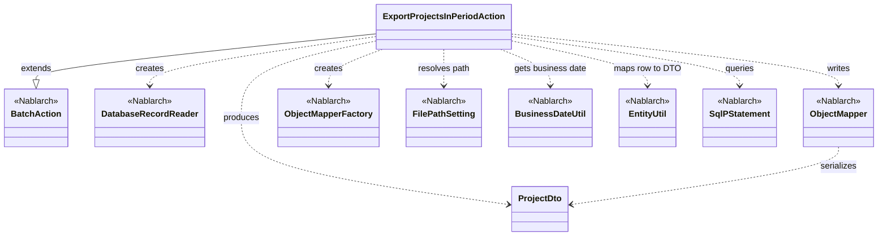
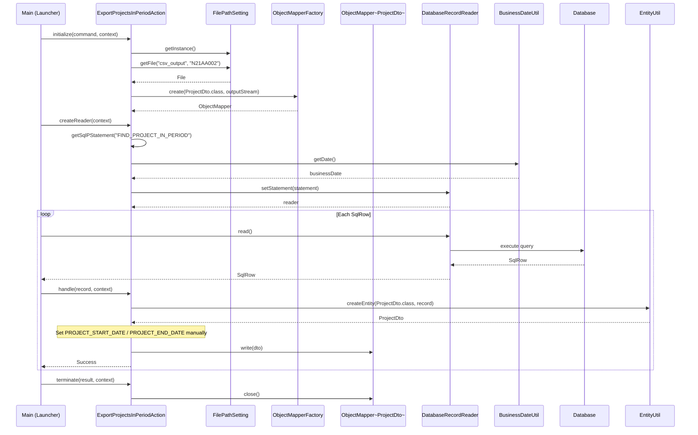

# Code Analysis: ExportProjectsInPeriodAction

**Generated**: 2026-04-24 10:45:09
**Target**: 期間内プロジェクト一覧出力の都度起動バッチアクション (CSV出力)
**Modules**: proman-batch
**Analysis Duration**: approx. 2m 8s

---

## Overview

`ExportProjectsInPeriodAction` は、業務日付を起点に「期間内のプロジェクト一覧」をデータベースから取得し、CSVファイルとして出力する都度起動バッチアクションである。Nablarchの `BatchAction<SqlRow>` を継承し、`initialize()` → `createReader()` → `handle()` (1件ずつ繰り返し) → `terminate()` のライフサイクルで処理を進める。入力はDB（`DatabaseRecordReader` + 名前付きSQL `FIND_PROJECT_IN_PERIOD`）、出力はCSV（`ObjectMapper<ProjectDto>` + `FilePathSetting` による論理パス解決）という DB-to-FILE の典型的なバッチパターンを構成している。

---

## Architecture

### Dependency Graph



**Note**: This diagram uses Mermaid `classDiagram` syntax to show class names and their relationships. Use `--|>` for inheritance (extends/implements) and `..>` for dependencies (uses/creates).

### Component Summary

| Component | Role | Type | Dependencies |
|-----------|------|------|--------------|
| ExportProjectsInPeriodAction | 期間内プロジェクト一覧CSV出力バッチアクション | Action (BatchAction) | DatabaseRecordReader, ObjectMapper, FilePathSetting, BusinessDateUtil, EntityUtil, ProjectDto |
| ProjectDto | CSV出力用のプロジェクト情報Bean（`@Csv`/`@CsvFormat`定義） | DTO (Bean) | なし |
| FIND_PROJECT_IN_PERIOD | 期間内プロジェクト検索SQL（外部SQLファイル） | SQL | なし |

---

## Flow

### Processing Flow

Nablarchの `BatchAction` ライフサイクルに沿って処理が進む。

1. **initialize()** (L45-55): `FilePathSetting` で論理名 `csv_output` の出力ディレクトリから `N21AA002` ファイルを解決し、`FileOutputStream` を開いて `ObjectMapperFactory.create(ProjectDto.class, outputStream)` で CSV 出力用の `ObjectMapper` を生成する。ファイルが開けなかった場合は `IllegalStateException` にラップして送出する。
2. **createReader()** (L58-66): `DatabaseRecordReader` を生成し、`getSqlPStatement("FIND_PROJECT_IN_PERIOD")` で外部SQLをロード。`BusinessDateUtil.getDate()` で取得した業務日付を `DateUtil.getDate()` で `java.util.Date` に変換し、さらに `java.sql.Date` にしてから `setDate(1, ...)` / `setDate(2, ...)` の2つのバインド変数（期間の開始・終了判定用）に設定。`reader.setStatement(statement)` してリターンする。
3. **handle()** (L69-76): データリーダから渡された1行分の `SqlRow` に対し、`EntityUtil.createEntity(ProjectDto.class, record)` で DTO へマッピング。`EntityUtil` で型変換できない日付型カラム（`PROJECT_START_DATE` / `PROJECT_END_DATE`）は、`record.getDate(...)` で取り出して `dto.setProjectStartDate(...)` / `dto.setProjectEndDate(...)` を明示的に呼び、Setter 内で `DateUtil.formatDate(..., "yyyy/MM/dd")` により文字列化する。`mapper.write(dto)` で 1レコードを CSV に書き出し、`new Success()` を返却。
4. **terminate()** (L79-82): `mapper.close()` を呼んで CSV のバッファをフラッシュしリソースを解放する。

補助処理として、Setter (`ProjectDto#setProjectStartDate` / `setProjectEndDate`) は `DateUtil.formatDate(date, "yyyy/MM/dd")` により日付をCSV用の文字列フォーマットに変換する責務を持つ。

### Sequence Diagram



---

## Components

### ExportProjectsInPeriodAction

**ファイル**: [ExportProjectsInPeriodAction.java](../../.lw/nab-official/v6/nablarch-system-development-guide/Sample_Project/Source_Code/proman-project/proman-batch/src/main/java/com/nablarch/example/proman/batch/project/ExportProjectsInPeriodAction.java)

**役割**: 期間内プロジェクト一覧をDBから抽出し、CSVとしてファイル出力する都度起動バッチアクション。`BatchAction<SqlRow>` を継承し、`SqlRow` 単位で業務ロジックを実行する。

**主要メソッド**:
- `initialize(CommandLine, ExecutionContext)` (L45-55): CSV出力先ファイルをオープンし、`ObjectMapper<ProjectDto>` を生成。`FilePathSetting` で論理名 `csv_output` + ファイル名 `N21AA002` を解決。
- `createReader(ExecutionContext)` (L58-66): `DatabaseRecordReader` を生成。`FIND_PROJECT_IN_PERIOD` の外部SQLに対し、`BusinessDateUtil` 由来の業務日付を2箇所のバインド変数に設定する。
- `handle(SqlRow, ExecutionContext)` (L69-76): 1件分の `SqlRow` を `EntityUtil.createEntity` で `ProjectDto` に変換し、日付カラムのみ手動セット。`mapper.write(dto)` でCSVへ出力し `Success` を返す。
- `terminate(Result, ExecutionContext)` (L79-82): `ObjectMapper#close()` によりバッファフラッシュ・クローズ。

**依存**: `BatchAction` (Nablarch), `DatabaseRecordReader` (Nablarch), `ObjectMapper` / `ObjectMapperFactory` (Nablarch), `FilePathSetting` (Nablarch), `BusinessDateUtil` / `DateUtil` (Nablarch), `EntityUtil` (Nablarch), `SqlPStatement` / `SqlRow` (Nablarch), `ProjectDto` (proman-batch)。

### ProjectDto

**ファイル**: [ProjectDto.java](../../.lw/nab-official/v6/nablarch-system-development-guide/Sample_Project/Source_Code/proman-project/proman-batch/src/main/java/com/nablarch/example/proman/batch/project/ProjectDto.java)

**役割**: 期間内プロジェクト一覧CSVの 1レコードを表すJava Bean。`@Csv(type = CUSTOM, properties = {...}, headers = {...})` と `@CsvFormat(...)` で CSV 出力フォーマット（区切り文字カンマ、改行CRLF、全項目ダブルクオート、UTF-8）を宣言的に定義する。

**主要メソッド**:
- `setProjectStartDate(Date)` (L130 付近): `DateUtil.formatDate(date, "yyyy/MM/dd")` で日付文字列に変換して保持。
- `setProjectEndDate(Date)` (L145 付近): 同様に終了日付を文字列化。
- 他の項目は単純な String 型の getter / setter。

**依存**: Nablarch `@Csv` / `@CsvFormat` / `CsvDataBindConfig` アノテーション、`DateUtil`。

---

## Nablarch Framework Usage

### BatchAction

**クラス**: `nablarch.fw.action.BatchAction`

**説明**: 汎用的なバッチアクションのテンプレートクラス。`initialize()`, `createReader()`, `handle()`, `terminate()` のライフサイクルメソッドを持ち、都度起動バッチの処理枠組みを提供する。

**使用方法**:
```java
public class ExportProjectsInPeriodAction extends BatchAction<SqlRow> {
    @Override protected void initialize(CommandLine c, ExecutionContext ctx) { ... }
    @Override public DataReader<SqlRow> createReader(ExecutionContext ctx) { ... }
    @Override public Result handle(SqlRow record, ExecutionContext ctx) { ... }
    @Override protected void terminate(Result r, ExecutionContext ctx) { ... }
}
```

**重要ポイント**:
- ✅ **`createReader()` でDataReader を返す**: ここで返す `DataReader` が1件ずつ `handle()` にデータを供給する。
- 🎯 **DB入力には `DatabaseRecordReader`**: ファイル入力には `FileBatchAction` を使うが、データバインドを使うCSV入力/DB入力では `BatchAction` + 個別の `DataReader` を採用する。
- 💡 **ライフサイクル分離**: リソース確保は `initialize()`、解放は `terminate()` に明確に分離できる。

**このコードでの使い方**:
- `SqlRow` を型パラメータにして DB から1行ずつ処理。
- `initialize` でCSV出力ストリームをオープン、`terminate` で `mapper.close()`。

**詳細**: [Nablarchバッチ](../../.claude/skills/nabledge-6/docs/processing-pattern/nablarch-batch/nablarch-batch-architecture.md)

### DatabaseRecordReader / SqlPStatement

**クラス**: `nablarch.fw.reader.DatabaseRecordReader`, `nablarch.core.db.statement.SqlPStatement`

**説明**: DBからレコードを1件ずつ読み込む標準DataReader。`SqlPStatement` で準備した名前付きSQLを `setStatement()` にセットして使う。

**使用方法**:
```java
DatabaseRecordReader reader = new DatabaseRecordReader();
SqlPStatement statement = getSqlPStatement("FIND_PROJECT_IN_PERIOD");
statement.setDate(1, bizDate);
statement.setDate(2, bizDate);
reader.setStatement(statement);
return reader;
```

**重要ポイント**:
- ✅ **バインド変数で業務日付を渡す**: SQL文字列連結ではなく `setDate(index, value)` で設定する。
- 🎯 **DB入力バッチの標準**: ファイル入力でない場合はこの組み合わせが基本。
- 💡 **外部SQL管理**: `getSqlPStatement("キー")` によりSQLをJavaコードから分離できる。

**このコードでの使い方**:
- `FIND_PROJECT_IN_PERIOD` に対し、業務日付を2つのバインド変数（期間判定のstart/end）にセット。

**詳細**: [Nablarchバッチアーキテクチャ](../../.claude/skills/nabledge-6/docs/processing-pattern/nablarch-batch/nablarch-batch-architecture.md)

### ObjectMapper / ObjectMapperFactory (データバインド)

**クラス**: `nablarch.common.databind.ObjectMapper`, `nablarch.common.databind.ObjectMapperFactory`

**説明**: CSV / TSV / 固定長データをJava Beansとして読み書きする機能。`@Csv` / `@CsvFormat` で宣言したフォーマットに従ってシリアライズする。

**使用方法**:
```java
ObjectMapper<ProjectDto> mapper = ObjectMapperFactory.create(ProjectDto.class, outputStream);
mapper.write(dto);
mapper.close();
```

**重要ポイント**:
- ✅ **必ず `close()` を呼ぶ**: バッファをフラッシュし、ファイルハンドルを解放する（本コードでは `terminate()` で実施）。
- ⚡ **大量データに強い**: ストリームに1件ずつ書くため、メモリに全データを展開しない。
- 💡 **アノテーション駆動**: `@Csv(type=CUSTOM, properties=..., headers=...)` と `@CsvFormat(...)` でフォーマットをBean側に寄せられる。

**このコードでの使い方**:
- `initialize()` で `ObjectMapperFactory.create(ProjectDto.class, outputStream)` により生成。
- `handle()` で各レコードを `mapper.write(dto)`。
- `terminate()` で `mapper.close()`。

**詳細**: [データバインド](../../.claude/skills/nabledge-6/docs/component/libraries/libraries-data-bind.md)

### FilePathSetting

**クラス**: `nablarch.core.util.FilePathSetting`

**説明**: 論理名（例: `csv_output`）に対応する物理ファイルパスを取得するユーティリティ。環境ごとのディレクトリ差異を設定で吸収する。

**使用方法**:
```java
FilePathSetting filePathSetting = FilePathSetting.getInstance();
File output = filePathSetting.getFile("csv_output", "N21AA002");
```

**重要ポイント**:
- ✅ **論理名でパスを参照**: コード内でディレクトリを直書きしない。
- 🎯 **環境依存の分離**: 開発・本番のパス差を設定ファイルで切り替え可能。

**このコードでの使い方**:
- 論理名 `csv_output` + ファイル名 `N21AA002` で CSV 出力先 File を取得。

**詳細**: [ファイルパス管理](../../.claude/skills/nabledge-6/docs/component/libraries/libraries-file-path-management.md)

### BusinessDateUtil

**クラス**: `nablarch.core.date.BusinessDateUtil`

**説明**: 業務日付を取得するユーティリティ。バッチの再実行で過去日付を業務日付として使いたい場合、システムプロパティ（`BasicBusinessDateProvider.<区分>=yyyyMMdd`）で上書きできる。

**使用方法**:
```java
String bizDateStr = BusinessDateUtil.getDate();
Date bizDate = new Date(DateUtil.getDate(bizDateStr).getTime());
```

**重要ポイント**:
- ✅ **システム日付でなく業務日付**: バッチ処理は必ず業務日付を使う。
- 🎯 **障害再実行対応**: 過去日付で再実行する場合、`-DBasicBusinessDateProvider.batch=20160317` のように上書きできる。

**このコードでの使い方**:
- `BusinessDateUtil.getDate()` で業務日付（yyyyMMdd）を取得し、`DateUtil.getDate` → `java.sql.Date` に変換してSQLバインド変数に設定。

**詳細**: [日付管理](../../.claude/skills/nabledge-6/docs/component/libraries/libraries-date.md)

### EntityUtil

**クラス**: `nablarch.common.dao.EntityUtil`

**説明**: `SqlRow` 等からJava Bean / Entity への変換を行うユーティリティ。

**使用方法**:
```java
ProjectDto dto = EntityUtil.createEntity(ProjectDto.class, record);
```

**重要ポイント**:
- ⚠️ **型変換の限界**: DTOのプロパティ型とDBカラムの型が異なる場合は自動変換できないため、本コードのように個別に setter を呼ぶ必要がある。
- 💡 **ボイラープレート削減**: 同型マッピングはワンライナーで済む。

**このコードでの使い方**:
- `EntityUtil.createEntity(ProjectDto.class, record)` で `SqlRow` → `ProjectDto` に変換し、日付型は `setProjectStartDate` / `setProjectEndDate` で明示設定。

**詳細**: [データベース](../../.claude/skills/nabledge-6/docs/component/libraries/libraries-database.md)

---

## References

### Source Files

- [ExportProjectsInPeriodAction.java (.lw/nab-official/v5/nablarch-system-development-guide/en/Sample_Project/Source_Code/proman-project/proman-batch/src/main/java/com/nablarch/example/proman/batch/project)](../../.lw/nab-official/v5/nablarch-system-development-guide/en/Sample_Project/Source_Code/proman-project/proman-batch/src/main/java/com/nablarch/example/proman/batch/project/ExportProjectsInPeriodAction.java) - ExportProjectsInPeriodAction
- [ExportProjectsInPeriodAction.java (.lw/nab-official/v5/nablarch-system-development-guide/Sample_Project/Source_Code/proman-project/proman-batch/src/main/java/com/nablarch/example/proman/batch/project)](../../.lw/nab-official/v5/nablarch-system-development-guide/Sample_Project/Source_Code/proman-project/proman-batch/src/main/java/com/nablarch/example/proman/batch/project/ExportProjectsInPeriodAction.java) - ExportProjectsInPeriodAction
- [ExportProjectsInPeriodAction.java (.lw/nab-official/v6/nablarch-system-development-guide/en/Sample_Project/Source_Code/proman-project/proman-batch/src/main/java/com/nablarch/example/proman/batch/project)](../../.lw/nab-official/v6/nablarch-system-development-guide/en/Sample_Project/Source_Code/proman-project/proman-batch/src/main/java/com/nablarch/example/proman/batch/project/ExportProjectsInPeriodAction.java) - ExportProjectsInPeriodAction
- [ExportProjectsInPeriodAction.java (.lw/nab-official/v6/nablarch-system-development-guide/Sample_Project/Source_Code/proman-project/proman-batch/src/main/java/com/nablarch/example/proman/batch/project)](../../.lw/nab-official/v6/nablarch-system-development-guide/Sample_Project/Source_Code/proman-project/proman-batch/src/main/java/com/nablarch/example/proman/batch/project/ExportProjectsInPeriodAction.java) - ExportProjectsInPeriodAction
- [ProjectDto.java (.lw/nab-official/v5/nablarch-system-development-guide/en/Sample_Project/Source_Code/proman-project/proman-batch/src/main/java/com/nablarch/example/proman/batch/project)](../../.lw/nab-official/v5/nablarch-system-development-guide/en/Sample_Project/Source_Code/proman-project/proman-batch/src/main/java/com/nablarch/example/proman/batch/project/ProjectDto.java) - ProjectDto
- [ProjectDto.java (.lw/nab-official/v5/nablarch-system-development-guide/Sample_Project/Source_Code/proman-project/proman-batch/src/main/java/com/nablarch/example/proman/batch/project)](../../.lw/nab-official/v5/nablarch-system-development-guide/Sample_Project/Source_Code/proman-project/proman-batch/src/main/java/com/nablarch/example/proman/batch/project/ProjectDto.java) - ProjectDto
- [ProjectDto.java (.lw/nab-official/v5/nablarch-example-web/src/main/java/com/nablarch/example/app/web/dto)](../../.lw/nab-official/v5/nablarch-example-web/src/main/java/com/nablarch/example/app/web/dto/ProjectDto.java) - ProjectDto
- [ProjectDto.java (.lw/nab-official/v6/nablarch-system-development-guide/en/Sample_Project/Source_Code/proman-project/proman-batch/src/main/java/com/nablarch/example/proman/batch/project)](../../.lw/nab-official/v6/nablarch-system-development-guide/en/Sample_Project/Source_Code/proman-project/proman-batch/src/main/java/com/nablarch/example/proman/batch/project/ProjectDto.java) - ProjectDto
- [ProjectDto.java (.lw/nab-official/v6/nablarch-system-development-guide/Sample_Project/Source_Code/proman-project/proman-batch/src/main/java/com/nablarch/example/proman/batch/project)](../../.lw/nab-official/v6/nablarch-system-development-guide/Sample_Project/Source_Code/proman-project/proman-batch/src/main/java/com/nablarch/example/proman/batch/project/ProjectDto.java) - ProjectDto
- [ProjectDto.java (.lw/nab-official/v6/nablarch-example-web/src/main/java/com/nablarch/example/app/web/dto)](../../.lw/nab-official/v6/nablarch-example-web/src/main/java/com/nablarch/example/app/web/dto/ProjectDto.java) - ProjectDto

### Knowledge Base (Nabledge-6)

- [Nablarch Batch Architecture](../../.claude/skills/nabledge-6/docs/processing-pattern/nablarch-batch/nablarch-batch-architecture.md)
- [Nablarch Batch Getting Started Nablarch Batch](../../.claude/skills/nabledge-6/docs/processing-pattern/nablarch-batch/nablarch-batch-getting-started-nablarch-batch.md)
- [Libraries Data Bind](../../.claude/skills/nabledge-6/docs/component/libraries/libraries-data-bind.md)
- [Libraries Date](../../.claude/skills/nabledge-6/docs/component/libraries/libraries-date.md)
- [Libraries File Path Management](../../.claude/skills/nabledge-6/docs/component/libraries/libraries-file-path-management.md)
- [Libraries Database](../../.claude/skills/nabledge-6/docs/component/libraries/libraries-database.md)

### Official Documentation

(No official documentation links available)

---

**Output**: `.nabledge/20260424/code-analysis-ExportProjectsInPeriodAction.md`

**Note**: This documentation was generated by the code-analysis workflow of the nabledge-6 skill.
