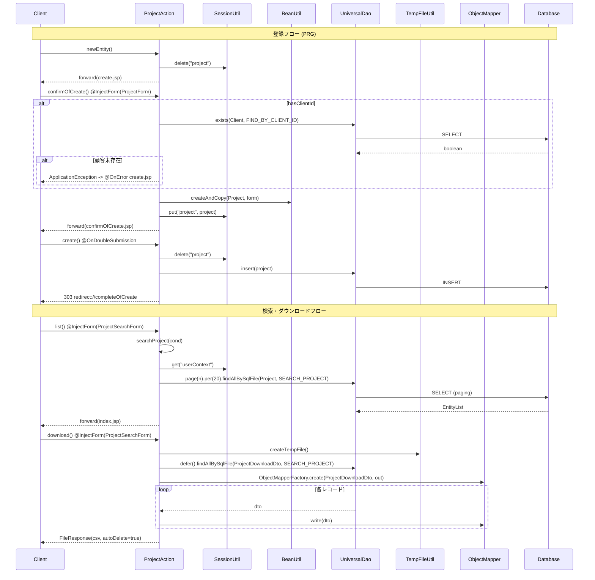

# Code Analysis: ProjectAction

**Generated**: 2026-04-24 15:03:14
**Target**: プロジェクトの検索・登録・更新・削除・CSVダウンロードを提供するWebアクション
**Modules**: nablarch-example-web
**Analysis Duration**: approx. 2m 25s

---

## Overview

`ProjectAction` はプロジェクトのCRUD機能およびCSVダウンロードを担当するウェブアクションである。登録・更新・削除画面のフロー、一覧検索とページング、遅延ロードを用いたCSVダウンロード、二重サブミット防止といった典型的な業務Webシナリオを Nablarch の `UniversalDao`・`SessionUtil`・`BeanUtil`・`@InjectForm`・`@OnError`・`@OnDoubleSubmission`・`ObjectMapper`・`FileResponse` を組み合わせて実装している。

---

## Architecture

### Dependency Graph

```mermaid
classDiagram
    class ProjectAction
    class ProjectForm
    class ProjectSearchForm
    class ProjectTargetForm
    class ProjectUpdateForm
    class ProjectDto
    class ProjectSearchDto
    class ProjectDownloadDto
    class Project
    class Client
    class LoginUserPrincipal
    class ProjectProfit
    class TempFileUtil
    class UniversalDao {
        <<Nablarch>>
    }
    class DeferredEntityList {
        <<Nablarch>>
    }
    class ObjectMapper {
        <<Nablarch>>
    }
    class ObjectMapperFactory {
        <<Nablarch>>
    }
    class FileResponse {
        <<Nablarch>>
    }
    class SessionUtil {
        <<Nablarch>>
    }
    class BeanUtil {
        <<Nablarch>>
    }
    class ApplicationException {
        <<Nablarch>>
    }
    class MessageUtil {
        <<Nablarch>>
    }
    class InjectForm {
        <<Nablarch>>
    }
    class OnError {
        <<Nablarch>>
    }
    class OnDoubleSubmission {
        <<Nablarch>>
    }

    ProjectAction ..> ProjectForm : validates
    ProjectAction ..> ProjectSearchForm : validates
    ProjectAction ..> ProjectTargetForm : validates
    ProjectAction ..> ProjectUpdateForm : validates
    ProjectAction ..> ProjectDto : transfers
    ProjectAction ..> ProjectSearchDto : transfers
    ProjectAction ..> ProjectDownloadDto : transfers
    ProjectAction ..> Project : persists
    ProjectAction ..> Client : queries
    ProjectAction ..> LoginUserPrincipal : reads
    ProjectAction ..> ProjectProfit : creates
    ProjectAction ..> TempFileUtil : uses
    ProjectAction ..> UniversalDao : queries
    ProjectAction ..> DeferredEntityList : iterates
    ProjectAction ..> ObjectMapper : writes
    ProjectAction ..> ObjectMapperFactory : creates
    ProjectAction ..> FileResponse : returns
    ProjectAction ..> SessionUtil : stores
    ProjectAction ..> BeanUtil : copies
    ProjectAction ..> ApplicationException : throws
    ProjectAction ..> MessageUtil : creates
    ProjectAction ..> InjectForm : annotated
    ProjectAction ..> OnError : annotated
    ProjectAction ..> OnDoubleSubmission : annotated
```



**Note**: This diagram uses Mermaid `classDiagram` syntax to show class names and their relationships. Use `--|>` for inheritance (extends/implements) and `..>` for dependencies (uses/creates).

### Component Summary

| Component | Role | Type | Dependencies |
|-----------|------|------|--------------|
| ProjectAction | プロジェクトのCRUD・ダウンロード処理 | Action | ProjectForm, ProjectSearchForm, ProjectTargetForm, ProjectUpdateForm, UniversalDao, SessionUtil, BeanUtil, ObjectMapper, FileResponse |
| ProjectForm | 登録画面入力のバリデーション | Form | - |
| ProjectSearchForm | 検索条件入力のバリデーション | Form | - |
| ProjectTargetForm | 詳細・編集遷移時のID指定 | Form | - |
| ProjectUpdateForm | 更新画面入力のバリデーション | Form | - |
| ProjectDto / ProjectSearchDto / ProjectDownloadDto | 画面・検索・ダウンロード用DTO | DTO | - |
| Project / Client | プロジェクト・顧客エンティティ | Entity | - |
| LoginUserPrincipal | ログインユーザ情報 | SessionObject | - |
| ProjectProfit | 利益計算用のリクエストスコープ値 | ValueObject | Project |
| TempFileUtil | 一時ファイル生成・OutputStream発行 | Utility | - |
| UniversalDao | DBアクセス（検索・登録・更新・削除・ページング・遅延ロード） | Nablarch | Project, Client |
| ObjectMapper / ObjectMapperFactory | BeanからCSVへの変換 | Nablarch | ProjectDownloadDto |
| FileResponse | 一時ファイルをHTTPレスポンスとして返却 | Nablarch | - |
| SessionUtil | セッションスコープへの出し入れ | Nablarch | - |
| BeanUtil | Bean 間プロパティコピー | Nablarch | - |
| @InjectForm / @OnError / @OnDoubleSubmission | バリデーション・例外遷移・二重サブミット防止 | Nablarch | - |

---

## Flow

### Processing Flow

**登録フロー**: `newEntity()` (Line 47-52) でセッションをクリアし入力画面を表示 → `confirmOfCreate()` (Line 62-88) で `@InjectForm(ProjectForm)` によるバリデーション後、`UniversalDao.exists()` で顧客IDの存在確認、`BeanUtil.createAndCopy()` で `Project` を生成し `SessionUtil.put()` で保持、`ProjectProfit` を計算してリクエストスコープへ → `create()` (Line 96-102) で `@OnDoubleSubmission` により二重実行を防止しつつ `UniversalDao.insert()`、完了画面へ303リダイレクト → `completeOfCreate()` (Line 110-112)。入力画面へ戻る際は `backToNew()` (Line 120-136) が `SessionUtil.get()` と `UniversalDao.findById()` で顧客名を再設定する。

**検索・一覧フロー**: `index()` (Line 144-156) で初期ページ番号とソートキーを設定し `searchProject()` を呼び出す。`list()` (Line 164-172) は `@InjectForm(ProjectSearchForm)` 経由の検索条件で同様に検索する。private ヘルパー `searchProject()` (Line 183-192) はログインユーザIDを条件に付与し、`UniversalDao.page().per().findAllBySqlFile()` でページング検索を行う。

**ダウンロードフロー**: `download()` (Line 201-224) は `TempFileUtil.createTempFile()` で一時ファイルを作成し、`try-with-resources` 内で `UniversalDao.defer().findAllBySqlFile()` の `DeferredEntityList` と `ObjectMapperFactory.create()` の `ObjectMapper` を束ねて逐次書き込み、`FileResponse` を `autoDelete=true` で返却する。

**詳細・編集フロー**: `show()` (Line 232-250) と `edit()` (Line 258-276) は `@InjectForm(ProjectTargetForm)` でID受領後 `UniversalDao.findBySqlFile(ProjectDto, "FIND_BY_PROJECT")` を実行。`edit()` は `SessionUtil.put()` で編集中の `Project` を保持する。

**更新フロー**: `confirmOfUpdate()` (Line 285-310) → `backToEdit()` (Line 318-333) / `update()` (Line 341-347) → `completeOfUpdate()` (Line 355-357)。`update()`・`delete()` (Line 365-370) ・`create()` はいずれも `@OnDoubleSubmission` を付与し、処理直後に 303 リダイレクトで PRG パターンを実現する。

### Sequence Diagram



---

## Components

### ProjectAction

**Role**: プロジェクトのCRUD・CSVダウンロードを提供する Web アクションクラス。各メソッドが 1 リクエストに対応し、Nablarch の `@InjectForm`/`@OnError`/`@OnDoubleSubmission` を使って横断関心事を宣言的に扱う。

**Key methods**:
- `confirmOfCreate(HttpRequest, ExecutionContext)` (Line 62-88): `ProjectForm` のバリデーション後、顧客ID存在確認、`Project` を生成しセッション保存、`ProjectProfit` をリクエストスコープに設定。
- `create(HttpRequest, ExecutionContext)` (Line 96-102): `@OnDoubleSubmission` 付き、`SessionUtil.delete` で取り出した `Project` を `UniversalDao.insert()` し 303 リダイレクト。
- `searchProject(ProjectSearchDto, ExecutionContext)` (Line 183-192): private ヘルパー。`UniversalDao.page().per(20L).findAllBySqlFile()` でページング検索を行う。
- `download(HttpRequest, ExecutionContext)` (Line 201-224): `UniversalDao.defer()` + `DeferredEntityList` + `ObjectMapper` の try-with-resources でストリーミングCSV出力、`FileResponse` で返却。
- `show(HttpRequest, ExecutionContext)` (Line 232-250) / `edit(HttpRequest, ExecutionContext)` (Line 258-276): `UniversalDao.findBySqlFile(ProjectDto, "FIND_BY_PROJECT")` による単一取得。`edit` は `SessionUtil.put("project", Project)` で編集対象を保持する。

**Dependencies**: Project, Client, ProjectForm/SearchForm/TargetForm/UpdateForm, ProjectDto/SearchDto/DownloadDto, LoginUserPrincipal, TempFileUtil, ProjectProfit, UniversalDao, DeferredEntityList, ObjectMapper(Factory), FileResponse, SessionUtil, BeanUtil, ApplicationException, MessageUtil。

**File**: [ProjectAction.java](../../.lw/nab-official/v6/nablarch-example-web/src/main/java/com/nablarch/example/app/web/action/ProjectAction.java)

---

## Nablarch Framework Usage

### UniversalDao

**Class**: `nablarch.common.dao.UniversalDao`

**Description**: Entity ベースのCRUD・SQLファイル検索・ページング・遅延ロードを提供するDAOファサード。

**Usage**:
```java
// 登録・更新・削除
UniversalDao.insert(project);
UniversalDao.update(targetProject);
UniversalDao.delete(project);

// 主キー検索・SQLファイル検索
Client client = UniversalDao.findById(Client.class, dto.getClientId());
ProjectDto dto = UniversalDao.findBySqlFile(ProjectDto.class, "FIND_BY_PROJECT",
        new Object[] {Integer.parseInt(targetForm.getProjectId()), userId});

// ページング検索
UniversalDao.page(pageNumber).per(20L)
        .findAllBySqlFile(Project.class, "SEARCH_PROJECT", searchCondition);

// 遅延ロード（大量データ向け）
try (DeferredEntityList<ProjectDownloadDto> list = (DeferredEntityList<ProjectDownloadDto>)
        UniversalDao.defer().findAllBySqlFile(ProjectDownloadDto.class, "SEARCH_PROJECT", cond)) {
    for (ProjectDownloadDto dto : list) { ... }
}
```

**Important points**:
- ✅ **SQLファイルはBeanから導出**: `User.class` に対して `sample/entity/User.sql` が対応する。SQL IDを第2引数で指定する。
- ⚠️ **遅延ロードは`close()`必須**: 内部でサーバサイドカーソルを使うため `DeferredEntityList` を必ず `try-with-resources` でクローズする。RDBMSによってはトランザクション制御でカーソルが閉じるため、遅延ロード中のトランザクション制御に注意。
- 💡 **ページング**: `page()`・`per()` 呼び出し後に検索するだけで、画面表示に必要な件数情報が `Pagination` として取得できる。件数取得SQLが別途発行されるため、性能劣化時は件数取得SQLの差し替えを検討する。

**Usage in this code**:
- `create()`/`update()`/`delete()` で `insert/update/delete`（Line 101, 346, 369）。
- 一覧検索の `searchProject()` で `page().per(20L).findAllBySqlFile()`（Line 189-191）。
- CSVダウンロードの `download()` で `defer().findAllBySqlFile()` と `DeferredEntityList` を try-with-resources で利用（Line 211-213）。
- 登録/更新確認の顧客IDチェック (`confirmOfCreate`/`confirmOfUpdate`) で `exists(Client.class, "FIND_BY_CLIENT_ID", ...)` （Line 68, 289）、`backToNew`/`backToEdit` で `findById(Client.class, ...)`（Line 130, 329）。

**Details**: [Libraries Universal Dao](../../.claude/skills/nabledge-6/docs/component/libraries/libraries-universal-dao.md)

### @InjectForm / @OnError

**Class**: `nablarch.common.web.interceptor.InjectForm` / `nablarch.fw.web.interceptor.OnError`

**Description**: リクエストメソッドに対してフォームバインディング・バリデーションを行い、エラー時の遷移先を宣言的に指定する。

**Usage**:
```java
@InjectForm(form = ProjectForm.class, prefix = "form")
@OnError(type = ApplicationException.class, path = "/WEB-INF/view/project/create.jsp")
public HttpResponse confirmOfCreate(HttpRequest request, ExecutionContext context) {
    ProjectForm form = context.getRequestScopedVar("form");
    // ...
}
```

**Important points**:
- ✅ **名前付きフォーム**: `name` 属性で複数フォームを共存させられる（`list`/`download` では `name = "searchForm"`）。
- ⚠️ **リクエストスコープから取得**: バリデーション後は `context.getRequestScopedVar("form")` でフォームを取り出す。`name` 未指定時はキーが `form`。
- 💡 **@OnError と併用**: `ApplicationException` 送出時に `path` で指定した画面へフォワードし、入力値付きで再表示できる。プルダウン等のデータ再取得が必要な場合は `forward://` で内部フォワード可能。

**Usage in this code**:
- `confirmOfCreate` (Line 62-64) と `confirmOfUpdate` (Line 285-287) で `@InjectForm` + `@OnError(path=create.jsp/update.jsp)` により、顧客ID不存在時の `ApplicationException` を入力画面に戻す。
- `list`/`download` は `@InjectForm(ProjectSearchForm, name="searchForm")` で検索条件を受け、`@OnError(path=index.jsp)` で一覧に戻す。
- `show`/`edit` は `@InjectForm(ProjectTargetForm)` だけを付け、ID 指定のバリデーションのみを行う。

**Details**: [Handlers InjectForm](../../.claude/skills/nabledge-6/docs/component/handlers/handlers-InjectForm.md) / [Handlers On Error](../../.claude/skills/nabledge-6/docs/component/handlers/handlers-on-error.md)

### @OnDoubleSubmission

**Class**: `nablarch.common.web.token.OnDoubleSubmission`

**Description**: 業務アクションのリクエスト処理メソッドに付与して二重サブミットを防止するアノテーション。`BasicDoubleSubmissionHandler` と組み合わせて遷移先やメッセージIDのデフォルト値を設定できる。

**Usage**:
```java
@OnDoubleSubmission
public HttpResponse create(HttpRequest request, ExecutionContext context) {
    final Project project = SessionUtil.delete(context, "project");
    UniversalDao.insert(project);
    return new HttpResponse(303, "redirect://completeOfCreate");
}
```

**Important points**:
- ✅ **path必須**: `@OnDoubleSubmission` か `BasicDoubleSubmissionHandler` の少なくとも一方で `path` を指定しないと、二重サブミット検知時にシステムエラーとなる。
- ⚠️ **トークン埋め込み**: サーバ側の二重サブミット防止を使う場合、入力フォームに `nablarch_token` を `nablarch_request_token` の値で埋め込む必要がある。
- 💡 **アプリ共通設定**: `BasicDoubleSubmissionHandler` をコンポーネント定義に追加しておけば、アノテーション未指定時のデフォルトのリソースパス・メッセージID・ステータスコードを共通化できる。

**Usage in this code**:
- `create()` (Line 96)、`update()` (Line 341)、`delete()` (Line 365) の書き込み系アクションに付与。処理完了後はいずれも 303 リダイレクトで PRG パターンを完結させる。

**Details**: [Handlers On Double Submission](../../.claude/skills/nabledge-6/docs/component/handlers/handlers-on-double-submission.md) / [Handlers Use Token](../../.claude/skills/nabledge-6/docs/component/handlers/handlers-use-token.md)

### ObjectMapper / FileResponse (data-bind)

**Class**: `nablarch.common.databind.ObjectMapper` / `nablarch.common.databind.ObjectMapperFactory` / `nablarch.common.web.download.FileResponse`

**Description**: Java Beans を CSV/TSV/固定長などのデータファイルへ書き込み、`FileResponse` で一時ファイルをHTTPレスポンスとして返却する。

**Usage**:
```java
final Path path = TempFileUtil.createTempFile();
try (DeferredEntityList<ProjectDownloadDto> list = (DeferredEntityList<ProjectDownloadDto>)
            UniversalDao.defer().findAllBySqlFile(ProjectDownloadDto.class, "SEARCH_PROJECT", cond);
     ObjectMapper<ProjectDownloadDto> mapper =
            ObjectMapperFactory.create(ProjectDownloadDto.class, TempFileUtil.newOutputStream(path))) {
    for (ProjectDownloadDto dto : list) {
        mapper.write(dto);
    }
}
FileResponse response = new FileResponse(path.toFile(), true);
response.setContentType("text/csv; charset=Shift_JIS");
response.setContentDisposition("プロジェクト一覧.csv");
```

**Important points**:
- ✅ **必ず`close()`**: `ObjectMapper` はバッファフラッシュと解放が必要。try-with-resources で確実に閉じる。
- ⚠️ **大量データは一時ファイルへ**: メモリ展開を避けるため、`DeferredEntityList` と組み合わせて一時ファイルへストリーミング出力する。
- 💡 **自動削除**: `FileResponse` の第2引数に `true` を指定すると、レスポンス送信後に一時ファイルを自動削除できる。Content-Type / Content-Disposition の設定を忘れない。

**Usage in this code**:
- `download()` (Line 201-224) で `TempFileUtil.createTempFile()` により一時ファイルを確保し、`UniversalDao.defer()` と `ObjectMapperFactory.create()` を単一の try-with-resources に束ねて CSV を逐次出力。`FileResponse(path.toFile(), true)` で自動削除しつつ Shift_JIS / `プロジェクト一覧.csv` を返却する。

**Details**: [Libraries Data Bind](../../.claude/skills/nabledge-6/docs/component/libraries/libraries-data-bind.md)

### SessionUtil / BeanUtil / ApplicationException

**Class**: `nablarch.common.web.session.SessionUtil` / `nablarch.core.beans.BeanUtil` / `nablarch.core.message.ApplicationException` + `MessageUtil`

**Description**: セッション管理・Bean プロパティコピー・業務例外とメッセージ生成のユーティリティ群。

**Usage**:
```java
SessionUtil.delete(context, "project");
SessionUtil.put(context, "project", project);
LoginUserPrincipal userContext = SessionUtil.get(context, "userContext");

Project project = BeanUtil.createAndCopy(Project.class, form);
BeanUtil.copy(form, project);

throw new ApplicationException(
    MessageUtil.createMessage(MessageLevel.ERROR, "errors.nothing.client",
        Client.class.getSimpleName(), form.getClientId()));
```

**Important points**:
- ✅ **セッションキーの掃除**: 登録・更新のエントリメソッド (`newEntity`/`edit`) で `SessionUtil.delete` を呼び、前回残留データを排除する。
- 🎯 **BeanUtil使い分け**: 新規オブジェクト生成は `createAndCopy`、既存オブジェクトへの上書きは `copy`。Form→Entity、Entity→Dto、Form→Dto の3方向で利用されている。
- 💡 **ApplicationException + @OnError**: `ApplicationException` を投げれば `@OnError(path=...)` が指定画面に戻し、`MessageUtil.createMessage` で生成したメッセージID付きエラーをユーザーに提示できる。

**Usage in this code**:
- `SessionUtil`: `newEntity`/`edit` での削除、`confirmOfCreate`/`edit` での `put("project", project)`、`create`/`update`/`delete`/`backToNew`/`backToEdit` での取得。`SessionUtil.get(context, "userContext")` でログインユーザ情報を各所で参照。
- `BeanUtil`: Form→Project (`confirmOfCreate`)、Project→ProjectDto (`backToNew`/`backToEdit`)、Form→ProjectSearchDto (`index`/`list`/`download`)、Form→既存Project (`confirmOfUpdate` で `copy`)。
- `ApplicationException` + `MessageUtil`: `confirmOfCreate`/`confirmOfUpdate` の顧客IDチェック不一致時に `errors.nothing.client` メッセージで送出。`@OnError` が入力画面に戻す。

**Details**: [Libraries Universal Dao](../../.claude/skills/nabledge-6/docs/component/libraries/libraries-universal-dao.md) / [Handlers On Error](../../.claude/skills/nabledge-6/docs/component/handlers/handlers-on-error.md)

---

## References

### Source Files

- [ProjectAction.java (.lw/nab-official/v5/nablarch-example-rest/src/main/java/com/nablarch/example/action)](../../.lw/nab-official/v5/nablarch-example-rest/src/main/java/com/nablarch/example/action/ProjectAction.java) - ProjectAction
- [ProjectAction.java (.lw/nab-official/v5/nablarch-example-web/src/main/java/com/nablarch/example/app/web/action)](../../.lw/nab-official/v5/nablarch-example-web/src/main/java/com/nablarch/example/app/web/action/ProjectAction.java) - ProjectAction
- [ProjectAction.java (.lw/nab-official/v6/nablarch-example-rest/src/main/java/com/nablarch/example/action)](../../.lw/nab-official/v6/nablarch-example-rest/src/main/java/com/nablarch/example/action/ProjectAction.java) - ProjectAction
- [ProjectAction.java (.lw/nab-official/v6/nablarch-example-web/src/main/java/com/nablarch/example/app/web/action)](../../.lw/nab-official/v6/nablarch-example-web/src/main/java/com/nablarch/example/app/web/action/ProjectAction.java) - ProjectAction

### Knowledge Base (Nabledge-6)

- [Libraries Universal Dao](../../.claude/skills/nabledge-6/docs/component/libraries/libraries-universal-dao.md)
- [Libraries Data Bind](../../.claude/skills/nabledge-6/docs/component/libraries/libraries-data-bind.md)
- [Handlers On Double Submission](../../.claude/skills/nabledge-6/docs/component/handlers/handlers-on-double-submission.md)
- [Handlers InjectForm](../../.claude/skills/nabledge-6/docs/component/handlers/handlers-InjectForm.md)
- [Handlers On Error](../../.claude/skills/nabledge-6/docs/component/handlers/handlers-on-error.md)
- [Handlers Use Token](../../.claude/skills/nabledge-6/docs/component/handlers/handlers-use-token.md)

### Official Documentation

(No official documentation links available)

---

**Output**: `.nabledge/20260424/code-analysis-ProjectAction.md`

**Note**: This documentation was generated by the code-analysis workflow of the nabledge-6 skill.
